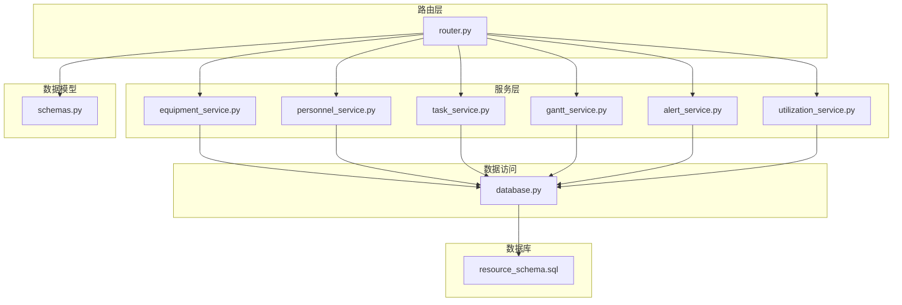
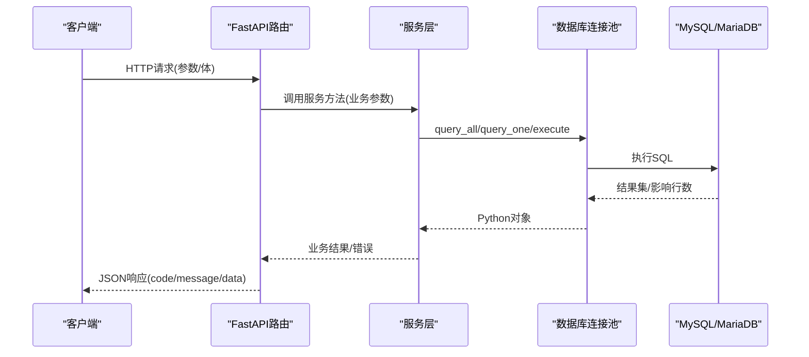
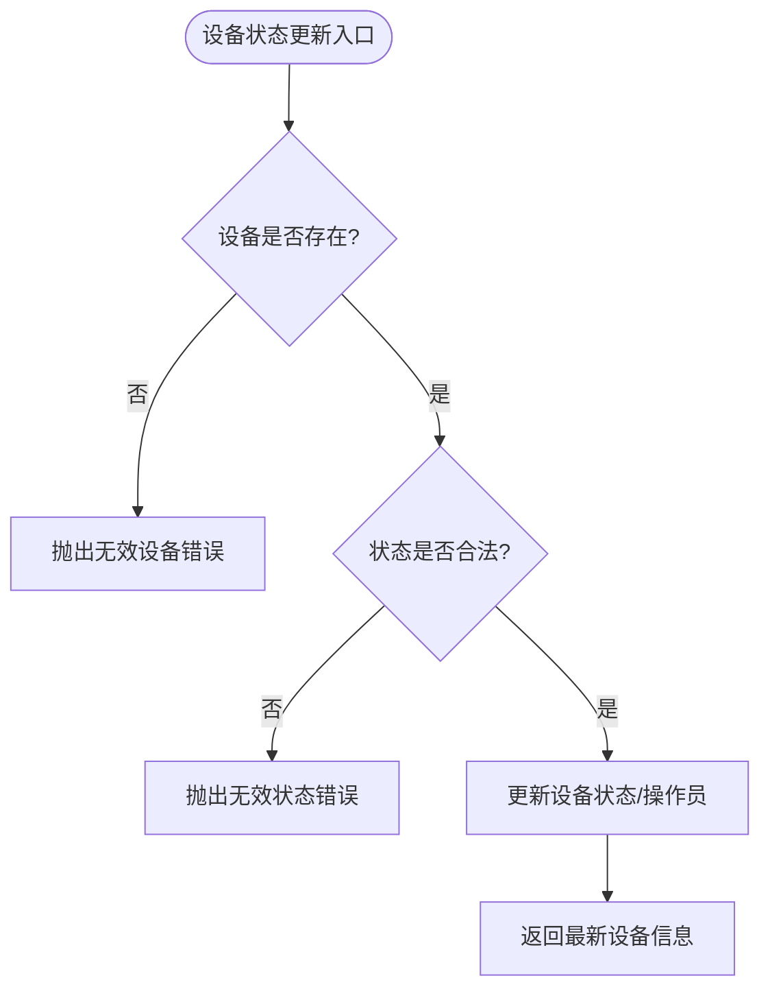
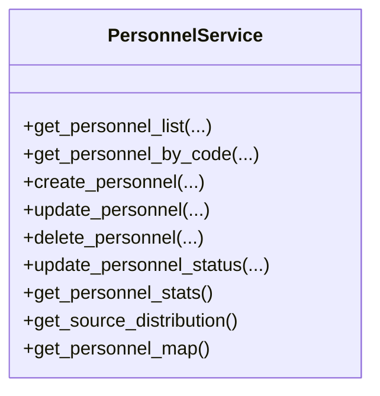
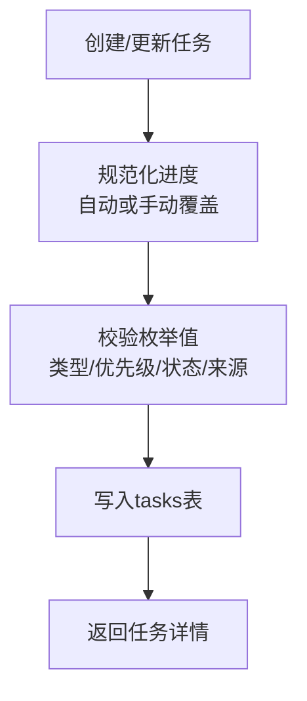
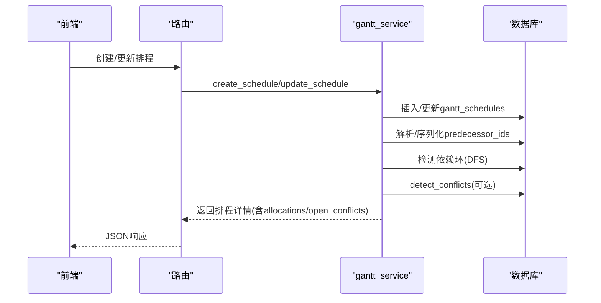
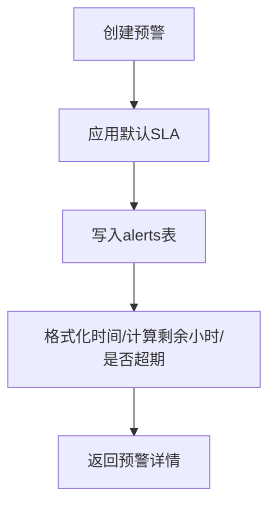
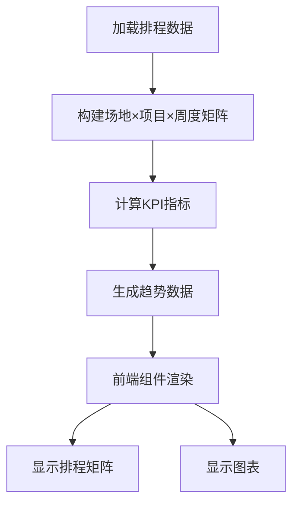
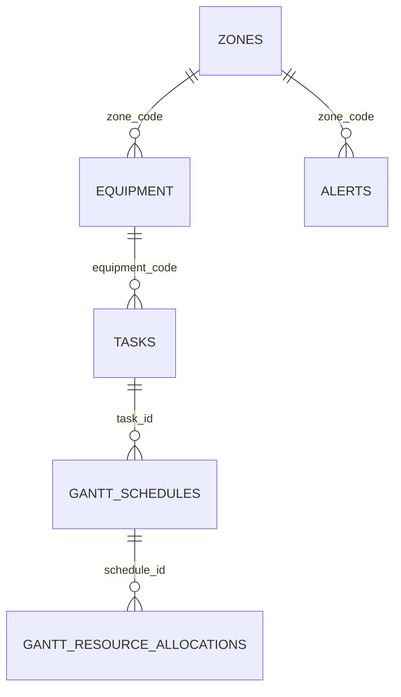

# 资源管理模块

<cite>
**本文引用的文件**
- [router.py](file://backend/modules/resource/router.py)
- [schemas.py](file://backend/modules/resource/schemas.py)
- [equipment_service.py](file://backend/modules/resource/services/equipment_service.py)
- [personnel_service.py](file://backend/modules/resource/services/personnel_service.py)
- [task_service.py](file://backend/modules/resource/services/task_service.py)
- [gantt_service.py](file://backend/modules/resource/services/gantt_service.py)
- [alert_service.py](file://backend/modules/resource/services/alert_service.py)
- [utilization_service.py](file://backend/modules/resource/services/utilization_service.py)
- [resource_schema.sql](file://backend/sql/resource_schema.sql)
- [database.py](file://backend/database.py)
- [ResourceBoardPage.tsx](file://webui_ref/client/src/pages/ResourceBoardPage/ResourceBoardPage.tsx)
</cite>

## 更新摘要
**变更内容**
- 新增资源占用看板服务层（utilization_service.py），提供场地×项目×周度排程矩阵、KPI统计与设备利用率排名
- 完善甘特图排程服务层（gantt_service.py），实现冲突检测、依赖环检测、关键路径计算等核心算法
- 增强异常预警服务层（alert_service.py），支持SLA计时、升级机制、批量处理与趋势统计
- 扩展数据库架构，新增alerts表、gantt_schedules表、gantt_resource_allocations表、gantt_conflicts表
- 完整前端ResourceBoardPage实现，包含筛选器、矩阵展示、图表可视化等功能
- 新增多个API接口：资源占用看板、设备利用率排名、预警管理等

## 目录
1. [简介](#简介)
2. [项目结构](#项目结构)
3. [核心组件](#核心组件)
4. [架构总览](#架构总览)
5. [详细组件分析](#详细组件分析)
6. [依赖关系分析](#依赖关系分析)
7. [性能考虑](#性能考虑)
8. [故障排查指南](#故障排查指南)
9. [结论](#结论)
10. [附录：API接口规范与示例](#附录api接口规范与示例)

## 简介
本模块为"试制资源数智化管理系统"的资源管理子系统，围绕设备、人员、任务、排程调度、异常预警与资源占用看板六大能力提供统一的REST API与服务层实现。模块通过FastAPI路由暴露接口，服务层封装业务逻辑与数据访问，数据库层基于MySQL/MariaDB并通过连接池进行高效读写。重点能力包括：
- 设备台账与状态监控、维护记录管理
- 人员看板（在岗/空闲/离线）、位置分布、来源分布与人效统计
- 任务全生命周期管理（创建、更新、删除、查询、统计）
- 甘特图排程（计划、依赖、冲突检测、关键路径标记、资源分配）
- 异常预警（SLA、升级、批量处理、趋势统计）
- 资源占用看板（场地×项目×周度排程矩阵、KPI统计、设备利用率排名）

## 项目结构
资源管理模块位于 backend/modules/resource，采用"路由-服务-数据模型-数据库"的分层组织：
- 路由层：定义HTTP端点、参数校验、统一响应格式
- 服务层：实现CRUD、业务规则、统计计算、冲突检测等
- 数据模型：Pydantic模型用于请求/响应结构约束
- 数据库：SQL脚本定义表结构；database.py提供连接池与通用SQL方法

**图表来源**
- [router.py:1-1565](file://backend/modules/resource/router.py#L1-L1565)
- [equipment_service.py:1-495](file://backend/modules/resource/services/equipment_service.py#L1-L495)
- [personnel_service.py:1-475](file://backend/modules/resource/services/personnel_service.py#L1-L475)
- [task_service.py:1-432](file://backend/modules/resource/services/task_service.py#L1-L432)
- [gantt_service.py:1-1427](file://backend/modules/resource/services/gantt_service.py#L1-L1427)
- [alert_service.py:1-396](file://backend/modules/resource/services/alert_service.py#L1-L396)
- [utilization_service.py:1-429](file://backend/modules/resource/services/utilization_service.py#L1-L429)
- [schemas.py:1-224](file://backend/modules/resource/schemas.py#L1-L224)
- [database.py:1-116](file://backend/database.py#L1-L116)
- [resource_schema.sql:1-326](file://backend/sql/resource_schema.sql#L1-L326)

**章节来源**
- [router.py:1-1565](file://backend/modules/resource/router.py#L1-L1565)
- [schemas.py:1-224](file://backend/modules/resource/schemas.py#L1-L224)

## 核心组件
- 设备管理：设备台账、状态变更、维护记录、统计数据
- 人员管理：人员信息、状态切换、位置分布、来源分布、看板KPI
- 任务管理：任务CRUD、进度自动/手动覆盖、统计与分布
- 排程调度：甘特图计划、依赖关系、冲突检测、资源分配、关键路径
- 异常预警：预警录入、SLA计时、升级、批量处理、趋势统计
- 资源占用看板：场地×项目×周度排程矩阵、KPI汇总、设备利用率排名

**章节来源**
- [equipment_service.py:1-495](file://backend/modules/resource/services/equipment_service.py#L1-L495)
- [personnel_service.py:1-475](file://backend/modules/resource/services/personnel_service.py#L1-L475)
- [task_service.py:1-432](file://backend/modules/resource/services/task_service.py#L1-L432)
- [gantt_service.py:1-1427](file://backend/modules/resource/services/gantt_service.py#L1-L1427)
- [alert_service.py:1-396](file://backend/modules/resource/services/alert_service.py#L1-L396)
- [utilization_service.py:1-429](file://backend/modules/resource/services/utilization_service.py#L1-L429)

## 架构总览
整体调用链遵循"HTTP请求 -> FastAPI路由 -> 服务层 -> 数据库层 -> 返回JSON"。所有写操作均通过database.execute或execute_last_id提交事务；读操作使用query_all/query_one获取结果集。服务层负责业务校验、数据规范化、统计计算与复杂算法（如冲突检测）。

**图表来源**
- [router.py:1-1565](file://backend/modules/resource/router.py#L1-L1565)
- [database.py:1-116](file://backend/database.py#L1-L116)

## 详细组件分析

### 设备管理
- 功能范围：设备CRUD、状态更新、维护记录、设备统计
- 关键流程：
  - 列表查询：支持按状态、区域、类型、关键词筛选与分页
  - 详情查询：关联区域名称与当前任务名称
  - 状态更新：校验有效状态集合，可选记录操作员
  - 维护记录：创建与维护状态流转（进行中/完成/取消），自动补结束时间
- 数据流：
  - 路由接收请求并转发至服务层
  - 服务层构建动态WHERE条件，执行计数与分页查询
  - 时间字段格式化后返回前端

**图表来源**
- [equipment_service.py:262-301](file://backend/modules/resource/services/equipment_service.py#L262-L301)

**章节来源**
- [router.py:58-303](file://backend/modules/resource/router.py#L58-L303)
- [equipment_service.py:11-495](file://backend/modules/resource/services/equipment_service.py#L11-L495)
- [resource_schema.sql:13-29](file://backend/sql/resource_schema.sql#L13-L29)
- [resource_schema.sql:186-199](file://backend/sql/resource_schema.sql#L186-L199)

### 人员管理
- 功能范围：人员CRUD、状态快速切换、看板KPI、来源分布、地图位置
- 关键流程：
  - 列表查询：支持状态、所在区域、部门来源、关键词筛选与分页
  - 装配区判断：仅装配区显示"来源"列，非装配区留白
  - 看板统计：在岗人数、空闲可调配、离线异常、区域分布
  - 地图数据：各区域人员数量与明细
- 数据流：
  - 列表与详情JOIN zones与tasks，补充展示字段
  - 统计类接口聚合status、zone等维度

**图表来源**
- [personnel_service.py:24-475](file://backend/modules/resource/services/personnel_service.py#L24-L475)

**章节来源**
- [router.py:333-579](file://backend/modules/resource/router.py#L333-L579)
- [personnel_service.py:1-475](file://backend/modules/resource/services/personnel_service.py#L1-L475)
- [resource_schema.sql:50-66](file://backend/sql/resource_schema.sql#L50-L66)

### 任务管理
- 功能范围：任务CRUD、进度自动/手动覆盖、统计与分布
- 关键流程：
  - 列表查询：支持任务类型、试制类别、状态、优先级、区域/场地、关键词筛选
  - 进度计算：若未手动覆盖，则根据实际工时/计划工时自动计算进度
  - 统计：状态分布、优先级分布、类型分布、计划与实际工时汇总、平均进度
- 数据流：
  - 列表与详情JOIN zones与equipment，补充名称
  - 数值字段Decimal转float便于前端消费

**图表来源**
- [task_service.py:21-46](file://backend/modules/resource/services/task_service.py#L21-L46)
- [task_service.py:177-237](file://backend/modules/resource/services/task_service.py#L177-L237)
- [task_service.py:240-277](file://backend/modules/resource/services/task_service.py#L240-L277)

**章节来源**
- [router.py:581-800](file://backend/modules/resource/router.py#L581-L800)
- [task_service.py:1-432](file://backend/modules/resource/services/task_service.py#L1-L432)
- [resource_schema.sql:71-109](file://backend/sql/resource_schema.sql#L71-L109)

### 排程调度（甘特图）
- 功能范围：排程计划CRUD、依赖关系、冲突检测、资源分配、关键路径标记、看板统计
- 关键流程：
  - 列表与详情：支持多条件筛选、关键字搜索、日期范围过滤
  - 依赖关系：支持前置ID列表（逗号或JSON），更新时进行环检测
  - 冲突检测：识别资源重叠、时间重叠、依赖缺失、截止风险、过载等，生成冲突记录
  - 资源分配：为排程分配设备/人员/区域/举升机等资源，支持批量分配
  - 进度与工时：根据起止时间自动计算计划工时，支持手动覆盖进度
- 数据流：
  - gantt_schedules为主表，gantt_resource_allocations为资源分配明细，gantt_conflicts为冲突记录
  - 统计接口聚合状态、类型、场地、阶段、周趋势等

**图表来源**
- [gantt_service.py:396-525](file://backend/modules/resource/services/gantt_service.py#L396-L525)
- [gantt_service.py:553-605](file://backend/modules/resource/services/gantt_service.py#L553-L605)
- [gantt_service.py:775-800](file://backend/modules/resource/services/gantt_service.py#L775-L800)

**章节来源**
- [gantt_service.py:1-1427](file://backend/modules/resource/services/gantt_service.py#L1-L1427)
- [resource_schema.sql:204-325](file://backend/sql/resource_schema.sql#L204-L325)

### 异常预警
- 功能范围：预警CRUD、SLA计时、升级、批量处理、趋势统计
- 关键流程：
  - 列表查询：支持类型、级别、状态、来源、区域、场地、处理人、时间范围、超期过滤
  - SLA计算：根据raised_at与sla_hours计算剩余小时与是否超期（软计算）
  - 升级：记录升级目标与备注时间戳
  - 批量处理：批量更新状态并自动填充介入/解决/关闭时间
- 数据流：
  - alerts表存储预警主数据，JOIN zones补充区域名称
  - 统计接口输出级别/状态/类型分布、近7天趋势、升级数量等

**图表来源**
- [alert_service.py:188-254](file://backend/modules/resource/services/alert_service.py#L188-L254)
- [alert_service.py:143-172](file://backend/modules/resource/services/alert_service.py#L143-L172)

**章节来源**
- [alert_service.py:1-396](file://backend/modules/resource/services/alert_service.py#L1-L396)
- [resource_schema.sql:114-163](file://backend/sql/resource_schema.sql#L114-L163)

### 资源占用看板
- 功能范围：场地×项目×周度排程矩阵、KPI统计、设备利用率排名、趋势分析
- 关键流程：
  - 矩阵构建：按场地分组项目，计算每周排程状态（done/doing/wait/plan）
  - KPI计算：场地总数、项目排程、设备数、预算、采购、场地占用率
  - 趋势分析：周度占用率趋势、设备利用率排名
  - 前端展示：React组件实现筛选器、矩阵表格、图表可视化
- 数据流：
  - utilization_service从gantt_schedules或tasks表加载排程数据
  - 结合zones表获取场地信息，PROJECT_META补充项目元数据
  - 前端ResourceBoardPage组件渲染矩阵与图表

**图表来源**
- [utilization_service.py:235-334](file://backend/modules/resource/services/utilization_service.py#L235-L334)
- [ResourceBoardPage.tsx:149-660](file://webui_ref/client/src/pages/ResourceBoardPage/ResourceBoardPage.tsx#L149-L660)

**章节来源**
- [utilization_service.py:1-429](file://backend/modules/resource/services/utilization_service.py#L1-L429)
- [ResourceBoardPage.tsx:1-660](file://webui_ref/client/src/pages/ResourceBoardPage/ResourceBoardPage.tsx#L1-L660)

## 依赖关系分析
- 路由到服务：每个路由在函数体内按需导入对应服务模块，降低启动耦合
- 服务到数据库：统一通过database.py提供的连接池与SQL方法，保证事务一致性与错误回滚
- 数据模型：schemas.py定义了设备、区域、人员、任务、预警、驾驶舱的Pydantic模型，便于前后端契约
- 数据库表间关系：
  - equipment.zone_code → zones.zone_code
  - tasks.equipment_code → equipment.equipment_code
  - gantt_schedules.task_id → tasks.id
  - gantt_resource_allocations.schedule_id → gantt_schedules.id
  - alerts.zone_code → zones.zone_code

**图表来源**
- [resource_schema.sql:13-325](file://backend/sql/resource_schema.sql#L13-L325)

**章节来源**
- [resource_schema.sql:13-325](file://backend/sql/resource_schema.sql#L13-L325)

## 性能考虑
- 连接池：database.py使用PooledDB，最大连接数与缓存配置避免频繁建连开销
- 索引优化：各表对常用筛选字段建立索引（如status、priority、zone_code、created_at等）
- 分页查询：列表接口统一使用LIMIT/OFFSET，减少数据传输量
- 动态WHERE：服务层拼接条件并传入参数化SQL，避免注入与提升执行计划稳定性
- 时间字段格式化：在服务层统一转换datetime为字符串，减少前端负担
- 冲突检测：独立实现detect_conflicts，可按装配场地过滤，避免全表扫描
- 建议：
  - 对高频查询增加复合索引（如tasks.status+priority、alerts.level+raised_at）
  - 大表分页可考虑游标分页替代OFFSET
  - 冲突检测可定时任务增量刷新，降低实时压力
  - 资源占用看板可缓存周度数据，减少重复计算

[本节为通用性能建议，不直接分析具体文件]

## 故障排查指南
- 数据库连接失败：检查.env中DB_HOST/PORT/USER/PASSWORD/DATABASE是否正确；连接池初始化失败会记录日志并提示配置问题
- 数据不一致：写操作通过execute/execute_last_id提交事务，异常时自动回滚；确认服务层是否捕获并抛出明确错误
- 状态非法：服务层对枚举值进行校验，非法将抛出ValueError并被路由转换为HTTP 400
- 冲突与依赖：排程依赖更新包含环检测，若检测到循环依赖将回滚并报错；冲突检测可指定装配场地缩小范围
- 日志定位：各服务层使用logger记录关键操作与异常，结合错误堆栈定位问题
- 前端加载失败：检查API响应格式是否符合预期，确认ResourceBoardPage组件的数据绑定是否正确

**章节来源**
- [database.py:12-43](file://backend/database.py#L12-L43)
- [equipment_service.py:150-178](file://backend/modules/resource/services/equipment_service.py#L150-L178)
- [task_service.py:177-237](file://backend/modules/resource/services/task_service.py#L177-L237)
- [gantt_service.py:553-605](file://backend/modules/resource/services/gantt_service.py#L553-L605)

## 结论
资源管理模块以清晰的分层架构实现了设备、人员、任务、排程、预警与资源占用看板的核心能力，具备完善的CRUD、统计与复杂业务逻辑（进度计算、依赖环检测、冲突检测、SLA计时、矩阵计算）。通过连接池与索引优化保障性能，配合统一的路由响应格式与严格的参数校验，满足生产环境稳定运行需求。后续可进一步扩展：
- 更细粒度的权限控制与审计日志
- 异步任务与消息队列驱动的大规模冲突检测
- 更丰富的可视化指标与预测性维护
- 移动端适配与实时数据推送

[本节为总结性内容，不直接分析具体文件]

## 附录：API接口规范与示例

说明：以下列出主要端点、方法与用途，请求体字段参考路由中的Pydantic模型；响应统一包含code、message、data。

- 健康检查
  - GET /api/resource/ping
  - 用途：模块可用性探测

- 设备
  - GET /api/resource/equipment
    - 查询参数：page, page_size, status, zone_code, equipment_type, keyword
  - GET /api/resource/equipment/{equipment_code}
  - POST /api/resource/equipment
    - 请求体：equipment_code, equipment_name, equipment_type, zone_code, status
  - PUT /api/resource/equipment/{equipment_code}
    - 请求体：equipment_name, equipment_type, zone_code
  - DELETE /api/resource/equipment/{equipment_code}
  - PUT /api/resource/equipment/{equipment_code}/status
    - 请求体：status, operator
  - GET /api/resource/equipment/stats
  - GET /api/resource/equipment/{equipment_code}/maintenance
    - 查询参数：page, page_size, status
  - POST /api/resource/equipment/{equipment_code}/maintenance
    - 请求体：maintenance_type, start_time, end_time, operator, description, status
  - PUT /api/resource/equipment/maintenance/{maintenance_id}/status
    - 请求体：status, end_time

- 区域
  - GET /api/resource/zones
  - GET /api/resource/zones/map

- 人员
  - GET /api/resource/personnel
    - 查询参数：page, page_size, status, current_zone, department, keyword
  - GET /api/resource/personnel/{personnel_code}
  - POST /api/resource/personnel
    - 请求体：personnel_code, name, avatar_text, department, status, current_zone
  - PUT /api/resource/personnel/{personnel_code}
    - 请求体：name, avatar_text, department, status, current_zone, current_task_id
  - DELETE /api/resource/personnel/{personnel_code}
  - PUT /api/resource/personnel/{personnel_code}/status
    - 请求体：status, current_zone
  - GET /api/resource/personnel/stats
  - GET /api/resource/personnel/source-distribution
  - GET /api/resource/personnel/map
  - GET /api/resource/personnel/efficiency
    - 查询参数：start_date, end_date, department

- 任务
  - GET /api/resource/tasks
    - 查询参数：page, page_size, task_type, trial_type, status, priority, zone_code, assembly_site, keyword
  - GET /api/resource/tasks/{task_id}
  - POST /api/resource/tasks
    - 请求体：task_code, task_name, task_type, trial_type, project_group, project_code, vehicle_code, vehicle_model, priority, status, zone_code, assembly_site, lift_count, equipment_code, planner, pm_name, cve_name, trial_supervisor, process_supervisor, assembly_supervisor, plan_start_time, plan_end_time, plan_work_hours, actual_work_hours, progress, progress_manual_override, summer_target_count, summer_target_date, source
  - PUT /api/resource/tasks/{task_id}
    - 请求体：同创建但部分字段可选
  - DELETE /api/resource/tasks/{task_id}
  - GET /api/resource/tasks/stats
  - GET /api/resource/tasks/status-distribution

- 预警
  - GET /api/resource/alerts
    - 查询参数：page, page_size, alert_type, level, status, source, zone_code, assembly_site, handler, raised_start, raised_end, keyword, escalated_only, overdue_only
  - GET /api/resource/alerts/stats
  - GET /api/resource/alerts/{alert_id}
  - POST /api/resource/alerts
    - 请求体：alert_code, alert_type, level, title, description, source, related_type, related_id, related_name, related_equipment, related_task, related_personnel, zone_code, assembly_site, raised_by, raised_at, sla_hours, escalated, escalated_to, status, handler, handler_department, processing_started_at, resolved_at, closed_at, processing_scheme, corrective_action, preventive_measure, result_verification, loss_amount, impact_hours, attachment_count, remark
  - PUT /api/resource/alerts/{alert_id}
    - 请求体：同创建但部分字段可选
  - POST /api/resource/alerts/{alert_id}/handle
    - 请求体：handler, handler_department, processing_scheme, corrective_action, preventive_measure, result_verification, status
  - POST /api/resource/alerts/{alert_id}/escalate
    - 请求体：escalated_to, reason
  - POST /api/resource/alerts/batch
    - 请求体：ids, status, operator

- 排程（甘特）
  - GET /api/resource/gantt/data
    - 查询参数：page, page_size, task_type, status, priority, assembly_site, keyword, only_critical, only_conflict, date_from, date_to
  - GET /api/resource/gantt/stats
  - GET /api/resource/gantt/schedules/{schedule_id_or_code}
  - POST /api/resource/gantt/schedules
    - 请求体：task_name, task_type, trial_type, project_group, project_code, vehicle_code, vehicle_model, phase, priority, status, color_tag, assembly_site, zone_code, lift_count, equipment_code, planner, pm_name, cve_name, trial_supervisor, plan_start_time, plan_end_time, actual_start_time, actual_end_time, plan_work_hours, actual_work_hours, progress, progress_manual_override, parent_id, sort_order, constraint_type, constraint_date, predecessor_ids, remark, created_by, task_id, task_code
  - PUT /api/resource/gantt/schedules/{schedule_id_or_code}
    - 请求体：同创建但部分字段可选
  - DELETE /api/resource/gantt/schedules/{schedule_id_or_code}
  - PUT /api/resource/gantt/schedules/{schedule_id_or_code}/dependencies
    - 请求体：predecessor_ids
  - GET /api/resource/gantt/allocations
    - 查询参数：schedule_id_or_code, resource_type, resource_code, status
  - POST /api/resource/gantt/allocations
    - 请求体：schedule_id, resource_type, resource_code, resource_name, start_time, end_time, hours_allocated, quantity, priority, status, remark
  - DELETE /api/resource/gantt/allocations/{allocation_id}
  - POST /api/resource/gantt/allocations/batch
    - 请求体：schedule_id, allocations
  - POST /api/resource/gantt/check-conflicts
    - 请求体：assembly_site, auto_save
  - GET /api/resource/gantt/conflicts
    - 查询参数：conflict_type, severity, status, assembly_site, schedule_id, page, page_size
  - PUT /api/resource/gantt/conflicts/{conflict_id_or_code}/resolve
    - 请求体：resolution, resolved_by
  - PUT /api/resource/gantt/conflicts/{conflict_id_or_code}/ignore
    - 请求体：reason, by
  - POST /api/resource/gantt/compute-critical
  - POST /api/resource/gantt/batch-status
    - 请求体：schedule_ids, status, by

- 资源占用看板
  - GET /api/resource/utilization/board
    - 查询参数：weeks
  - GET /api/resource/utilization/trend
    - 查询参数：weeks
  - GET /api/resource/utilization/equipment-ranking
    - 查询参数：days, limit

- 驾驶舱
  - GET /api/resource/dashboard/kpi
  - GET /api/resource/dashboard/recent

**章节来源**
- [router.py:1-1565](file://backend/modules/resource/router.py#L1-L1565)
- [schemas.py:1-224](file://backend/modules/resource/schemas.py#L1-L224)