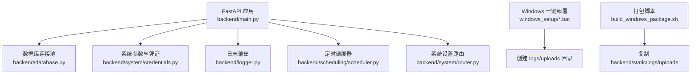
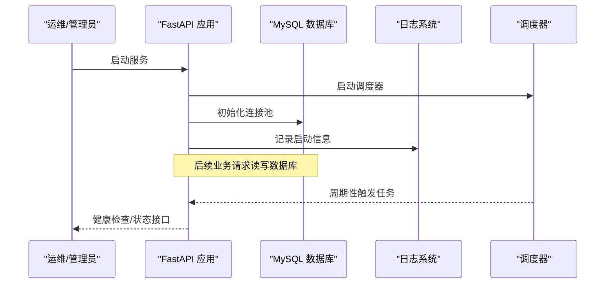
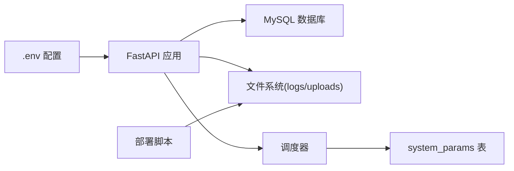
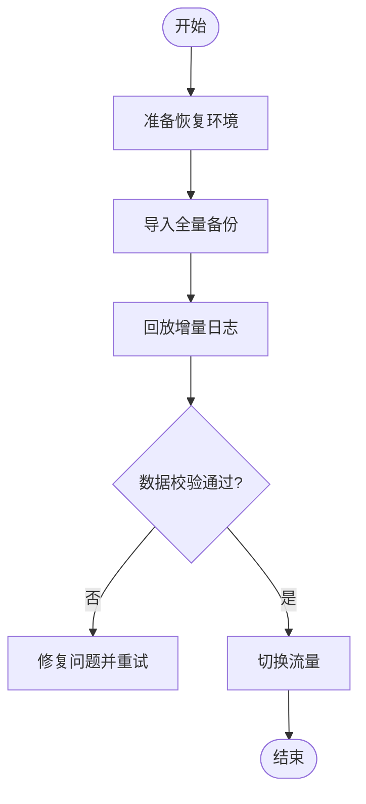

# 备份恢复

<cite>
**本文引用的文件**
- [backend/config.py](file://backend/config.py)
- [backend/database.py](file://backend/database.py)
- [backend/logger.py](file://backend/logger.py)
- [backend/main.py](file://backend/main.py)
- [backend/system/router.py](file://backend/system/router.py)
- [backend/system/credentials.py](file://backend/system/credentials.py)
- [backend/scheduling/scheduler.py](file://backend/scheduling/scheduler.py)
- [backend/scripts/init_db.py](file://backend/scripts/init_db.py)
- [windows_setup/0_一键部署.bat](file://windows_setup/0_一键部署.bat)
- [windows_setup/step2_configure_env.bat](file://windows_setup/step2_configure_env.bat)
- [build_windows_package.sh](file://build_windows_package.sh)
</cite>

## 目录
1. [简介](#简介)
2. [项目结构](#项目结构)
3. [核心组件](#核心组件)
4. [架构总览](#架构总览)
5. [详细组件分析](#详细组件分析)
6. [依赖关系分析](#依赖关系分析)
7. [性能考虑](#性能考虑)
8. [故障排查指南](#故障排查指南)
9. [结论](#结论)
10. [附录](#附录)

## 简介
本文件为“试制资源数智化管理系统”的备份与恢复专项文档。内容覆盖数据备份策略（数据库、文件、配置）、自动备份脚本与定时任务、备份验证、数据恢复流程（完整恢复、增量恢复、灾难恢复）、备份数据安全（加密存储、访问控制、审计日志），以及备份恢复测试方法与故障演练方案。文档基于仓库现有代码与部署脚本进行分析，并给出可落地的实施建议。

## 项目结构
系统后端采用 FastAPI 应用，使用 MySQL 作为持久化存储；运行时产生日志与上传文件；通过环境变量加载敏感配置；提供系统参数表用于运行期配置管理；内置调度器用于周期性任务执行。

图表来源
- [backend/main.py:29-83](file://backend/main.py#L29-L83)
- [backend/database.py:12-48](file://backend/database.py#L12-L48)
- [backend/logger.py:14-38](file://backend/logger.py#L14-L38)
- [backend/system/credentials.py:339-401](file://backend/system/credentials.py#L339-L401)
- [backend/scheduling/scheduler.py:16-74](file://backend/scheduling/scheduler.py#L16-L74)
- [windows_setup/step2_configure_env.bat:16-25](file://windows_setup/step2_configure_env.bat#L16-L25)
- [build_windows_package.sh:101-107](file://build_windows_package.sh#L101-L107)

章节来源
- [backend/main.py:29-83](file://backend/main.py#L29-L83)
- [backend/config.py:48-101](file://backend/config.py#L48-L101)
- [backend/database.py:12-48](file://backend/database.py#L12-L48)
- [backend/logger.py:14-38](file://backend/logger.py#L14-L38)
- [backend/system/credentials.py:339-401](file://backend/system/credentials.py#L339-L401)
- [backend/scheduling/scheduler.py:16-74](file://backend/scheduling/scheduler.py#L16-L74)
- [windows_setup/step2_configure_env.bat:16-25](file://windows_setup/step2_configure_env.bat#L16-L25)
- [build_windows_package.sh:101-107](file://build_windows_package.sh#L101-L107)

## 核心组件
- 配置与环境：通过 .env 加载数据库、服务端口、CORS、上传目录等配置，确保敏感信息不入库。
- 数据库层：基于 PyMySQL + DBUtils 的连接池，提供查询与写操作封装，异常时回滚。
- 系统参数：system_params 表保存运行期配置（如爬虫模式、间隔、启用数据源等）。
- 日志：按模块输出到 logs 目录，支持轮转与保留数量限制。
- 调度器：后台线程周期执行任务，读取 system_params 控制行为。
- 部署与打包：Windows 一键部署创建必要目录；打包脚本排除 .env 并预建运行时目录。

章节来源
- [backend/config.py:48-101](file://backend/config.py#L48-L101)
- [backend/database.py:12-48](file://backend/database.py#L12-L48)
- [backend/system/credentials.py:339-401](file://backend/system/credentials.py#L339-L401)
- [backend/logger.py:14-38](file://backend/logger.py#L14-L38)
- [backend/scheduling/scheduler.py:93-153](file://backend/scheduling/scheduler.py#L93-L153)
- [windows_setup/step2_configure_env.bat:16-25](file://windows_setup/step2_configure_env.bat#L16-L25)
- [build_windows_package.sh:101-107](file://build_windows_package.sh#L101-L107)

## 架构总览
系统以 FastAPI 为中心，统一暴露 API；数据库通过连接池访问；系统参数与凭证由系统模块管理；日志集中输出；调度器在启动时初始化并在关闭时停止。

图表来源
- [backend/main.py:36-55](file://backend/main.py#L36-L55)
- [backend/database.py:12-48](file://backend/database.py#L12-L48)
- [backend/logger.py:14-38](file://backend/logger.py#L14-L38)
- [backend/scheduling/scheduler.py:34-74](file://backend/scheduling/scheduler.py#L34-L74)

## 详细组件分析

### 数据备份策略
- 数据库备份
  - 目标：对 MySQL 中的 warehouse_data 库进行全量与增量备份。
  - 方式：建议使用 mysqldump 或数据库厂商提供的备份工具；结合 binlog 实现增量恢复。
  - 频率：生产环境建议每日全量+每小时增量；低负载可调整为每日一次全量。
  - 校验：备份后校验完整性（如 md5/sha256）并尝试在隔离环境还原验证。
- 文件备份
  - 目标：uploads 目录（用户上传文件）、logs 目录（日志归档）。
  - 方式：rsync/cp/tar 等工具；注意排除临时文件与过大的历史日志。
  - 频率：与数据库备份同步或略滞后；日志可按天滚动压缩。
- 配置备份
  - 目标：backend/.env（含数据库与第三方凭据）、system_params 表（运行期配置）、关键 SQL 脚本（如 init_db.py 中表结构）。
  - 方式：版本化管理 .env 模板；定期导出 system_params；SQL 脚本纳入版本库。
  - 安全：.env 不得进入版本库；仅备份至受控存储。

章节来源
- [backend/config.py:48-101](file://backend/config.py#L48-L101)
- [backend/scripts/init_db.py:17-293](file://backend/scripts/init_db.py#L17-L293)
- [backend/system/credentials.py:339-401](file://backend/system/credentials.py#L339-L401)
- [build_windows_package.sh:101-107](file://build_windows_package.sh#L101-L107)

### 自动备份脚本与定时任务
- 定时任务
  - Linux：使用 crontab 或 systemd timer 调用备份脚本。
  - Windows：使用任务计划程序调用批处理脚本。
- 备份脚本要点
  - 数据库：mysqldump 全量；binlog 增量；生成校验和；失败重试与告警。
  - 文件：打包 uploads/logs；保留策略（如最近 N 份）。
  - 配置：导出 system_params；备份 .env 到安全位置。
  - 验证：解压/导入测试库；比对行数或哈希；记录结果。
- 存储策略
  - 本地磁盘 + 异地对象存储（如 OSS/S3）；多副本与生命周期管理。
  - 权限最小化；传输加密（TLS）；静态加密（KMS）。

章节来源
- [backend/scheduling/scheduler.py:93-153](file://backend/scheduling/scheduler.py#L93-L153)
- [backend/logger.py:23-31](file://backend/logger.py#L23-L31)
- [windows_setup/step2_configure_env.bat:16-25](file://windows_setup/step2_configure_env.bat#L16-L25)

### 数据恢复流程
- 完整恢复
  - 步骤：准备空库 → 导入最新全量备份 → 回放增量 binlog → 校验数据一致性 → 切换流量。
  - 适用：主库不可用或数据严重损坏。
- 增量恢复
  - 步骤：基于最近全量 → 回放指定时间段的增量日志 → 恢复到时间点。
  - 适用：误删/误改的快速回滚。
- 灾难恢复
  - 步骤：跨机房/云恢复 → 恢复配置与密钥 → 启动服务 → 灰度验证 → 全量切换。
  - 要求：异地备份、自动化脚本、演练机制。

章节来源
- [backend/scripts/init_db.py:17-293](file://backend/scripts/init_db.py#L17-L293)
- [backend/system/credentials.py:339-401](file://backend/system/credentials.py#L339-L401)

### 备份数据安全
- 加密存储
  - 传输：HTTPS/TLS；对象存储开启服务端加密。
  - 静态：备份文件使用 KMS/密钥管理加密；密钥与备份分离保管。
- 访问控制
  - 最小权限原则；备份存储桶/目录 ACL 严格限制；仅运维账号可读写。
- 审计日志
  - 记录备份/恢复操作的主体、时间、对象、结果；日志集中收集与防篡改。
  - 系统日志已具备轮转与保留策略，可作为辅助审计来源。

章节来源
- [backend/logger.py:23-31](file://backend/logger.py#L23-L31)
- [backend/config.py:48-101](file://backend/config.py#L48-L101)

### 备份恢复测试与故障演练
- 测试方法
  - 定期在隔离环境执行恢复演练；对比关键指标（记录数、关键字段、业务报表）。
  - 模拟网络中断、磁盘满、权限错误等异常，验证脚本健壮性与告警。
- 演练方案
  - 制定 RTO/RPO 目标；设计演练剧本；记录问题与改进项；复测闭环。
  - 将演练纳入变更管理与发布流程。

章节来源
- [backend/logger.py:23-31](file://backend/logger.py#L23-L31)
- [backend/main.py:36-55](file://backend/main.py#L36-L55)

## 依赖关系分析
系统备份相关的关键依赖如下：
- 数据库：MySQL（连接池、事务回滚）。
- 配置：.env 环境变量；system_params 表。
- 文件系统：logs、uploads 目录。
- 调度：后台线程与系统参数驱动。
- 部署：Windows 批处理脚本负责目录初始化与启动顺序。

图表来源
- [backend/config.py:48-101](file://backend/config.py#L48-L101)
- [backend/database.py:12-48](file://backend/database.py#L12-L48)
- [backend/system/credentials.py:339-401](file://backend/system/credentials.py#L339-L401)
- [backend/scheduling/scheduler.py:93-153](file://backend/scheduling/scheduler.py#L93-L153)
- [windows_setup/step2_configure_env.bat:16-25](file://windows_setup/step2_configure_env.bat#L16-L25)

章节来源
- [backend/config.py:48-101](file://backend/config.py#L48-L101)
- [backend/database.py:12-48](file://backend/database.py#L12-L48)
- [backend/system/credentials.py:339-401](file://backend/system/credentials.py#L339-L401)
- [backend/scheduling/scheduler.py:93-153](file://backend/scheduling/scheduler.py#L93-L153)
- [windows_setup/step2_configure_env.bat:16-25](file://windows_setup/step2_configure_env.bat#L16-L25)

## 性能考虑
- 备份窗口：避开业务高峰；分库分表场景下并行备份。
- IO 影响：使用只读副本或快照减少主库压力。
- 存储成本：合理保留策略与压缩；冷热分层。
- 恢复效率：预构建恢复环境；索引重建优化。

[本节为通用指导，无需特定文件引用]

## 故障排查指南
- 数据库连接失败
  - 现象：连接池初始化报错。
  - 排查：检查 .env 中 DB_HOST/PORT/USER/PASSWORD/DATABASE；确认网络与防火墙。
- 调度器未执行
  - 现象：无自动同步。
  - 排查：查看 system_params 中 crawler_mode 与间隔；确认调度器线程状态。
- 日志缺失或过大
  - 现象：无法定位问题或磁盘占用高。
  - 排查：确认日志轮转配置与保留数量；清理过期日志。
- 配置文件泄露风险
  - 现象：打包产物包含 .env。
  - 排查：构建脚本应剔除 .env；仅保留示例模板。

章节来源
- [backend/database.py:34-42](file://backend/database.py#L34-L42)
- [backend/scheduling/scheduler.py:93-153](file://backend/scheduling/scheduler.py#L93-L153)
- [backend/logger.py:23-31](file://backend/logger.py#L23-L31)
- [build_windows_package.sh:55-59](file://build_windows_package.sh#L55-L59)

## 结论
本系统具备清晰的配置、数据库、文件与日志体系，适合在此基础上建立完善的备份与恢复机制。建议尽快落地以下措施：
- 建立数据库全量+增量备份与校验流程。
- 将 uploads/logs 纳入统一备份与保留策略。
- 将 system_params 与 .env 模板纳入版本与备份管理。
- 制定恢复演练计划，定期验证 RTO/RPO 达标。
- 强化备份安全：加密、访问控制与审计。

[本节为总结性内容，无需特定文件引用]

## 附录

### 备份脚本清单（建议）
- 数据库备份脚本：mysqldump + binlog 回放
- 文件备份脚本：tar/rsync 打包 uploads/logs
- 配置备份脚本：导出 system_params；备份 .env 到安全存储
- 验证脚本：校验和、恢复演练、数据比对
- 告警脚本：失败通知、容量预警

[本节为建议清单，无需特定文件引用]

### 恢复流程图（概念）

[本图为概念流程，无需特定文件引用]