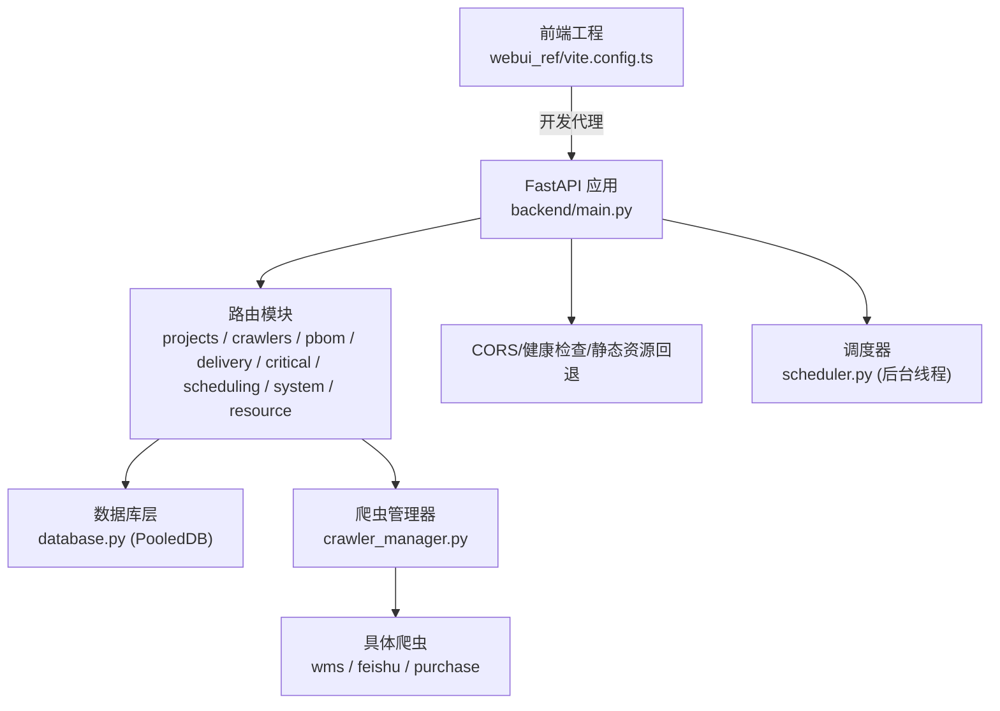
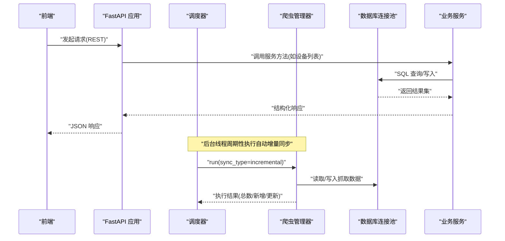
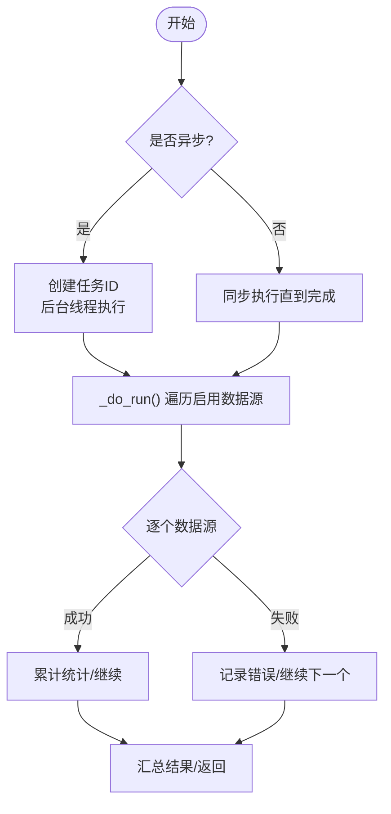
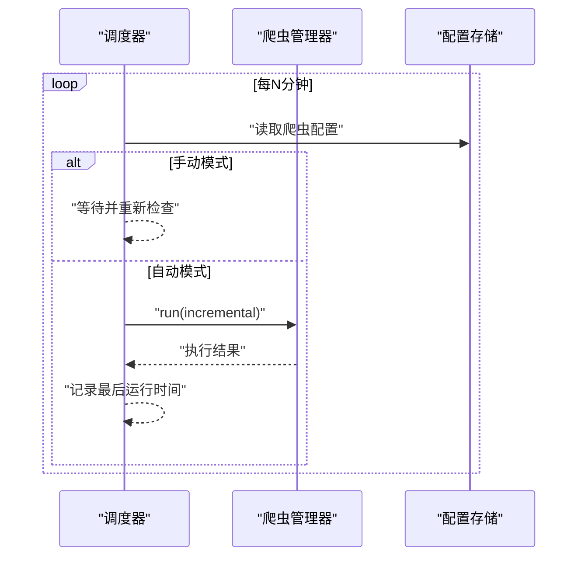
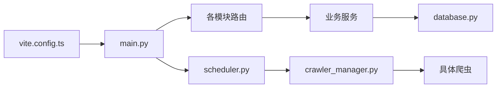

# 性能优化

<cite>
**本文引用的文件**
- [backend/main.py](file://backend/main.py)
- [backend/config.py](file://backend/config.py)
- [backend/database.py](file://backend/database.py)
- [backend/logger.py](file://backend/logger.py)
- [backend/crawlers/base.py](file://backend/crawlers/base.py)
- [backend/crawlers/crawler_manager.py](file://backend/crawlers/crawler_manager.py)
- [backend/scheduling/scheduler.py](file://backend/scheduling/scheduler.py)
- [backend/modules/resource/services/equipment_service.py](file://backend/modules/resource/services/equipment_service.py)
- [backend/pbom/excel_parser.py](file://backend/pbom/excel_parser.py)
- [webui_ref/vite.config.ts](file://webui_ref/vite.config.ts)
</cite>

## 目录
1. [简介](#简介)
2. [项目结构](#项目结构)
3. [核心组件](#核心组件)
4. [架构总览](#架构总览)
5. [详细组件分析](#详细组件分析)
6. [依赖关系分析](#依赖关系分析)
7. [性能考虑与调优策略](#性能考虑与调优策略)
8. [故障排查指南](#故障排查指南)
9. [结论](#结论)
10. [附录：监控与基准测试建议](#附录：监控与基准测试建议)

## 简介
本文件面向“试制资源数智化管理系统”的性能优化，覆盖数据库查询优化、缓存策略、并发处理、爬虫性能（异步请求、连接池、重试）、调度器任务队列与内存管理、前端静态资源与懒加载等。文档基于仓库现有实现进行梳理，并给出可落地的优化建议与可视化流程图。

## 项目结构
后端采用 FastAPI 应用，模块化路由组织；数据访问通过数据库连接池；爬虫模块提供统一抽象与管理；调度器以后台线程定时触发增量同步；前端为独立工程，开发期通过 Vite 代理到后端。

图表来源
- [backend/main.py:29-83](file://backend/main.py#L29-L83)
- [backend/database.py:12-43](file://backend/database.py#L12-L43)
- [backend/crawlers/crawler_manager.py:90-97](file://backend/crawlers/crawler_manager.py#L90-L97)
- [backend/scheduling/scheduler.py:16-74](file://backend/scheduling/scheduler.py#L16-L74)
- [webui_ref/vite.config.ts:10-18](file://webui_ref/vite.config.ts#L10-L18)

章节来源
- [backend/main.py:29-83](file://backend/main.py#L29-L83)
- [webui_ref/vite.config.ts:10-18](file://webui_ref/vite.config.ts#L10-L18)

## 核心组件
- 应用入口与中间件：注册路由、CORS、SPA 静态资源回退、健康检查、启动/关闭钩子中启停调度器。
- 配置中心：集中读取环境变量，包含数据库、爬虫间隔、服务端口、CORS 等。
- 数据库层：基于 PooledDB 的连接池封装，提供查询/写入/批量执行接口。
- 爬虫体系：抽象基类定义统一结果与状态；管理器负责实例化、运行、停止、异步任务跟踪。
- 调度器：后台线程按配置周期执行自动增量同步，支持暂停/恢复与手动任务协调。
- 业务服务：设备台账等服务的分页查询、统计聚合、维护记录管理等。
- Excel 解析：PBOM Excel 读取、列识别、需求合并提取。
- 日志：带轮转的文件日志与控制台输出。

章节来源
- [backend/main.py:29-83](file://backend/main.py#L29-L83)
- [backend/config.py:48-101](file://backend/config.py#L48-L101)
- [backend/database.py:12-116](file://backend/database.py#L12-L116)
- [backend/crawlers/base.py:12-67](file://backend/crawlers/base.py#L12-L67)
- [backend/crawlers/crawler_manager.py:22-305](file://backend/crawlers/crawler_manager.py#L22-L305)
- [backend/scheduling/scheduler.py:16-196](file://backend/scheduling/scheduler.py#L16-L196)
- [backend/modules/resource/services/equipment_service.py:11-103](file://backend/modules/resource/services/equipment_service.py#L11-L103)
- [backend/pbom/excel_parser.py:14-203](file://backend/pbom/excel_parser.py#L14-L203)
- [backend/logger.py:14-43](file://backend/logger.py#L14-L43)

## 架构总览
下图展示从请求到数据落库与爬虫调度的整体流程，以及前后端交互方式。

图表来源
- [backend/main.py:29-83](file://backend/main.py#L29-L83)
- [backend/scheduling/scheduler.py:93-153](file://backend/scheduling/scheduler.py#L93-L153)
- [backend/crawlers/crawler_manager.py:199-301](file://backend/crawlers/crawler_manager.py#L199-L301)
- [backend/database.py:51-116](file://backend/database.py#L51-L116)
- [backend/modules/resource/services/equipment_service.py:55-87](file://backend/modules/resource/services/equipment_service.py#L55-L87)

## 详细组件分析

### 数据库层与查询优化
- 连接池：使用 PooledDB，最大连接数、最小缓存、阻塞模式已配置；延迟初始化避免启动失败导致进程崩溃。
- 读写封装：提供 query_all/query_one/execute/execute_last_id/execute_all，写操作均提交事务并在异常时回滚。
- 查询优化点：
  - 分页：服务层使用 LIMIT/OFFSET 控制页大小，减少单次传输量。
  - 条件拼接：动态 WHERE 条件，避免全表扫描。
  - 字段选择：仅 SELECT 必要字段，降低网络与序列化开销。
  - 时间字段转换：在服务层将 datetime 转为字符串，减少前端处理成本。
- 潜在优化方向：
  - 根据热点查询增加索引（如 equipment_code、status、zone_code）。
  - 对高频统计接口引入缓存（见“缓存策略”）。
  - 大批量写入使用 executemany 或分批提交（已有 execute_all 可用）。

章节来源
- [backend/database.py:12-116](file://backend/database.py#L12-L116)
- [backend/modules/resource/services/equipment_service.py:55-87](file://backend/modules/resource/services/equipment_service.py#L55-L87)

### 爬虫性能优化（异步、连接池、重试）
- 异步执行：管理器提供 run_async，立即返回 task_id，后台线程执行，前端轮询状态；自动任务完成后恢复调度器。
- 并发与串行：当前管理器按顺序遍历启用数据源执行，未做跨源并行；可在后续版本引入线程池/协程池提升吞吐。
- 连接复用：爬虫内部若涉及 HTTP 客户端，建议复用连接池；数据库侧已通过连接池复用连接。
- 重试机制：当前代码未见显式重试逻辑；建议在外部网络调用处增加指数退避重试与熔断保护。
- 进度与日志：每个爬虫维护 logs/progress，便于前端实时反馈。

图表来源
- [backend/crawlers/crawler_manager.py:134-197](file://backend/crawlers/crawler_manager.py#L134-L197)
- [backend/crawlers/crawler_manager.py:199-301](file://backend/crawlers/crawler_manager.py#L199-L301)

章节来源
- [backend/crawlers/crawler_manager.py:134-197](file://backend/crawlers/crawler_manager.py#L134-L197)
- [backend/crawlers/crawler_manager.py:199-301](file://backend/crawlers/crawler_manager.py#L199-L301)
- [backend/crawlers/base.py:12-67](file://backend/crawlers/base.py#L12-L67)

### 调度器性能调优（任务队列、资源分配、内存管理）
- 运行机制：后台线程循环读取配置，按分钟间隔等待，支持暂停/恢复；避免与手动任务冲突（检测是否有爬虫正在运行）。
- 资源分配：当前为单线程调度，适合轻量级任务；若未来任务变重，可改为任务队列（如 Redis/RQ）+ 多工作进程。
- 内存管理：调度器仅维护少量状态（running/paused/interval/last_run_at），内存占用低；注意爬虫长时间运行时的日志与进度对象需限制大小。
- 容错：异常捕获后等待固定时间重试，避免抖动。

图表来源
- [backend/scheduling/scheduler.py:93-153](file://backend/scheduling/scheduler.py#L93-L153)
- [backend/scheduling/scheduler.py:155-193](file://backend/scheduling/scheduler.py#L155-L193)

章节来源
- [backend/scheduling/scheduler.py:16-196](file://backend/scheduling/scheduler.py#L16-L196)

### 前端性能优化（静态资源压缩、懒加载、缓存）
- 构建与代理：Vite 开发服务器开启代理转发 /api 到后端，便于本地调试。
- 静态资源：生产模式下由 FastAPI 托管 static/index.html，并设置无缓存头以避免浏览器缓存旧版本。
- 优化建议：
  - 构建产物启用 gzip/brotli 压缩与代码分割。
  - 图片与图标使用 WebP/SVG 并按需加载。
  - 大图表（ECharts）按需初始化与销毁实例，避免重复渲染。
  - 路由级懒加载页面组件，减少首屏体积。
  - 接口层增加请求去抖/节流与缓存策略（如 GET 短期缓存）。

章节来源
- [webui_ref/vite.config.ts:10-18](file://webui_ref/vite.config.ts#L10-L18)
- [backend/main.py:57-118](file://backend/main.py#L57-L118)

## 依赖关系分析
- 应用入口依赖各模块路由；路由依赖服务层；服务层依赖数据库层；调度器依赖爬虫管理器；爬虫管理器依赖具体爬虫实现；前端通过 Vite 代理访问后端 API。

图表来源
- [backend/main.py:18-83](file://backend/main.py#L18-L83)
- [backend/scheduling/scheduler.py:16-74](file://backend/scheduling/scheduler.py#L16-L74)
- [backend/crawlers/crawler_manager.py:90-97](file://backend/crawlers/crawler_manager.py#L90-L97)
- [webui_ref/vite.config.ts:10-18](file://webui_ref/vite.config.ts#L10-L18)

章节来源
- [backend/main.py:18-83](file://backend/main.py#L18-L83)
- [backend/scheduling/scheduler.py:16-74](file://backend/scheduling/scheduler.py#L16-L74)
- [backend/crawlers/crawler_manager.py:90-97](file://backend/crawlers/crawler_manager.py#L90-L97)
- [webui_ref/vite.config.ts:10-18](file://webui_ref/vite.config.ts#L10-L18)

## 性能考虑与调优策略

### 数据库查询优化
- 分页与筛选：服务层已实现分页与动态条件拼接，确保只拉取必要数据。
- 字段裁剪：SELECT 指定字段，避免 SELECT *。
- 索引建议：对高频过滤字段（如 equipment_code、status、zone_code）建立索引。
- 批量写入：使用 executemany 或分批提交，减少事务次数。
- 连接池参数：根据并发量调整 maxconnections/mincached/maxcached，避免连接耗尽或过多上下文切换。

章节来源
- [backend/modules/resource/services/equipment_service.py:55-87](file://backend/modules/resource/services/equipment_service.py#L55-L87)
- [backend/database.py:12-43](file://backend/database.py#L12-L43)

### 缓存策略配置
- 现状：未发现内置缓存实现。
- 建议：
  - 读多写少接口（如设备统计、字典数据）引入 Redis 缓存，设置合理过期时间。
  - 热点查询加本地内存缓存（如 functools.lru_cache）用于小数据集。
  - 前端对静态资源与接口响应设置合适的 Cache-Control。

[本节为通用建议，不直接分析具体文件]

### 并发处理优化
- 爬虫管理器：当前串行执行多个数据源；可引入线程池/协程池并行抓取不同源，但需注意外部系统限流与数据库写入压力。
- 调度器：保持单线程即可；若任务耗时增长，可迁移至消息队列 + 多 worker。
- 连接复用：HTTP 客户端与数据库连接均需复用，避免频繁握手。

章节来源
- [backend/crawlers/crawler_manager.py:199-301](file://backend/crawlers/crawler_manager.py#L199-L301)
- [backend/scheduling/scheduler.py:93-153](file://backend/scheduling/scheduler.py#L93-L153)

### 爬虫性能优化（异步请求、连接池、重试）
- 异步：已提供 run_async，前端轮询任务状态，提升用户体验。
- 连接池：数据库侧已使用 PooledDB；HTTP 层建议复用会话与连接池。
- 重试：建议在外部调用处加入指数退避重试、超时控制与熔断降级。
- 限流：对第三方接口实施速率限制，避免被限流或封禁。

章节来源
- [backend/crawlers/crawler_manager.py:134-197](file://backend/crawlers/crawler_manager.py#L134-L197)
- [backend/database.py:12-43](file://backend/database.py#L12-L43)

### 调度器性能调优（任务队列、资源分配、内存管理）
- 任务队列：当前为简单定时器；建议升级为队列（如 Redis Queue）以实现削峰填谷与水平扩展。
- 资源分配：根据数据源负载动态分配线程/进程数量。
- 内存管理：限制爬虫日志与进度对象大小，避免长期运行内存泄漏。

章节来源
- [backend/scheduling/scheduler.py:16-196](file://backend/scheduling/scheduler.py#L16-L196)

### 前端性能优化（静态资源压缩、懒加载、缓存策略）
- 构建：启用压缩与代码分割；按需加载路由组件。
- 资源：图片/图标使用现代格式；图表按需初始化与销毁。
- 缓存：对静态资源与接口响应设置合理的缓存头；开发期使用代理。

章节来源
- [webui_ref/vite.config.ts:10-18](file://webui_ref/vite.config.ts#L10-L18)
- [backend/main.py:57-118](file://backend/main.py#L57-L118)

## 故障排查指南
- 数据库连接失败：检查 .env 中的 DB_HOST/PORT/USER/PASSWORD/DATABASE；连接池初始化失败会记录明确错误信息。
- 调度器未执行：确认配置模式为 auto，且没有爬虫正在运行；查看调度器日志。
- 爬虫任务卡住：检查外部接口连通性与限流；必要时增加重试与超时。
- 前端无法访问 API：确认 Vite 代理目标地址与后端服务端口一致。

章节来源
- [backend/database.py:12-43](file://backend/database.py#L12-L43)
- [backend/scheduling/scheduler.py:93-153](file://backend/scheduling/scheduler.py#L93-L153)
- [backend/crawlers/crawler_manager.py:134-197](file://backend/crawlers/crawler_manager.py#L134-L197)
- [webui_ref/vite.config.ts:10-18](file://webui_ref/vite.config.ts#L10-L18)

## 结论
系统在数据库连接池、爬虫异步执行、调度器后台运行等方面已具备基础能力。为进一步优化性能，建议：
- 数据库层：完善索引、批量写入、热点缓存。
- 爬虫层：引入连接复用、重试与限流，评估并行化。
- 调度层：迁移至任务队列，增强可扩展性。
- 前端层：构建产物压缩、懒加载、缓存策略与图表优化。
- 监控与基准：建立性能指标采集与压测流程，持续验证优化效果。

[本节为总结，不直接分析具体文件]

## 附录：监控与基准测试建议
- 监控指标：
  - 接口响应时间、QPS、错误率（可通过日志与 APM 工具采集）。
  - 数据库连接池使用率、慢查询数量。
  - 爬虫成功率、平均耗时、重试次数。
  - 调度器运行状态、任务堆积情况。
- 基准测试：
  - 使用压测工具对关键接口进行并发测试，观察 CPU/内存/IO 变化。
  - 针对 Excel 解析与大数据量写入场景进行专项测试。
  - 对比优化前后指标，形成回归基线。

[本节为通用建议，不直接分析具体文件]