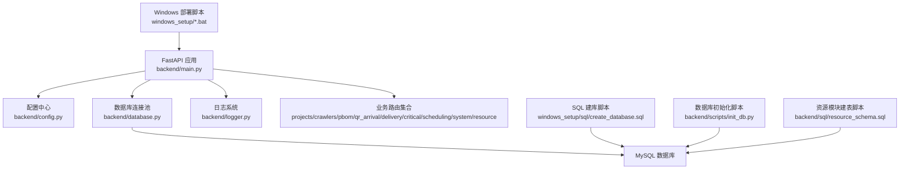
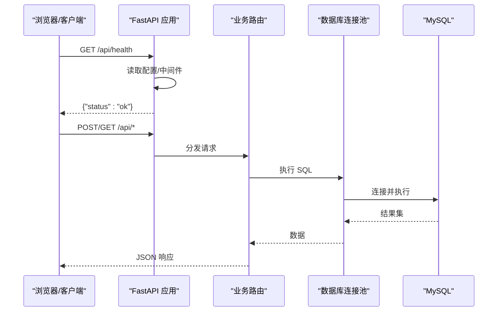
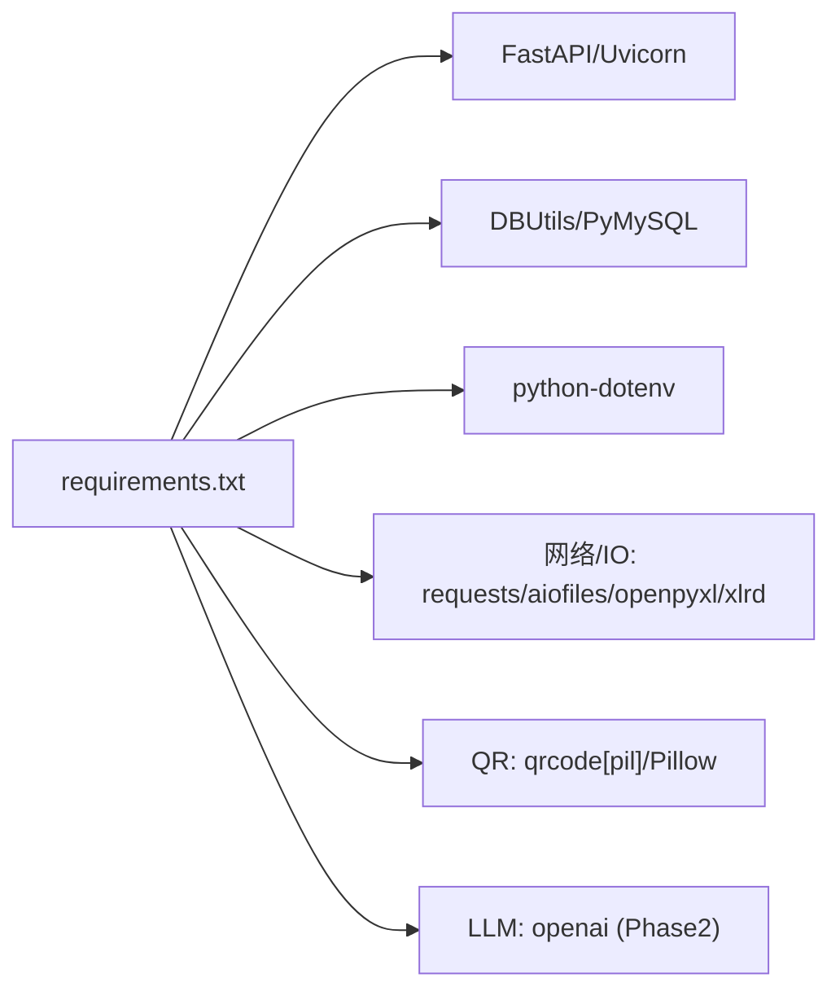

# 环境部署

<cite>
**本文引用的文件**
- [backend/config.py](file://backend/config.py)
- [backend/database.py](file://backend/database.py)
- [backend/main.py](file://backend/main.py)
- [backend/requirements.txt](file://backend/requirements.txt)
- [backend/env.example](file://backend/env.example)
- [backend/logger.py](file://backend/logger.py)
- [backend/scripts/init_db.py](file://backend/scripts/init_db.py)
- [backend/sql/resource_schema.sql](file://backend/sql/resource_schema.sql)
- [backend/sql/init_resource_db.py](file://backend/sql/init_resource_db.py)
- [windows_setup/README_WINDOWS.txt](file://windows_setup/README_WINDOWS.txt)
- [windows_setup/sql/create_database.sql](file://windows_setup/sql/create_database.sql)
- [windows_setup/0_一键部署.bat](file://windows_setup/0_一键部署.bat)
- [windows_setup/5_start_server.bat](file://windows_setup/5_start_server.bat)
- [start_server.py](file://start_server.py)
</cite>

## 目录
1. [简介](#简介)
2. [项目结构](#项目结构)
3. [核心组件](#核心组件)
4. [架构总览](#架构总览)
5. [详细组件分析](#详细组件分析)
6. [依赖关系分析](#依赖关系分析)
7. [性能与容量建议](#性能与容量建议)
8. [部署验证](#部署验证)
9. [故障排查指南](#故障排查指南)
10. [结论](#结论)
11. [附录：Docker 容器化部署方案](#附录docker-容器化部署方案)

## 简介
本部署文档面向“试制资源数智化管理系统”的生产环境落地，覆盖服务器要求、Windows/Linux 完整部署流程、MySQL 安装与配置、Python 环境与依赖安装、数据库初始化（表结构与初始数据）、服务启动与验证、常见问题排查，以及 Docker 容器化部署方案。文档严格基于仓库内脚本与代码实现编写，确保可操作性和一致性。

## 项目结构
后端采用 FastAPI + Uvicorn 提供 REST API，使用 PyMySQL + DBUtils 连接池访问 MySQL；通过 .env 集中管理配置；提供 Windows 一键部署脚本与 SQL 建库脚本；包含业务模块路由与健康检查接口；日志按天轮转输出到 logs 目录。

图表来源
- [backend/main.py:29-83](file://backend/main.py#L29-L83)
- [backend/config.py:48-101](file://backend/config.py#L48-L101)
- [backend/database.py:12-43](file://backend/database.py#L12-L43)
- [windows_setup/sql/create_database.sql:9-19](file://windows_setup/sql/create_database.sql#L9-L19)
- [backend/scripts/init_db.py:17-293](file://backend/scripts/init_db.py#L17-L293)
- [backend/sql/resource_schema.sql:10-326](file://backend/sql/resource_schema.sql#L10-L326)

章节来源
- [backend/main.py:29-120](file://backend/main.py#L29-L120)
- [backend/config.py:48-101](file://backend/config.py#L48-L101)
- [backend/database.py:12-43](file://backend/database.py#L12-L43)
- [windows_setup/README_WINDOWS.txt:9-18](file://windows_setup/README_WINDOWS.txt#L9-L18)

## 核心组件
- 应用入口与路由注册：FastAPI 应用实例、CORS、健康检查、静态页面回退、调度器启停钩子。
- 配置管理：从 .env 加载数据库、服务端口、跨域、爬虫间隔、LLM 等参数，并提供类型转换与默认值。
- 数据库层：DBUtils 连接池、延迟初始化、统一查询/执行封装、错误提示友好。
- 日志系统：RotatingFileHandler 轮转日志，控制台与文件双输出。
- 初始化脚本：创建 V5 业务表、扩展兼容列、写入默认系统参数；资源模块独立建表脚本。
- Windows 部署：一键脚本串联建库、配置、依赖安装、初始化、启动。

章节来源
- [backend/main.py:29-120](file://backend/main.py#L29-L120)
- [backend/config.py:48-101](file://backend/config.py#L48-L101)
- [backend/database.py:12-116](file://backend/database.py#L12-L116)
- [backend/logger.py:14-43](file://backend/logger.py#L14-L43)
- [backend/scripts/init_db.py:17-293](file://backend/scripts/init_db.py#L17-L293)
- [backend/sql/init_resource_db.py:21-71](file://backend/sql/init_resource_db.py#L21-L71)

## 架构总览
系统由前端静态页面（可选托管）+ FastAPI 后端 + MySQL 组成。后端在启动时加载配置、注册路由、启动调度器；请求经路由进入业务模块，通过数据库层读写 MySQL；日志记录运行状态与异常。

图表来源
- [backend/main.py:94-98](file://backend/main.py#L94-L98)
- [backend/main.py:74-83](file://backend/main.py#L74-L83)
- [backend/database.py:46-116](file://backend/database.py#L46-L116)

## 详细组件分析

### 配置与环境变量
- 配置文件位置：backend/.env（由 backend/.env.example 复制而来）。
- 关键配置项：数据库连接（DB_HOST/PORT/USER/PASSWORD/DATABASE）、服务监听（SERVER_HOST/PORT）、调试开关（DEBUG）、跨域（CORS_ORIGINS）、爬虫间隔与超时、WMS/飞书/采购系统接口、DeepSeek LLM、QR_BASE_URL、上传目录。
- 行为说明：未找到 .env 会输出警告并使用默认值；连接池初始化失败会打印明确提示便于定位 .env 问题。

章节来源
- [backend/config.py:12-22](file://backend/config.py#L12-L22)
- [backend/config.py:48-101](file://backend/config.py#L48-L101)
- [backend/database.py:17-43](file://backend/database.py#L17-L43)
- [backend/env.example:7-49](file://backend/env.example#L7-L49)

### 数据库连接与访问
- 连接池：DBUtils PooledDB，最大连接数、最小缓存、阻塞模式、字符集 utf8mb4。
- 工具方法：get_conn/query_all/query_one/execute/execute_last_id/execute_all，统一事务提交与回滚。
- 错误处理：连接池初始化失败抛出异常并附带 .env 字段提示。

章节来源
- [backend/database.py:12-43](file://backend/database.py#L12-L43)
- [backend/database.py:46-116](file://backend/database.py#L46-L116)

### 应用启动与生命周期
- 启动事件：自动启动后端调度器（爬虫调度），失败记录日志。
- 关闭事件：停止调度器，保证资源释放。
- 静态资源：若存在 static/index.html，则作为 SPA 入口并回退。
- 健康检查：/api/health 返回运行状态。

章节来源
- [backend/main.py:36-55](file://backend/main.py#L36-L55)
- [backend/main.py:57-118](file://backend/main.py#L57-L118)
- [backend/main.py:94-98](file://backend/main.py#L94-L98)

### 日志系统
- 日志目录：backend/../logs（自动创建）。
- 策略：单文件最大 10MB，保留 7 个历史文件；同时输出到控制台。
- 级别：DEBUG 取决于 DEBUG 配置。

章节来源
- [backend/logger.py:7-43](file://backend/logger.py#L7-L43)

### 数据库初始化（V5 业务表）
- 脚本：backend/scripts/init_db.py
- 功能：创建 projects、project_parts、configs、part_configs、qr_arrival_records、critical_scores、spider_credentials、delivery_records、feishu_detail、system_params 等表；为旧表添加兼容列；写入默认系统参数。
- 执行方式：Windows 一键部署或手动运行 Python 脚本。

章节来源
- [backend/scripts/init_db.py:17-293](file://backend/scripts/init_db.py#L17-L293)

### 资源模块数据库初始化
- 脚本：backend/sql/init_resource_db.py
- 功能：顺序执行 resource_schema.sql（设备、区域、人员、任务、预警、效率、维护、甘特排程、资源分配、冲突检测等表），再执行 resource_init_data.sql（如存在）。
- 适用场景：试制资源看板、排程与告警相关能力的数据准备。

章节来源
- [backend/sql/init_resource_db.py:21-71](file://backend/sql/init_resource_db.py#L21-L71)
- [backend/sql/resource_schema.sql:10-326](file://backend/sql/resource_schema.sql#L10-L326)

### Windows 部署流程
- 系统要求：Windows 10/11/Server 2016+；Python 3.8~3.11（推荐 3.10）；MySQL 5.7/8.0（推荐 8.0）；Chrome/Edge。
- 步骤：
  1) 创建数据库 warehouse_data（可用 create_database.sql 或一键脚本）。
  2) 生成并编辑 backend/.env（数据库与服务配置）。
  3) 安装 Python 依赖（requirements.txt）。
  4) 初始化数据库表结构（init_db.py）。
  5) 启动服务（python backend/main.py 或 start_server.py）。
- 一键部署：windows_setup/0_一键部署.bat 串联上述步骤。

章节来源
- [windows_setup/README_WINDOWS.txt:9-18](file://windows_setup/README_WINDOWS.txt#L9-L18)
- [windows_setup/README_WINDOWS.txt:22-88](file://windows_setup/README_WINDOWS.txt#L22-L88)
- [windows_setup/sql/create_database.sql:9-19](file://windows_setup/sql/create_database.sql#L9-L19)
- [windows_setup/0_一键部署.bat:9-36](file://windows_setup/0_一键部署.bat#L9-L36)
- [windows_setup/5_start_server.bat:16-27](file://windows_setup/5_start_server.bat#L16-L27)
- [start_server.py:23-48](file://start_server.py#L23-L48)

## 依赖关系分析
- 运行时依赖：FastAPI、Uvicorn、PyMySQL、DBUtils、python-dotenv、requests、openpyxl、xlrd、aiofiles、qrcode[pil]、Pillow、openai（Phase 2 可选）。
- 配置依赖：backend/.env 必须正确设置数据库与服务参数。
- 外部依赖：MySQL 服务可达且端口开放；可选 DeepSeek LLM 与 WMS/飞书/采购系统接口。

图表来源
- [backend/requirements.txt:1-21](file://backend/requirements.txt#L1-L21)

章节来源
- [backend/requirements.txt:1-21](file://backend/requirements.txt#L1-L21)

## 性能与容量建议
- 数据库连接池：默认最大连接 10，可根据并发与慢查询调整；确保 MySQL max_connections 足够。
- 字符集：统一 utf8mb4，避免中文乱码与表情存储问题。
- 日志轮转：单文件 10MB、保留 7 份，生产环境建议结合日志采集系统。
- 静态资源：生产建议将前端构建产物放入 static 目录并由反向代理（Nginx）托管以提升性能。
- 爬虫与调度：根据 SPIDER_INTERVAL_MINUTES 与 SPIDER_TIMEOUT_SECONDS 控制拉取频率与超时，避免对上游系统造成压力。

[本节为通用指导，不直接分析具体文件]

## 部署验证
- 健康检查：访问 http://localhost:8000/api/health，应返回 ok。
- 静态首页：若存在 static/index.html，访问 http://localhost:8000 应加载前端页面。
- 数据库连通：确认 backend/.env 中 DB_* 配置正确，服务启动后无连接池初始化错误。
- 日志检查：查看 backend/../logs/spider_v5.log 是否有启动成功与路由注册信息。

章节来源
- [backend/main.py:94-98](file://backend/main.py#L94-L98)
- [backend/main.py:57-118](file://backend/main.py#L57-L118)
- [backend/logger.py:7-43](file://backend/logger.py#L7-L43)

## 故障排查指南
- 数据库连接失败
  - 检查 backend/.env 的 DB_HOST/PORT/USER/PASSWORD/DATABASE 是否与 MySQL 一致。
  - 确认已执行 create_database.sql 创建 warehouse_data，并执行 init_db.py 创建业务表。
  - 参考连接池错误日志中的提示进行修正。
- pip 安装失败或速度慢
  - 使用国内镜像源安装依赖；确保 Python 已加入 PATH。
- 端口占用
  - 修改 SERVER_PORT 为其他端口，或释放占用进程。
- 中文字段乱码
  - 确保数据库、表、连接均为 utf8mb4；建库脚本已设置相应字符集。
- 服务无法优雅停止
  - Windows 可使用 taskkill 或关闭命令行窗口；也可使用 start_server.py 提供的管理器进行进程监控与停止。

章节来源
- [backend/database.py:17-43](file://backend/database.py#L17-L43)
- [windows_setup/README_WINDOWS.txt:91-114](file://windows_setup/README_WINDOWS.txt#L91-L114)
- [windows_setup/sql/create_database.sql:9-19](file://windows_setup/sql/create_database.sql#L9-L19)
- [backend/scripts/init_db.py:17-293](file://backend/scripts/init_db.py#L17-L293)
- [start_server.py:63-85](file://start_server.py#L63-L85)

## 结论
本系统以 FastAPI 为核心，配合 MySQL 持久化与完善的初始化脚本，提供了开箱即用的 Windows 部署体验与清晰的配置管理。生产环境需重点关注数据库连通性、字符集、日志与资源限制，并结合反向代理与容器化方案提升可运维性与可扩展性。

[本节为总结，不直接分析具体文件]

## 附录：Docker 容器化部署方案
以下方案基于现有后端代码与依赖，提供镜像构建、容器编排与服务编排思路。实际实现可按企业规范扩展。

- 前置条件
  - 主机安装 Docker 与 Docker Compose。
  - 准备 MySQL 服务（可容器化或外部数据库），并确保网络互通。
  - 准备 backend/.env 配置文件。

- 镜像构建
  - 基础镜像：python:3.10-slim（或企业定制镜像）。
  - 工作目录：/app。
  - 复制后端代码与 requirements.txt，安装依赖。
  - 暴露端口：8000。
  - 启动命令：uvicorn backend.main:app --host 0.0.0.0 --port 8000。

- 容器编排（示例）
  - 服务：
    - app：后端服务，挂载 backend 目录与 .env，映射端口 8000。
    - db：MySQL 服务，挂载数据卷，设置 root 密码。
  - 网络：自定义 bridge 网络，使 app 与 db 互通。
  - 环境变量：app 通过 .env 注入数据库与运行参数。

- 服务编排要点
  - 启动顺序：先启动 db，等待就绪后再启动 app。
  - 数据持久化：MySQL 数据目录挂载至宿主机或命名卷。
  - 日志收集：容器 stdout/stderr 接入日志系统。
  - 健康检查：/api/health 用于探针。

- 数据库初始化
  - 首次启动前，执行 backend/scripts/init_db.py 与 backend/sql/init_resource_db.py（如需要资源模块表）。
  - 可通过 entrypoint 或一次性 job 容器执行初始化脚本。

- 反向代理与 HTTPS
  - 使用 Nginx/Traefik 作为反向代理，转发 80/443 到 8000。
  - 配置 CORS 与静态资源缓存策略。

- 安全加固
  - 最小权限原则：仅暴露必要端口。
  - 敏感信息：通过 Docker Secrets 或外部密钥管理服务注入 .env。
  - 定期更新基础镜像与依赖。

[本节为概念性方案，不直接映射具体源码文件]