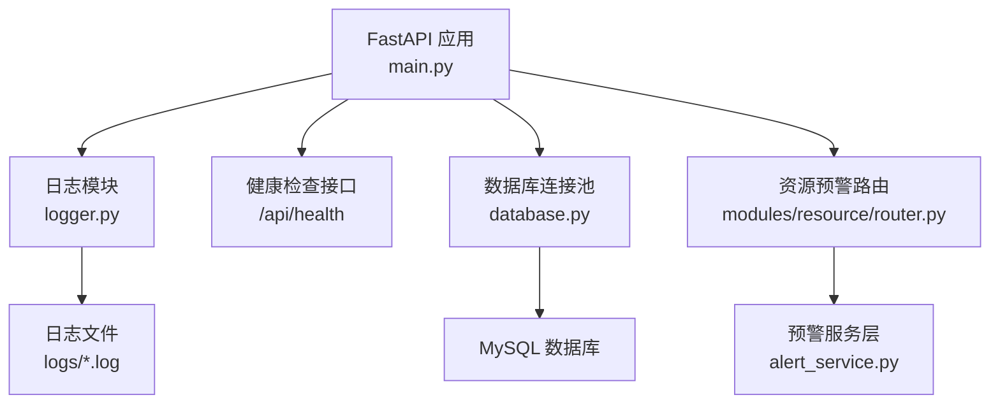
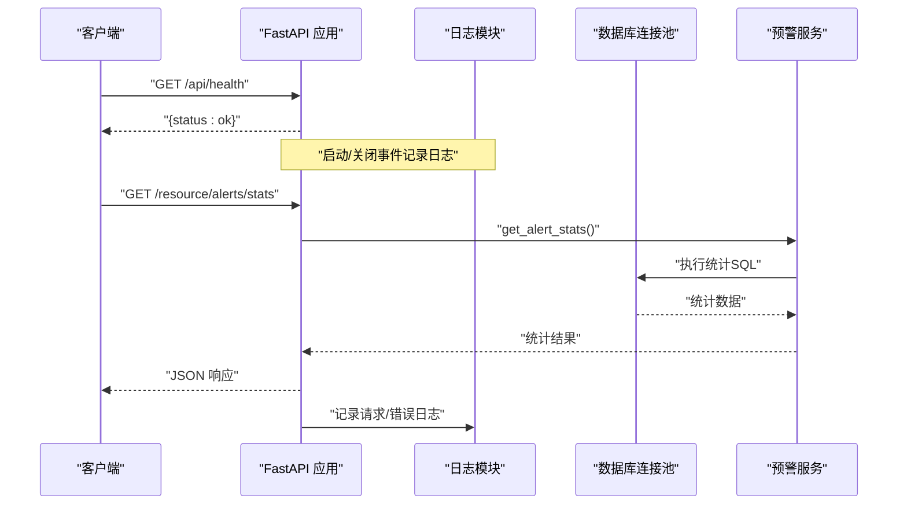
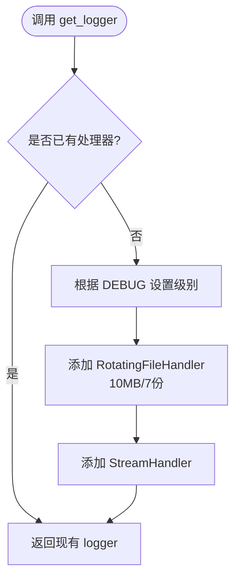
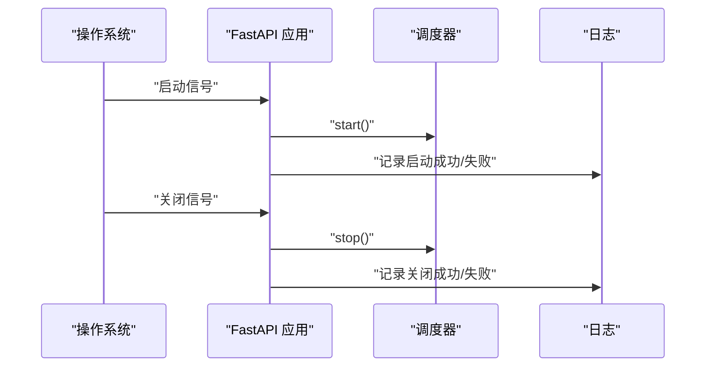
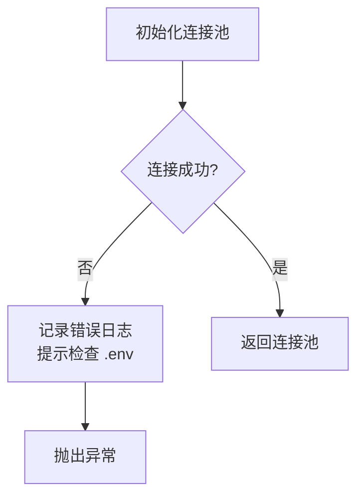
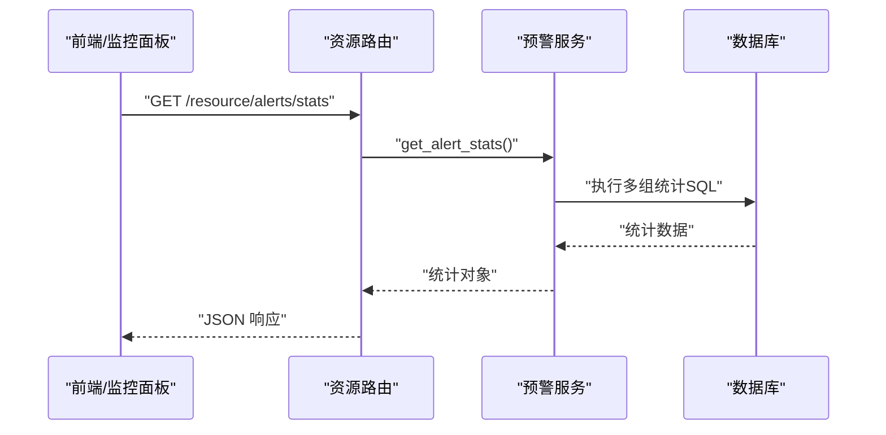
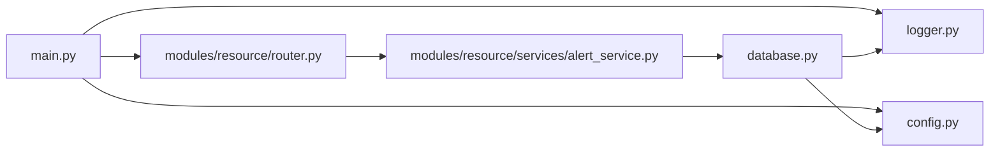

# 监控日志

<cite>
**本文引用的文件**
- [backend/logger.py](file://backend/logger.py)
- [backend/main.py](file://backend/main.py)
- [backend/config.py](file://backend/config.py)
- [backend/database.py](file://backend/database.py)
- [backend/core/exceptions.py](file://backend/core/exceptions.py)
- [backend/modules/resource/services/alert_service.py](file://backend/modules/resource/services/alert_service.py)
- [backend/modules/resource/router.py](file://backend/modules/resource/router.py)
- [backend/env.example](file://backend/env.example)
</cite>

## 目录
1. [简介](#简介)
2. [项目结构](#项目结构)
3. [核心组件](#核心组件)
4. [架构总览](#架构总览)
5. [详细组件分析](#详细组件分析)
6. [依赖关系分析](#依赖关系分析)
7. [性能与容量规划](#性能与容量规划)
8. [故障排查指南](#故障排查指南)
9. [结论](#结论)
10. [附录：配置与运维清单](#附录配置与运维清单)

## 简介
本文件面向“试制资源数智化管理系统”的监控与日志体系，覆盖日志系统设计（级别、格式、组织）、日志收集与分析方案（本地查看、集中采集、查询分析）、监控系统配置（性能指标、健康检查、告警规则）、问题诊断方法（错误日志分析、性能瓶颈定位、异常堆栈跟踪），以及监控仪表板与告警通知设置建议。内容基于仓库中后端代码的实际实现进行说明，并给出可落地的运维实践建议。

## 项目结构
当前系统的日志与监控相关能力主要集中在后端模块：
- 日志子系统：统一通过 logger 模块输出到文件与控制台，支持按应用名分文件与轮转。
- 健康检查：提供 /api/health 接口用于存活与健康探测。
- 数据库连接池：在初始化失败时记录错误日志，便于快速定位配置问题。
- 业务预警：资源模块提供预警统计与列表接口，可作为监控数据源。
- 配置管理：通过 .env 与环境变量控制服务端口、调试模式、CORS 等。

图表来源
- [backend/main.py:29-83](file://backend/main.py#L29-L83)
- [backend/logger.py:14-38](file://backend/logger.py#L14-L38)
- [backend/database.py:12-43](file://backend/database.py#L12-L43)
- [backend/modules/resource/router.py:981-1016](file://backend/modules/resource/router.py#L981-L1016)
- [backend/modules/resource/services/alert_service.py:337-399](file://backend/modules/resource/services/alert_service.py#L337-L399)

章节来源
- [backend/main.py:29-83](file://backend/main.py#L29-L83)
- [backend/logger.py:14-38](file://backend/logger.py#L14-L38)
- [backend/database.py:12-43](file://backend/database.py#L12-L43)
- [backend/modules/resource/router.py:981-1016](file://backend/modules/resource/router.py#L981-L1016)
- [backend/modules/resource/services/alert_service.py:337-399](file://backend/modules/resource/services/alert_service.py#L337-L399)

## 核心组件
- 日志模块
  - 提供统一的 get_logger(name) 获取或复用 logger 实例。
  - 默认级别：DEBUG（开发）/ INFO（生产）。
  - 输出目标：文件（RotatingFileHandler，单文件最大 10MB，保留 7 个历史文件）与控制台。
  - 日志格式：时间戳 + 级别 + 模块名 + 消息；日期格式为年-月-日 时:分:秒。
  - 日志目录：项目根 logs 目录下，按应用名生成日志文件。

- 健康检查
  - GET /api/health 返回固定状态信息，可用于探针与负载均衡健康检查。

- 数据库连接池
  - 使用连接池延迟初始化，失败时记录错误日志并抛出异常，便于定位 .env 配置问题。

- 业务预警与统计
  - 提供预警列表、详情、创建、更新、升级、批量处理与统计接口。
  - 统计包含总数、严重/高优先级数量、未解决数、SLA 超期数、类型分布、近7天趋势等。

章节来源
- [backend/logger.py:14-38](file://backend/logger.py#L14-L38)
- [backend/main.py:94-97](file://backend/main.py#L94-L97)
- [backend/database.py:12-43](file://backend/database.py#L12-L43)
- [backend/modules/resource/services/alert_service.py:337-399](file://backend/modules/resource/services/alert_service.py#L337-L399)

## 架构总览
下图展示从请求入口到日志输出、健康检查与数据库访问的整体流程。

图表来源
- [backend/main.py:36-55](file://backend/main.py#L36-L55)
- [backend/main.py:94-97](file://backend/main.py#L94-L97)
- [backend/modules/resource/router.py:981-988](file://backend/modules/resource/router.py#L981-L988)
- [backend/modules/resource/services/alert_service.py:337-399](file://backend/modules/resource/services/alert_service.py#L337-L399)
- [backend/database.py:51-101](file://backend/database.py#L51-L101)

## 详细组件分析

### 日志子系统
- 日志级别
  - 开发环境：DEBUG
  - 生产环境：INFO
  - 依据 DEBUG 环境变量切换。

- 日志格式
  - 行格式：时间戳 + 级别 + 模块名 + 消息
  - 日期格式：YYYY-MM-DD HH:MM:SS

- 文件组织
  - 目录：项目根 logs 文件夹
  - 文件名：以应用名为前缀的 .log 文件
  - 轮转策略：单文件最大 10MB，最多保留 7 个历史文件

- 控制台输出
  - 同时输出到标准输出，便于容器化部署时由外部日志采集器抓取

- 扩展建议
  - 增加结构化字段（如 request_id、user_id、trace_id）
  - 接入 JSON 格式日志以便集中式解析
  - 按模块拆分日志文件或使用不同级别处理器

图表来源
- [backend/logger.py:14-38](file://backend/logger.py#L14-L38)

章节来源
- [backend/logger.py:14-38](file://backend/logger.py#L14-L38)

### 健康检查与生命周期
- 健康检查接口
  - GET /api/health 返回运行状态，适合 K8s Liveness/Readiness 探针或负载均衡健康检查。

- 启动/关闭事件
  - 启动时尝试启动调度器并记录日志
  - 关闭时停止调度器并记录日志
  - 进程退出信号处理中记录清理过程

图表来源
- [backend/main.py:36-55](file://backend/main.py#L36-L55)
- [backend/main.py:122-159](file://backend/main.py#L122-L159)

章节来源
- [backend/main.py:36-55](file://backend/main.py#L36-L55)
- [backend/main.py:94-97](file://backend/main.py#L94-L97)
- [backend/main.py:122-159](file://backend/main.py#L122-L159)

### 数据库连接与错误日志
- 连接池初始化失败会记录错误日志，提示检查 .env 中的数据库配置项。
- 写操作失败自动回滚并抛出异常，便于上层捕获与记录。

图表来源
- [backend/database.py:12-43](file://backend/database.py#L12-L43)

章节来源
- [backend/database.py:12-43](file://backend/database.py#L12-L43)

### 业务预警与统计
- 统计维度
  - 总数、严重/高优先级数量、未解决数、SLA 超期数
  - 级别分布、状态分布、类型分布
  - 近7天新增趋势、升级数量

- 接口
  - GET /resource/alerts/stats 返回统计结果
  - GET /resource/alerts/{id} 返回详情
  - POST /resource/alerts 创建预警
  - 其他列表、更新、升级、批量处理接口

图表来源
- [backend/modules/resource/router.py:981-1016](file://backend/modules/resource/router.py#L981-L1016)
- [backend/modules/resource/services/alert_service.py:337-399](file://backend/modules/resource/services/alert_service.py#L337-L399)

章节来源
- [backend/modules/resource/router.py:981-1016](file://backend/modules/resource/router.py#L981-L1016)
- [backend/modules/resource/services/alert_service.py:337-399](file://backend/modules/resource/services/alert_service.py#L337-L399)

## 依赖关系分析
- main.py 依赖 logger、config、各模块 router，并在启动/关闭事件中调用调度器。
- database.py 依赖 config.settings 与 logger，负责连接池与 SQL 执行。
- alert_service.py 依赖 database 与 logger，提供预警 CRUD 与统计。
- router.py 暴露资源模块的 REST 接口，调用 service 层。

图表来源
- [backend/main.py:29-83](file://backend/main.py#L29-L83)
- [backend/modules/resource/router.py:981-1016](file://backend/modules/resource/router.py#L981-L1016)
- [backend/modules/resource/services/alert_service.py:337-399](file://backend/modules/resource/services/alert_service.py#L337-L399)
- [backend/database.py:12-43](file://backend/database.py#L12-L43)

章节来源
- [backend/main.py:29-83](file://backend/main.py#L29-L83)
- [backend/modules/resource/router.py:981-1016](file://backend/modules/resource/router.py#L981-L1016)
- [backend/modules/resource/services/alert_service.py:337-399](file://backend/modules/resource/services/alert_service.py#L337-L399)
- [backend/database.py:12-43](file://backend/database.py#L12-L43)

## 性能与容量规划
- 日志轮转
  - 单文件上限 10MB，保留 7 份，避免磁盘占用过大。
  - 建议定期归档与压缩历史日志。

- 数据库连接池
  - 最大连接数 10，缓存 5，阻塞模式，避免并发过高导致资源耗尽。
  - 在高并发场景下可根据 QPS 与慢查询情况调整池大小。

- 统计查询
  - 预警统计涉及多组聚合 SQL，建议在 alerts 表上对常用过滤字段建立索引（如 level、status、raised_at、alert_type）。
  - 若数据量增长较快，考虑分区或归档策略。

[本节为通用性能建议，不直接分析具体文件]

## 故障排查指南
- 错误日志分析
  - 关注 ERROR 级别日志，尤其是数据库连接池初始化失败的错误信息，通常由 .env 配置错误引起。
  - 业务异常可通过全局异常处理器捕获并返回标准化错误码与消息。

- 性能瓶颈定位
  - 结合慢查询日志与统计接口响应时间，识别热点 SQL。
  - 观察日志中耗时较长的处理链路，必要时引入请求级 trace_id。

- 异常堆栈跟踪
  - 在生产环境建议开启结构化日志并保留完整堆栈，便于问题回溯。
  - 对于关键路径（如调度器启停、爬虫任务、数据库写入）增加 try/catch 与日志记录。

章节来源
- [backend/database.py:12-43](file://backend/database.py#L12-L43)
- [backend/core/exceptions.py:2-8](file://backend/core/exceptions.py#L2-L8)
- [backend/main.py:85-92](file://backend/main.py#L85-L92)

## 结论
当前系统已具备基础的日志与监控能力：统一日志输出、健康检查接口、数据库连接错误日志、业务预警统计。建议在此基础上完善结构化日志、集中式采集、指标采集与告警规则，形成完整的可观测性闭环，提升问题发现与定位效率。

[本节为总结性内容，不直接分析具体文件]

## 附录：配置与运维清单

### 日志系统设计规范
- 日志级别
  - DEBUG：开发与调试
  - INFO：正常运行信息
  - WARNING：潜在风险
  - ERROR：错误与异常
  - CRITICAL：致命错误

- 日志格式
  - 时间戳、级别、模块名、消息
  - 建议逐步引入结构化字段（request_id、user_id、trace_id、span_id）

- 文件组织
  - 目录：logs
  - 命名：应用名.log
  - 轮转：10MB/7份

- 控制台输出
  - 容器化部署时由 stdout 采集

章节来源
- [backend/logger.py:14-38](file://backend/logger.py#L14-L38)

### 日志收集与分析方案
- 本地日志查看
  - 直接查看 logs 目录下的日志文件
  - 使用 tail/grep/awk 等工具筛选关键字与级别

- 集中式日志收集
  - 推荐方案：Fluent Bit/Filebeat -> Elasticsearch -> Kibana
  - 或：Cloud Logging（阿里云日志服务、腾讯云CLS）
  - 将 stdout 与文件日志统一采集，避免遗漏

- 日志查询分析
  - 按时间范围、级别、模块、关键字检索
  - 建立常用看板：错误率、慢请求、数据库连接失败、预警统计

[本节为通用运维建议，不直接分析具体文件]

### 监控系统配置
- 性能指标采集
  - 应用指标：QPS、响应时间、错误率、连接池使用率
  - 系统指标：CPU、内存、磁盘、网络
  - 业务指标：预警总数、未解决数、SLA 超期数、类型分布

- 健康检查接口
  - GET /api/health 用于存活与健康探测
  - 可在 K8s 中配置 livenessProbe 与 readinessProbe

- 告警规则配置
  - 错误率阈值：例如 5 分钟内错误率 > 5%
  - SLA 超期：overdue > 0 持续 N 分钟
  - 数据库连接失败：连续 N 次连接失败
  - 预警激增：单位时间内新增预警数超过阈值

章节来源
- [backend/main.py:94-97](file://backend/main.py#L94-L97)
- [backend/modules/resource/services/alert_service.py:337-399](file://backend/modules/resource/services/alert_service.py#L337-L399)

### 问题诊断方法
- 错误日志分析
  - 聚焦 ERROR 与 CRITICAL 日志
  - 关注数据库连接池初始化失败提示

- 性能瓶颈定位
  - 结合慢查询与统计接口响应时间
  - 观察日志中耗时较长链路

- 异常堆栈跟踪
  - 保留完整堆栈信息
  - 对关键路径增加 try/catch 与日志记录

章节来源
- [backend/database.py:12-43](file://backend/database.py#L12-L43)
- [backend/core/exceptions.py:2-8](file://backend/core/exceptions.py#L2-L8)

### 监控仪表板与告警通知设置
- 仪表板建议
  - 概览：服务健康、QPS、错误率、连接池使用率
  - 业务：预警总数、未解决数、SLA 超期数、类型分布、近7天趋势
  - 系统：CPU、内存、磁盘、网络

- 告警通知
  - 渠道：邮件、企业微信、钉钉、短信
  - 规则：错误率、SLA 超期、数据库连接失败、预警激增
  - 分级：P0/P1/P2，对应不同通知频率与升级策略

[本节为通用运维建议，不直接分析具体文件]

### 环境变量与配置要点
- 关键配置项
  - SERVER_HOST/SERVER_PORT：服务监听地址与端口
  - DEBUG：调试模式开关
  - CORS_ORIGINS：跨域白名单
  - DB_*：数据库连接配置
  - SPIDER_INTERVAL_MINUTES/SPIDER_TIMEOUT_SECONDS：爬虫间隔与超时
  - QR_BASE_URL：二维码页面基础地址

- 注意事项
  - 确保 .env 文件存在且配置正确
  - 生产环境关闭 DEBUG，限制 CORS_ORIGINS
  - 合理设置数据库连接池参数

章节来源
- [backend/config.py:48-98](file://backend/config.py#L48-L98)
- [backend/env.example:7-49](file://backend/env.example#L7-L49)