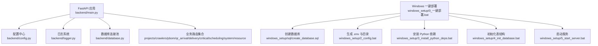
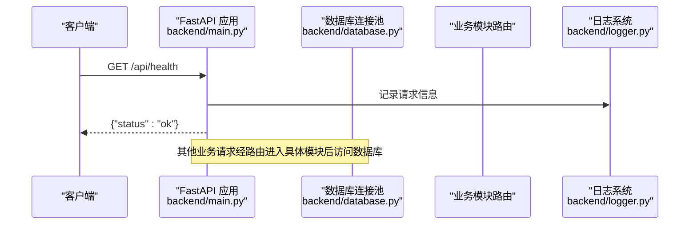
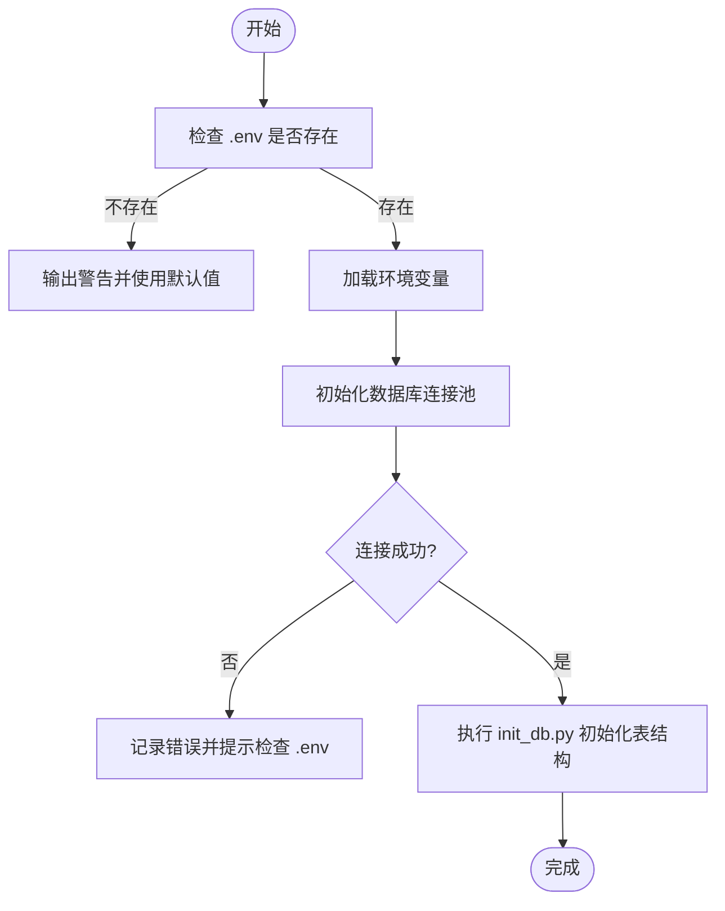
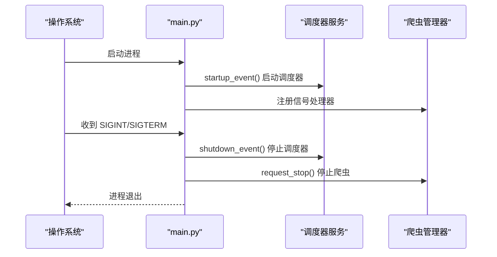
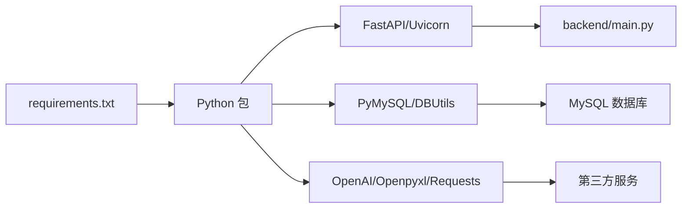

# 部署运维

<cite>
**本文引用的文件**
- [backend/config.py](file://backend/config.py)
- [backend/env.example](file://backend/env.example)
- [backend/main.py](file://backend/main.py)
- [backend/database.py](file://backend/database.py)
- [backend/requirements.txt](file://backend/requirements.txt)
- [backend/logger.py](file://backend/logger.py)
- [backend/scripts/init_db.py](file://backend/scripts/init_db.py)
- [windows_setup/0_一键部署.bat](file://windows_setup/0_一键部署.bat)
- [windows_setup/1_install_mysql.bat](file://windows_setup/1_install_mysql.bat)
- [windows_setup/2_config.bat](file://windows_setup/2_config.bat)
- [windows_setup/3_install_python_deps.bat](file://windows_setup/3_install_python_deps.bat)
- [windows_setup/4_init_database.bat](file://windows_setup/4_init_database.bat)
- [windows_setup/5_start_server.bat](file://windows_setup/5_start_server.bat)
- [windows_setup/sql/create_database.sql](file://windows_setup/sql/create_database.sql)
- [start_server.py](file://start_server.py)
</cite>

## 目录
1. [简介](#简介)
2. [项目结构](#项目结构)
3. [核心组件](#核心组件)
4. [架构总览](#架构总览)
5. [详细组件分析](#详细组件分析)
6. [依赖关系分析](#依赖关系分析)
7. [性能考虑](#性能考虑)
8. [故障排查指南](#故障排查指南)
9. [结论](#结论)
10. [附录](#附录)

## 简介
本运维文档面向生产环境，覆盖试制资源数智化管理系统的服务器要求、软件依赖、数据库配置与初始化、环境变量与第三方服务集成、安全设置、日志管理策略、监控告警建议、备份恢复与灾难恢复方案，以及常见问题的诊断与处理方法。文档同时提供 Windows 平台的一键部署脚本使用说明，并给出 Linux 环境的通用部署指引（基于现有脚本与代码行为推导）。

## 项目结构
后端采用 FastAPI + Uvicorn 的异步 Web 框架，使用 PyMySQL + DBUtils 连接池访问 MySQL；通过 .env 进行配置管理；内置日志轮转；提供 Windows 一键部署脚本与 SQL 建库脚本；应用启动时自动加载调度器与路由，并提供健康检查接口。

图表来源
- [backend/main.py:29-83](file://backend/main.py#L29-L83)
- [backend/config.py:48-98](file://backend/config.py#L48-L98)
- [backend/database.py:12-43](file://backend/database.py#L12-L43)
- [backend/logger.py:14-38](file://backend/logger.py#L14-L38)
- [windows_setup/0_一键部署.bat:9-36](file://windows_setup/0_一键部署.bat#L9-L36)
- [windows_setup/sql/create_database.sql:9-19](file://windows_setup/sql/create_database.sql#L9-L19)

章节来源
- [backend/main.py:29-83](file://backend/main.py#L29-L83)
- [backend/config.py:48-98](file://backend/config.py#L48-L98)
- [backend/database.py:12-43](file://backend/database.py#L12-L43)
- [backend/logger.py:14-38](file://backend/logger.py#L14-L38)
- [windows_setup/0_一键部署.bat:9-36](file://windows_setup/0_一键部署.bat#L9-L36)
- [windows_setup/sql/create_database.sql:9-19](file://windows_setup/sql/create_database.sql#L9-L19)

## 核心组件
- 配置管理：集中读取 .env 环境变量，提供类型安全的配置项（数据库、爬虫、WMS、飞书、采购系统、LLM、服务端口、CORS、上传目录等）。
- 数据库层：基于 DBUtils 的连接池，延迟初始化，失败时输出明确错误提示；封装常用查询与执行方法。
- 应用入口：注册路由、CORS、全局异常处理、健康检查、前端静态资源托管、启动/关闭事件钩子。
- 日志系统：按级别输出到控制台与文件，支持文件大小与保留数量控制。
- Windows 部署脚本：一键完成建库、配置、依赖安装、表初始化与服务启动。

章节来源
- [backend/config.py:48-98](file://backend/config.py#L48-L98)
- [backend/database.py:12-43](file://backend/database.py#L12-L43)
- [backend/main.py:29-83](file://backend/main.py#L29-L83)
- [backend/logger.py:14-38](file://backend/logger.py#L14-L38)
- [windows_setup/0_一键部署.bat:9-36](file://windows_setup/0_一键部署.bat#L9-L36)

## 架构总览
系统以 FastAPI 为 API 网关，统一暴露项目管理、爬虫管理、PBOM 解析、QR 到件、多源去重合并、关键件评分、排程、系统设置、试制资源等模块。运行时通过连接池访问 MySQL，按需调用外部服务（WMS、飞书、采购系统、DeepSeek LLM）。

图表来源
- [backend/main.py:94-97](file://backend/main.py#L94-L97)
- [backend/database.py:12-43](file://backend/database.py#L12-L43)
- [backend/logger.py:14-38](file://backend/logger.py#L14-L38)

## 详细组件分析

### 配置与环境变量
- 配置文件位置：backend/.env（由 backend/.env.example 复制而来）
- 关键配置项：
  - 数据库：DB_HOST、DB_PORT、DB_USER、DB_PASSWORD、DB_DATABASE
  - 服务：SERVER_HOST、SERVER_PORT、DEBUG、CORS_ORIGINS、UPLOAD_DIR、QR_BASE_URL
  - 爬虫：SPIDER_INTERVAL_MINUTES、SPIDER_TIMEOUT_SECONDS
  - WMS：LOGIN_URL、QUERY_URL
  - 飞书：FEISHU_APP_ID、FEISHU_APP_SECRET、FEISHU_SHEET_URL
  - 采购系统：PURCHASE_API_URL、PURCHASE_API_KEY
  - DeepSeek LLM：DEEPSEEK_API_KEY、DEEPSEEK_BASE_URL、DEEPSEEK_MODEL
- 行为说明：
  - 未找到 .env 时会输出警告并使用默认值，可能导致数据库连接失败。
  - 布尔型配置支持多种写法（true/false、1/0、yes/no、on）。
  - 列表型配置支持逗号分隔。

章节来源
- [backend/config.py:15-22](file://backend/config.py#L15-L22)
- [backend/config.py:48-98](file://backend/config.py#L48-L98)
- [backend/env.example:7-49](file://backend/env.example#L7-L49)

### 数据库与初始化
- 连接池：PooledDB，最大连接数、缓存连接数、阻塞模式、字符集 utf8mb4。
- 初始化流程：
  - Windows 建库：windows_setup/sql/create_database.sql 创建 warehouse_data 数据库与可选用户。
  - 表结构初始化：backend/scripts/init_db.py 创建业务表、扩展列、默认系统参数。
- 注意事项：
  - 若 .env 配置错误或数据库不可达，连接池初始化会抛出带提示的错误。
  - 所有写操作均包含事务提交与回滚保护。

图表来源
- [backend/config.py:15-22](file://backend/config.py#L15-L22)
- [backend/database.py:12-43](file://backend/database.py#L12-L43)
- [backend/scripts/init_db.py:17-293](file://backend/scripts/init_db.py#L17-L293)

章节来源
- [backend/database.py:12-43](file://backend/database.py#L12-L43)
- [backend/scripts/init_db.py:17-293](file://backend/scripts/init_db.py#L17-L293)
- [windows_setup/sql/create_database.sql:9-19](file://windows_setup/sql/create_database.sql#L9-L19)

### 应用启动与生命周期
- 启动事件：加载调度器服务，记录日志。
- 关闭事件：停止调度器服务，记录日志。
- 进程退出：捕获 SIGINT/SIGTERM，优雅停止调度器与爬虫管理器。
- 健康检查：/api/health 返回运行状态。
- 静态资源：当 static/index.html 存在时，作为 SPA 入口提供服务。

图表来源
- [backend/main.py:36-55](file://backend/main.py#L36-L55)
- [backend/main.py:122-159](file://backend/main.py#L122-L159)

章节来源
- [backend/main.py:36-55](file://backend/main.py#L36-L55)
- [backend/main.py:94-97](file://backend/main.py#L94-L97)
- [backend/main.py:122-159](file://backend/main.py#L122-L159)

### 日志管理
- 日志级别：DEBUG（开发）或 INFO（生产），由 DEBUG 开关决定。
- 输出目标：控制台 + 文件（logs 目录）。
- 轮转策略：单文件最大 10MB，最多保留 7 个历史文件。
- 编码：UTF-8。
- 建议：
  - 生产环境将 DEBUG 设置为 false，降低日志量。
  - 结合日志收集系统（如 ELK）集中采集 logs/*.log。

章节来源
- [backend/logger.py:14-38](file://backend/logger.py#L14-L38)

### Windows 部署脚本使用
- 一键部署：双击 windows_setup/0_一键部署.bat，依次执行建库、配置、依赖安装、表初始化、启动服务。
- 分步脚本：
  - 1_install_mysql.bat：检测 mysql 命令，输入 root 密码，执行 create_database.sql。
  - 2_config.bat：复制 .env.example 到 .env，创建 logs/uploads 目录，提示编辑 .env。
  - 3_install_python_deps.bat：升级 pip，安装 requirements.txt 依赖（优先清华镜像）。
  - 4_init_database.bat：执行 init_db.py 初始化表结构与默认参数。
  - 5_start_server.bat：启动 FastAPI 服务，浏览器访问 http://localhost:8000。
- 常见问题：
  - 端口占用：修改 SERVER_PORT。
  - 依赖安装慢：使用镜像源或手动指定 -i https://pypi.tuna.tsinghua.edu.cn/simple。
  - 中文字段乱码：确保数据库与连接使用 utf8mb4。

章节来源
- [windows_setup/0_一键部署.bat:9-36](file://windows_setup/0_一键部署.bat#L9-L36)
- [windows_setup/1_install_mysql.bat:16-53](file://windows_setup/1_install_mysql.bat#L16-L53)
- [windows_setup/2_config.bat:16-48](file://windows_setup/2_config.bat#L16-L48)
- [windows_setup/3_install_python_deps.bat:16-50](file://windows_setup/3_install_python_deps.bat#L16-L50)
- [windows_setup/4_init_database.bat:16-47](file://windows_setup/4_init_database.bat#L16-L47)
- [windows_setup/5_start_server.bat:16-36](file://windows_setup/5_start_server.bat#L16-L36)
- [windows_setup/sql/create_database.sql:9-19](file://windows_setup/sql/create_database.sql#L9-L19)

### Linux 部署指引（通用）
- 前置条件：
  - 操作系统：Linux 发行版（CentOS/RHEL/Ubuntu/Debian 等）
  - Python：3.8+（推荐 3.10）
  - 数据库：MySQL 5.7/8.0 或 MariaDB 10.5+
- 步骤：
  1) 安装 Python 依赖：python -m pip install -r backend/requirements.txt
  2) 准备 .env：cp backend/.env.example backend/.env，填写数据库与服务配置
  3) 创建数据库：使用 mysql 客户端执行 windows_setup/sql/create_database.sql
  4) 初始化表结构：python backend/scripts/init_db.py
  5) 启动服务：python backend/main.py 或使用 start_server.py（跨平台进程管理）
  6) 反向代理（可选）：Nginx 监听 80/443，转发至 127.0.0.1:8000
  7) 进程守护（推荐）：systemd 或 supervisor 管理进程，开机自启
- 注意：
  - 防火墙与安全组放行对应端口
  - 如需 HTTPS，配置 Nginx SSL 证书与域名

[本节为通用指导，不直接分析具体文件]

### 第三方服务集成
- WMS 仓库接口：配置 LOGIN_URL、QUERY_URL，用于拉取到货数据。
- 飞书共享表：配置 FEISHU_APP_ID、FEISHU_APP_SECRET、FEISHU_SHEET_URL，后续实现同步。
- 采购系统：配置 PURCHASE_API_URL、PURCHASE_API_KEY，预留对接。
- DeepSeek LLM：配置 DEEPSEEK_API_KEY、DEEPSEEK_BASE_URL、DEEPSEEK_MODEL，用于智能评估。
- 安全建议：
  - 敏感信息仅保存在 .env，禁止入库或版本控制
  - 限制 CORS_ORIGINS 为可信域名
  - 对外网暴露的服务启用认证与限流

章节来源
- [backend/config.py:58-88](file://backend/config.py#L58-L88)
- [backend/env.example:22-45](file://backend/env.example#L22-L45)

### 安全设置
- 最小权限原则：数据库建议使用专用账号（如 spider_v5），仅授予必要权限。
- 网络隔离：数据库仅允许应用服务器 IP 访问。
- 传输加密：对外服务启用 HTTPS，内部服务尽量走内网。
- 输入校验与异常处理：全局 BusinessError 已定义，便于统一错误响应。

章节来源
- [backend/main.py:85-92](file://backend/main.py#L85-L92)
- [windows_setup/sql/create_database.sql:14-19](file://windows_setup/sql/create_database.sql#L14-L19)

### 监控与告警建议
- 健康检查：定期调用 /api/health，结合监控系统（Prometheus/Grafana）采集可用性。
- 指标采集：可接入中间件统计 QPS、延迟、错误率。
- 告警规则：
  - 服务不可用超过阈值
  - 数据库连接失败次数突增
  - 爬虫任务失败率升高
- 日志采集：集中采集 logs/*.log，设置关键字告警（ERROR、Exception）。

[本节为通用指导，不直接分析具体文件]

### 备份恢复与灾难恢复
- 数据库备份：
  - 全量备份：mysqldump --single-transaction --routines --triggers --events -A > backup_full.sql
  - 增量备份：开启 binlog，按时间点恢复
  - 频率：每日全量 + 每小时增量（根据业务容忍度调整）
- 备份存储：异地对象存储（如 OSS/S3），加密保存
- 恢复演练：定期验证备份可用性与恢复时间
- 灾难恢复：
  - 多活或主从切换预案
  - 快速重建：新机器安装依赖 -> 导入最新备份 -> 执行 init_db.py 补全结构 -> 启动服务

[本节为通用指导，不直接分析具体文件]

## 依赖关系分析
- 运行时依赖：FastAPI、Uvicorn、PyMySQL、DBUtils、python-dotenv、requests、openpyxl、xlrd、aiofiles、qrcode、Pillow、openai（可选）
- 启动依赖：uvicorn 运行 main.py，加载配置与路由
- 外部依赖：MySQL 数据库、WMS/飞书/采购系统 API、DeepSeek LLM（可选）

图表来源
- [backend/requirements.txt:1-21](file://backend/requirements.txt#L1-L21)
- [backend/main.py:29-83](file://backend/main.py#L29-L83)
- [backend/database.py:12-43](file://backend/database.py#L12-L43)

章节来源
- [backend/requirements.txt:1-21](file://backend/requirements.txt#L1-L21)
- [backend/main.py:29-83](file://backend/main.py#L29-L83)
- [backend/database.py:12-43](file://backend/database.py#L12-L43)

## 性能考虑
- 数据库连接池：合理设置 maxconnections、maxcached，避免连接耗尽或过多上下文切换。
- 爬虫间隔与超时：调整 SPIDER_INTERVAL_MINUTES、SPIDER_TIMEOUT_SECONDS 平衡负载与时效性。
- 静态资源缓存：生产环境可通过反向代理对静态资源启用缓存策略。
- 日志级别：生产使用 INFO，减少磁盘 IO 与日志体积。
- 反向代理：Nginx 负载均衡与压缩，减轻应用压力。
- 资源限制：容器化部署时设置 CPU/内存限制，防止资源争用。

[本节为通用指导，不直接分析具体文件]

## 故障排查指南
- 数据库连接失败：
  - 检查 .env 中的 DB_HOST/DB_PORT/DB_USER/DB_PASSWORD/DB_DATABASE
  - 确认 MySQL 服务运行且端口可达
  - 查看连接池初始化日志提示
- 端口被占用：
  - 修改 SERVER_PORT 或释放占用端口
- 依赖安装失败：
  - 使用镜像源重试，或离线安装 wheel
- 中文字段乱码：
  - 确认数据库、表、连接均为 utf8mb4
- 服务无法停止：
  - Windows 可使用 taskkill 强制终止；Linux 使用 kill 或 systemctl stop
- 调度器启动失败：
  - 查看启动日志，确认依赖与配置正确

章节来源
- [backend/database.py:34-42](file://backend/database.py#L34-L42)
- [backend/logger.py:14-38](file://backend/logger.py#L14-L38)
- [windows_setup/1_install_mysql.bat:36-53](file://windows_setup/1_install_mysql.bat#L36-L53)
- [windows_setup/3_install_python_deps.bat:30-50](file://windows_setup/3_install_python_deps.bat#L30-L50)
- [windows_setup/5_start_server.bat:26-36](file://windows_setup/5_start_server.bat#L26-L36)

## 结论
本系统以 FastAPI 为核心，配合 .env 配置、数据库连接池与日志轮转，提供了清晰的部署路径与运维基线。Windows 一键脚本降低了本地与测试环境门槛；生产环境建议结合反向代理、进程守护、监控告警与备份恢复策略，确保高可用与可维护性。

## 附录
- 启动辅助脚本：start_server.py 提供跨平台的进程管理与优雅停止能力，适用于 Windows 与 Linux。
- 参考路径：
  - 配置示例：backend/env.example
  - 依赖清单：backend/requirements.txt
  - 数据库初始化：backend/scripts/init_db.py
  - Windows 脚本：windows_setup/*

章节来源
- [start_server.py:23-88](file://start_server.py#L23-L88)
- [backend/env.example:7-49](file://backend/env.example#L7-L49)
- [backend/requirements.txt:1-21](file://backend/requirements.txt#L1-L21)
- [backend/scripts/init_db.py:17-293](file://backend/scripts/init_db.py#L17-L293)
- [windows_setup/0_一键部署.bat:9-36](file://windows_setup/0_一键部署.bat#L9-L36)