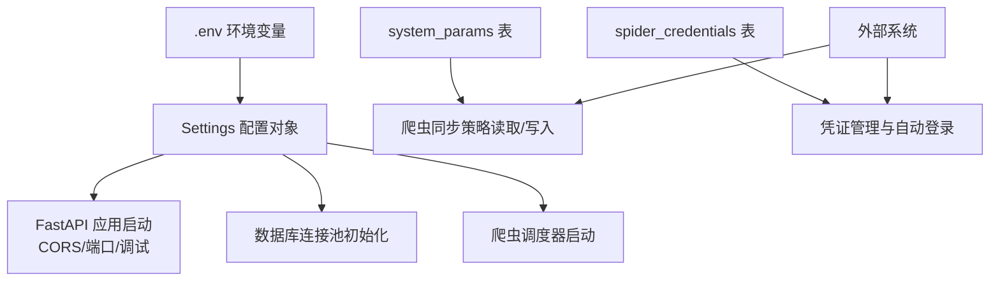
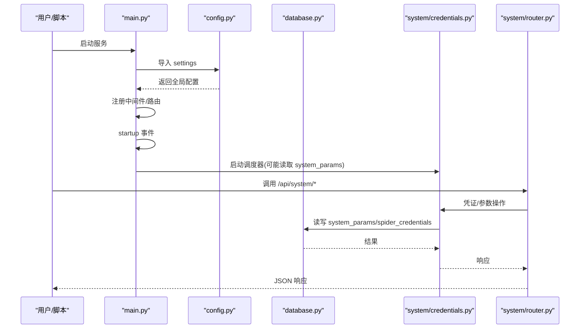
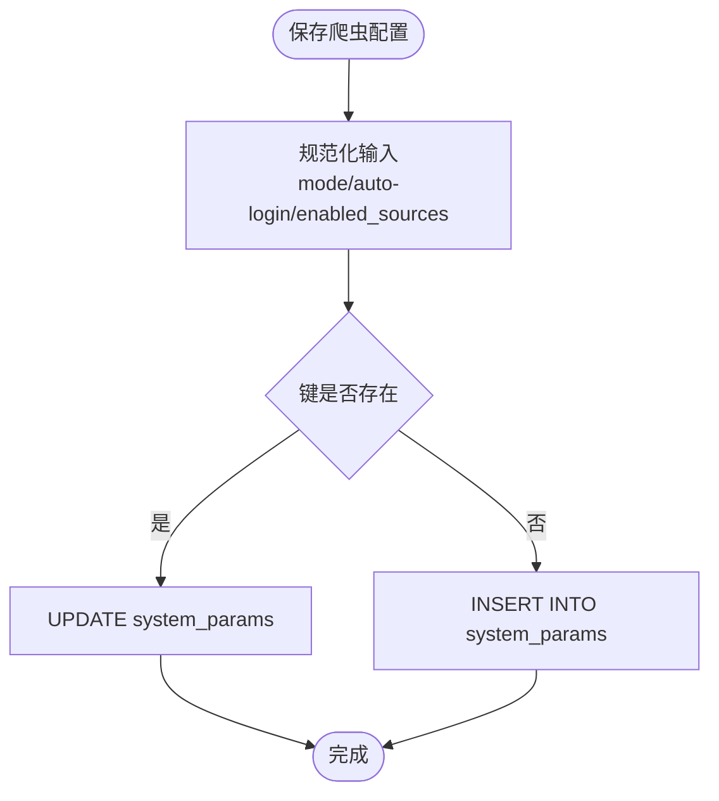
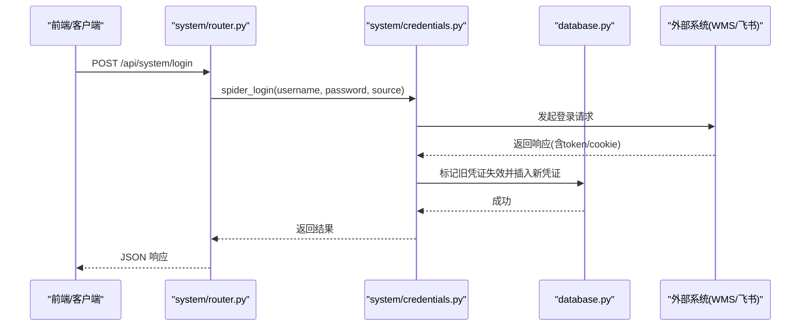
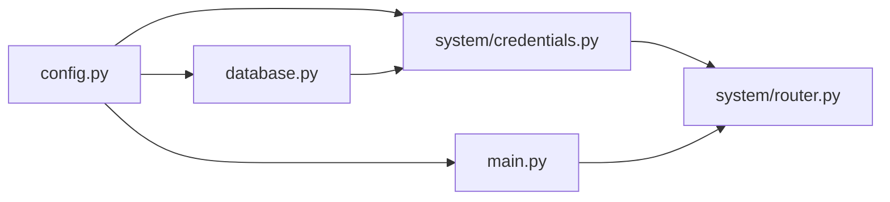

# 配置管理

<cite>
**本文引用的文件**
- [backend/config.py](file://backend/config.py)
- [backend/env.example](file://backend/env.example)
- [backend/database.py](file://backend/database.py)
- [backend/system/credentials.py](file://backend/system/credentials.py)
- [backend/system/router.py](file://backend/system/router.py)
- [backend/main.py](file://backend/main.py)
- [backend/scripts/check_config.py](file://backend/scripts/check_config.py)
- [backend/sql/init_resource_db.py](file://backend/sql/init_resource_db.py)
</cite>

## 目录
1. [简介](#简介)
2. [项目结构与配置总览](#项目结构与配置总览)
3. [核心组件](#核心组件)
4. [架构总览](#架构总览)
5. [详细组件分析](#详细组件分析)
6. [依赖关系分析](#依赖关系分析)
7. [性能与可用性考虑](#性能与可用性考虑)
8. [故障排查指南](#故障排查指南)
9. [结论](#结论)
10. [附录：配置项清单与最佳实践](#附录配置项清单与最佳实践)

## 简介
本文件为“试制资源数智化管理系统”的配置管理文档，覆盖环境变量、数据库连接、第三方服务集成（WMS、飞书、采购系统、DeepSeek LLM）、动态配置更新机制、安全配置管理（敏感信息保护、访问控制、API密钥管理）、配置验证工具与最佳实践。目标是帮助运维与开发人员正确部署、运行与维护系统的配置体系。

## 项目结构与配置总览
系统采用“启动时静态配置 + 运行时动态配置”的双层模式：
- 启动时静态配置：通过 .env 环境变量加载，集中定义在 Settings 类中，供服务启动、数据库连接池、CORS、爬虫间隔等使用。
- 运行时动态配置：通过数据库表 system_params 存储爬虫同步策略、执行状态等；通过 spider_credentials 表存储多数据源凭证（Token/Cookie/用户名密码）及自动登录刷新逻辑。

图表来源
- [backend/config.py:48-98](file://backend/config.py#L48-L98)
- [backend/database.py:12-43](file://backend/database.py#L12-L43)
- [backend/system/credentials.py:297-401](file://backend/system/credentials.py#L297-L401)
- [backend/main.py:29-83](file://backend/main.py#L29-L83)

章节来源
- [backend/config.py:1-102](file://backend/config.py#L1-L102)
- [backend/main.py:29-83](file://backend/main.py#L29-L83)

## 核心组件
- 配置加载与类型转换：提供整数、布尔、列表等安全读取方法，统一从环境变量获取并回退默认值。
- 数据库连接池：基于 dbutils PooledDB，延迟初始化，失败时输出明确提示。
- 凭证与动态参数：支持多数据源凭证的增删改查、自动登录获取 Token、手动同步 Token/Cookie、飞书 tenant_access_token 获取与过期刷新、爬虫同步策略读写。
- 路由暴露：对外提供系统设置相关 API（登录、凭证管理、参数更新）。

章节来源
- [backend/config.py:25-46](file://backend/config.py#L25-L46)
- [backend/database.py:12-43](file://backend/database.py#L12-L43)
- [backend/system/credentials.py:174-401](file://backend/system/credentials.py#L174-L401)
- [backend/system/router.py:52-109](file://backend/system/router.py#L52-L109)

## 架构总览
系统启动流程与配置加载顺序如下：
1. 加载 .env 到环境变量。
2. 构建 Settings 实例，读取所有配置项。
3. 初始化 FastAPI 应用，注册 CORS、路由与健康检查。
4. 启动事件触发调度器（爬虫调度）。
5. 首次数据库访问时初始化连接池，若失败则记录错误日志并抛出异常。
6. 运行时通过 API 修改 system_params 或 spider_credentials，影响后续行为。

图表来源
- [backend/main.py:29-83](file://backend/main.py#L29-L83)
- [backend/config.py:48-98](file://backend/config.py#L48-L98)
- [backend/system/router.py:52-109](file://backend/system/router.py#L52-L109)
- [backend/system/credentials.py:297-401](file://backend/system/credentials.py#L297-L401)
- [backend/database.py:12-43](file://backend/database.py#L12-L43)

## 详细组件分析

### 环境变量与静态配置（Settings）
- 作用域：服务启动即生效，不可热重载。
- 主要类别：
  - 数据库：主机、端口、用户、密码、库名。
  - 爬虫：间隔、超时。
  - WMS：登录与查询接口地址。
  - 飞书：App ID、Secret、Sheet URL。
  - 采购系统：API URL、Key。
  - DeepSeek LLM：API Key、Base URL、Model。
  - 服务：Host、Port、Debug、CORS 来源、QR 基础 URL、上传目录。
- 类型处理：
  - 整数：非法值回退默认。
  - 布尔：支持 true/false、1/0、yes/no。
  - 列表：逗号分隔字符串转列表。
- 注意事项：
  - 未找到 .env 会输出警告并使用默认值，可能导致数据库连接失败。
  - 上传目录会在启动时确保存在。

章节来源
- [backend/config.py:25-46](file://backend/config.py#L25-L46)
- [backend/config.py:48-102](file://backend/config.py#L48-L102)
- [backend/env.example:1-49](file://backend/env.example#L1-L49)

### 数据库连接与连接池
- 连接池：PooledDB，最大连接数、缓存连接数、阻塞等待。
- 延迟初始化：首次 get_pool() 时才创建，避免启动期因配置错误直接崩溃。
- 错误提示：连接池初始化失败会记录包含配置字段提示的错误日志。
- 常用封装：query_all/query_one/execute/execute_last_id/execute_all。

章节来源
- [backend/database.py:12-43](file://backend/database.py#L12-L43)
- [backend/database.py:46-116](file://backend/database.py#L46-L116)

### 动态配置：爬虫同步策略（system_params）
- 键集合与默认值：包括模式（auto/manual）、增量/全量间隔、启用数据源、自动登录开关、最近执行时间/状态等。
- 读取：按键批量查询，缺失键使用默认值，并将 enabled_sources 拆分为列表。
- 写入：规范化输入（如 mode 强制 auto/manual，enabled_sources 转为逗号分隔），存在则更新，不存在则插入。
- 状态更新：提供更新最近执行时间与全量执行时间的函数。

图表来源
- [backend/system/credentials.py:297-401](file://backend/system/credentials.py#L297-L401)

章节来源
- [backend/system/credentials.py:297-401](file://backend/system/credentials.py#L297-L401)

### 动态配置：凭证管理（spider_credentials）
- 功能：
  - 自动登录：针对 WMS（di360）登录接口，提取 Token/Cookie，旧凭证失效后插入新凭证。
  - 手动同步：支持从浏览器复制 Token/Cookie 或直接保存用户名密码。
  - 飞书登录：调用飞书 API 获取 tenant_access_token，持久化并支持过期刷新。
  - 列表与删除：按 source 去重展示最新凭证，支持删除。
- 安全要点：
  - 敏感字段（authorization、cookie、username、password）存储在数据库中。
  - 列表接口仅返回脱敏后的 token 片段。
  - 建议结合访问控制与审计（当前路由未内置鉴权，需上层网关或中间件补充）。

图表来源
- [backend/system/router.py:52-64](file://backend/system/router.py#L52-L64)
- [backend/system/credentials.py:25-118](file://backend/system/credentials.py#L25-L118)
- [backend/database.py:73-101](file://backend/database.py#L73-L101)

章节来源
- [backend/system/credentials.py:25-292](file://backend/system/credentials.py#L25-L292)
- [backend/system/router.py:52-96](file://backend/system/router.py#L52-L96)

### 飞书 Token 管理
- 获取流程：优先从数据库 active 凭证读取 app_id/app_secret，否则回退到 .env 中的 FEISHU_APP_ID/FEISHU_APP_SECRET。
- 过期刷新：根据 expire_at 判断是否刷新，必要时调用飞书 API 获取新 token 并更新数据库。
- 错误处理：网络或 API 错误均记录日志并返回空 token。

章节来源
- [backend/system/credentials.py:448-573](file://backend/system/credentials.py#L448-L573)
- [backend/config.py:68-70](file://backend/config.py#L68-L70)

### 服务启动与配置注入
- 应用启动：注册 CORS、路由、健康检查；startup/shutdown 事件管理调度器。
- 配置注入：CORS_ORIGINS、SERVER_HOST/PORT、DEBUG 等来自 Settings。
- 静态资源：若存在前端 index.html，则提供 SPA 回退。

章节来源
- [backend/main.py:29-120](file://backend/main.py#L29-L120)

## 依赖关系分析
- config.py 被 database.py、main.py、system/credentials.py 引用，作为全局配置入口。
- database.py 被 credentials.py 及其他模块引用，提供数据库访问能力。
- system/credentials.py 实现业务级配置与凭证管理，并通过 router.py 暴露 API。
- main.py 聚合各模块路由，并在启动时加载配置与调度器。

图表来源
- [backend/config.py:48-98](file://backend/config.py#L48-L98)
- [backend/database.py:1-6](file://backend/database.py#L1-L6)
- [backend/system/credentials.py:1-15](file://backend/system/credentials.py#L1-L15)
- [backend/system/router.py:1-13](file://backend/system/router.py#L1-L13)
- [backend/main.py:11-27](file://backend/main.py#L11-L27)

章节来源
- [backend/config.py:48-98](file://backend/config.py#L48-L98)
- [backend/database.py:1-6](file://backend/database.py#L1-L6)
- [backend/system/credentials.py:1-15](file://backend/system/credentials.py#L1-L15)
- [backend/system/router.py:1-13](file://backend/system/router.py#L1-L13)
- [backend/main.py:11-27](file://backend/main.py#L11-L27)

## 性能与可用性考虑
- 数据库连接池：
  - 延迟初始化避免启动期失败导致服务无法拉起。
  - 合理设置 maxconnections/maxcached，避免连接耗尽。
- 爬虫调度：
  - 增量/全量间隔可通过 system_params 动态调整，无需重启服务。
  - 自动登录开关可控制是否周期性刷新 Token，减少人工干预。
- CORS 与调试：
  - 生产环境建议关闭 DEBUG，限制 CORS_ORIGINS 为可信域名。
- 上传目录：
  - 启动时确保目录存在，避免写入失败。

[本节为通用指导，不直接分析具体文件]

## 故障排查指南
- 数据库连接失败：
  - 检查 .env 中 DB_HOST/DB_PORT/DB_USER/DB_PASSWORD/DB_DATABASE 是否正确。
  - 查看日志中关于连接池初始化的错误提示。
- 爬虫配置无效：
  - 使用 check_config.py 脚本校验 system_params 中 crawler_enabled_sources 是否已设置。
  - 确认 save_crawler_config 的规范化逻辑是否符合预期。
- 凭证问题：
  - 通过 /api/system/credentials 查看最新凭证与激活状态。
  - 对于 WMS，尝试 /api/system/login 自动登录；对于飞书，使用 /api/system/login/feishu 获取 tenant_access_token。
- 服务启动异常：
  - 检查 SERVER_HOST/PORT 是否冲突，DEBUG 模式下的热重载是否影响进程管理。

章节来源
- [backend/database.py:34-43](file://backend/database.py#L34-L43)
- [backend/scripts/check_config.py:9-17](file://backend/scripts/check_config.py#L9-L17)
- [backend/system/router.py:52-109](file://backend/system/router.py#L52-L109)

## 结论
系统采用“静态环境变量 + 动态数据库配置”的组合方式，既保证了启动时的稳定性，又提供了运行时灵活调整的能力。凭证管理覆盖了多数据源的自动登录与 Token 刷新，配合清晰的错误日志与校验脚本，便于运维排障。建议在生产环境中严格管理 .env 与数据库权限，并结合网关或中间件实现访问控制与审计。

[本节为总结性内容，不直接分析具体文件]

## 附录：配置项清单与最佳实践

### 环境变量配置（.env）
- 必填项（强烈建议）：
  - DB_HOST、DB_PORT、DB_USER、DB_PASSWORD、DB_DATABASE
  - SERVER_HOST、SERVER_PORT
- 可选项（按需配置）：
  - SPIDER_INTERVAL_MINUTES、SPIDER_TIMEOUT_SECONDS
  - LOGIN_URL、QUERY_URL（WMS）
  - FEISHU_APP_ID、FEISHU_APP_SECRET、FEISHU_SHEET_URL（飞书）
  - PURCHASE_API_URL、PURCHASE_API_KEY（采购系统）
  - DEEPSEEK_API_KEY、DEEPSEEK_BASE_URL、DEEPSEEK_MODEL（LLM）
  - DEBUG、CORS_ORIGINS、QR_BASE_URL、UPLOAD_DIR

说明：
- 布尔型支持 true/false、1/0、yes/no。
- 列表型以逗号分隔，例如 CORS_ORIGINS=* 或 http://a.com,http://b.com。
- 未提供 .env 时会输出警告并使用默认值，可能导致连接失败。

章节来源
- [backend/config.py:48-98](file://backend/config.py#L48-L98)
- [backend/env.example:1-49](file://backend/env.example#L1-L49)

### 动态配置（system_params）
- 关键键：
  - crawler_mode：auto/manual
  - crawler_incremental_interval_minutes：分钟
  - crawler_full_interval_hours：小时
  - crawler_enabled_sources：逗号分隔的数据源列表
  - crawler_auto_login：on/off
  - crawler_last_run_at：最近执行时间
  - crawler_last_full_run_at：最近全量执行时间
  - crawler_last_status：最近执行状态
- 行为：
  - 读取时缺失键使用默认值。
  - 写入时对 mode 与 auto_login 进行规范化。
  - enabled_sources 会被拆分为列表用于前端展示与逻辑判断。

章节来源
- [backend/system/credentials.py:297-401](file://backend/system/credentials.py#L297-L401)

### 凭证管理（spider_credentials）
- 支持数据源：wms、feishu、purchase。
- 字段含义：
  - authorization/cookie/token：认证凭据（脱敏展示）。
  - username/password：登录账号与密码（用于自动登录）。
  - is_active：是否激活（需同时具备有效凭据才视为激活）。
- 操作：
  - 自动登录：POST /api/system/login
  - 手动同步：POST /api/system/credentials/sync
  - 凭证列表：GET /api/system/credentials
  - 删除凭证：DELETE /api/system/credentials/{source}
  - 飞书登录：POST /api/system/login/feishu

章节来源
- [backend/system/credentials.py:25-292](file://backend/system/credentials.py#L25-L292)
- [backend/system/router.py:52-96](file://backend/system/router.py#L52-L96)

### 安全配置管理
- 敏感信息加密：
  - 当前实现将敏感字段（authorization、cookie、username、password）以明文形式存储在数据库中。
  - 建议在生产环境引入加密存储（如 KMS 或数据库列加密），并对日志进行脱敏。
- 访问权限控制：
  - 当前系统设置路由未内置鉴权，建议在前置网关或 FastAPI 中间件中增加身份认证与授权。
- API 密钥管理：
  - 将 API Key（如 DEEPSEEK_API_KEY、PURCHASE_API_KEY）放入 .env，禁止硬编码。
  - 对 .env 文件实施严格的文件系统权限控制。

[本节为通用安全建议，不直接分析具体文件]

### 配置验证工具与初始化
- 配置检查脚本：
  - backend/scripts/check_config.py：校验 system_params 中爬虫启用数据源是否已配置。
- 数据库初始化：
  - backend/sql/init_resource_db.py：执行建表与初始化数据脚本，切换工作目录以确保 .env 正确加载。

章节来源
- [backend/scripts/check_config.py:9-17](file://backend/scripts/check_config.py#L9-L17)
- [backend/sql/init_resource_db.py:15-68](file://backend/sql/init_resource_db.py#L15-L68)

### 最佳实践建议
- 环境隔离：
  - 不同环境（开发/测试/生产）使用独立的 .env 与数据库实例。
- 最小权限原则：
  - 数据库账户仅授予必要权限；API Key 与 Token 最小化暴露。
- 监控与告警：
  - 对数据库连接池、爬虫执行状态、凭证过期进行监控与告警。
- 变更审计：
  - 对 system_params 与 spider_credentials 的变更进行审计记录。
- 备份与恢复：
  - 定期备份 system_params 与 spider_credentials 表，确保可快速恢复。

[本节为通用最佳实践，不直接分析具体文件]