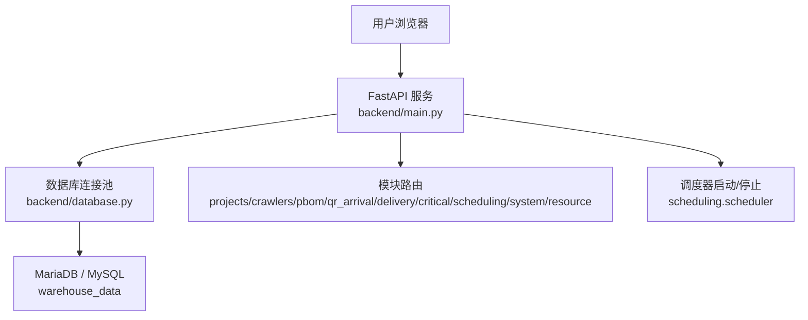
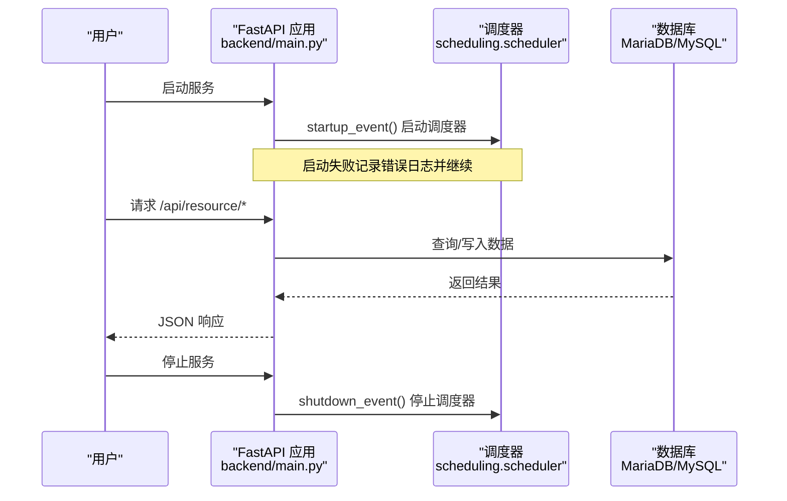
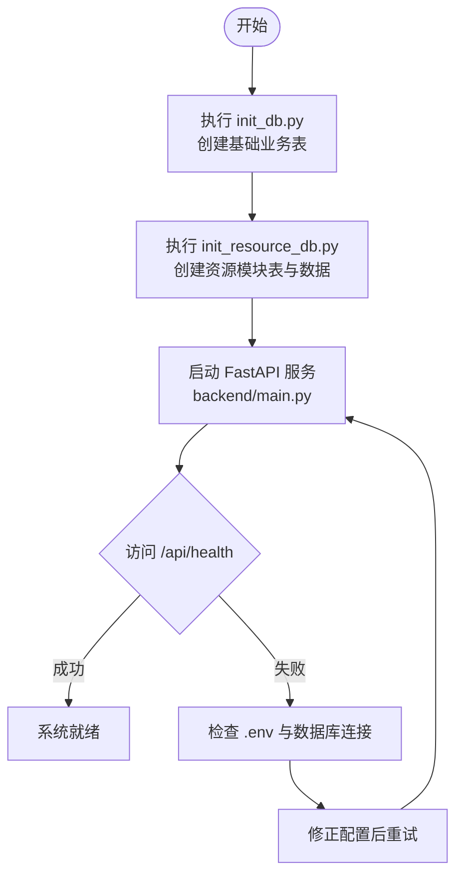
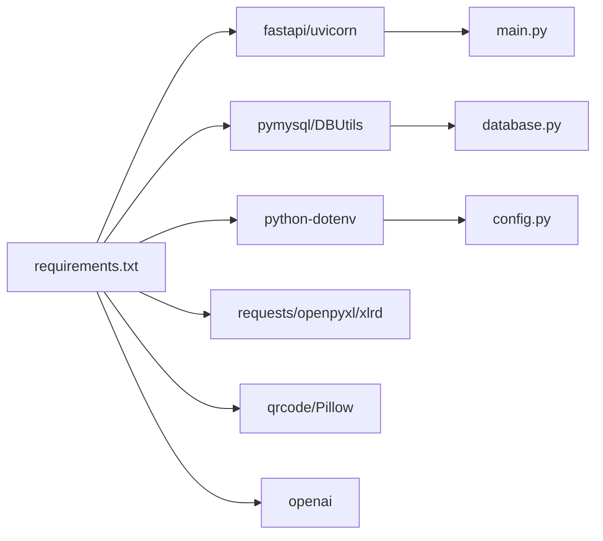

# 快速开始指南

<cite>
**本文引用的文件**
- [README.md](file://README.md)
- [backend/main.py](file://backend/main.py)
- [backend/config.py](file://backend/config.py)
- [backend/database.py](file://backend/database.py)
- [backend/requirements.txt](file://backend/requirements.txt)
- [backend/env.example](file://backend/env.example)
- [backend/scripts/init_db.py](file://backend/scripts/init_db.py)
- [backend/sql/init_resource_db.py](file://backend/sql/init_resource_db.py)
- [backend/sql/resource_schema.sql](file://backend/sql/resource_schema.sql)
- [windows_setup/README_WINDOWS.txt](file://windows_setup/README_WINDOWS.txt)
- [windows_setup/0_一键部署.bat](file://windows_setup/0_一键部署.bat)
- [windows_setup/1_install_mysql.bat](file://windows_setup/1_install_mysql.bat)
- [windows_setup/sql/create_database.sql](file://windows_setup/sql/create_database.sql)
- [start_server.py](file://start_server.py)
</cite>

## 目录
1. [简介](#简介)
2. [项目结构](#项目结构)
3. [核心组件](#核心组件)
4. [架构总览](#架构总览)
5. [详细组件分析](#详细组件分析)
6. [依赖关系分析](#依赖关系分析)
7. [性能注意事项](#性能注意事项)
8. [故障排除指南](#故障排除指南)
9. [结论](#结论)
10. [附录](#附录)

## 简介
本指南面向首次部署“试制资源数智化管理系统”的用户，提供从环境准备、安装配置、初始化启动到功能验证的完整步骤。系统后端基于 FastAPI + MariaDB（兼容 MySQL），提供 RESTful API；前端参考工程位于 webui_ref，另有可直接浏览器打开的静态演示页 demo。Windows 用户可使用 windows_setup 下的一键部署脚本简化流程。

## 项目结构
- 后端服务：backend（FastAPI 应用、数据库连接、模块路由、脚本）
- 数据库脚本：backend/sql（资源模块建表与初始化数据）
- Windows 部署：windows_setup（一键部署脚本、MySQL 建库脚本）
- 演示页面：demo（静态 HTML/CSS/JS，无需依赖）
- 前端参考工程：webui_ref（React + TypeScript + Vite）

图表来源
- [backend/main.py:29-83](file://backend/main.py#L29-L83)
- [backend/database.py:12-43](file://backend/database.py#L12-L43)

章节来源
- [README.md:7-16](file://README.md#L7-L16)
- [backend/main.py:29-83](file://backend/main.py#L29-L83)

## 核心组件
- 应用入口与路由注册：backend/main.py
- 配置加载与环境变量：backend/config.py
- 数据库连接池与工具方法：backend/database.py
- 依赖清单：backend/requirements.txt
- 环境变量模板：backend/env.example
- 基础业务表初始化：backend/scripts/init_db.py
- 资源模块表结构与初始数据：backend/sql/init_resource_db.py、resource_schema.sql
- Windows 一键部署：windows_setup/*.bat、create_database.sql
- 服务器管理脚本（可选）：start_server.py

章节来源
- [backend/main.py:29-83](file://backend/main.py#L29-L83)
- [backend/config.py:48-98](file://backend/config.py#L48-L98)
- [backend/database.py:12-43](file://backend/database.py#L12-L43)
- [backend/requirements.txt:1-21](file://backend/requirements.txt#L1-L21)
- [backend/env.example:7-49](file://backend/env.example#L7-L49)
- [backend/scripts/init_db.py:17-293](file://backend/scripts/init_db.py#L17-L293)
- [backend/sql/init_resource_db.py:47-71](file://backend/sql/init_resource_db.py#L47-L71)
- [windows_setup/0_一键部署.bat:9-36](file://windows_setup/0_一键部署.bat#L9-L36)
- [windows_setup/sql/create_database.sql:9-36](file://windows_setup/sql/create_database.sql#L9-L36)

## 架构总览
系统采用前后端分离架构：
- 后端：FastAPI 暴露 /api/* 接口，统一通过 CORS 中间件处理跨域，启动时自动启动后台调度器，关闭时优雅停止。
- 数据库：使用 PyMySQL + DBUtils 连接池访问 MariaDB/MySQL，默认字符集 utf8mb4。
- 前端：webui_ref 为参考工程，demo 为静态演示页，生产模式可托管 static 下的 index.html。

图表来源
- [backend/main.py:36-55](file://backend/main.py#L36-L55)
- [backend/database.py:12-43](file://backend/database.py#L12-L43)

章节来源
- [backend/main.py:29-83](file://backend/main.py#L29-L83)
- [backend/database.py:12-43](file://backend/database.py#L12-L43)

## 详细组件分析

### 环境与前置条件
- 操作系统：Windows 10/11/Server 2016+ 或 Linux
- Python：3.9+（Windows 推荐 3.8~3.11，建议 3.10）
- 数据库：MariaDB 10.x 或 MySQL 5.7+/8.0，数据库名 warehouse_data
- Node.js：仅前端参考工程需要（webui_ref）
- 浏览器：Chrome/Edge（用于访问 API 文档与演示页）

章节来源
- [README.md:72-78](file://README.md#L72-L78)
- [windows_setup/README_WINDOWS.txt:9-19](file://windows_setup/README_WINDOWS.txt#L9-L19)

### 安装与部署（Linux/macOS 源码方式）
1. 安装 Python 依赖
   - 在项目根目录执行：python -m pip install -r backend/requirements.txt
2. 配置环境变量
   - 复制模板：cp backend/.env.example backend/.env
   - 编辑 backend/.env，填写数据库连接与服务端口等
3. 初始化基础数据库（原有业务表）
   - 执行：python backend/scripts/init_db.py
4. 初始化资源模块数据库（新增 7 张表 + 初始化数据）
   - 执行：python backend/sql/init_resource_db.py
5. 启动服务
   - 执行：python backend/main.py
   - 默认地址：http://localhost:8000

章节来源
- [README.md:79-100](file://README.md#L79-L100)
- [backend/requirements.txt:1-21](file://backend/requirements.txt#L1-L21)
- [backend/env.example:7-49](file://backend/env.example#L7-L49)
- [backend/scripts/init_db.py:17-293](file://backend/scripts/init_db.py#L17-L293)
- [backend/sql/init_resource_db.py:47-71](file://backend/sql/init_resource_db.py#L47-L71)

### 安装与部署（Windows 一键部署）
推荐使用 windows_setup 下的批处理脚本完成自动化部署：
1. 确保已安装 MySQL 并记住 root 密码
2. 双击运行：windows_setup/0_一键部署.bat
   - 该脚本依次执行：创建数据库、生成 .env、安装依赖、初始化表结构、启动服务
3. 启动成功后在浏览器访问 http://localhost:8000

若需分步执行：
- 步骤 1：windows_setup/1_install_mysql.bat（创建 warehouse_data）
- 步骤 2：windows_setup/2_config.bat（生成 .env 并创建目录）
- 步骤 3：windows_setup/3_install_python_deps.bat（安装依赖）
- 步骤 4：windows_setup/4_init_database.bat（初始化表结构）
- 步骤 5：windows_setup/5_start_server.bat（启动服务）

章节来源
- [windows_setup/README_WINDOWS.txt:22-88](file://windows_setup/README_WINDOWS.txt#L22-L88)
- [windows_setup/0_一键部署.bat:9-36](file://windows_setup/0_一键部署.bat#L9-L36)
- [windows_setup/1_install_mysql.bat:26-50](file://windows_setup/1_install_mysql.bat#L26-L50)
- [windows_setup/sql/create_database.sql:9-36](file://windows_setup/sql/create_database.sql#L9-L36)

### 环境配置指导
- 环境变量（backend/.env）关键项
  - 数据库：DB_HOST、DB_PORT、DB_USER、DB_PASSWORD、DB_DATABASE
  - 服务：SERVER_HOST、SERVER_PORT、DEBUG、CORS_ORIGINS
  - 爬虫：SPIDER_INTERVAL_MINUTES、SPIDER_TIMEOUT_SECONDS
  - WMS：LOGIN_URL、QUERY_URL
  - 飞书：FEISHU_APP_ID、FEISHU_APP_SECRET、FEISHU_SHEET_URL
  - 采购：PURCHASE_API_URL、PURCHASE_API_KEY
  - DeepSeek LLM：DEEPSEEK_API_KEY、DEEPSEEK_BASE_URL、DEEPSEEK_MODEL
  - QR码页面：QR_BASE_URL
  - 上传目录：UPLOAD_DIR（可选）
- 配置生效机制
  - 应用启动时通过 dotenv 加载 .env，Settings 类读取各配置项
  - 未找到 .env 时会输出警告并使用默认值

章节来源
- [backend/env.example:7-49](file://backend/env.example#L7-L49)
- [backend/config.py:12-22](file://backend/config.py#L12-L22)
- [backend/config.py:48-98](file://backend/config.py#L48-L98)

### 初始化与启动流程
- 数据库初始化
  - 基础业务表：backend/scripts/init_db.py（创建 projects、project_parts、configs、part_configs、qr_arrival_records、critical_scores、spider_credentials、delivery_records、feishu_detail、system_params 等，并插入默认参数）
  - 资源模块表：backend/sql/init_resource_db.py（执行 resource_schema.sql 与 resource_init_data.sql）
- 服务启动
  - 主应用：backend/main.py（注册路由、CORS、健康检查、SPA 回退）
  - 调度器：startup_event 中启动 scheduler_service，shutdown_event 中停止
- 健康检查
  - GET /api/health 返回状态信息

图表来源
- [backend/scripts/init_db.py:17-293](file://backend/scripts/init_db.py#L17-L293)
- [backend/sql/init_resource_db.py:47-71](file://backend/sql/init_resource_db.py#L47-L71)
- [backend/main.py:94-97](file://backend/main.py#L94-L97)

章节来源
- [backend/scripts/init_db.py:17-293](file://backend/scripts/init_db.py#L17-L293)
- [backend/sql/init_resource_db.py:47-71](file://backend/sql/init_resource_db.py#L47-L71)
- [backend/main.py:36-55](file://backend/main.py#L36-L55)
- [backend/main.py:94-97](file://backend/main.py#L94-L97)

### 基本功能验证
- 访问 API 文档：http://localhost:8000/docs（Swagger UI）
- 健康检查：GET http://localhost:8000/api/health
- 资源模块接口前缀：/api/resource/*（设备、人员、任务、看板、预警等）
- 静态演示页：直接打开 demo/index.html 预览原型页面（无需后端）

章节来源
- [README.md:118-134](file://README.md#L118-L134)
- [backend/main.py:94-97](file://backend/main.py#L94-L97)

### 开发环境搭建（前端参考工程）
- 进入 webui_ref 目录
- 安装依赖：npm install
- 启动开发服务器：npm run dev（默认端口 5173，已配置代理将 /api 转发至后端 8000）
- 构建生产包：npm run build

章节来源
- [README.md:118-126](file://README.md#L118-L126)

## 依赖关系分析
- 后端依赖
  - fastapi、uvicorn：Web 框架与服务器
  - pymysql、DBUtils：数据库连接与连接池
  - python-dotenv：环境变量加载
  - requests、openpyxl、xlrd：HTTP 与 Excel 处理
  - qrcode、Pillow：二维码生成
  - openai：LLM 能力（Phase 2）
- 运行时依赖
  - MariaDB/MySQL 实例与仓库数据
  - 可选：Node.js（前端参考工程）

图表来源
- [backend/requirements.txt:1-21](file://backend/requirements.txt#L1-L21)
- [backend/main.py:29-83](file://backend/main.py#L29-L83)
- [backend/database.py:12-43](file://backend/database.py#L12-L43)
- [backend/config.py:48-98](file://backend/config.py#L48-L98)

章节来源
- [backend/requirements.txt:1-21](file://backend/requirements.txt#L1-L21)

## 性能注意事项
- 数据库连接池：默认最大连接数 10，最小缓存 0，按需建立连接，避免启动时因配置错误导致崩溃
- 字符集：统一使用 utf8mb4，避免中文乱码
- 跨域：CORS_ORIGINS 可按需限制来源，生产环境建议明确指定域名
- 调度器：启动时自动启动，异常时记录错误日志不影响服务启动
- 上传目录：自动创建 UPLOAD_DIR，注意磁盘空间与权限

章节来源
- [backend/database.py:12-43](file://backend/database.py#L12-L43)
- [backend/config.py:81-98](file://backend/config.py#L81-L98)
- [backend/main.py:36-55](file://backend/main.py#L36-L55)

## 故障排除指南
- 数据库连接失败
  - 检查 backend/.env 中的 DB_HOST、DB_PORT、DB_USER、DB_PASSWORD、DB_DATABASE
  - 确认 warehouse_data 数据库存在且服务监听 127.0.0.1:3306
  - Windows 可通过 1_install_mysql.bat 重新执行建库
- 端口占用
  - 修改 SERVER_PORT 为其他端口（如 8080）
- 依赖安装慢或失败
  - 使用国内镜像源安装：python -m pip install -r backend/requirements.txt -i https://pypi.tuna.tsinghua.edu.cn/simple
- 中文显示乱码
  - 确保数据库、表、连接均使用 utf8mb4
- 停止服务
  - Ctrl+C；或使用 start_server.py 提供的管理器进行优雅停止

章节来源
- [windows_setup/README_WINDOWS.txt:91-114](file://windows_setup/README_WINDOWS.txt#L91-L114)
- [backend/database.py:34-42](file://backend/database.py#L34-L42)
- [start_server.py:63-87](file://start_server.py#L63-L87)

## 结论
按照本指南完成环境准备、安装配置、初始化与启动后，即可通过浏览器访问 API 文档与健康检查接口，验证系统是否正常运行。Windows 用户推荐使用一键部署脚本简化流程；Linux/macOS 用户按源码方式逐步执行。后续可根据需求启用第三方服务集成（WMS、飞书、采购系统、DeepSeek LLM）。

## 附录
- 资源模块数据库表概览
  - equipment：设备台账
  - zones：车间区域
  - personnel：人员信息
  - tasks：任务管理
  - alerts：异常预警
  - personnel_efficiency：人员效率统计
  - equipment_maintenance：设备维护记录
- 相关脚本路径
  - 基础表初始化：backend/scripts/init_db.py
  - 资源模块表初始化：backend/sql/init_resource_db.py
  - 资源模块建表脚本：backend/sql/resource_schema.sql

章节来源
- [README.md:102-116](file://README.md#L102-L116)
- [backend/scripts/init_db.py:17-293](file://backend/scripts/init_db.py#L17-L293)
- [backend/sql/init_resource_db.py:47-71](file://backend/sql/init_resource_db.py#L47-L71)
- [backend/sql/resource_schema.sql:1-200](file://backend/sql/resource_schema.sql#L1-L200)