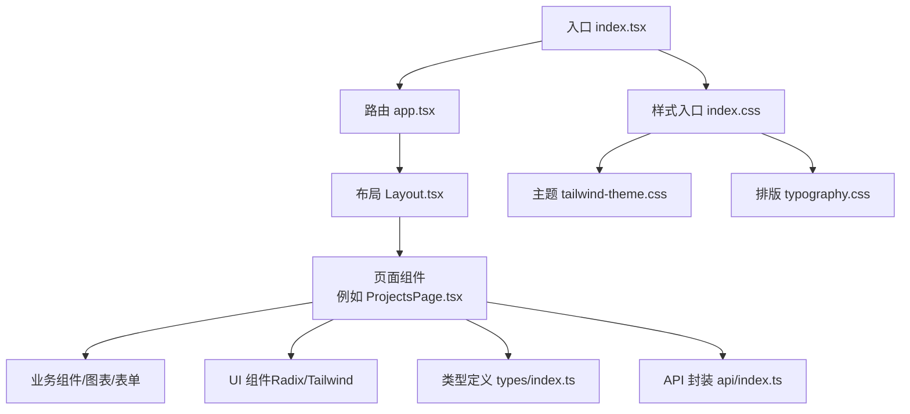
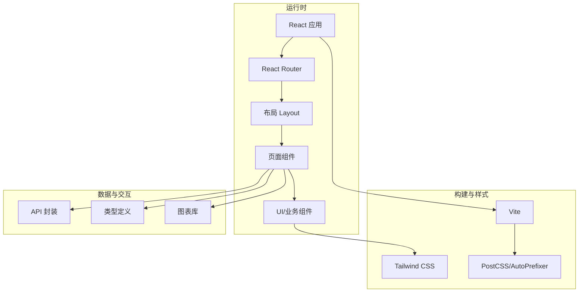
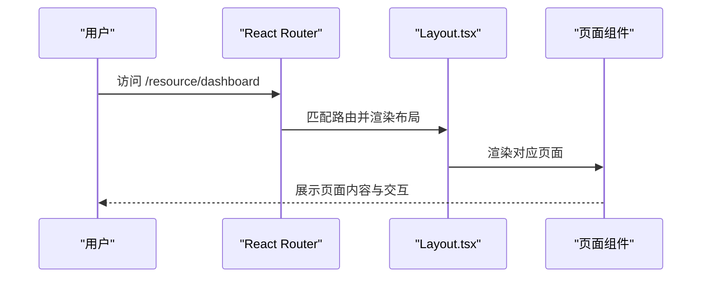
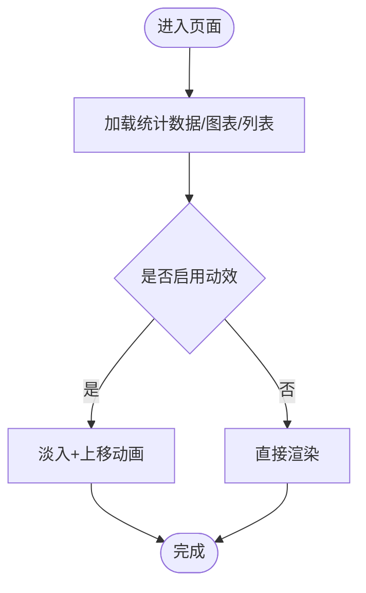
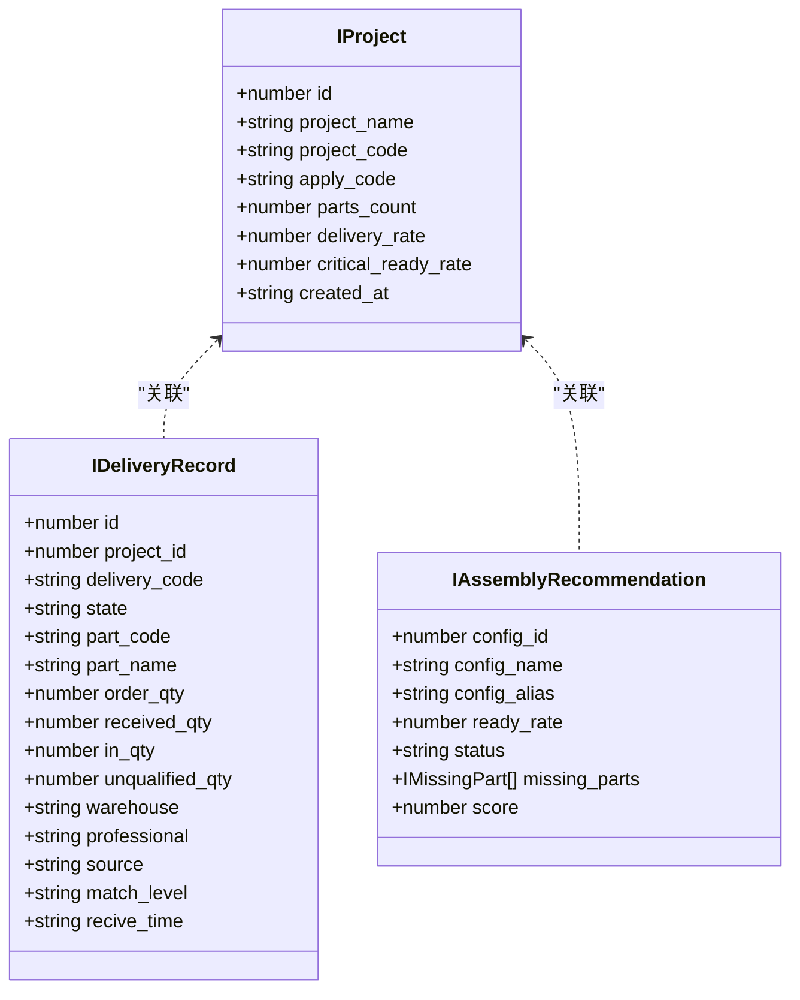
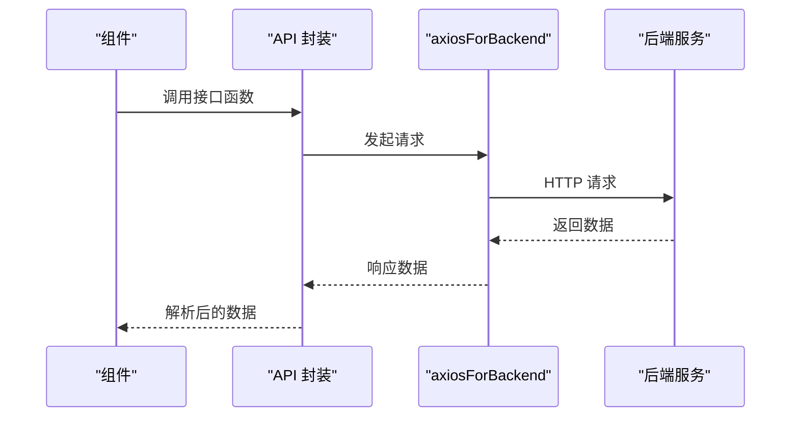
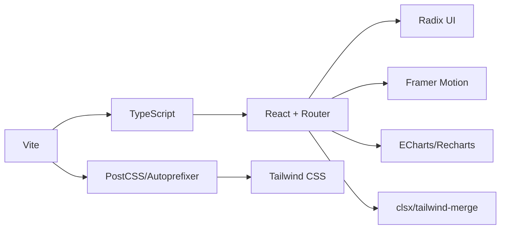
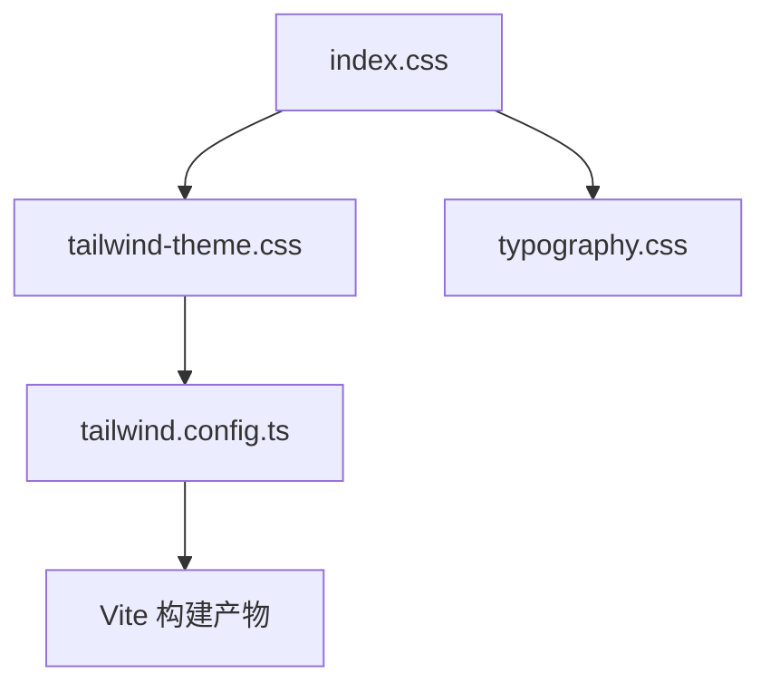

# 前端架构设计

<cite>
**本文引用的文件**
- [package.json](file://webui_ref/package.json)
- [vite.config.ts](file://webui_ref/vite.config.ts)
- [tailwind.config.ts](file://webui_ref/tailwind.config.ts)
- [index.tsx](file://webui_ref/client/src/index.tsx)
- [app.tsx](file://webui_ref/client/src/app.tsx)
- [Layout.tsx](file://webui_ref/client/src/components/Layout.tsx)
- [index.css](file://webui_ref/client/src/index.css)
- [tailwind-theme.css](file://webui_ref/client/src/tailwind-theme.css)
- [typography.css](file://webui_ref/client/src/typography.css)
- [index.ts](file://webui_ref/client/src/api/index.ts)
- [ProjectsPage.tsx](file://webui_ref/client/src/pages/ProjectsPage/ProjectsPage.tsx)
- [index.ts（类型）](file://webui_ref/client/src/types/index.ts)
- [utils.ts](file://webui_ref/client/src/lib/utils.ts)
</cite>

## 目录
1. [简介](#简介)
2. [项目结构](#项目结构)
3. [核心组件](#核心组件)
4. [架构总览](#架构总览)
5. [详细组件分析](#详细组件分析)
6. [依赖关系分析](#依赖关系分析)
7. [性能与构建优化](#性能与构建优化)
8. [样式系统与设计规范](#样式系统与设计规范)
9. [响应式、无障碍与跨浏览器兼容](#响应式无障碍与跨浏览器兼容)
10. [故障排查指南](#故障排查指南)
11. [结论](#结论)

## 简介
本文件面向“试制资源数智化管理系统”的前端架构，基于 React + TypeScript 技术栈，结合 Vite 构建工具链与 Tailwind CSS 样式体系，提供页面路由、状态管理、API 调用封装、组件分层组织、性能优化策略以及可访问性与兼容性方案。文档同时给出架构图与组件依赖关系图，帮助读者快速理解整体设计与实现要点。

## 项目结构
前端位于 webui_ref 子工程，采用模块化与分层组织：
- 入口与路由：index.tsx 负责应用挂载、全局错误边界与路由容器；app.tsx 集中声明页面路由；Layout.tsx 提供侧边栏、面包屑与页面布局。
- 页面与业务组件：pages 下按功能域划分页面组件，如 ProjectsPage、ResourceDashboardPage 等；components 下包含通用 UI 组件与业务组件。
- 类型与工具：types 定义前后端共享的数据模型；lib 提供工具函数（如类名合并）。
- API 层：api 目录用于统一封装后端接口调用。
- 配置与样式：vite.config.ts 配置开发服务器与别名；tailwind.config.ts 启用预设与扫描范围；CSS 通过 index.css 引入主题与排版样式。

**图示来源**
- [index.tsx:1-37](file://webui_ref/client/src/index.tsx#L1-L37)
- [app.tsx:1-56](file://webui_ref/client/src/app.tsx#L1-L56)
- [Layout.tsx:1-399](file://webui_ref/client/src/components/Layout.tsx#L1-L399)
- [index.css:1-8](file://webui_ref/client/src/index.css#L1-L8)
- [tailwind-theme.css:1-260](file://webui_ref/client/src/tailwind-theme.css#L1-L260)
- [typography.css:1-42](file://webui_ref/client/src/typography.css#L1-L42)

**章节来源**
- [index.tsx:1-37](file://webui_ref/client/src/index.tsx#L1-L37)
- [app.tsx:1-56](file://webui_ref/client/src/app.tsx#L1-L56)
- [Layout.tsx:1-399](file://webui_ref/client/src/components/Layout.tsx#L1-L399)
- [index.css:1-8](file://webui_ref/client/src/index.css#L1-L8)
- [tailwind-theme.css:1-260](file://webui_ref/client/src/tailwind-theme.css#L1-L260)
- [typography.css:1-42](file://webui_ref/client/src/typography.css#L1-L42)

## 核心组件
- 应用容器与错误边界：在入口中通过 AppContainer 与 ErrorBoundary 包裹路由，确保异常时降级展示并支持重置。
- 路由与导航：app.tsx 集中声明所有页面路由；Layout.tsx 提供侧边栏、顶部栏、面包屑与用户操作区，并维护当前激活项与退出登录逻辑。
- 页面组合：以 ProjectsPage 为例，页面由多个 Section 组合而成，并通过动画增强首屏体验。
- 类型系统：types/index.ts 统一定义项目、零件、到货、装配推荐、系统设置等数据模型，保证前后端契约一致。
- 工具函数：lib/utils.ts 提供 clsx + tailwind-merge 的类名合并能力，便于条件化样式拼接。

**章节来源**
- [index.tsx:1-37](file://webui_ref/client/src/index.tsx#L1-L37)
- [app.tsx:1-56](file://webui_ref/client/src/app.tsx#L1-L56)
- [Layout.tsx:1-399](file://webui_ref/client/src/components/Layout.tsx#L1-L399)
- [ProjectsPage.tsx:1-35](file://webui_ref/client/src/pages/ProjectsPage/ProjectsPage.tsx#L1-L35)
- [index.ts（类型）:1-299](file://webui_ref/client/src/types/index.ts#L1-L299)
- [utils.ts:1-6](file://webui_ref/client/src/lib/utils.ts#L1-L6)

## 架构总览
前端采用“入口 -> 路由 -> 布局 -> 页面 -> 组件 -> 类型/API”的分层架构。Vite 作为构建与开发服务器，Tailwind CSS 驱动原子化样式，React Router 管理页面路由，Radix UI 提供可访问性基础组件，Framer Motion 提供动效，ECharts/Recharts 负责可视化。

**图示来源**
- [package.json:1-211](file://webui_ref/package.json#L1-L211)
- [vite.config.ts:1-20](file://webui_ref/vite.config.ts#L1-L20)
- [tailwind.config.ts:1-9](file://webui_ref/tailwind.config.ts#L1-L9)

## 详细组件分析

### 路由与布局
- 路由注册：app.tsx 将各页面映射到路径，包括“项目模块”和“试制资源模块”两类路由。
- 布局框架：Layout.tsx 使用 SidebarProvider 提供侧边栏上下文，渲染主菜单与“试制资源”分组，顶部包含搜索、通知与用户信息，底部承载页面内容 Outlet。
- 面包屑：根据当前路径动态生成面包屑，区分项目详情页与试制资源模块页。

**图示来源**
- [app.tsx:1-56](file://webui_ref/client/src/app.tsx#L1-L56)
- [Layout.tsx:1-399](file://webui_ref/client/src/components/Layout.tsx#L1-L399)

**章节来源**
- [app.tsx:1-56](file://webui_ref/client/src/app.tsx#L1-L56)
- [Layout.tsx:1-399](file://webui_ref/client/src/components/Layout.tsx#L1-L399)

### 页面组合与动效
- 页面组合：以 ProjectsPage 为例，页面由统计卡片、风险图表、项目列表等 Section 组成，提升可读性与信息密度。
- 动效：使用 Framer Motion 为页面添加入场动画，改善首屏体验。

**图示来源**
- [ProjectsPage.tsx:1-35](file://webui_ref/client/src/pages/ProjectsPage/ProjectsPage.tsx#L1-L35)

**章节来源**
- [ProjectsPage.tsx:1-35](file://webui_ref/client/src/pages/ProjectsPage/ProjectsPage.tsx#L1-L35)

### 类型系统与数据契约
- 类型覆盖：涵盖项目、PBOM 零件、到货记录、装配推荐、系统参数等，确保组件与 API 间数据结构一致。
- 命名规范：统一使用 I 前缀的 interface，便于识别领域模型。

**图示来源**
- [index.ts（类型）:1-299](file://webui_ref/client/src/types/index.ts#L1-L299)

**章节来源**
- [index.ts（类型）:1-299](file://webui_ref/client/src/types/index.ts#L1-L299)

### API 调用封装
- 统一实例：通过 axiosForBackend 获取后端专用 axios 实例，便于统一处理鉴权、拦截器与日志。
- 扩展点：在 api/index.ts 中按模块导出接口函数，建议对错误进行统一捕获与上报。

**图示来源**
- [index.ts（API）:1-20](file://webui_ref/client/src/api/index.ts#L1-L20)

**章节来源**
- [index.ts（API）:1-20](file://webui_ref/client/src/api/index.ts#L1-L20)

## 依赖关系分析
- 构建与开发：Vite 提供快速开发与生产构建；PostCSS、Autoprefixer 处理样式兼容；TypeScript 提供类型检查。
- UI 与交互：React 19、React Router 6、Radix UI 系列组件、Framer Motion、ECharts/Recharts、Lucide 图标。
- 样式系统：Tailwind CSS v4，配合自定义主题与排版插件。
- 工具与生态：clsx + tailwind-merge 用于类名合并；dayjs/date-fns 时间处理；zustand/redux-toolkit 可选状态管理。

**图示来源**
- [package.json:1-211](file://webui_ref/package.json#L1-L211)
- [vite.config.ts:1-20](file://webui_ref/vite.config.ts#L1-L20)
- [tailwind.config.ts:1-9](file://webui_ref/tailwind.config.ts#L1-L9)

**章节来源**
- [package.json:1-211](file://webui_ref/package.json#L1-L211)
- [vite.config.ts:1-20](file://webui_ref/vite.config.ts#L1-L20)
- [tailwind.config.ts:1-9](file://webui_ref/tailwind.config.ts#L1-L9)

## 性能与构建优化
- 开发体验：Vite 提供热更新与快速启动；开发服务器端口与代理配置简化联调。
- 代码分割与懒加载：可通过路由级拆分与组件级动态导入减少首屏体积；结合 Vite 按需打包第三方库。
- 资源优化：图片与静态资源走构建管线压缩；字体与图标按需引入。
- 缓存策略：利用浏览器缓存与 CDN 缓存静态资源；服务端开启 gzip/brotli。
- 监控与分析：接入性能埋点与错误上报，持续评估优化效果。

[本节为通用指导，不直接分析具体文件]

## 样式系统与设计规范
- 主题与变量：tailwind-theme.css 定义品牌色、阴影、圆角、字体族等设计令牌，并通过 @theme inline 暴露给 Tailwind 使用。
- 排版：typography.css 集成排版插件，统一文章、表格、代码块等文本样式。
- 入口聚合：index.css 统一引入主题、动画与排版，保持样式入口清晰。
- 构建配置：tailwind.config.ts 启用预设并指定扫描范围，避免冗余样式。

**图示来源**
- [index.css:1-8](file://webui_ref/client/src/index.css#L1-L8)
- [tailwind-theme.css:1-260](file://webui_ref/client/src/tailwind-theme.css#L1-L260)
- [typography.css:1-42](file://webui_ref/client/src/typography.css#L1-L42)
- [tailwind.config.ts:1-9](file://webui_ref/tailwind.config.ts#L1-L9)

**章节来源**
- [index.css:1-8](file://webui_ref/client/src/index.css#L1-L8)
- [tailwind-theme.css:1-260](file://webui_ref/client/src/tailwind-theme.css#L1-L260)
- [typography.css:1-42](file://webui_ref/client/src/typography.css#L1-L42)
- [tailwind.config.ts:1-9](file://webui_ref/tailwind.config.ts#L1-L9)

## 响应式、无障碍与跨浏览器兼容
- 响应式：基于 Tailwind 的断点与栅格，结合布局组件实现移动端适配；侧边栏支持折叠与展开。
- 可访问性：使用 Radix UI 提供的无障碍基础组件，确保键盘导航与屏幕阅读器友好；按钮、表单等遵循语义化标签。
- 跨浏览器：PostCSS 自动添加前缀；主题与阴影在不同浏览器下保持一致；必要时针对特定浏览器做兼容回退。
- 主题切换：AppContainer 支持默认主题，可扩展深色模式与用户偏好记忆。

[本节为通用指导，不直接分析具体文件]

## 故障排查指南
- 应用崩溃：入口已配置 ErrorBoundary，异常时会显示错误界面并提供重置选项，便于恢复。
- 路由问题：确认 app.tsx 中的路由路径与 Layout 中的导航项一致；检查 basename 配置是否与部署路径匹配。
- 样式异常：确认 index.css 正确引入主题与排版；检查 tailwind.config.ts 的 content 扫描范围是否覆盖组件路径。
- API 失败：在 api/index.ts 中统一捕获错误并记录日志；核对代理配置与后端地址；检查鉴权头与跨域设置。
- 构建报错：关注 TypeScript 类型错误与依赖版本冲突；清理缓存后重试构建。

**章节来源**
- [index.tsx:1-37](file://webui_ref/client/src/index.tsx#L1-L37)
- [app.tsx:1-56](file://webui_ref/client/src/app.tsx#L1-L56)
- [index.css:1-8](file://webui_ref/client/src/index.css#L1-L8)
- [tailwind.config.ts:1-9](file://webui_ref/tailwind.config.ts#L1-L9)
- [index.ts（API）:1-20](file://webui_ref/client/src/api/index.ts#L1-L20)

## 结论
本项目以 React + TypeScript 为核心，结合 Vite 与 Tailwind CSS 构建高效、可维护的前端工程。通过清晰的页面与组件分层、统一的类型定义与 API 封装、完善的样式主题与可访问性基础，支撑“试制资源数智化管理系统”的多模块、多页面复杂场景。后续可在状态管理、数据缓存、性能监控等方面持续演进，进一步提升用户体验与系统稳定性。