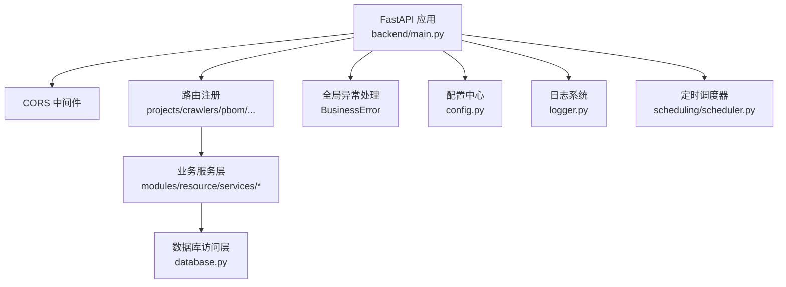
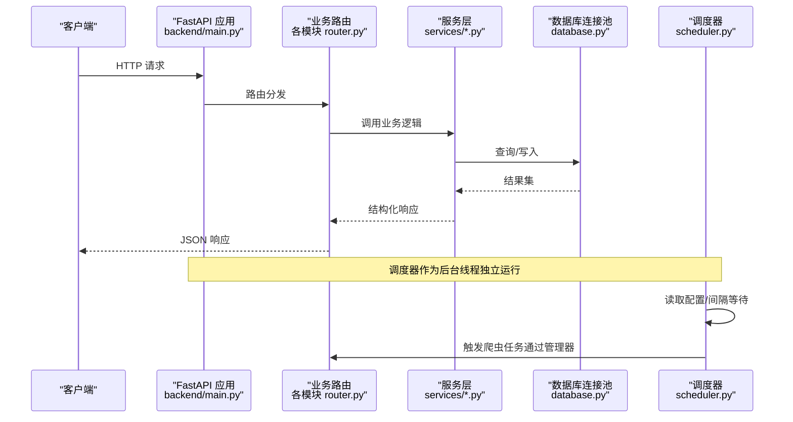
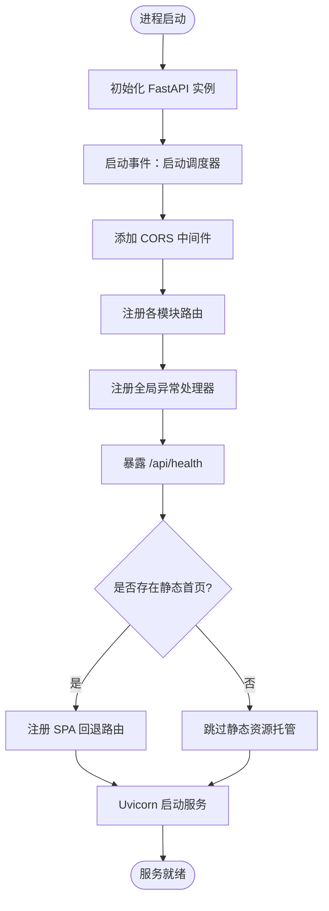
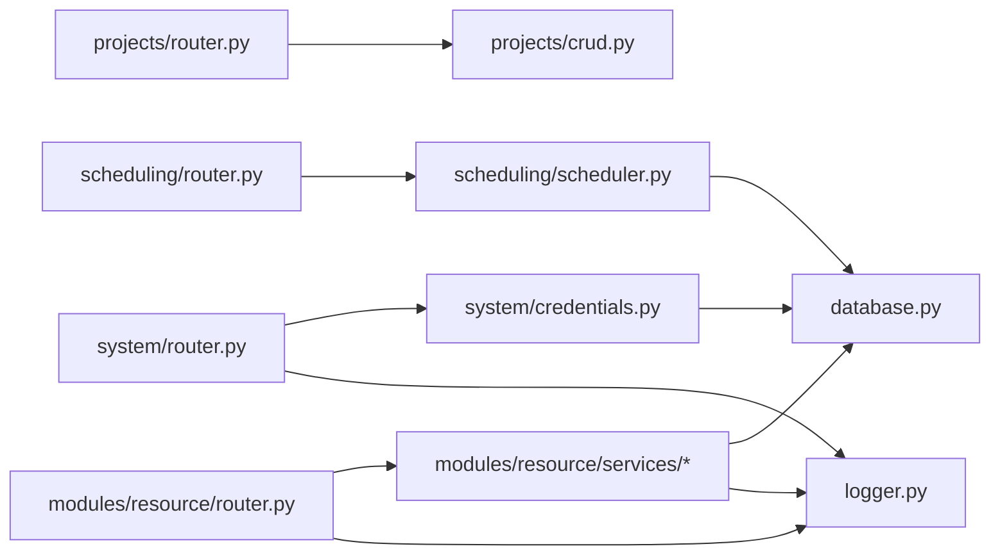
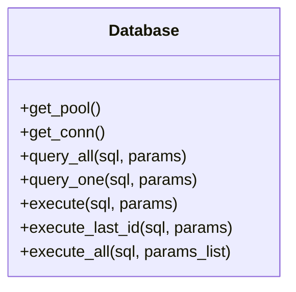
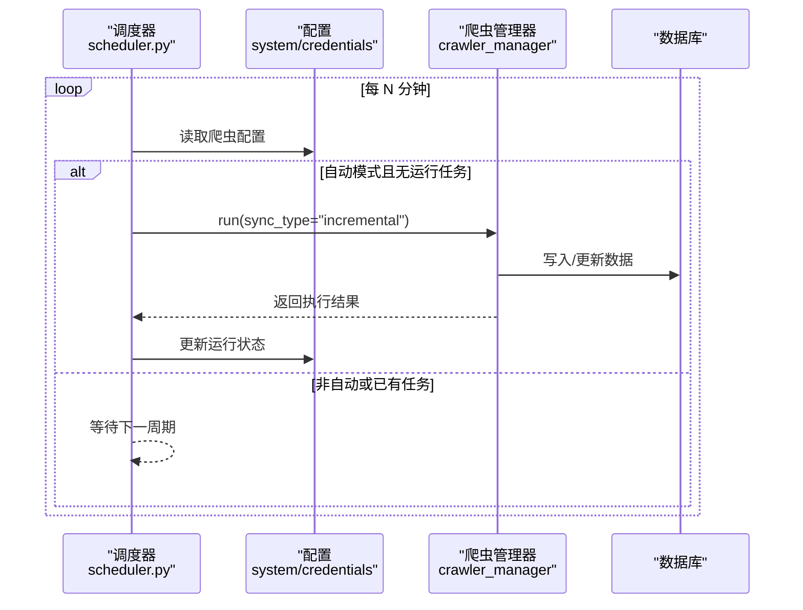
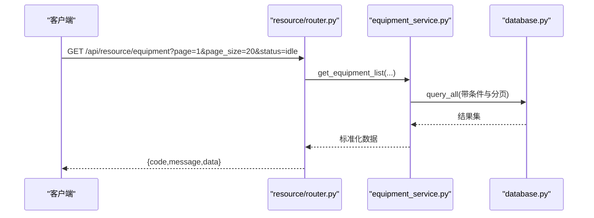
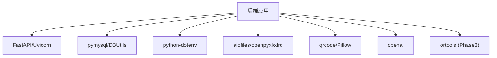

# 后端架构设计

<cite>
**本文引用的文件**
- [backend/main.py](file://backend/main.py)
- [backend/config.py](file://backend/config.py)
- [backend/database.py](file://backend/database.py)
- [backend/logger.py](file://backend/logger.py)
- [backend/core/exceptions.py](file://backend/core/exceptions.py)
- [backend/modules/resource/router.py](file://backend/modules/resource/router.py)
- [backend/projects/router.py](file://backend/projects/router.py)
- [backend/scheduling/router.py](file://backend/scheduling/router.py)
- [backend/system/router.py](file://backend/system/router.py)
- [backend/scheduling/scheduler.py](file://backend/scheduling/scheduler.py)
- [backend/modules/resource/services/equipment_service.py](file://backend/modules/resource/services/equipment_service.py)
- [backend/requirements.txt](file://backend/requirements.txt)
</cite>

## 目录
1. [简介](#简介)
2. [项目结构](#项目结构)
3. [核心组件](#核心组件)
4. [架构总览](#架构总览)
5. [详细组件分析](#详细组件分析)
6. [依赖关系分析](#依赖关系分析)
7. [性能考虑](#性能考虑)
8. [故障排查指南](#故障排查指南)
9. [结论](#结论)
10. [附录](#附录)

## 简介
本文件面向“试制资源数智化管理系统”的后端架构，聚焦 FastAPI 框架选型与优势、应用启动流程（中间件、路由注册、全局异常处理）、模块化架构与依赖管理、数据库连接池、日志系统、配置管理、性能优化策略、错误处理机制与监控告警方案，并给出后端架构图以展示组件交互和数据流向。

## 项目结构
后端采用按业务域划分的模块化组织方式：
- 入口与基础设施：main.py、config.py、database.py、logger.py、core/exceptions.py
- 业务模块：projects、crawlers、pbom、qr_arrival、delivery、critical_parts、scheduling、system、modules/resource
- 脚本与初始化：scripts、sql
- 前端静态资源托管：static（由 main.py 在存在时提供 SPA 回退）

图表来源
- [backend/main.py:29-83](file://backend/main.py#L29-L83)
- [backend/config.py:48-101](file://backend/config.py#L48-L101)
- [backend/database.py:12-43](file://backend/database.py#L12-L43)
- [backend/logger.py:14-42](file://backend/logger.py#L14-L42)
- [backend/scheduling/scheduler.py:16-74](file://backend/scheduling/scheduler.py#L16-L74)

章节来源
- [backend/main.py:29-83](file://backend/main.py#L29-L83)
- [backend/config.py:48-101](file://backend/config.py#L48-L101)

## 核心组件
- 应用入口与生命周期：FastAPI 实例化、启动/关闭事件、Uvicorn 运行、信号处理
- 中间件：CORS 跨域配置
- 路由注册：按业务域分模块挂载，统一前缀与标签
- 全局异常：自定义 BusinessError 的统一返回格式
- 配置管理：基于 .env 的 Settings 单例，集中读取 DB、爬虫、LLM、服务端口等
- 数据库连接池：PooledDB + pymysql，延迟初始化，读写封装
- 日志系统：RotatingFileHandler + StreamHandler，按级别输出
- 定时调度：后台线程循环执行爬虫增量同步，支持暂停/恢复/重配

章节来源
- [backend/main.py:36-55](file://backend/main.py#L36-L55)
- [backend/main.py:66-83](file://backend/main.py#L66-L83)
- [backend/main.py:86-97](file://backend/main.py#L86-L97)
- [backend/config.py:48-101](file://backend/config.py#L48-L101)
- [backend/database.py:12-43](file://backend/database.py#L12-L43)
- [backend/logger.py:14-42](file://backend/logger.py#L14-L42)
- [backend/scheduling/scheduler.py:16-74](file://backend/scheduling/scheduler.py#L16-L74)

## 架构总览
下图展示了请求从客户端到各模块再到数据库的完整链路，以及后台调度器的独立运行路径。

图表来源
- [backend/main.py:66-83](file://backend/main.py#L66-L83)
- [backend/modules/resource/router.py:58-86](file://backend/modules/resource/router.py#L58-L86)
- [backend/modules/resource/services/equipment_service.py:11-103](file://backend/modules/resource/services/equipment_service.py#L11-L103)
- [backend/database.py:46-85](file://backend/database.py#L46-L85)
- [backend/scheduling/scheduler.py:93-153](file://backend/scheduling/scheduler.py#L93-L153)

## 详细组件分析

### FastAPI 选型原因与优势
- 异步处理能力：基于 ASGI，天然支持高并发 IO 场景，适合爬虫调度、外部接口调用等 IO 密集型任务
- 自动文档生成：内置 OpenAPI/Swagger UI，便于前后端联调与接口治理
- 类型安全：Pydantic 数据模型校验，减少运行时错误
- 生态成熟：与 Uvicorn、Starlette、Pydantic 深度集成，扩展性强

章节来源
- [backend/requirements.txt:1-21](file://backend/requirements.txt#L1-L21)
- [backend/main.py:29-33](file://backend/main.py#L29-L33)

### 应用启动流程
- 创建 FastAPI 实例并设置标题、描述、版本
- 启动事件：加载并启动调度器；关闭事件：停止调度器
- 注册 CORS 中间件，允许跨域
- 注册各业务路由，统一前缀与标签
- 定义全局异常处理器，统一 BusinessError 返回格式
- 健康检查与健康探针
- 生产模式：若存在静态首页，则提供 SPA 回退
- 使用 Uvicorn 启动服务，监听配置的主机与端口

图表来源
- [backend/main.py:29-83](file://backend/main.py#L29-L83)
- [backend/main.py:94-118](file://backend/main.py#L94-L118)
- [backend/main.py:122-159](file://backend/main.py#L122-L159)

章节来源
- [backend/main.py:29-159](file://backend/main.py#L29-L159)

### 模块化架构设计与依赖管理
- 路由组织：每个业务域一个 router.py，统一前缀与 tags，便于分组与文档隔离
- 服务层分离：router 仅负责参数校验与响应包装，具体业务逻辑下沉至 services/*
- 依赖注入：通过函数级导入避免循环依赖，如 resource 路由在服务层按需 import
- 配置与工具：config.py 提供全局 settings；database.py 提供连接池与 SQL 封装；logger.py 提供统一日志

图表来源
- [backend/projects/router.py:1-15](file://backend/projects/router.py#L1-L15)
- [backend/modules/resource/router.py:1-14](file://backend/modules/resource/router.py#L1-L14)
- [backend/system/router.py:1-13](file://backend/system/router.py#L1-L13)
- [backend/scheduling/router.py:1-9](file://backend/scheduling/router.py#L1-L9)
- [backend/modules/resource/services/equipment_service.py:1-8](file://backend/modules/resource/services/equipment_service.py#L1-L8)

章节来源
- [backend/modules/resource/router.py:1-800](file://backend/modules/resource/router.py#L1-L800)
- [backend/projects/router.py:1-231](file://backend/projects/router.py#L1-L231)
- [backend/system/router.py:1-109](file://backend/system/router.py#L1-L109)
- [backend/scheduling/router.py:1-14](file://backend/scheduling/router.py#L1-L14)

### 数据库连接池管理
- 使用 PooledDB 管理 MySQL 连接，最大连接数与缓存大小可配置
- 延迟初始化：首次获取连接时才创建池，避免启动期因配置错误导致崩溃
- 提供 query_all/query_one/execute/execute_last_id/execute_all 等常用方法
- 写操作包含事务提交与失败回滚，确保一致性

图表来源
- [backend/database.py:12-116](file://backend/database.py#L12-L116)

章节来源
- [backend/database.py:12-116](file://backend/database.py#L12-L116)

### 日志系统架构
- 双输出：文件（轮转，单文件最大 10MB，保留 7 个历史）与控制台
- 动态级别：DEBUG 模式下输出 DEBUG，否则 INFO
- 命名空间：按模块名区分 logger，便于定位问题

章节来源
- [backend/logger.py:14-42](file://backend/logger.py#L14-L42)

### 配置管理系统
- 基于 python-dotenv 加载 .env，缺失时给出明确警告
- Settings 类集中管理所有配置项：数据库、爬虫、WMS、飞书、采购、DeepSeek、服务端口、CORS、上传目录等
- 提供类型安全的读取辅助函数（整数、布尔、逗号分隔列表）

章节来源
- [backend/config.py:1-101](file://backend/config.py#L1-L101)

### 全局异常处理机制
- 自定义 BusinessError，携带 message 与 code
- 在 main.py 中注册异常处理器，统一返回 JSON 格式
- 业务层抛出 BusinessError，由框架统一捕获并格式化

章节来源
- [backend/core/exceptions.py:1-8](file://backend/core/exceptions.py#L1-L8)
- [backend/main.py:86-92](file://backend/main.py#L86-L92)

### 定时调度器与爬虫集成
- 后台线程循环读取配置，按间隔执行增量同步
- 支持暂停/恢复、配置热重载、冲突检测（避免与手动任务同时运行）
- 与 crawler_manager 协作，更新运行状态并记录日志

图表来源
- [backend/scheduling/scheduler.py:93-153](file://backend/scheduling/scheduler.py#L93-L153)
- [backend/scheduling/scheduler.py:155-192](file://backend/scheduling/scheduler.py#L155-L192)

章节来源
- [backend/scheduling/scheduler.py:16-196](file://backend/scheduling/scheduler.py#L16-L196)

### 业务模块示例：设备台账
- 路由层：RESTful 接口，分页、筛选、搜索
- 服务层：SQL 拼装、分页查询、时间字段格式化
- 数据层：通过 database.py 提供的封装进行查询与写入

图表来源
- [backend/modules/resource/router.py:58-86](file://backend/modules/resource/router.py#L58-L86)
- [backend/modules/resource/services/equipment_service.py:11-103](file://backend/modules/resource/services/equipment_service.py#L11-L103)
- [backend/database.py:51-59](file://backend/database.py#L51-L59)

章节来源
- [backend/modules/resource/router.py:58-86](file://backend/modules/resource/router.py#L58-L86)
- [backend/modules/resource/services/equipment_service.py:11-103](file://backend/modules/resource/services/equipment_service.py#L11-L103)

## 依赖关系分析
- 框架与服务器：fastapi、uvicorn
- 数据库：pymysql、DBUtils（连接池）
- 配置与环境：python-dotenv
- 文件与IO：aiofiles、openpyxl/xlrd（PBOM 解析）
- 可选能力：qrcode/Pillow（二维码）、openai（LLM）、ortools（CP-SAT，Phase 3）

图表来源
- [backend/requirements.txt:1-21](file://backend/requirements.txt#L1-L21)

章节来源
- [backend/requirements.txt:1-21](file://backend/requirements.txt#L1-L21)

## 性能考虑
- 连接池复用：PooledDB 减少连接建立开销，提高并发吞吐
- 延迟初始化：连接池在首次使用时创建，避免启动阻塞
- 异步 IO：FastAPI + Uvicorn 提升 IO 密集型任务处理能力
- 分页与筛选：服务层实现分页与条件过滤，降低单次数据量
- 日志轮转：避免日志文件无限增长影响磁盘与 IO
- 静态资源缓存控制：SPA 回退时禁用缓存，便于发布更新
- 建议：
  - 对热点查询增加索引与缓存（如 Redis）
  - 大文件上传流式处理（已使用 aiofiles）
  - 对外部接口调用增加超时与重试策略
  - 定期评估连接池大小与慢查询

[本节为通用指导，不直接分析具体文件]

## 故障排查指南
- 数据库连接失败：检查 .env 中的 DB_HOST/PORT/USER/PASSWORD/DATABASE；查看连接池初始化日志
- 调度器未执行：确认配置模式为 auto，且无其他爬虫正在运行；查看调度器日志
- 路由未生效：确认路由前缀与 include_in_schema 设置；检查模块是否被 main.py 引入
- 全局异常未捕获：确认抛出的异常类型为 BusinessError；检查异常处理器注册顺序
- 日志无法写入：检查 logs 目录权限与磁盘空间

章节来源
- [backend/database.py:34-42](file://backend/database.py#L34-L42)
- [backend/scheduling/scheduler.py:93-153](file://backend/scheduling/scheduler.py#L93-L153)
- [backend/main.py:86-92](file://backend/main.py#L86-L92)
- [backend/logger.py:23-36](file://backend/logger.py#L23-L36)

## 结论
本后端以 FastAPI 为核心，结合模块化路由、服务层解耦、连接池与日志体系，构建了可扩展、易维护的试制资源数智化管理系统。通过配置管理与定时调度，实现了自动化数据采集与任务编排。未来可在缓存、指标采集与告警方面进一步增强可观测性与稳定性。

[本节为总结性内容，不直接分析具体文件]

## 附录
- 健康检查：/api/health
- 资源模块健康检查：/api/resource/ping
- 排程模块健康检查：/api/schedule/ping

章节来源
- [backend/main.py:94-97](file://backend/main.py#L94-L97)
- [backend/modules/resource/router.py:47-55](file://backend/modules/resource/router.py#L47-L55)
- [backend/scheduling/router.py:12-14](file://backend/scheduling/router.py#L12-L14)