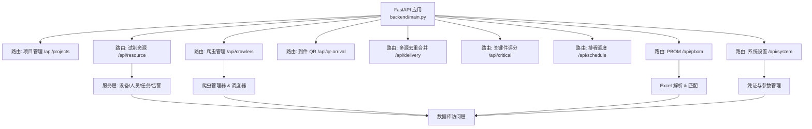
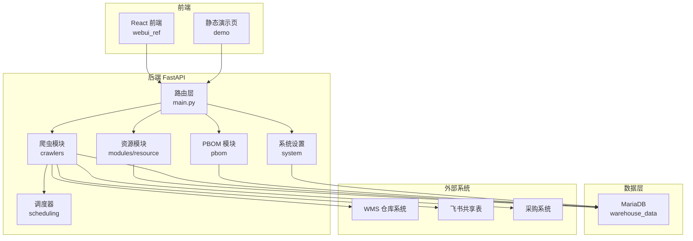
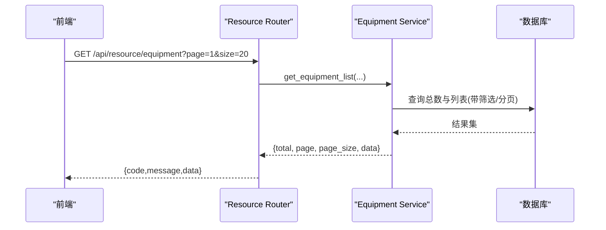
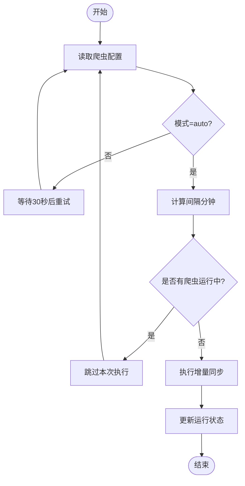
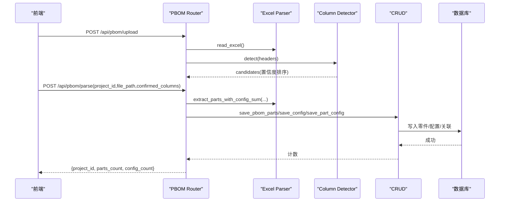
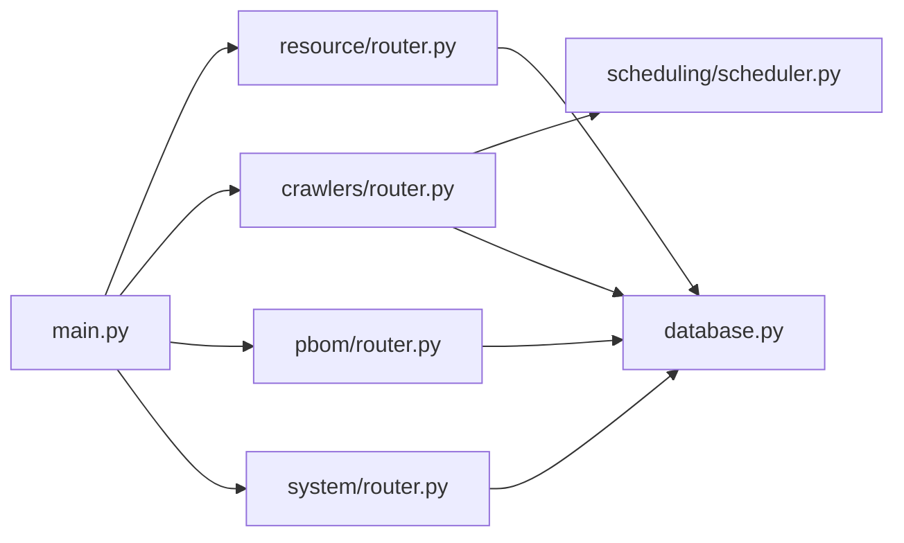

# 技术架构

<cite>
**本文引用的文件**
- [backend/main.py](file://backend/main.py)
- [backend/config.py](file://backend/config.py)
- [backend/database.py](file://backend/database.py)
- [backend/requirements.txt](file://backend/requirements.txt)
- [README.md](file://README.md)
- [backend/modules/resource/router.py](file://backend/modules/resource/router.py)
- [backend/modules/resource/services/equipment_service.py](file://backend/modules/resource/services/equipment_service.py)
- [backend/crawlers/router.py](file://backend/crawlers/router.py)
- [backend/crawlers/base.py](file://backend/crawlers/base.py)
- [backend/pbom/router.py](file://backend/pbom/router.py)
- [backend/scheduling/router.py](file://backend/scheduling/router.py)
- [backend/scheduling/scheduler.py](file://backend/scheduling/scheduler.py)
- [backend/system/router.py](file://backend/system/router.py)
- [backend/sql/resource_schema.sql](file://backend/sql/resource_schema.sql)
</cite>

## 目录
1. [简介](#简介)
2. [项目结构](#项目结构)
3. [核心组件](#核心组件)
4. [架构总览](#架构总览)
5. [详细组件分析](#详细组件分析)
6. [依赖关系分析](#依赖关系分析)
7. [性能与扩展性](#性能与扩展性)
8. [安全考虑](#安全考虑)
9. [部署与高可用](#部署与高可用)
10. [故障排查指南](#故障排查指南)
11. [结论](#结论)

## 简介
本系统为试制资源数智化管理系统，采用前后端分离架构：后端基于 FastAPI 提供 RESTful API，前端参考工程位于 webui_ref（React + TypeScript + Vite），演示静态页面位于 demo。数据库使用 MariaDB（兼容 MySQL 协议）。系统围绕“资源管理、爬虫数据同步、PBOM 解析匹配、异常预警、排程调度”等模块构建，支持多源数据接入（WMS、飞书、采购系统等）与统一配置管理。

## 项目结构
- 后端服务入口与路由注册集中在 backend/main.py，按业务域划分模块路由（projects、crawlers、pbom、qr_arrival、delivery、critical_parts、scheduling、system、resource）。
- 配置集中管理于 backend/config.py，通过 .env 环境变量注入数据库、爬虫间隔、第三方接口地址、CORS 等。
- 数据库访问封装在 backend/database.py，使用连接池与统一查询/执行方法。
- 资源管理模块位于 backend/modules/resource，包含设备、人员、任务、区域、告警等服务的 Router + Services + Schemas 分层。
- 爬虫子系统位于 backend/crawlers，提供基类、管理器与各数据源实现；配合 scheduling 定时调度。
- PBOM 解析模块位于 backend/pbom，提供上传、列检测、解析入库、匹配到货等功能。
- 系统设置模块位于 backend/system，负责凭证管理、登录获取 token、参数维护。
- 数据库脚本位于 backend/sql，含资源模块建表与初始化数据。

图表来源
- [backend/main.py:18-83](file://backend/main.py#L18-L83)
- [backend/modules/resource/router.py:1-120](file://backend/modules/resource/router.py#L1-L120)
- [backend/crawlers/router.py:1-40](file://backend/crawlers/router.py#L1-L40)
- [backend/pbom/router.py:1-20](file://backend/pbom/router.py#L1-L20)
- [backend/system/router.py:1-14](file://backend/system/router.py#L1-L14)

章节来源
- [backend/main.py:18-83](file://backend/main.py#L18-L83)
- [README.md:7-54](file://README.md#L7-L54)

## 核心组件
- 应用启动与中间件：FastAPI 应用实例、CORS、SPA 静态资源托管、健康检查、全局异常处理。
- 配置中心：Settings 类集中读取环境变量，提供数据库、爬虫、第三方接口、服务端口等配置。
- 数据库访问层：连接池、统一查询/执行接口，事务回滚与错误提示。
- 资源管理模块：设备台账、人员看板、任务管理、区域、告警、效率统计等服务化实现。
- 爬虫子系统：抽象基类、管理器、各数据源实现（WMS、飞书、采购）、状态与任务管理。
- PBOM 解析：Excel 上传、列检测、解析入库、与到货数据匹配。
- 调度器：后台线程按配置周期执行增量同步，支持暂停/恢复/重新配置。
- 系统设置：凭证管理、登录获取 token、手动同步凭证、系统参数维护。

章节来源
- [backend/main.py:29-120](file://backend/main.py#L29-L120)
- [backend/config.py:48-102](file://backend/config.py#L48-L102)
- [backend/database.py:12-116](file://backend/database.py#L12-L116)
- [backend/modules/resource/router.py:16-120](file://backend/modules/resource/router.py#L16-L120)
- [backend/crawlers/base.py:12-67](file://backend/crawlers/base.py#L12-L67)
- [backend/pbom/router.py:23-166](file://backend/pbom/router.py#L23-L166)
- [backend/scheduling/scheduler.py:16-196](file://backend/scheduling/scheduler.py#L16-L196)
- [backend/system/router.py:52-109](file://backend/system/router.py#L52-L109)

## 架构总览
系统采用分层架构与模块化设计：
- 表现层：前端 React 页面调用后端 /api/* 接口；静态演示页可直接打开预览。
- 网关/路由层：FastAPI 统一路由分发，CORS 跨域，SPA 回退。
- 业务逻辑层：各模块 services 封装领域逻辑（设备、人员、任务、告警、PBOM 解析、爬虫调度）。
- 数据访问层：database.py 提供连接池与 SQL 操作；MariaDB 存储结构化数据。
- 外部集成：WMS、飞书、采购系统通过爬虫模块与系统设置凭证管理对接。
- 调度与异步：scheduler 后台线程周期性触发爬虫增量同步；爬虫支持异步执行与任务轮询。

图表来源
- [backend/main.py:66-83](file://backend/main.py#L66-L83)
- [backend/crawlers/router.py:43-77](file://backend/crawlers/router.py#L43-L77)
- [backend/scheduling/scheduler.py:93-153](file://backend/scheduling/scheduler.py#L93-L153)
- [backend/database.py:12-48](file://backend/database.py#L12-L48)
- [backend/config.py:62-74](file://backend/config.py#L62-L74)

## 详细组件分析

### 资源管理模块（设备/人员/任务/告警）
- 职责划分：Router 负责请求校验与响应包装；Services 封装业务逻辑与 SQL；Schemas 定义 Pydantic 模型。
- 典型流程：以设备为例，GET /api/resource/equipment 列表分页查询，Service 动态拼接条件并返回总数与数据；POST/PUT/DELETE 完成增删改；状态更新接口用于快速切换设备状态。
- 数据结构：equipment、zones、personnel、tasks、alerts、personnel_efficiency、equipment_maintenance 等表，字段类型与索引见 schema。

图表来源
- [backend/modules/resource/router.py:58-86](file://backend/modules/resource/router.py#L58-L86)
- [backend/modules/resource/services/equipment_service.py:11-103](file://backend/modules/resource/services/equipment_service.py#L11-L103)
- [backend/sql/resource_schema.sql:13-28](file://backend/sql/resource_schema.sql#L13-L28)

章节来源
- [backend/modules/resource/router.py:16-120](file://backend/modules/resource/router.py#L16-L120)
- [backend/modules/resource/services/equipment_service.py:11-200](file://backend/modules/resource/services/equipment_service.py#L11-L200)
- [backend/sql/resource_schema.sql:13-200](file://backend/sql/resource_schema.sql#L13-L200)

### 爬虫子系统（WMS/飞书/采购）
- 抽象基类：BaseCrawler 定义 run/get_status 接口，SyncType/CrawlerStatus 枚举统一同步模式与状态。
- 管理器：crawler_manager 统一管理运行中的爬虫任务，支持异步执行、停止、状态查询。
- 路由：/api/crawlers 提供配置读写、状态查询、任务执行摘要、调度器启停、停止任务等。
- 调度器：scheduler_service 后台线程按配置间隔自动执行增量同步，支持暂停/恢复/重新配置。

图表来源
- [backend/scheduling/scheduler.py:93-153](file://backend/scheduling/scheduler.py#L93-L153)
- [backend/crawlers/router.py:150-177](file://backend/crawlers/router.py#L150-L177)
- [backend/crawlers/base.py:12-67](file://backend/crawlers/base.py#L12-L67)

章节来源
- [backend/crawlers/router.py:43-225](file://backend/crawlers/router.py#L43-L225)
- [backend/crawlers/base.py:12-67](file://backend/crawlers/base.py#L12-L67)
- [backend/scheduling/scheduler.py:16-196](file://backend/scheduling/scheduler.py#L16-L196)

### PBOM 解析与匹配
- 上传与列检测：支持 .xlsx/.xls 上传，三层列检测器识别必填列与候选列，返回置信度排序。
- 解析入库：用户确认列后，提取零件与配置需求量，保存至数据库；支持显示名称映射。
- 匹配到货：PBOMMatcher 将解析结果与到货数据进行匹配，输出匹配结果。

图表来源
- [backend/pbom/router.py:23-166](file://backend/pbom/router.py#L23-L166)

章节来源
- [backend/pbom/router.py:23-166](file://backend/pbom/router.py#L23-L166)

### 系统设置与凭证管理
- 登录与 Token：支持 WMS 自动登录获取 JWT Token，飞书应用登录获取 tenant_access_token。
- 凭证管理：创建/更新/删除凭证，支持从浏览器复制 Token/Cookie 手动同步。
- 参数维护：系统参数键值对维护，供爬虫与调度器读取。

章节来源
- [backend/system/router.py:52-109](file://backend/system/router.py#L52-L109)

### 排程调度（BFWS/CP-SAT）
- 当前阶段：路由占位，预留 Phase 3 实现（BFWS + CP-SAT 求解 + 甘特图）。
- 与资源模块协作：未来将与 tasks/equipment/personnel 数据联动，进行冲突检测与优化排程。

章节来源
- [backend/scheduling/router.py:1-14](file://backend/scheduling/router.py#L1-L14)

## 依赖关系分析
- 框架与运行时：FastAPI、Uvicorn、PyMySQL、DBUtils、python-dotenv、requests、openpyxl/xlrd、aiofiles、qrcode/Pillow、openai（可选）。
- 模块耦合：
  - main.py 聚合所有模块路由，低耦合高内聚。
  - crawlers 与 scheduling 通过 crawler_manager 与 scheduler_service 交互。
  - resource 模块通过 database 层访问 MariaDB。
  - pbom 模块依赖 Excel 解析与 CRUD。
  - system 模块管理凭证与参数，被 crawlers 与 scheduling 读取。

图表来源
- [backend/main.py:18-83](file://backend/main.py#L18-L83)
- [backend/database.py:12-48](file://backend/database.py#L12-L48)
- [backend/scheduling/scheduler.py:93-153](file://backend/scheduling/scheduler.py#L93-L153)

章节来源
- [backend/requirements.txt:1-21](file://backend/requirements.txt#L1-L21)
- [backend/main.py:18-83](file://backend/main.py#L18-L83)

## 性能与扩展性
- 数据库连接池：PooledDB 限制最大连接数，避免连接泄漏；延迟初始化降低启动失败风险。
- 查询优化：分页、索引（status、zone_code、type 等）提升检索性能；动态条件拼接减少无效扫描。
- 异步与并发：PBOM 上传使用 aiofiles 异步写入；爬虫支持异步执行与任务轮询，避免阻塞主线程。
- 可扩展性：
  - 新增数据源：继承 BaseCrawler 实现 run/get_status，注册至 crawler_manager。
  - 新增业务模块：参照 resource 模块结构（router + services + schemas），在 main.py 注册路由。
  - 配置驱动：通过 system 参数与 .env 控制行为，便于环境隔离与灰度发布。

章节来源
- [backend/database.py:12-48](file://backend/database.py#L12-L48)
- [backend/modules/resource/services/equipment_service.py:33-103](file://backend/modules/resource/services/equipment_service.py#L33-L103)
- [backend/pbom/router.py:23-47](file://backend/pbom/router.py#L23-L47)
- [backend/crawlers/base.py:51-67](file://backend/crawlers/base.py#L51-L67)

## 安全考虑
- CORS 配置：允许指定域名跨域访问，生产环境应限制 allow_origins。
- 凭证管理：敏感信息（Token、Cookie、密码）通过系统设置模块管理，避免硬编码；支持手动同步与自动登录。
- 输入校验：Pydantic 模型校验请求体；文件上传限制格式与大小。
- 日志与审计：关键操作记录日志，便于问题追踪与合规审计。

章节来源
- [backend/main.py:66-72](file://backend/main.py#L66-L72)
- [backend/system/router.py:52-109](file://backend/system/router.py#L52-L109)
- [backend/pbom/router.py:23-47](file://backend/pbom/router.py#L23-L47)

## 部署与高可用
- 容器化建议：
  - 后端：基于 Python 镜像，安装 requirements.txt 依赖，暴露 8000 端口，挂载 .env 与 uploads 目录。
  - 前端：Nginx 托管 dist 静态资源，反向代理 /api 至后端。
  - 数据库：MariaDB 独立容器，持久化数据卷。
- 负载均衡：多实例 FastAPI 进程通过反向代理（Nginx/HAProxy）分发请求；无状态设计便于水平扩展。
- 高可用：
  - 数据库主从或集群，连接池配置合理超时与重试。
  - 爬虫调度器单实例即可，但可结合消息队列解耦任务执行。
  - 健康检查：/api/health 用于探针与健康监控。

[本节为通用部署指导，不直接引用具体代码文件]

## 故障排查指南
- 数据库连接失败：检查 .env 中 DB_HOST/DB_PORT/DB_USER/DB_PASSWORD/DB_DATABASE；查看连接池初始化日志。
- 爬虫未执行：确认调度器模式为 auto，间隔配置有效；检查是否已有爬虫运行中；查看调度器日志。
- PBOM 解析失败：确认文件存在且格式正确；检查必填列缺失提示；查看列检测置信度。
- 前端跨域问题：调整 CORS_ORIGINS 配置；确保前端代理正确转发 /api。

章节来源
- [backend/database.py:12-43](file://backend/database.py#L12-L43)
- [backend/scheduling/scheduler.py:93-153](file://backend/scheduling/scheduler.py#L93-L153)
- [backend/pbom/router.py:50-78](file://backend/pbom/router.py#L50-L78)
- [backend/main.py:66-72](file://backend/main.py#L66-L72)

## 结论
本系统以 FastAPI 为核心，结合 MariaDB 与模块化设计，实现了试制资源的数字化管理与智能调度。通过爬虫子系统与系统设置模块，灵活对接 WMS、飞书、采购等外部系统；PBOM 解析与匹配提升了装配计划的准确性；资源管理模块覆盖设备、人员、任务与告警，形成闭环管理。未来可在排程调度（BFWS/CP-SAT）与可视化方面持续演进，进一步提升生产效率与决策能力。