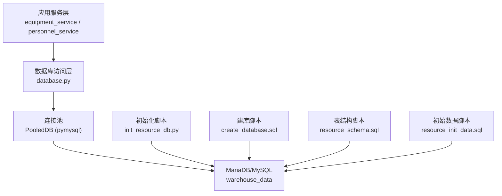
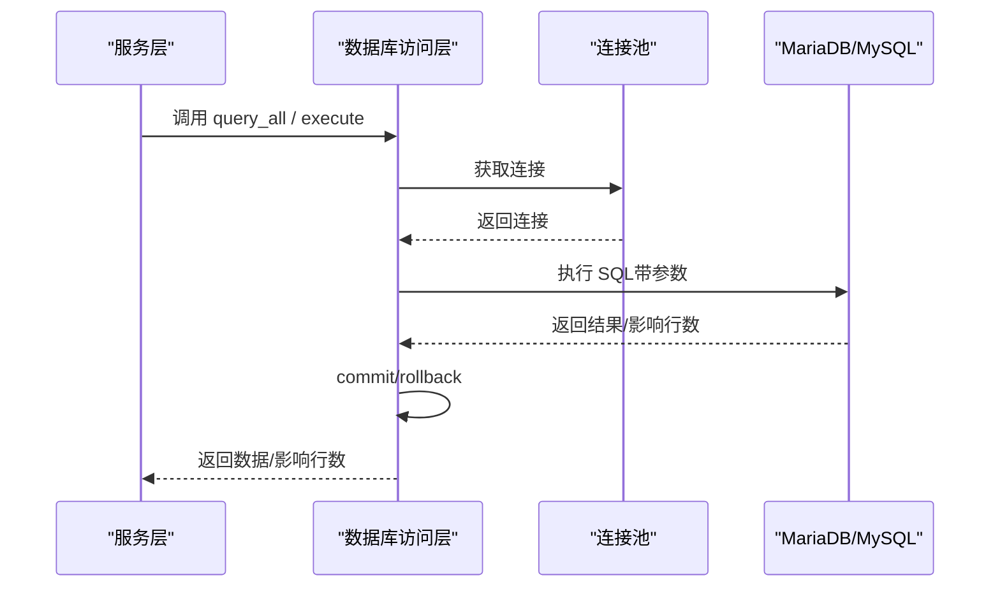
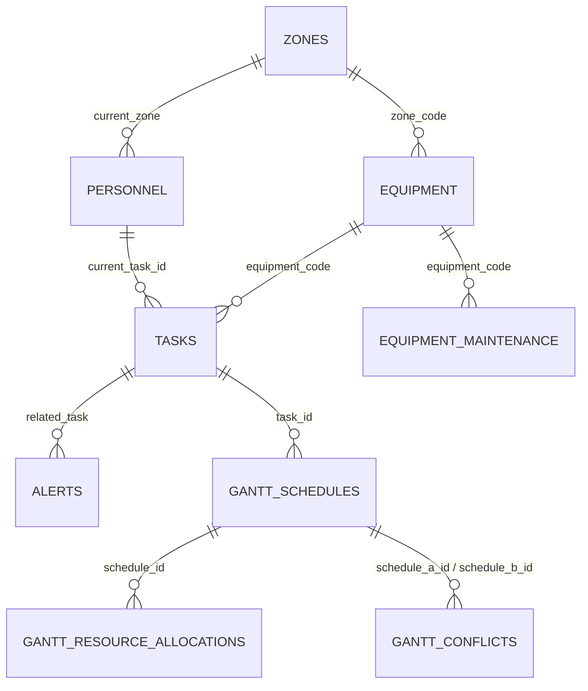
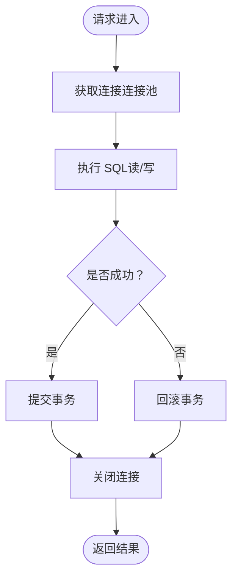
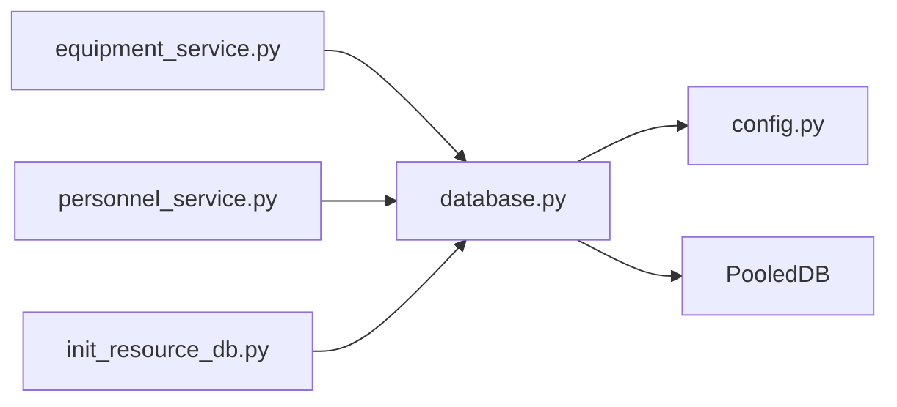

# 数据库架构设计

<cite>
**本文引用的文件**
- [backend/database.py](file://backend/database.py)
- [backend/config.py](file://backend/config.py)
- [backend/sql/resource_schema.sql](file://backend/sql/resource_schema.sql)
- [backend/sql/resource_init_data.sql](file://backend/sql/resource_init_data.sql)
- [backend/sql/init_resource_db.py](file://backend/sql/init_resource_db.py)
- [windows_setup/sql/create_database.sql](file://windows_setup/sql/create_database.sql)
- [backend/modules/resource/services/equipment_service.py](file://backend/modules/resource/services/equipment_service.py)
- [backend/modules/resource/services/personnel_service.py](file://backend/modules/resource/services/personnel_service.py)
</cite>

## 目录
1. [简介](#简介)
2. [项目结构](#项目结构)
3. [核心组件](#核心组件)
4. [架构总览](#架构总览)
5. [详细组件分析](#详细组件分析)
6. [依赖关系分析](#依赖关系分析)
7. [性能与优化建议](#性能与优化建议)
8. [故障排查指南](#故障排查指南)
9. [结论](#结论)
10. [附录](#附录)

## 简介
本文件面向“试制资源数智化管理系统”的数据库架构，围绕 MariaDB/MySQL 选型、表结构设计、数据访问层、迁移与备份恢复、一致性保障、安全策略、ER 图与查询优化、分库分表与读写分离可行性等方面给出系统化说明。文档内容严格基于仓库中的 SQL 脚本、数据库连接与配置代码以及服务层对数据库的实际使用方式进行分析与归纳。

## 项目结构
- 数据库定义与初始化：
  - 建库脚本：[windows_setup/sql/create_database.sql](file://windows_setup/sql/create_database.sql)
  - 业务表结构：[backend/sql/resource_schema.sql](file://backend/sql/resource_schema.sql)
  - 初始数据：[backend/sql/resource_init_data.sql](file://backend/sql/resource_init_data.sql)
  - 初始化执行器：[backend/sql/init_resource_db.py](file://backend/sql/init_resource_db.py)
- 数据库连接与访问：
  - 连接池与通用访问封装：[backend/database.py](file://backend/database.py)
  - 配置加载（含 DB_HOST/PORT/USER/PASSWORD/DATABASE）：[backend/config.py](file://backend/config.py)
- 业务服务层对数据库的使用示例：
  - 设备服务：[backend/modules/resource/services/equipment_service.py](file://backend/modules/resource/services/equipment_service.py)
  - 人员服务：[backend/modules/resource/services/personnel_service.py](file://backend/modules/resource/services/personnel_service.py)

图表来源
- [backend/database.py:12-43](file://backend/database.py#L12-L43)
- [backend/sql/init_resource_db.py:21-45](file://backend/sql/init_resource_db.py#L21-L45)
- [windows_setup/sql/create_database.sql:9-19](file://windows_setup/sql/create_database.sql#L9-L19)
- [backend/sql/resource_schema.sql:1-10](file://backend/sql/resource_schema.sql#L1-L10)
- [backend/sql/resource_init_data.sql:1-10](file://backend/sql/resource_init_data.sql#L1-L10)

章节来源
- [backend/database.py:12-43](file://backend/database.py#L12-L43)
- [backend/config.py:48-57](file://backend/config.py#L48-L57)
- [backend/sql/init_resource_db.py:21-45](file://backend/sql/init_resource_db.py#L21-L45)
- [windows_setup/sql/create_database.sql:9-19](file://windows_setup/sql/create_database.sql#L9-L19)
- [backend/sql/resource_schema.sql:1-10](file://backend/sql/resource_schema.sql#L1-L10)
- [backend/sql/resource_init_data.sql:1-10](file://backend/sql/resource_init_data.sql#L1-L10)

## 核心组件
- 数据库连接池与访问封装
  - 通过 PooledDB 创建全局连接池，延迟初始化，避免启动时因配置错误导致崩溃；提供 query_all/query_one/execute/execute_last_id/execute_all 等统一接口，统一事务提交与回滚。
- 配置管理
  - 从 .env 读取数据库主机、端口、用户、密码、库名等参数，支持默认值与类型转换。
- 表结构与初始化
  - 使用 resource_schema.sql 定义业务表及索引；resource_init_data.sql 提供基础主数据；init_resource_db.py 负责顺序执行建表与初始化数据。
- 服务层数据访问
  - equipment_service.py 与 personnel_service.py 通过 database.py 提供的函数进行分页、筛选、JOIN 查询与写入操作，体现实际的数据访问模式。

章节来源
- [backend/database.py:12-116](file://backend/database.py#L12-L116)
- [backend/config.py:48-57](file://backend/config.py#L48-L57)
- [backend/sql/init_resource_db.py:21-68](file://backend/sql/init_resource_db.py#L21-L68)
- [backend/modules/resource/services/equipment_service.py:11-103](file://backend/modules/resource/services/equipment_service.py#L11-L103)
- [backend/modules/resource/services/personnel_service.py:24-124](file://backend/modules/resource/services/personnel_service.py#L24-L124)

## 架构总览
系统采用“服务层 + 轻量数据访问层 + 原生SQL + 连接池”的架构。服务层负责业务逻辑与校验，数据访问层封装连接池与事务语义，SQL 脚本集中管理表结构与初始数据。该架构具备以下特点：
- 低耦合：服务层不直接持有连接对象，仅调用统一接口。
- 易维护：表结构变更集中在 SQL 脚本中，便于版本化与回滚。
- 可扩展：后续可引入 ORM 或更复杂的查询构建器，但当前原生 SQL 已满足需求。

图表来源
- [backend/database.py:51-116](file://backend/database.py#L51-L116)
- [backend/database.py:12-43](file://backend/database.py#L12-L43)

## 详细组件分析

### 数据库选型与理由（MariaDB/MySQL）
- 开源免费：降低许可成本，适合企业级生产环境。
- 生态成熟：广泛社区支持与工具链，便于运维与监控。
- 兼容性与性能：InnoDB 引擎提供 ACID 事务、行级锁与高并发能力；utf8mb4 字符集支持完整 Unicode。
- 部署便捷：Windows/Linux 均有成熟安装与自动化脚本支持。

章节来源
- [backend/sql/resource_schema.sql:1-10](file://backend/sql/resource_schema.sql#L1-L10)
- [windows_setup/sql/create_database.sql:9-19](file://windows_setup/sql/create_database.sql#L9-L19)

### 实体关系模型（ER）
核心实体包括：区域 zones、设备 equipment、人员 personnel、任务 tasks、异常预警 alerts、人员效率 personnel_efficiency、设备维护 equipment_maintenance、甘特排程 gantt_schedules、甘特资源分配 gantt_resource_allocations、甘特冲突 gantt_conflicts。

图表来源
- [backend/sql/resource_schema.sql:13-326](file://backend/sql/resource_schema.sql#L13-L326)

章节来源
- [backend/sql/resource_schema.sql:13-326](file://backend/sql/resource_schema.sql#L13-L326)

### 主外键约束与索引策略
- 主键：所有表均使用自增 INT 主键 id，保证唯一性与高效自增。
- 唯一约束：如 equipment.equipment_code、zones.zone_code、tasks.task_code、alerts.alert_code、gantt_schedules.schedule_code、gantt_resource_allocations.allocation_code、gantt_conflicts.conflict_code。
- 外键关系：
  - equipment.zone_code 引用 zones.zone_code（逻辑关联，用于 JOIN）。
  - tasks.equipment_code 引用 equipment.equipment_code（逻辑关联）。
  - tasks.current_task_id 与 personnel.current_task_id 指向 tasks.id（逻辑关联）。
  - gantt_schedules.task_id 引用 tasks.id（逻辑关联）。
  - gantt_resource_allocations.schedule_id 引用 gantt_schedules.id（逻辑关联）。
  - gantt_conflicts.schedule_a_id/schedule_b_id 引用 gantt_schedules.id（逻辑关联）。
- 索引优化：
  - 高频查询字段建立索引，如 status、priority、type、zone_code、equipment_code、raised_at、handler、assembly_site、plan_start_time、plan_end_time、is_critical、has_conflict、detected_at 等。
  - 复合索引用于多条件过滤与排序，如 idx_alert_related(related_type, related_id)、idx_sch_task(task_id, task_code)。

章节来源
- [backend/sql/resource_schema.sql:13-326](file://backend/sql/resource_schema.sql#L13-L326)

### 数据访问层设计
- 连接池管理：
  - 使用 dbutils.pooled_db.PooledDB，maxconnections=10，mincached=0，maxcached=5，blocking=True，避免启动时预建连接导致的失败风险。
  - 连接池单例化，首次使用时初始化，失败时记录明确错误信息并提示检查 .env 配置。
- 事务与一致性：
  - write 操作统一在 execute/execute_last_id/execute_all 中 commit；异常时 rollback，确保原子性。
  - 每个方法独立获取连接并在 finally 中关闭，避免连接泄漏。
- 查询优化：
  - 服务层使用分页 LIMIT/OFFSET 与 WHERE 条件拼接，减少不必要数据传输。
  - 使用 LEFT JOIN 关联 zones/tasks 以展示名称与任务信息，配合索引提升 JOIN 性能。
- ORM 映射：
  - 当前未使用 ORM，采用原生 SQL 与字典游标 DictCursor，便于灵活控制 SQL 与性能调优。

图表来源
- [backend/database.py:51-116](file://backend/database.py#L51-L116)

章节来源
- [backend/database.py:12-116](file://backend/database.py#L12-L116)
- [backend/modules/resource/services/equipment_service.py:11-103](file://backend/modules/resource/services/equipment_service.py#L11-L103)
- [backend/modules/resource/services/personnel_service.py:24-124](file://backend/modules/resource/services/personnel_service.py#L24-L124)

### 数据迁移方案
- 建库与授权：
  - create_database.sql 创建 warehouse_data 数据库并设置 utf8mb4 字符集与排序规则；可选创建专用用户 spider_v5 并授予权限。
- 建表与初始化：
  - init_resource_db.py 顺序执行 resource_schema.sql 与 resource_init_data.sql，实现表结构与基础数据的初始化。
- 版本化建议：
  - 将 SQL 脚本纳入版本控制，每次变更增加版本号与回滚脚本，确保可重复部署与回滚。

章节来源
- [windows_setup/sql/create_database.sql:9-19](file://windows_setup/sql/create_database.sql#L9-L19)
- [backend/sql/init_resource_db.py:21-68](file://backend/sql/init_resource_db.py#L21-L68)
- [backend/sql/resource_schema.sql:1-10](file://backend/sql/resource_schema.sql#L1-L10)
- [backend/sql/resource_init_data.sql:1-10](file://backend/sql/resource_init_data.sql#L1-L10)

### 备份恢复策略
- 逻辑备份：
  - 使用 mysqldump 导出 warehouse_data 库为 SQL 文件，便于跨平台迁移与归档。
- 物理备份：
  - 针对 InnoDB 可使用 XtraBackup 进行热备，缩短停机窗口。
- 恢复流程：
  - 先创建数据库与用户，再导入 schema 与数据；建议在测试环境验证后再在生产执行。
- 备份频率：
  - 全量每日一次，增量每小时一次；保留至少 7-30 天备份。

[本节为通用实践建议，不直接引用具体文件]

### 数据一致性保证机制
- 事务边界：
  - 写操作统一在 database.py 中 commit，异常时 rollback，保证单条语句的事务一致性。
- 唯一约束与校验：
  - 服务层在插入前检查唯一性（如设备编号、工号），防止重复数据。
- 冗余字段与一致性：
  - 部分表存在冗余字段（如 gantt_schedules.task_code、gantt_resource_allocations.schedule_code），需通过应用层保证同步更新。

章节来源
- [backend/database.py:73-116](file://backend/database.py#L73-L116)
- [backend/modules/resource/services/equipment_service.py:140-178](file://backend/modules/resource/services/equipment_service.py#L140-L178)
- [backend/modules/resource/services/personnel_service.py:170-200](file://backend/modules/resource/services/personnel_service.py#L170-L200)

### 数据安全考虑
- 敏感信息加密：
  - 当前未发现显式加密逻辑；建议对敏感字段（如 API Key、密码）在服务层加密存储，或使用密钥管理服务。
- 访问权限控制：
  - 通过数据库用户最小权限原则，仅授予必要权限；建议使用专用账户而非 root。
- 审计日志记录：
  - 可在关键写操作处记录审计日志（谁、何时、改了什么），结合后端日志系统进行追踪。

[本节为通用安全建议，不直接引用具体文件]

### ER 图与查询性能优化建议
- ER 图已在“实体关系模型”中给出，清晰表达各表之间的关联。
- 查询优化建议：
  - 利用现有索引进行条件过滤与排序，避免全表扫描。
  - 分页查询使用 LIMIT/OFFSET，并结合 where 条件缩小数据集。
  - 复杂 JOIN 场景下，确保关联字段有索引（如 zone_code、equipment_code、task_id）。
  - 对时间范围查询（如 plan_start_time、plan_end_time）建立索引以提升性能。

章节来源
- [backend/sql/resource_schema.sql:13-326](file://backend/sql/resource_schema.sql#L13-L326)
- [backend/modules/resource/services/equipment_service.py:55-87](file://backend/modules/resource/services/equipment_service.py#L55-L87)
- [backend/modules/resource/services/personnel_service.py:68-107](file://backend/modules/resource/services/personnel_service.py#L68-L107)

### 分库分表策略与读写分离可行性分析
- 分库分表：
  - 当前数据规模较小，单库即可满足；未来可按业务域拆分（如资源域、排程域、预警域），或按时间维度对历史数据进行归档。
  - 若数据量增长，可考虑按 project_code 或 assembly_site 进行水平分片。
- 读写分离：
  - 可通过主从复制实现读写分离，将读请求路由到从库，减轻主库压力。
  - 注意数据一致性与延迟问题，必要时引入缓存或强一致读策略。

[本节为架构扩展建议，不直接引用具体文件]

## 依赖关系分析
- 服务层依赖数据库访问层：
  - equipment_service.py 与 personnel_service.py 通过 database.py 提供的函数进行数据访问。
- 数据库访问层依赖配置与连接池：
  - database.py 使用 config.py 中的 settings 获取数据库连接参数，并通过 PooledDB 管理连接。
- 初始化脚本依赖数据库访问层：
  - init_resource_db.py 通过 database.py 获取连接执行 SQL 脚本。

图表来源
- [backend/modules/resource/services/equipment_service.py:1-10](file://backend/modules/resource/services/equipment_service.py#L1-L10)
- [backend/modules/resource/services/personnel_service.py:1-10](file://backend/modules/resource/services/personnel_service.py#L1-L10)
- [backend/database.py:1-10](file://backend/database.py#L1-L10)
- [backend/config.py:48-57](file://backend/config.py#L48-L57)
- [backend/sql/init_resource_db.py:18-20](file://backend/sql/init_resource_db.py#L18-L20)

章节来源
- [backend/modules/resource/services/equipment_service.py:1-10](file://backend/modules/resource/services/equipment_service.py#L1-L10)
- [backend/modules/resource/services/personnel_service.py:1-10](file://backend/modules/resource/services/personnel_service.py#L1-L10)
- [backend/database.py:1-10](file://backend/database.py#L1-L10)
- [backend/config.py:48-57](file://backend/config.py#L48-L57)
- [backend/sql/init_resource_db.py:18-20](file://backend/sql/init_resource_db.py#L18-L20)

## 性能与优化建议
- 索引优化：
  - 充分利用现有索引，避免不必要的函数计算与隐式类型转换。
  - 对高频查询字段（status、priority、type、zone_code、equipment_code、raised_at、handler、assembly_site、plan_start_time、plan_end_time）保持索引有效性。
- 查询优化：
  - 使用 EXPLAIN 分析慢查询，调整 SQL 与索引。
  - 分页查询结合 where 条件，减少 OFFSET 过大带来的性能下降。
- 连接池调优：
  - 根据并发量调整 maxconnections 与 maxcached，避免连接耗尽或过多。
- 批量操作：
  - 使用 execute_all 进行批量写入，减少网络往返与事务开销。

[本节为通用性能建议，不直接引用具体文件]

## 故障排查指南
- 连接池初始化失败：
  - 检查 backend/.env 中的 DB_HOST、DB_PORT、DB_USER、DB_PASSWORD、DB_DATABASE 是否正确。
  - 确认 MySQL/MariaDB 服务运行正常且端口可达。
- SQL 执行失败：
  - 查看日志输出，定位具体 SQL 与参数。
  - 检查表结构与索引是否存在，权限是否足够。
- 数据不一致：
  - 检查事务是否提交或回滚，确认唯一约束是否生效。

章节来源
- [backend/database.py:12-43](file://backend/database.py#L12-L43)
- [backend/sql/init_resource_db.py:21-45](file://backend/sql/init_resource_db.py#L21-L45)

## 结论
本系统采用 MariaDB/MySQL 作为数据库，通过连接池与统一访问层封装，实现了稳定高效的数据访问。表结构设计合理，索引策略完善，能够满足当前业务需求。未来可根据数据规模与业务复杂度，逐步引入分库分表与读写分离，进一步提升系统扩展性与可用性。

[本节为总结性内容，不直接引用具体文件]

## 附录
- 初始化流程：
  - 执行 create_database.sql 创建数据库与用户。
  - 执行 init_resource_db.py 初始化表结构与基础数据。
- 常用命令：
  - 备份：mysqldump -u user -p warehouse_data > backup.sql
  - 恢复：mysql -u user -p warehouse_data < backup.sql

[本节为操作指引，不直接引用具体文件]