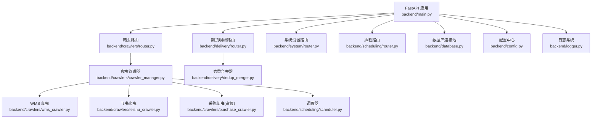
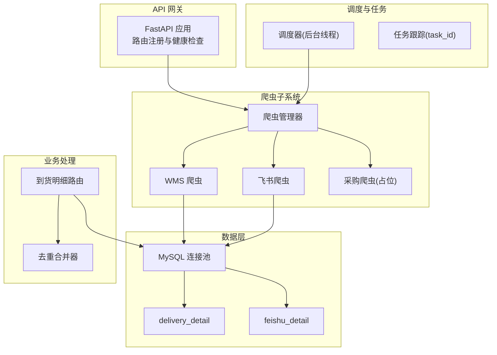
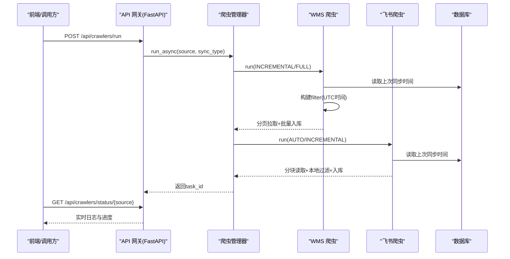
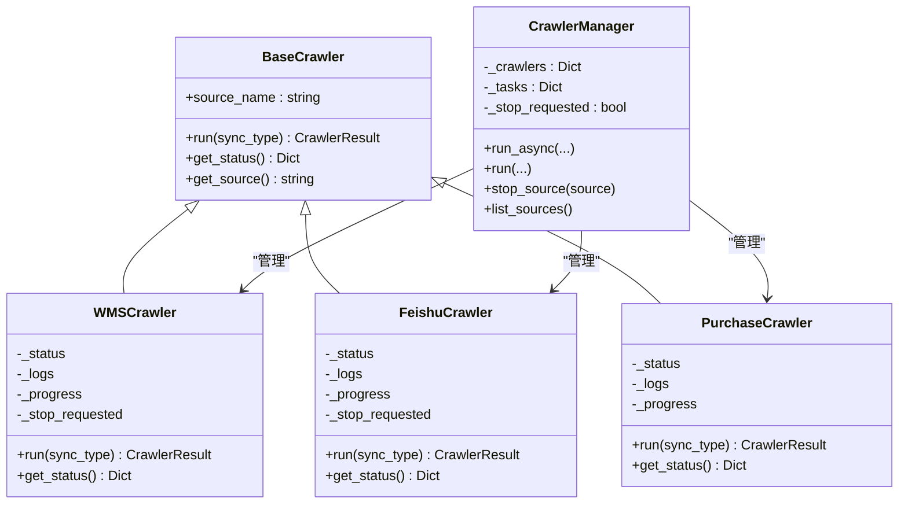
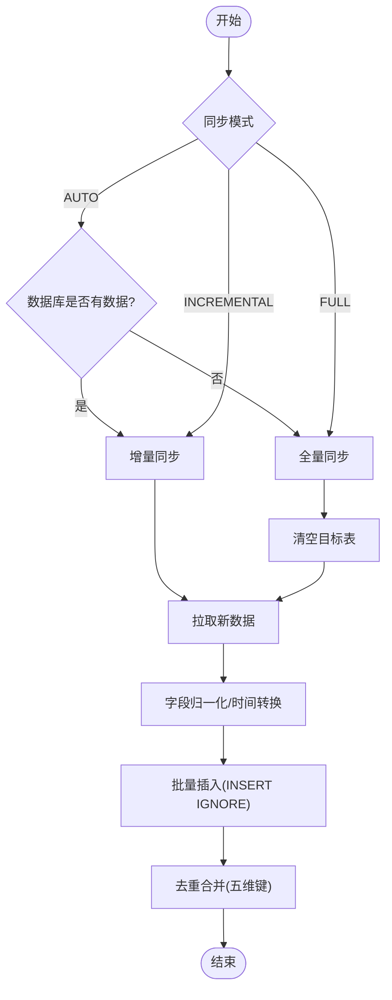
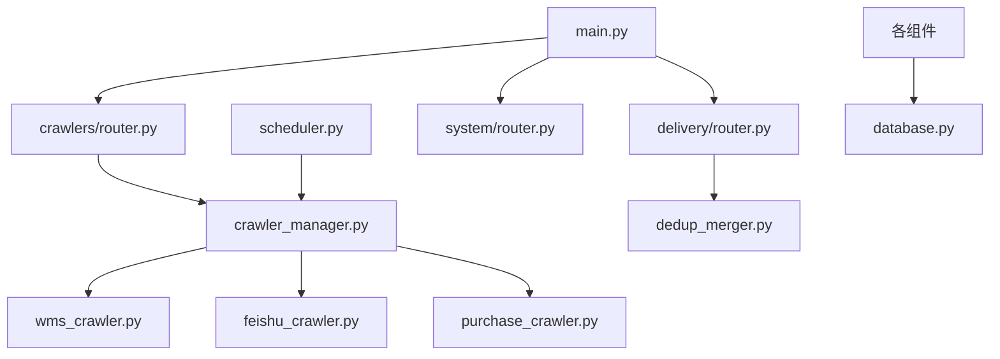

# 系统集成架构

<cite>
**本文引用的文件**
- [backend/main.py](file://backend/main.py)
- [backend/config.py](file://backend/config.py)
- [backend/database.py](file://backend/database.py)
- [backend/logger.py](file://backend/logger.py)
- [backend/crawlers/base.py](file://backend/crawlers/base.py)
- [backend/crawlers/crawler_manager.py](file://backend/crawlers/crawler_manager.py)
- [backend/crawlers/wms_crawler.py](file://backend/crawlers/wms_crawler.py)
- [backend/crawlers/feishu_crawler.py](file://backend/crawlers/feishu_crawler.py)
- [backend/crawlers/purchase_crawler.py](file://backend/crawlers/purchase_crawler.py)
- [backend/crawlers/router.py](file://backend/crawlers/router.py)
- [backend/scheduling/scheduler.py](file://backend/scheduling/scheduler.py)
- [backend/delivery/dedup_merger.py](file://backend/delivery/dedup_merger.py)
- [backend/delivery/router.py](file://backend/delivery/router.py)
- [backend/system/router.py](file://backend/system/router.py)
</cite>

## 目录
1. [简介](#简介)
2. [项目结构](#项目结构)
3. [核心组件](#核心组件)
4. [架构总览](#架构总览)
5. [详细组件分析](#详细组件分析)
6. [依赖关系分析](#依赖关系分析)
7. [性能考虑](#性能考虑)
8. [故障排查指南](#故障排查指南)
9. [结论](#结论)
10. [附录](#附录)

## 简介
本文件面向“试制资源数智化管理系统”的系统集成架构，聚焦外部系统集成模式（WMS仓储管理系统、飞书协作平台、采购系统）、爬虫系统设计（适配器模式、异步任务调度、错误重试机制）、数据同步策略（增量/全量、冲突解决算法）、API网关设计（请求路由、负载均衡、限流保护）、消息队列集成（用于异步解耦与扩展），以及系统集成监控、故障排查与性能调优方案。文档同时提供架构图与数据流转图，帮助读者快速理解整体设计与落地细节。

## 项目结构
后端采用 FastAPI 作为 API 网关与服务入口，按模块划分路由：项目管理、爬虫管理、PBOM解析、到货明细、关键件评分、排程、系统设置、试制资源等。爬虫子系统通过统一基类与管理器抽象不同数据源；调度器在后台定时执行自动增量同步；数据库层使用连接池封装读写操作；日志系统支持文件轮转与控制台输出。

**图表来源**
- [backend/main.py:29-83](file://backend/main.py#L29-L83)
- [backend/crawlers/router.py:43-147](file://backend/crawlers/router.py#L43-L147)
- [backend/delivery/router.py:41-118](file://backend/delivery/router.py#L41-L118)
- [backend/system/router.py:54-109](file://backend/system/router.py#L54-L109)
- [backend/crawlers/crawler_manager.py:90-101](file://backend/crawlers/crawler_manager.py#L90-L101)
- [backend/scheduling/scheduler.py:34-74](file://backend/scheduling/scheduler.py#L34-L74)
- [backend/database.py:12-43](file://backend/database.py#L12-L43)
- [backend/config.py:48-98](file://backend/config.py#L48-L98)
- [backend/logger.py:14-38](file://backend/logger.py#L14-L38)

**章节来源**
- [backend/main.py:29-83](file://backend/main.py#L29-L83)
- [backend/config.py:48-98](file://backend/config.py#L48-L98)

## 核心组件
- 爬虫基类与结果模型：定义统一的运行接口、状态枚举与结果结构，便于新增数据源时遵循一致契约。
- 爬虫管理器：集中注册与管理各爬虫实例，提供同步/异步执行、任务跟踪、停止控制与汇总统计。
- WMS 爬虫：对接 di360 WMS 接口，实现分页拉取、服务端时间过滤、批量入库与指数退避重试。
- 飞书爬虫：通过飞书开放 API 读取共享表格，分块拉取避免体积限制，本地增量过滤后入库。
- 采购爬虫：预留适配器位置，当前返回未接入提示，便于后续扩展。
- 调度器：后台线程按配置间隔自动执行增量同步，支持暂停/恢复与配置热重载。
- 去重合并器：基于五维键对多源到货数据进行去重与异常标记，支撑跨源一致性。
- 数据库层：连接池封装，提供查询与批量写入能力，失败回滚与错误提示。
- 配置与日志：集中化环境变量加载与日志轮转输出，保障可观测性。

**章节来源**
- [backend/crawlers/base.py:12-67](file://backend/crawlers/base.py#L12-L67)
- [backend/crawlers/crawler_manager.py:22-101](file://backend/crawlers/crawler_manager.py#L22-L101)
- [backend/crawlers/wms_crawler.py:44-119](file://backend/crawlers/wms_crawler.py#L44-L119)
- [backend/crawlers/feishu_crawler.py:55-82](file://backend/crawlers/feishu_crawler.py#L55-L82)
- [backend/crawlers/purchase_crawler.py:12-49](file://backend/crawlers/purchase_crawler.py#L12-L49)
- [backend/scheduling/scheduler.py:16-74](file://backend/scheduling/scheduler.py#L16-L74)
- [backend/delivery/dedup_merger.py:7-35](file://backend/delivery/dedup_merger.py#L7-L35)
- [backend/database.py:12-43](file://backend/database.py#L12-L43)
- [backend/logger.py:14-38](file://backend/logger.py#L14-L38)

## 架构总览
系统以 FastAPI 为网关，暴露统一 REST 接口；爬虫子系统通过适配器模式屏蔽不同数据源差异；调度器在后台定时触发增量同步；数据经清洗、归一化后落库；到货明细提供查询与统计；去重合并器在多源间进行冲突检测与合并。

**图表来源**
- [backend/main.py:29-83](file://backend/main.py#L29-L83)
- [backend/crawlers/crawler_manager.py:90-101](file://backend/crawlers/crawler_manager.py#L90-L101)
- [backend/scheduling/scheduler.py:93-153](file://backend/scheduling/scheduler.py#L93-L153)
- [backend/delivery/router.py:41-118](file://backend/delivery/router.py#L41-L118)
- [backend/delivery/dedup_merger.py:48-128](file://backend/delivery/dedup_merger.py#L48-L128)
- [backend/database.py:12-43](file://backend/database.py#L12-L43)

## 详细组件分析

### 外部系统集成模式
- WMS 仓储管理系统
  - 认证与鉴权：从凭证表读取 Authorization/Cookie，构造请求头并复用 Session。
  - 分页与过滤：构建嵌套 filter 数组，将 RECIVE_TIME > last_time 传入服务端，减少网络传输。
  - 时间处理：API 返回 UTC，入库前转换为北京时间；增量条件由数据库最新时间转换回 UTC 传给 API。
  - 重试机制：超时/连接错误指数退避重试，最多三次。
  - 批量入库：INSERT IGNORE 去重，结合主键/唯一约束保证幂等。
- 飞书协作平台
  - 令牌获取：通过系统设置登录获取 tenant_access_token。
  - 分块读取：按行范围分批读取，避免单次响应过大。
  - 增量过滤：本地根据 RECIVE_TIME 过滤旧记录，减少无效写入。
  - 字段映射：列索引映射到目标字段，数值与日期规范化。
- 采购系统
  - 适配器预留：继承 BaseCrawler，当前返回未接入提示，后续可按相同模式接入 API。

**图表来源**
- [backend/crawlers/router.py:89-147](file://backend/crawlers/router.py#L89-L147)
- [backend/crawlers/crawler_manager.py:134-197](file://backend/crawlers/crawler_manager.py#L134-L197)
- [backend/crawlers/wms_crawler.py:127-178](file://backend/crawlers/wms_crawler.py#L127-L178)
- [backend/crawlers/feishu_crawler.py:132-203](file://backend/crawlers/feishu_crawler.py#L132-L203)
- [backend/database.py:51-116](file://backend/database.py#L51-L116)

**章节来源**
- [backend/crawlers/wms_crawler.py:44-119](file://backend/crawlers/wms_crawler.py#L44-L119)
- [backend/crawlers/feishu_crawler.py:55-82](file://backend/crawlers/feishu_crawler.py#L55-L82)
- [backend/crawlers/purchase_crawler.py:12-49](file://backend/crawlers/purchase_crawler.py#L12-L49)

### 爬虫系统设计（适配器模式、异步调度、错误重试）
- 适配器模式：BaseCrawler 定义统一 run/get_status 接口，具体爬虫实现各自适配逻辑，新增数据源只需继承并注册。
- 异步任务调度：crawler_manager.run_async 立即返回 task_id，后台线程执行任务；前端轮询 status 获取日志与进度。
- 错误重试：WMS 与飞书爬虫均实现指数退避重试，捕获超时/连接/HTTP 错误，记录告警日志。
- 停止控制：manager 设置全局停止标志，爬虫循环中检查提前退出，确保优雅关闭。

**图表来源**
- [backend/crawlers/base.py:12-67](file://backend/crawlers/base.py#L12-L67)
- [backend/crawlers/wms_crawler.py:44-119](file://backend/crawlers/wms_crawler.py#L44-L119)
- [backend/crawlers/feishu_crawler.py:55-82](file://backend/crawlers/feishu_crawler.py#L55-L82)
- [backend/crawlers/purchase_crawler.py:12-49](file://backend/crawlers/purchase_crawler.py#L12-L49)
- [backend/crawlers/crawler_manager.py:22-101](file://backend/crawlers/crawler_manager.py#L22-L101)

**章节来源**
- [backend/crawlers/base.py:12-67](file://backend/crawlers/base.py#L12-L67)
- [backend/crawlers/crawler_manager.py:134-197](file://backend/crawlers/crawler_manager.py#L134-L197)
- [backend/crawlers/wms_crawler.py:180-213](file://backend/crawlers/wms_crawler.py#L180-L213)
- [backend/crawlers/feishu_crawler.py:132-203](file://backend/crawlers/feishu_crawler.py#L132-L203)

### 数据同步策略（增量、全量、冲突解决）
- 增量同步：WMS 通过服务端 filter 传递 RECIVE_TIME > last_time；飞书本地比较 RECIVE_TIME 过滤旧记录。
- 全量同步：清空目标表后重新拉取全量数据。
- 自动模式：若数据库已有数据则切换为增量，否则全量。
- 冲突解决：去重合并器基于五维键（项目号、零件号、数量、时间天级、单据号）分组，标记多源重复与数量不一致的异常记录。

**图表来源**
- [backend/crawlers/wms_crawler.py:313-364](file://backend/crawlers/wms_crawler.py#L313-L364)
- [backend/crawlers/feishu_crawler.py:251-294](file://backend/crawlers/feishu_crawler.py#L251-L294)
- [backend/delivery/dedup_merger.py:21-35](file://backend/delivery/dedup_merger.py#L21-L35)

**章节来源**
- [backend/crawlers/wms_crawler.py:216-271](file://backend/crawlers/wms_crawler.py#L216-L271)
- [backend/crawlers/feishu_crawler.py:205-220](file://backend/crawlers/feishu_crawler.py#L205-L220)
- [backend/delivery/dedup_merger.py:48-128](file://backend/delivery/dedup_merger.py#L48-L128)

### API 网关设计（请求路由、负载均衡、限流保护）
- 请求路由：FastAPI 按模块注册路由，涵盖爬虫管理、到货明细、系统设置、排程等。
- 健康检查：提供 /api/health 接口用于服务可用性探测。
- 负载均衡：当前单进程部署，可通过反向代理（如 Nginx）或容器编排实现多实例水平扩展。
- 限流保护：可在网关层引入中间件（如速率限制）或在反向代理配置限流策略，防止滥用。

**图表来源**
- [backend/main.py:29-83](file://backend/main.py#L29-L83)
- [backend/main.py:94-97](file://backend/main.py#L94-L97)

**章节来源**
- [backend/main.py:29-83](file://backend/main.py#L29-L83)

### 消息队列集成（异步任务处理与系统解耦）
- 现状：当前系统通过后台线程与任务跟踪实现异步执行，未引入独立消息队列。
- 建议：在高频或高并发场景下，可将爬虫任务投递至消息队列（如 RabbitMQ/Kafka），消费者按需消费，提升可扩展性与容错能力；结合死信队列与重试策略增强可靠性。
- 解耦点：调度器与爬虫执行、爬虫与数据入库、合并计算与查询接口均可通过队列解耦，降低耦合度与峰值压力。

[本节为概念性说明，不直接分析具体文件]

## 依赖关系分析
- 组件耦合：
  - main.py 聚合各模块路由，低内聚高内聚良好。
  - crawler_manager 依赖具体爬虫实现，新增数据源仅需注册。
  - scheduler 与 crawler_manager 松耦合，通过接口交互。
  - delivery.router 依赖 database 与 dedup_merger，职责清晰。
- 外部依赖：
  - WMS 与飞书 API 通过 requests 调用，具备重试与错误处理。
  - MySQL 通过 pymysql 与连接池管理，失败时提供明确错误信息。
- 潜在循环依赖：
  - 通过延迟导入（如 from ... import ...）避免启动时循环依赖。

**图表来源**
- [backend/main.py:29-83](file://backend/main.py#L29-L83)
- [backend/crawlers/router.py:43-147](file://backend/crawlers/router.py#L43-L147)
- [backend/delivery/router.py:41-118](file://backend/delivery/router.py#L41-L118)
- [backend/scheduling/scheduler.py:93-153](file://backend/scheduling/scheduler.py#L93-L153)
- [backend/database.py:12-43](file://backend/database.py#L12-L43)

**章节来源**
- [backend/main.py:29-83](file://backend/main.py#L29-L83)
- [backend/crawlers/crawler_manager.py:90-101](file://backend/crawlers/crawler_manager.py#L90-L101)
- [backend/delivery/router.py:41-118](file://backend/delivery/router.py#L41-L118)

## 性能考虑
- 网络层：
  - WMS/飞书请求使用 requests.Session 复用连接，减少握手开销。
  - 分页拉取与分块读取降低单次响应大小，避免内存峰值。
  - 指数退避重试缓解瞬时网络抖动。
- 数据层：
  - 连接池限制最大连接数，避免数据库过载。
  - 批量插入减少事务次数，提高吞吐。
  - INSERT IGNORE 利用数据库去重，降低应用层复杂度。
- 调度与并发：
  - 调度器后台线程按配置间隔执行，避免阻塞请求。
  - 手动触发时暂停调度器，防止重复执行。
- 建议优化：
  - 引入缓存（如 Redis）缓存热点配置与元数据。
  - 对大表查询增加合适索引，优化分页与筛选性能。
  - 在高并发场景引入消息队列与水平扩展。

[本节提供通用指导，不直接分析具体文件]

## 故障排查指南
- 数据库连接失败：
  - 检查 .env 中的 DB_HOST/DB_PORT/DB_USER/DB_PASSWORD/DB_DATABASE 配置是否正确。
  - 连接池初始化失败会记录详细错误日志。
- 爬虫执行异常：
  - 查看对应爬虫日志（文件日志与运行时日志快照）。
  - 确认凭证有效（WMS Authorization/Cookie，飞书 App ID/Secret）。
  - 关注重试次数与错误类型（超时/连接/HTTP 错误）。
- 调度器问题：
  - 检查是否处于暂停状态或配置无效。
  - 查看最近一次执行时间与状态。
- 日志定位：
  - 使用 logger 输出的文件日志（按名称区分）与控制台输出。
  - 前端通过 /crawlers/status 轮询实时日志。

**章节来源**
- [backend/database.py:12-43](file://backend/database.py#L12-L43)
- [backend/crawlers/wms_crawler.py:112-125](file://backend/crawlers/wms_crawler.py#L112-L125)
- [backend/crawlers/feishu_crawler.py:72-82](file://backend/crawlers/feishu_crawler.py#L72-L82)
- [backend/scheduling/scheduler.py:67-74](file://backend/scheduling/scheduler.py#L67-L74)
- [backend/logger.py:14-38](file://backend/logger.py#L14-L38)

## 结论
本系统集成架构以 FastAPI 为网关，通过适配器模式统一爬虫接口，结合后台调度器实现自动化增量同步；数据层采用连接池与批量写入提升性能；去重合并器保障多源数据一致性。建议在后续演进中引入消息队列与缓存，进一步增强可扩展性与稳定性。

[本节为总结性内容，不直接分析具体文件]

## 附录
- 配置项参考：
  - 数据库：DB_HOST, DB_PORT, DB_USER, DB_PASSWORD, DB_DATABASE
  - 爬虫：SPIDER_INTERVAL_MINUTES, SPIDER_TIMEOUT_SECONDS
  - WMS：LOGIN_URL, QUERY_URL
  - 飞书：FEISHU_APP_ID, FEISHU_APP_SECRET, FEISHU_SHEET_URL
  - 采购：PURCHASE_API_URL, PURCHASE_API_KEY
  - 服务：SERVER_HOST, SERVER_PORT, DEBUG, CORS_ORIGINS, QR_BASE_URL
- 关键接口：
  - 健康检查：GET /api/health
  - 爬虫配置：GET/POST /api/crawlers/config
  - 执行爬虫：POST /api/crawlers/run
  - 状态查询：GET /api/crawlers/status, /api/crawlers/status/{source}
  - 到货明细：GET /api/delivery/detail
  - 系统设置：POST /api/system/login, /api/system/login/feishu, /api/system/credentials

**章节来源**
- [backend/config.py:51-98](file://backend/config.py#L51-L98)
- [backend/main.py:94-97](file://backend/main.py#L94-L97)
- [backend/crawlers/router.py:43-147](file://backend/crawlers/router.py#L43-L147)
- [backend/delivery/router.py:41-118](file://backend/delivery/router.py#L41-L118)
- [backend/system/router.py:54-109](file://backend/system/router.py#L54-L109)