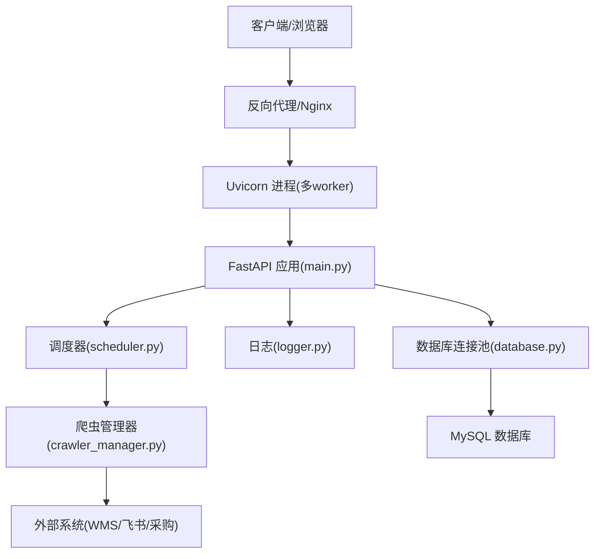
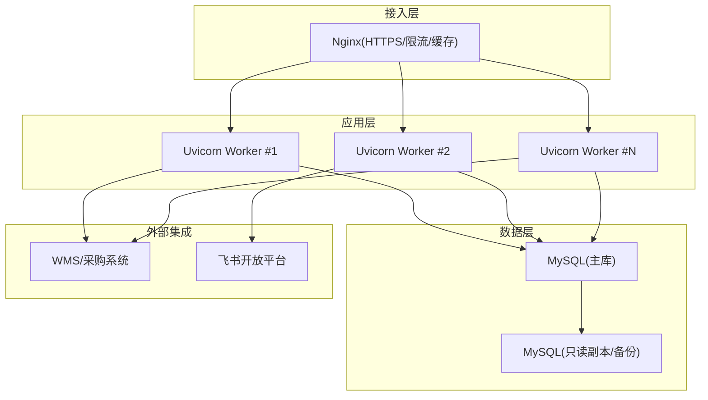
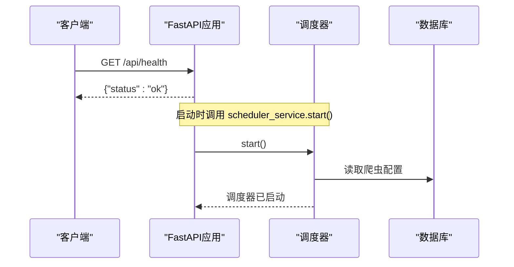
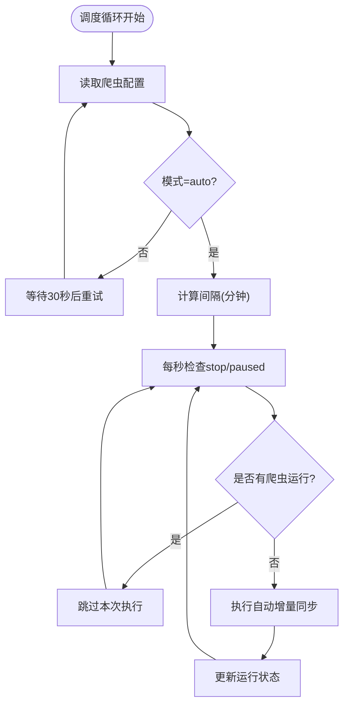

# 部署架构设计

<cite>
**本文引用的文件**
- [backend/main.py](file://backend/main.py)
- [backend/config.py](file://backend/config.py)
- [backend/database.py](file://backend/database.py)
- [backend/logger.py](file://backend/logger.py)
- [backend/requirements.txt](file://backend/requirements.txt)
- [backend/env.example](file://backend/env.example)
- [backend/scheduling/scheduler.py](file://backend/scheduling/scheduler.py)
- [backend/crawlers/crawler_manager.py](file://backend/crawlers/crawler_manager.py)
- [backend/system/credentials.py](file://backend/system/credentials.py)
- [backend/scripts/init_db.py](file://backend/scripts/init_db.py)
- [backend/sql/resource_schema.sql](file://backend/sql/resource_schema.sql)
- [windows_setup/0_一键部署.bat](file://windows_setup/0_一键部署.bat)
- [windows_setup/README_WINDOWS.txt](file://windows_setup/README_WINDOWS.txt)
- [windows_setup/step2_configure_env.bat](file://windows_setup/step2_configure_env.bat)
- [start_server.py](file://start_server.py)
</cite>

## 目录
1. [简介](#简介)
2. [项目结构](#项目结构)
3. [核心组件](#核心组件)
4. [架构总览](#架构总览)
5. [详细组件分析](#详细组件分析)
6. [依赖关系分析](#依赖关系分析)
7. [性能与容量规划](#性能与容量规划)
8. [故障排查指南](#故障排查指南)
9. [结论](#结论)
10. [附录：生产部署与环境配置指南](#附录生产部署与环境配置指南)

## 简介
本文件面向“试制资源数智化管理系统”的生产环境部署，覆盖容器化部署、服务器配置、环境变量管理、高可用架构（负载均衡、故障转移、数据备份）、监控告警体系、CI/CD流水线设计、安全加固措施、性能调优与容量规划。文档基于仓库现有后端实现（FastAPI + Uvicorn + MySQL）与脚本能力进行可落地的生产级方案说明，并给出架构图与配置清单。

## 项目结构
- 后端服务：FastAPI 应用入口、路由注册、CORS、健康检查、静态 SPA 回退、调度器生命周期管理。
- 配置与环境：集中式 .env 配置加载、数据库连接池、日志轮转。
- 数据层：MySQL 连接池封装、批量执行、事务性写操作。
- 爬虫与调度：定时任务调度、多源爬虫统一管理与异步执行。
- 系统凭证：多数据源登录与 Token 管理（WMS、飞书、采购）。
- 数据库初始化：建表脚本与默认参数注入。
- Windows 一键部署脚本：本地快速安装与启动流程。

图表来源
- [backend/main.py:29-83](file://backend/main.py#L29-L83)
- [backend/database.py:12-43](file://backend/database.py#L12-L43)
- [backend/logger.py:14-38](file://backend/logger.py#L14-L38)
- [backend/scheduling/scheduler.py:16-74](file://backend/scheduling/scheduler.py#L16-L74)
- [backend/crawlers/crawler_manager.py:22-97](file://backend/crawlers/crawler_manager.py#L22-L97)

章节来源
- [backend/main.py:29-120](file://backend/main.py#L29-L120)
- [backend/config.py:48-101](file://backend/config.py#L48-L101)
- [backend/database.py:12-116](file://backend/database.py#L12-L116)
- [backend/logger.py:14-43](file://backend/logger.py#L14-L43)

## 核心组件
- FastAPI 应用与路由：统一注册业务模块路由、CORS、健康检查、SPA 回退。
- 配置中心：从 .env 读取服务端口、跨域、数据库、爬虫间隔、LLM 等配置。
- 数据库访问：连接池单例、读写分离封装、异常回滚与错误提示。
- 日志系统：按级别输出到控制台与轮转文件，便于采集与归档。
- 调度器：后台线程周期性执行增量同步，支持暂停/恢复、配置热重载。
- 爬虫管理器：统一管理 WMS/飞书/采购爬虫，支持同步/异步执行与状态追踪。
- 凭证管理：自动登录获取 Token、手动同步、过期刷新与持久化。

章节来源
- [backend/main.py:29-120](file://backend/main.py#L29-L120)
- [backend/config.py:48-101](file://backend/config.py#L48-L101)
- [backend/database.py:12-116](file://backend/database.py#L12-L116)
- [backend/logger.py:14-43](file://backend/logger.py#L14-L43)
- [backend/scheduling/scheduler.py:16-196](file://backend/scheduling/scheduler.py#L16-L196)
- [backend/crawlers/crawler_manager.py:22-305](file://backend/crawlers/crawler_manager.py#L22-L305)
- [backend/system/credentials.py:25-149](file://backend/system/credentials.py#L25-L149)

## 架构总览
生产环境推荐采用“反向代理 + 多进程 Web 服务 + 独立数据库”的解耦架构。通过 Nginx 提供 HTTPS 终止、静态资源缓存、请求限流与健康检查转发；Uvicorn 以多 worker 运行 FastAPI；MySQL 使用主从或云托管实例，配合定期备份。

图表来源
- [backend/main.py:29-83](file://backend/main.py#L29-L83)
- [backend/database.py:12-43](file://backend/database.py#L12-L43)
- [backend/system/credentials.py:448-573](file://backend/system/credentials.py#L448-L573)

## 详细组件分析

### 应用入口与生命周期
- 启动事件：应用启动时拉起调度器，关闭事件停止调度器，确保资源释放。
- 路由注册：模块化路由前缀划分，便于权限与网关策略控制。
- 健康检查：/api/health 用于探针与负载均衡摘挂。
- SPA 回退：非 API 请求返回 index.html，简化部署。

图表来源
- [backend/main.py:36-55](file://backend/main.py#L36-L55)
- [backend/main.py:94-98](file://backend/main.py#L94-L98)
- [backend/scheduling/scheduler.py:34-74](file://backend/scheduling/scheduler.py#L34-L74)

章节来源
- [backend/main.py:29-120](file://backend/main.py#L29-L120)

### 配置与环境变量
- 集中读取 .env，提供类型安全的配置访问器（整数、布尔、列表）。
- 关键配置项：数据库连接、服务监听地址与端口、调试开关、CORS、爬虫间隔、外部接口地址、LLM 密钥、上传目录。
- 建议：生产环境禁用 DEBUG，严格限制 CORS_ORIGINS，使用强密码与最小权限账号。

章节来源
- [backend/config.py:25-101](file://backend/config.py#L25-L101)
- [backend/env.example:1-49](file://backend/env.example#L1-L49)

### 数据库连接与写入
- 连接池：PooledDB 单例，延迟初始化，避免启动期失败导致崩溃。
- 读写封装：query_all/query_one/execute/execute_last_id/execute_all，统一事务提交与回滚。
- 错误提示：连接失败时记录明确的环境配置排查信息。

章节来源
- [backend/database.py:12-116](file://backend/database.py#L12-L116)

### 日志与可观测性
- 双通道输出：控制台 + 轮转文件（10MB/个，保留7份），便于本地与容器日志采集。
- 建议：在容器中输出到 stdout/stderr，由日志采集器（如 Filebeat/Fluent Bit）收集至 ELK/Loki。

章节来源
- [backend/logger.py:14-43](file://backend/logger.py#L14-L43)

### 定时调度与爬虫执行
- 调度器：后台守护线程，按配置周期执行增量同步，支持暂停/恢复与配置热重载。
- 爬虫管理器：统一注册数据源，支持同步阻塞与异步任务，维护任务元信息与结果汇总。
- 凭证联动：自动登录刷新 Token，失败时更新运行状态。

图表来源
- [backend/scheduling/scheduler.py:93-153](file://backend/scheduling/scheduler.py#L93-L153)
- [backend/scheduling/scheduler.py:155-193](file://backend/scheduling/scheduler.py#L155-L193)
- [backend/crawlers/crawler_manager.py:134-197](file://backend/crawlers/crawler_manager.py#L134-L197)

章节来源
- [backend/scheduling/scheduler.py:16-196](file://backend/scheduling/scheduler.py#L16-L196)
- [backend/crawlers/crawler_manager.py:22-305](file://backend/crawlers/crawler_manager.py#L22-L305)
- [backend/system/credentials.py:294-418](file://backend/system/credentials.py#L294-L418)

### 系统凭证与外部系统集成
- WMS/采购：模拟登录获取 Token/Cookie，失败时降级保存凭证供后续重试。
- 飞书：获取 tenant_access_token，自动刷新过期 Token，持久化配置。
- 建议：敏感信息仅存于 .env 或密钥管理服务，不在代码中硬编码。

章节来源
- [backend/system/credentials.py:25-149](file://backend/system/credentials.py#L25-L149)
- [backend/system/credentials.py:448-573](file://backend/system/credentials.py#L448-L573)

### 数据库初始化与资源域模型
- 初始化脚本：创建项目、零件、交付、凭证、系统参数等表，并写入默认参数。
- 资源域模型：设备、区域、人员、任务、预警、效率统计、维护记录等表结构。

章节来源
- [backend/scripts/init_db.py:17-297](file://backend/scripts/init_db.py#L17-L297)
- [backend/sql/resource_schema.sql:1-200](file://backend/sql/resource_schema.sql#L1-L200)

## 依赖关系分析
- 运行时依赖：FastAPI、Uvicorn、PyMySQL、DBUtils、python-dotenv、requests、openpyxl/xlrd、qrcode/Pillow、openai（可选）。
- 部署依赖：Python 3.8+、MySQL 5.7/8.0、可选 Nginx。
- 启动方式：直接 uvicorn 或通过 start_server.py 管理进程。

章节来源
- [backend/requirements.txt:1-21](file://backend/requirements.txt#L1-L21)
- [windows_setup/README_WINDOWS.txt:32-75](file://windows_setup/README_WINDOWS.txt#L32-L75)
- [start_server.py:23-113](file://start_server.py#L23-L113)

## 性能与容量规划
- Web 服务
  - Uvicorn worker 数量：CPU 核数 × 2~4（根据 IO 密集程度调整）。
  - 连接池：maxconnections=10（可按 QPS 与并发调优至 20~50）。
  - 静态资源：由 Nginx 缓存与压缩，减少后端压力。
- 数据库
  - 索引：按查询热点建立索引（项目、零件、时间范围）。
  - 连接与锁：长事务拆分、批量写入、合理隔离级别。
  - 备份：每日全量 + 增量 binlog，异地容灾。
- 爬虫与调度
  - 间隔与超时：SPIDER_INTERVAL_MINUTES、SPIDER_TIMEOUT_SECONDS 按外部系统限流策略配置。
  - 并发控制：同一时刻仅一个爬虫运行，避免对上游造成冲击。
- 容量规划
  - 估算 QPS、峰值并发、存储增长（日志、附件、数据库），预留 30% 冗余。
  - 分片与归档：历史数据按月归档，冷热分离。

[本节为通用指导，不直接分析具体文件]

## 故障排查指南
- 启动失败
  - 检查 .env 是否复制并填写正确（DB_HOST/PORT/USER/PASSWORD/DATABASE）。
  - 确认 MySQL 可达且账号具备权限。
- 数据库连接失败
  - 查看日志中的连接池初始化错误提示，核对网络与凭据。
- 爬虫无法拉取数据
  - 检查凭证是否有效（Token/Cookie），必要时手动同步或重新登录。
  - 关注调度器日志，确认模式是否为 auto、间隔是否合理。
- 服务异常退出
  - 使用 stop_server 或信号优雅关闭，确保调度器与爬虫管理器清理完成。

章节来源
- [backend/config.py:15-22](file://backend/config.py#L15-L22)
- [backend/database.py:34-43](file://backend/database.py#L34-L43)
- [backend/scheduling/scheduler.py:149-153](file://backend/scheduling/scheduler.py#L149-L153)
- [backend/crawlers/crawler_manager.py:39-66](file://backend/crawlers/crawler_manager.py#L39-L66)
- [start_server.py:63-85](file://start_server.py#L63-L85)

## 结论
本方案以 FastAPI + Uvicorn + MySQL 为核心，结合调度器与爬虫管理器实现自动化数据采集与处理。通过 Nginx 反向代理、多 worker 部署、连接池与日志轮转，满足生产环境的稳定性与可观测性需求。配合完善的备份、监控与 CI/CD 流程，可实现高可用、可扩展、易运维的试制资源数智化管理系统。

[本节为总结，不直接分析具体文件]

## 附录：生产部署与环境配置指南

### 容器化部署（Docker）
- 镜像构建
  - 基础镜像：python:3.11-slim（或企业镜像）。
  - 安装依赖：pip install -r backend/requirements.txt。
  - 拷贝代码与 .env，暴露端口（默认 8000）。
  - 启动命令：uvicorn backend.main:app --host 0.0.0.0 --port 8000 --workers <N>。
- 编排建议
  - 使用 Docker Compose/Kubernetes 管理多副本与滚动升级。
  - 挂载 .env 与日志目录，持久化 uploads。
  - 健康检查：GET /api/health。

[本节为通用指导，不直接分析具体文件]

### 服务器配置
- 操作系统：Linux（CentOS/Ubuntu）或 Windows Server。
- Python 版本：3.8+。
- 数据库：MySQL 5.7/8.0，开启 binlog，设置字符集 utf8mb4。
- 反向代理：Nginx 启用 HTTPS、Gzip、静态缓存、限流。

章节来源
- [backend/env.example:7-20](file://backend/env.example#L7-L20)
- [backend/sql/resource_schema.sql:1-8](file://backend/sql/resource_schema.sql#L1-L8)

### 环境变量管理
- 关键变量
  - 数据库：DB_HOST, DB_PORT, DB_USER, DB_PASSWORD, DB_DATABASE
  - 服务：SERVER_HOST, SERVER_PORT, DEBUG, CORS_ORIGINS
  - 爬虫：SPIDER_INTERVAL_MINUTES, SPIDER_TIMEOUT_SECONDS
  - 外部接口：LOGIN_URL, QUERY_URL, FEISHU_APP_ID, FEISHU_APP_SECRET, PURCHASE_API_URL, PURCHASE_API_KEY
  - LLM：DEEPSEEK_API_KEY, DEEPSEEK_BASE_URL, DEEPSEEK_MODEL
  - 其他：QR_BASE_URL, UPLOAD_DIR
- 最佳实践
  - 生产环境禁用 DEBUG，严格限定 CORS_ORIGINS。
  - 使用密钥管理服务或加密的 .env 文件。

章节来源
- [backend/config.py:51-95](file://backend/config.py#L51-L95)
- [backend/env.example:7-49](file://backend/env.example#L7-L49)

### 高可用架构设计
- 负载均衡
  - Nginx 多后端节点，健康检查剔除异常实例。
  - 会话无状态化，依赖数据库与缓存。
- 故障转移
  - 数据库主从切换，应用侧配置只读副本。
  - 爬虫任务幂等，支持断点续跑。
- 数据备份
  - 每日全量 + 增量 binlog，异地存储，定期演练恢复。

[本节为通用指导，不直接分析具体文件]

### 监控告警体系
- 应用性能监控
  - 指标：QPS、响应时间、错误率、数据库连接池使用率。
  - 工具：Prometheus + Grafana 或云监控。
- 日志收集
  - 容器 stdout/stderr + 文件轮转，采集至 ELK/Loki。
- 异常告警
  - 基于阈值（错误率、慢查询、爬虫失败）触发告警。
  - 结合系统预警表（alerts）进行闭环管理。

[本节为通用指导，不直接分析具体文件]

### CI/CD 流水线设计
- 自动化测试
  - 单元测试、接口测试、数据库迁移校验。
- 代码质量检查
  - 静态检查、依赖漏洞扫描、许可证合规。
- 持续集成与部署
  - 构建镜像、推送仓库、灰度发布、回滚策略。
  - 预发环境验证后再推送到生产。

[本节为通用指导，不直接分析具体文件]

### 安全加固措施
- 网络安全
  - HTTPS 终止于 Nginx，内网通信走 TLS。
  - 最小权限原则，数据库账号仅授予必要权限。
- 数据加密
  - 传输层 TLS，敏感字段加密存储（如 Token）。
- 访问控制
  - 网关鉴权、RBAC 权限控制、审计日志。
  - 限制 CORS 来源，启用请求频率限制。

[本节为通用指导，不直接分析具体文件]

### 启动与本地部署（Windows）
- 一键部署脚本：依次执行数据库创建、生成 .env、安装依赖、初始化表、启动服务。
- 手动步骤：创建数据库、编辑 .env、安装依赖、初始化表、启动服务。

章节来源
- [windows_setup/0_一键部署.bat:1-38](file://windows_setup/0_一键部署.bat#L1-L38)
- [windows_setup/README_WINDOWS.txt:32-75](file://windows_setup/README_WINDOWS.txt#L32-L75)
- [windows_setup/step2_configure_env.bat:16-47](file://windows_setup/step2_configure_env.bat#L16-L47)
- [backend/scripts/init_db.py:17-297](file://backend/scripts/init_db.py#L17-L297)
- [start_server.py:23-113](file://start_server.py#L23-L113)