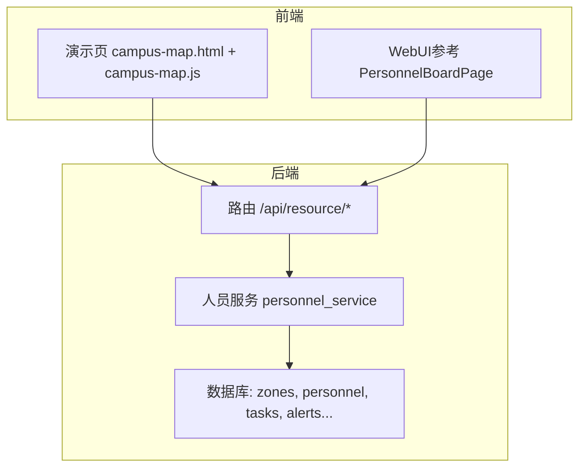
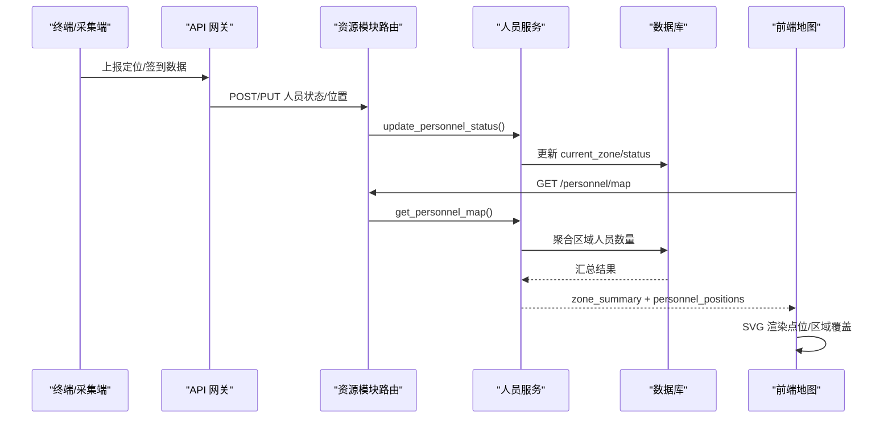
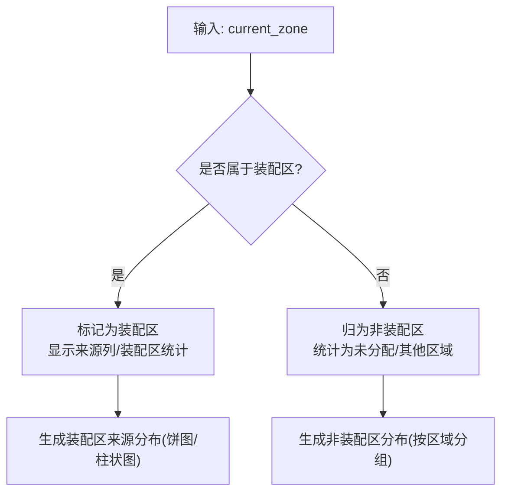
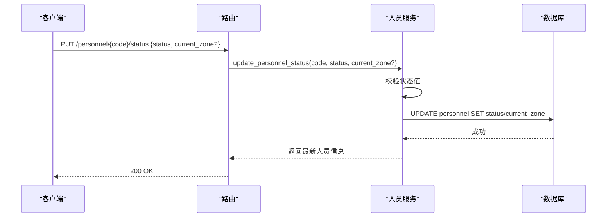
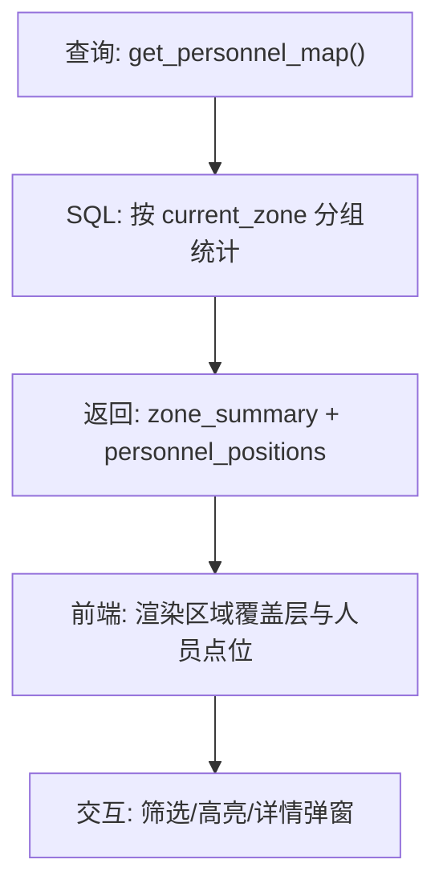
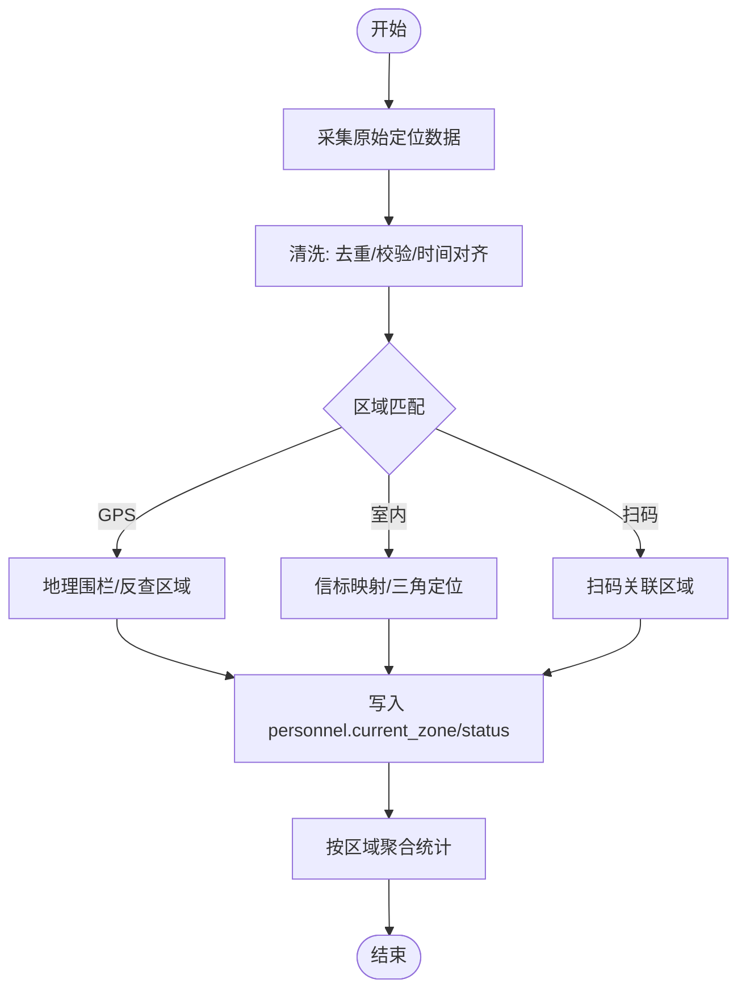
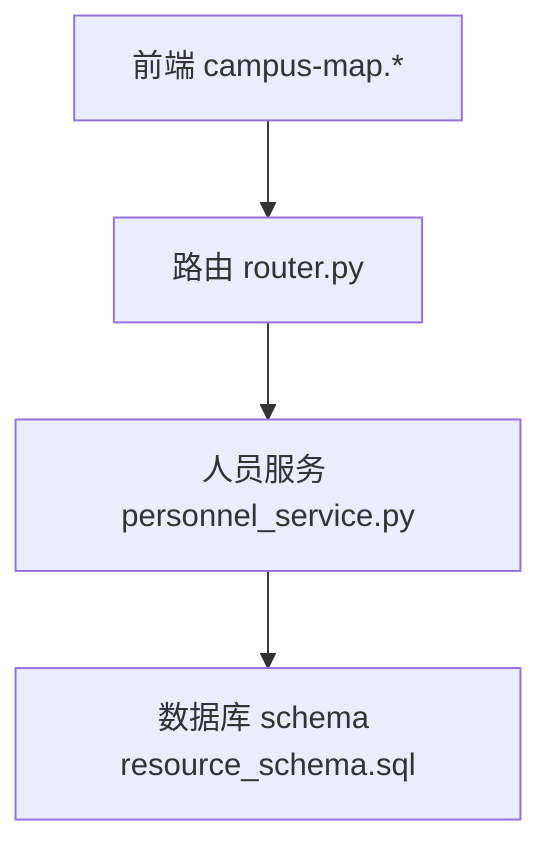

# 人员位置跟踪

<cite>
**本文引用的文件**
- [backend/modules/resource/services/personnel_service.py](file://backend/modules/resource/services/personnel_service.py)
- [backend/modules/resource/router.py](file://backend/modules/resource/router.py)
- [backend/sql/resource_schema.sql](file://backend/sql/resource_schema.sql)
- [backend/sql/resource_init_data.sql](file://backend/sql/resource_init_data.sql)
- [demo/assets/js/campus-map.js](file://demo/assets/js/campus-map.js)
- [demo/campus-map.html](file://demo/campus-map.html)
- [webui_ref/client/src/pages/PersonnelBoardPage/PersonnelBoardPage.tsx](file://webui_ref/client/src/pages/PersonnelBoardPage/PersonnelBoardPage.tsx)
</cite>

## 目录
1. [简介](#简介)
2. [项目结构](#项目结构)
3. [核心组件](#核心组件)
4. [架构总览](#架构总览)
5. [详细组件分析](#详细组件分析)
6. [依赖关系分析](#依赖关系分析)
7. [性能考虑](#性能考虑)
8. [故障排查指南](#故障排查指南)
9. [结论](#结论)
10. [附录](#附录)

## 简介
本文件围绕“人员位置跟踪”能力，系统梳理后端数据模型、区域管理、人员状态与位置聚合、前端可视化展示以及可扩展的实时更新方案。重点覆盖：
- 定位技术集成思路：GPS（室外）、室内定位（蓝牙/Wi-Fi/RFID）、签到打卡（二维码到件/扫码）等多源数据的融合与映射。
- 区域管理：装配区（SZA、SZB、SZC、LH）与非装配区的区分逻辑、区域编码映射、边界定义。
- 数据采集与处理：从采集、清洗、匹配到存储的完整链路。
- 实时更新机制：WebSocket推送、轮询更新、事件驱动等通信方式的选择与落地建议。
- 可视化方案：地图标记、热力图、轨迹回放等前端呈现。
- 隐私与安全：数据脱敏、访问权限控制、审计日志等安全机制。

## 项目结构
本项目在“试制资源数智化管理系统”中提供人员看板与园区地图能力，关键路径包括：
- 后端服务层：人员服务、路由接口、数据库表结构与初始化数据。
- 前端演示：SVG 车间平面图、设备与人员分布渲染、交互与筛选。
- WebUI参考：人员看板页面占位，便于后续扩展实时看板。

**图示来源**
- [backend/modules/resource/router.py:356-556](file://backend/modules/resource/router.py#L356-L556)
- [backend/modules/resource/services/personnel_service.py:24-124](file://backend/modules/resource/services/personnel_service.py#L24-L124)
- [backend/sql/resource_schema.sql:33-66](file://backend/sql/resource_schema.sql#L33-L66)
- [demo/campus-map.html:231-245](file://demo/campus-map.html#L231-L245)
- [demo/assets/js/campus-map.js:98-111](file://demo/assets/js/campus-map.js#L98-L111)

**章节来源**
- [backend/modules/resource/router.py:356-556](file://backend/modules/resource/router.py#L356-L556)
- [backend/modules/resource/services/personnel_service.py:24-124](file://backend/modules/resource/services/personnel_service.py#L24-L124)
- [backend/sql/resource_schema.sql:33-66](file://backend/sql/resource_schema.sql#L33-L66)
- [demo/campus-map.html:231-245](file://demo/campus-map.html#L231-L245)
- [demo/assets/js/campus-map.js:98-111](file://demo/assets/js/campus-map.js#L98-L111)

## 核心组件
- 人员服务层：提供人员列表、详情、统计、来源分布、地图覆盖层数据等能力；实现装配区/非装配区判断与统计。
- 路由层：暴露 REST 接口，如人员列表、状态更新、来源分布、地图数据等。
- 数据模型：zones、personnel、tasks、alerts 等表，支撑区域、人员、任务、预警等业务。
- 前端可视化：SVG 车间平面图，支持图层切换、状态筛选、区域高亮、人员详情弹窗等。

**章节来源**
- [backend/modules/resource/services/personnel_service.py:19-22](file://backend/modules/resource/services/personnel_service.py#L19-L22)
- [backend/modules/resource/services/personnel_service.py:325-474](file://backend/modules/resource/services/personnel_service.py#L325-L474)
- [backend/modules/resource/router.py:356-556](file://backend/modules/resource/router.py#L356-L556)
- [backend/sql/resource_schema.sql:33-66](file://backend/sql/resource_schema.sql#L33-L66)
- [demo/assets/js/campus-map.js:379-531](file://demo/assets/js/campus-map.js#L379-L531)

## 架构总览
人员位置跟踪的整体流程如下：
- 多源定位数据接入：GPS（室外）、室内定位（蓝牙/Wi-Fi/RFID）、签到打卡（二维码到件/扫码）。
- 数据清洗与匹配：将原始坐标或信标信号转换为区域编码（zone_code），并关联人员工号。
- 状态与位置更新：写入 personnel.current_zone 与 status，形成最新位置快照。
- 查询与聚合：后端按区域聚合人数、工作状态，供地图覆盖层与看板使用。
- 前端展示：SVG 地图渲染人员点位、区域占用、设备状态，支持筛选与交互。
- 实时更新：可选 WebSocket 推送或轮询刷新，结合事件驱动进行增量更新。

**图示来源**
- [backend/modules/resource/router.py:479-556](file://backend/modules/resource/router.py#L479-L556)
- [backend/modules/resource/services/personnel_service.py:286-323](file://backend/modules/resource/services/personnel_service.py#L286-L323)
- [backend/modules/resource/services/personnel_service.py:434-474](file://backend/modules/resource/services/personnel_service.py#L434-L474)
- [backend/sql/resource_schema.sql:50-66](file://backend/sql/resource_schema.sql#L50-L66)

## 详细组件分析

### 区域管理与装配区/非装配区逻辑
- 装配区集合：SZA、SZB、SZC、LH。用于显示“来源”列与装配区统计。
- 非装配区：不在上述集合的区域或空值，归类为“未分配”或其他区域。
- 区域表 zones：包含 zone_code、zone_name、zone_type、position_x/y、grid_columns/rows，用于地图布局与网格划分。
- 初始化数据：示例区域与设备、人员分布，便于演示与测试。

**图示来源**
- [backend/modules/resource/services/personnel_service.py:19-22](file://backend/modules/resource/services/personnel_service.py#L19-L22)
- [backend/modules/resource/services/personnel_service.py:382-431](file://backend/modules/resource/services/personnel_service.py#L382-L431)
- [backend/sql/resource_schema.sql:33-45](file://backend/sql/resource_schema.sql#L33-L45)
- [backend/sql/resource_init_data.sql:76-94](file://backend/sql/resource_init_data.sql#L76-L94)

**章节来源**
- [backend/modules/resource/services/personnel_service.py:19-22](file://backend/modules/resource/services/personnel_service.py#L19-L22)
- [backend/modules/resource/services/personnel_service.py:382-431](file://backend/modules/resource/services/personnel_service.py#L382-L431)
- [backend/sql/resource_schema.sql:33-45](file://backend/sql/resource_schema.sql#L33-L45)
- [backend/sql/resource_init_data.sql:76-94](file://backend/sql/resource_init_data.sql#L76-L94)

### 人员位置与状态更新
- 状态枚举：working、idle、offline。
- 位置字段：current_zone 指向 zones.zone_code。
- 更新接口：支持同时更新状态与所在区域。
- 校验：状态值合法性检查，不存在人员时抛出错误。

**图示来源**
- [backend/modules/resource/router.py:479-502](file://backend/modules/resource/router.py#L479-L502)
- [backend/modules/resource/services/personnel_service.py:286-323](file://backend/modules/resource/services/personnel_service.py#L286-L323)
- [backend/sql/resource_schema.sql:50-66](file://backend/sql/resource_schema.sql#L50-L66)

**章节来源**
- [backend/modules/resource/router.py:479-502](file://backend/modules/resource/router.py#L479-L502)
- [backend/modules/resource/services/personnel_service.py:286-323](file://backend/modules/resource/services/personnel_service.py#L286-L323)
- [backend/sql/resource_schema.sql:50-66](file://backend/sql/resource_schema.sql#L50-L66)

### 位置数据聚合与地图覆盖层
- 区域人员汇总：按 current_zone 分组统计 total_count、working_count、idle_count。
- 人员明细：按区域排序输出 personnel_code、name、avatar_text、department、status、current_zone。
- 前端渲染：SVG 地图根据 zone_summary 与 personnel_positions 绘制点位与区域覆盖。

**图示来源**
- [backend/modules/resource/services/personnel_service.py:434-474](file://backend/modules/resource/services/personnel_service.py#L434-L474)
- [demo/assets/js/campus-map.js:379-531](file://demo/assets/js/campus-map.js#L379-L531)
- [demo/campus-map.html:507-724](file://demo/campus-map.html#L507-L724)

**章节来源**
- [backend/modules/resource/services/personnel_service.py:434-474](file://backend/modules/resource/services/personnel_service.py#L434-L474)
- [demo/assets/js/campus-map.js:379-531](file://demo/assets/js/campus-map.js#L379-L531)
- [demo/campus-map.html:507-724](file://demo/campus-map.html#L507-L724)

### 前端可视化方案
- SVG 车间平面图：支持缩放、平移、图层控制（设备/人员）、状态筛选。
- 区域高亮与详情：点击区域高亮并展示设备与人员明细。
- 工具栏与图例：设备状态与人员状态图例，便于快速理解。
- 人员详情弹窗：鼠标悬停/点击显示姓名、区域、状态等信息。

**图示来源**
- [demo/assets/js/campus-map.js:98-111](file://demo/assets/js/campus-map.js#L98-L111)
- [demo/assets/js/campus-map.js:497-531](file://demo/assets/js/campus-map.js#L497-L531)
- [demo/campus-map.html:231-245](file://demo/campus-map.html#L231-L245)

**章节来源**
- [demo/assets/js/campus-map.js:98-111](file://demo/assets/js/campus-map.js#L98-L111)
- [demo/assets/js/campus-map.js:497-531](file://demo/assets/js/campus-map.js#L497-L531)
- [demo/campus-map.html:231-245](file://demo/campus-map.html#L231-L245)

### 多源定位技术集成与应用
- GPS 定位：适用于室外场景，通过经纬度反查或地理围栏判定所属区域（需在后端增加地理计算与区域匹配逻辑）。
- 室内定位：蓝牙/Wi-Fi/RFID 信标信号强度或三角定位，映射到 zone_code（需在采集端完成信号解析与区域绑定）。
- 签到打卡：二维码到件/扫码触发人员签到，关联当前区域与任务（可复用现有 QR 到件模块思路，扩展至人员签到）。
- 数据融合：统一转换为 {personnel_code, current_zone, status, timestamp}，写入 personnel 表，作为位置跟踪基础。

[本节为概念性说明，不直接分析具体代码文件]

### 位置数据清洗与匹配流程
- 采集：终端上报原始定位数据（GPS/信标/扫码）。
- 清洗：去重、时间戳校正、无效数据过滤。
- 匹配：将原始数据映射为 zone_code（地理围栏/信标映射/扫码区域）。
- 存储：更新 personnel.current_zone 与 status，记录 last_update_time。
- 聚合：按区域统计人数与工作/空闲状态，供前端展示。

[本节为概念性流程图，不直接对应具体代码文件]

### 实时更新机制选择与实现
- 轮询更新：前端定时调用 /personnel/map 获取最新数据，简单可靠，适合低频次更新。
- WebSocket 推送：服务端维护连接，变更时主动推送，降低带宽与延迟，适合高频实时场景。
- 事件驱动：基于消息队列或事件总线，当人员状态/位置变化时触发更新，解耦采集与展示。
- 推荐策略：默认采用轮询（已具备接口），逐步引入 WebSocket 与事件驱动以提升实时性与扩展性。

[本节为概念性说明，不直接分析具体代码文件]

### 位置隐私保护与安全控制
- 数据脱敏：对外展示时隐藏敏感字段（如姓名、工号），仅显示必要信息（头像文字、状态）。
- 访问权限控制：对人员位置相关接口实施鉴权与授权，限制越权访问。
- 审计日志：记录关键操作的审计信息（创建/更新/删除），便于追溯与合规。
- 传输安全：HTTPS 加密传输，防止中间人攻击。

[本节为概念性说明，不直接分析具体代码文件]

## 依赖关系分析
- 路由依赖服务：人员路由调用 personnel_service 中的方法。
- 服务依赖数据库：通过 SQL 查询与更新 personnel、zones、tasks 等表。
- 前端依赖后端接口：campus-map.html 与 campus-map.js 调用 /api/resource/* 接口获取数据。

**图示来源**
- [backend/modules/resource/router.py:356-556](file://backend/modules/resource/router.py#L356-L556)
- [backend/modules/resource/services/personnel_service.py:24-124](file://backend/modules/resource/services/personnel_service.py#L24-L124)
- [backend/sql/resource_schema.sql:33-66](file://backend/sql/resource_schema.sql#L33-L66)
- [demo/campus-map.html:231-245](file://demo/campus-map.html#L231-L245)

**章节来源**
- [backend/modules/resource/router.py:356-556](file://backend/modules/resource/router.py#L356-L556)
- [backend/modules/resource/services/personnel_service.py:24-124](file://backend/modules/resource/services/personnel_service.py#L24-L124)
- [backend/sql/resource_schema.sql:33-66](file://backend/sql/resource_schema.sql#L33-L66)
- [demo/campus-map.html:231-245](file://demo/campus-map.html#L231-L245)

## 性能考虑
- 数据库索引：personnel 表对 status、current_zone、department 建立索引，提升查询效率。
- 聚合查询优化：按区域分组统计减少前端计算负担。
- 前端渲染优化：SVG 图层控制与筛选减少重绘范围。
- 缓存策略：对热点数据（如区域汇总）引入缓存层，降低数据库压力。
- 批量更新：对大量人员状态更新采用批量写入，减少事务开销。

[本节提供通用指导，不直接分析具体代码文件]

## 故障排查指南
- 人员不存在：更新状态时若工号不存在，会抛出异常，需检查入参与数据一致性。
- 状态值非法：传入的状态不在允许范围内，需修正为 working/idle/offline。
- 区域为空：current_zone 为空时归类为“未分配”，需确认定位数据是否正确映射。
- 前端渲染异常：检查接口返回数据结构是否符合预期，确保 zone_summary 与 personnel_positions 存在。

**章节来源**
- [backend/modules/resource/services/personnel_service.py:286-323](file://backend/modules/resource/services/personnel_service.py#L286-L323)
- [backend/modules/resource/services/personnel_service.py:434-474](file://backend/modules/resource/services/personnel_service.py#L434-L474)

## 结论
本项目已具备人员位置跟踪的基础能力：区域管理、人员状态与位置更新、地图可视化展示。下一步可重点完善：
- 多源定位接入与区域匹配算法。
- 实时更新机制（WebSocket/事件驱动）。
- 隐私与安全控制（脱敏、鉴权、审计）。
- 性能优化（缓存、批量更新、索引优化）。

[本节总结性内容，不直接分析具体代码文件]

## 附录
- 人员看板页面占位：便于后续扩展实时看板功能。
- 二维码到件模块：可借鉴其接口设计，扩展人员签到打卡能力。

**章节来源**
- [webui_ref/client/src/pages/PersonnelBoardPage/PersonnelBoardPage.tsx:1-16](file://webui_ref/client/src/pages/PersonnelBoardPage/PersonnelBoardPage.tsx#L1-L16)