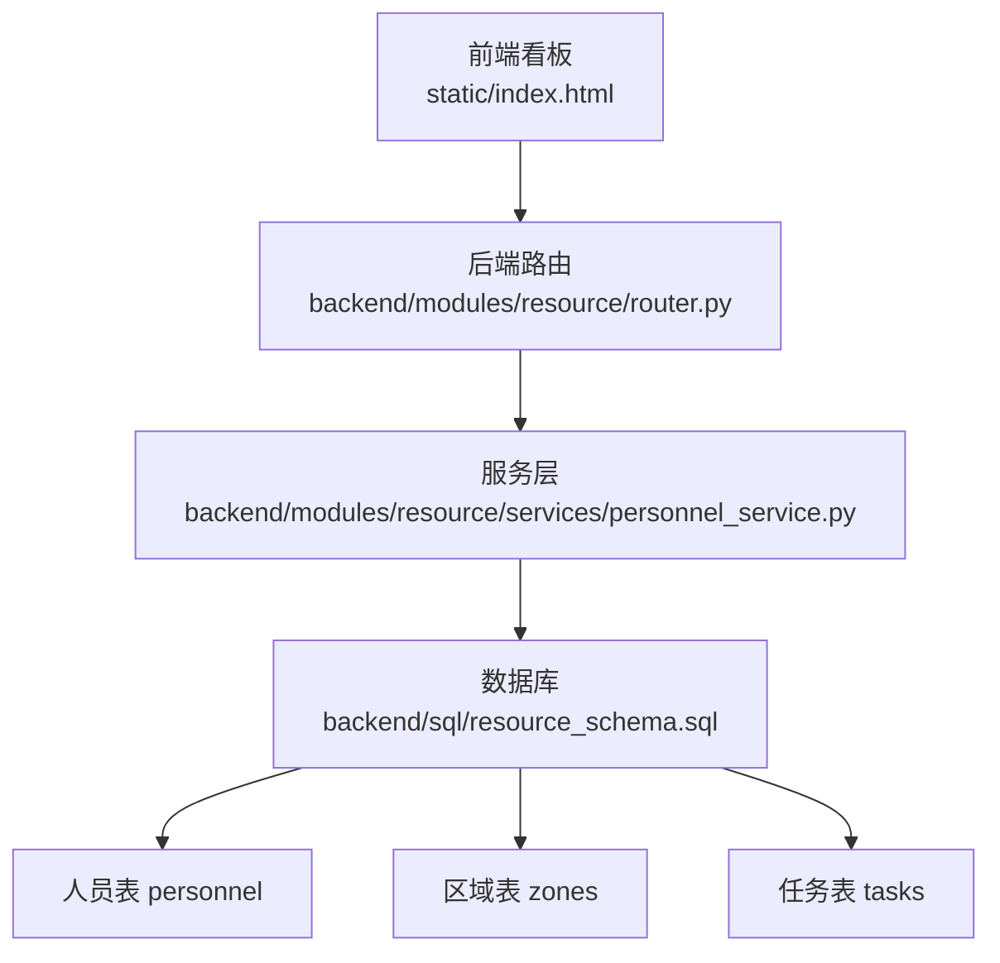
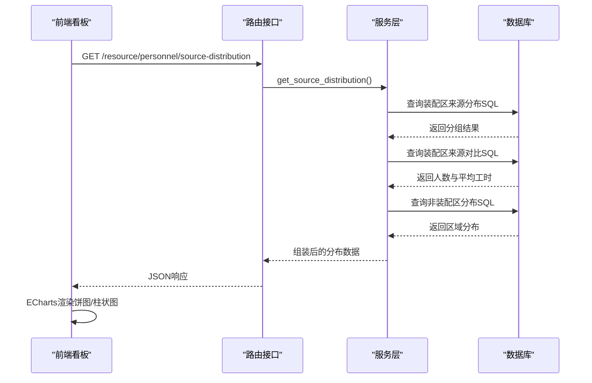
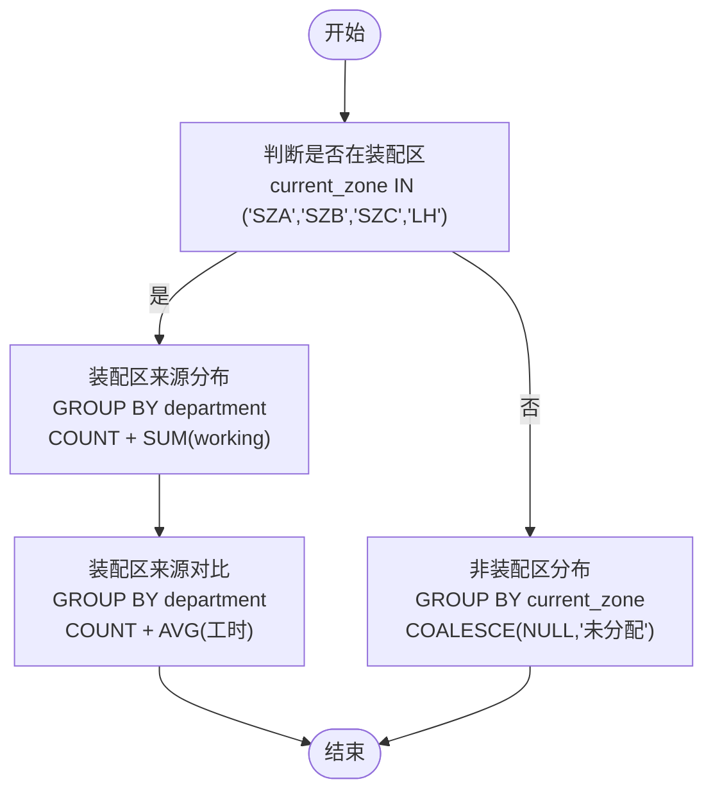
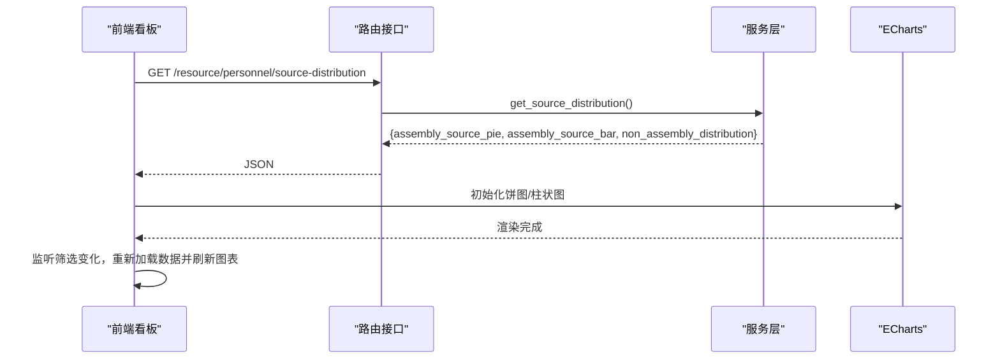
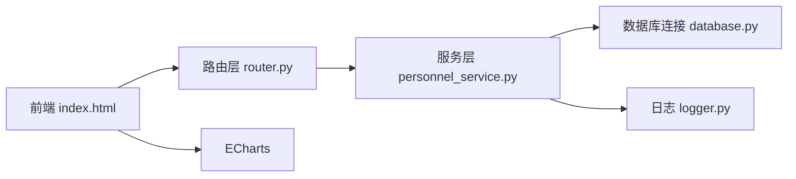

# 人员来源分析

<cite>
**本文引用的文件**
- [personnel_service.py](file://backend/modules/resource/services/personnel_service.py)
- [router.py](file://backend/modules/resource/router.py)
- [resource_schema.sql](file://backend/sql/resource_schema.sql)
- [resource_init_data.sql](file://backend/sql/resource_init_data.sql)
- [index.html](file://static/index.html)
- [需求文档_V6_试制资源数智化管理系统.md](file://需求文档_V6_试制资源数智化管理系统.md)
</cite>

## 目录
1. [简介](#简介)
2. [项目结构](#项目结构)
3. [核心组件](#核心组件)
4. [架构总览](#架构总览)
5. [详细组件分析](#详细组件分析)
6. [依赖关系分析](#依赖关系分析)
7. [性能考虑](#性能考虑)
8. [故障排查指南](#故障排查指南)
9. [结论](#结论)
10. [附录](#附录)

## 简介
本文件围绕“人员来源分析”功能，系统化阐述以下方面：
- 7种人员来源类型的定义与业务含义：自有、商用车、乘用车、柳汽、中智、外协、内调。
- 装配区与非装配区的来源分布统计逻辑：数据来源SQL、分组聚合算法、统计指标计算。
- 可视化展示的数据准备与渲染：饼图（装配区来源占比）、柱状图（按来源的人数与平均工时）。
- 数据维护与更新机制：人员来源变更处理、历史数据追溯、一致性保证。
- 扩展开发指南：新增来源类型、自定义统计维度、导出分析报告等高级能力。
- 数据来源的验证与校验机制：确保人员来源数据的准确性与完整性。

## 项目结构
该功能涉及后端服务层、路由接口、数据库表结构与前端看板渲染四部分：
- 后端服务层：负责人员CRUD、来源分布统计、区域分布统计等。
- 路由层：暴露REST接口供前端调用。
- 数据库：人员表、区域表、任务表等，支撑筛选与聚合。
- 前端看板：ECharts图表渲染装配区来源分布（饼图）与对比（柱状图），并提供筛选与列表展示。

**图示来源**
- [router.py:522-556](file://backend/modules/resource/router.py#L522-L556)
- [personnel_service.py:382-431](file://backend/modules/resource/services/personnel_service.py#L382-L431)
- [resource_schema.sql:47-66](file://backend/sql/resource_schema.sql#L47-L66)

**章节来源**
- [router.py:522-556](file://backend/modules/resource/router.py#L522-L556)
- [personnel_service.py:1-22](file://backend/modules/resource/services/personnel_service.py#L1-L22)
- [resource_schema.sql:47-66](file://backend/sql/resource_schema.sql#L47-L66)

## 核心组件
- 人员来源常量与装配区判定：
  - 有效来源集合：自有、商用车、乘用车、柳汽、中智、外协、内调。
  - 装配区集合：SZA、SZB、SZC、LH。用于决定在列表中是否显示“来源”列以及统计范围。
- 人员列表查询：支持状态、区域、来源、关键词筛选与分页；自动标记是否为装配区。
- 来源分布统计：
  - 装配区来源分布（饼图）：按department分组计数，并统计working人数。
  - 装配区来源对比（柱状图）：按department分组统计人数与平均工时。
  - 非装配区分布：统计不在装配区的人员区域分布。
- 地图覆盖层数据：各区域人员数量及明细，便于园区地图展示。

**章节来源**
- [personnel_service.py:12-22](file://backend/modules/resource/services/personnel_service.py#L12-L22)
- [personnel_service.py:24-124](file://backend/modules/resource/services/personnel_service.py#L24-L124)
- [personnel_service.py:382-431](file://backend/modules/resource/services/personnel_service.py#L382-L431)

## 架构总览
人员来源分析的端到端流程如下：
- 前端加载看板时并行请求KPI、来源分布与人员列表。
- 路由将请求转发至服务层进行数据聚合。
- 服务层通过SQL对人员表进行分组聚合，返回结构化数据。
- 前端使用ECharts渲染饼图与柱状图，并提供筛选与交互。

**图示来源**
- [router.py:522-556](file://backend/modules/resource/router.py#L522-L556)
- [personnel_service.py:382-431](file://backend/modules/resource/services/personnel_service.py#L382-L431)
- [index.html:8039-8128](file://static/index.html#L8039-L8128)

## 详细组件分析

### 人员来源类型定义与业务含义
- 自有：企业内部直接雇佣的员工，通常承担核心装配与调试任务。
- 商用车：来自商用车业务线或供应商团队，参与商用车相关装配。
- 乘用车：来自乘用车业务线或供应商团队，参与乘用车相关装配。
- 柳汽：外部合作单位（如柳州汽车相关合作方）提供的人员。
- 中智：人力资源外包公司（如中智）派遣人员。
- 外协：外部协作单位或第三方外包团队。
- 内调：公司内部跨部门或跨厂区调动人员。

这些来源类型在后端作为枚举值进行校验，并在前端下拉选项中提供筛选。

**章节来源**
- [personnel_service.py:15-16](file://backend/modules/resource/services/personnel_service.py#L15-L16)
- [index.html:3172-3182](file://static/index.html#L3172-L3182)
- [需求文档_V6_试制资源数智化管理系统.md:429-435](file://需求文档_V6_试制资源数智化管理系统.md#L429-L435)

### 装配区与非装配区的来源分布统计逻辑
- 装配区判定：当前所在区域编码属于{SZA, SZB, SZC, LH}即视为装配区。
- 装配区来源分布（饼图）：
  - SQL按department分组计数，同时统计working人数。
  - 空来源统一归类为“未标注”。
- 装配区来源对比（柱状图）：
  - SQL按department分组统计人数与平均工时（工作中按8小时计，空闲/离线按0小时计）。
- 非装配区分布：
  - 统计current_zone为空或非装配区的人员区域分布，空区域归为“未分配”。

**图示来源**
- [personnel_service.py:382-431](file://backend/modules/resource/services/personnel_service.py#L382-L431)

**章节来源**
- [personnel_service.py:19-22](file://backend/modules/resource/services/personnel_service.py#L19-L22)
- [personnel_service.py:382-431](file://backend/modules/resource/services/personnel_service.py#L382-L431)

### 数据来源SQL查询与分组聚合算法
- 装配区来源分布SQL：
  - 过滤条件：current_zone IN ('SZA','SZB','SZC','LH')
  - 分组字段：department（空值替换为“未标注”）
  - 指标：count、working_count（status='working'）
- 装配区来源对比SQL：
  - 分组字段：department（空值替换为“未标注”）
  - 指标：personnel_count、avg_hours（工作中=8小时，否则=0小时）
- 非装配区分布SQL：
  - 过滤条件：current_zone IS NULL OR NOT IN ('SZA','SZB','SZC','LH')
  - 分组字段：current_zone（空值替换为“未分配”）
  - 指标：count

上述SQL在服务层函数中实现，并通过数据库连接执行。

**章节来源**
- [personnel_service.py:382-431](file://backend/modules/resource/services/personnel_service.py#L382-L431)

### 可视化展示的数据准备与渲染逻辑
- 前端入口：
  - 页面初始化时并行加载KPI、来源分布与人员列表。
  - 若后端不可用，则回退到Mock数据。
- 饼图（装配区来源占比）：
  - 数据源：assembly_source_pie（name, value）
  - 配置：环形饼图，标签显示名称与百分比，颜色映射来源类型。
- 柱状图（来源人员对比）：
  - 数据源：assembly_source_bar（source, personnel_count, avg_hours）
  - 配置：双轴（人数柱状+平均工时折线），图例区分系列。
- 交互：
  - 支持来源筛选下拉框，联动刷新列表与图表。
  - 图表自适应resize，避免布局错乱。

**图示来源**
- [index.html:7991-8005](file://static/index.html#L7991-L8005)
- [index.html:8039-8128](file://static/index.html#L8039-L8128)
- [router.py:522-556](file://backend/modules/resource/router.py#L522-L556)

**章节来源**
- [index.html:7960-8200](file://static/index.html#L7960-L8200)

### 来源数据的维护与更新机制
- 新增人员：
  - 校验工号唯一性。
  - 校验来源合法性（必须在VALID_SOURCES集合中）。
  - 默认头像文字取姓名首字。
  - 插入后返回新记录。
- 更新人员：
  - 校验人员存在性。
  - 校验来源与状态合法性。
  - 动态构建UPDATE语句，仅更新非空字段。
- 删除人员：
  - 校验存在性后删除。
- 状态更新：
  - 支持同时更新状态与所在区域。
- 历史数据追溯：
  - 人员表包含entry_time、last_update_time、created_at等时间戳字段，便于审计与回溯。
- 数据一致性保证：
  - 通过数据库索引（如idx_personnel_department、idx_personnel_status、idx_personnel_zone）提升查询一致性与性能。
  - 前端与后端均对来源进行校验，防止非法值入库。

**章节来源**
- [personnel_service.py:170-213](file://backend/modules/resource/services/personnel_service.py#L170-L213)
- [personnel_service.py:215-261](file://backend/modules/resource/services/personnel_service.py#L215-L261)
- [personnel_service.py:263-283](file://backend/modules/resource/services/personnel_service.py#L263-L283)
- [personnel_service.py:286-323](file://backend/modules/resource/services/personnel_service.py#L286-L323)
- [resource_schema.sql:47-66](file://backend/sql/resource_schema.sql#L47-L66)

### 数据来源的验证与校验机制
- 后端校验：
  - 新增/更新时检查department是否在VALID_SOURCES集合中。
  - 状态值限制为working/idle/offline。
- 前端校验：
  - 下拉选项限定为7种来源类型。
  - 筛选器联动刷新，避免无效数据进入列表。
- 数据质量：
  - 空来源统一归类为“未标注”，避免统计缺失。
  - 非装配区空区域归类为“未分配”，保证分布完整。

**章节来源**
- [personnel_service.py:186-189](file://backend/modules/resource/services/personnel_service.py#L186-L189)
- [personnel_service.py:231-239](file://backend/modules/resource/services/personnel_service.py#L231-L239)
- [index.html:3172-3182](file://static/index.html#L3172-L3182)

### 扩展开发指南
- 新增来源类型：
  - 在VALID_SOURCES中添加新来源。
  - 在前端下拉选项与颜色映射中补充对应项。
  - 如需保留历史数据，建议在迁移脚本中清理或映射旧值。
- 自定义统计维度：
  - 在服务层新增聚合函数，例如按项目群、车型、任务类型等维度分组。
  - 在路由层暴露新接口，前端增加图表与筛选控件。
- 导出分析报告：
  - 后端可新增导出接口，返回CSV/Excel格式的来源分布与明细。
  - 前端可增加“导出报表”按钮，调用后端接口下载文件。
- 历史数据追溯：
  - 利用人员表的时间戳字段，结合任务与效率统计表，构建历史趋势分析。
  - 可在服务层增加按日期范围聚合的接口，前端以折线图展示趋势。

[本节为概念性指导，不直接分析具体文件]

## 依赖关系分析
- 服务层依赖：
  - 数据库连接模块（query_all、query_one、execute、execute_last_id）。
  - 日志模块（logger）。
- 路由层依赖：
  - FastAPI路由框架。
  - 服务层函数导入。
- 前端依赖：
  - ECharts库用于图表渲染。
  - Mock数据用于后端不可用时的回退。

**图示来源**
- [router.py:522-556](file://backend/modules/resource/router.py#L522-L556)
- [personnel_service.py:1-10](file://backend/modules/resource/services/personnel_service.py#L1-L10)
- [index.html:7960-8200](file://static/index.html#L7960-L8200)

**章节来源**
- [router.py:522-556](file://backend/modules/resource/router.py#L522-L556)
- [personnel_service.py:1-10](file://backend/modules/resource/services/personnel_service.py#L1-L10)
- [index.html:7960-8200](file://static/index.html#L7960-L8200)

## 性能考虑
- SQL优化：
  - 使用索引字段进行过滤与分组（如current_zone、department、status）。
  - 避免全表扫描，合理设置WHERE条件。
- 前端渲染：
  - 图表实例复用与dispose，避免内存泄漏。
  - 异步并行加载KPI、分布与列表，缩短首屏时间。
- 数据量增长：
  - 分页查询控制单次返回数据量。
  - 对热点查询（如装配区来源分布）可考虑缓存策略（如Redis）。

[本节提供通用性能建议，不直接分析具体文件]

## 故障排查指南
- 常见问题：
  - 来源校验失败：检查VALID_SOURCES集合与前端下拉选项是否一致。
  - 图表无数据：确认后端接口返回数据结构是否正确，前端是否有回退逻辑。
  - 区域分布异常：检查current_zone字段是否填写正确，装配区集合是否更新。
- 日志定位：
  - 查看服务层日志输出，确认SQL执行与数据转换过程。
  - 前端控制台检查网络请求与ECharts初始化错误。
- 数据一致性：
  - 核对数据库索引与约束，确保唯一性与完整性。
  - 使用示例数据验证功能链路。

**章节来源**
- [personnel_service.py:186-189](file://backend/modules/resource/services/personnel_service.py#L186-L189)
- [index.html:8039-8128](file://static/index.html#L8039-L8128)
- [resource_schema.sql:47-66](file://backend/sql/resource_schema.sql#L47-L66)

## 结论
人员来源分析功能通过明确的后端聚合逻辑与前端可视化展示，实现了装配区与非装配区的来源分布统计。其设计具备良好扩展性，支持新增来源类型、自定义统计维度与导出报告等高级能力。通过严格的校验机制与时间戳追溯，确保了数据的准确性与可审计性。

[本节为总结性内容，不直接分析具体文件]

## 附录
- 示例数据：
  - 初始化人员数据包含7种来源类型，覆盖装配区与非装配区场景。
- 参考需求：
  - 分组维度说明中包含人员来源维度的新增与适用范围。

**章节来源**
- [resource_init_data.sql:76-94](file://backend/sql/resource_init_data.sql#L76-L94)
- [需求文档_V6_试制资源数智化管理系统.md:429-435](file://需求文档_V6_试制资源数智化管理系统.md#L429-L435)