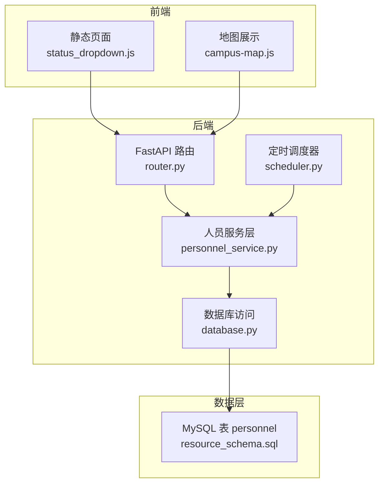
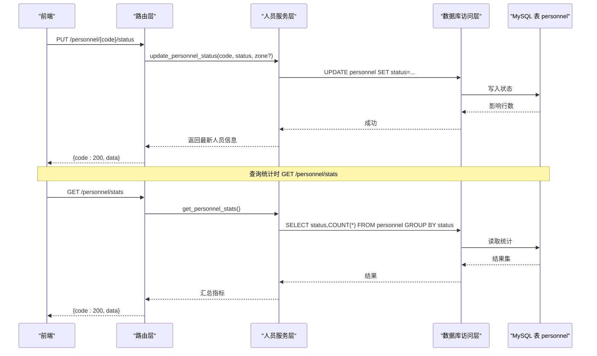
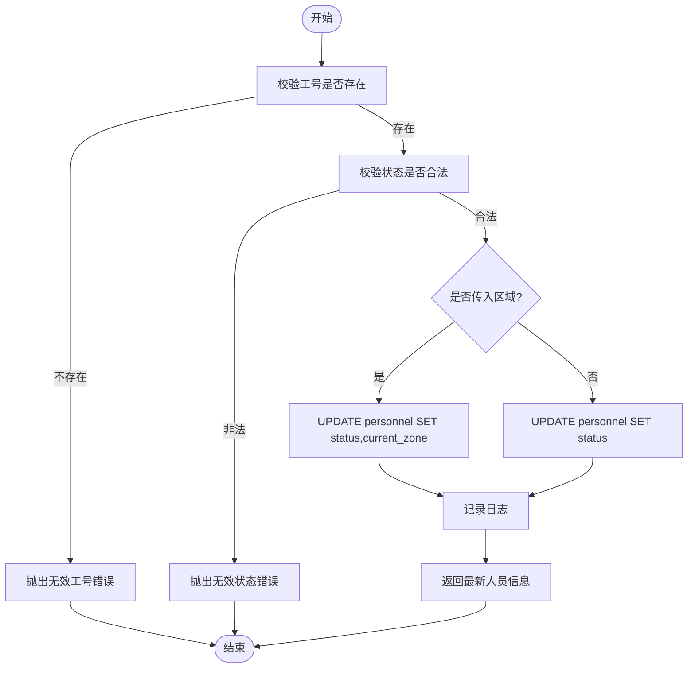
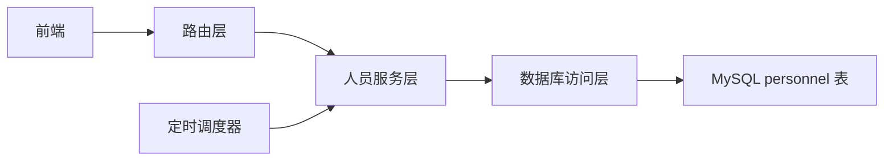

# 人员状态监控

<cite>
**本文引用的文件**
- [backend/modules/resource/services/personnel_service.py](file://backend/modules/resource/services/personnel_service.py)
- [backend/modules/resource/router.py](file://backend/modules/resource/router.py)
- [backend/sql/resource_schema.sql](file://backend/sql/resource_schema.sql)
- [backend/database.py](file://backend/database.py)
- [backend/scheduling/scheduler.py](file://backend/scheduling/scheduler.py)
- [static/status_dropdown.js](file://static/status_dropdown.js)
- [demo/assets/js/campus-map.js](file://demo/assets/js/campus-map.js)
</cite>

## 目录
1. [简介](#简介)
2. [项目结构](#项目结构)
3. [核心组件](#核心组件)
4. [架构总览](#架构总览)
5. [详细组件分析](#详细组件分析)
6. [依赖关系分析](#依赖关系分析)
7. [性能考虑](#性能考虑)
8. [故障排查指南](#故障排查指南)
9. [结论](#结论)
10. [附录：API 接口文档](#附录api-接口文档)

## 简介
本文件围绕“人员状态监控”能力，系统化说明人员在线/离线、工作中/空闲等状态的实时检测与更新机制。内容涵盖：
- 状态定义与转换规则（working/idle/offline）
- 状态持久化存储模型
- 状态更新触发条件（签到打卡、任务分配、超时检测等场景）
- 数据采集方式（前端交互、后端定时扫描、事件驱动更新）
- 状态统计指标（在岗人数、空闲可调配人员识别、异常预警）
- API 接口说明（查询、更新、批量操作）
- 性能优化策略（连接池、增量更新、缓存建议）

## 项目结构
与人员状态监控直接相关的代码集中在资源模块的人员服务层与路由层，数据模型在 SQL 脚本中定义，数据库访问通过连接池封装；调度器提供后台定时执行能力；前端静态页面包含状态展示与交互逻辑。

**图表来源**
- [backend/modules/resource/router.py:479-519](file://backend/modules/resource/router.py#L479-L519)
- [backend/modules/resource/services/personnel_service.py:24-124](file://backend/modules/resource/services/personnel_service.py#L24-L124)
- [backend/database.py:12-43](file://backend/database.py#L12-L43)
- [backend/sql/resource_schema.sql:47-66](file://backend/sql/resource_schema.sql#L47-L66)
- [backend/scheduling/scheduler.py:93-153](file://backend/scheduling/scheduler.py#L93-L153)
- [static/status_dropdown.js:26-107](file://static/status_dropdown.js#L26-L107)
- [demo/assets/js/campus-map.js:303-337](file://demo/assets/js/campus-map.js#L303-L337)

**章节来源**
- [backend/modules/resource/services/personnel_service.py:24-124](file://backend/modules/resource/services/personnel_service.py#L24-L124)
- [backend/modules/resource/router.py:479-519](file://backend/modules/resource/router.py#L479-L519)
- [backend/sql/resource_schema.sql:47-66](file://backend/sql/resource_schema.sql#L47-L66)
- [backend/database.py:12-43](file://backend/database.py#L12-L43)
- [backend/scheduling/scheduler.py:93-153](file://backend/scheduling/scheduler.py#L93-L153)
- [static/status_dropdown.js:26-107](file://static/status_dropdown.js#L26-L107)
- [demo/assets/js/campus-map.js:303-337](file://demo/assets/js/campus-map.js#L303-L337)

## 核心组件
- 人员服务层：负责人员列表、详情、状态更新、统计、来源分布、位置分布等业务逻辑。
- 路由层：暴露 RESTful 接口，接收请求并调用服务层处理。
- 数据模型：人员表 personnel 定义状态字段及索引，支撑高效查询与统计。
- 数据库访问：基于连接池的查询与写操作封装，保证并发安全与资源复用。
- 定时调度器：后台线程按配置周期执行自动同步任务，可用于后续扩展状态巡检与超时检测。
- 前端交互：状态下拉菜单与地图展示，用于快速切换状态与可视化呈现。

**章节来源**
- [backend/modules/resource/services/personnel_service.py:286-379](file://backend/modules/resource/services/personnel_service.py#L286-L379)
- [backend/modules/resource/router.py:479-519](file://backend/modules/resource/router.py#L479-L519)
- [backend/sql/resource_schema.sql:47-66](file://backend/sql/resource_schema.sql#L47-L66)
- [backend/database.py:51-116](file://backend/database.py#L51-L116)
- [backend/scheduling/scheduler.py:93-153](file://backend/scheduling/scheduler.py#L93-L153)
- [static/status_dropdown.js:26-107](file://static/status_dropdown.js#L26-L107)

## 架构总览
人员状态监控的整体流程如下：
- 前端通过状态下拉菜单或地图筛选触发状态变更或查询。
- 后端路由接收请求，校验参数后调用人员服务层进行状态更新或统计计算。
- 服务层通过数据库访问层执行 SQL，读写 personnel 表。
- 定时调度器可在后台周期性执行自动任务（如增量同步），为后续状态巡检与超时检测提供基础。

**图表来源**
- [backend/modules/resource/router.py:479-519](file://backend/modules/resource/router.py#L479-L519)
- [backend/modules/resource/services/personnel_service.py:286-379](file://backend/modules/resource/services/personnel_service.py#L286-L379)
- [backend/database.py:51-116](file://backend/database.py#L51-L116)
- [backend/sql/resource_schema.sql:47-66](file://backend/sql/resource_schema.sql#L47-L66)

## 详细组件分析

### 人员服务层（personnel_service.py）
- 人员列表与详情：支持分页、筛选（状态、区域、部门）、关键词搜索，并在结果中附加装配区标记与今日工时估算。
- 状态更新：校验工号存在性与状态合法性，支持同时更新当前区域；记录日志并返回最新人员信息。
- 统计指标：按状态分组计数，计算在岗人数（working+idle）、空闲可调配（idle）、异常（offline）；并按区域统计分布。
- 来源分布与位置分布：为看板与地图提供数据支撑。

**图表来源**
- [backend/modules/resource/services/personnel_service.py:286-322](file://backend/modules/resource/services/personnel_service.py#L286-L322)

**章节来源**
- [backend/modules/resource/services/personnel_service.py:24-124](file://backend/modules/resource/services/personnel_service.py#L24-L124)
- [backend/modules/resource/services/personnel_service.py:286-379](file://backend/modules/resource/services/personnel_service.py#L286-L379)

### 路由层（router.py）
- 状态更新接口：PUT /personnel/{personnel_code}/status，接收状态与可选区域，调用服务层更新并返回统一响应格式。
- 统计接口：GET /personnel/stats，返回人员总数、在岗、工作中、空闲、离线等指标。
- 其他接口：来源分布、位置分布、人效分析（占位实现）。

**章节来源**
- [backend/modules/resource/router.py:479-519](file://backend/modules/resource/router.py#L479-L519)
- [backend/modules/resource/router.py:522-578](file://backend/modules/resource/router.py#L522-L578)

### 数据模型（resource_schema.sql）
- 人员表 personnel：包含状态枚举 working/idle/offline、当前区域、当前任务、上班时间、更新时间等字段；对状态、区域、部门建立索引以优化查询与统计。
- 任务表 tasks：与人员当前任务关联，用于详情与看板展示。
- 预警表 alerts：为异常预警提供结构化存储（可扩展至人员离线超时等场景）。
- 效率统计表 personnel_efficiency：用于历史效率统计（可结合状态与任务产出）。

**章节来源**
- [backend/sql/resource_schema.sql:47-66](file://backend/sql/resource_schema.sql#L47-L66)
- [backend/sql/resource_schema.sql:68-109](file://backend/sql/resource_schema.sql#L68-L109)
- [backend/sql/resource_schema.sql:111-163](file://backend/sql/resource_schema.sql#L111-L163)
- [backend/sql/resource_schema.sql:165-181](file://backend/sql/resource_schema.sql#L165-L181)

### 数据库访问（database.py）
- 连接池：使用 PooledDB 管理 MySQL 连接，避免频繁创建销毁连接带来的开销。
- 查询与写操作：提供 query_all/query_one/execute/execute_last_id/execute_all 等方法，统一事务提交与回滚。
- 错误提示：初始化失败时输出明确配置提示，便于定位环境问题。

**章节来源**
- [backend/database.py:12-43](file://backend/database.py#L12-L43)
- [backend/database.py:51-116](file://backend/database.py#L51-L116)

### 定时调度器（scheduler.py）
- 后台线程：独立运行，按配置间隔循环检查并执行自动增量同步。
- 暂停/恢复：支持手动暂停与恢复，避免与手动任务冲突。
- 配置读取：从系统配置读取爬虫模式与间隔，动态调整执行频率。
- 扩展点：可在此处接入人员状态巡检与超时检测逻辑（例如扫描长时间 offline 的人员并生成预警）。

**章节来源**
- [backend/scheduling/scheduler.py:16-74](file://backend/scheduling/scheduler.py#L16-L74)
- [backend/scheduling/scheduler.py:93-153](file://backend/scheduling/scheduler.py#L93-L153)
- [backend/scheduling/scheduler.py:155-193](file://backend/scheduling/scheduler.py#L155-L193)

### 前端交互（status_dropdown.js、campus-map.js）
- 状态下拉菜单：点击展开下拉选项，选择新状态后发起 PUT 请求更新状态，并即时刷新 UI。
- 地图展示：根据人员状态过滤显示，支持按状态筛选（全部/工作中/空闲），并以图标形式展示状态。

**章节来源**
- [static/status_dropdown.js:26-107](file://static/status_dropdown.js#L26-L107)
- [demo/assets/js/campus-map.js:303-337](file://demo/assets/js/campus-map.js#L303-L337)

## 依赖关系分析
- 路由层依赖人员服务层，服务层依赖数据库访问层，最终操作 MySQL 表 personnel。
- 定时调度器与服务层解耦，可通过服务层方法扩展状态巡检与预警。
- 前端与路由层通过 HTTP 接口交互，不直接访问数据库。

**图表来源**
- [backend/modules/resource/router.py:479-519](file://backend/modules/resource/router.py#L479-L519)
- [backend/modules/resource/services/personnel_service.py:286-379](file://backend/modules/resource/services/personnel_service.py#L286-L379)
- [backend/database.py:51-116](file://backend/database.py#L51-L116)
- [backend/scheduling/scheduler.py:93-153](file://backend/scheduling/scheduler.py#L93-L153)

**章节来源**
- [backend/modules/resource/router.py:479-519](file://backend/modules/resource/router.py#L479-L519)
- [backend/modules/resource/services/personnel_service.py:286-379](file://backend/modules/resource/services/personnel_service.py#L286-L379)
- [backend/database.py:51-116](file://backend/database.py#L51-L116)
- [backend/scheduling/scheduler.py:93-153](file://backend/scheduling/scheduler.py#L93-L153)

## 性能考虑
- 连接池管理：使用 PooledDB 控制最大连接数与缓存连接，减少连接创建开销，提升并发处理能力。
- 索引优化：对 personnel.status、current_zone、department 建立索引，加速筛选与统计查询。
- 增量更新：调度器支持增量同步模式，可结合业务扩展为增量状态巡检，降低全量扫描成本。
- 缓存建议：
  - 统计接口可引入短期内存缓存（如 Redis），降低高频查询对数据库的压力。
  - 前端可对状态列表做本地缓存与增量刷新，减少重复请求。
- 批处理：批量更新人员状态时使用 executemany，减少往返次数。

[本节为通用性能建议，不直接分析具体文件]

## 故障排查指南
- 数据库连接失败：检查 .env 中的 DB_HOST/DB_PORT/DB_USER/DB_PASSWORD/DB_DATABASE 配置是否正确；查看日志中的连接池初始化错误提示。
- 状态更新失败：确认工号存在且状态值合法（working/idle/offline）；检查路由参数与服务层校验逻辑。
- 统计结果为空：确认 personnel 表有数据且状态字段已正确设置；检查 SQL 查询与索引使用情况。
- 调度器未执行：确认调度器处于运行状态且未暂停；检查配置模式是否为 auto；查看日志中自动同步执行结果。

**章节来源**
- [backend/database.py:12-43](file://backend/database.py#L12-L43)
- [backend/modules/resource/services/personnel_service.py:286-322](file://backend/modules/resource/services/personnel_service.py#L286-L322)
- [backend/scheduling/scheduler.py:93-153](file://backend/scheduling/scheduler.py#L93-L153)

## 结论
人员状态监控在当前代码库中已具备完整的数据模型、服务层逻辑与 API 接口，支持状态的实时更新与统计展示。通过连接池与索引优化保障性能，调度器为后续自动化巡检与超时检测提供了扩展基础。建议在现有基础上增加前端心跳检测、后端定时巡检与预警联动，进一步完善状态监控闭环。

[本节为总结性内容，不直接分析具体文件]

## 附录：API 接口文档

### 状态更新接口
- 方法：PUT
- 路径：/personnel/{personnel_code}/status
- 路径参数：
  - personnel_code：工号（必填）
- 请求体：
  - status：新状态（working/idle/offline，必填）
  - current_zone：当前区域（可选）
- 成功响应：
  - code：200
  - message：状态更新成功
  - data：更新后的人员信息对象
- 错误响应：
  - 400：无效状态或工号不存在
  - 500：服务器内部错误

**章节来源**
- [backend/modules/resource/router.py:479-502](file://backend/modules/resource/router.py#L479-L502)
- [backend/modules/resource/services/personnel_service.py:286-322](file://backend/modules/resource/services/personnel_service.py#L286-L322)

### 状态统计接口
- 方法：GET
- 路径：/personnel/stats
- 成功响应：
  - code：200
  - message：获取成功
  - data：包含 total、on_duty、working、idle、offline、idle_available、today_abnormal、status_distribution、zone_distribution 等指标
- 错误响应：
  - 500：服务器内部错误

**章节来源**
- [backend/modules/resource/router.py:505-519](file://backend/modules/modules/resource/router.py#L505-L519)
- [backend/modules/resource/services/personnel_service.py:325-379](file://backend/modules/resource/services/personnel_service.py#L325-L379)

### 人员列表与详情接口
- 列表：GET /personnel（示例路径，实际以路由为准）
  - 查询参数：page、page_size、status、current_zone、department、keyword
  - 返回：total、page、page_size、data（人员列表）
- 详情：GET /personnel/{personnel_code}
  - 返回：人员详细信息（含区域名称、当前任务、今日工时估算等）

**章节来源**
- [backend/modules/resource/services/personnel_service.py:24-124](file://backend/modules/resource/services/personnel_service.py#L24-L124)
- [backend/modules/resource/services/personnel_service.py:127-167](file://backend/modules/resource/services/personnel_service.py#L127-L167)

### 来源分布与位置分布接口
- 来源分布：GET /personnel/source-distribution
  - 返回：装配区饼图数据、装配区柱状图数据、非装配区分布
- 位置分布：GET /personnel/map
  - 返回：各区域人员数量摘要与人员明细

**章节来源**
- [backend/modules/resource/router.py:522-556](file://backend/modules/resource/router.py#L522-L556)
- [backend/modules/resource/services/personnel_service.py:382-474](file://backend/modules/resource/services/personnel_service.py#L382-L474)

### 人效分析接口（占位）
- 方法：GET
- 路径：/personnel/efficiency
- 查询参数：start_date、end_date、department
- 返回：summary 与 details（当前为占位实现）

**章节来源**
- [backend/modules/resource/router.py:559-578](file://backend/modules/resource/router.py#L559-L578)