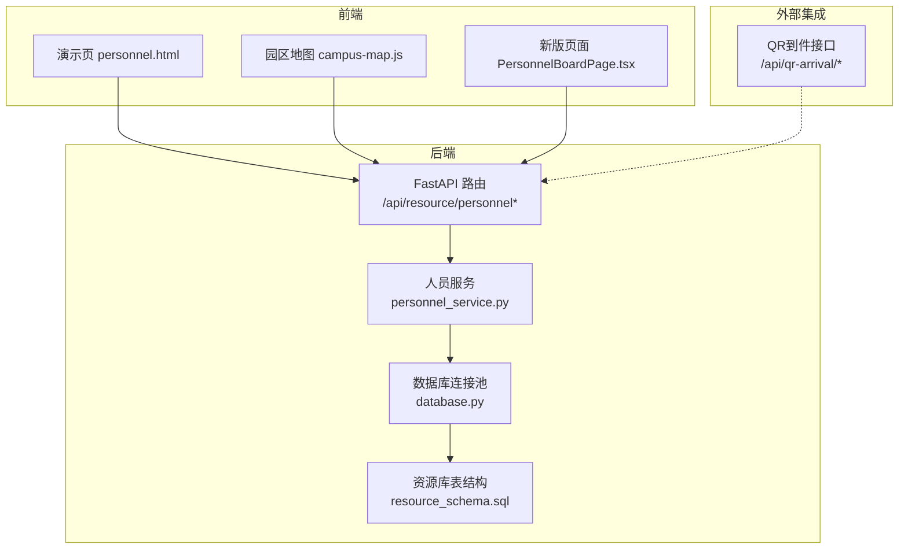
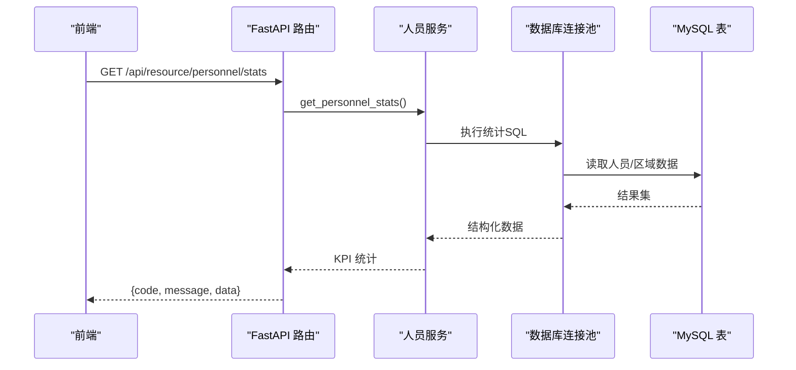
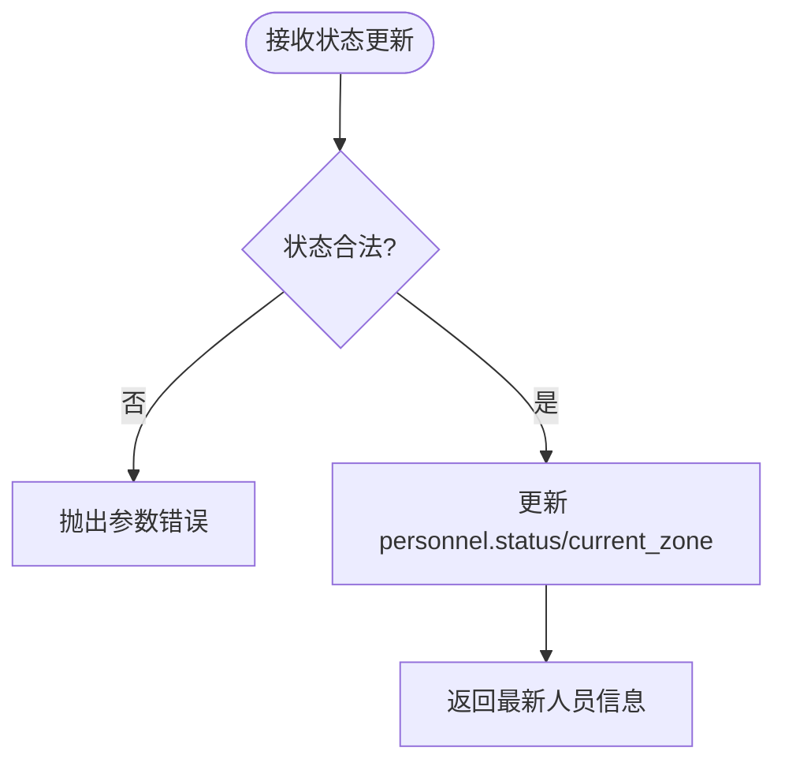
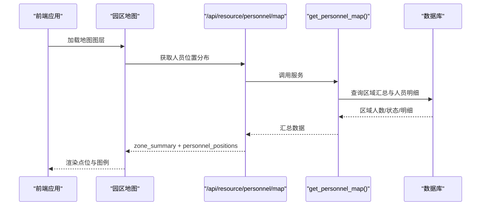
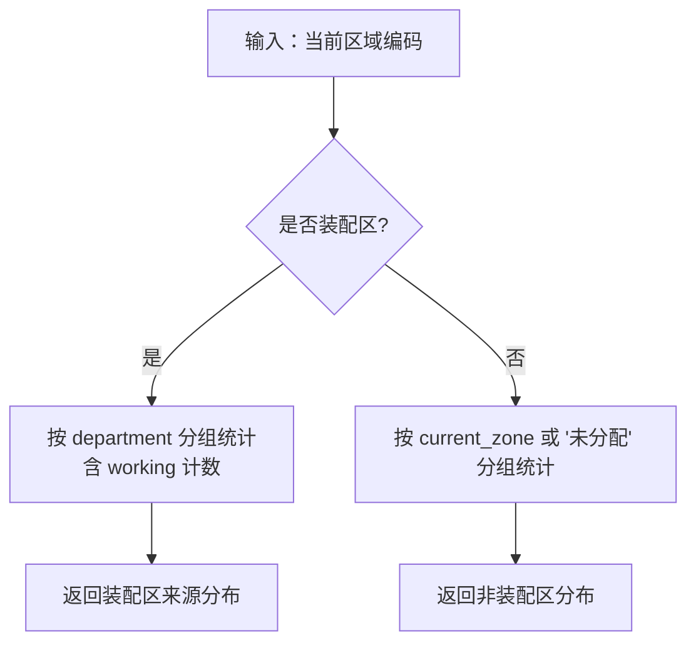
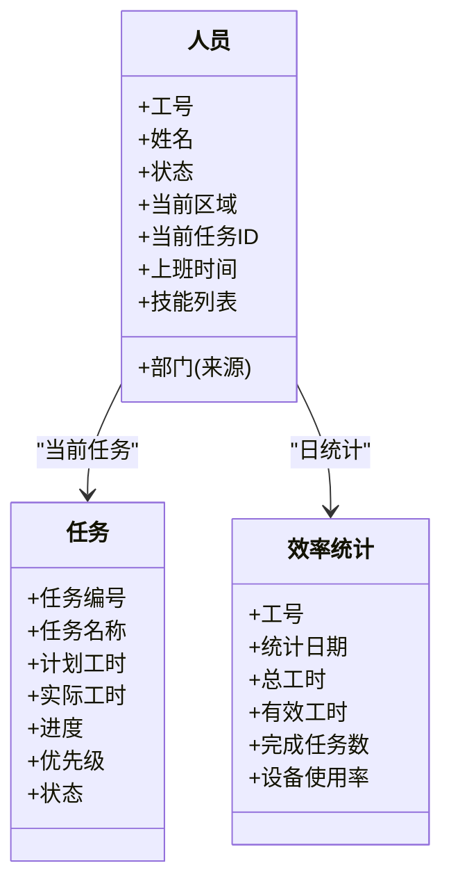
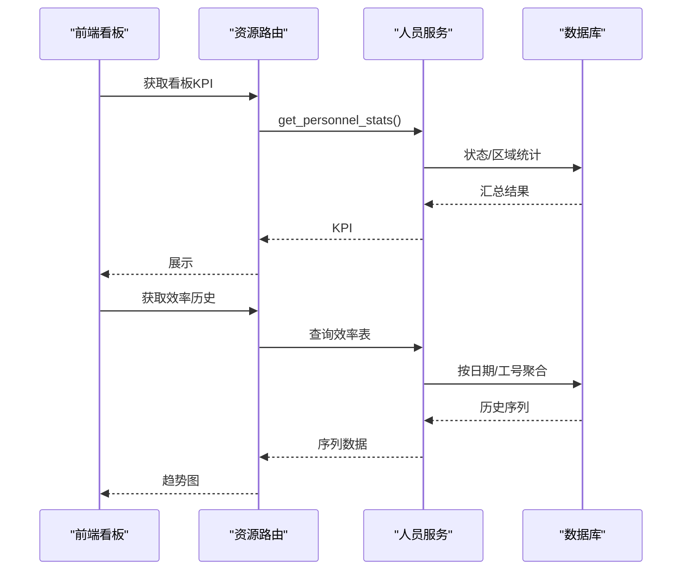

# 人员看板

<cite>
**本文引用的文件**
- [backend/modules/resource/services/personnel_service.py](file://backend/modules/resource/services/personnel_service.py)
- [backend/modules/resource/router.py](file://backend/modules/resource/router.py)
- [backend/modules/resource/schemas.py](file://backend/modules/resource/schemas.py)
- [backend/sql/resource_schema.sql](file://backend/sql/resource_schema.sql)
- [backend/database.py](file://backend/database.py)
- [demo/personnel.html](file://demo/personnel.html)
- [demo/campus-map.js](file://demo/assets/js/campus-map.js)
- [webui_ref/client/src/pages/PersonnelBoardPage/PersonnelBoardPage.tsx](file://webui_ref/client/src/pages/PersonnelBoardPage/PersonnelBoardPage.tsx)
- [static/index.html](file://static/index.html)
- [backend/qr_arrival/router.py](file://backend/qr_arrival/router.py)
- [static/qr-arrival.html](file://static/qr-arrival.html)
</cite>

## 目录
1. [简介](#简介)
2. [项目结构](#项目结构)
3. [核心组件](#核心组件)
4. [架构总览](#架构总览)
5. [详细组件分析](#详细组件分析)
6. [依赖关系分析](#依赖关系分析)
7. [性能考虑](#性能考虑)
8. [故障排查指南](#故障排查指南)
9. [结论](#结论)
10. [附录](#附录)

## 简介
本模块为“人员看板”提供后端能力与前端展示支撑，覆盖人员状态监控（在线/离线、工作中/空闲）、位置分布（区域级定位）、来源分析（自有员工、商用车、乘用车、柳汽、中智、外协、内调等）、工作负载与人效评估、数据聚合（实时与历史）以及扩展能力（技能矩阵、培训记录、绩效评估）。同时给出隐私保护、数据安全与权限控制的实践建议。

## 项目结构
- 后端服务层：人员服务、路由、数据模型、数据库访问
- 数据库：人员表、任务表、区域表、效率统计表等
- 前端：演示页面与新版 Web UI 占位页
- 到件扫码：用于现场签到/到件登记，可作为人员签到打卡的集成入口之一

图表来源
- [backend/modules/resource/router.py:356-556](file://backend/modules/resource/router.py#L356-L556)
- [backend/modules/resource/services/personnel_service.py:24-475](file://backend/modules/resource/services/personnel_service.py#L24-L475)
- [backend/database.py:12-116](file://backend/database.py#L12-L116)
- [backend/sql/resource_schema.sql:47-181](file://backend/sql/resource_schema.sql#L47-L181)
- [demo/personnel.html:1-200](file://demo/personnel.html#L1-L200)
- [demo/assets/js/campus-map.js:303-337](file://demo/assets/js/campus-map.js#L303-L337)
- [webui_ref/client/src/pages/PersonnelBoardPage/PersonnelBoardPage.tsx:1-15](file://webui_ref/client/src/pages/PersonnelBoardPage/PersonnelBoardPage.tsx#L1-L15)
- [backend/qr_arrival/router.py:14-41](file://backend/qr_arrival/router.py#L14-L41)

章节来源
- [backend/modules/resource/router.py:356-556](file://backend/modules/resource/router.py#L356-L556)
- [backend/modules/resource/services/personnel_service.py:24-475](file://backend/modules/resource/services/personnel_service.py#L24-L475)
- [backend/sql/resource_schema.sql:47-181](file://backend/sql/resource_schema.sql#L47-L181)
- [backend/database.py:12-116](file://backend/database.py#L12-L116)
- [demo/personnel.html:1-200](file://demo/personnel.html#L1-L200)
- [demo/assets/js/campus-map.js:303-337](file://demo/assets/js/campus-map.js#L303-L337)
- [webui_ref/client/src/pages/PersonnelBoardPage/PersonnelBoardPage.tsx:1-15](file://webui_ref/client/src/pages/PersonnelBoardPage/PersonnelBoardPage.tsx#L1-L15)
- [backend/qr_arrival/router.py:14-41](file://backend/qr_arrival/router.py#L14-L41)

## 核心组件
- 人员服务层：提供人员列表、详情、增删改、状态更新、统计、来源分布、位置分布等能力
- 路由层：暴露 RESTful API，统一封装响应格式与异常处理
- 数据模型：Pydantic 模型定义人员、任务、区域等数据结构
- 数据库层：连接池、查询封装、事务提交/回滚
- 前端展示：演示页与新版页面，支持筛选、地图覆盖层、KPI 卡片

章节来源
- [backend/modules/resource/services/personnel_service.py:24-475](file://backend/modules/resource/services/personnel_service.py#L24-L475)
- [backend/modules/resource/router.py:356-556](file://backend/modules/resource/router.py#L356-L556)
- [backend/modules/resource/schemas.py:76-118](file://backend/modules/resource/schemas.py#L76-L118)
- [backend/database.py:12-116](file://backend/database.py#L12-L116)
- [demo/personnel.html:1-200](file://demo/personnel.html#L1-L200)
- [webui_ref/client/src/pages/PersonnelBoardPage/PersonnelBoardPage.tsx:1-15](file://webui_ref/client/src/pages/PersonnelBoardPage/PersonnelBoardPage.tsx#L1-L15)

## 架构总览
人员看板的数据流从前端发起请求，经 FastAPI 路由进入服务层，服务层通过数据库连接池执行 SQL，返回结构化数据给前端渲染。

图表来源
- [backend/modules/resource/router.py:505-519](file://backend/modules/resource/router.py#L505-L519)
- [backend/modules/resource/services/personnel_service.py:325-379](file://backend/modules/resource/services/personnel_service.py#L325-L379)
- [backend/database.py:51-85](file://backend/database.py#L51-L85)
- [backend/sql/resource_schema.sql:47-66](file://backend/sql/resource_schema.sql#L47-L66)

## 详细组件分析

### 人员状态监控系统（在线/离线、工作中/空闲）
- 状态字段：working/idle/offline，默认 offline
- 状态更新：支持按工号更新状态及可选的区域变更
- 统计维度：总数、在岗（working+idle）、空闲可调配、离线异常数
- 前端展示：卡片状态徽标、脉冲动画、地图点标记颜色

图表来源
- [backend/modules/resource/services/personnel_service.py:286-322](file://backend/modules/resource/services/personnel_service.py#L286-L322)
- [backend/modules/resource/router.py:479-502](file://backend/modules/resource/router.py#L479-L502)
- [backend/sql/resource_schema.sql:50-66](file://backend/sql/resource_schema.sql#L50-L66)

章节来源
- [backend/modules/resource/services/personnel_service.py:286-322](file://backend/modules/resource/services/personnel_service.py#L286-L322)
- [backend/modules/resource/router.py:479-502](file://backend/modules/resource/router.py#L479-L502)
- [backend/sql/resource_schema.sql:50-66](file://backend/sql/resource_schema.sql#L50-L66)
- [demo/personnel.html:79-157](file://demo/personnel.html#L79-L157)

### 人员位置跟踪技术（区域级定位、签到打卡集成）
- 区域级定位：通过 current_zone 关联 zones 表，支持地图覆盖层显示各区域人数与明细
- 签到打卡集成：可通过 QR 到件接口作为现场签到入口，将人员与项目/到件关联，后续可扩展为人员签到打卡
- 地图可视化：前端根据人员状态与区域进行图标渲染与过滤

图表来源
- [backend/modules/resource/services/personnel_service.py:434-475](file://backend/modules/resource/services/personnel_service.py#L434-L475)
- [backend/modules/resource/router.py:542-556](file://backend/modules/resource/router.py#L542-L556)
- [backend/sql/resource_schema.sql:33-45](file://backend/sql/resource_schema.sql#L33-L45)
- [demo/assets/js/campus-map.js:303-337](file://demo/assets/js/campus-map.js#L303-L337)

章节来源
- [backend/modules/resource/services/personnel_service.py:434-475](file://backend/modules/resource/services/personnel_service.py#L434-L475)
- [backend/modules/resource/router.py:542-556](file://backend/modules/resource/router.py#L542-L556)
- [backend/sql/resource_schema.sql:33-45](file://backend/sql/resource_schema.sql#L33-L45)
- [demo/assets/js/campus-map.js:303-337](file://demo/assets/js/campus-map.js#L303-L337)
- [backend/qr_arrival/router.py:14-41](file://backend/qr_arrival/router.py#L14-L41)
- [static/qr-arrival.html:361-430](file://static/qr-arrival.html#L361-L430)

### 人员来源分析（自有员工、商用车、乘用车、柳汽、中智、外协、内调）
- 装配区与非装配区分组：装配区显示来源列，非装配区留白
- 数据来源：department 字段，限定有效值集合
- 输出：装配区来源饼图、柱状图（人数+平均工时），非装配区分布

图表来源
- [backend/modules/resource/services/personnel_service.py:12-21](file://backend/modules/resource/services/personnel_service.py#L12-L21)
- [backend/modules/resource/services/personnel_service.py:382-431](file://backend/modules/resource/services/personnel_service.py#L382-L431)
- [backend/modules/resource/router.py:522-539](file://backend/modules/resource/router.py#L522-L539)

章节来源
- [backend/modules/resource/services/personnel_service.py:12-21](file://backend/modules/resource/services/personnel_service.py#L12-L21)
- [backend/modules/resource/services/personnel_service.py:382-431](file://backend/modules/resource/services/personnel_service.py#L382-L431)
- [backend/modules/resource/router.py:522-539](file://backend/modules/resource/router.py#L522-L539)

### 工作负载评估算法（任务分配、工时统计、技能匹配）
- 工时统计：基于 status=working 的今日工时估算；实际工时来自 tasks.actual_work_hours
- 任务进度：tasks.progress 支持自动计算与手动覆盖
- 技能匹配：人员 skills 字段可用于匹配任务要求（当前为预留字段）
- 人效指标：personnel_efficiency 表记录每日总工时、有效工时、完成任务数、设备使用率等

图表来源
- [backend/sql/resource_schema.sql:50-66](file://backend/sql/resource_schema.sql#L50-L66)
- [backend/sql/resource_schema.sql:71-109](file://backend/sql/resource_schema.sql#L71-L109)
- [backend/sql/resource_schema.sql:168-181](file://backend/sql/resource_schema.sql#L168-L181)
- [backend/modules/resource/schemas.py:76-118](file://backend/modules/resource/schemas.py#L76-L118)
- [backend/modules/resource/schemas.py:123-177](file://backend/modules/resource/schemas.py#L123-L177)

章节来源
- [backend/sql/resource_schema.sql:50-66](file://backend/sql/resource_schema.sql#L50-L66)
- [backend/sql/resource_schema.sql:71-109](file://backend/sql/resource_schema.sql#L71-L109)
- [backend/sql/resource_schema.sql:168-181](file://backend/sql/resource_schema.sql#L168-L181)
- [backend/modules/resource/schemas.py:76-118](file://backend/modules/resource/schemas.py#L76-L118)
- [backend/modules/resource/schemas.py:123-177](file://backend/modules/resource/schemas.py#L123-L177)

### 人员看板数据聚合（实时数据、历史分析、趋势预测）
- 实时数据：人员列表、状态分布、来源分布、地图覆盖层
- 历史分析：效率统计表可按日期与工号聚合
- 趋势预测：可在效率统计基础上叠加时间序列分析（如移动平均、回归），当前为预留扩展点

图表来源
- [backend/modules/resource/router.py:505-519](file://backend/modules/resource/router.py#L505-L519)
- [backend/modules/resource/services/personnel_service.py:325-379](file://backend/modules/resource/services/personnel_service.py#L325-L379)
- [backend/sql/resource_schema.sql:168-181](file://backend/sql/resource_schema.sql#L168-L181)

章节来源
- [backend/modules/resource/router.py:505-519](file://backend/modules/resource/router.py#L505-L519)
- [backend/modules/resource/services/personnel_service.py:325-379](file://backend/modules/resource/services/personnel_service.py#L325-L379)
- [backend/sql/resource_schema.sql:168-181](file://backend/sql/resource_schema.sql#L168-L181)

### 高级功能扩展指南（技能矩阵、培训记录、绩效评估）
- 技能矩阵：在人员 skills 字段基础上，建立“技能-等级-认证”模型，结合任务需求实现匹配度评分
- 培训记录：新增培训表（课程、讲师、学时、考核结果），与人员档案关联
- 绩效评估：基于效率统计、任务完成、质量缺陷、出勤等维度构建综合评分模型，支持权重配置与周期汇总

章节来源
- [backend/modules/resource/schemas.py:76-118](file://backend/modules/resource/schemas.py#L76-L118)
- [backend/sql/resource_schema.sql:168-181](file://backend/sql/resource_schema.sql#L168-L181)

### 前端展示与交互
- 演示页：人员卡片网格、状态徽标、任务进度条、筛选器（状态、区域、来源）
- 园区地图：SVG 平面图，人员以人形图标显示，支持状态过滤与图例
- 新版页面：占位页面，预留“实时位置、状态、技能、工作负载”展示位

章节来源
- [demo/personnel.html:1-200](file://demo/personnel.html#L1-L200)
- [demo/personnel.html:911-960](file://demo/personnel.html#L911-L960)
- [demo/assets/js/campus-map.js:303-337](file://demo/assets/js/campus-map.js#L303-L337)
- [webui_ref/client/src/pages/PersonnelBoardPage/PersonnelBoardPage.tsx:1-15](file://webui_ref/client/src/pages/PersonnelBoardPage/PersonnelBoardPage.tsx#L1-L15)
- [static/index.html:3075-3087](file://static/index.html#L3075-L3087)

## 依赖关系分析
- 路由依赖服务：人员相关路由均委托至 personnel_service
- 服务依赖数据库：通过 database 模块的连接池执行 SQL
- 表间关系：personnel 关联 zones（区域）、tasks（任务）、personnel_efficiency（效率统计）
- 前端依赖：演示页与地图脚本依赖后端 API 返回的结构化数据

图表来源
- [backend/modules/resource/router.py:356-556](file://backend/modules/resource/router.py#L356-L556)
- [backend/modules/resource/services/personnel_service.py:24-475](file://backend/modules/resource/services/personnel_service.py#L24-L475)
- [backend/database.py:12-116](file://backend/database.py#L12-L116)
- [backend/sql/resource_schema.sql:47-181](file://backend/sql/resource_schema.sql#L47-L181)
- [demo/personnel.html:1-200](file://demo/personnel.html#L1-L200)
- [demo/assets/js/campus-map.js:303-337](file://demo/assets/js/campus-map.js#L303-L337)

章节来源
- [backend/modules/resource/router.py:356-556](file://backend/modules/resource/router.py#L356-L556)
- [backend/modules/resource/services/personnel_service.py:24-475](file://backend/modules/resource/services/personnel_service.py#L24-L475)
- [backend/database.py:12-116](file://backend/database.py#L12-L116)
- [backend/sql/resource_schema.sql:47-181](file://backend/sql/resource_schema.sql#L47-L181)
- [demo/personnel.html:1-200](file://demo/personnel.html#L1-L200)
- [demo/assets/js/campus-map.js:303-337](file://demo/assets/js/campus-map.js#L303-L337)

## 性能考虑
- 数据库连接池：使用 PooledDB，限制最大连接数，避免连接泄漏
- 索引优化：人员表对 status、current_zone、department 建索引，提升筛选与统计性能
- 分页与筛选：人员列表支持分页与多维度筛选，减少单次数据量
- 统计查询：按状态/区域聚合的 SQL 尽量使用 GROUP BY 与条件过滤，避免全表扫描
- 前端渲染：地图点位数量限制与懒加载，避免大量 DOM 操作导致卡顿

章节来源
- [backend/database.py:12-43](file://backend/database.py#L12-L43)
- [backend/sql/resource_schema.sql:50-66](file://backend/sql/resource_schema.sql#L50-L66)
- [backend/modules/resource/services/personnel_service.py:24-124](file://backend/modules/resource/services/personnel_service.py#L24-L124)
- [demo/assets/js/campus-map.js:303-337](file://demo/assets/js/campus-map.js#L303-L337)

## 故障排查指南
- 数据库连接失败：检查 .env 中的 DB_HOST/PORT/USER/PASSWORD/DATABASE 配置
- 状态更新无效：确认状态值为 working/idle/offline，且工号存在
- 来源分布为空：确认 department 是否为有效值集合，且 current_zone 属于装配区
- 地图无人员点位：确认 current_zone 已设置且不为空，zones 表有对应区域编码
- 到件登记失败：检查项目是否存在、零件号是否匹配、网络请求是否正常

章节来源
- [backend/database.py:12-43](file://backend/database.py#L12-L43)
- [backend/modules/resource/services/personnel_service.py:286-322](file://backend/modules/resource/services/personnel_service.py#L286-L322)
- [backend/modules/resource/services/personnel_service.py:382-431](file://backend/modules/resource/services/personnel_service.py#L382-L431)
- [backend/qr_arrival/router.py:14-41](file://backend/qr_arrival/router.py#L14-L41)
- [static/qr-arrival.html:361-430](file://static/qr-arrival.html#L361-L430)

## 结论
人员看板模块已具备人员状态监控、区域级位置跟踪、来源分析、工作负载与人效评估的基础能力，并通过前后端分离的架构实现数据聚合与可视化展示。未来可在此基础上扩展 GPS/室内定位、签到打卡、技能矩阵、培训记录与绩效评估等高级功能，并完善隐私保护、数据安全与权限控制策略。

## 附录

### 安全与隐私建议
- 数据最小化：仅采集必要的人员位置与状态信息
- 传输加密：全站启用 HTTPS，敏感接口增加鉴权与审计
- 访问控制：基于角色/部门的细粒度权限控制，限制敏感数据可见范围
- 日志脱敏：日志中不记录个人身份信息，关键操作留存审计轨迹
- 数据备份：定期备份数据库，制定恢复预案

[本节为通用指导，不直接引用具体代码文件]