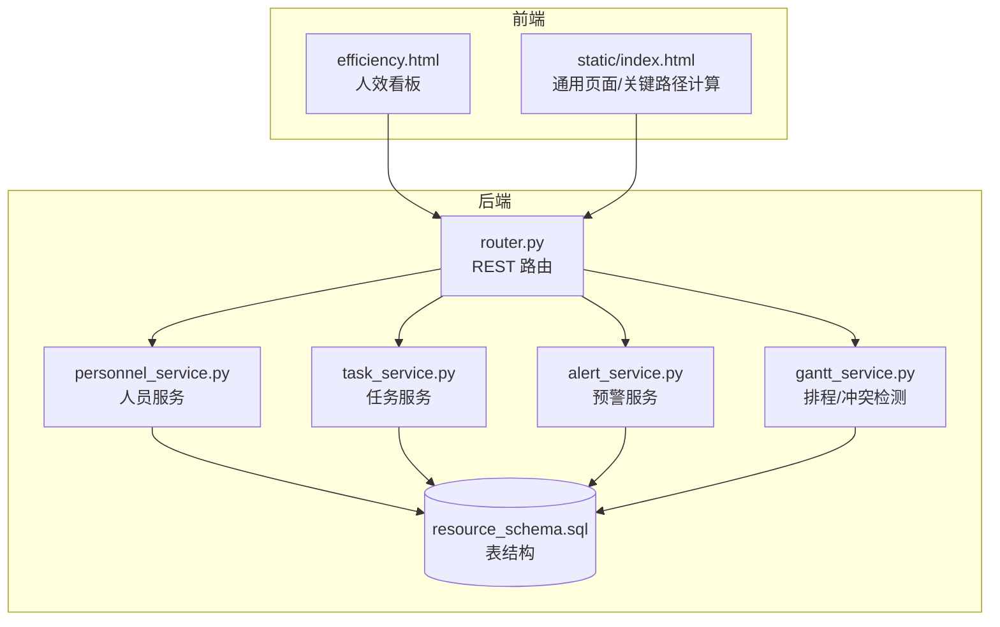
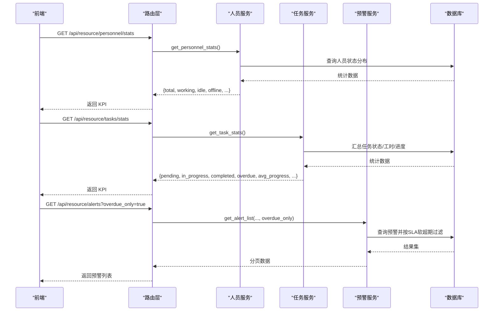
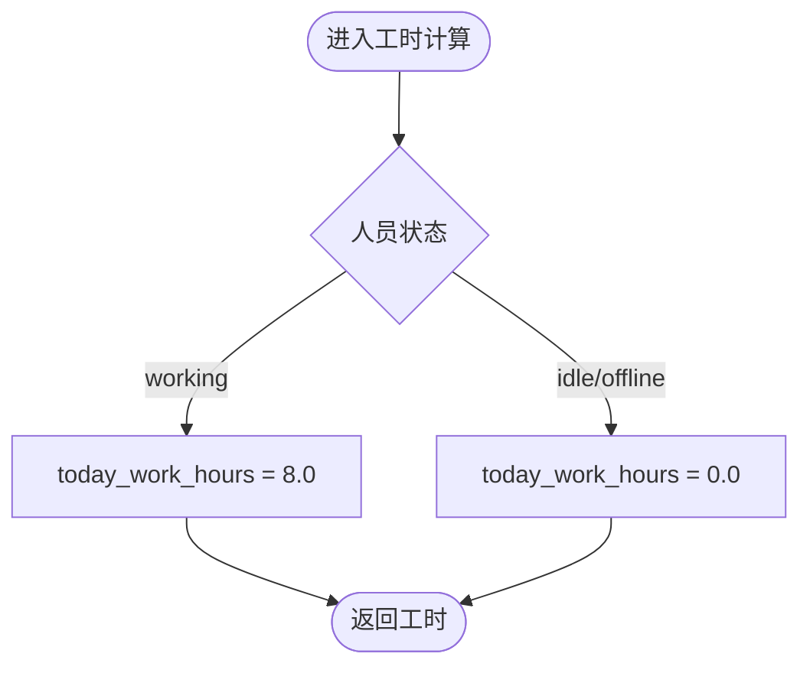
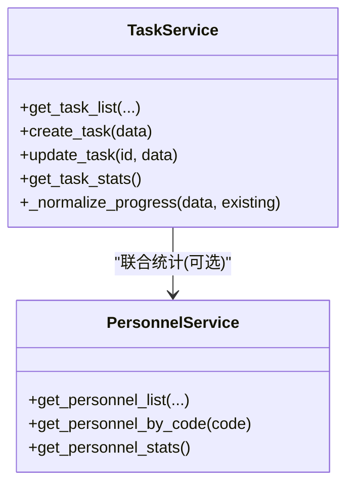
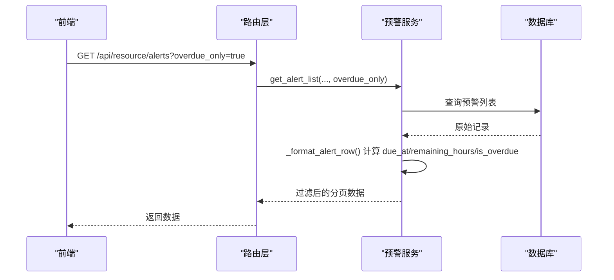
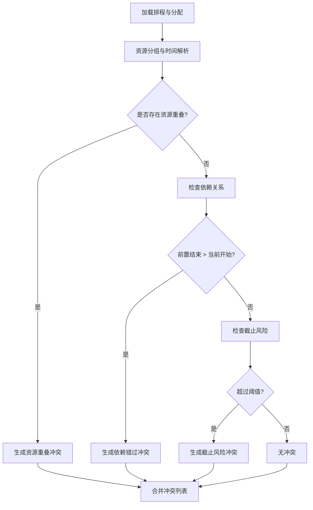
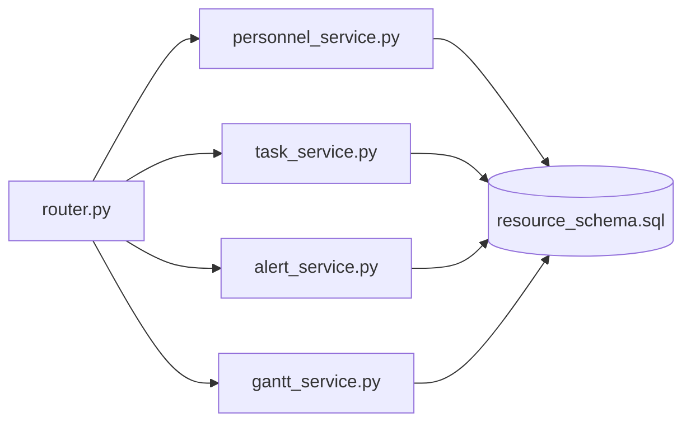
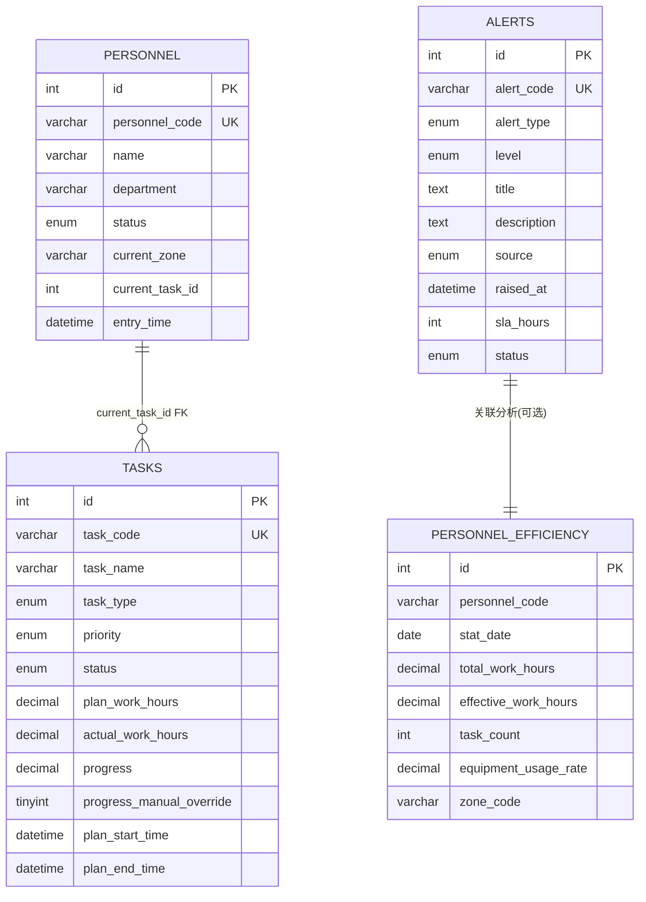

# 工作负载评估

<cite>
**本文引用的文件**
- [backend/modules/resource/services/personnel_service.py](file://backend/modules/resource/services/personnel_service.py)
- [backend/modules/resource/services/task_service.py](file://backend/modules/resource/services/task_service.py)
- [backend/modules/resource/services/alert_service.py](file://backend/modules/resource/services/alert_service.py)
- [backend/modules/resource/router.py](file://backend/modules/resource/router.py)
- [backend/sql/resource_schema.sql](file://backend/sql/resource_schema.sql)
- [demo/efficiency.html](file://demo/efficiency.html)
- [static/index.html](file://static/index.html)
</cite>

## 目录
1. [引言](#引言)
2. [项目结构](#项目结构)
3. [核心组件](#核心组件)
4. [架构总览](#架构总览)
5. [详细组件分析](#详细组件分析)
6. [依赖关系分析](#依赖关系分析)
7. [性能考量](#性能考量)
8. [故障排查指南](#故障排查指南)
9. [结论](#结论)
10. [附录](#附录)

## 引言
本文件围绕“工作负载评估”能力，系统阐述基于任务分配、工时统计与技能匹配的综合评估模型；说明今日工时的计算方法（当前采用工作中8小时、空闲/离线0小时的简单模拟），并给出未来复杂算法的扩展方向；定义效率指标（完成任务数、进行中任务数、平均工作效率等）的计算方法；描述实时监控与预警机制（过载预警、闲置提醒、资源优化建议等智能调度）；提供趋势分析与预测能力（基于历史数据的 workload 预测、人员配置优化建议）；并说明个性化配置选项（不同部门/岗位差异化评估标准与权重）。

## 项目结构
后端以 FastAPI 路由层统一暴露接口，服务层按领域拆分（人员、任务、预警、甘特排程等），数据库通过 SQL 脚本初始化表结构。前端 demo 页面展示人效看板与图表。

**图示来源**
- [backend/modules/resource/router.py:356-578](file://backend/modules/resource/router.py#L356-L578)
- [backend/modules/resource/services/personnel_service.py:24-124](file://backend/modules/resource/services/personnel_service.py#L24-L124)
- [backend/modules/resource/services/task_service.py:48-146](file://backend/modules/resource/services/task_service.py#L48-L146)
- [backend/modules/resource/services/alert_service.py:47-140](file://backend/modules/resource/services/alert_service.py#L47-L140)
- [backend/sql/resource_schema.sql:50-109](file://backend/sql/resource_schema.sql#L50-L109)
- [demo/efficiency.html:620-727](file://demo/efficiency.html#L620-L727)
- [static/index.html:11386-11426](file://static/index.html#L11386-L11426)

**章节来源**
- [backend/modules/resource/router.py:356-578](file://backend/modules/resource/router.py#L356-L578)
- [backend/sql/resource_schema.sql:50-109](file://backend/sql/resource_schema.sql#L50-L109)

## 核心组件
- 人员服务：提供人员列表、详情、状态更新、KPI 统计、来源分布、地图位置等能力；支持按区域/部门/状态筛选与分页搜索。
- 任务服务：提供任务 CRUD、进度自动计算（实际工时/计划工时）、类型与进度对比、月度趋势、部门维度统计等。
- 预警服务：提供预警 CRUD、SLA 软超期计算、批量处理、升级上报、统计与周新增趋势。
- 排程服务（Gantt）：提供甘图数据、冲突检测（资源重叠、依赖错过、截止风险）、关键路径计算、批量状态更新等。
- 路由层：统一对外暴露 REST API，封装参数校验与异常处理。

**章节来源**
- [backend/modules/resource/services/personnel_service.py:24-124](file://backend/modules/resource/services/personnel_service.py#L24-L124)
- [backend/modules/resource/services/task_service.py:21-45](file://backend/modules/resource/services/task_service.py#L21-L45)
- [backend/modules/resource/services/alert_service.py:33-44](file://backend/modules/resource/services/alert_service.py#L33-L44)
- [backend/modules/resource/router.py:855-1454](file://backend/modules/resource/router.py#L855-L1454)

## 架构总览
工作负载评估由“数据源（人员/任务/设备/预警/排程）→ 服务层聚合 → 路由层输出 → 前端可视化”构成。关键流程包括：
- 今日工时计算：基于人员状态（working/idle/offline）的简单规则。
- 任务进度与效率：基于计划与实际工时自动计算进度，结合完成/进行中任务数统计。
- 预警与 SLA：根据级别设置默认响应时长，动态计算剩余时间与是否超期。
- 排程冲突与关键路径：检测资源重叠、依赖错过、截止风险，并计算关键路径。

**图示来源**
- [backend/modules/resource/router.py:505-578](file://backend/modules/resource/router.py#L505-L578)
- [backend/modules/resource/router.py:774-831](file://backend/modules/resource/router.py#L774-L831)
- [backend/modules/resource/router.py:949-988](file://backend/modules/resource/router.py#L949-L988)
- [backend/modules/resource/services/personnel_service.py:325-379](file://backend/modules/resource/services/personnel_service.py#L325-L379)
- [backend/modules/resource/services/task_service.py:290-332](file://backend/modules/resource/services/task_service.py#L290-L332)
- [backend/modules/resource/services/alert_service.py:47-140](file://backend/modules/resource/services/alert_service.py#L47-L140)

## 详细组件分析

### 今日工时计算与扩展
- 当前实现：在人员列表与详情中，若人员状态为 working，则 today_work_hours=8.0；否则为 0.0。该逻辑用于快速估算当日有效工时。
- 未来扩展方向：
  - 基于签到/签退时间或任务起止时间精确累计。
  - 考虑多任务并行、切换损耗、休息时段扣减。
  - 引入技能匹配度与任务复杂度加权，得到“有效产出工时”。

**图示来源**
- [backend/modules/resource/services/personnel_service.py:94-98](file://backend/modules/resource/services/personnel_service.py#L94-L98)
- [backend/modules/resource/services/personnel_service.py:145-151](file://backend/modules/resource/services/personnel_service.py#L145-L151)

**章节来源**
- [backend/modules/resource/services/personnel_service.py:94-98](file://backend/modules/resource/services/personnel_service.py#L94-L98)
- [backend/modules/resource/services/personnel_service.py:145-151](file://backend/modules/resource/services/personnel_service.py#L145-L151)

### 任务进度与效率指标
- 进度自动计算：当 progress_manual_override=0 时，progress = min(round(actual_work_hours / plan_work_hours * 100, 2), 100)。
- 效率指标：
  - 完成任务数：按任务状态 completed 计数。
  - 进行中任务数：按 in_progress 计数。
  - 平均工作效率：可用 avg_progress 或单位工时产出（需结合产出件数，当前未直接提供）。
- 前端展示：人效页面展示综合效率指数、今日工时、完成任务、进行中、返工率、人均产出等。

**图示来源**
- [backend/modules/resource/services/task_service.py:21-45](file://backend/modules/resource/services/task_service.py#L21-L45)
- [backend/modules/resource/services/task_service.py:290-332](file://backend/modules/resource/services/task_service.py#L290-L332)
- [backend/modules/resource/services/personnel_service.py:325-379](file://backend/modules/resource/services/personnel_service.py#L325-L379)

**章节来源**
- [backend/modules/resource/services/task_service.py:21-45](file://backend/modules/resource/services/task_service.py#L21-L45)
- [backend/modules/resource/services/task_service.py:290-332](file://backend/modules/resource/services/task_service.py#L290-L332)
- [demo/efficiency.html:620-727](file://demo/efficiency.html#L620-L727)

### 预警与 SLA 软超期
- SLA 默认值：critical=4h, high=8h, medium=24h, low=72h。
- 软超期：raised_at + sla_hours < now 且 status 为 pending/processing 即视为超期，仅用于展示与过滤，不直接写库变更状态。
- 统计：提供总数、严重/高优先级、未解决、超期、升级数量、类型分布、近7天新增趋势等。

**图示来源**
- [backend/modules/resource/services/alert_service.py:47-140](file://backend/modules/resource/services/alert_service.py#L47-L140)
- [backend/modules/resource/services/alert_service.py:143-172](file://backend/modules/resource/services/alert_service.py#L143-L172)
- [backend/modules/resource/router.py:949-988](file://backend/modules/resource/router.py#L949-L988)

**章节来源**
- [backend/modules/resource/services/alert_service.py:25-38](file://backend/modules/resource/services/alert_service.py#L25-L38)
- [backend/modules/resource/services/alert_service.py:143-172](file://backend/modules/resource/services/alert_service.py#L143-L172)
- [backend/modules/resource/router.py:949-988](file://backend/modules/resource/router.py#L949-L988)

### 排程冲突检测与关键路径
- 冲突检测：
  - 资源重叠：同一资源在同一时间段被多个分配占用。
  - 依赖错过：前置任务结束时间晚于当前任务开始时间。
  - 截止风险：计划结束时间早于今天一定阈值（如 >1/3 天）标记为中/严重。
- 关键路径：使用拓扑排序计算 ES/EF/LF/LS，松弛接近0的任务标记为关键任务。

**图示来源**
- [backend/modules/resource/services/gantt_service.py:808-971](file://backend/modules/resource/services/gantt_service.py#L808-L971)
- [static/index.html:11386-11426](file://static/index.html#L11386-L11426)

**章节来源**
- [backend/modules/resource/services/gantt_service.py:808-971](file://backend/modules/resource/services/gantt_service.py#L808-L971)
- [static/index.html:11386-11426](file://static/index.html#L11386-L11426)

### 实时监测与智能调度
- 过载预警：当某区域/资源在短期内集中分配且存在冲突时，触发冲突告警与建议调整。
- 闲置提醒：idle 人员比例偏高或长时间无任务时，提示重新分配。
- 资源优化建议：基于冲突检测结果，给出“延后/拆分/替换资源”的建议。
- 预警升级：对超 SLA 或高严重度的预警进行升级上报。

**章节来源**
- [backend/modules/resource/services/alert_service.py:305-334](file://backend/modules/resource/services/alert_service.py#L305-L334)
- [backend/modules/resource/services/gantt_service.py:894-971](file://backend/modules/resource/services/gantt_service.py#L894-L971)

### 趋势分析与预测
- 月度趋势：按月份统计任务数量与完成数量，观察产能波动。
- 预测方向（可扩展）：
  - 基于历史任务的移动平均/季节性分解预测未来 workload。
  - 结合人员技能矩阵与任务复杂度，预测瓶颈与所需资源。
  - 利用排程冲突频率与类型，优化资源配置策略。

**章节来源**
- [backend/modules/resource/services/task_service.py:412-431](file://backend/modules/resource/services/task_service.py#L412-L431)

### 个性化配置与差异化评估
- 部门/岗位差异：可通过 department/assembly_site 维度进行筛选与统计，支持不同区域的差异化展示。
- 权重与阈值：
  - 系统参数可配置评分阈值（如关键件/次关键件阈值），影响风险标识与分类。
  - 可在服务层扩展权重配置（如不同岗位的技能匹配权重、任务难度系数）。
- 配置入口：前端系统参数页支持阈值输入与保存（示例为关键件评分阈值）。

**章节来源**
- [backend/modules/resource/services/personnel_service.py:382-431](file://backend/modules/resource/services/personnel_service.py#L382-L431)
- [webui_ref/client/src/pages/SystemSettingsPage/SystemParamsSection.tsx:135-188](file://webui_ref/client/src/pages/SystemSettingsPage/SystemParamsSection.tsx#L135-L188)

## 依赖关系分析
- 路由层依赖各服务模块，服务模块依赖数据库访问函数。
- 人员服务与任务服务可独立提供 KPI；预警服务与排程服务提供风险与冲突信息。
- 前端页面通过路由层获取数据并进行可视化。

**图示来源**
- [backend/modules/resource/router.py:356-578](file://backend/modules/resource/router.py#L356-L578)
- [backend/modules/resource/router.py:855-1454](file://backend/modules/resource/router.py#L855-L1454)
- [backend/sql/resource_schema.sql:50-109](file://backend/sql/resource_schema.sql#L50-L109)

**章节来源**
- [backend/modules/resource/router.py:356-578](file://backend/modules/resource/router.py#L356-L578)
- [backend/modules/resource/router.py:855-1454](file://backend/modules/resource/router.py#L855-L1454)
- [backend/sql/resource_schema.sql:50-109](file://backend/sql/resource_schema.sql#L50-L109)

## 性能考量
- 查询优化：
  - 使用索引字段（status、zone_code、department、task_type、priority 等）提升筛选与分页性能。
  - 避免在大表中全表扫描，合理使用 WHERE 条件与 LIMIT/OFFSET。
- 计算开销：
  - 软超期计算在服务层进行，避免频繁写库；仅在必要时重算。
  - 排程冲突检测可按装配场地或日期区间缩小范围，减少计算量。
- 前端渲染：
  - 图表数据按需加载，避免一次性拉取过多数据。
  - 使用分页与懒加载提升交互体验。

[本节为通用指导，无需特定文件引用]

## 故障排查指南
- 人员状态异常：
  - 检查 personnel.status 是否为 working/idle/offline；确认 today_work_hours 计算是否符合预期。
- 任务进度异常：
  - 检查 progress_manual_override 标志；确认 plan_work_hours 与 actual_work_hours 是否正确。
- 预警超期误判：
  - 核对 raised_at 与 sla_hours；确认 status 是否为 pending/processing。
- 排程冲突误报：
  - 检查 gantt_resource_allocations 的时间段与资源编码；确认依赖关系是否正确。

**章节来源**
- [backend/modules/resource/services/personnel_service.py:286-322](file://backend/modules/resource/services/personnel_service.py#L286-L322)
- [backend/modules/resource/services/task_service.py:240-277](file://backend/modules/resource/services/task_service.py#L240-L277)
- [backend/modules/resource/services/alert_service.py:143-172](file://backend/modules/resource/services/alert_service.py#L143-L172)
- [backend/modules/resource/services/gantt_service.py:808-971](file://backend/modules/resource/services/gantt_service.py#L808-L971)

## 结论
当前工作负载评估以“人员状态+任务进度+预警SLA+排程冲突”为核心，提供了基础的工时估算、效率统计与风险预警能力。未来可通过更精细的工时采集、技能匹配与复杂度加权、历史趋势预测与智能调度优化，进一步提升评估准确性与资源利用率。

[本节为总结性内容，无需特定文件引用]

## 附录
- 数据模型概览（人员、任务、预警、效率统计）：

**图示来源**
- [backend/sql/resource_schema.sql:50-109](file://backend/sql/resource_schema.sql#L50-L109)
- [backend/sql/resource_schema.sql:114-181](file://backend/sql/resource_schema.sql#L114-L181)