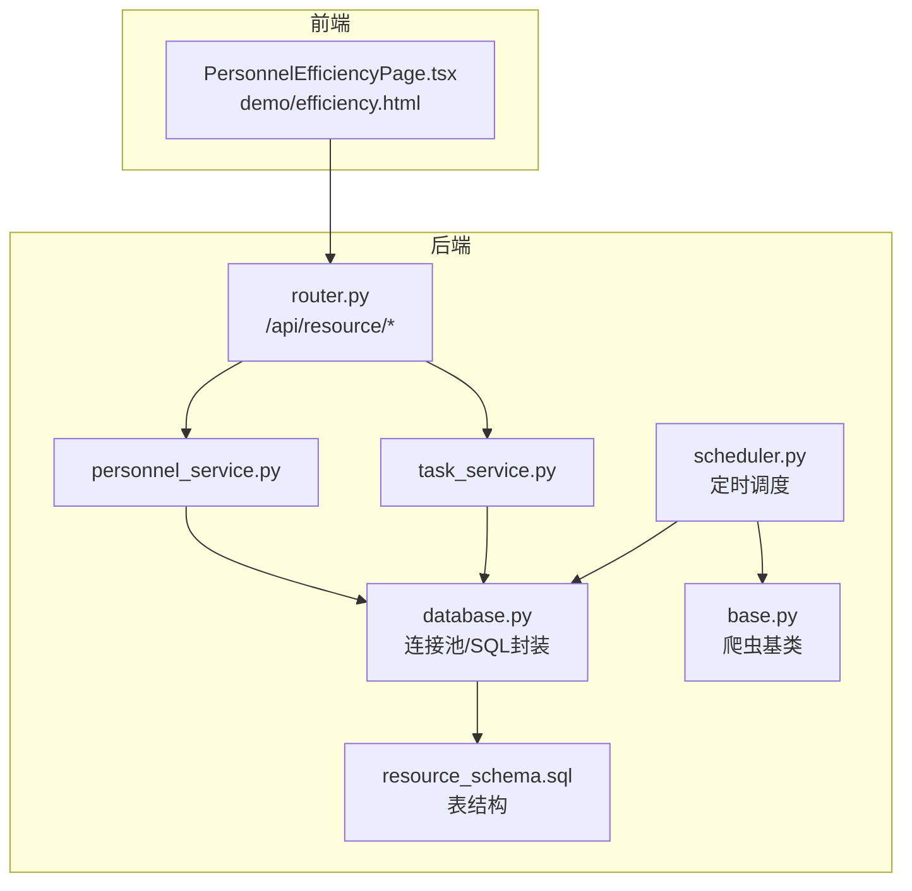
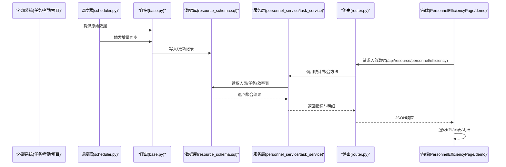
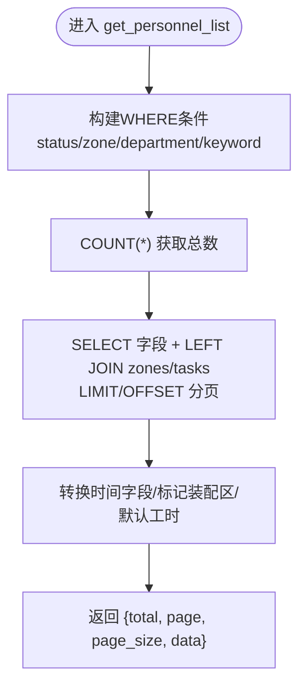
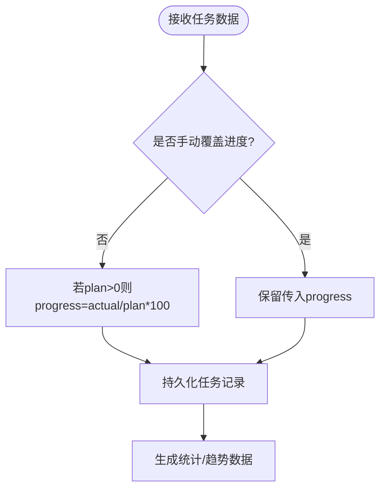
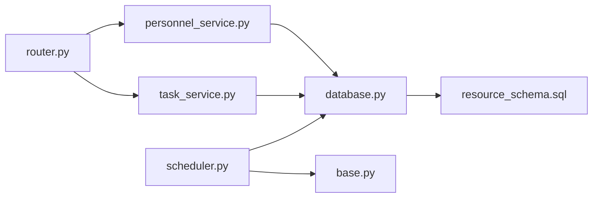

# 人效分析

<cite>
**本文引用的文件**
- [backend/modules/resource/services/personnel_service.py](file://backend/modules/resource/services/personnel_service.py)
- [backend/modules/resource/services/task_service.py](file://backend/modules/resource/services/task_service.py)
- [backend/modules/resource/router.py](file://backend/modules/resource/router.py)
- [backend/modules/resource/schemas.py](file://backend/modules/resource/schemas.py)
- [backend/database.py](file://backend/database.py)
- [backend/sql/resource_schema.sql](file://backend/sql/resource_schema.sql)
- [backend/crawlers/base.py](file://backend/crawlers/base.py)
- [backend/scheduling/scheduler.py](file://backend/scheduling/scheduler.py)
- [webui_ref/client/src/pages/PersonnelEfficiencyPage/PersonnelEfficiencyPage.tsx](file://webui_ref/client/src/pages/PersonnelEfficiencyPage/PersonnelEfficiencyPage.tsx)
- [demo/efficiency.html](file://demo/efficiency.html)
- [需求文档_V6_试制资源数智化管理系统.md](file://需求文档_V6_试制资源数智化管理系统.md)
</cite>

## 目录
1. [简介](#简介)
2. [项目结构](#项目结构)
3. [核心组件](#核心组件)
4. [架构总览](#架构总览)
5. [详细组件分析](#详细组件分析)
6. [依赖关系分析](#依赖关系分析)
7. [性能与可扩展性](#性能与可扩展性)
8. [故障排查指南](#故障排查指南)
9. [结论与建议](#结论与建议)
10. [附录](#附录)

## 简介
本模块聚焦“人效分析”，围绕人员效率的计算模型、评估指标、数据来源与采集机制、趋势分析与预测、多维度对比、低效诊断、改进建议以及可视化与预警通知等能力进行系统化说明。当前代码库已具备人员、任务、设备、区域、预警、排程等基础数据表与服务，并预留了人效分析接口与前端页面占位，为后续完善提供坚实基础。

## 项目结构
后端采用分层设计：路由层（FastAPI）→ 服务层（业务逻辑）→ 数据访问层（数据库封装）。数据源通过爬虫与定时调度器自动同步至本地数据库，供分析使用。前端包含演示页与React工程页面占位。

图表来源
- [backend/modules/resource/router.py:356-578](file://backend/modules/resource/router.py#L356-L578)
- [backend/modules/resource/services/personnel_service.py:24-124](file://backend/modules/resource/services/personnel_service.py#L24-L124)
- [backend/modules/resource/services/task_service.py:48-146](file://backend/modules/resource/services/task_service.py#L48-L146)
- [backend/database.py:51-116](file://backend/database.py#L51-L116)
- [backend/sql/resource_schema.sql:48-181](file://backend/sql/resource_schema.sql#L48-L181)
- [backend/crawlers/base.py:51-67](file://backend/crawlers/base.py#L51-L67)
- [backend/scheduling/scheduler.py:93-196](file://backend/scheduling/scheduler.py#L93-L196)

章节来源
- [backend/modules/resource/router.py:356-578](file://backend/modules/resource/router.py#L356-L578)
- [backend/modules/resource/services/personnel_service.py:24-124](file://backend/modules/resource/services/personnel_service.py#L24-L124)
- [backend/modules/resource/services/task_service.py:48-146](file://backend/modules/resource/services/task_service.py#L48-L146)
- [backend/database.py:51-116](file://backend/database.py#L51-L116)
- [backend/sql/resource_schema.sql:48-181](file://backend/sql/resource_schema.sql#L48-L181)
- [backend/crawlers/base.py:51-67](file://backend/crawlers/base.py#L51-L67)
- [backend/scheduling/scheduler.py:93-196](file://backend/scheduling/scheduler.py#L93-L196)

## 核心组件
- 人员服务：提供人员列表、详情、状态更新、看板统计、来源分布、地图位置等能力；支持装配区与非装配区的差异化展示。
- 任务服务：提供任务CRUD、进度自动计算（计划/实际工时）、多维统计、月度趋势、部门维度统计等。
- 路由层：暴露REST API，包括人员、任务、设备、预警、人效分析占位接口。
- 数据访问：基于连接池的MySQL/MariaDB操作封装，统一查询与写操作。
- 数据表：人员、任务、设备、区域、预警、甘特排程与资源分配、冲突检测、人员效率统计表等。
- 数据采集：爬虫基类定义统一接口，调度器按配置周期执行增量同步。
- 前端：演示页与人效页面占位，用于展示KPI、图表与明细。

章节来源
- [backend/modules/resource/services/personnel_service.py:24-475](file://backend/modules/resource/services/personnel_service.py#L24-L475)
- [backend/modules/resource/services/task_service.py:21-432](file://backend/modules/resource/services/task_service.py#L21-L432)
- [backend/modules/resource/router.py:356-578](file://backend/modules/resource/router.py#L356-L578)
- [backend/database.py:51-116](file://backend/database.py#L51-L116)
- [backend/sql/resource_schema.sql:48-181](file://backend/sql/resource_schema.sql#L48-L181)
- [backend/crawlers/base.py:51-67](file://backend/crawlers/base.py#L51-L67)
- [backend/scheduling/scheduler.py:93-196](file://backend/scheduling/scheduler.py#L93-L196)
- [webui_ref/client/src/pages/PersonnelEfficiencyPage/PersonnelEfficiencyPage.tsx:1-16](file://webui_ref/client/src/pages/PersonnelEfficiencyPage/PersonnelEfficiencyPage.tsx#L1-L16)
- [demo/efficiency.html:1-200](file://demo/efficiency.html#L1-L200)

## 架构总览
人效分析的数据流从外部系统经爬虫采集到本地数据库，再由服务层聚合计算，最终通过API返回给前端展示。关键路径如下：

图表来源
- [backend/scheduling/scheduler.py:93-196](file://backend/scheduling/scheduler.py#L93-L196)
- [backend/crawlers/base.py:51-67](file://backend/crawlers/base.py#L51-L67)
- [backend/sql/resource_schema.sql:48-181](file://backend/sql/resource_schema.sql#L48-L181)
- [backend/modules/resource/services/personnel_service.py:24-475](file://backend/modules/resource/services/personnel_service.py#L24-L475)
- [backend/modules/resource/services/task_service.py:48-432](file://backend/modules/resource/services/task_service.py#L48-L432)
- [backend/modules/resource/router.py:559-578](file://backend/modules/resource/router.py#L559-L578)
- [webui_ref/client/src/pages/PersonnelEfficiencyPage/PersonnelEfficiencyPage.tsx:1-16](file://webui_ref/client/src/pages/PersonnelEfficiencyPage/PersonnelEfficiencyPage.tsx#L1-L16)

## 详细组件分析

### 人员服务（personnel_service.py）
- 人员列表与筛选：支持按状态、区域、来源、关键词分页查询，装配区显示“来源”列，非装配区留白。
- 今日工时估算：根据状态简单估算（working=8h，其他=0），便于快速看板展示。
- 来源分布：装配区按来源统计人数与平均工时；非装配区按区域统计人数。
- 地图覆盖层：汇总各区域人数与明细，支撑园区地图可视化。
- KPI统计：在岗、空闲、离线人数及异常计数。

图表来源
- [backend/modules/resource/services/personnel_service.py:24-124](file://backend/modules/resource/services/personnel_service.py#L24-L124)

章节来源
- [backend/modules/resource/services/personnel_service.py:24-475](file://backend/modules/resource/services/personnel_service.py#L24-L475)

### 任务服务（task_service.py）
- 进度自动计算：当未手动覆盖时，progress = min(round(actual_work_hours / plan_work_hours * 100, 2), 100)。
- 多维统计：按状态、优先级、类型、月度趋势、装配场地维度聚合。
- 工时汇总：累计计划与实际工时，计算平均进度。

图表来源
- [backend/modules/resource/services/task_service.py:21-45](file://backend/modules/resource/services/task_service.py#L21-L45)
- [backend/modules/resource/services/task_service.py:177-237](file://backend/modules/resource/services/task_service.py#L177-L237)
- [backend/modules/resource/services/task_service.py:290-432](file://backend/modules/resource/services/task_service.py#L290-L432)

章节来源
- [backend/modules/resource/services/task_service.py:21-432](file://backend/modules/resource/services/task_service.py#L21-L432)

### 路由与API（router.py）
- 人员相关：列表、详情、创建、更新、删除、状态切换、看板统计、来源分布、地图数据。
- 任务相关：列表、详情、创建、更新、删除、看板统计、状态分布、类型与进度对比、月度趋势。
- 人效分析接口：预留 GET /api/resource/personnel/efficiency，当前返回占位数据，待实现具体计算逻辑。

章节来源
- [backend/modules/resource/router.py:356-578](file://backend/modules/resource/router.py#L356-L578)

### 数据模型与表结构（schemas.py & resource_schema.sql）
- Pydantic模型：设备、区域、人员、任务、预警、驾驶舱KPI等数据结构定义。
- 数据库表：
  - personnel：人员基本信息、状态、所在区域、当前任务、上班时间等。
  - tasks：任务全量信息，含计划/实际工时、进度、来源等。
  - personnel_efficiency：人员效率统计表（工号、日期、总工时、有效工时、完成任务数、设备使用率、主要区域）。
  - alerts：异常预警，含SLA、升级、处理流程等。
  - gantt_schedules/gantt_resource_allocations/gantt_conflicts：排程与资源分配、冲突检测。

章节来源
- [backend/modules/resource/schemas.py:12-224](file://backend/modules/resource/schemas.py#L12-L224)
- [backend/sql/resource_schema.sql:48-181](file://backend/sql/resource_schema.sql#L48-L181)

### 数据采集与调度（base.py & scheduler.py）
- 爬虫基类：定义run/get_status接口，统一结果对象CrawlerResult，支持auto/full/incremental三种同步模式。
- 调度器：后台线程按配置间隔执行增量同步，避免与手动任务冲突，支持暂停/恢复、配置热重载。

章节来源
- [backend/crawlers/base.py:12-67](file://backend/crawlers/base.py#L12-L67)
- [backend/scheduling/scheduler.py:16-196](file://backend/scheduling/scheduler.py#L16-L196)

### 前端展示（PersonnelEfficiencyPage.tsx & demo/efficiency.html）
- React页面占位：标题、描述与开发中提示。
- 演示页：包含KPI卡片、图表容器、明细表格、团队效率对比等布局与交互骨架，便于对接后端数据后快速落地。

章节来源
- [webui_ref/client/src/pages/PersonnelEfficiencyPage/PersonnelEfficiencyPage.tsx:1-16](file://webui_ref/client/src/pages/PersonnelEfficiencyPage/PersonnelEfficiencyPage.tsx#L1-L16)
- [demo/efficiency.html:1-200](file://demo/efficiency.html#L1-L200)

## 依赖关系分析
- 路由依赖服务：router.py 调用 personnel_service.py 与 task_service.py。
- 服务依赖数据库：通过 database.py 提供的连接池与SQL封装访问 MySQL/MariaDB。
- 数据表依赖：personnel、tasks、personnel_efficiency、alerts、gantt_* 等表构成分析基础。
- 采集依赖：scheduler.py 驱动 crawler_manager（由 base.py 抽象）周期性拉取外部数据。

图表来源
- [backend/modules/resource/router.py:356-578](file://backend/modules/resource/router.py#L356-L578)
- [backend/modules/resource/services/personnel_service.py:24-475](file://backend/modules/resource/services/personnel_service.py#L24-L475)
- [backend/modules/resource/services/task_service.py:48-432](file://backend/modules/resource/services/task_service.py#L48-L432)
- [backend/database.py:51-116](file://backend/database.py#L51-L116)
- [backend/sql/resource_schema.sql:48-181](file://backend/sql/resource_schema.sql#L48-L181)
- [backend/scheduling/scheduler.py:93-196](file://backend/scheduling/scheduler.py#L93-L196)
- [backend/crawlers/base.py:51-67](file://backend/crawlers/base.py#L51-L67)

## 性能与可扩展性
- 数据库连接池：使用PooledDB管理连接，减少频繁建连开销，提升并发能力。
- 索引优化：人员、任务、预警、排程等表均建立常用字段索引，加速查询。
- 分页与过滤：列表接口支持分页与多条件过滤，降低单次数据量。
- 异步与调度：调度器独立线程运行，避免阻塞主服务；支持暂停/恢复与配置热重载。
- 扩展点：新增数据源只需继承BaseCrawler并实现run/get_status；新增分析指标可在服务层增加聚合方法并通过路由暴露。

[本节为通用指导，不直接分析具体文件]

## 故障排查指南
- 数据库连接失败：检查 .env 中的 DB_HOST/DB_PORT/DB_USER/DB_PASSWORD/DB_DATABASE 配置是否正确；连接池初始化失败会抛出明确错误日志。
- 调度器未执行：确认crawler_mode为auto且enabled_sources_list非空；检查是否有爬虫正在运行导致跳过本次执行。
- 接口返回占位：人效分析接口当前为占位实现，需补充服务层计算逻辑后再联调前端。
- 数据不一致：核对爬虫增量同步策略与任务/人员状态更新逻辑，确保实际工时与进度一致。

章节来源
- [backend/database.py:12-43](file://backend/database.py#L12-L43)
- [backend/scheduling/scheduler.py:93-196](file://backend/scheduling/scheduler.py#L93-L196)
- [backend/modules/resource/router.py:559-578](file://backend/modules/resource/router.py#L559-L578)

## 结论与建议
- 当前系统已具备完整的人员、任务、设备、区域、预警、排程数据与服务能力，为“人效分析”提供了坚实的数据基础。
- 建议优先实现以下能力：
  - 工时利用率：结合人员状态与任务实际工时，按日/周/月统计人均工时与利用率。
  - 任务完成度：基于progress与计划/实际工时，计算完成率与偏差。
  - 技能匹配度：在人员表中引入skills字段，结合任务类型/车型/工艺要求，评估匹配度。
  - 团队协作效率：按装配场地/区域/来源维度聚合，比较不同团队的产出与效率。
  - 趋势分析与预测：基于历史personnel_efficiency与tasks数据，建立时间序列模型进行效率预测与瓶颈识别。
  - 低效诊断：通过数据挖掘（如异常预警、设备故障、缺件、人员缺口）定位影响效率的关键因素。
  - 可视化与报告：在前端实现KPI、图表、明细与导出功能，并接入预警通知。
- 参考需求文档中对“人效分析”页面的分组维度与组成，逐步落地指标与图表。

[本节为总结与建议，不直接分析具体文件]

## 附录

### 指标计算模型（建议）
- 工时利用率 = 有效工时 / 标准工时（可按区域/来源/个人维度）
- 任务完成度 = 已完成任务数 / 应完成任务数（或按进度加权）
- 技能匹配度 = 匹配任务数 / 总任务数（基于skills与任务类型/工艺）
- 团队协作效率 = 团队产出（任务数/工时）/ 团队规模（或按装配场地/来源聚合）

[本节为概念性内容，不直接分析具体文件]

### 数据来源与采集机制
- 任务系统：通过MES/运营表/手工录入，写入tasks表，支持source字段区分来源。
- 考勤系统：可对接打卡/门禁数据，关联personnel表的entry_time与status，计算有效工时。
- 项目管理系统：关联project_code/vehicle_code，用于项目维度的人效分析。
- 采集方式：通过爬虫基类与调度器周期性增量同步，保证数据时效性与一致性。

章节来源
- [backend/sql/resource_schema.sql:71-109](file://backend/sql/resource_schema.sql#L71-L109)
- [backend/sql/resource_schema.sql:48-66](file://backend/sql/resource_schema.sql#L48-L66)
- [backend/crawlers/base.py:51-67](file://backend/crawlers/base.py#L51-L67)
- [backend/scheduling/scheduler.py:93-196](file://backend/scheduling/scheduler.py#L93-L196)

### 趋势分析与预测算法（建议）
- 时间序列：对personnel_efficiency.total_work_hours/effective_work_hours与tasks.progress进行月度/周度趋势分析。
- 预测模型：可采用移动平均、指数平滑或ARIMA等方法进行短期预测，识别效率拐点与瓶颈。
- 瓶颈识别：结合alerts与equipment_maintenance，定位设备故障、缺件、人员缺口等对效率的影响。

[本节为概念性内容，不直接分析具体文件]

### 对比分析与可视化
- 横向比较：按部门/来源/区域对比效率评分、完成率、总工时。
- 纵向追踪：按时间维度追踪个人或团队效率变化。
- 可视化：KPI卡片、柱状图、条形图、排行榜、明细表；参考demo/efficiency.html布局。

章节来源
- [demo/efficiency.html:540-573](file://demo/efficiency.html#L540-L573)
- [需求文档_V6_试制资源数智化管理系统.md:517-554](file://需求文档_V6_试制资源数智化管理系统.md#L517-L554)

### 预警通知与辅助决策
- 预警类型：任务延迟、质量缺陷、设备故障、物料缺件、人员缺口、安全隐患、计划超期、工艺违规、外部协调等。
- SLA与升级：按级别设置响应时限，超时自动升级上报。
- 通知机制：可通过邮件/IM/短信等方式推送预警，辅助快速决策。

章节来源
- [backend/sql/resource_schema.sql:114-163](file://backend/sql/resource_schema.sql#L114-L163)