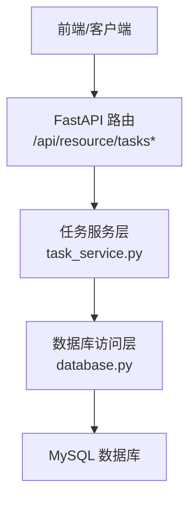
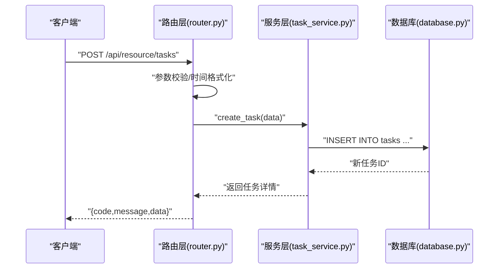
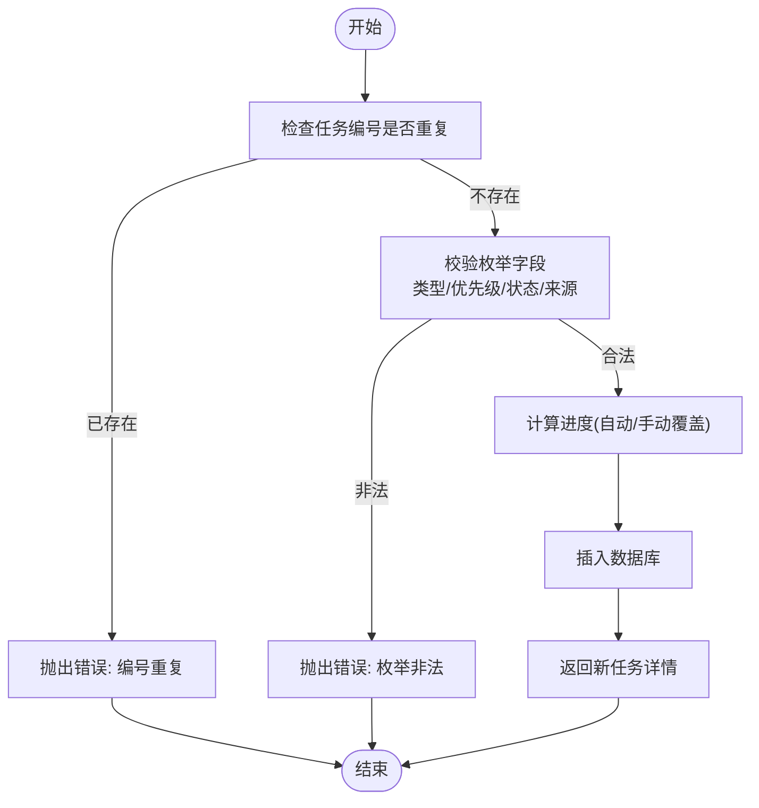
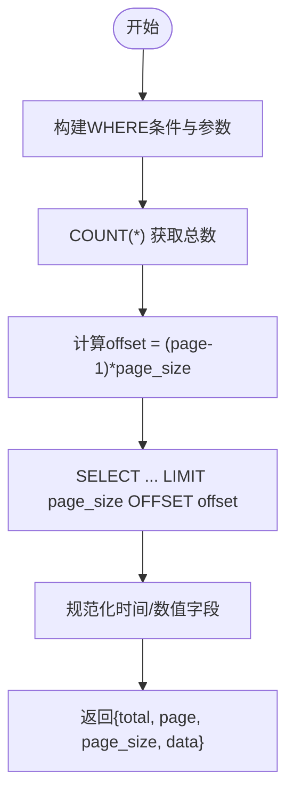
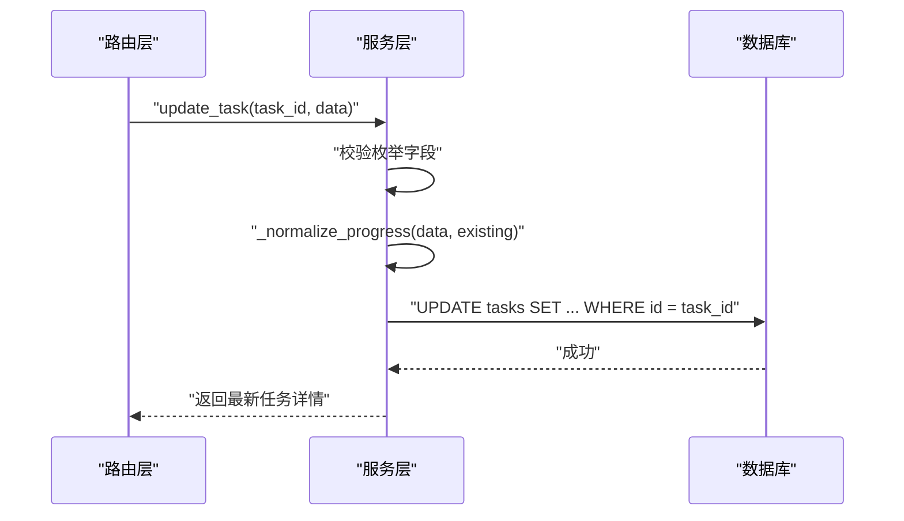
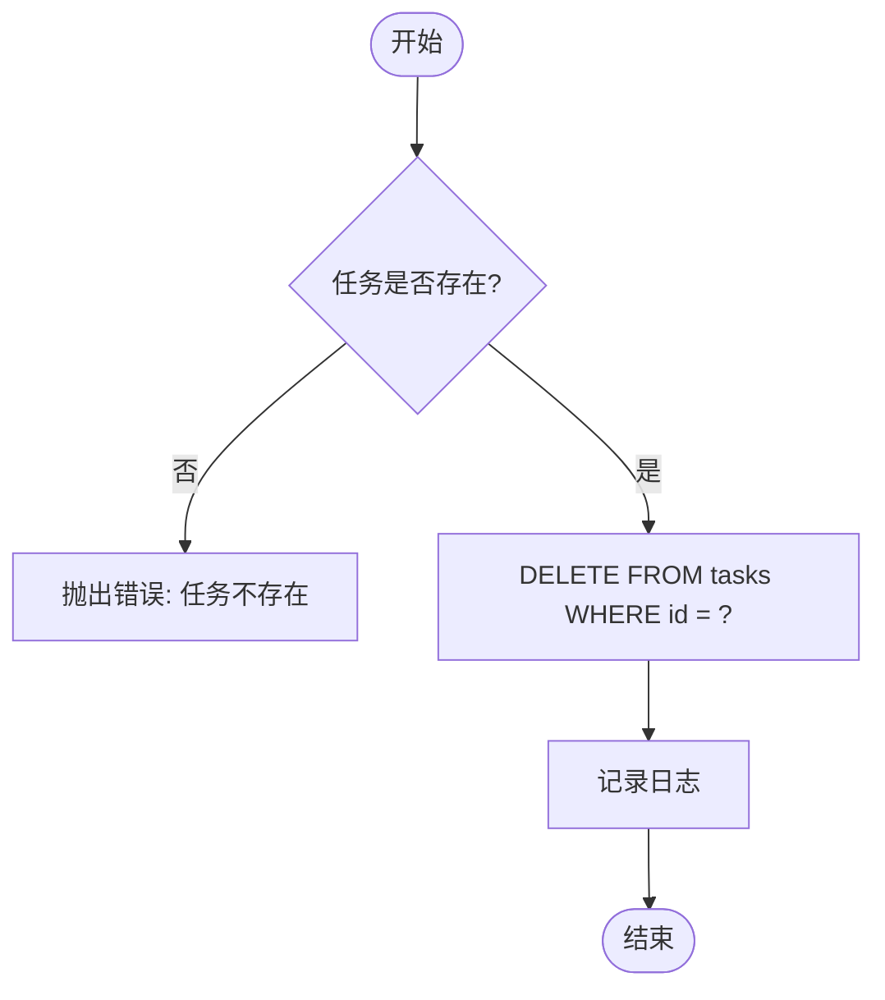
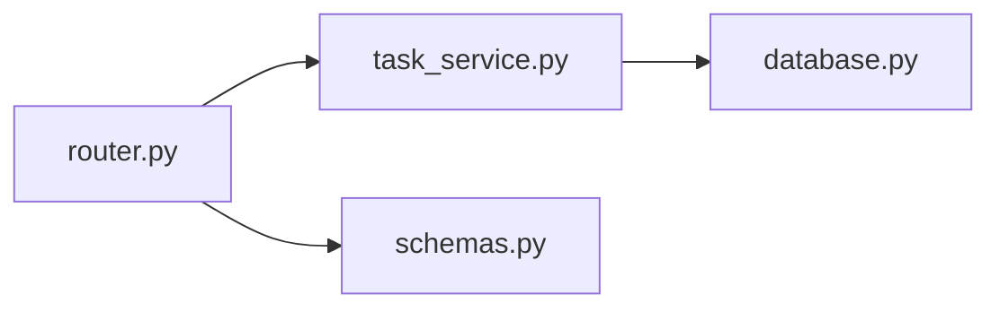

# 任务CRUD操作

<cite>
**本文引用的文件**
- [backend/modules/resource/router.py](file://backend/modules/resource/router.py)
- [backend/modules/resource/services/task_service.py](file://backend/modules/resource/services/task_service.py)
- [backend/modules/resource/schemas.py](file://backend/modules/resource/schemas.py)
- [backend/database.py](file://backend/database.py)
- [static/index.html](file://static/index.html)
</cite>

## 目录
1. [简介](#简介)
2. [项目结构](#项目结构)
3. [核心组件](#核心组件)
4. [架构总览](#架构总览)
5. [详细组件分析](#详细组件分析)
6. [依赖关系分析](#依赖关系分析)
7. [性能考虑](#性能考虑)
8. [故障排查指南](#故障排查指南)
9. [结论](#结论)
10. [附录：API规范与示例](#附录api规范与示例)

## 简介
本技术文档围绕“任务”实体的CRUD（创建、读取、更新、删除）能力，系统阐述后端接口设计、参数校验、查询过滤、分页、进度自动计算、级联删除策略以及错误处理机制。重点覆盖以下函数与接口：
- create_task：任务创建与参数校验
- get_task_list：复杂查询（多条件筛选、分页、关键词搜索）
- update_task：增量更新与进度自动计算
- delete_task：删除任务及数据完整性保护

同时提供完整的API调用示例（请求参数格式、响应数据结构、错误处理），并给出性能优化建议与最佳实践。

## 项目结构
任务相关代码位于资源管理模块下，采用“路由层 + 服务层 + 数据访问层”的分层组织方式：
- 路由层：定义HTTP端点，负责入参解析、异常转换与统一响应封装
- 服务层：实现业务逻辑（校验、计算、统计等）
- 数据访问层：通过数据库工具函数执行SQL

**图表来源**
- [backend/modules/resource/router.py:680-852](file://backend/modules/resource/router.py#L680-L852)
- [backend/modules/resource/services/task_service.py:48-287](file://backend/modules/resource/services/task_service.py#L48-L287)
- [backend/database.py](file://backend/database.py)

**章节来源**
- [backend/modules/resource/router.py:1-200](file://backend/modules/resource/router.py#L1-L200)
- [backend/modules/resource/services/task_service.py:1-48](file://backend/modules/resource/services/task_service.py#L1-L48)

## 核心组件
- 路由层（router.py）
  - GET /tasks/{task_id}：获取单个任务详情
  - POST /tasks：创建任务
  - PUT /tasks/{task_id}：更新任务
  - DELETE /tasks/{task_id}：删除任务
  - GET /tasks/stats、/tasks/status-distribution、/tasks/type-progress、/tasks/monthly-trend、/tasks/gantt：统计与可视化接口
- 服务层（task_service.py）
  - get_task_list：支持多条件筛选、分页、关键词搜索
  - create_task：创建任务，含枚举校验与进度初始化
  - update_task：增量更新，支持进度自动计算
  - delete_task：删除任务
  - 统计类函数：get_task_stats、get_status_distribution、get_type_vs_progress、get_monthly_trend
- 数据模型（schemas.py）
  - TaskCreate、TaskUpdate、TaskResponse、TaskListResponse 等Pydantic模型用于请求/响应结构约束

**章节来源**
- [backend/modules/resource/router.py:680-852](file://backend/modules/resource/router.py#L680-L852)
- [backend/modules/resource/services/task_service.py:48-287](file://backend/modules/resource/services/task_service.py#L48-L287)
- [backend/modules/resource/schemas.py:121-178](file://backend/modules/resource/schemas.py#L121-L178)

## 架构总览
任务CRUD的端到端流程如下：
- 客户端发起HTTP请求到路由层
- 路由层进行参数校验与时间字段格式化，调用服务层
- 服务层执行业务逻辑（校验、计算、统计）
- 服务层通过数据库访问层执行SQL
- 返回统一格式的JSON响应

**图表来源**
- [backend/modules/resource/router.py:702-722](file://backend/modules/resource/router.py#L702-L722)
- [backend/modules/resource/services/task_service.py:177-237](file://backend/modules/resource/services/task_service.py#L177-L237)
- [backend/database.py](file://backend/database.py)

## 详细组件分析

### 创建任务（create_task）
- 功能要点
  - 唯一性校验：任务编号重复将抛出错误
  - 枚举校验：任务类型、优先级、状态、数据来源必须在允许集合内
  - 进度初始化：根据计划工时与实际工时自动计算进度；若开启手动覆盖则保留传入值
  - 默认值：未提供的字段使用默认值（如优先级medium、状态pending、source=manual）
- 关键规则
  - 任务类型：A/B/C/sporadic
  - 优先级：high/medium/low
  - 状态：pending/in_progress/completed/overdue
  - 数据来源：operation/manual/mes
- 异常处理
  - ValueError：参数不合法或重复
  - HTTPException：路由层捕获后转换为400/500

**图表来源**
- [backend/modules/resource/services/task_service.py:177-237](file://backend/modules/resource/services/task_service.py#L177-L237)
- [backend/modules/resource/services/task_service.py:21-45](file://backend/modules/resource/services/task_service.py#L21-L45)

**章节来源**
- [backend/modules/resource/services/task_service.py:177-237](file://backend/modules/resource/services/task_service.py#L177-L237)
- [backend/modules/resource/services/task_service.py:13-18](file://backend/modules/resource/services/task_service.py#L13-L18)
- [backend/modules/resource/router.py:702-722](file://backend/modules/resource/router.py#L702-L722)

### 读取任务列表（get_task_list）
- 功能要点
  - 多条件筛选：任务类型、试制类型、状态、优先级、区域编码、装配场地
  - 关键词搜索：在任务编号、名称、项目号、车辆号、项目组、计划员等多字段模糊匹配
  - 分页：page/page_size，返回total/page/page_size/data
  - 结果规范化：时间字段格式化为字符串，数值字段转为float/int
- 特殊逻辑
  - 试制类型为MT时，使用LIKE 'MT%'匹配前缀
  - 区域编码支持zone_code或assembly_site任一匹配
- 性能注意
  - 动态WHERE拼接，避免空条件
  - 使用LIMIT/OFFSET分页

**图表来源**
- [backend/modules/resource/services/task_service.py:48-146](file://backend/modules/resource/services/task_service.py#L48-L146)

**章节来源**
- [backend/modules/resource/services/task_service.py:48-146](file://backend/modules/resource/services/task_service.py#L48-L146)

### 更新任务（update_task）
- 功能要点
  - 增量更新：仅更新请求中提供的字段
  - 枚举校验：任务类型、状态、优先级必须合法
  - 进度自动计算：当未启用手动覆盖时，根据实际工时与计划工时计算progress，上限100%
  - 更新时间戳：自动设置updated_at
- 异常处理
  - 任务不存在：抛出错误
  - 枚举非法：抛出错误

**图表来源**
- [backend/modules/resource/services/task_service.py:240-277](file://backend/modules/resource/services/task_service.py#L240-L277)
- [backend/modules/resource/services/task_service.py:21-45](file://backend/modules/resource/services/task_service.py#L21-L45)

**章节来源**
- [backend/modules/resource/services/task_service.py:240-277](file://backend/modules/resource/services/task_service.py#L240-L277)
- [backend/modules/resource/services/task_service.py:21-45](file://backend/modules/resource/services/task_service.py#L21-L45)

### 删除任务（delete_task）
- 功能要点
  - 存在性校验：任务不存在则抛出错误
  - 删除策略：当前为直接删除，无级联删除逻辑
  - 日志记录：记录删除操作
- 数据完整性
  - 若存在外键关联，需在数据库层面配置ON DELETE行为或在应用层做前置检查

**图表来源**
- [backend/modules/resource/services/task_service.py:280-287](file://backend/modules/resource/services/task_service.py#L280-L287)

**章节来源**
- [backend/modules/resource/services/task_service.py:280-287](file://backend/modules/resource/services/task_service.py#L280-L287)

## 依赖关系分析
- 路由层依赖服务层：所有任务CRUD均通过路由调用服务层函数
- 服务层依赖数据库访问层：使用query_one/query_all/execute/execute_last_id执行SQL
- 数据模型：Pydantic模型用于请求/响应的结构化约束

**图表来源**
- [backend/modules/resource/router.py:680-852](file://backend/modules/resource/router.py#L680-L852)
- [backend/modules/resource/services/task_service.py:1-10](file://backend/modules/resource/services/task_service.py#L1-L10)
- [backend/modules/resource/schemas.py:121-178](file://backend/modules/resource/schemas.py#L121-L178)

**章节来源**
- [backend/modules/resource/router.py:680-852](file://backend/modules/resource/router.py#L680-L852)
- [backend/modules/resource/services/task_service.py:1-10](file://backend/modules/resource/services/task_service.py#L1-L10)
- [backend/modules/resource/schemas.py:121-178](file://backend/modules/resource/schemas.py#L121-L178)

## 性能考虑
- 查询优化
  - 合理使用索引：对task_code、status、priority、task_type、trial_type、zone_code、assembly_site、created_at建立合适索引
  - 避免全表扫描：关键词搜索尽量限制范围或使用全文检索
  - 分页：确保page_size合理，避免过大导致内存压力
- 写入优化
  - 批量操作：如需批量创建/更新，考虑分批提交事务
  - 减少冗余更新：仅在字段变化时更新
- 缓存策略
  - 统计数据：对高频统计接口（如stats、distribution）可引入短期缓存
- 连接池
  - 确保数据库连接池大小合理，避免连接耗尽

[本节为通用性能建议，无需特定文件引用]

## 故障排查指南
- 常见错误
  - 任务编号重复：检查唯一性约束与业务去重逻辑
  - 枚举非法：确认任务类型、优先级、状态、数据来源是否在允许集合内
  - 任务不存在：检查ID是否正确，或删除后再次访问
- 调试步骤
  - 查看路由层异常捕获与HTTP状态码
  - 检查服务层日志输出（创建/更新/删除日志）
  - 核对数据库记录与字段映射
- 前端联动
  - 前端在加载任务列表时传递筛选参数与分页参数，需确保后端正确接收与处理

**章节来源**
- [backend/modules/resource/router.py:702-771](file://backend/modules/resource/router.py#L702-L771)
- [backend/modules/resource/services/task_service.py:177-287](file://backend/modules/resource/services/task_service.py#L177-L287)
- [static/index.html:8807-8896](file://static/index.html#L8807-L8896)

## 结论
任务CRUD模块采用清晰的分层架构，路由层负责接口契约与异常转换，服务层实现业务规则与数据计算，数据库访问层专注SQL执行。通过严格的参数校验、灵活的查询过滤、自动进度计算与统一的响应格式，提供了稳定可靠的API能力。建议在后续迭代中完善级联删除策略、增强索引设计与引入缓存以提升性能。

[本节为总结性内容，无需特定文件引用]

## 附录：API规范与示例

### 接口清单
- GET /api/resource/tasks/{task_id}：获取单个任务详情
- POST /api/resource/tasks：创建任务
- PUT /api/resource/tasks/{task_id}：更新任务
- DELETE /api/resource/tasks/{task_id}：删除任务
- GET /api/resource/tasks/stats：任务看板KPI统计
- GET /api/resource/tasks/status-distribution：任务状态分布
- GET /api/resource/tasks/type-progress：任务类型与进度对比
- GET /api/resource/tasks/monthly-trend：月度趋势
- GET /api/resource/tasks/gantt：甘特图排程数据（占位实现）

**章节来源**
- [backend/modules/resource/router.py:680-852](file://backend/modules/resource/router.py#L680-L852)

### 请求与响应示例

- 创建任务
  - 方法：POST
  - 路径：/api/resource/tasks
  - 请求体关键字段（参考Pydantic模型）：
    - task_code：必填
    - task_name：必填
    - task_type：可选，默认C，允许A/B/C/sporadic
    - priority：可选，默认medium，允许high/medium/low
    - status：可选，默认pending，允许pending/in_progress/completed/overdue
    - plan_start_time/plan_end_time：可选，datetime
    - summer_target_date：可选，date
    - source：可选，默认manual，允许operation/manual/mes
  - 响应：
    - code：200
    - message：创建任务成功
    - data：新任务详情对象

- 更新任务
  - 方法：PUT
  - 路径：/api/resource/tasks/{task_id}
  - 请求体：仅包含需要更新的字段（exclude_none）
  - 响应：
    - code：200
    - message：更新成功
    - data：最新任务详情

- 删除任务
  - 方法：DELETE
  - 路径：/api/resource/tasks/{task_id}
  - 响应：
    - code：200
    - message：删除成功
    - data：null

- 获取任务列表
  - 方法：GET
  - 路径：/api/resource/tasks
  - 查询参数：
    - page：页码，默认1
    - page_size：每页数量，默认20
    - task_type：任务类型筛选
    - trial_type：试制类型筛选（MT前缀匹配）
    - status：状态筛选
    - priority：优先级筛选
    - zone_code：区域编码筛选（与assembly_site二选一）
    - assembly_site：装配场地筛选
    - keyword：关键词搜索（多字段模糊匹配）
  - 响应：
    - code：200
    - message：获取成功
    - data：{total, page, page_size, data: [...]}

- 错误处理
  - 400：参数校验失败（如枚举非法、任务编号重复、无更新字段）
  - 404：资源不存在（如任务ID不存在）
  - 500：服务器内部错误

**章节来源**
- [backend/modules/resource/router.py:680-852](file://backend/modules/resource/router.py#L680-L852)
- [backend/modules/resource/services/task_service.py:177-287](file://backend/modules/resource/services/task_service.py#L177-L287)
- [backend/modules/resource/schemas.py:121-178](file://backend/modules/resource/schemas.py#L121-L178)

### 前端调用示例（片段说明）
- 前端在任务页面中收集筛选条件（keyword、task_type、trial_type、status、priority、zone_code），构造URLSearchParams并调用任务列表接口
- 分页控制通过tmPage与tmPageSize变量管理，并在渲染表格时显示页码信息

**章节来源**
- [static/index.html:8807-8896](file://static/index.html#L8807-L8896)