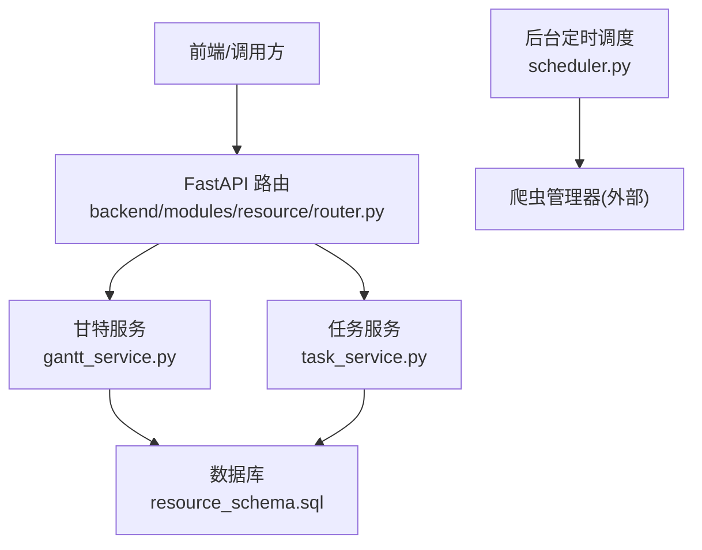
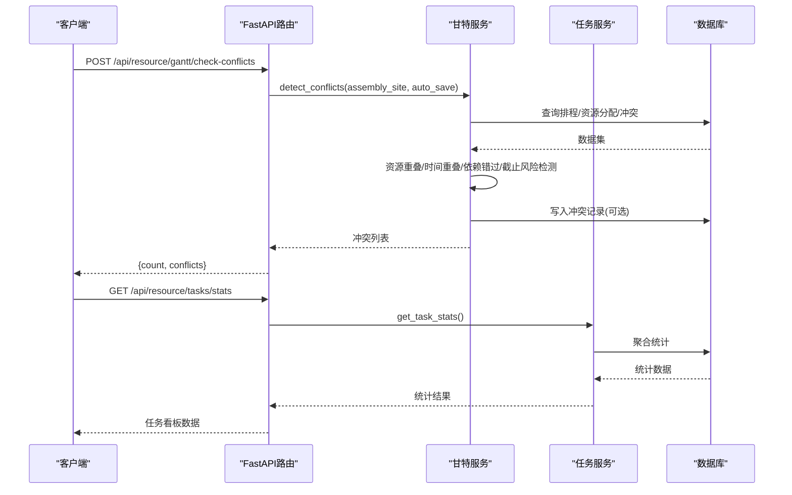
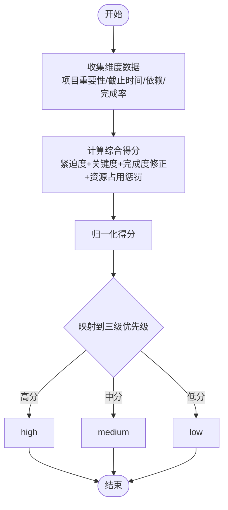
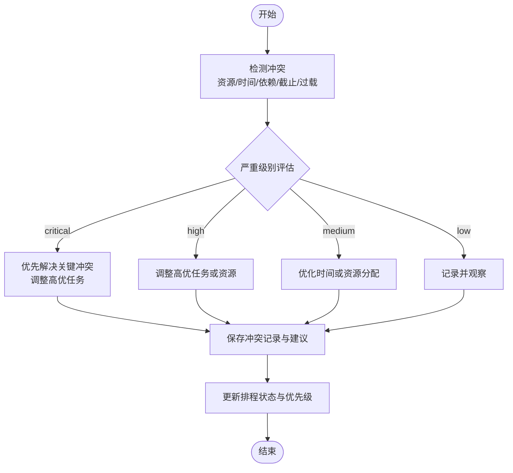
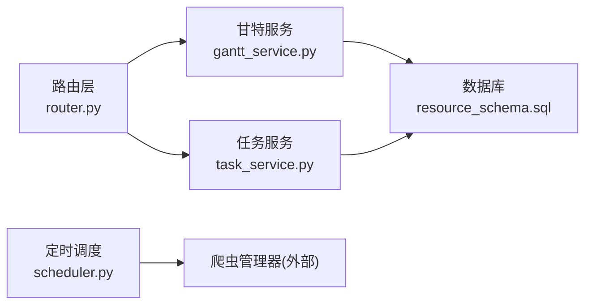

# 任务优先级调度

<cite>
**本文引用的文件**
- [backend/modules/resource/services/gantt_service.py](file://backend/modules/resource/services/gantt_service.py)
- [backend/modules/resource/router.py](file://backend/modules/resource/router.py)
- [backend/sql/resource_schema.sql](file://backend/sql/resource_schema.sql)
- [backend/scheduling/scheduler.py](file://backend/scheduling/scheduler.py)
- [backend/scheduling/router.py](file://backend/scheduling/router.py)
- [backend/modules/resource/services/task_service.py](file://backend/modules/resource/services/task_service.py)
</cite>

## 目录
1. [引言](#引言)
2. [项目结构](#项目结构)
3. [核心组件](#核心组件)
4. [架构总览](#架构总览)
5. [详细组件分析](#详细组件分析)
6. [依赖关系分析](#依赖关系分析)
7. [性能考量](#性能考量)
8. [故障排查指南](#故障排查指南)
9. [结论](#结论)
10. [附录](#附录)

## 引言
本文件围绕“任务优先级调度”的算法与实现进行系统化说明，重点覆盖：
- 三级优先级体系（high/medium/low）的设计原理与应用场景
- 优先级计算的多维因素（项目重要性、截止时间紧迫性、资源依赖、历史完成率等）
- 动态优先级调整机制（基于执行进度、资源占用、外部环境变化）
- 优先级冲突解决策略（多高优任务竞争同一资源的分配算法）
- 可视化展示方案（优先级矩阵、热力图、甘特图等）
- 自定义规则与权重调整方法

本项目的后端已具备排程、冲突检测、关键路径计算、任务与资源管理等基础能力，可作为优先级调度的数据与逻辑支撑。

## 项目结构
与优先级调度直接相关的代码与数据主要分布在以下位置：
- 服务层：gantt_service.py（甘特排程、冲突检测、关键路径）、task_service.py（任务CRUD与统计）
- 路由层：router.py（对外API暴露，含冲突检测接口）
- 数据库：resource_schema.sql（任务、排程、资源分配、冲突表结构）
- 定时调度：scheduler.py（后台定时任务，非优先级调度主流程但提供运行态信息）
- 模块路由：scheduling/router.py（占位路由，用于模块就绪检查）

图表来源
- [backend/modules/resource/router.py:1347-1375](file://backend/modules/resource/router.py#L1347-L1375)
- [backend/modules/resource/services/gantt_service.py:775-1076](file://backend/modules/resource/services/gantt_service.py#L775-L1076)
- [backend/modules/resource/services/task_service.py:48-146](file://backend/modules/resource/services/task_service.py#L48-L146)
- [backend/sql/resource_schema.sql:204-325](file://backend/sql/resource_schema.sql#L204-L325)
- [backend/scheduling/scheduler.py:16-196](file://backend/scheduling/scheduler.py#L16-L196)

章节来源
- [backend/modules/resource/router.py:1347-1375](file://backend/modules/resource/router.py#L1347-L1375)
- [backend/modules/resource/services/gantt_service.py:775-1076](file://backend/modules/resource/services/gantt_service.py#L775-L1076)
- [backend/modules/resource/services/task_service.py:48-146](file://backend/modules/resource/services/task_service.py#L48-L146)
- [backend/sql/resource_schema.sql:204-325](file://backend/sql/resource_schema.sql#L204-L325)
- [backend/scheduling/scheduler.py:16-196](file://backend/scheduling/scheduler.py#L16-L196)

## 核心组件
- 三级优先级体系
  - 枚举值：high/medium/low，存在于任务表与排程表中，作为排序与筛选的基础维度
  - 用途：任务列表排序、看板统计、冲突严重度参考、可视化着色
- 排程与资源分配
  - 排程记录包含计划起止时间、阶段、前置依赖、是否关键路径、松弛小时等
  - 资源分配记录将具体资源（设备/人员/区域/吊车/物料/其他）与时间段绑定
- 冲突检测
  - 资源重叠、时间重叠、依赖错过、截止风险、过载等类型
  - 严重级别：critical/high/medium/low，并生成处理建议
- 关键路径计算
  - 基于拓扑排序与最早/最晚开始结束时间，标记关键任务与松弛小时
- 任务统计
  - 按状态、优先级、类型、场地等多维度聚合，支持趋势与分布展示

章节来源
- [backend/sql/resource_schema.sql:71-109](file://backend/sql/resource_schema.sql#L71-L109)
- [backend/sql/resource_schema.sql:204-325](file://backend/sql/resource_schema.sql#L204-L325)
- [backend/modules/resource/services/gantt_service.py:176-258](file://backend/modules/resource/services/gantt_service.py#L176-L258)
- [backend/modules/resource/services/gantt_service.py:1255-1372](file://backend/modules/resource/services/gantt_service.py#L1255-L1372)
- [backend/modules/resource/services/task_service.py:290-332](file://backend/modules/resource/services/task_service.py#L290-L332)

## 架构总览
优先级调度由“数据层 + 服务层 + 路由层 + 可视化层”构成：
- 数据层：任务、排程、资源分配、冲突等表提供结构化数据
- 服务层：计算优先级、检测冲突、计算关键路径、更新状态
- 路由层：暴露REST API供前端或外部系统调用
- 可视化层：通过甘特图、热力图、优先级矩阵等呈现调度结果

图表来源
- [backend/modules/resource/router.py:1347-1375](file://backend/modules/resource/router.py#L1347-L1375)
- [backend/modules/resource/services/gantt_service.py:775-1076](file://backend/modules/resource/services/gantt_service.py#L775-L1076)
- [backend/modules/resource/services/task_service.py:290-332](file://backend/modules/resource/services/task_service.py#L290-L332)

## 详细组件分析

### 三级优先级体系设计
- 定义与存储
  - 任务表与排程表均包含优先级字段，取值 high/medium/low
  - 支持按优先级筛选、排序与统计
- 应用场景
  - 任务列表默认按优先级降序显示
  - 看板中统计各优先级数量，辅助管理决策
  - 冲突严重度与优先级联动（高优任务冲突优先处理）
- 扩展点
  - 可在服务层增加“综合评分”字段，结合多维因素计算后映射到三级优先级
  - 在排序时优先使用综合评分，再回退到原始优先级

章节来源
- [backend/sql/resource_schema.sql:71-109](file://backend/sql/resource_schema.sql#L71-L109)
- [backend/sql/resource_schema.sql:204-325](file://backend/sql/resource_schema.sql#L204-L325)
- [backend/modules/resource/services/task_service.py:48-146](file://backend/modules/resource/services/task_service.py#L48-L146)

### 优先级计算算法（多维度）
当前仓库未提供显式的“综合评分”函数，但可基于现有字段与服务能力构建如下算法：
- 输入维度
  - 项目重要性：可通过项目群、车型、试制类别等字段体现
  - 截止时间紧迫性：plan_end_time、status（overdue/in_progress/pending）
  - 资源依赖关系：predecessor_ids、is_critical、slack_hours
  - 历史完成率：progress、actual_work_hours、plan_work_hours
- 计算步骤
  - 紧迫度得分：根据距离截止时间的天数与状态加权
  - 依赖关键度：若处于关键路径或松弛小时接近0，则提高得分
  - 完成度修正：实际工时/计划工时的比例影响得分（避免过早提升未完成任务）
  - 资源占用：若存在资源冲突或过载，适当降低得分以避免加剧冲突
- 输出映射
  - 将综合得分归一化后映射到 high/medium/low
  - 同时保留原始优先级字段以兼容现有逻辑

[此图为概念流程图，不直接对应具体源码]

### 动态优先级调整机制
- 触发条件
  - 任务执行进度变化：in_progress/completed/overdue
  - 资源占用情况：新增/释放资源分配，出现/消除冲突
  - 外部环境变化：SLA阈值、截止日期提前、关键路径变更
- 调整策略
  - 进度推进：对即将超期的任务提升优先级
  - 冲突缓解：对引发资源冲突的任务临时降级，待冲突解决后再恢复
  - 关键路径维护：对关键路径上的任务保持高优先级
- 实现要点
  - 在冲突检测与关键路径计算后，批量更新任务的优先级或综合评分
  - 提供配置开关，允许管理员调整权重与阈值

章节来源
- [backend/modules/resource/services/gantt_service.py:775-1076](file://backend/modules/resource/services/gantt_service.py#L775-L1076)
- [backend/modules/resource/services/gantt_service.py:1255-1372](file://backend/modules/resource/services/gantt_service.py#L1255-L1372)
- [backend/modules/resource/services/task_service.py:290-332](file://backend/modules/resource/services/task_service.py#L290-L332)

### 优先级冲突解决策略
- 冲突类型
  - 资源重叠：同一资源在同一时间段被多个任务占用
  - 时间重叠：同一场地/区域的两个任务时间重叠
  - 依赖错过：前置任务结束时间晚于后置任务开始时间
  - 截止风险：任务超过截止日期仍未完成
  - 过载：资源分配过多导致整体产能不足
- 解决算法
  - 资源重叠：按优先级与关键路径决定保留哪个任务；必要时拆分或改期
  - 时间重叠：错开同一场地的任务时间，减少重叠小时数
  - 依赖错过：调整前置任务结束时间或延后后置任务开始时间
  - 截止风险：加快进度或拆分关键环节，优先保障高优任务
  - 过载：重新分配资源或延长计划工时
- 严重级别与建议
  - critical/high/medium/low，并提供处理建议文本
  - 自动保存冲突记录，便于追踪与审计

图表来源
- [backend/modules/resource/services/gantt_service.py:808-1076](file://backend/modules/resource/services/gantt_service.py#L808-L1076)

章节来源
- [backend/modules/resource/services/gantt_service.py:808-1076](file://backend/modules/resource/services/gantt_service.py#L808-L1076)

### 可视化展示方案
- 优先级矩阵
  - 横轴：任务类型（A/B/C/sporadic），纵轴：优先级（high/medium/low）
  - 单元格内显示任务数量与平均进度
- 热力图
  - 横轴：日期，纵轴：装配场地或资源
  - 颜色深浅表示资源占用强度或冲突严重度
- 甘特图
  - 展示任务计划起止时间、阶段、关键路径、冲突标记
  - 支持按优先级、状态、场地筛选
- 数据来源与接口
  - 任务列表与统计：/api/resource/tasks、/api/resource/tasks/stats
  - 排程数据与冲突：/api/resource/gantt/check-conflicts、/api/resource/gantt/conflicts

章节来源
- [backend/modules/resource/router.py:646-786](file://backend/modules/resource/router.py#L646-L786)
- [backend/modules/resource/router.py:1347-1375](file://backend/modules/resource/router.py#L1347-L1375)
- [backend/modules/resource/services/gantt_service.py:176-258](file://backend/modules/resource/services/gantt_service.py#L176-L258)
- [backend/modules/resource/services/task_service.py:290-332](file://backend/modules/resource/services/task_service.py#L290-L332)

### 自定义规则与权重调整
- 规则配置
  - 可新增“综合评分”字段，存储计算后的数值
  - 提供配置项：紧迫度权重、关键路径权重、完成度权重、资源占用惩罚系数
- 权重调整方法
  - 在服务层增加参数化计算函数，支持热更新权重
  - 在冲突检测与关键路径计算后，依据权重重新评估优先级
- 验证与回滚
  - 提供测试接口，模拟不同权重下的优先级变化
  - 支持回滚到上一版权重配置

[本节为概念性内容，不直接引用具体源码]

## 依赖关系分析
- 服务间依赖
  - 路由层依赖甘特服务与任务服务
  - 甘特服务依赖数据库表结构与查询工具
  - 任务服务依赖数据库表结构与查询工具
- 数据依赖
  - tasks、gantt_schedules、gantt_resource_allocations、gantt_conflicts
- 外部依赖
  - 定时调度器与爬虫管理器（非优先级调度主流程）

图表来源
- [backend/modules/resource/router.py:1347-1375](file://backend/modules/resource/router.py#L1347-L1375)
- [backend/modules/resource/services/gantt_service.py:775-1076](file://backend/modules/resource/services/gantt_service.py#L775-L1076)
- [backend/modules/resource/services/task_service.py:48-146](file://backend/modules/resource/services/task_service.py#L48-L146)
- [backend/sql/resource_schema.sql:204-325](file://backend/sql/resource_schema.sql#L204-L325)
- [backend/scheduling/scheduler.py:16-196](file://backend/scheduling/scheduler.py#L16-L196)

章节来源
- [backend/modules/resource/router.py:1347-1375](file://backend/modules/resource/router.py#L1347-L1375)
- [backend/modules/resource/services/gantt_service.py:775-1076](file://backend/modules/resource/services/gantt_service.py#L775-L1076)
- [backend/modules/resource/services/task_service.py:48-146](file://backend/modules/resource/services/task_service.py#L48-L146)
- [backend/sql/resource_schema.sql:204-325](file://backend/sql/resource_schema.sql#L204-L325)
- [backend/scheduling/scheduler.py:16-196](file://backend/scheduling/scheduler.py#L16-L196)

## 性能考量
- 冲突检测复杂度
  - 资源重叠检测为O(n^2)，需关注大数据量下的性能
  - 建议：分页查询、索引优化、增量检测
- 关键路径计算
  - 拓扑排序与最早/最晚时间计算为线性复杂度，整体效率较高
- 数据库查询
  - 合理使用索引（如优先级、状态、场地、时间字段）
  - 避免全表扫描，采用条件过滤与分页

[本节为通用性能指导，不直接引用具体源码]

## 故障排查指南
- 冲突检测失败
  - 检查数据库连接与表结构
  - 查看日志中的异常堆栈
- 关键路径计算异常
  - 确认前置依赖无环
  - 检查计划时间与工时字段的有效性
- 任务统计不准确
  - 校验进度计算逻辑（自动/手动覆盖）
  - 确认状态与时间字段的正确性

章节来源
- [backend/modules/resource/services/gantt_service.py:1079-1142](file://backend/modules/resource/services/gantt_service.py#L1079-L1142)
- [backend/modules/resource/services/gantt_service.py:1159-1252](file://backend/modules/resource/services/gantt_service.py#L1159-L1252)
- [backend/modules/resource/services/task_service.py:21-45](file://backend/modules/resource/services/task_service.py#L21-L45)

## 结论
本项目已具备任务优先级调度的基础能力，包括三级优先级体系、冲突检测、关键路径计算与可视化接口。通过引入综合评分与动态调整机制，可进一步提升调度效果与资源利用率。建议在后续迭代中完善权重配置与测试验证，确保调度策略的可控性与可解释性。

## 附录
- 相关API
  - 冲突检测：POST /api/resource/gantt/check-conflicts
  - 冲突列表：GET /api/resource/gantt/conflicts
  - 任务列表：GET /api/resource/tasks
  - 任务统计：GET /api/resource/tasks/stats
- 数据表
  - tasks、gantt_schedules、gantt_resource_allocations、gantt_conflicts

章节来源
- [backend/modules/resource/router.py:1347-1375](file://backend/modules/resource/router.py#L1347-L1375)
- [backend/modules/resource/router.py:646-786](file://backend/modules/resource/router.py#L646-L786)
- [backend/sql/resource_schema.sql:204-325](file://backend/sql/resource_schema.sql#L204-L325)