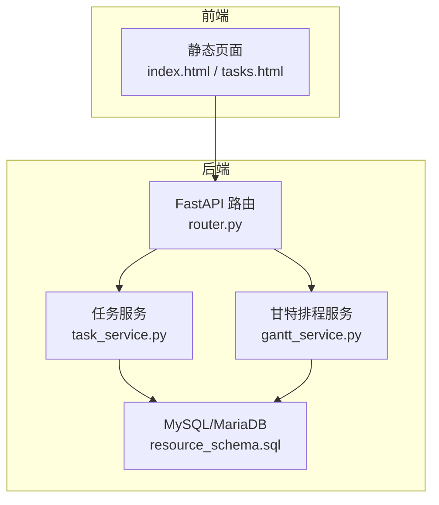
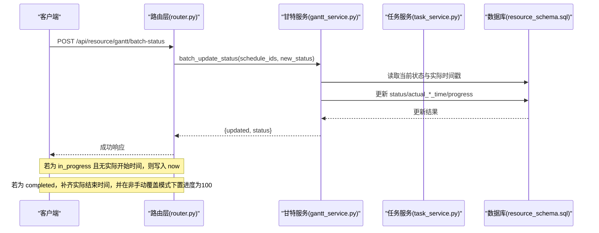
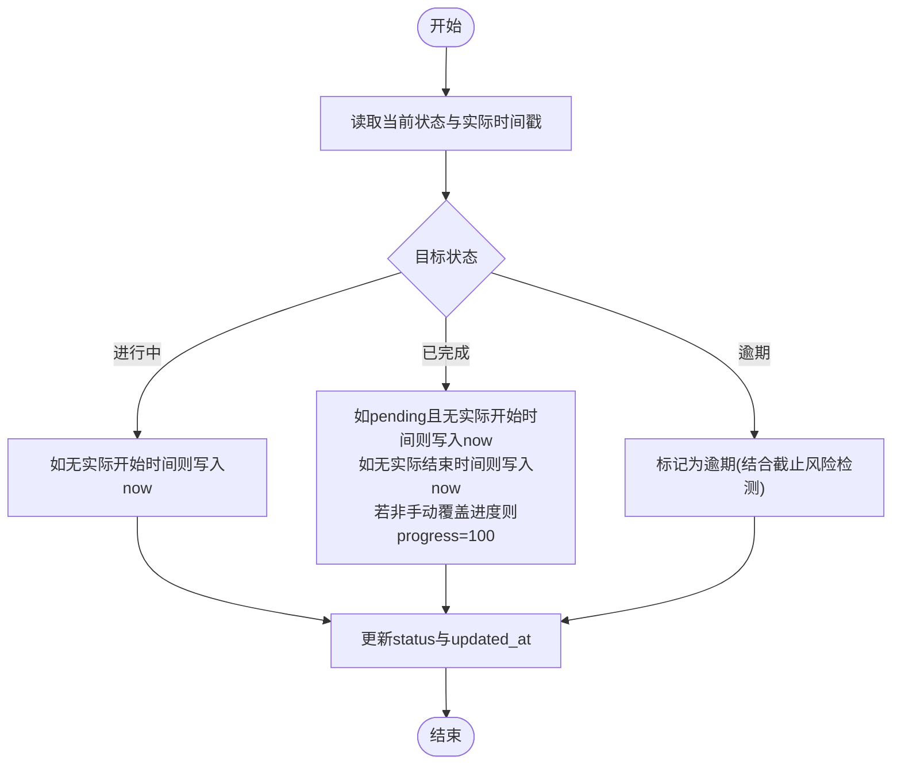
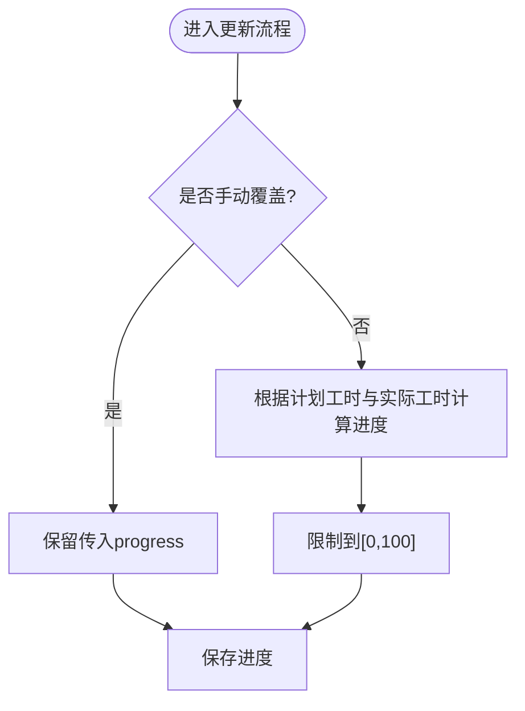
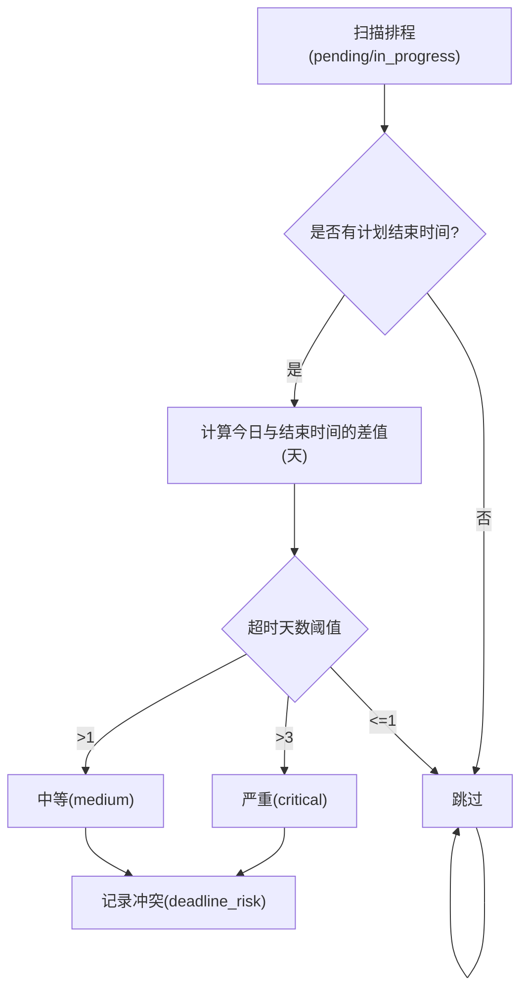
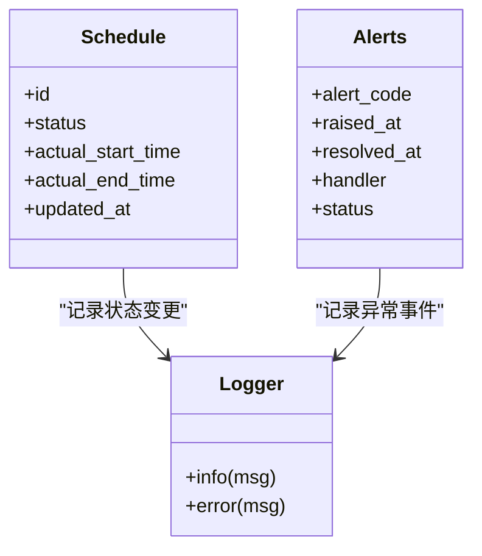
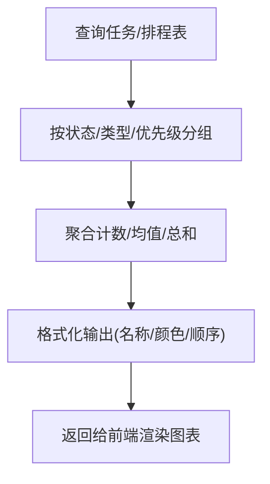
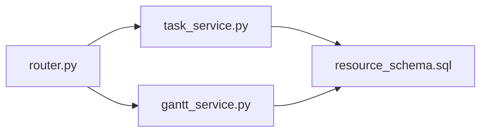

# 任务状态管理

<cite>
**本文引用的文件**
- [task_service.py](file://backend/modules/resource/services/task_service.py)
- [gantt_service.py](file://backend/modules/resource/services/gantt_service.py)
- [router.py](file://backend/modules/resource/router.py)
- [schemas.py](file://backend/modules/resource/schemas.py)
- [resource_schema.sql](file://backend/sql/resource_schema.sql)
- [scheduler.py](file://backend/scheduling/scheduler.py)
- [alert_service.py](file://backend/modules/resource/services/alert_service.py)
- [index.html](file://static/index.html)
- [tasks.html](file://demo/tasks.html)
</cite>

## 目录
1. [简介](#简介)
2. [项目结构](#项目结构)
3. [核心组件](#核心组件)
4. [架构总览](#架构总览)
5. [详细组件分析](#详细组件分析)
6. [依赖关系分析](#依赖关系分析)
7. [性能考虑](#性能考虑)
8. [故障排查指南](#故障排查指南)
9. [结论](#结论)
10. [附录](#附录)

## 简介
本业务文档聚焦“任务状态管理”，围绕四种状态（pending 待开始、in_progress 进行中、completed 已完成、overdue 逾期）的流转规则与自动转换逻辑展开，说明如何基于时间戳与进度进行逾期检测与完成判断；解释状态与业务场景（任务类型、优先级、资源可用性）的动态映射；描述状态变更审计与可追溯机制；给出状态监控与统计的实现方案（分布图、趋势、异常预警）；并提供配置选项与扩展点建议。

## 项目结构
后端以 FastAPI 路由层暴露接口，服务层封装业务逻辑，数据库通过 SQL 定义表结构与索引。任务与排程的状态字段分别位于 tasks 与 gantt_schedules 表中；状态更新由批量接口驱动，并附带实际起止时间戳与进度自动计算；统计与分布查询由服务层聚合；前端页面提供可视化与交互入口。

**图表来源**
- [router.py:1200-1454](file://backend/modules/resource/router.py#L1200-L1454)
- [task_service.py:48-146](file://backend/modules/resource/services/task_service.py#L48-L146)
- [gantt_service.py:176-258](file://backend/modules/resource/services/gantt_service.py#L176-L258)
- [resource_schema.sql:71-109](file://backend/sql/resource_schema.sql#L71-L109)
- [resource_schema.sql:204-259](file://backend/sql/resource_schema.sql#L204-L259)

**章节来源**
- [router.py:1200-1454](file://backend/modules/resource/router.py#L1200-L1454)
- [resource_schema.sql:71-109](file://backend/sql/resource_schema.sql#L71-L109)
- [resource_schema.sql:204-259](file://backend/sql/resource_schema.sql#L204-L259)

## 核心组件
- 任务服务（task_service.py）：负责任务 CRUD、进度归一化、任务看板统计、状态分布与月度趋势等。
- 甘特排程服务（gantt_service.py）：负责排程 CRUD、依赖与关键路径计算、冲突检测、批量状态更新（含自动时间戳与进度处理）。
- 路由层（router.py）：对外暴露排程列表、详情、创建/更新/删除、依赖设置、冲突检测、关键路径计算、批量状态更新等接口。
- 数据模型（schemas.py）：定义任务与排程请求/响应结构，约束状态枚举值。
- 数据库（resource_schema.sql）：定义 tasks 与 gantt_schedules 表结构及索引，支撑状态、进度、时间戳与关联关系查询。

**章节来源**
- [task_service.py:13-17](file://backend/modules/resource/services/task_service.py#L13-L17)
- [gantt_service.py:15-23](file://backend/modules/resource/services/gantt_service.py#L15-L23)
- [schemas.py:123-177](file://backend/modules/resource/schemas.py#L123-L177)
- [resource_schema.sql:71-109](file://backend/sql/resource_schema.sql#L71-L109)
- [resource_schema.sql:204-259](file://backend/sql/resource_schema.sql#L204-L259)

## 架构总览
任务与排程的状态管理遵循“路由层接收请求 -> 服务层校验与计算 -> 数据库持久化”的分层模式。状态变更时，服务层会：
- 校验状态枚举合法性
- 根据目标状态自动填充 actual_start_time / actual_end_time
- 在未完成且未手动覆盖进度的情况下，将 completed 状态与 progress=100 联动
- 支持批量更新，减少多次往返

**图表来源**
- [router.py:1410-1419](file://backend/modules/resource/router.py#L1410-L1419)
- [gantt_service.py:1375-1421](file://backend/modules/resource/services/gantt_service.py#L1375-L1421)
- [resource_schema.sql:204-259](file://backend/sql/resource_schema.sql#L204-L259)

## 详细组件分析

### 状态机与转换规则
- 允许状态集合
  - 任务：pending、in_progress、completed、overdue
  - 排程：pending、in_progress、completed、overdue、cancelled
- 触发条件与自动行为
  - in_progress：进入进行中时，若无 actual_start_time，则自动记录当前时间
  - completed：进入已完成时，若 pending 且无 actual_start_time，则回填开始时间；若无 actual_end_time，则记录结束时间；若非手动覆盖进度，则将 progress 置为 100
  - overdue：作为业务态之一，用于标识计划超期或风险任务；系统通过截止日期风险检测生成相关冲突与建议
- 批量更新
  - 支持对多个 schedule_id 统一切换状态，内部逐条应用上述自动规则

**图表来源**
- [gantt_service.py:1375-1421](file://backend/modules/resource/services/gantt_service.py#L1375-L1421)
- [resource_schema.sql:204-259](file://backend/sql/resource_schema.sql#L204-L259)

**章节来源**
- [gantt_service.py:1375-1421](file://backend/modules/resource/services/gantt_service.py#L1375-L1421)
- [resource_schema.sql:204-259](file://backend/sql/resource_schema.sql#L204-L259)

### 进度自动计算与手动覆盖
- 自动计算：当 plan_work_hours > 0 且存在 actual_work_hours 时，progress = min(round(actual/plan*100), 100)
- 手动覆盖：当 progress_manual_override=1 时，保留传入的 progress，不再自动覆盖
- 默认值：新建时若无进度则初始化为 0

**图表来源**
- [task_service.py:21-45](file://backend/modules/resource/services/task_service.py#L21-L45)
- [gantt_service.py:100-141](file://backend/modules/resource/services/gantt_service.py#L100-L141)

**章节来源**
- [task_service.py:21-45](file://backend/modules/resource/services/task_service.py#L21-L45)
- [gantt_service.py:100-141](file://backend/modules/resource/services/gantt_service.py#L100-L141)

### 逾期检测与截止风险
- 截止日期风险：对 pending/in_progress 的任务，若 plan_end_time 早于今天超过阈值（例如 1~3 天），则判定为 deadline_risk，严重级别按超时天数分级，并生成冲突记录与建议
- 前端展示：静态页面中根据进度与计划结束时间推断状态（包含 overdue），并汇总统计

**图表来源**
- [gantt_service.py:934-971](file://backend/modules/resource/services/gantt_service.py#L934-L971)
- [index.html:10510-10523](file://static/index.html#L10510-L10523)

**章节来源**
- [gantt_service.py:934-971](file://backend/modules/resource/services/gantt_service.py#L934-L971)
- [index.html:10510-10523](file://static/index.html#L10510-L10523)

### 状态与业务场景映射
- 任务类型：A/B/C/sporadic，影响颜色与排序、统计分组
- 优先级：high/medium/low，影响筛选与看板高亮
- 资源可用性：通过资源分配与冲突检测间接影响状态（如 deadline_risk 提示需加快或拆分）
- 装配场地：按 assembly_site 维度进行筛选与统计

**章节来源**
- [gantt_service.py:15-23](file://backend/modules/resource/services/gantt_service.py#L15-L23)
- [resource_schema.sql:204-259](file://backend/sql/resource_schema.sql#L204-L259)

### 审计日志与可追溯性
- 系统日志：服务层使用 logger 记录创建、更新、删除、批量状态更新等操作，便于问题定位
- 预警与冲突：alerts 表记录异常事件（含 SLA、升级、处理人、时间戳等），支持追踪与闭环
- 前端审计页：提供操作日志列表与过滤能力（参考 webui_ref 中的审计页面组件）

**图表来源**
- [gantt_service.py:1375-1421](file://backend/modules/resource/services/gantt_service.py#L1375-L1421)
- [alert_service.py:207-236](file://backend/modules/resource/services/alert_service.py#L207-L236)
- [resource_schema.sql:114-163](file://backend/sql/resource_schema.sql#L114-L163)

**章节来源**
- [gantt_service.py:1375-1421](file://backend/modules/resource/services/gantt_service.py#L1375-L1421)
- [alert_service.py:207-236](file://backend/modules/resource/services/alert_service.py#L207-L236)
- [resource_schema.sql:114-163](file://backend/sql/resource_schema.sql#L114-L163)

### 状态监控与统计
- 任务看板 KPI：统计总数、各状态数量、优先级分布、类型分布、计划/实际工时、平均进度
- 状态分布：返回饼图所需的数据（名称、数值、颜色）
- 月度趋势：按月份统计任务数量与完成数
- 甘特统计：包含本周新增/结束、关键路径数量、开放冲突数、站点/阶段分布、近8周趋势

**图表来源**
- [task_service.py:290-332](file://backend/modules/resource/services/task_service.py#L290-L332)
- [task_service.py:335-395](file://backend/modules/resource/services/task_service.py#L335-L395)
- [gantt_service.py:269-335](file://backend/modules/resource/services/gantt_service.py#L269-L335)

**章节来源**
- [task_service.py:290-332](file://backend/modules/resource/services/task_service.py#L290-L332)
- [task_service.py:335-395](file://backend/modules/resource/services/task_service.py#L335-L395)
- [gantt_service.py:269-335](file://backend/modules/resource/services/gantt_service.py#L269-L335)

### 配置选项与自定义扩展点
- 状态枚举：可在服务层常量中扩展新状态（如 cancelled），并在路由与数据库层面同步
- 进度计算策略：通过 progress_manual_override 控制是否启用自动计算
- 逾期阈值：deadline_risk 的阈值可按业务需求调整（当前实现按天数分级）
- 统计口径：可按 assembly_site、phase、task_type 等多维聚合
- 扩展点建议：
  - 增加状态转换规则引擎（如基于规则表配置不同任务类型的允许转换）
  - 引入审计日志表（记录状态变更前后快照、操作人、原因）
  - 增加定时任务（结合 scheduler.py）定期执行逾期检测与状态修正

**章节来源**
- [gantt_service.py:15-23](file://backend/modules/resource/services/gantt_service.py#L15-L23)
- [task_service.py:13-17](file://backend/modules/resource/services/task_service.py#L13-L17)
- [scheduler.py:16-74](file://backend/scheduling/scheduler.py#L16-L74)

## 依赖关系分析
- 路由层依赖服务层：所有状态相关接口均委托至 task_service 与 gantt_service
- 服务层依赖数据库：通过 SQL 直接读写 tasks 与 gantt_schedules，并利用索引优化查询
- 服务层内部依赖：进度归一化、冲突检测、关键路径计算等函数被多处复用

**图表来源**
- [router.py:1200-1454](file://backend/modules/resource/router.py#L1200-L1454)
- [task_service.py:48-146](file://backend/modules/resource/services/task_service.py#L48-L146)
- [gantt_service.py:176-258](file://backend/modules/resource/services/gantt_service.py#L176-L258)
- [resource_schema.sql:71-109](file://backend/sql/resource_schema.sql#L71-L109)
- [resource_schema.sql:204-259](file://backend/sql/resource_schema.sql#L204-L259)

**章节来源**
- [router.py:1200-1454](file://backend/modules/resource/router.py#L1200-L1454)
- [task_service.py:48-146](file://backend/modules/resource/services/task_service.py#L48-L146)
- [gantt_service.py:176-258](file://backend/modules/resource/services/gantt_service.py#L176-L258)
- [resource_schema.sql:71-109](file://backend/sql/resource_schema.sql#L71-L109)
- [resource_schema.sql:204-259](file://backend/sql/resource_schema.sql#L204-L259)

## 性能考虑
- 索引利用：tasks 与 gantt_schedules 针对 status、priority、assembly_site、plan_start_time、plan_end_time 建立索引，提升筛选与范围查询效率
- 批量更新：batch_update_status 减少多次往返，降低网络开销
- 统计聚合：按组聚合与窗口计算（如近8周趋势）在服务层完成，避免前端重复计算
- 冲突检测：仅对非取消状态的排程进行扫描，减少无效计算

**章节来源**
- [resource_schema.sql:104-108](file://backend/sql/resource_schema.sql#L104-L108)
- [resource_schema.sql:249-258](file://backend/sql/resource_schema.sql#L249-L258)
- [gantt_service.py:1375-1421](file://backend/modules/resource/services/gantt_service.py#L1375-L1421)
- [gantt_service.py:775-800](file://backend/modules/resource/services/gantt_service.py#L775-L800)

## 故障排查指南
- 状态更新失败：检查路由参数与请求体是否符合 schemas 定义；确认目标状态在枚举范围内
- 进度未更新：确认 progress_manual_override 是否为 1；检查 plan_work_hours 与 actual_work_hours 是否有效
- 逾期未识别：核对 plan_end_time 与当前日期；检查 deadline_risk 阈值逻辑
- 冲突未生成：确认是否已调用冲突检测接口；检查 assembly_site 筛选条件
- 日志定位：查看服务层日志输出，定位具体错误堆栈

**章节来源**
- [schemas.py:123-177](file://backend/modules/resource/schemas.py#L123-L177)
- [gantt_service.py:1375-1421](file://backend/modules/resource/services/gantt_service.py#L1375-L1421)
- [gantt_service.py:934-971](file://backend/modules/resource/services/gantt_service.py#L934-L971)

## 结论
本系统实现了任务与排程的状态管理闭环：通过路由层暴露批量状态更新接口，服务层依据目标状态自动维护实际起止时间与进度，并结合截止日期风险检测生成逾期预警；同时提供丰富的统计与可视化能力，支撑运营决策。建议在后续迭代中引入更灵活的状态规则引擎与审计日志表，进一步提升可配置性与可追溯性。

## 附录
- 前端交互示例：tasks.html 提供状态下拉切换与简单状态流转演示
- 静态页面统计：index.html 根据进度与计划时间推断状态并汇总统计

**章节来源**
- [tasks.html:959-999](file://demo/tasks.html#L959-L999)
- [index.html:10510-10523](file://static/index.html#L10510-L10523)
- [index.html:10674-10687](file://static/index.html#L10674-L10687)