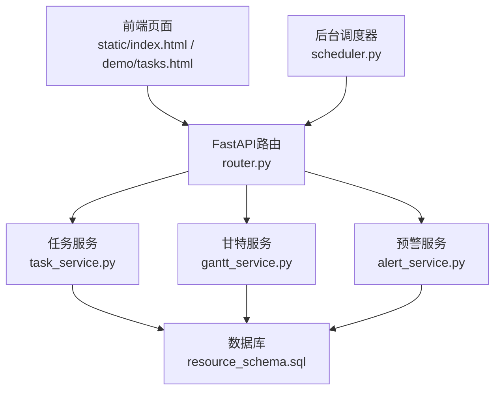
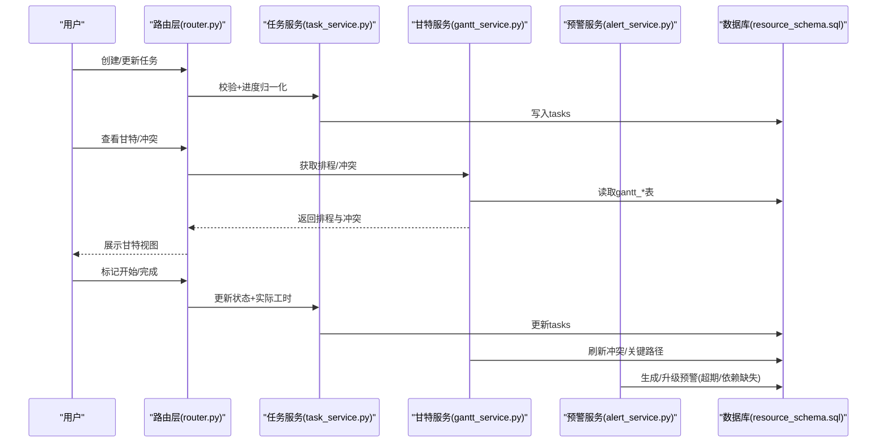
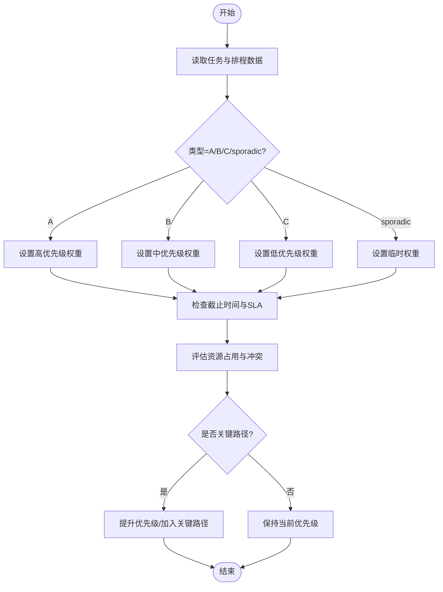
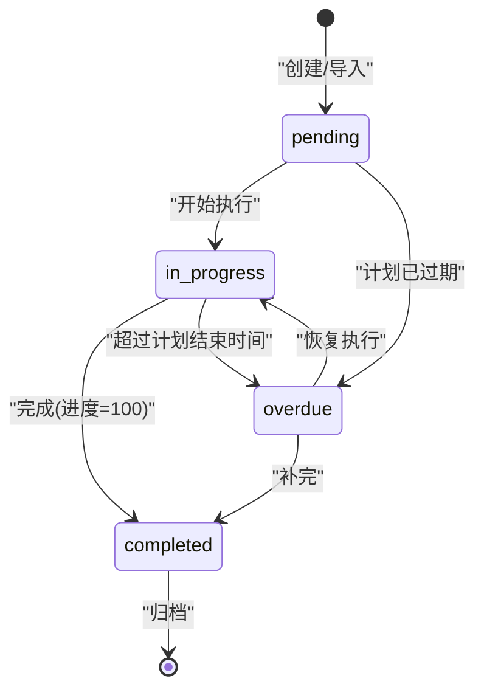
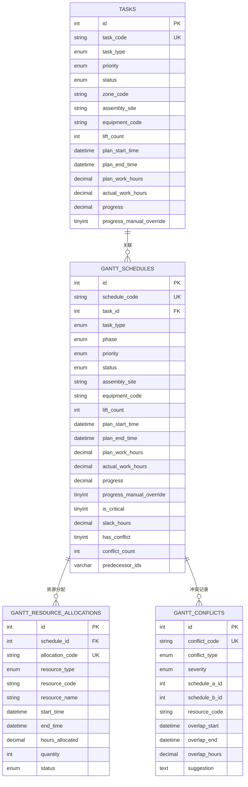
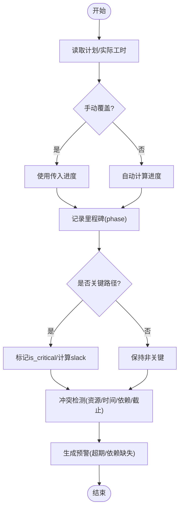
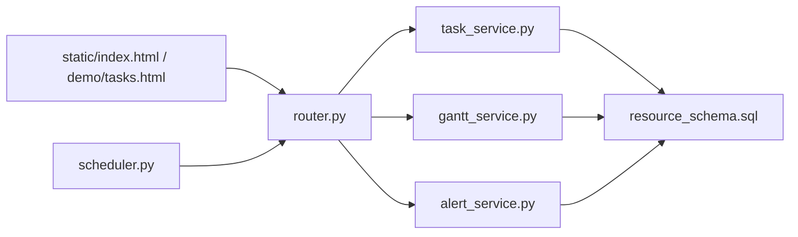

# 任务管理

<cite>
**本文引用的文件**
- [backend/modules/resource/services/task_service.py](file://backend/modules/resource/services/task_service.py)
- [backend/modules/resource/router.py](file://backend/modules/resource/router.py)
- [backend/modules/resource/schemas.py](file://backend/modules/resource/schemas.py)
- [backend/sql/resource_schema.sql](file://backend/sql/resource_schema.sql)
- [backend/modules/resource/services/gantt_service.py](file://backend/modules/resource/services/gantt_service.py)
- [backend/modules/resource/services/alert_service.py](file://backend/modules/resource/services/alert_service.py)
- [backend/scheduling/scheduler.py](file://backend/scheduling/scheduler.py)
- [static/index.html](file://static/index.html)
- [demo/tasks.html](file://demo/tasks.html)
- [webui_ref/client/src/pages/TaskManagementPage/TaskManagementPage.tsx](file://webui_ref/client/src/pages/TaskManagementPage/TaskManagementPage.tsx)
</cite>

## 目录
1. [简介](#简介)
2. [项目结构](#项目结构)
3. [核心组件](#核心组件)
4. [架构总览](#架构总览)
5. [详细组件分析](#详细组件分析)
6. [依赖关系分析](#依赖关系分析)
7. [性能考虑](#性能考虑)
8. [故障排查指南](#故障排查指南)
9. [结论](#结论)
10. [附录](#附录)

## 简介
本业务文档围绕“任务管理”模块，系统阐述从任务创建、审批、分配到执行、监控、完成的完整生命周期；明确A/B/C/sporadic四类任务的特征与处理策略；说明优先级动态调整机制、状态流转规则、资源关联（人员/设备/场地）协调方式；并覆盖进度跟踪、里程碑、偏差分析、风险预警、模板与批量操作、历史查询与审计日志等高级能力。

## 项目结构
后端以FastAPI路由层暴露REST接口，服务层封装业务逻辑，数据库通过SQL脚本定义表结构；前端提供静态页面与WebUI参考实现。关键路径：
- 路由层：/api/resource/tasks* 暴露任务CRUD、统计、分布等接口
- 服务层：task_service.py 负责任务数据校验、进度计算、统计聚合
- 数据层：resource_schema.sql 定义 tasks、gantt_schedules、alerts 等核心表
- 甘特与冲突：gantt_service.py 提供排程、冲突检测、关键路径、SLA建议
- 预警：alert_service.py 提供预警全生命周期与SLA升级
- 调度器：scheduler.py 提供后台定时任务（用于爬虫同步等，间接影响任务数据源）
- 前端：static/index.html、demo/tasks.html、webui_ref TaskManagementPage 占位页

**图表来源**
- [backend/modules/resource/router.py:646-786](file://backend/modules/resource/router.py#L646-L786)
- [backend/modules/resource/services/task_service.py:48-146](file://backend/modules/resource/services/task_service.py#L48-L146)
- [backend/modules/resource/services/gantt_service.py:176-307](file://backend/modules/resource/services/gantt_service.py#L176-L307)
- [backend/modules/resource/services/alert_service.py:47-140](file://backend/modules/resource/services/alert_service.py#L47-L140)
- [backend/scheduling/scheduler.py:16-74](file://backend/scheduling/scheduler.py#L16-L74)
- [backend/sql/resource_schema.sql:71-109](file://backend/sql/resource_schema.sql#L71-L109)

**章节来源**
- [backend/modules/resource/router.py:646-786](file://backend/modules/resource/router.py#L646-L786)
- [backend/modules/resource/services/task_service.py:48-146](file://backend/modules/resource/services/task_service.py#L48-L146)
- [backend/sql/resource_schema.sql:71-109](file://backend/sql/resource_schema.sql#L71-L109)

## 核心组件
- 任务服务（task_service.py）：任务CRUD、进度自动计算、统计KPI、类型/状态/优先级分布
- 甘特服务（gantt_service.py）：排程计划、冲突检测（资源/时间/依赖/截止风险）、关键路径、SLA建议
- 预警服务（alert_service.py）：预警创建、SLA、升级、批量处理、统计
- 路由层（router.py）：统一对外API，参数校验、异常处理
- 数据模型（schemas.py）：Pydantic请求/响应模型
- 数据库（resource_schema.sql）：tasks、gantt_schedules、gantt_resource_allocations、gantt_conflicts、alerts 等

**章节来源**
- [backend/modules/resource/services/task_service.py:13-18](file://backend/modules/resource/services/task_service.py#L13-L18)
- [backend/modules/resource/services/gantt_service.py:15-31](file://backend/modules/resource/services/gantt_service.py#L15-L31)
- [backend/modules/resource/services/alert_service.py:12-30](file://backend/modules/resource/services/alert_service.py#L12-L30)
- [backend/modules/resource/schemas.py:121-178](file://backend/modules/resource/schemas.py#L121-L178)
- [backend/sql/resource_schema.sql:71-109](file://backend/sql/resource_schema.sql#L71-L109)

## 架构总览
任务管理贯穿“计划-执行-监控-闭环”的PDCA循环：
- 计划：任务创建、类型与优先级设定、资源预分配（设备/人员/场地）
- 执行：状态推进（pending→in_progress→completed），实际工时累计，进度自动或手动覆盖
- 监控：甘图可视化、冲突检测、关键路径识别、SLA超时预警
- 闭环：完成归档、统计报表、偏差分析与改进措施

**图表来源**
- [backend/modules/resource/router.py:702-752](file://backend/modules/resource/router.py#L702-L752)
- [backend/modules/resource/services/task_service.py:177-277](file://backend/modules/resource/services/task_service.py#L177-L277)
- [backend/modules/resource/services/gantt_service.py:786-806](file://backend/modules/resource/services/gantt_service.py#L786-L806)
- [backend/modules/resource/services/alert_service.py:188-254](file://backend/modules/resource/services/alert_service.py#L188-L254)
- [backend/sql/resource_schema.sql:204-259](file://backend/sql/resource_schema.sql#L204-L259)

## 详细组件分析

### 任务类型体系与处理策略
- A类（重要紧急）：高优先级、短周期、强约束，优先保障资源与关键路径
- B类（重要不紧急）：中高优先级，关注里程碑与质量
- C类（紧急不重要）：中低优先级，可弹性安排
- sporadic（临时任务）：低优先级、短耗时，快速插入与释放资源

类型常量与颜色映射在甘特服务中定义，便于前端渲染与筛选。

**章节来源**
- [backend/modules/resource/services/gantt_service.py:15-31](file://backend/modules/resource/services/gantt_service.py#L15-L31)
- [backend/sql/resource_schema.sql:71-109](file://backend/sql/resource_schema.sql#L71-L109)

### 任务优先级管理与动态调整算法
- 基础维度：任务类型（A/B/C/sporadic）、优先级（high/medium/low）、截止时间、项目重要性（通过项目群/车型等字段体现）
- 动态因素：资源占用（设备/举升机/场地）、前置依赖、关键路径、冲突数量、SLA剩余时间
- 实现要点：
  - 任务列表支持按类型/状态/优先级/装配场地/关键词筛选排序
  - 甘特服务维护 is_critical、slack_hours、has_conflict/conflict_count 等字段，辅助排序与提示
  - 预警服务基于SLA计算剩余时间与是否超期，驱动升级与提醒

**图表来源**
- [backend/modules/resource/services/gantt_service.py:786-806](file://backend/modules/resource/services/gantt_service.py#L786-L806)
- [backend/modules/resource/services/alert_service.py:337-399](file://backend/modules/resource/services/alert_service.py#L337-L399)
- [backend/modules/resource/services/task_service.py:48-146](file://backend/modules/resource/services/task_service.py#L48-L146)

**章节来源**
- [backend/modules/resource/services/task_service.py:48-146](file://backend/modules/resource/services/task_service.py#L48-L146)
- [backend/modules/resource/services/gantt_service.py:786-806](file://backend/modules/resource/services/gantt_service.py#L786-L806)
- [backend/modules/resource/services/alert_service.py:337-399](file://backend/modules/resource/services/alert_service.py#L337-L399)

### 任务状态流转机制
- 状态集合：pending/in_progress/completed/overdue
- 自动转换：
  - 开始执行：actual_start_time 记录，状态转 in_progress
  - 完成：actual_end_time 记录，progress 置100（除非手动覆盖），状态转 completed
  - 逾期：根据计划结束时间与当前时间判断，必要时标记 overdue
- 人工干预：
  - 可通过表单直接修改状态与进度（支持手动覆盖进度）
  - 前端提供状态下拉切换与详情编辑

**图表来源**
- [backend/modules/resource/services/task_service.py:177-277](file://backend/modules/resource/services/task_service.py#L177-L277)
- [backend/modules/resource/services/gantt_service.py:1381-1405](file://backend/modules/resource/services/gantt_service.py#L1381-L1405)
- [static/index.html:9121-9138](file://static/index.html#L9121-L9138)

**章节来源**
- [backend/modules/resource/services/task_service.py:177-277](file://backend/modules/resource/services/task_service.py#L177-L277)
- [backend/modules/resource/services/gantt_service.py:1381-1405](file://backend/modules/resource/services/gantt_service.py#L1381-L1405)
- [static/index.html:9121-9138](file://static/index.html#L9121-L9138)

### 任务与资源的关联关系
- 人员分配：planner/pm_name/cve_name/trial_supervisor/process_supervisor/assembly_supervisor 等多角色协同
- 设备调度：equipment_code、lift_count 表示占用设备与举升机数量
- 场地预约：zone_code、assembly_site 指定区域与装配场地
- 资源分配明细：gantt_resource_allocations 记录具体资源类型、编码、数量、时段与状态
- 冲突检测：gantt_conflicts 记录资源重叠、时间重叠、依赖缺失、截止风险、过载等冲突

**图表来源**
- [backend/sql/resource_schema.sql:71-109](file://backend/sql/resource_schema.sql#L71-L109)
- [backend/sql/resource_schema.sql:204-259](file://backend/sql/resource_schema.sql#L204-L259)
- [backend/sql/resource_schema.sql:264-286](file://backend/sql/resource_schema.sql#L264-L286)
- [backend/sql/resource_schema.sql:288-308](file://backend/sql/resource_schema.sql#L288-L308)

**章节来源**
- [backend/sql/resource_schema.sql:71-109](file://backend/sql/resource_schema.sql#L71-L109)
- [backend/sql/resource_schema.sql:204-259](file://backend/sql/resource_schema.sql#L204-L259)
- [backend/sql/resource_schema.sql:264-286](file://backend/sql/resource_schema.sql#L264-L286)
- [backend/sql/resource_schema.sql:288-308](file://backend/sql/resource_schema.sql#L288-L308)

### 进度跟踪与报告生成功能
- 进度计算：
  - 自动模式：progress = min(round(actual_work_hours / plan_work_hours * 100, 2), 100)
  - 手动覆盖：progress_manual_override=1 时保留传入进度
- 里程碑管理：phase 字段（装配/下线/调试/夏标验证/整改/终检/交付）作为阶段里程碑
- 偏差分析：
  - 计划工时 vs 实际工时对比
  - 关键路径与松弛小时（is_critical、slack_hours）
  - 冲突次数与类型（has_conflict、conflict_count、conflict_type）
- 风险预警：
  - 截止风险：deadline_risk，按超期天数分级（critical/medium）
  - SLA超期：预警服务计算 remaining_hours 与 is_overdue，支持升级

**图表来源**
- [backend/modules/resource/services/task_service.py:21-45](file://backend/modules/resource/services/task_service.py#L21-L45)
- [backend/modules/resource/services/gantt_service.py:934-971](file://backend/modules/resource/services/gantt_service.py#L934-L971)
- [backend/modules/resource/services/alert_service.py:143-172](file://backend/modules/resource/services/alert_service.py#L143-L172)

**章节来源**
- [backend/modules/resource/services/task_service.py:21-45](file://backend/modules/resource/services/task_service.py#L21-L45)
- [backend/modules/resource/services/gantt_service.py:934-971](file://backend/modules/resource/services/gantt_service.py#L934-L971)
- [backend/modules/resource/services/alert_service.py:143-172](file://backend/modules/resource/services/alert_service.py#L143-L172)

### 高级特性实现指南
- 任务模板：
  - 通过固定 task_type/priority/phase/equipment_code/assembly_site 组合形成模板，批量创建时复用
  - 可在前端表单中预设默认值，减少重复录入
- 批量操作：
  - 批量更新状态：参考预警服务的 batch_update_status 思路，对 tasks 表进行批量状态更新
  - 批量分配资源：依据 gantt_resource_allocations 批量插入分配记录
- 历史查询：
  - 支持按任务类型、状态、优先级、装配场地、关键词、日期范围筛选
  - 甘特视图支持 only_critical/only_conflict/date_from/date_to 过滤
- 审计日志：
  - 利用 updated_at、created_at 及备注字段记录变更轨迹
  - 结合预警 remark 字段记录升级与处置过程

**章节来源**
- [backend/modules/resource/router.py:646-786](file://backend/modules/resource/router.py#L646-L786)
- [backend/modules/resource/services/gantt_service.py:176-307](file://backend/modules/resource/services/gantt_service.py#L176-L307)
- [backend/modules/resource/services/alert_service.py:317-334](file://backend/modules/resource/services/alert_service.py#L317-L334)

## 依赖关系分析
- 路由层依赖服务层：router.py 调用 task_service/gantt_service/alert_service
- 服务层依赖数据库：所有服务通过 database 模块执行SQL
- 前端依赖后端API：static/index.html 与 demo/tasks.html 通过HTTP交互
- 调度器独立运行：scheduler.py 周期性触发爬虫同步，间接影响任务数据源

**图表来源**
- [backend/modules/resource/router.py:646-786](file://backend/modules/resource/router.py#L646-L786)
- [backend/modules/resource/services/task_service.py:48-146](file://backend/modules/resource/services/task_service.py#L48-L146)
- [backend/modules/resource/services/gantt_service.py:176-307](file://backend/modules/resource/services/gantt_service.py#L176-L307)
- [backend/modules/resource/services/alert_service.py:47-140](file://backend/modules/resource/services/alert_service.py#L47-L140)
- [backend/scheduling/scheduler.py:16-74](file://backend/scheduling/scheduler.py#L16-L74)

**章节来源**
- [backend/modules/resource/router.py:646-786](file://backend/modules/resource/router.py#L646-L786)
- [backend/scheduling/scheduler.py:16-74](file://backend/scheduling/scheduler.py#L16-L74)

## 性能考虑
- 索引优化：tasks、gantt_schedules、alerts 均建立常用字段索引（status、priority、type、site、start/end time等）
- 分页与筛选：列表接口支持 page/page_size 与多维度筛选，避免一次性加载大量数据
- 进度计算：自动计算仅在 plan_work_hours>0 且 actual_work_hours 存在时执行，减少无效计算
- 冲突检测：按装配场地或全局清理open冲突，降低冗余计算
- 预警SLA：软超期计算在前端或服务层按需触发，避免频繁写库

[本节为通用指导，无需特定文件引用]

## 故障排查指南
- 任务编号重复：创建时校验 task_code 唯一性，若重复抛出错误
- 无效枚举值：task_type/priority/status/source 等字段校验失败时返回400
- 进度不一致：确认 progress_manual_override 标志与实际工时是否正确
- 冲突未清除：重新运行冲突检测，清理open冲突并重置 has_conflict/conflict_count
- 预警超期：检查 raised_at + sla_hours 与当前时间，必要时升级或关闭

**章节来源**
- [backend/modules/resource/services/task_service.py:177-277](file://backend/modules/resource/services/task_service.py#L177-L277)
- [backend/modules/resource/services/gantt_service.py:786-806](file://backend/modules/resource/services/gantt_service.py#L786-L806)
- [backend/modules/resource/services/alert_service.py:188-254](file://backend/modules/resource/services/alert_service.py#L188-L254)

## 结论
任务管理模块以“类型-优先级-状态-资源-预警”为主线，构建了从计划到闭环的全流程管理能力。通过甘特排程与冲突检测、SLA预警与升级、进度自动计算与手动覆盖，实现了精细化与灵活性的平衡。未来可进一步扩展模板化创建、批量编排、AI辅助排程与更丰富的报表分析。

[本节为总结，无需特定文件引用]

## 附录
- 前端界面参考：
  - static/index.html：任务表单、状态下拉、进度显示、甘特统计
  - demo/tasks.html：任务详情、状态切换、执行时间线
  - webui_ref TaskManagementPage：占位页面，后续承载完整功能

**章节来源**
- [static/index.html:9121-9138](file://static/index.html#L9121-L9138)
- [demo/tasks.html:959-999](file://demo/tasks.html#L959-L999)
- [webui_ref/client/src/pages/TaskManagementPage/TaskManagementPage.tsx:1-16](file://webui_ref/client/src/pages/TaskManagementPage/TaskManagementPage.tsx#L1-L16)