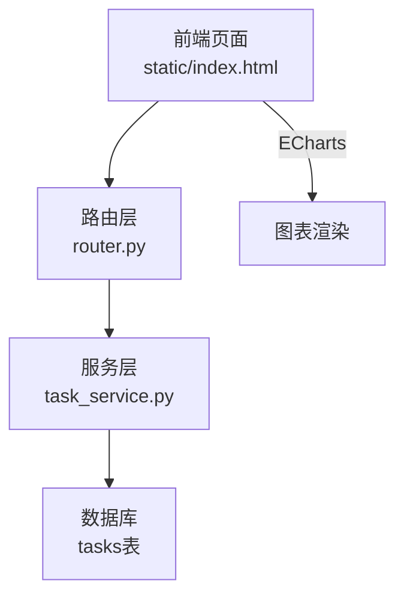
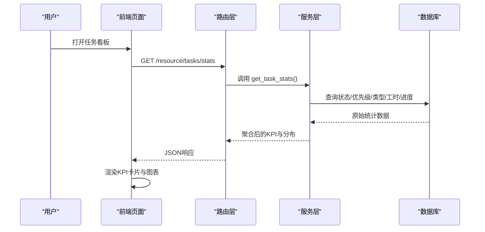
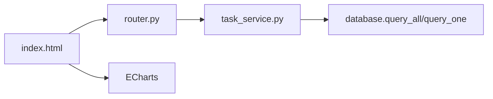
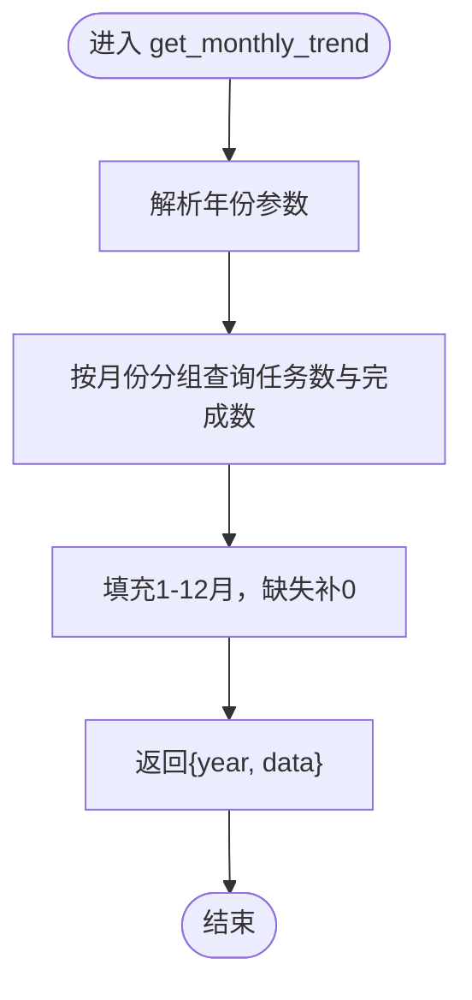
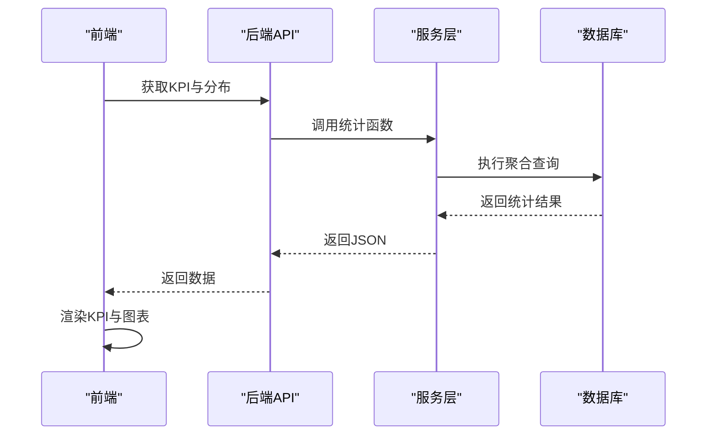

# 任务统计看板

<cite>
**本文引用的文件**
- [backend/modules/resource/services/task_service.py](file://backend/modules/resource/services/task_service.py)
- [backend/modules/resource/router.py](file://backend/modules/resource/router.py)
- [static/index.html](file://static/index.html)
- [demo/efficiency.html](file://demo/efficiency.html)
</cite>

## 目录
1. [简介](#简介)
2. [项目结构](#项目结构)
3. [核心组件](#核心组件)
4. [架构总览](#架构总览)
5. [详细组件分析](#详细组件分析)
6. [依赖关系分析](#依赖关系分析)
7. [性能考虑](#性能考虑)
8. [故障排查指南](#故障排查指南)
9. [结论](#结论)
10. [附录](#附录)

## 简介
本文件面向“任务统计看板”的数据分析与可视化，系统性阐述KPI指标体系、多维度聚合逻辑、图表数据来源与计算方法、部门（装配场地）维度分析、月度趋势分析、实时更新与缓存策略，以及自定义统计报表的开发与扩展方法。目标是帮助读者快速理解从数据到可视化的完整链路，并具备在此基础上扩展新指标与新图表的能力。

## 项目结构
围绕任务统计看板的核心代码主要分布在后端服务层与前端展示层：
- 后端服务层：负责查询数据库、聚合统计、提供REST接口
- 路由层：暴露HTTP端点，转发请求到服务层
- 前端页面：调用API获取数据，渲染KPI卡片与各类图表（饼图、柱状图、趋势图等）

**图示来源**
- [backend/modules/resource/router.py:774-831](file://backend/modules/resource/router.py#L774-L831)
- [backend/modules/resource/services/task_service.py:290-432](file://backend/modules/resource/services/task_service.py#L290-L432)
- [static/index.html:8669-8780](file://static/index.html#L8669-L8780)

**章节来源**
- [backend/modules/resource/router.py:774-831](file://backend/modules/resource/router.py#L774-L831)
- [backend/modules/resource/services/task_service.py:290-432](file://backend/modules/resource/services/task_service.py#L290-L432)
- [static/index.html:8669-8780](file://static/index.html#L8669-L8780)

## 核心组件
- KPI指标体系
  - 任务总数、状态分布（待开始/进行中/已完成/逾期）、优先级分布（高/中/低）、类型分布（A/B/C/零星试制）
  - 工时与进度：计划总工时、实际总工时、平均进度
- 多维统计函数
  - get_task_stats：汇总KPI与分布明细
  - get_status_distribution：状态分布（用于饼图）
  - get_type_vs_progress：类型与进度对比（用于柱状图）
  - get_department_tasks：按装配场地维度的任务分布与平均进度
  - get_monthly_trend：按月统计任务数量与完成数
- 前端图表
  - 饼图：任务状态分布
  - 柱状图：任务类型与进度对比
  - 趋势图：月度任务量与完成率趋势

**章节来源**
- [backend/modules/resource/services/task_service.py:290-432](file://backend/modules/resource/services/task_service.py#L290-L432)
- [backend/modules/resource/router.py:774-831](file://backend/modules/resource/router.py#L774-L831)
- [static/index.html:8724-8780](file://static/index.html#L8724-L8780)

## 架构总览
任务看板的数据流遵循“前端请求 -> 路由分发 -> 服务层聚合 -> 数据库查询 -> 返回JSON -> 前端渲染”的闭环。

**图示来源**
- [backend/modules/resource/router.py:774-786](file://backend/modules/resource/router.py#L774-L786)
- [backend/modules/resource/services/task_service.py:290-332](file://backend/modules/resource/services/task_service.py#L290-L332)
- [static/index.html:8682-8705](file://static/index.html#L8682-L8705)

## 详细组件分析

### KPI指标体系设计
- 任务总数：直接COUNT(*)得到
- 状态分布：按status分组计数，映射为中文标签与颜色
- 优先级分布：按priority分组计数
- 类型分布：按task_type分组计数
- 工时与进度：SUM(plan_work_hours)、SUM(actual_work_hours)、AVG(progress)
- 输出字段包含各维度计数与分布明细，便于前端同时展示KPI与图表

计算要点
- 使用COALESCE确保空值时返回0，避免None导致前端计算异常
- 将枚举值映射为可读标签与颜色，提升可视化效果

**章节来源**
- [backend/modules/resource/services/task_service.py:290-332](file://backend/modules/resource/services/task_service.py#L290-L332)

### 统计函数详解：get_task_stats
职责
- 汇总任务总数、状态/优先级/类型分布、工时与进度等核心KPI
- 返回分布明细供前端绘制饼图、柱状图

实现要点
- 多次GROUP BY分别统计状态、优先级、类型
- 一次聚合查询获取计划/实际工时与平均进度
- 统一返回结构，包含数值型KPI与分布数组

复杂度
- 时间复杂度：O(N)（N为tasks表行数），空间复杂度：O(1)（聚合结果固定大小）

优化建议
- 若数据量大，可引入物化视图或定时预聚合
- 对常用筛选条件建立索引（如status、priority、task_type、plan_start_time）

**章节来源**
- [backend/modules/resource/services/task_service.py:290-332](file://backend/modules/resource/services/task_service.py#L290-L332)

### 状态分布（饼图）
数据来源
- 通过get_status_distribution从tasks表按status分组计数
- 将英文状态映射为中文名称与颜色

前端渲染
- 读取API返回的data数组，构造ECharts饼图配置
- 支持动态resize与tooltip格式化

**章节来源**
- [backend/modules/resource/services/task_service.py:335-353](file://backend/modules/resource/services/task_service.py#L335-L353)
- [static/index.html:8724-8780](file://static/index.html#L8724-L8780)

### 类型与进度对比（柱状图）
数据来源
- 通过get_type_vs_progress按task_type分组，统计count、avg_progress、计划/实际工时总和
- 保证类型顺序固定，缺失类型补0

前端渲染
- 将type、count、avg_progress映射为柱状图系列
- 支持多系列对比（如数量与进度）

**章节来源**
- [backend/modules/resource/services/task_service.py:356-395](file://backend/modules/resource/services/task_service.py#L356-L395)
- [static/index.html:8724-8780](file://static/index.html#L8724-L8780)

### 部门维度任务统计（按装配场地）
说明
- 以assembly_site作为“部门”维度，统计每个场地的任务数量与平均进度
- 适用于不同装配场地之间的效率对比与资源调度

实现要点
- GROUP BY assembly_site, task_type
- 过滤空值，确保仅统计有效场地

扩展建议
- 可增加按zone_code或equipment_code的多维下钻
- 结合人员/设备维度进行更细粒度的效率分析

**章节来源**
- [backend/modules/resource/services/task_service.py:398-409](file://backend/modules/resource/services/task_service.py#L398-L409)

### 月度趋势分析
功能
- 按年统计每月任务总量与完成数量
- 支持选择年份，默认当前年

实现要点
- 使用MONTH与YEAR函数按月份分组
- 填充1-12月，缺失月份补0，保证趋势图连续性

前端使用
- 可将count与done_count绘制为折线/面积图，观察趋势与完成率变化

**章节来源**
- [backend/modules/resource/router.py:819-831](file://backend/modules/resource/router.py#L819-L831)
- [backend/modules/resource/services/task_service.py:412-431](file://backend/modules/resource/services/task_service.py#L412-L431)

### 前端图表与交互
- 并行加载KPI与图表数据，减少首屏等待
- 图表初始化后延迟resize，适配容器尺寸变化
- 当后端不可用时，前端有Mock回退逻辑，保障演示可用性

**章节来源**
- [static/index.html:8669-8705](file://static/index.html#L8669-L8705)
- [static/index.html:8724-8780](file://static/index.html#L8724-L8780)

## 依赖关系分析
- 路由层依赖服务层函数，服务层依赖数据库查询工具
- 前端依赖后端提供的REST接口，并使用ECharts进行渲染
- 常量定义（任务类型、状态、优先级、装配场地）在服务层集中管理，便于统一维护

**图示来源**
- [backend/modules/resource/router.py:774-831](file://backend/modules/resource/router.py#L774-L831)
- [backend/modules/resource/services/task_service.py:1-19](file://backend/modules/resource/services/task_service.py#L1-L19)
- [static/index.html:8724-8780](file://static/index.html#L8724-L8780)

**章节来源**
- [backend/modules/resource/router.py:774-831](file://backend/modules/resource/router.py#L774-L831)
- [backend/modules/resource/services/task_service.py:1-19](file://backend/modules/resource/services/task_service.py#L1-L19)
- [static/index.html:8724-8780](file://static/index.html#L8724-L8780)

## 性能考虑
- SQL聚合：尽量在数据库层完成GROUP BY与SUM/AVG，减少前端计算开销
- 索引建议：对status、priority、task_type、plan_start_time建立索引，加速统计查询
- 缓存策略：
  - 短期缓存：可在路由层增加内存缓存（如TTL秒级），降低高频刷新压力
  - 长期缓存：对月度趋势等低频更新指标，采用定时任务预计算并缓存
- 分页与增量：列表类接口已支持分页；统计接口可按需增加时间范围参数，避免全表扫描
- 前端优化：并行请求、按需渲染、图表实例复用与resize节流

[本节为通用性能指导，不直接分析具体文件]

## 故障排查指南
常见问题与定位
- 接口返回空或错误：检查路由层异常捕获与服务层SQL执行
- 图表无数据：确认API返回结构与前端期望一致（name/value/color等字段）
- 月度趋势断档：检查plan_start_time是否为空，确保月份填充逻辑正确
- 装配场地为空：确认assembly_site字段是否填写，必要时在前端增加必填校验

定位步骤
- 查看路由层日志与异常信息
- 在服务层打印关键SQL与结果集
- 在前端控制台检查网络响应与图表配置

**章节来源**
- [backend/modules/resource/router.py:774-831](file://backend/modules/resource/router.py#L774-L831)
- [backend/modules/resource/services/task_service.py:290-432](file://backend/modules/resource/services/task_service.py#L290-L432)
- [static/index.html:8669-8780](file://static/index.html#L8669-L8780)

## 结论
任务统计看板通过清晰的分层架构与标准化的统计函数，实现了多维度、可扩展的任务数据分析能力。KPI指标覆盖全面，图表数据来源明确，支持按装配场地与月度趋势进行深入分析。建议在大数据量场景下引入缓存与索引优化，并持续完善前端交互与错误处理，以提升用户体验与系统稳定性。

[本节为总结性内容，不直接分析具体文件]

## 附录

### 自定义统计报表开发指南
- 新增指标
  - 在服务层新增聚合函数，复用query_all/query_one
  - 在路由层暴露对应GET接口，封装标准响应格式
  - 在前端新增图表组件，调用新接口并渲染
- 扩展维度
  - 基于现有GROUP BY模式，增加新的分组字段（如zone_code、equipment_code）
  - 保持枚举与映射集中管理，避免硬编码分散
- 数据一致性
  - 统一使用COALESCE处理空值
  - 保证前端字段命名与后端一致，减少转换成本
- 测试与验证
  - 使用最小数据集验证聚合结果
  - 对比前端显示与后端返回，确保口径一致

[本节为通用开发指导，不直接分析具体文件]

### 相关流程图与序列图示例

#### 月度趋势计算流程

**图示来源**
- [backend/modules/resource/services/task_service.py:412-431](file://backend/modules/resource/services/task_service.py#L412-L431)

#### 前端加载看板流程

**图示来源**
- [backend/modules/resource/router.py:774-831](file://backend/modules/resource/router.py#L774-L831)
- [backend/modules/resource/services/task_service.py:290-432](file://backend/modules/resource/services/task_service.py#L290-L432)
- [static/index.html:8669-8780](file://static/index.html#L8669-L8780)