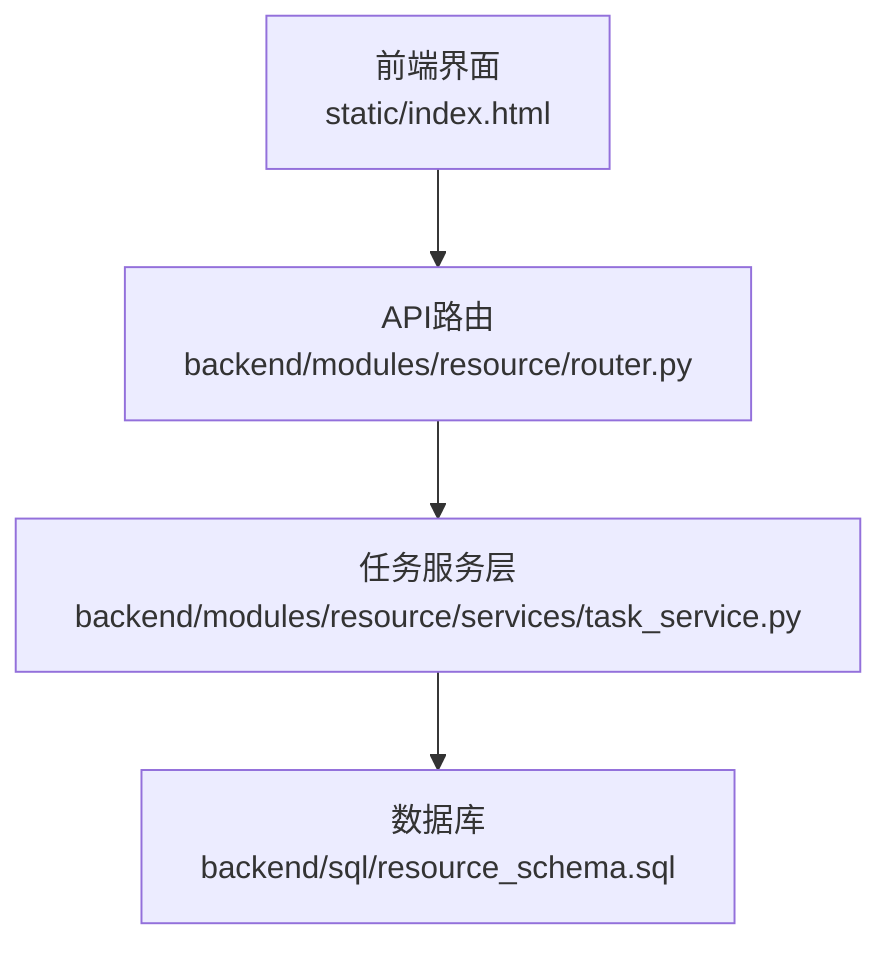
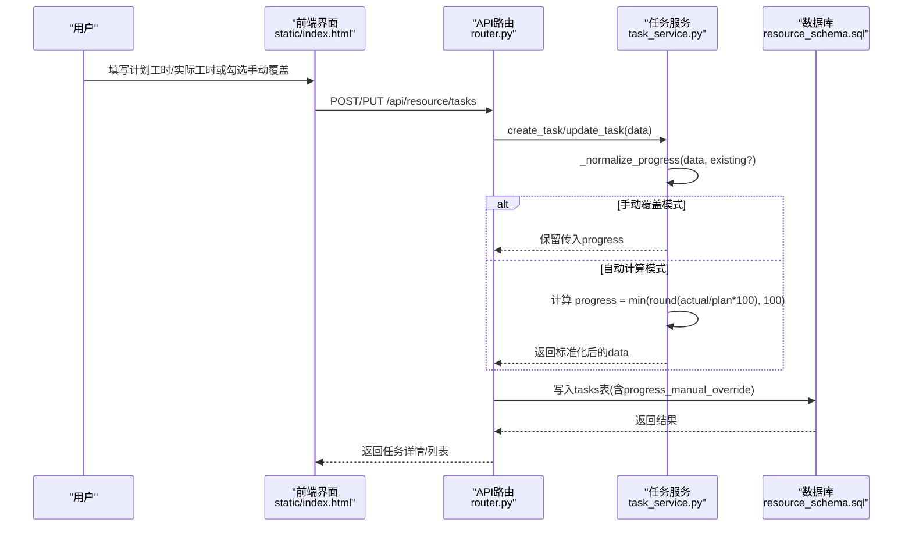
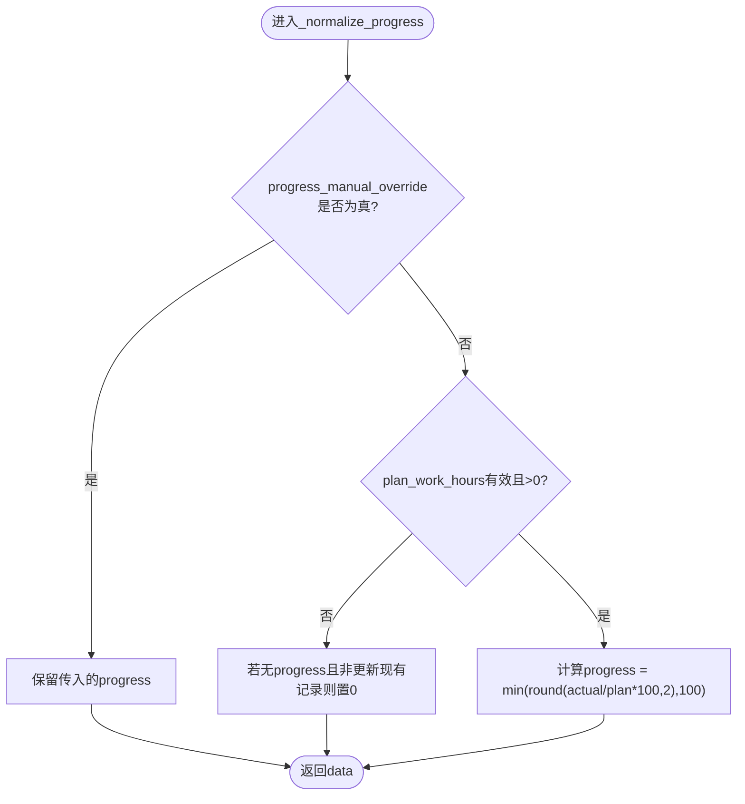
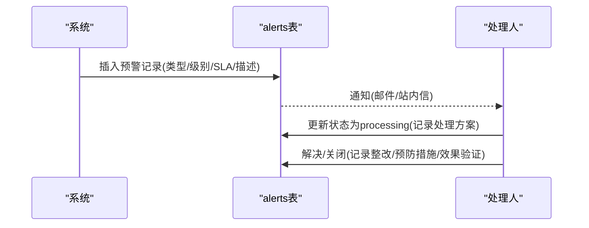
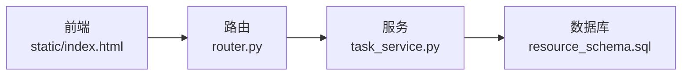

# 任务进度跟踪

<cite>
**本文引用的文件**
- [task_service.py](file://backend/modules/resource/services/task_service.py)
- [router.py](file://backend/modules/resource/router.py)
- [resource_schema.sql](file://backend/sql/resource_schema.sql)
- [index.html](file://static/index.html)
</cite>

## 目录
1. [简介](#简介)
2. [项目结构](#项目结构)
3. [核心组件](#核心组件)
4. [架构总览](#架构总览)
5. [详细组件分析](#详细组件分析)
6. [依赖关系分析](#依赖关系分析)
7. [性能考虑](#性能考虑)
8. [故障排查指南](#故障排查指南)
9. [结论](#结论)
10. [附录](#附录)

## 简介
本监控文档聚焦于“任务进度跟踪”的完整实现与使用，覆盖以下关键主题：
- 两种进度计算模式：自动计算模式与手动覆盖模式
- _normalize_progress 函数的工作原理与计算公式
- progress_manual_override 字段的作用机制与适用场景
- 进度数据采集方式（工时填报、系统自动采集、第三方系统集成）
- 进度偏差分析方法（计划 vs 实际），识别潜在风险
- 进度报告生成机制（日报/周报/月报汇总思路）
- 进度异常预警机制与处理流程

## 项目结构
与任务进度相关的后端逻辑集中在资源模块中，包含路由层、服务层与数据库模式。前端通过静态页面提供交互能力，用于工时填报与进度手动覆盖。

图表来源
- [router.py:646-771](file://backend/modules/resource/router.py#L646-L771)
- [task_service.py:177-287](file://backend/modules/resource/services/task_service.py#L177-L287)
- [resource_schema.sql:71-109](file://backend/sql/resource_schema.sql#L71-L109)

章节来源
- [router.py:646-771](file://backend/modules/resource/router.py#L646-L771)
- [task_service.py:177-287](file://backend/modules/resource/services/task_service.py#L177-L287)
- [resource_schema.sql:71-109](file://backend/sql/resource_schema.sql#L71-L109)

## 核心组件
- 任务服务层（task_service.py）
  - 负责任务的创建、更新、查询、统计等核心业务逻辑
  - 内置进度归一化逻辑，支持自动计算与手动覆盖
- API路由层（router.py）
  - 暴露任务相关REST接口，统一封装请求参数与响应格式
- 数据库模式（resource_schema.sql）
  - 定义任务表、异常预警表等核心数据结构，包含进度与手动覆盖字段
- 前端交互（index.html）
  - 提供工时填报、进度手动覆盖开关、实时联动计算等交互能力

章节来源
- [task_service.py:21-45](file://backend/modules/resource/services/task_service.py#L21-L45)
- [router.py:583-771](file://backend/modules/resource/router.py#L583-L771)
- [resource_schema.sql:71-109](file://backend/sql/resource_schema.sql#L71-L109)
- [index.html:9209-9313](file://static/index.html#L9209-L9313)

## 架构总览
下图展示了从前端到后端的任务进度数据流，包括自动计算与手动覆盖两种路径。

图表来源
- [task_service.py:21-45](file://backend/modules/resource/services/task_service.py#L21-L45)
- [router.py:702-771](file://backend/modules/resource/router.py#L702-L771)
- [resource_schema.sql:71-109](file://backend/sql/resource_schema.sql#L71-L109)

## 详细组件分析

### 进度计算模式与_normalize_progress工作原理
- 自动计算模式
  - 当 progress_manual_override=0 时，系统根据 plan_work_hours 与 actual_work_hours 自动计算进度
  - 计算公式：progress = min(round(actual_work_hours / plan_work_hours * 100, 2), 100.0)
  - 若 plan_work_hours 为空或非正数，则不触发自动计算；如未显式设置 progress 且为新建记录，默认置为 0
- 手动覆盖模式
  - 当 progress_manual_override=1 时，系统直接保留前端传入的 progress，不进行自动计算
  - 适用于需要人工校准进度的场景（如阶段性验收、外部依赖导致进度不可由工时线性推导）

图表来源
- [task_service.py:21-45](file://backend/modules/resource/services/task_service.py#L21-L45)

章节来源
- [task_service.py:21-45](file://backend/modules/resource/services/task_service.py#L21-L45)

### progress_manual_override字段作用机制与场景
- 字段含义
  - 标记当前任务的进度是否由用户手动覆盖（1=手动，0=自动）
- 作用机制
  - 在创建/更新任务时，服务层会读取该字段以决定是否执行自动计算
  - 前端表单提供复选框控制该字段，并在手动模式下允许直接编辑进度
- 典型使用场景
  - 阶段性里程碑验收：即使工时未完全消耗，也可将进度设置为100%
  - 外部依赖延迟：因外部原因导致无法按工时推进，需人工调整进度
  - 质量门控：完成质量检查后，可提前标记进度，后续再回填工时

章节来源
- [resource_schema.sql:96-99](file://backend/sql/resource_schema.sql#L96-L99)
- [index.html:9226-9313](file://static/index.html#L9226-L9313)
- [task_service.py:21-45](file://backend/modules/resource/services/task_service.py#L21-L45)

### 进度数据采集方式
- 工时填报（前端）
  - 用户在任务编辑界面填写计划工时与实际工时，或在手动模式下直接输入进度
  - 前端在自动模式下实时联动计算进度，并锁定进度输入框
- 系统自动采集（后端）
  - 后端在创建/更新任务时调用 _normalize_progress 进行进度归一化
  - 支持对时间字段与数值字段的类型转换与格式化
- 第三方系统集成（扩展点）
  - 任务表包含 source 字段，可用于标识数据来源（如 MES、运营表、手工录入）
  - 可通过定时任务或消息队列从MES/ERP等系统同步工时与进度

章节来源
- [index.html:9209-9313](file://static/index.html#L9209-L9313)
- [task_service.py:177-287](file://backend/modules/resource/services/task_service.py#L177-L287)
- [resource_schema.sql:95-101](file://backend/sql/resource_schema.sql#L95-L101)

### 进度偏差分析与风险识别
- 偏差指标建议
  - 进度偏差 = 实际进度 - 计划进度（可由计划开始/结束时间与当前日期推算计划进度）
  - 工时偏差 = 实际工时 - 计划工时
  - 逾期判定：当前时间超过 plan_end_time 且未完成（status=overdue）
- 风险识别
  - 高优先级任务出现负偏差或逾期，应触发预警
  - 大量任务处于 in_progress 但进度长期停滞，提示资源瓶颈或依赖阻塞
- 可视化与报表
  - 利用 get_monthly_trend 获取月度趋势，结合状态分布与类型分布进行综合分析
  - 可在看板中展示各场地/类型的平均进度与计划对比

章节来源
- [task_service.py:412-431](file://backend/modules/resource/services/task_service.py#L412-L431)
- [resource_schema.sql:71-109](file://backend/sql/resource_schema.sql#L71-L109)

### 进度报告生成机制（日报/周报/月报）
- 数据基础
  - 任务列表与统计接口提供分页、筛选、搜索能力，便于按周期聚合
  - 月度趋势接口按 plan_start_time 分组统计任务数量与完成数量
- 生成策略
  - 日报：基于当日新增/变更的任务与状态变化，汇总进度与偏差
  - 周报：汇总一周内任务状态分布、类型分布、平均进度与工时汇总
  - 月报：使用月度趋势接口，输出计划与实际完成量、完成率与趋势图
- 扩展建议
  - 增加按装配场地/项目群/车型的维度聚合
  - 结合 alerts 表统计异常事件对进度的影响

章节来源
- [router.py:646-771](file://backend/modules/resource/router.py#L646-L771)
- [task_service.py:290-431](file://backend/modules/resource/services/task_service.py#L290-L431)

### 进度异常预警机制与处理流程
- 预警模型
  - 使用 alerts 表记录异常事件，支持多种类型（如进度滞后、计划超期等）
  - 字段包含级别、SLA、处理人、处理方案、整改措施、效果验证等
- 触发条件（示例）
  - 任务逾期（status=overdue）且未关闭
  - 高优先级任务进度偏差超过阈值
  - 设备故障/物料缺件导致进度受阻
- 处理流程
  - 创建预警 -> 分配处理人 -> 记录临时处置方案 -> 解决/关闭
  - 支持升级上报与批量操作

图表来源
- [resource_schema.sql:114-163](file://backend/sql/resource_schema.sql#L114-L163)

章节来源
- [resource_schema.sql:114-163](file://backend/sql/resource_schema.sql#L114-L163)

## 依赖关系分析
- 路由层依赖服务层
  - router.py 中的任务接口调用 task_service.py 的CRUD与统计方法
- 服务层依赖数据库
  - task_service.py 通过数据库查询与写入维护任务数据
- 前端依赖路由层
  - index.html 通过HTTP请求与后端交互，提交工时与进度

图表来源
- [router.py:646-771](file://backend/modules/resource/router.py#L646-L771)
- [task_service.py:177-287](file://backend/modules/resource/services/task_service.py#L177-L287)
- [resource_schema.sql:71-109](file://backend/sql/resource_schema.sql#L71-L109)

章节来源
- [router.py:646-771](file://backend/modules/resource/router.py#L646-L771)
- [task_service.py:177-287](file://backend/modules/resource/services/task_service.py#L177-L287)
- [resource_schema.sql:71-109](file://backend/sql/resource_schema.sql#L71-L109)

## 性能考虑
- 查询优化
  - 任务列表支持分页与多条件筛选，避免全表扫描
  - 统计接口使用 GROUP BY 与聚合函数，减少前端计算压力
- 计算开销
  - 进度归一化在服务层进行，避免重复计算
  - 手动覆盖模式跳过计算，提升写入性能
- 扩展性
  - 通过 source 字段区分数据来源，便于未来接入MES/ERP等系统
  - 可按装配场地/项目群/车型维度扩展统计接口

[本节为通用性能建议，不直接引用具体代码]

## 故障排查指南
- 进度未按预期自动计算
  - 检查 progress_manual_override 是否为 1（手动模式会跳过自动计算）
  - 确认 plan_work_hours 是否为空或非正数（无效值不会触发自动计算）
  - 查看实际工时 actual_work_hours 是否正确回填
- 前端进度锁定
  - 手动模式下进度输入框解锁，自动模式下锁定并联动计算
  - 确保前端复选框与后端字段一致
- 预警未触发
  - 检查 alerts 表是否存在对应记录
  - 确认 SLA 与级别配置是否符合预期
  - 验证处理流程是否完整（介入/解决/关闭）

章节来源
- [task_service.py:21-45](file://backend/modules/resource/services/task_service.py#L21-L45)
- [index.html:9226-9313](file://static/index.html#L9226-L9313)
- [resource_schema.sql:114-163](file://backend/sql/resource_schema.sql#L114-L163)

## 结论
本系统实现了任务进度的双模式管理：自动计算与手动覆盖，既保证了数据的客观性，又保留了必要的灵活性。通过标准化的进度归一化逻辑、完善的数据库结构与前后端协同，形成了完整的进度采集、计算、报告与预警闭环。建议在后续迭代中增强多维统计与自动化预警规则，进一步提升进度管理的精细化水平。

[本节为总结性内容，不直接引用具体代码]

## 附录
- 关键接口
  - 任务列表：GET /api/resource/tasks
  - 任务详情：GET /api/resource/tasks/{task_id}
  - 创建任务：POST /api/resource/tasks
  - 更新任务：PUT /api/resource/tasks/{task_id}
  - 任务统计：GET /api/resource/tasks/stats
  - 状态分布：GET /api/resource/tasks/status-distribution
  - 月度趋势：GET /api/resource/tasks/monthly-trend?year=...

章节来源
- [router.py:646-771](file://backend/modules/resource/router.py#L646-L771)
- [task_service.py:290-431](file://backend/modules/resource/services/task_service.py#L290-L431)