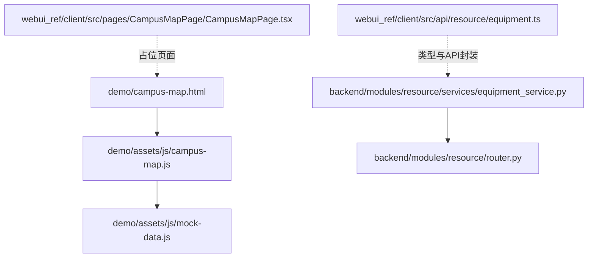
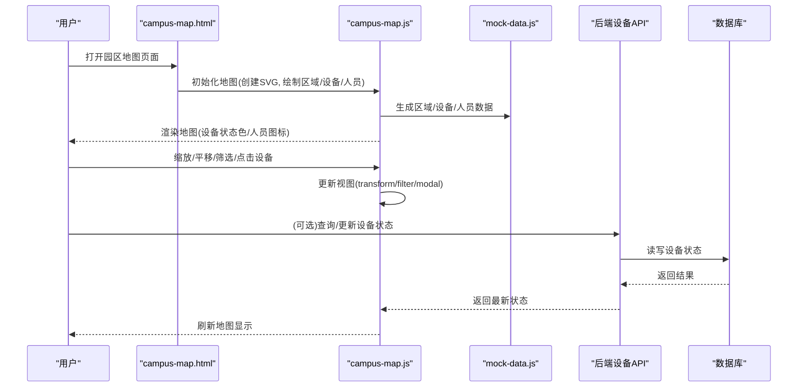
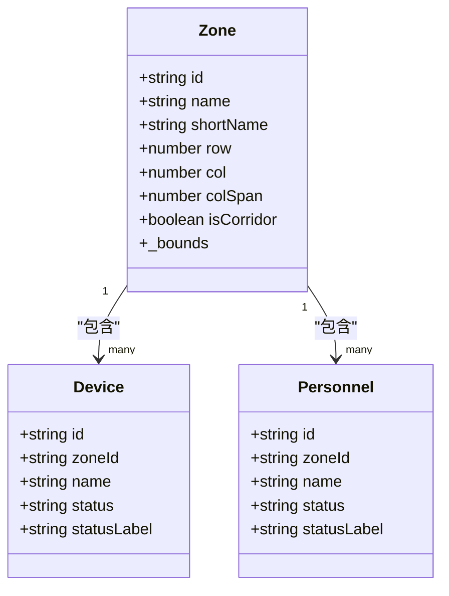
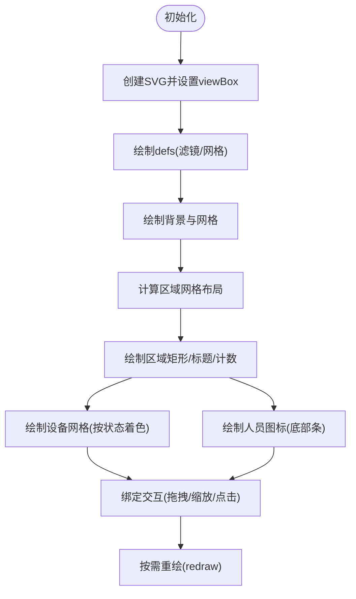
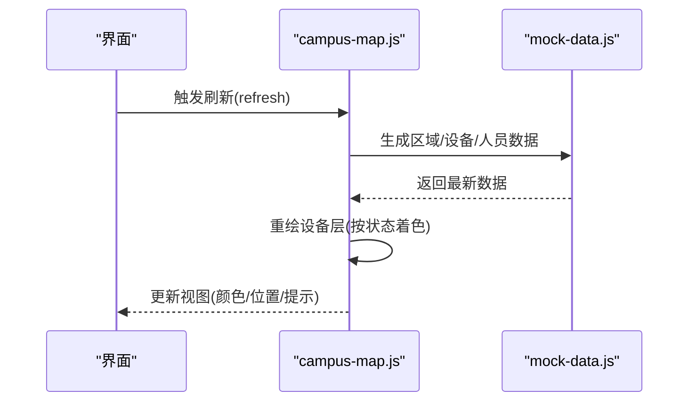
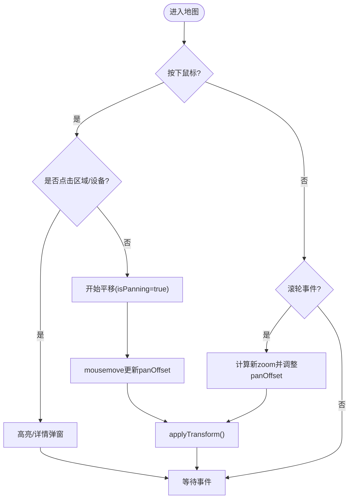
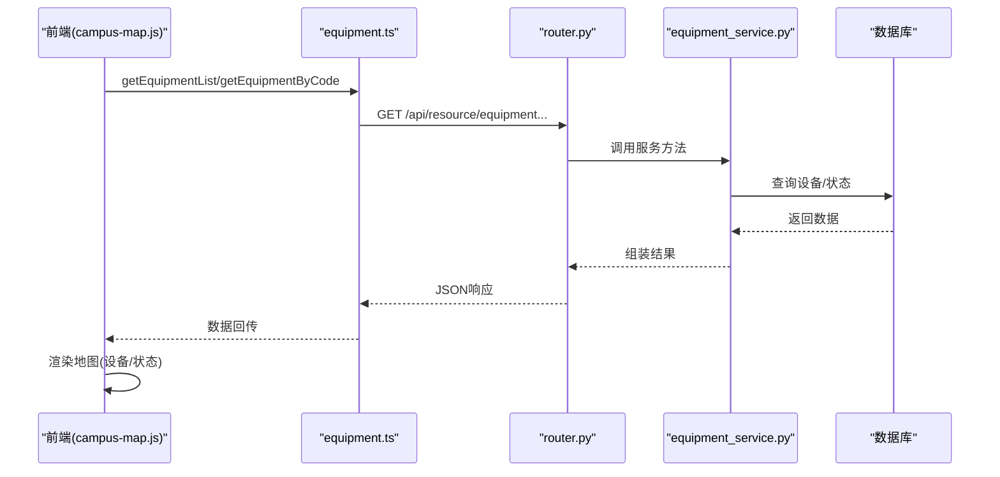
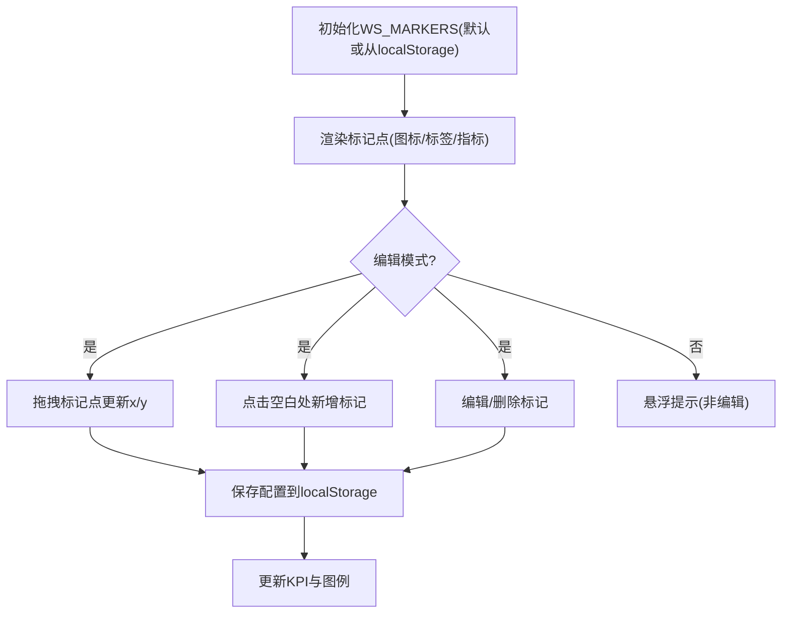
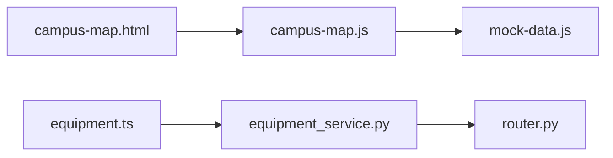

# 园区地图可视化

<cite>
**本文引用的文件**
- [campus-map.html](file://demo/campus-map.html)
- [campus-map.js](file://demo/assets/js/campus-map.js)
- [mock-data.js](file://demo/assets/js/mock-data.js)
- [CampusMapPage.tsx](file://webui_ref/client/src/pages/CampusMapPage/CampusMapPage.tsx)
- [equipment_service.py](file://backend/modules/resource/services/equipment_service.py)
- [router.py](file://backend/modules/resource/router.py)
- [equipment.ts](file://webui_ref/client/src/api/resource/equipment.ts)
</cite>

## 目录
1. [简介](#简介)
2. [项目结构](#项目结构)
3. [核心组件](#核心组件)
4. [架构总览](#架构总览)
5. [详细组件分析](#详细组件分析)
6. [依赖关系分析](#依赖关系分析)
7. [性能与优化](#性能与优化)
8. [故障排查指南](#故障排查指南)
9. [结论](#结论)
10. [附录：扩展与配置指南](#附录：扩展与配置指南)

## 简介
本技术文档围绕“园区地图可视化”模块，系统性阐述车间平面图、区域划分、设备位置坐标等空间数据的组织方式；说明地图渲染引擎（SVG）的选择与实现；解释设备在地图上的动态显示机制（图标、状态颜色、位置标记的实时更新）；描述用户交互（缩放、平移、点击查看详情、拖拽设备等）的实现原理；阐明地图与业务数据（设备ID到设备信息与状态）的绑定关系；并提供地图配置、自定义图层、标注样式设置等扩展开发指南，以及移动端适配、性能优化和兼容性处理的最佳实践。

## 项目结构
- 前端演示页面与脚本位于 demo 目录，包含 SVG 车间布局图与资源俯瞰总览图两个视图，提供完整的交互能力（缩放/平移/筛选/详情弹窗/编辑模式）。
- 后端服务提供设备台账与状态管理 API，供前端或未来集成使用。
- WebUI 参考页 CampusMapPage 为占位页面，后续可替换为完整实现。

图表来源
- [campus-map.html:214-245](file://demo/campus-map.html#L214-L245)
- [campus-map.js:1-110](file://demo/assets/js/campus-map.js#L1-L110)
- [mock-data.js:1-120](file://demo/assets/js/mock-data.js#L1-L120)
- [CampusMapPage.tsx:1-16](file://webui_ref/client/src/pages/CampusMapPage/CampusMapPage.tsx#L1-L16)
- [equipment_service.py:11-103](file://backend/modules/resource/services/equipment_service.py#L11-L103)
- [router.py:178-218](file://backend/modules/resource/router.py#L178-L218)
- [equipment.ts:119-178](file://webui_ref/client/src/api/resource/equipment.ts#L119-L178)

章节来源
- [campus-map.html:214-245](file://demo/campus-map.html#L214-L245)
- [campus-map.js:1-110](file://demo/assets/js/campus-map.js#L1-L110)
- [mock-data.js:1-120](file://demo/assets/js/mock-data.js#L1-L120)
- [CampusMapPage.tsx:1-16](file://webui_ref/client/src/pages/CampusMapPage/CampusMapPage.tsx#L1-L16)
- [equipment_service.py:11-103](file://backend/modules/resource/services/equipment_service.py#L11-L103)
- [router.py:178-218](file://backend/modules/resource/router.py#L178-L218)
- [equipment.ts:119-178](file://webui_ref/client/src/api/resource/equipment.ts#L119-L178)

## 核心组件
- 地图容器与视图：SVG 画布承载车间平面布局，支持 viewBox 自适应与 preserveAspectRatio 保持比例。
- 区域与网格：按行列与间距计算区域矩形，绘制标题、计数与通道标识。
- 设备层：按区域生成设备网格，依据状态映射颜色，支持悬浮提示与点击详情。
- 人员层：在区域底部以人形图标展示在岗人员，支持状态过滤与数量溢出提示。
- 交互系统：鼠标拖拽平移、滚轮缩放、工具栏按钮控制、全屏切换。
- 筛选与图层：状态筛选按钮、设备/人员图层开关、侧边栏统计与预警列表。
- 详情弹窗：统一模态框展示区域/设备/人员详情。
- 俯瞰总览图：基于图片叠加标记点，支持编辑模式拖拽、新增/删除/保存配置到本地存储。

章节来源
- [campus-map.js:113-231](file://demo/assets/js/campus-map.js#L113-L231)
- [campus-map.js:233-377](file://demo/assets/js/campus-map.js#L233-L377)
- [campus-map.js:439-495](file://demo/assets/js/campus-map.js#L439-L495)
- [campus-map.js:497-608](file://demo/assets/js/campus-map.js#L497-L608)
- [campus-map.js:610-709](file://demo/assets/js/campus-map.js#L610-L709)
- [campus-map.html:214-245](file://demo/campus-map.html#L214-L245)
- [campus-map.html:429-800](file://demo/campus-map.html#L429-L800)

## 架构总览
整体采用“前端 SVG 渲染 + 模拟数据/后端 API 可选接入”的分层架构。当前演示版通过 mock-data 生成区域、设备、人员数据并渲染；后端提供设备台账与状态更新接口，便于后续对接真实数据源。

图表来源
- [campus-map.html:214-245](file://demo/campus-map.html#L214-L245)
- [campus-map.js:84-110](file://demo/assets/js/campus-map.js#L84-L110)
- [mock-data.js:48-72](file://demo/assets/js/mock-data.js#L48-L72)
- [router.py:178-218](file://backend/modules/resource/router.py#L178-L218)
- [equipment_service.py:262-301](file://backend/modules/resource/services/equipment_service.py#L262-L301)

## 详细组件分析

### 数据模型与空间组织
- 区域定义：ZONES 数组定义每个区域的 id、名称、行列与跨列数，用于网格布局与边界计算。
- 设备数据：zoneDevices[zoneId] 存储该区域设备列表，含 id、name、status、statusLabel 等字段。
- 人员数据：zonePersonnel[zoneId] 存储该区域人员列表，含 id、name、status、statusLabel 等字段。
- 坐标与布局：VIEW_W/VIEW_H 定义画布尺寸，margin/gap/cols/rows 计算单元格宽高，zone._bounds 缓存区域边界用于定位。

图表来源
- [campus-map.js:22-32](file://demo/assets/js/campus-map.js#L22-L32)
- [campus-map.js:48-82](file://demo/assets/js/campus-map.js#L48-L82)
- [campus-map.js:141-157](file://demo/assets/js/campus-map.js#L141-L157)

章节来源
- [campus-map.js:22-32](file://demo/assets/js/campus-map.js#L22-L32)
- [campus-map.js:48-82](file://demo/assets/js/campus-map.js#L48-L82)
- [campus-map.js:141-157](file://demo/assets/js/campus-map.js#L141-L157)

### 渲染引擎选择与实现（SVG）
- 选择 SVG 的原因：矢量图形适合二维平面布局，易于交互（事件、动画）、样式可控、DOM 操作直观；对于中等规模设备/人员数量具备良好性能。
- 实现要点：
  - 创建 SVG 元素并设置 viewBox 与 preserveAspectRatio，保证响应式缩放。
  - 使用 defs/pattern 绘制背景网格与滤镜效果。
  - 按区域网格绘制矩形、标题、计数文本与通道箭头。
  - 设备层与人员层分别作为独立 group，便于图层开关与重绘。
  - 通过 transform（translate/scale）实现平移与缩放。

图表来源
- [campus-map.js:84-110](file://demo/assets/js/campus-map.js#L84-L110)
- [campus-map.js:113-231](file://demo/assets/js/campus-map.js#L113-L231)
- [campus-map.js:233-377](file://demo/assets/js/campus-map.js#L233-L377)
- [campus-map.js:439-495](file://demo/assets/js/campus-map.js#L439-L495)

章节来源
- [campus-map.js:84-110](file://demo/assets/js/campus-map.js#L84-L110)
- [campus-map.js:113-231](file://demo/assets/js/campus-map.js#L113-L231)
- [campus-map.js:233-377](file://demo/assets/js/campus-map.js#L233-L377)
- [campus-map.js:439-495](file://demo/assets/js/campus-map.js#L439-L495)

### 设备动态显示机制
- 状态映射：STATUS_CONFIG 将设备状态映射为标签与颜色，用于图标填充与提示。
- 布局算法：根据可见设备数量计算列数与行数，确定设备矩形大小与间距，避免拥挤。
- 视觉反馈：hover 显示 Tooltip 包含名称、编号、状态；点击弹出详情模态框。
- 实时更新：通过 refresh() 重新生成数据并调用 redraw() 重绘，支持状态变化后的即时刷新。

图表来源
- [campus-map.js:48-82](file://demo/assets/js/campus-map.js#L48-L82)
- [campus-map.js:233-296](file://demo/assets/js/campus-map.js#L233-L296)
- [campus-map.js:105-110](file://demo/assets/js/campus-map.js#L105-L110)

章节来源
- [campus-map.js:48-82](file://demo/assets/js/campus-map.js#L48-L82)
- [campus-map.js:233-296](file://demo/assets/js/campus-map.js#L233-L296)
- [campus-map.js:105-110](file://demo/assets/js/campus-map.js#L105-L110)

### 用户交互功能
- 缩放与平移：
  - 鼠标滚轮缩放：deltaY 决定放大/缩小，限制范围 [0.3, 4]，以鼠标位置为中心调整 panOffset。
  - 拖拽平移：mousedown/mousemove/mouseup 组合，记录起始偏移并在移动中应用 transform。
  - 工具栏按钮：放大/缩小/重置视图，更新 zoomLevel 与 panOffset。
- 点击查看详情：
  - 设备点击：showDeviceDetail 弹出模态框显示设备信息。
  - 区域点击：highlightZone 高亮选中区域并显示区域概览。
  - 人员点击：showPersonnelDetail 弹出人员详情。
- 图层与筛选：
  - 状态筛选按钮：activeStatusFilter 控制设备/人员可见性并重绘。
  - 图层开关：showEquipment/showPersonnel 控制设备层/人员层显隐。
- 全屏：
  - 使用浏览器 Fullscreen API 对地图容器进行全屏切换。

图表来源
- [campus-map.js:439-495](file://demo/assets/js/campus-map.js#L439-L495)
- [campus-map.js:497-608](file://demo/assets/js/campus-map.js#L497-L608)
- [campus-map.js:610-709](file://demo/assets/js/campus-map.js#L610-L709)
- [campus-map.html:417-427](file://demo/campus-map.html#L417-L427)

章节来源
- [campus-map.js:439-495](file://demo/assets/js/campus-map.js#L439-L495)
- [campus-map.js:497-608](file://demo/assets/js/campus-map.js#L497-L608)
- [campus-map.js:610-709](file://demo/assets/js/campus-map.js#L610-L709)
- [campus-map.html:417-427](file://demo/campus-map.html#L417-L427)

### 地图与业务数据绑定
- 设备ID关联：设备对象包含 id、zoneId，用于在区域层中定位与详情展示。
- 状态映射：STATUS_CONFIG 与 PERSONNEL_STATUS 提供状态到颜色/标签的映射，确保一致显示。
- 后端集成点：
  - 获取设备列表/详情/统计：后端 service 提供查询接口，前端可通过 API 封装调用。
  - 更新设备状态：PUT /api/resource/equipment/{code}/status，service 校验并持久化。
- 前端类型与API：equipment.ts 定义了设备类型、请求/响应结构与枚举映射，便于 TypeScript 工程集成。

图表来源
- [equipment.ts:119-178](file://webui_ref/client/src/api/resource/equipment.ts#L119-L178)
- [router.py:178-218](file://backend/modules/resource/router.py#L178-L218)
- [equipment_service.py:11-103](file://backend/modules/resource/services/equipment_service.py#L11-L103)
- [equipment_service.py:262-301](file://backend/modules/resource/services/equipment_service.py#L262-L301)

章节来源
- [equipment.ts:119-178](file://webui_ref/client/src/api/resource/equipment.ts#L119-L178)
- [router.py:178-218](file://backend/modules/resource/router.py#L178-L218)
- [equipment_service.py:11-103](file://backend/modules/resource/services/equipment_service.py#L11-L103)
- [equipment_service.py:262-301](file://backend/modules/resource/services/equipment_service.py#L262-L301)

### 俯瞰总览图与标记点编辑
- 标记点数据结构：WS_MARKERS 数组包含 id、name、type、x、y（百分比坐标），支持拖拽修改 x/y。
- 编辑模式：开启后支持拖拽标记点、点击空白处新增、右上角工具编辑/删除。
- 本地持久化：localStorage 保存 WS_MARKERS，刷新页面恢复。
- KPI联动：根据关联区域统计数据更新顶部 KPI 条。

图表来源
- [campus-map.html:429-800](file://demo/campus-map.html#L429-L800)

章节来源
- [campus-map.html:429-800](file://demo/campus-map.html#L429-L800)

## 依赖关系分析
- 前端依赖：
  - campus-map.html 引入 theme.css、lucide 图标库、mock-data.js、app.js、campus-map.js。
  - campus-map.js 依赖 SVG DOM API、事件系统、LocalStorage（俯瞰图）。
- 后端依赖：
  - equipment_service.py 依赖数据库查询封装（query_all/query_one/execute）。
  - router.py 暴露 RESTful 接口，调用 service 层。
- 类型与接口：
  - equipment.ts 定义前端类型与 API 封装，便于与后端对齐。

图表来源
- [campus-map.html:401-403](file://demo/campus-map.html#L401-L403)
- [campus-map.js:1-110](file://demo/assets/js/campus-map.js#L1-L110)
- [mock-data.js:1-120](file://demo/assets/js/mock-data.js#L1-L120)
- [equipment.ts:119-178](file://webui_ref/client/src/api/resource/equipment.ts#L119-L178)
- [equipment_service.py:11-103](file://backend/modules/resource/services/equipment_service.py#L11-L103)
- [router.py:178-218](file://backend/modules/resource/router.py#L178-L218)

章节来源
- [campus-map.html:401-403](file://demo/campus-map.html#L401-L403)
- [campus-map.js:1-110](file://demo/assets/js/campus-map.js#L1-L110)
- [mock-data.js:1-120](file://demo/assets/js/mock-data.js#L1-L120)
- [equipment.ts:119-178](file://webui_ref/client/src/api/resource/equipment.ts#L119-L178)
- [equipment_service.py:11-103](file://backend/modules/resource/services/equipment_service.py#L11-L103)
- [router.py:178-218](file://backend/modules/resource/router.py#L178-L218)

## 性能与优化
- 渲染性能：
  - 使用 SVG 分组（group）隔离设备层与人员层，减少重绘范围。
  - 合理计算网格布局，避免过多 DOM 节点导致卡顿。
  - 滚动缩放时限制范围并仅更新 transform，避免全量重绘。
- 交互性能：
  - 事件委托与条件判断减少不必要的事件处理。
  - 详情弹窗复用同一模态框，避免频繁创建销毁。
- 移动端适配：
  - 使用 touch 事件替代 mouse 事件（需补充实现）。
  - 触控缩放与平移需考虑手指多点触控与手势识别。
  - 小屏幕下适当减少设备/人员密度显示，提升可读性。
- 兼容性处理：
  - 使用标准 SVG 特性与 CSS，避免实验性 API。
  - 全屏 API 使用 requestFullscreen/exitFullscreen，兼容不同浏览器前缀。
- 数据加载：
  - 分页与懒加载：当设备/人员数量较大时，按区域分页加载。
  - 增量更新：仅更新状态变化的设备节点，减少 DOM 操作。

[本节为通用指导，不直接分析具体文件]

## 故障排查指南
- 地图不显示：
  - 检查容器是否存在（campus-svg-container），确认 SVG 创建与 appendChild 成功。
  - 查看控制台是否有 DOM 操作错误。
- 缩放/平移异常：
  - 检查事件绑定是否正确，确认 isPanning 状态切换。
  - 验证 transform 计算逻辑，确保 panOffset 与 zoomLevel 同步更新。
- 设备/人员不显示：
  - 确认 generateZoneData 已执行且数据正确。
  - 检查图层开关状态（showEquipment/showPersonnel）与筛选条件（activeStatusFilter）。
- 详情弹窗不出现：
  - 检查 setupPersonnelModal 是否初始化，modal 元素是否存在。
  - 确认 showPersonnelModal 调用参数正确。
- 俯瞰图标记丢失：
  - 检查 localStorage 是否可用，读取/写入是否抛出异常。
  - 确认 renderMarkers 被调用且 WS_MARKERS 数据有效。

章节来源
- [campus-map.js:84-110](file://demo/assets/js/campus-map.js#L84-L110)
- [campus-map.js:439-495](file://demo/assets/js/campus-map.js#L439-L495)
- [campus-map.js:711-746](file://demo/assets/js/campus-map.js#L711-L746)
- [campus-map.html:429-800](file://demo/campus-map.html#L429-L800)

## 结论
园区地图可视化模块通过 SVG 实现了车间平面图的清晰呈现与丰富交互，结合区域网格布局、设备状态映射与人员分布展示，提供了直观的监控与管理界面。当前演示版使用模拟数据，后端提供设备台账与状态更新接口，便于后续接入真实数据源。通过合理的渲染策略与交互设计，模块具备良好的可扩展性与性能表现，满足园区资源可视化的核心需求。

[本节为总结，不直接分析具体文件]

## 附录：扩展与配置指南
- 地图配置：
  - 区域定义：修改 ZONES 数组以增删区域、调整行列与跨列。
  - 状态映射：扩展 STATUS_CONFIG 与 PERSONNEL_STATUS 以支持新状态。
  - 画布尺寸：调整 VIEW_W/VIEW_H 以适应不同分辨率。
- 自定义图层：
  - 新增图层组（如环境传感器、能耗监测），按相同模式绘制与交互。
  - 在图层控制面板添加开关，控制显隐与重绘。
- 标注样式设置：
  - 通过 CSS 变量与 SVG 样式属性统一主题色与边框。
  - 使用 pattern/gradient 增强背景与区域视觉效果。
- 移动端适配：
  - 补充 touchstart/touchmove/touchend 事件处理，实现触控缩放与平移。
  - 优化小屏幕下的布局密度与交互热区。
- 性能优化：
  - 虚拟滚动：对超大数量设备/人员进行分页或虚拟渲染。
  - 增量更新：监听状态变化事件，仅更新受影响节点。
  - 防抖节流：对高频事件（如滚轮、拖拽）进行节流处理。
- 兼容性处理：
  - 检测浏览器特性（如 Fullscreen API、Touch Events）并提供降级方案。
  - 使用 polyfill 兼容旧版浏览器。

[本节为通用指导，不直接分析具体文件]