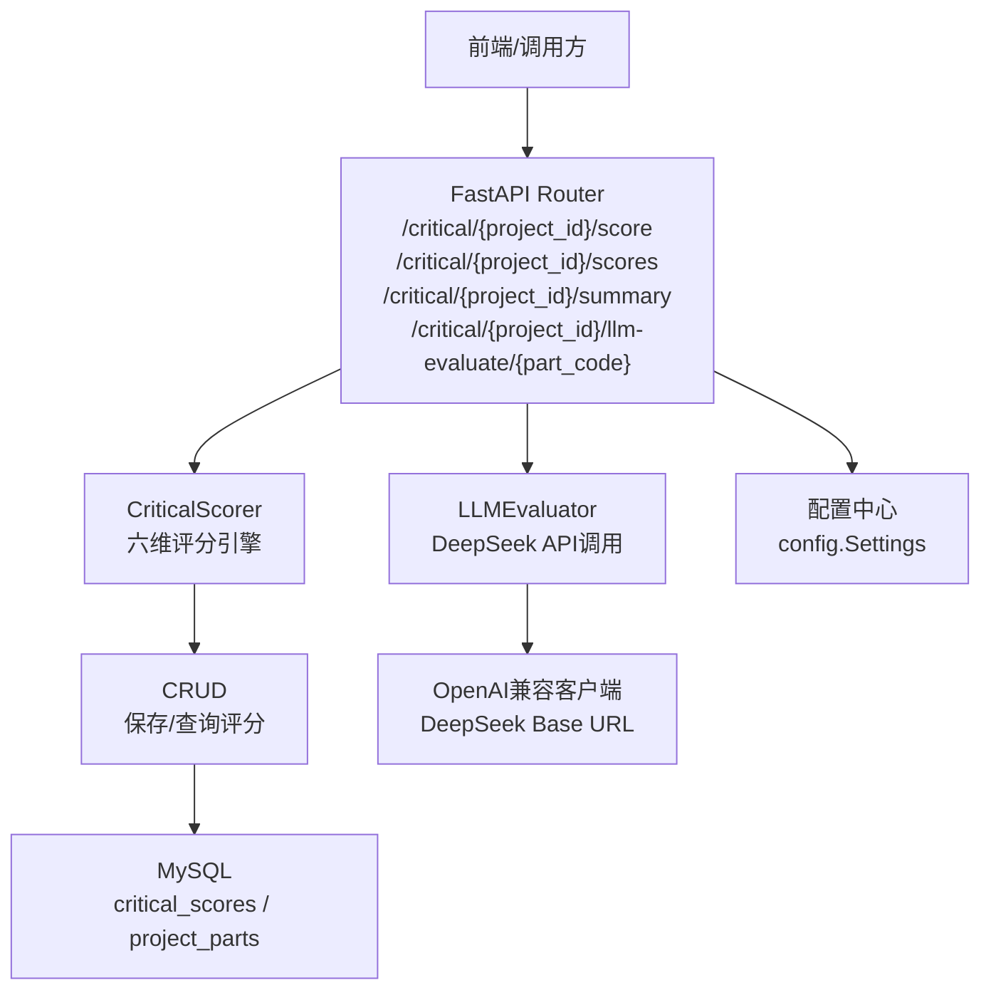
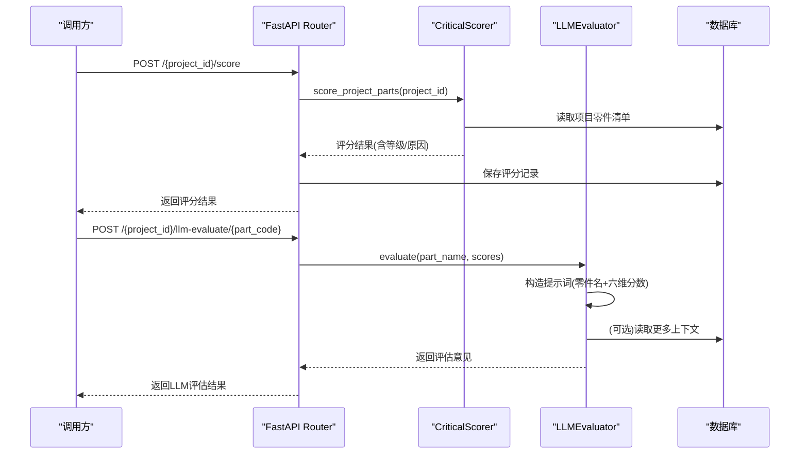
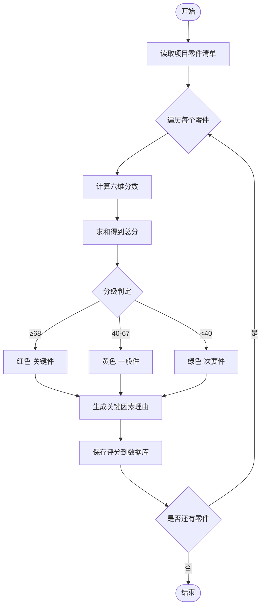
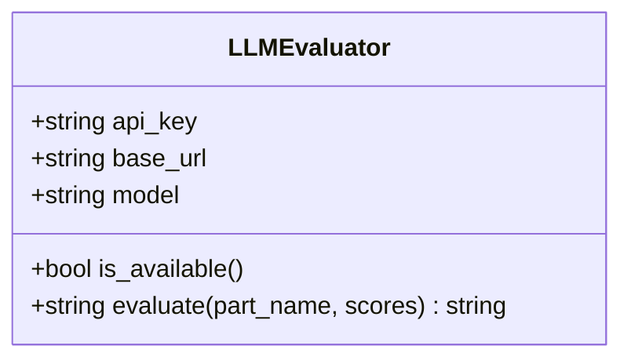
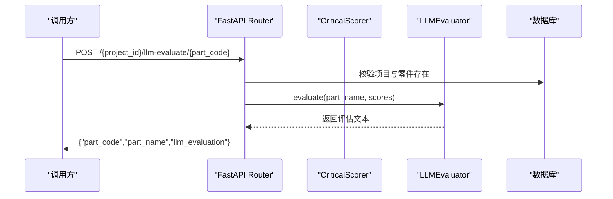
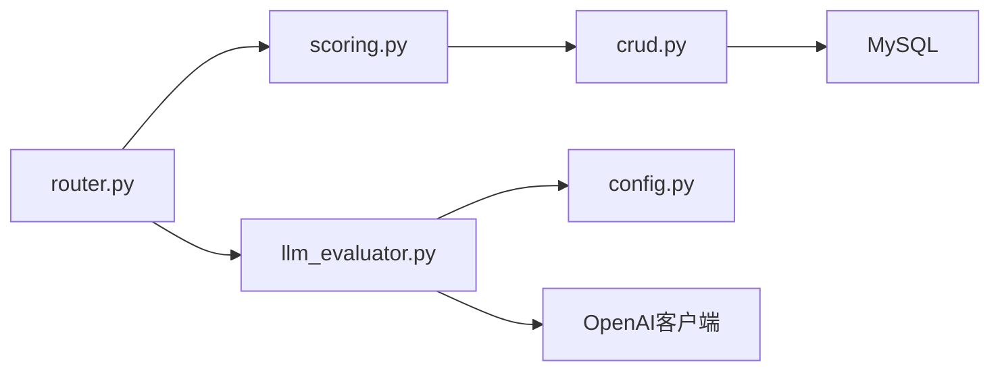

# LLM智能评估

<cite>
**本文引用的文件**
- [backend/critical_parts/llm_evaluator.py](file://backend/critical_parts/llm_evaluator.py)
- [backend/critical_parts/router.py](file://backend/critical_parts/router.py)
- [backend/critical_parts/schemas.py](file://backend/critical_parts/schemas.py)
- [backend/critical_parts/scoring.py](file://backend/critical_parts/scoring.py)
- [backend/critical_parts/crud.py](file://backend/critical_parts/crud.py)
- [backend/config.py](file://backend/config.py)
- [docs/关键件评分逻辑说明.md](file://docs/关键件评分逻辑说明.md)
</cite>

## 目录
1. [简介](#简介)
2. [项目结构](#项目结构)
3. [核心组件](#核心组件)
4. [架构总览](#架构总览)
5. [详细组件分析](#详细组件分析)
6. [依赖关系分析](#依赖关系分析)
7. [性能与可用性考虑](#性能与可用性考虑)
8. [故障排查指南](#故障排查指南)
9. [结论](#结论)
10. [附录：配置与运维](#附录：配置与运维)

## 简介
本技术文档面向“LLM智能评估”能力，围绕大语言模型在异常评估中的应用场景展开，包括异常情况描述的智能分析、影响程度的自动评估、处理建议的生成等。文档重点阐述LLM评估器的架构设计（输入数据格式、提示词工程、模型调用接口、结果解析）、评估算法实现原理（基于上下文理解的语义分析、多维度评分模型、置信度计算思路）、标准化输出规范（评分范围、等级划分、关键因素提取），以及LLM配置管理（模型选择、参数调优、API密钥管理等）。同时提供实际评估案例与效果验证方法，展示如何通过AI提升异常处理的准确性与效率。

## 项目结构
与LLM智能评估相关的后端模块集中在 critical_parts 子系统中，包含评分引擎、LLM评估器、路由与数据模型、数据库读写及全局配置。

图表来源
- [backend/critical_parts/router.py:23-95](file://backend/critical_parts/router.py#L23-L95)
- [backend/critical_parts/scoring.py:5-235](file://backend/critical_parts/scoring.py#L5-L235)
- [backend/critical_parts/llm_evaluator.py:5-62](file://backend/critical_parts/llm_evaluator.py#L5-L62)
- [backend/critical_parts/crud.py:4-62](file://backend/critical_parts/crud.py#L4-L62)
- [backend/config.py:76-80](file://backend/config.py#L76-L80)

章节来源
- [backend/critical_parts/router.py:23-95](file://backend/critical_parts/router.py#L23-L95)
- [backend/critical_parts/scoring.py:5-235](file://backend/critical_parts/scoring.py#L5-L235)
- [backend/critical_parts/llm_evaluator.py:5-62](file://backend/critical_parts/llm_evaluator.py#L5-L62)
- [backend/critical_parts/crud.py:4-62](file://backend/critical_parts/crud.py#L4-L62)
- [backend/config.py:76-80](file://backend/config.py#L76-L80)

## 核心组件
- CriticalScorer：六维评分引擎，按装配顺序优先级、零件大小/体量、报废处理难度、安全相关性、高价值零件、关重力矩六个维度进行打分并分级。
- LLMEvaluator：封装DeepSeek API调用，接收零件名称与多维分数，构造提示词，返回一句话评估意见。
- Router：暴露REST接口，支持批量评分、查询评分与摘要、单零件LLM评估。
- Schemas：定义输入输出数据结构，如PartScoreInput、PartScoreResult、BatchScoreRequest、ScoreSummary。
- CRUD：负责将评分写入数据库并读取评分列表与摘要统计。
- Config：集中管理DeepSeek相关配置（API Key、Base URL、Model）及服务运行参数。

章节来源
- [backend/critical_parts/scoring.py:5-235](file://backend/critical_parts/scoring.py#L5-L235)
- [backend/critical_parts/llm_evaluator.py:5-62](file://backend/critical_parts/llm_evaluator.py#L5-L62)
- [backend/critical_parts/router.py:23-95](file://backend/critical_parts/router.py#L23-L95)
- [backend/critical_parts/schemas.py:5-40](file://backend/critical_parts/schemas.py#L5-L40)
- [backend/critical_parts/crud.py:4-62](file://backend/critical_parts/crud.py#L4-L62)
- [backend/config.py:76-80](file://backend/config.py#L76-L80)

## 架构总览
系统采用“规则引擎 + LLM增强”的双轨模式：
- 规则引擎（CriticalScorer）提供透明、可解释的基础评分与分级；
- LLM（LLMEvaluator）在需要时提供语义理解与补充性评估意见，用于异常描述分析、影响程度判断与建议生成。

图表来源
- [backend/critical_parts/router.py:23-95](file://backend/critical_parts/router.py#L23-L95)
- [backend/critical_parts/scoring.py:168-235](file://backend/critical_parts/scoring.py#L168-L235)
- [backend/critical_parts/llm_evaluator.py:19-62](file://backend/critical_parts/llm_evaluator.py#L19-L62)
- [backend/critical_parts/crud.py:4-62](file://backend/critical_parts/crud.py#L4-L62)

## 详细组件分析

### 评分引擎（CriticalScorer）
- 六维评分：
  - 装配顺序优先级（30分）：依据关键词匹配装配阶段，给出30/20/15/10分档。
  - 零件大小/体量（20分）：按总成/电池/电机等大部件、线束/支架等中部件、紧固件等小部件分档。
  - 报废处理难度（15分）：涉及电池/燃油/制冷剂/机油等高危物料给高分。
  - 安全相关性（15分）：制动/转向/气囊/安全带/雷达/灯/摄像头等安全相关给高分。
  - 高价值零件（10分）：电池/控制器/显示屏/座椅/雷达/智能驾驶模块等高价值给高分。
  - 关重力矩（10分）：有★标识或紧固类关键词给高分。
- 总分与分级：
  - 满分100分；≥68分为关键件（红色），40-67分为一般件（黄色），<40分为次要件（绿色）。
- 理由生成：根据各维度得分情况拼接关键因素文本，便于后续分析与可视化。

图表来源
- [backend/critical_parts/scoring.py:27-166](file://backend/critical_parts/scoring.py#L27-L166)
- [backend/critical_parts/scoring.py:168-235](file://backend/critical_parts/scoring.py#L168-L235)

章节来源
- [backend/critical_parts/scoring.py:27-166](file://backend/critical_parts/scoring.py#L27-L166)
- [backend/critical_parts/scoring.py:168-235](file://backend/critical_parts/scoring.py#L168-L235)

### LLM评估器（LLMEvaluator）
- 功能：基于DeepSeek API对单个零件进行语义评估，结合零件名称与六维分数，输出一句话评估意见。
- 输入：
  - part_name：零件名称
  - scores：六维分数字典（assembly/size/disposal/safety/value/torque）
- 提示词工程：将零件名称与各维度分数嵌入提示词，要求模型以专家视角给出关键程度评估与理由。
- 模型调用：使用OpenAI兼容客户端，指定base_url与model，设置max_tokens与temperature控制输出长度与创造性。
- 结果解析：取response.choices[0].message.content作为评估文本，记录日志并返回。
- 可用性检查：通过is_available()检测API Key是否存在，未配置时直接返回提示信息。

图表来源
- [backend/critical_parts/llm_evaluator.py:5-62](file://backend/critical_parts/llm_evaluator.py#L5-L62)

章节来源
- [backend/critical_parts/llm_evaluator.py:5-62](file://backend/critical_parts/llm_evaluator.py#L5-L62)

### 路由与接口（Router）
- 评分接口：
  - POST /{project_id}/score：对项目所有零件执行六维评分，保存到数据库并返回结果。
  - GET /{project_id}/scores：获取项目的评分列表。
  - GET /{project_id}/summary：获取评分摘要（红黄绿数量统计）。
- LLM评估接口：
  - POST /{project_id}/llm-evaluate/{part_code}：对单个零件进行LLM评估，返回评估意见。
- 错误处理：项目不存在或零件不存在时返回HTTP 404。

图表来源
- [backend/critical_parts/router.py:74-95](file://backend/critical_parts/router.py#L74-L95)
- [backend/critical_parts/llm_evaluator.py:19-62](file://backend/critical_parts/llm_evaluator.py#L19-L62)

章节来源
- [backend/critical_parts/router.py:23-95](file://backend/critical_parts/router.py#L23-L95)

### 数据模型（Schemas）
- PartScoreInput：定义单个零件的六维输入分数及其取值范围。
- PartScoreResult：定义评分结果字段，包括各维度分数、总分、等级、是否关键件。
- BatchScoreRequest：批量请求体，包含项目ID与零件列表。
- ScoreSummary：汇总统计，包含总数与红黄绿计数。

章节来源
- [backend/critical_parts/schemas.py:5-40](file://backend/critical_parts/schemas.py#L5-L40)

### 数据库操作（CRUD）
- save_critical_score：插入或更新critical_scores表，支持重复键覆盖更新。
- get_critical_scores：查询某项目的所有评分并按总分降序排列。
- get_critical_summary：按等级分组统计数量，返回红黄绿计数与总数。

章节来源
- [backend/critical_parts/crud.py:4-62](file://backend/critical_parts/crud.py#L4-L62)

## 依赖关系分析
- 模块耦合：
  - Router依赖scoring与llm_evaluator，并通过crud访问数据库。
  - scoring依赖database进行数据读取。
  - llm_evaluator依赖config获取DeepSeek配置，并使用openai客户端调用外部服务。
- 外部依赖：
  - OpenAI兼容客户端（用于DeepSeek API调用）。
  - MySQL数据库（存储评分与项目零件信息）。
- 潜在风险：
  - 外部API不可用或限流会导致LLM评估失败。
  - 数据库连接异常会影响评分保存与查询。

图表来源
- [backend/critical_parts/router.py:23-95](file://backend/critical_parts/router.py#L23-L95)
- [backend/critical_parts/scoring.py:168-235](file://backend/critical_parts/scoring.py#L168-L235)
- [backend/critical_parts/llm_evaluator.py:19-62](file://backend/critical_parts/llm_evaluator.py#L19-L62)
- [backend/critical_parts/crud.py:4-62](file://backend/critical_parts/crud.py#L4-L62)
- [backend/config.py:76-80](file://backend/config.py#L76-L80)

章节来源
- [backend/critical_parts/router.py:23-95](file://backend/critical_parts/router.py#L23-L95)
- [backend/critical_parts/scoring.py:168-235](file://backend/critical_parts/scoring.py#L168-L235)
- [backend/critical_parts/llm_evaluator.py:19-62](file://backend/critical_parts/llm_evaluator.py#L19-L62)
- [backend/critical_parts/crud.py:4-62](file://backend/critical_parts/crud.py#L4-L62)
- [backend/config.py:76-80](file://backend/config.py#L76-L80)

## 性能与可用性考虑
- 规则引擎性能：
  - 关键词匹配为O(n)复杂度，n为关键词集合大小；整体评分流程为线性遍历零件清单，适合批量处理。
- LLM调用性能：
  - 单次评估为网络I/O绑定，受限于API响应时间与并发限制；可通过降低temperature与max_tokens减少延迟。
- 可用性策略：
  - 未配置API Key时快速失败，避免阻塞主流程。
  - 异常捕获并记录日志，返回友好错误信息。
- 扩展建议：
  - 引入缓存层（如Redis）缓存常见零件的LLM评估结果，减少重复调用。
  - 增加重试与退避机制，提高对外部API的鲁棒性。

## 故障排查指南
- LLM未配置：
  - 现象：接口返回“LLM 未配置，请设置 DEEPSEEK_API_KEY”。
  - 处理：检查环境变量DEEPSEEK_API_KEY是否正确设置。
- 模型调用失败：
  - 现象：接口返回“评估失败: ...”，日志中出现异常信息。
  - 处理：检查DEEPSEEK_BASE_URL与DEEPSEEK_MODEL配置；确认网络连通性与API配额。
- 项目或零件不存在：
  - 现象：接口返回HTTP 404。
  - 处理：确认project_id与part_code正确且存在于数据库中。
- 评分结果为空：
  - 现象：返回total_parts=0。
  - 处理：检查project_parts表中是否有对应项目的零件记录。

章节来源
- [backend/critical_parts/router.py:74-95](file://backend/critical_parts/router.py#L74-L95)
- [backend/critical_parts/llm_evaluator.py:29-62](file://backend/critical_parts/llm_evaluator.py#L29-L62)

## 结论
本方案通过“规则引擎 + LLM增强”的方式，既保证了评分的可解释性与稳定性，又引入了语义理解能力以提升异常评估的准确性与可操作性。未来可在以下方面持续优化：
- 扩展提示词工程，融入更多上下文信息（如工艺要求、历史异常记录）。
- 引入置信度计算，量化LLM评估结果的可靠性。
- 建立评估效果验证体系，对比规则评分与LLM评估的一致性，并持续迭代权重与阈值。

## 附录：配置与运维
- DeepSeek配置：
  - DEEPSEEK_API_KEY：API密钥，必填。
  - DEEPSEEK_BASE_URL：API基础地址，默认https://api.deepseek.com。
  - DEEPSEEK_MODEL：模型名称，默认deepseek-chat。
- 服务运行参数：
  - SERVER_HOST/SERVER_PORT：服务监听地址与端口。
  - DEBUG/CORS_ORIGINS：调试开关与跨域配置。
- 数据库配置：
  - DB_HOST/DB_PORT/DB_USER/DB_PASSWORD/DB_DATABASE：MySQL连接参数。
- 运维建议：
  - 定期备份critical_scores与project_parts数据。
  - 监控API调用成功率与延迟，设置告警阈值。
  - 通过system_params动态调整评分权重与阈值（参考文档中的SQL示例）。

章节来源
- [backend/config.py:51-80](file://backend/config.py#L51-L80)
- [docs/关键件评分逻辑说明.md:172-182](file://docs/关键件评分逻辑说明.md#L172-L182)