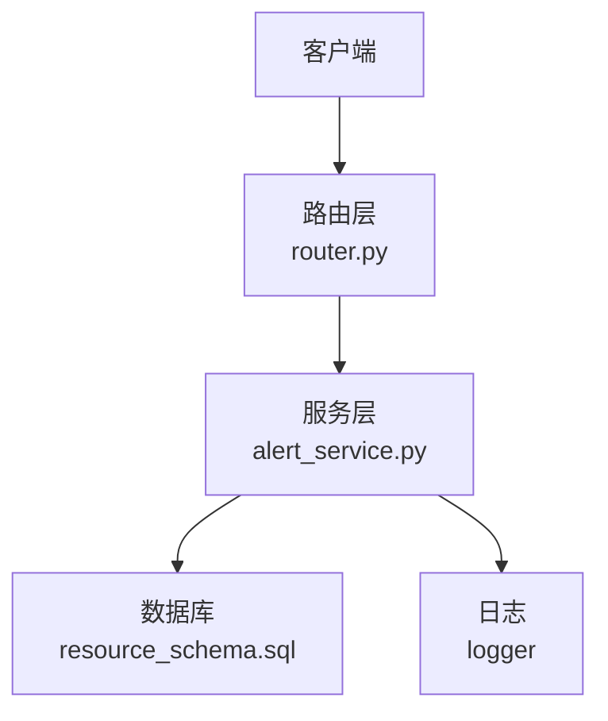
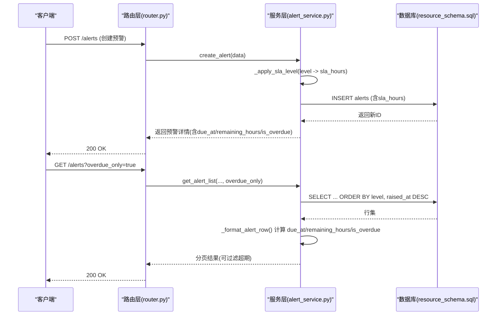
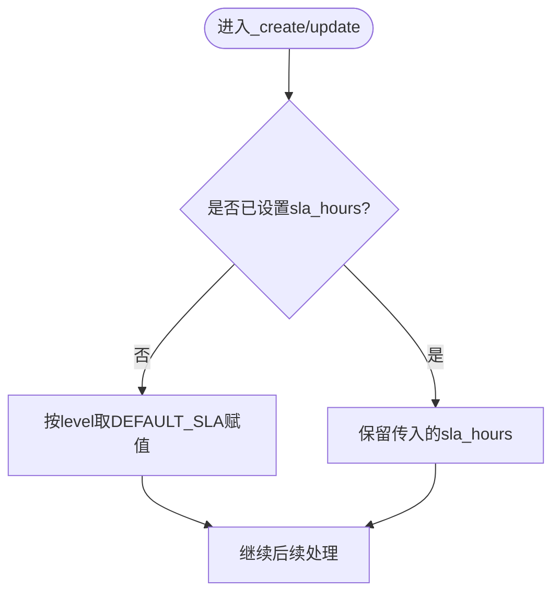
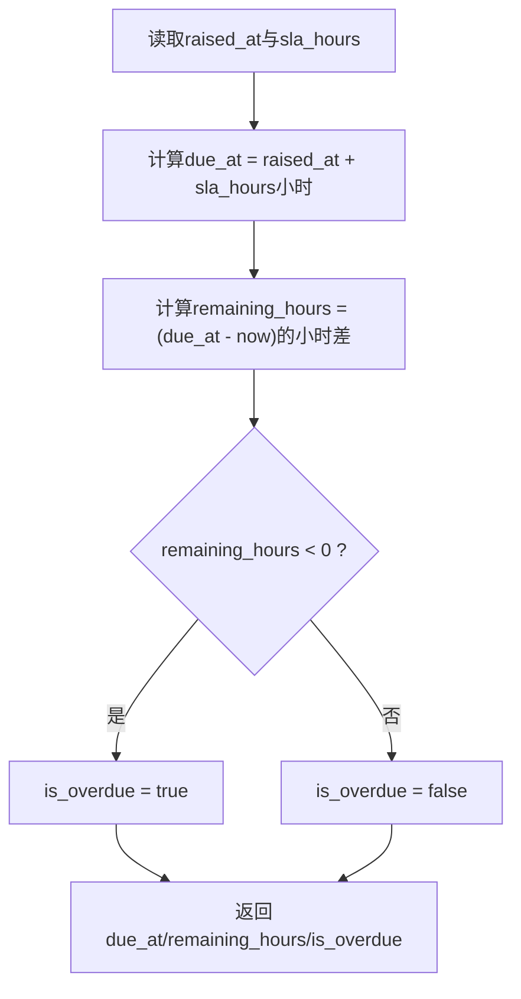
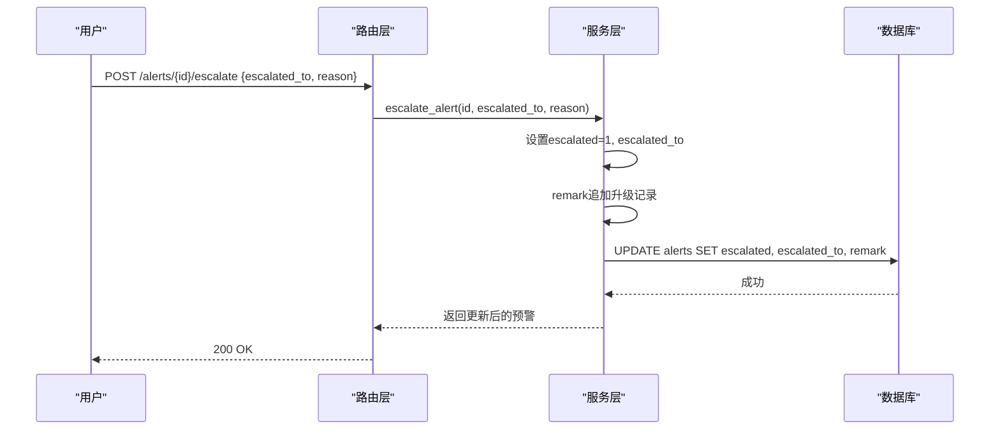
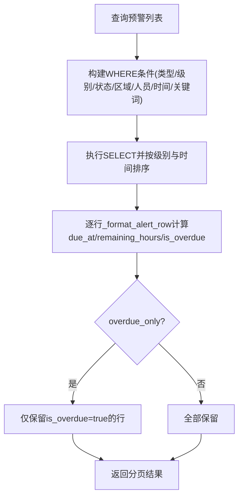
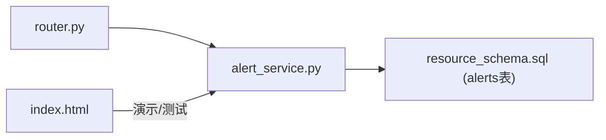

# SLA服务等级协议管理

<cite>
**本文引用的文件**
- [alert_service.py](file://backend/modules/resource/services/alert_service.py)
- [router.py](file://backend/modules/resource/router.py)
- [resource_schema.sql](file://backend/sql/resource_schema.sql)
- [index.html](file://static/index.html)
</cite>

## 目录
1. [简介](#简介)
2. [项目结构](#项目结构)
3. [核心组件](#核心组件)
4. [架构总览](#架构总览)
5. [详细组件分析](#详细组件分析)
6. [依赖关系分析](#依赖关系分析)
7. [性能考虑](#性能考虑)
8. [故障排查指南](#故障排查指南)
9. [结论](#结论)
10. [附录：API与最佳实践](#附录api与最佳实践)

## 简介
本模块提供SLA（服务等级协议）管理能力，围绕异常预警的响应时效进行管控。系统为不同级别预设默认SLA响应时长：critical=4小时、high=8小时、medium=24小时、low=72小时；在创建或更新时自动填充sla_hours。通过raised_at与sla_hours计算due_at截止时间，实时计算remaining_hours剩余时间，并判断is_overdue超期状态。当预警超过SLA时限，支持升级上报至目标部门（escalated_to），并提供overdue_only过滤条件用于监控和统计超期预警。

## 项目结构
SLA能力主要分布在以下位置：
- 服务层：alert_service.py，实现SLA默认值填充、SLA计算、列表过滤、升级、统计等核心逻辑
- 路由层：router.py，暴露REST接口，接收请求参数并调用服务层
- 数据层：resource_schema.sql，定义alerts表及SLA相关字段
- 前端演示：index.html，包含SLA默认值与计算示例（用于演示/测试）

图表来源
- [router.py:949-1069](file://backend/modules/resource/router.py#L949-L1069)
- [alert_service.py:47-172](file://backend/modules/resource/services/alert_service.py#L47-L172)
- [resource_schema.sql:112-163](file://backend/sql/resource_schema.sql#L112-L163)

章节来源
- [router.py:949-1069](file://backend/modules/resource/router.py#L949-L1069)
- [alert_service.py:25-38](file://backend/modules/resource/services/alert_service.py#L25-L38)
- [resource_schema.sql:112-163](file://backend/sql/resource_schema.sql#L112-L163)

## 核心组件
- 默认SLA配置：按级别自动分配sla_hours（critical=4, high=8, medium=24, low=72）
- SLA计算：基于raised_at与sla_hours计算due_at、remaining_hours、is_overdue
- 升级机制：支持将预警升级至指定目标部门（escalated_to），并记录原因到remark
- 监控与统计：支持overdue_only过滤、统计SLA超期数量、趋势与分布

章节来源
- [alert_service.py:25-38](file://backend/modules/resource/services/alert_service.py#L25-L38)
- [alert_service.py:143-172](file://backend/modules/resource/services/alert_service.py#L143-L172)
- [alert_service.py:305-314](file://backend/modules/resource/services/alert_service.py#L305-L314)
- [alert_service.py:337-399](file://backend/modules/resource/services/alert_service.py#L337-L399)

## 架构总览
SLA流程从创建预警开始，经过SLA默认值填充、存储、查询时的SLA计算与过滤、以及升级与统计闭环。

图表来源
- [router.py:1006-1016](file://backend/modules/resource/router.py#L1006-L1016)
- [router.py:949-978](file://backend/modules/resource/router.py#L949-L978)
- [alert_service.py:188-254](file://backend/modules/resource/services/alert_service.py#L188-L254)
- [alert_service.py:47-172](file://backend/modules/resource/services/alert_service.py#L47-L172)
- [resource_schema.sql:112-163](file://backend/sql/resource_schema.sql#L112-L163)

## 详细组件分析

### 默认SLA响应时长自动分配
- 规则：若未显式传入sla_hours或值为空/0，则根据level自动填充DEFAULT_SLA映射
- 默认映射：critical=4h、high=8h、medium=24h、low=72h
- 适用场景：创建与更新时均会应用该规则，确保每条预警都有明确的SLA约束

图表来源
- [alert_service.py:33-38](file://backend/modules/resource/services/alert_service.py#L33-L38)
- [alert_service.py:205-235](file://backend/modules/resource/services/alert_service.py#L205-L235)
- [alert_service.py:269-269](file://backend/modules/resource/services/alert_service.py#L269-L269)

章节来源
- [alert_service.py:25-38](file://backend/modules/resource/services/alert_service.py#L25-L38)
- [alert_service.py:188-254](file://backend/modules/resource/services/alert_service.py#L188-L254)
- [alert_service.py:257-302](file://backend/modules/resource/services/alert_service.py#L257-L302)

### SLA计算逻辑（due_at、remaining_hours、is_overdue）
- due_at：raised_at + sla_hours（小时）
- remaining_hours：(due_at - now)的小时差，保留一位小数；若为负数表示已超期
- is_overdue：remaining_hours < 0 时为真
- 注意：上述计算在服务层格式化行时执行，不直接写库，属于“软计算”展示

图表来源
- [alert_service.py:143-172](file://backend/modules/resource/services/alert_service.py#L143-L172)

章节来源
- [alert_service.py:143-172](file://backend/modules/resource/services/alert_service.py#L143-L172)

### SLA升级机制（escalated_to）
- 触发方式：调用升级接口，传入目标部门escalated_to与可选reason
- 行为：设置escalated=1、escalated_to为目标部门，并将升级记录追加到remark中
- 用途：当预警接近或超过SLA时，自动或手动升级至更高层级部门处理

图表来源
- [router.py:1054-1064](file://backend/modules/resource/router.py#L1054-L1064)
- [alert_service.py:305-314](file://backend/modules/resource/services/alert_service.py#L305-L314)

章节来源
- [alert_service.py:305-314](file://backend/modules/resource/services/alert_service.py#L305-L314)
- [router.py:1054-1064](file://backend/modules/resource/router.py#L1054-L1064)

### SLA监控与统计（overdue_only、超期识别）
- 列表过滤：overdue_only=true时，仅返回is_overdue为真的预警（软超期）
- 统计指标：get_alert_stats中统计overdue数量（pending/processing且raised_at+sla_hours < NOW）
- 使用建议：结合status、level、source等多维筛选，定位高风险预警

图表来源
- [alert_service.py:47-172](file://backend/modules/resource/services/alert_service.py#L47-L172)
- [alert_service.py:337-399](file://backend/modules/resource/services/alert_service.py#L337-L399)

章节来源
- [alert_service.py:47-172](file://backend/modules/resource/services/alert_service.py#L47-L172)
- [alert_service.py:337-399](file://backend/modules/resource/services/alert_service.py#L337-L399)

### 数据模型与字段说明（alerts表）
- 关键字段：
  - alert_code：唯一编号
  - alert_type：预警类型枚举
  - level：级别（critical/high/medium/low）
  - raised_at：发生/发现时间
  - sla_hours：响应SLA（小时）
  - escalated：是否已升级
  - escalated_to：升级目标部门
  - status：处理状态（pending/processing/resolved/closed/expired）
  - 其他：handler/handler_department、各阶段时间戳、处置信息、损失金额、影响工时等

章节来源
- [resource_schema.sql:112-163](file://backend/sql/resource_schema.sql#L112-L163)

## 依赖关系分析
- 路由层依赖服务层：router.py中的端点调用alert_service.py中的函数
- 服务层依赖数据库：通过query_all/query_one/execute等访问alerts表
- 前端演示依赖默认SLA映射：index.html中定义了与后端一致的默认SLA映射用于模拟数据

图表来源
- [router.py:949-1069](file://backend/modules/resource/router.py#L949-L1069)
- [alert_service.py:47-172](file://backend/modules/resource/services/alert_service.py#L47-L172)
- [resource_schema.sql:112-163](file://backend/sql/resource_schema.sql#L112-L163)
- [index.html:9445-9468](file://static/index.html#L9445-L9468)

章节来源
- [router.py:949-1069](file://backend/modules/resource/router.py#L949-L1069)
- [alert_service.py:47-172](file://backend/modules/resource/services/alert_service.py#L47-L172)
- [resource_schema.sql:112-163](file://backend/sql/resource_schema.sql#L112-L163)
- [index.html:9445-9468](file://static/index.html#L9445-L9468)

## 性能考虑
- 列表查询使用索引：alerts表对level、status、raised_at、zone_code、related_type+related_id等建立索引，提升筛选与排序效率
- 软计算避免写库：due_at/remaining_hours/is_overdue在服务层计算，减少数据库写入压力
- 分页限制：page_size上限控制单次返回量，避免大结果集导致性能问题
- 统计查询优化：统计SQL使用GROUP BY与聚合函数，关注大数据量下的执行计划

[本节为通用性能建议，无需特定文件引用]

## 故障排查指南
- 创建失败（重复编号）：若传入的alert_code已存在，将抛出错误；请检查编号生成策略或允许系统自动生成
- 无效枚举值：alert_type、level、status需为允许枚举之一，否则抛出错误
- 不存在预警：更新或获取详情时，若ID不存在将抛出错误
- 批量更新失败：批量更新捕获异常并记录日志，返回受影响行数

章节来源
- [alert_service.py:188-254](file://backend/modules/resource/services/alert_service.py#L188-L254)
- [alert_service.py:257-302](file://backend/modules/resource/services/alert_service.py#L257-L302)
- [alert_service.py:317-334](file://backend/modules/resource/services/alert_service.py#L317-L334)

## 结论
本SLA管理模块通过默认SLA自动分配、精确的SLA计算、灵活的升级机制与完善的监控统计，为异常预警提供了端到端的时效保障。结合overdue_only过滤与统计指标，可有效识别和处理超期预警，支撑业务SLA达成与持续改进。

[本节为总结性内容，无需特定文件引用]

## 附录：API与最佳实践

### API概览（与SLA相关）
- 创建预警：POST /alerts
  - 请求体包含title、alert_type、level、sla_hours（可选）、raised_at（可选）等
  - 若未传sla_hours，将根据level自动填充默认值
- 获取预警列表：GET /alerts
  - 支持overdue_only=true过滤超期预警
  - 支持level/status/source/zone_code/assembly_site/handler/raised_start/raised_end/keyword等筛选
- 获取预警详情：GET /alerts/{alert_id}
- 更新预警：PUT /alerts/{alert_id}
  - 可更新sla_hours、level、status等；更新时会重新应用SLA默认值
- 处理预警：POST /alerts/{alert_id}/handle
  - 可将状态置为processing，并自动记录processing_started_at
- 升级预警：POST /alerts/{alert_id}/escalate
  - 传入escalated_to与可选reason，系统将标记escalated并记录升级备注
- 批量更新：POST /alerts/batch
  - 批量修改状态，支持processing/resolved/closed等
- 统计：GET /alerts/stats
  - 返回total、critical、unresolved、overdue、escalated、分布与趋势等

章节来源
- [router.py:949-1069](file://backend/modules/resource/router.py#L949-L1069)

### SLA策略制定与最佳实践
- 级别与SLA匹配：
  - critical（严重）：4小时响应，适用于直接影响交付或安全的重大异常
  - high（高）：8小时响应，适用于影响进度或质量的重要异常
  - medium（中）：24小时响应，适用于一般性问题
  - low（低）：72小时响应，适用于非关键或辅助性问题
- 预防措施：
  - 在创建预警时明确level与sla_hours，必要时自定义sla_hours以适配特殊场景
  - 及时更新status与处理信息，避免长期处于pending导致超期
  - 对接近SLA的预警提前升级，降低超期风险
- 绩效评估方法：
  - 使用overdue_only过滤查看超期预警，结合stats中的overdue指标评估SLA达成率
  - 分析level_distribution与type_distribution，定位高频与高风险类型
  - 跟踪weekly_trend，观察SLA改善趋势

[本节为通用实践建议，无需特定文件引用]

### 具体API调用示例（路径参考）
- 创建预警（含SLA）：POST /alerts
  - 参考路径：[router.py:1006-1016](file://backend/modules/resource/router.py#L1006-L1016)
- 获取超期预警列表：GET /alerts?overdue_only=true
  - 参考路径：[router.py:949-978](file://backend/modules/resource/router.py#L949-L978)
- 升级预警：POST /alerts/{alert_id}/escalate
  - 参考路径：[router.py:1054-1064](file://backend/modules/resource/router.py#L1054-L1064)
- 统计SLA指标：GET /alerts/stats
  - 参考路径：[router.py:981-988](file://backend/modules/resource/router.py#L981-L988)

### 错误处理方案
- 400 Bad Request：参数校验失败（如无效枚举、重复编号）
- 404 Not Found：预警ID不存在
- 500 Internal Server Error：服务端异常（如数据库错误）
- 建议：在调用前校验level/sla_hours/status等必填与合法值；对超时与重试做好兜底

章节来源
- [router.py:949-1069](file://backend/modules/resource/router.py#L949-L1069)
- [alert_service.py:188-334](file://backend/modules/resource/services/alert_service.py#L188-L334)