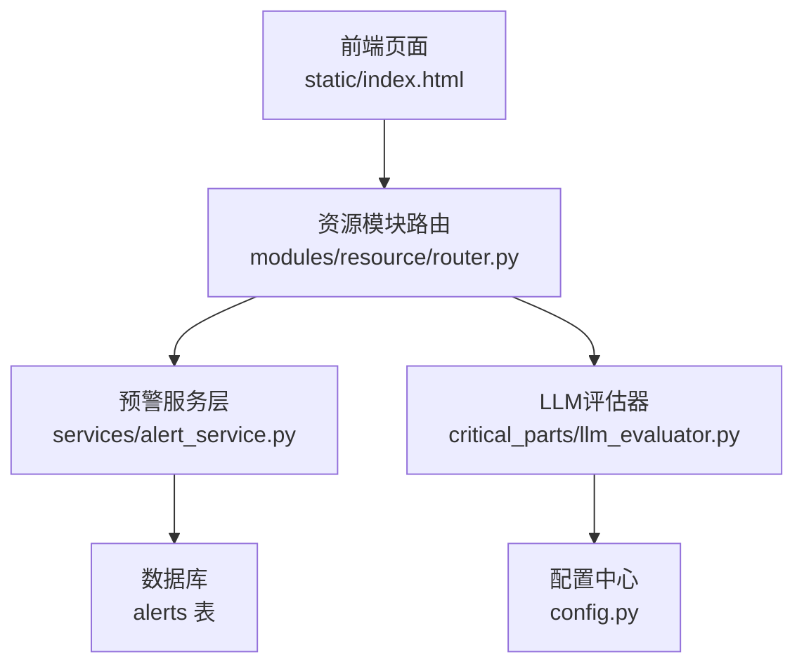
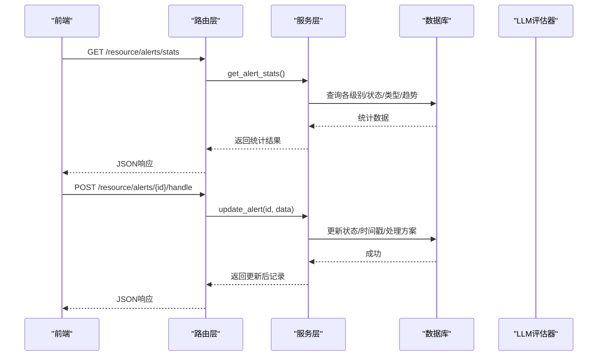
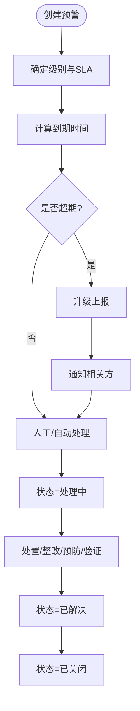
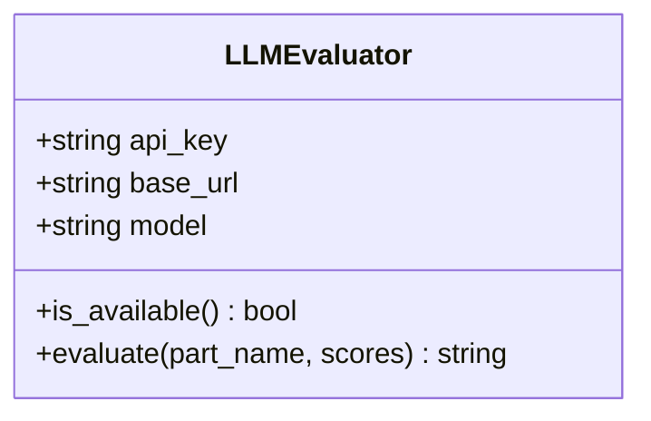
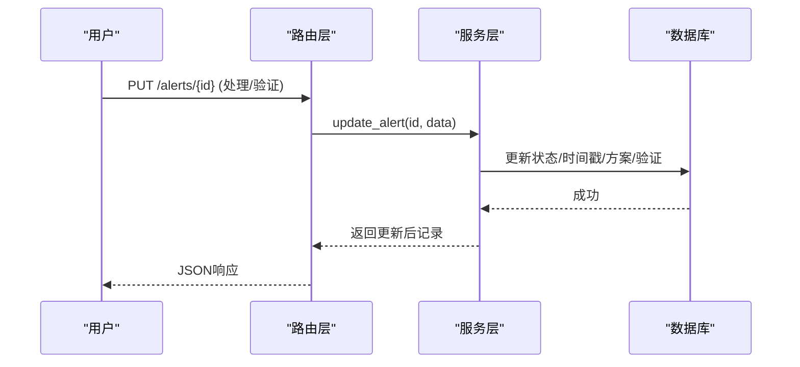
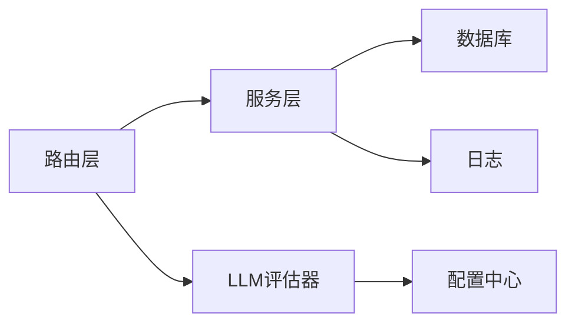

# 异常预警中心

<cite>
**本文引用的文件**
- [alert_service.py](file://backend/modules/resource/services/alert_service.py)
- [router.py](file://backend/modules/resource/router.py)
- [resource_schema.sql](file://backend/sql/resource_schema.sql)
- [llm_evaluator.py](file://backend/critical_parts/llm_evaluator.py)
- [config.py](file://backend/config.py)
- [index.html](file://static/index.html)
- [AlertCenterPage.tsx](file://webui_ref/client/src/pages/AlertCenterPage/AlertCenterPage.tsx)
</cite>

## 目录
1. [简介](#简介)
2. [项目结构](#项目结构)
3. [核心组件](#核心组件)
4. [架构总览](#架构总览)
5. [详细组件分析](#详细组件分析)
6. [依赖关系分析](#依赖关系分析)
7. [性能与可扩展性](#性能与可扩展性)
8. [故障排查指南](#故障排查指南)
9. [结论](#结论)
10. [附录：API与数据模型](#附录api与数据模型)

## 简介
本模块为“异常预警中心”，提供多级预警（警告、严重、紧急等）、SLA管理（响应时限、处理时限、升级机制）、LLM智能评估辅助、规则化配置、闭环处理流程（自动分派、人工确认、处理跟踪、效果验证）以及统计分析（趋势、效率、影响评估）。同时预留多渠道通知扩展点，便于后续接入邮件、短信、企业微信、移动端推送与语音播报。

## 项目结构
- 后端服务层
  - 资源模块路由与请求模型：定义预警的CRUD、批量操作、升级上报等接口
  - 预警服务层：实现列表查询、创建/更新、升级、统计等核心逻辑
  - 数据库表结构：定义异常预警表字段、索引与约束
  - LLM评估器：基于DeepSeek API对关键件进行语义评估
  - 配置中心：读取环境变量（如LLM密钥、服务端口等）
- 前端展示
  - 静态页面：包含预警中心的数据生成、筛选、分页、统计展示
  - WebUI参考页：占位页面，用于承载未来完整的前端功能

**图表来源**
- [router.py:949-1099](file://backend/modules/resource/router.py#L949-L1099)
- [alert_service.py:47-140](file://backend/modules/resource/services/alert_service.py#L47-L140)
- [resource_schema.sql:120-163](file://backend/sql/resource_schema.sql#L120-L163)
- [llm_evaluator.py:5-62](file://backend/critical_parts/llm_evaluator.py#L5-L62)
- [config.py:76-85](file://backend/config.py#L76-L85)

**章节来源**
- [router.py:949-1099](file://backend/modules/resource/router.py#L949-L1099)
- [alert_service.py:47-140](file://backend/modules/resource/services/alert_service.py#L47-L140)
- [resource_schema.sql:120-163](file://backend/sql/resource_schema.sql#L120-L163)
- [llm_evaluator.py:5-62](file://backend/critical_parts/llm_evaluator.py#L5-L62)
- [config.py:76-85](file://backend/config.py#L76-L85)

## 核心组件
- 预警服务层
  - 支持按类型、级别、状态、来源、区域、场地、处理人、时间范围、关键词等多维度筛选与分页
  - 自动填充默认SLA响应时长；计算剩余时间与是否超期（软计算，不直接写库）
  - 支持创建、更新、升级上报、批量状态变更
  - 提供KPI与图表统计：总数、严重级别、未解决数、超期数、升级数、类型分布、周新增趋势等
- 路由层
  - 暴露RESTful接口：列表、详情、创建、更新、处理、升级、批量、统计
  - 统一错误处理与参数校验
- 数据库
  - alerts表：记录预警全生命周期信息，含SLA、升级、处理阶段时间戳、损失金额、影响工时、附件数量等
  - 多索引优化查询性能
- LLM评估器
  - 通过OpenAI兼容客户端调用DeepSeek模型，对零件名称与多维评分进行语义评估，输出专家意见
- 配置中心
  - 读取LLM相关环境变量（API Key、Base URL、Model），并暴露服务基础配置

**章节来源**
- [alert_service.py:25-44](file://backend/modules/resource/services/alert_service.py#L25-L44)
- [alert_service.py:188-334](file://backend/modules/resource/services/alert_service.py#L188-L334)
- [alert_service.py:337-399](file://backend/modules/resource/services/alert_service.py#L337-L399)
- [router.py:949-1099](file://backend/modules/resource/router.py#L949-L1099)
- [resource_schema.sql:120-163](file://backend/sql/resource_schema.sql#L120-L163)
- [llm_evaluator.py:5-62](file://backend/critical_parts/llm_evaluator.py#L5-L62)
- [config.py:76-85](file://backend/config.py#L76-L85)

## 架构总览
预警中心采用分层架构：前端页面发起HTTP请求至资源模块路由，路由将请求转发到服务层执行业务逻辑，服务层访问数据库完成读写，并在需要时调用LLM评估器进行智能分析。配置中心集中管理外部依赖与环境变量。

**图表来源**
- [router.py:981-1099](file://backend/modules/resource/router.py#L981-L1099)
- [alert_service.py:188-334](file://backend/modules/resource/services/alert_service.py#L188-L334)
- [alert_service.py:337-399](file://backend/modules/resource/services/alert_service.py#L337-L399)

## 详细组件分析

### 多级预警机制与SLA管理
- 预警级别
  - critical（严重/红）、high（高/橙）、medium（中/黄）、low（低/蓝）
  - 默认SLA响应时长：critical=4h、high=8h、medium=24h、low=72h
- SLA计算与超期判定
  - 根据raised_at与sla_hours计算due_at与remaining_hours
  - 若当前时间超过due_at且状态非resolved/closed，则标记为超期（is_overdue）
  - 统计接口提供overdue计数，支持前端仅显示超期项
- 升级机制
  - 支持手动升级上报（escalated_to、reason），记录升级备注与时间戳
  - 可结合SLA超时策略在后续扩展自动升级
- 处理流程
  - 状态流转：pending → processing → resolved → closed
  - 状态变更自动补齐时间戳（processing_started_at、resolved_at、closed_at）
  - 支持批量状态变更，提升处理效率

**图表来源**
- [alert_service.py:25-44](file://backend/modules/resource/services/alert_service.py#L25-L44)
- [alert_service.py:143-172](file://backend/modules/resource/services/alert_service.py#L143-L172)
- [alert_service.py:305-334](file://backend/modules/resource/services/alert_service.py#L305-L334)

**章节来源**
- [alert_service.py:25-44](file://backend/modules/resource/services/alert_service.py#L25-L44)
- [alert_service.py:143-172](file://backend/modules/resource/services/alert_service.py#L143-L172)
- [alert_service.py:305-334](file://backend/modules/resource/services/alert_service.py#L305-L334)
- [resource_schema.sql:120-163](file://backend/sql/resource_schema.sql#L120-L163)

### LLM智能评估应用
- 能力概述
  - 基于零件名称与六维评分（装配顺序优先级、体量、报废难度、安全相关性、价值、关重力矩）调用DeepSeek模型进行语义评估
  - 输出专家级一句话评估与建议
- 使用方式
  - 通过路由接口触发单个零件的LLM评估
  - 若未配置API Key，则返回提示并跳过评估
- 集成建议
  - 可与规则引擎评分叠加，形成“规则+LLM”的双轨评估体系
  - 将LLM评估结果写入备注或独立字段，便于追溯与分析

**图表来源**
- [llm_evaluator.py:5-62](file://backend/critical_parts/llm_evaluator.py#L5-L62)
- [config.py:76-85](file://backend/config.py#L76-L85)

**章节来源**
- [llm_evaluator.py:5-62](file://backend/critical_parts/llm_evaluator.py#L5-L62)
- [config.py:76-85](file://backend/config.py#L76-L85)

### 预警规则配置系统
- 规则维度
  - 时间：raised_at起止范围、SLA到期时间
  - 状态：pending/processing/resolved/closed/expired
  - 阈值：sla_hours、loss_amount、impact_hours
  - 组合条件：类型、级别、来源、区域、场地、处理人、关键词模糊搜索
- 配置位置
  - 服务层常量定义：ALERT_TYPES、ALERT_LEVELS、ALERT_SOURCES、ALERT_STATUSES
  - 默认SLA映射：DEFAULT_SLA
- 扩展建议
  - 引入规则引擎（如Drools或自定义JSON规则）以支持更复杂的组合条件与动态阈值
  - 将规则存储于system_params或专用规则表，支持在线热更新

**章节来源**
- [alert_service.py:12-30](file://backend/modules/resource/services/alert_service.py#L12-L30)
- [alert_service.py:47-140](file://backend/modules/resource/services/alert_service.py#L47-L140)

### 预警处理流程（闭环管理）
- 自动分派
  - 可通过source=system_auto创建预警，结合handler/handler_department实现自动分派
- 人工确认
  - 支持update_alert修改处理人、部门、临时处置方案、整改措施、预防措施、效果验证等
- 处理跟踪
  - 状态变更自动记录时间戳，便于追踪处理时效
- 效果验证
  - result_verification字段记录验证结果，支撑持续改进
- 批量操作
  - batch_update_status支持批量状态变更，提升运营效率

**图表来源**
- [router.py:1019-1051](file://backend/modules/resource/router.py#L1019-L1051)
- [alert_service.py:257-302](file://backend/modules/resource/services/alert_service.py#L257-L302)

**章节来源**
- [router.py:1019-1051](file://backend/modules/resource/router.py#L1019-L1051)
- [alert_service.py:257-302](file://backend/modules/resource/services/alert_service.py#L257-L302)

### 预警统计分析
- 指标
  - 总数、严重级别、未解决数、超期数、升级数
  - 级别分布、状态分布、类型分布、交叉分布（类型×状态）
  - 近7天新增趋势
- 前端展示
  - static/index.html中加载stats接口并渲染统计卡片与图表
  - 支持按类型、状态、级别、来源、场地、是否升级、是否超期筛选

**章节来源**
- [alert_service.py:337-399](file://backend/modules/resource/services/alert_service.py#L337-L399)
- [index.html:9534-9564](file://static/index.html#L9534-L9564)

### 通知渠道集成（扩展点）
- 现状
  - 代码中未实现具体通知通道（邮件、短信、企业微信、移动端推送、语音播报）
  - 提供升级上报与备注记录，可作为通知触发点
- 扩展建议
  - 在update_alert/escalate_alert中插入通知发送逻辑
  - 通过配置中心统一管理各渠道凭证与模板
  - 异步队列发送，避免阻塞主流程

[本节为概念性说明，无直接文件分析]

## 依赖关系分析
- 路由与服务层耦合度适中，职责清晰
- 服务层依赖数据库与日志，具备良好内聚性
- LLM评估器通过配置中心注入外部依赖，解耦性强
- 前端通过REST接口获取数据，前后端分离

**图表来源**
- [router.py:949-1099](file://backend/modules/resource/router.py#L949-L1099)
- [alert_service.py:1-10](file://backend/modules/resource/services/alert_service.py#L1-L10)
- [llm_evaluator.py:1-15](file://backend/critical_parts/llm_evaluator.py#L1-L15)
- [config.py:76-85](file://backend/config.py#L76-L85)

**章节来源**
- [router.py:949-1099](file://backend/modules/resource/router.py#L949-L1099)
- [alert_service.py:1-10](file://backend/modules/resource/services/alert_service.py#L1-L10)
- [llm_evaluator.py:1-15](file://backend/critical_parts/llm_evaluator.py#L1-L15)
- [config.py:76-85](file://backend/config.py#L76-L85)

## 性能与可扩展性
- 查询优化
  - alerts表针对level、status、raised_at、related_type+related_id、zone_code、related_equipment、handler建立索引
  - 列表查询使用LIMIT/OFFSET分页，减少数据传输量
- 计算开销
  - SLA剩余时间与超期判断在服务层进行，避免频繁写库
- 可扩展性
  - 规则引擎与通知通道可插件化扩展
  - LLM评估可替换为其他大模型服务，仅需调整配置

[本节为通用指导，无特定文件分析]

## 故障排查指南
- 常见问题
  - LLM未配置：返回“LLM未配置，跳过评估”
  - 无效枚举值：创建/更新时校验类型、级别、状态，非法值抛出错误
  - 批量更新失败：捕获异常并记录日志，返回受影响条数
- 定位方法
  - 检查alerts表记录与时间戳是否正确
  - 查看服务层日志输出，确认SQL执行与异常堆栈
  - 核对配置中心环境变量（如DEEPSEEK_API_KEY）

**章节来源**
- [llm_evaluator.py:29-62](file://backend/critical_parts/llm_evaluator.py#L29-L62)
- [alert_service.py:188-204](file://backend/modules/resource/services/alert_service.py#L188-L204)
- [alert_service.py:317-334](file://backend/modules/resource/services/alert_service.py#L317-L334)

## 结论
异常预警中心实现了多级预警、SLA管理、LLM智能评估、规则化配置、闭环处理与统计分析的核心能力。系统具备良好的扩展性，可在现有基础上快速接入多渠道通知与更复杂的规则引擎，进一步提升预警准确性与处理效率。

[本节为总结性内容，无特定文件分析]

## 附录：API与数据模型
- 主要接口
  - GET /resource/alerts：列表查询（分页/筛选/SLA软超期过滤）
  - GET /resource/alerts/stats：统计KPI与图表数据
  - GET /resource/alerts/{id}：详情
  - POST /resource/alerts：创建
  - PUT /resource/alerts/{id}：更新
  - POST /resource/alerts/{id}/handle：处理（介入/处置/验证）
  - POST /resource/alerts/{id}/escalate：升级上报
  - POST /resource/alerts/batch：批量状态变更
- 数据模型（alerts表关键字段）
  - alert_type、level、title、description、source
  - related_type、related_id、related_name、related_equipment、related_task、related_personnel
  - zone_code、assembly_site、raised_by、raised_at
  - sla_hours、escalated、escalated_to
  - status、handler、handler_department
  - processing_started_at、resolved_at、closed_at
  - processing_scheme、corrective_action、preventive_measure、result_verification
  - loss_amount、impact_hours、attachment_count、remark

**章节来源**
- [router.py:949-1099](file://backend/modules/resource/router.py#L949-L1099)
- [resource_schema.sql:120-163](file://backend/sql/resource_schema.sql#L120-L163)