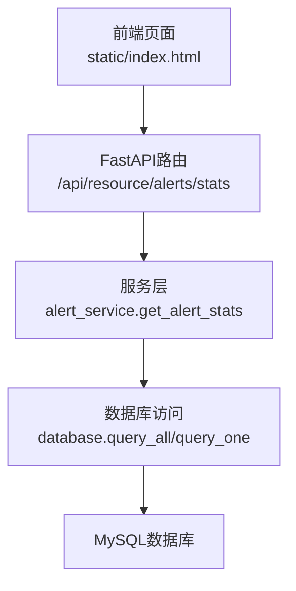
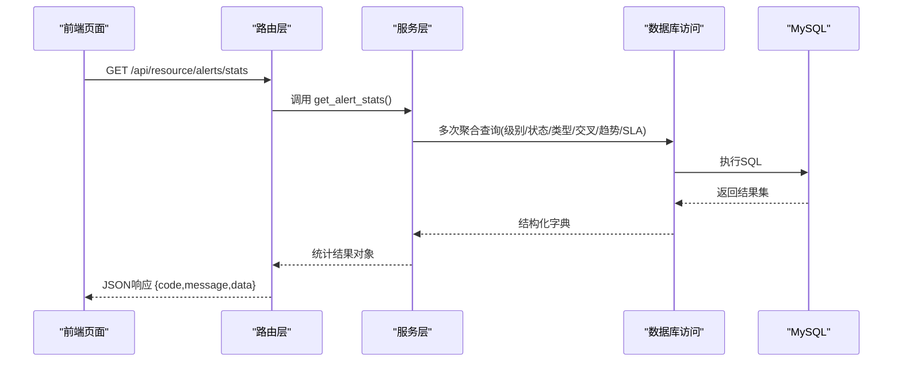
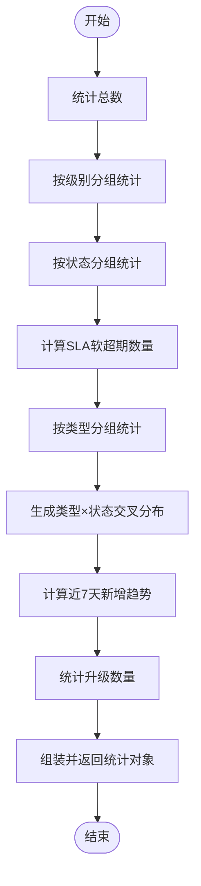

# 统计分析报表

<cite>
**本文引用的文件**
- [alert_service.py](file://backend/modules/resource/services/alert_service.py)
- [router.py](file://backend/modules/resource/router.py)
- [database.py](file://backend/database.py)
- [index.html](file://static/index.html)
</cite>

## 目录
1. [简介](#简介)
2. [项目结构](#项目结构)
3. [核心组件](#核心组件)
4. [架构总览](#架构总览)
5. [详细组件分析](#详细组件分析)
6. [依赖关系分析](#依赖关系分析)
7. [性能考虑](#性能考虑)
8. [故障排查指南](#故障排查指南)
9. [结论](#结论)
10. [附录](#附录)

## 简介
本文件面向“预警统计分析报表”能力，系统说明以下要点：
- 核心KPI指标及其业务意义与计算方法（total、critical、high_or_critical、unresolved等）
- 多维分布分析（级别分布、状态分布、类型分布）的数据结构与可视化展示
- 交叉分析（按类型×状态的分布）用于识别处理瓶颈
- 趋势分析（近7天新增趋势）支持时间序列观察与预测
- SLA相关统计（超期、升级）的监控与分析
- 统计数据获取接口（get_alert_stats）的返回值结构、数据格式与性能优化建议
- 报表定制与导出（前端图表渲染、筛选与导出思路）
- 实际业务分析案例与决策支持示例

## 项目结构
预警统计功能由后端服务层与路由层提供数据，前端页面负责渲染图表与交互。关键路径如下：
- 后端服务：统计计算集中在 alert_service.get_alert_stats
- 后端路由：暴露 /api/resource/alerts/stats 供前端调用
- 数据库访问：通过 database.query_all/query_one 执行聚合SQL
- 前端展示：static/index.html 中加载统计并渲染ECharts图表

**图示来源**
- [router.py:981-988](file://backend/modules/resource/router.py#L981-L988)
- [alert_service.py:337-398](file://backend/modules/resource/services/alert_service.py#L337-L398)
- [database.py:51-70](file://backend/database.py#L51-L70)

**章节来源**
- [router.py:981-988](file://backend/modules/resource/router.py#L981-L988)
- [alert_service.py:337-398](file://backend/modules/resource/services/alert_service.py#L337-L398)
- [database.py:51-70](file://backend/database.py#L51-L70)
- [index.html:9530-9588](file://static/index.html#L9530-L9588)

## 核心组件
- 统计服务函数 get_alert_stats：集中计算KPI与多维分布、交叉分布、周趋势、SLA指标
- 路由端点 /api/resource/alerts/stats：对外暴露统计查询接口
- 数据库工具：连接池与查询封装，保障并发与稳定性
- 前端渲染：基于ECharts的级别饼图、类型柱状图、趋势折线图及KPI卡片

**章节来源**
- [alert_service.py:337-398](file://backend/modules/resource/services/alert_service.py#L337-L398)
- [router.py:981-988](file://backend/modules/resource/router.py#L981-L988)
- [database.py:12-43](file://backend/database.py#L12-L43)
- [index.html:9530-9588](file://static/index.html#L9530-L9588)

## 架构总览
预警统计从请求到返回的整体流程如下：

**图示来源**
- [router.py:981-988](file://backend/modules/resource/router.py#L981-L988)
- [alert_service.py:337-398](file://backend/modules/resource/services/alert_service.py#L337-L398)
- [database.py:51-70](file://backend/database.py#L51-L70)

## 详细组件分析

### 核心KPI指标与业务意义
- total：所有预警总数，反映整体规模
- critical：紧急级别数量，代表高风险问题
- high_or_critical：高等级及以上数量（critical + high），用于快速定位高优问题
- unresolved：未解决数量（pending + processing），体现积压压力
- pending/processing/resolved/closed：各状态计数，支撑流转效率分析
- overdue：SLA软超期数量（raised_at + sla_hours < NOW() 且状态为pending/processing），衡量时效风险
- escalated：已升级上报数量，体现问题升级强度

这些指标共同构成预警健康度与处理效率的核心视图。

**章节来源**
- [alert_service.py:337-398](file://backend/modules/resource/services/alert_service.py#L337-L398)

### 多维分布分析
- level_distribution：按级别分组统计，便于绘制级别饼图或堆叠柱状图
- status_distribution：按状态分组统计，用于看板与进度跟踪
- type_distribution：按预警类型分组统计，用于识别高频问题域

数据结构均为键值对映射（维度→数量），可直接用于前端图表配置。

**章节来源**
- [alert_service.py:341-363](file://backend/modules/resource/services/alert_service.py#L341-L363)
- [index.html:9576-9588](file://static/index.html#L9576-L9588)

### 交叉分析（cross_distribution）
- 目的：每种预警类型在不同处理状态下的数量分布，帮助识别瓶颈环节（如某类问题在processing堆积）
- 数据结构：数组项包含 alert_type、status、count
- 使用方式：前端以分组柱状图展示，横轴为类型，系列为状态，直观对比各类问题的处理阶段分布

**章节来源**
- [alert_service.py:365-370](file://backend/modules/resource/services/alert_service.py#L365-L370)

### 趋势分析（weekly_trend）
- 目的：近7天新增预警数量时间序列，用于观察波动、发现异常峰值与周期性规律
- 数据结构：数组项包含 date、count，按日期升序排列
- 应用：可结合移动平均、同比环比进行简单预测与预警

**章节来源**
- [alert_service.py:372-377](file://backend/modules/resource/services/alert_service.py#L372-L377)
- [index.html:9557-9574](file://static/index.html#L9557-L9574)

### SLA相关统计
- overdue：基于SLA小时数计算的软超期数量，仅针对待处理/处理中状态
- escalated：已升级数量，用于评估问题升级频率与范围
- 业务意义：SLA超期与升级是服务质量的关键信号，需纳入日常监控与复盘

**章节来源**
- [alert_service.py:353-359](file://backend/modules/resource/services/alert_service.py#L353-L359)
- [alert_service.py:379-380](file://backend/modules/resource/services/alert_service.py#L379-L380)

### 统计数据获取接口
- 接口路径：GET /api/resource/alerts/stats
- 返回结构：{ code, message, data }，data为统计对象，包含上述KPI、分布、交叉、趋势字段
- 数据格式：数值型整数、字符串日期、字典映射；列表项为结构化对象
- 错误处理：路由层统一捕获异常并返回HTTP 500

**章节来源**
- [router.py:981-988](file://backend/modules/resource/router.py#L981-L988)
- [alert_service.py:337-398](file://backend/modules/resource/services/alert_service.py#L337-L398)

### 前端可视化与交互
- KPI卡片：展示total、critical、high_or_critical、unresolved、overdue、escalated等
- 图表：
  - 级别分布：饼图或环形图
  - 类型分布：柱状图，可叠加解决率
  - 趋势：折线图，显示近7天新增
- 交互：筛选条件（类型、级别、状态、来源、场地）、分页、刷新与resize适配

**章节来源**
- [index.html:9530-9588](file://static/index.html#L9530-L9588)
- [index.html:9633-9661](file://static/index.html#L9633-L9661)

## 依赖关系分析
- 路由层依赖服务层：路由仅做参数透传与异常包装
- 服务层依赖数据库访问：通过query_all/query_one执行聚合SQL
- 前端依赖后端接口：通过/api/resource/alerts/stats拉取数据并渲染

**图示来源**
- [router.py:981-988](file://backend/modules/resource/router.py#L981-L988)
- [alert_service.py:337-398](file://backend/modules/resource/services/alert_service.py#L337-L398)
- [database.py:51-70](file://backend/database.py#L51-L70)
- [index.html:9530-9588](file://static/index.html#L9530-L9588)

**章节来源**
- [router.py:981-988](file://backend/modules/resource/router.py#L981-L988)
- [alert_service.py:337-398](file://backend/modules/resource/services/alert_service.py#L337-L398)
- [database.py:51-70](file://backend/database.py#L51-L70)
- [index.html:9530-9588](file://static/index.html#L9530-L9588)

## 性能考虑
- 连接池：使用PooledDB管理数据库连接，避免频繁创建销毁连接
- 查询优化：统计采用GROUP BY与COUNT聚合，减少应用层计算开销
- 并发安全：写操作使用事务提交与回滚保护，读操作无锁共享
- 前端优化：图表初始化后多次延迟resize确保正确渲染；按需加载与Mock兜底提升体验

**章节来源**
- [database.py:12-43](file://backend/database.py#L12-L43)
- [alert_service.py:337-398](file://backend/modules/resource/services/alert_service.py#L337-L398)
- [index.html:9576-9588](file://static/index.html#L9576-L9588)

## 故障排查指南
- 数据库连接失败：检查.env中的DB_HOST/DB_PORT/DB_USER/DB_PASSWORD/DB_DATABASE配置
- 统计为空：确认alerts表存在数据；检查SQL聚合条件是否正确
- 前端图表不显示：确认接口返回data结构完整；检查ECharts实例是否成功初始化与resize

**章节来源**
- [database.py:12-43](file://backend/database.py#L12-L43)
- [alert_service.py:337-398](file://backend/modules/resource/services/alert_service.py#L337-L398)
- [index.html:9576-9588](file://static/index.html#L9576-L9588)

## 结论
该统计分析报表围绕预警全生命周期构建，覆盖KPI、多维分布、交叉分析与趋势监控，并结合SLA指标形成闭环管理。通过后端高效聚合与前端可视化，能够快速识别问题热点与处理瓶颈，支撑运营决策与持续改进。

## 附录

### 接口定义与返回结构
- 接口：GET /api/resource/alerts/stats
- 返回：
  - code：数字状态码
  - message：提示信息
  - data：统计对象，包含
    - total、critical、high_or_critical、unresolved、pending、processing、resolved、closed、overdue、escalated
    - level_distribution、status_distribution、type_distribution
    - cross_distribution：[{alert_type, status, count}]
    - weekly_trend：[{date, count}]

**章节来源**
- [router.py:981-988](file://backend/modules/resource/router.py#L981-L988)
- [alert_service.py:337-398](file://backend/modules/resource/services/alert_service.py#L337-L398)

### 数据处理流程图（统计计算）

**图示来源**
- [alert_service.py:337-398](file://backend/modules/resource/services/alert_service.py#L337-L398)

### 业务分析案例与决策支持示例
- 案例一：某类预警在“处理中”长期堆积
  - 现象：cross_distribution显示该类预警在processing占比显著高于其他状态
  - 决策：增加资源投入或优化处置流程，缩短处理时长
- 案例二：SLA超期比例上升
  - 现象：overdue指标连续多日升高
  - 决策：调整SLA阈值或加强预警提醒机制，推动及时处置
- 案例三：趋势出现异常峰值
  - 现象：weekly_trend出现突增
  - 决策：回溯根因（设备故障、质量缺陷等），启动专项整改

[本节为概念性内容，不直接分析具体文件]