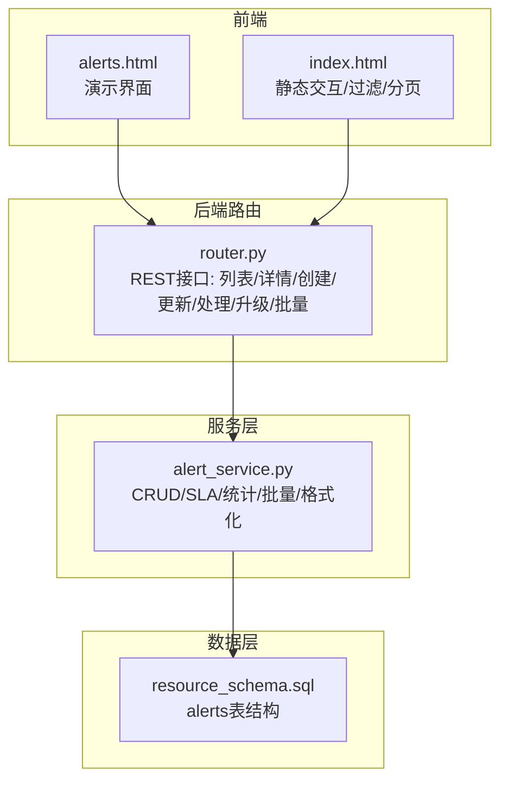
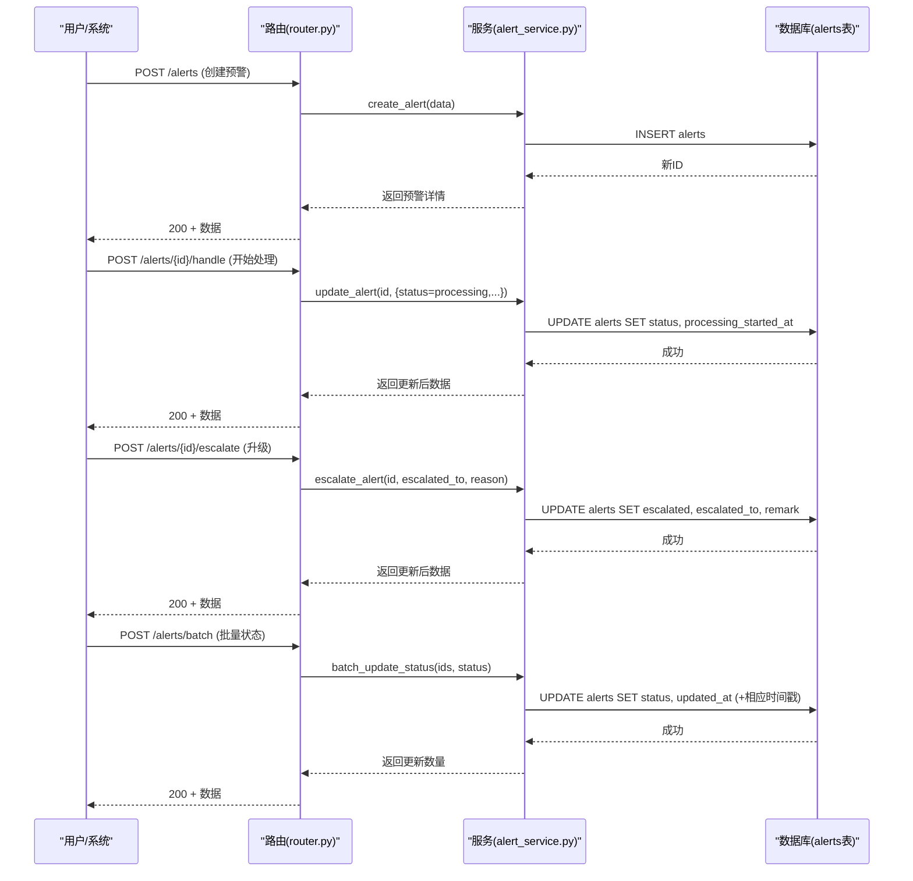
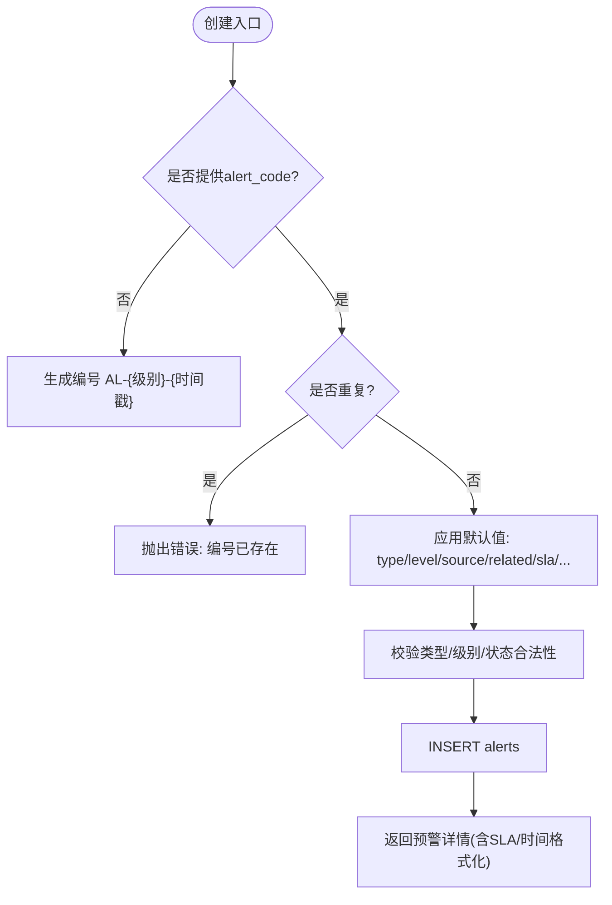
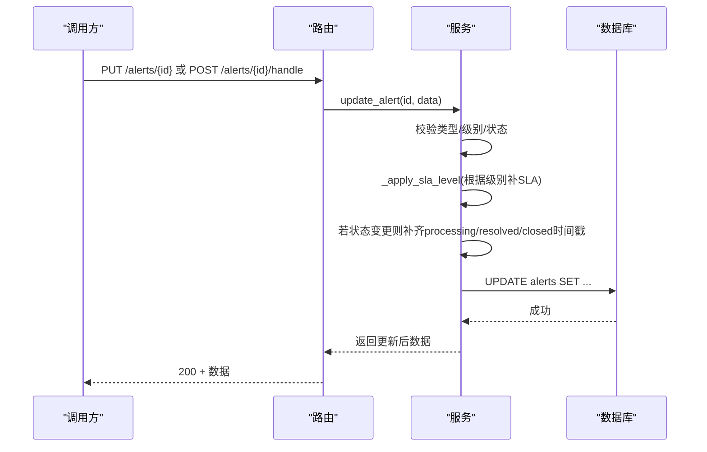
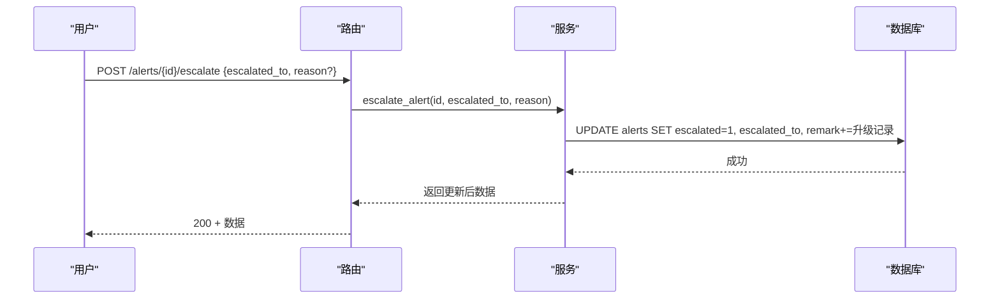
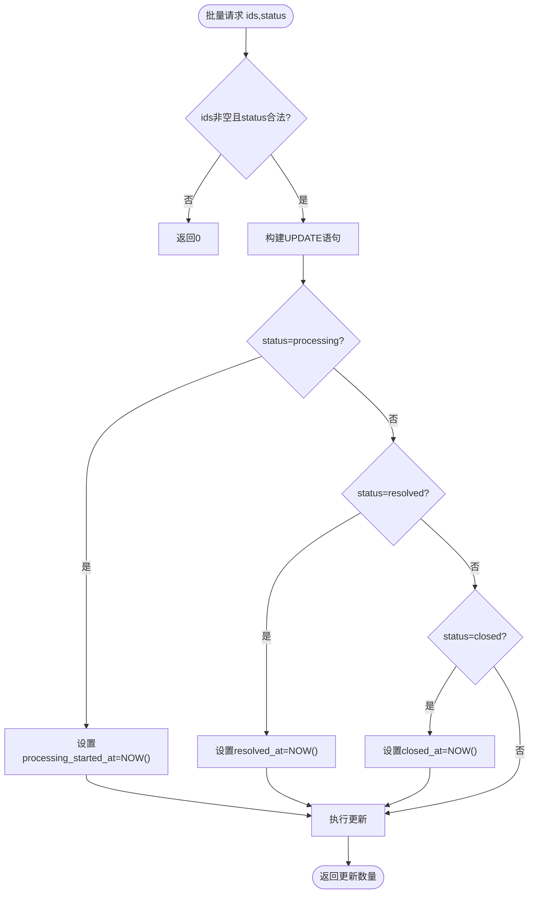
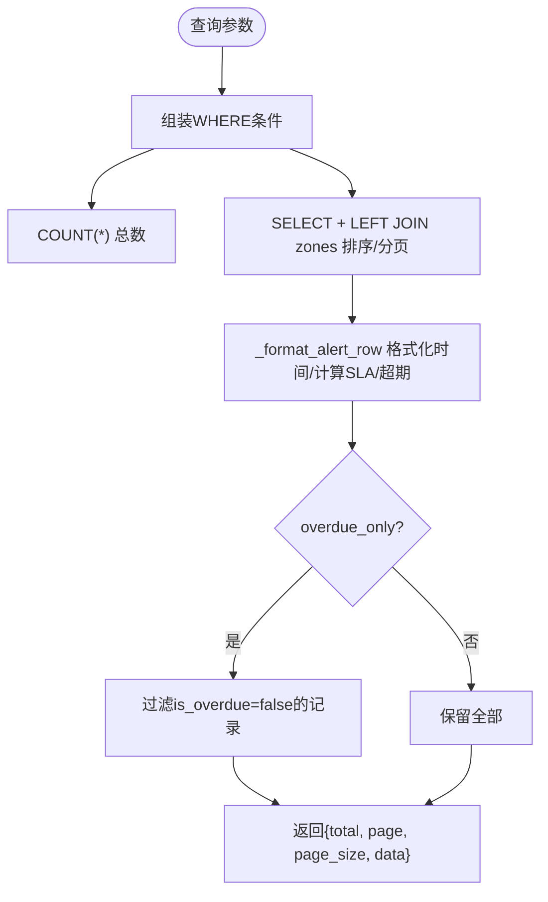
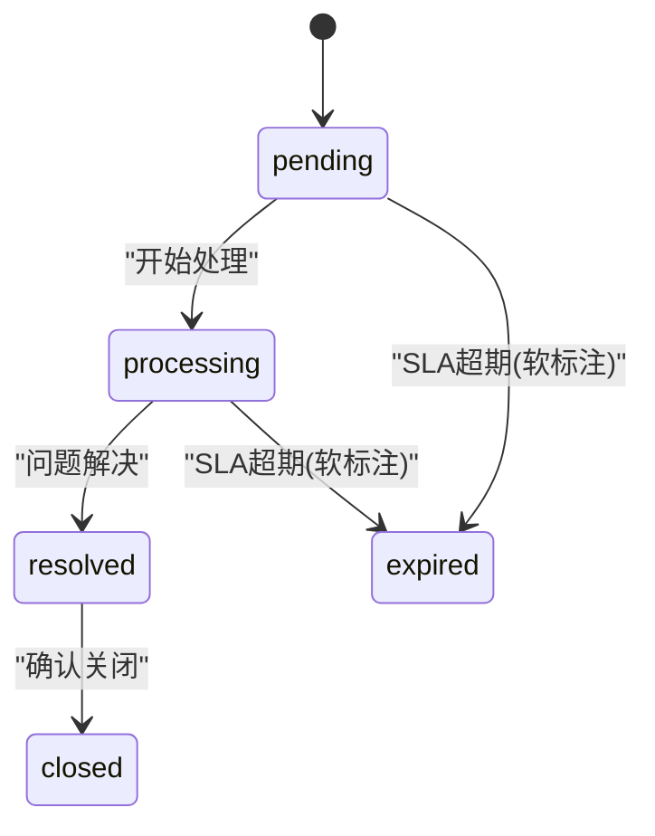
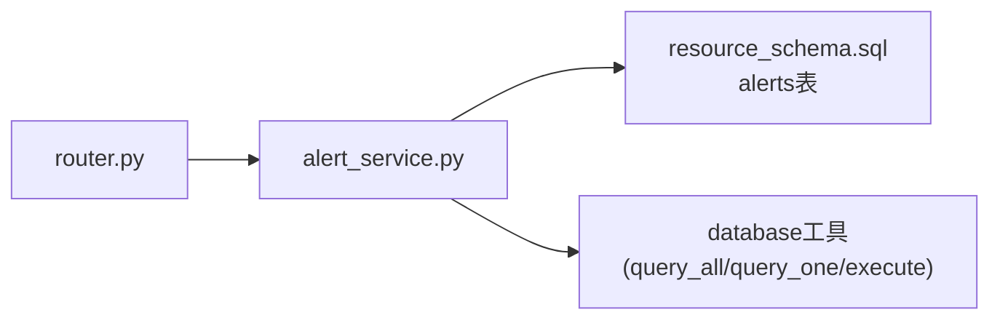

# 预警处理流程

<cite>
**本文引用的文件**
- [alert_service.py](file://backend/modules/resource/services/alert_service.py)
- [router.py](file://backend/modules/resource/router.py)
- [schemas.py](file://backend/modules/resource/schemas.py)
- [resource_schema.sql](file://backend/sql/resource_schema.sql)
- [alerts.html](file://demo/alerts.html)
- [index.html](file://static/index.html)
</cite>

## 目录
1. [简介](#简介)
2. [项目结构](#项目结构)
3. [核心组件](#核心组件)
4. [架构总览](#架构总览)
5. [详细组件分析](#详细组件分析)
6. [依赖关系分析](#依赖关系分析)
7. [性能考虑](#性能考虑)
8. [故障排查指南](#故障排查指南)
9. [结论](#结论)
10. [附录：API与操作示例](#附录api与操作示例)

## 简介
本指南面向预警（异常）全生命周期管理，覆盖从创建、分派、处理、升级到关闭的完整流程。重点说明：
- 手动创建与自动创建的初始化逻辑（必填字段校验、编号自动生成、默认值填充）
- 状态流转机制（pending → processing → resolved → closed），以及时间戳自动记录与SLA超期软计算
- 分派与升级（handler分配、escalated标志、escalated_to目标部门）
- 批量操作（批量状态更新、多预警统一处理）
- 查询与筛选（类型、级别、状态、来源、区域、关键词、时间范围）
- 处理跟踪与审计（处理记录、备注追加、修改历史）
- API使用示例与常见操作流程演示

## 项目结构
预警能力集中在后端资源模块中，路由层暴露REST接口，服务层实现业务规则与数据访问，数据库表定义在SQL脚本中，前端提供演示页面与静态交互。

图表来源
- [router.py:949-1075](file://backend/modules/resource/router.py#L949-L1075)
- [alert_service.py:47-399](file://backend/modules/resource/services/alert_service.py#L47-L399)
- [resource_schema.sql:114-163](file://backend/sql/resource_schema.sql#L114-L163)

章节来源
- [router.py:857-1075](file://backend/modules/resource/router.py#L857-L1075)
- [alert_service.py:1-399](file://backend/modules/resource/services/alert_service.py#L1-L399)
- [resource_schema.sql:114-163](file://backend/sql/resource_schema.sql#L114-L163)

## 核心组件
- 路由层（router.py）
  - 定义请求模型：AlertCreateRequest、AlertUpdateRequest、AlertHandleRequest、AlertEscalateRequest、AlertBatchRequest
  - 暴露接口：GET /alerts、GET /alerts/{id}、POST /alerts、PUT /alerts/{id}、POST /alerts/{id}/handle、POST /alerts/{id}/escalate、POST /alerts/batch、GET /alerts/stats
- 服务层（alert_service.py）
  - 常量与枚举：ALERT_TYPES、ALERT_LEVELS、ALERT_SOURCES、ALERT_STATUSES、DEFAULT_SLA
  - 核心方法：get_alert_list、get_alert_by_id、create_alert、update_alert、escalate_alert、batch_update_status、get_alert_stats
  - 辅助：_apply_sla_level、_format_alert_row（计算剩余SLA、是否超期、时间格式化）
- 数据模型（schemas.py）
  - AlertResponse、AlertListResponse 用于响应结构定义
- 数据库（resource_schema.sql）
  - alerts表：包含编号、类型、级别、标题、描述、来源、关联对象、区域、场地、上报人/时间、SLA、升级标记与目标、状态、处理人/部门、各阶段时间戳、处置方案/措施/验证、损失金额/影响工时、附件数、备注等

章节来源
- [router.py:857-946](file://backend/modules/resource/router.py#L857-L946)
- [alert_service.py:12-399](file://backend/modules/resource/services/alert_service.py#L12-L399)
- [schemas.py:182-201](file://backend/modules/resource/schemas.py#L182-L201)
- [resource_schema.sql:114-163](file://backend/sql/resource_schema.sql#L114-L163)

## 架构总览
预警处理采用“路由-服务-数据”三层架构。路由负责参数校验与协议封装；服务层实现业务规则（SLA默认、状态时间戳、升级逻辑、批量更新、统计）；数据层通过SQL持久化。

图表来源
- [router.py:1006-1075](file://backend/modules/resource/router.py#L1006-L1075)
- [alert_service.py:188-334](file://backend/modules/resource/services/alert_service.py#L188-L334)
- [resource_schema.sql:114-163](file://backend/sql/resource_schema.sql#L114-L163)

## 详细组件分析

### 预警创建（手动/自动）
- 必填字段校验
  - 标题title为必填；若未提供alert_code则自动生成；类型、级别、状态需属于允许集合
- 编号自动生成
  - 未提供时按“AL-{级别大写}-{时间戳}”生成；重复检测并报错
- 默认值填充
  - alert_type默认other；level默认medium；source默认manual_report；related_type默认none；sla_hours按级别默认（critical=4, high=8, medium=24, low=72）；impact_hours默认0；attachment_count默认0；status默认pending
- 插入与返回
  - 写入alerts表后返回完整预警详情（含格式化后的时间与SLA信息）

图表来源
- [alert_service.py:188-254](file://backend/modules/resource/services/alert_service.py#L188-L254)
- [resource_schema.sql:114-163](file://backend/sql/resource_schema.sql#L114-L163)

章节来源
- [alert_service.py:188-254](file://backend/modules/resource/services/alert_service.py#L188-L254)
- [router.py:1006-1016](file://backend/modules/resource/router.py#L1006-L1016)

### 预警更新与处理（介入/处置/验证）
- 通用更新
  - 支持更新类型、级别、标题、描述、来源、关联对象、区域、场地、上报人/时间、SLA、升级标记与目标、状态、处理人/部门、各阶段时间戳、处置方案/措施/验证、损失金额/影响工时、附件数、备注
  - 当状态变更为processing/resolved/closed且对应时间戳为空时，自动补齐当前时间
- 处理专用接口
  - 默认将状态置为processing，并可同时填写处理人、责任部门、处置方案、整改措施、预防措施、效果验证等

图表来源
- [alert_service.py:257-302](file://backend/modules/resource/services/alert_service.py#L257-L302)
- [router.py:1019-1051](file://backend/modules/resource/router.py#L1019-L1051)

章节来源
- [alert_service.py:257-302](file://backend/modules/resource/services/alert_service.py#L257-L302)
- [router.py:1019-1051](file://backend/modules/resource/router.py#L1019-L1051)

### 预警分派与升级
- 分派
  - handler与handler_department可在创建或更新时设置，便于明确责任主体
- 升级
  - 设置escalated=1与escalated_to目标部门（如海西分部/质量部/总装中心等）
  - 可选reason会追加到remark中，形成可追溯的升级记录

图表来源
- [alert_service.py:305-314](file://backend/modules/resource/services/alert_service.py#L305-L314)
- [router.py:1054-1064](file://backend/modules/resource/router.py#L1054-L1064)

章节来源
- [alert_service.py:305-314](file://backend/modules/resource/services/alert_service.py#L305-L314)
- [router.py:1054-1064](file://backend/modules/resource/router.py#L1054-L1064)

### 批量操作（批量状态更新）
- 支持对多个预警ID统一设置状态（pending/processing/resolved/closed）
- 自动补齐相应时间戳（processing/resolved/closed）
- 返回实际更新的条数

图表来源
- [alert_service.py:317-334](file://backend/modules/resource/services/alert_service.py#L317-L334)
- [router.py:1067-1075](file://backend/modules/resource/router.py#L1067-L1075)

章节来源
- [alert_service.py:317-334](file://backend/modules/resource/services/alert_service.py#L317-L334)
- [router.py:1067-1075](file://backend/modules/resource/router.py#L1067-L1075)

### 查询与筛选
- 支持多维度组合筛选：类型、级别、状态、来源、区域、装配场地、处理人、发生时间范围
- 关键词搜索：在编号、标题、描述、关联ID/名称、处理人中模糊匹配
- 特殊筛选：仅看升级上报、仅看已超SLA（软超期）
- 返回列表附带SLA剩余小时与是否超期标识，便于前端展示

图表来源
- [alert_service.py:47-172](file://backend/modules/resource/services/alert_service.py#L47-L172)
- [router.py:949-978](file://backend/modules/resource/router.py#L949-L978)

章节来源
- [alert_service.py:47-172](file://backend/modules/resource/services/alert_service.py#L47-L172)
- [router.py:949-978](file://backend/modules/resource/router.py#L949-L978)

### 状态流转与时间戳自动记录
- 状态机：pending → processing → resolved → closed；expired为软超期展示态
- 自动时间戳：
  - 进入processing：processing_started_at自动记录
  - 进入resolved：resolved_at自动记录
  - 进入closed：closed_at自动记录
- SLA软超期：raised_at + sla_hours < now 且状态为pending/processing时，视为超期（不直接写库，仅计算展示）

图表来源
- [alert_service.py:257-334](file://backend/modules/resource/services/alert_service.py#L257-L334)
- [resource_schema.sql:114-163](file://backend/sql/resource_schema.sql#L114-L163)

章节来源
- [alert_service.py:257-334](file://backend/modules/resource/services/alert_service.py#L257-L334)
- [resource_schema.sql:114-163](file://backend/sql/resource_schema.sql#L114-L163)

### 处理跟踪与审计
- 升级记录：escalate时可将原因追加至remark，形成时间戳化的升级日志
- 修改历史：每次更新都会刷新updated_at；可通过列表/详情查看最新状态与时间戳
- 统计与趋势：提供KPI、分布、近7天新增趋势、升级数量等，便于复盘与审计

章节来源
- [alert_service.py:305-314](file://backend/modules/resource/services/alert_service.py#L305-L314)
- [alert_service.py:337-399](file://backend/modules/resource/services/alert_service.py#L337-L399)

## 依赖关系分析
- 路由依赖服务层提供的CRUD与批量方法
- 服务层依赖数据库工具函数进行查询与执行
- 数据表结构与索引支撑高效筛选与排序（类型、级别、状态、时间、区域、处理人等）

图表来源
- [router.py:949-1075](file://backend/modules/resource/router.py#L949-L1075)
- [alert_service.py:1-399](file://backend/modules/resource/services/alert_service.py#L1-L399)
- [resource_schema.sql:114-163](file://backend/sql/resource_schema.sql#L114-L163)

章节来源
- [router.py:949-1075](file://backend/modules/resource/router.py#L949-L1075)
- [alert_service.py:1-399](file://backend/modules/resource/services/alert_service.py#L1-L399)
- [resource_schema.sql:114-163](file://backend/sql/resource_schema.sql#L114-L163)

## 性能考虑
- 列表查询使用索引字段（类型、级别、状态、raised_at、zone_code、handler等）提升筛选效率
- 分页限制page_size上限，避免大结果集
- 软超期计算在服务层完成，减少数据库压力
- 批量更新使用IN语句一次性更新多条记录，减少往返

[本节为通用指导，无需特定文件引用]

## 故障排查指南
- 创建失败
  - 检查必填字段（title）与枚举值（类型、级别、状态）
  - 编号重复：确保alert_code唯一
- 更新失败
  - 检查预警ID是否存在
  - 状态变更时注意时间戳自动补齐逻辑
- 批量更新失败
  - 检查ids是否为空、status是否合法
  - 关注异常日志输出
- 查询无结果
  - 核对筛选条件（类型、级别、状态、来源、区域、时间范围）
  - 关键词搜索注意字段范围

章节来源
- [alert_service.py:188-254](file://backend/modules/resource/services/alert_service.py#L188-L254)
- [alert_service.py:257-334](file://backend/modules/resource/services/alert_service.py#L257-L334)

## 结论
本系统提供了完整的预警处理能力：从创建、分派、处理、升级到关闭的全链路闭环；具备SLA管理与软超期计算、批量操作、多维查询与统计；通过备注追加与时间戳记录保障处理可追溯性。建议在实际使用中结合前端界面与API进行标准化作业，确保预警及时响应与闭环。

[本节为总结，无需特定文件引用]

## 附录：API与操作示例
以下为常用API路径与用途说明（具体参数以路由定义为准）：
- 获取预警列表：GET /alerts
  - 支持分页、类型、级别、状态、来源、区域、场地、处理人、时间范围、关键词、仅升级、仅超期等筛选
- 获取预警详情：GET /alerts/{alert_id}
- 创建预警：POST /alerts
  - 支持手动上报；未提供编号时自动生成；自动填充默认SLA与状态
- 更新预警：PUT /alerts/{alert_id}
  - 通用字段更新；状态变更自动补齐时间戳
- 开始处理：POST /alerts/{alert_id}/handle
  - 默认置为processing，并可填写处理人、部门、处置方案等
- 升级预警：POST /alerts/{alert_id}/escalate
  - 设置escalated_to与可选reason，自动追加remark
- 批量状态更新：POST /alerts/batch
  - 传入ids与status，自动补齐相应时间戳
- 预警统计：GET /alerts/stats
  - 返回KPI、分布、趋势、升级数量等

前端演示
- demo/alerts.html：提供预警中心演示界面（样式、弹窗、列表渲染等）
- static/index.html：包含静态交互逻辑（筛选、分页、批量选择、调用后端接口）

章节来源
- [router.py:949-1075](file://backend/modules/resource/router.py#L949-L1075)
- [alerts.html:1-200](file://demo/alerts.html#L1-L200)
- [index.html:9445-9496](file://static/index.html#L9445-L9496)
- [index.html:9518-9764](file://static/index.html#L9518-L9764)