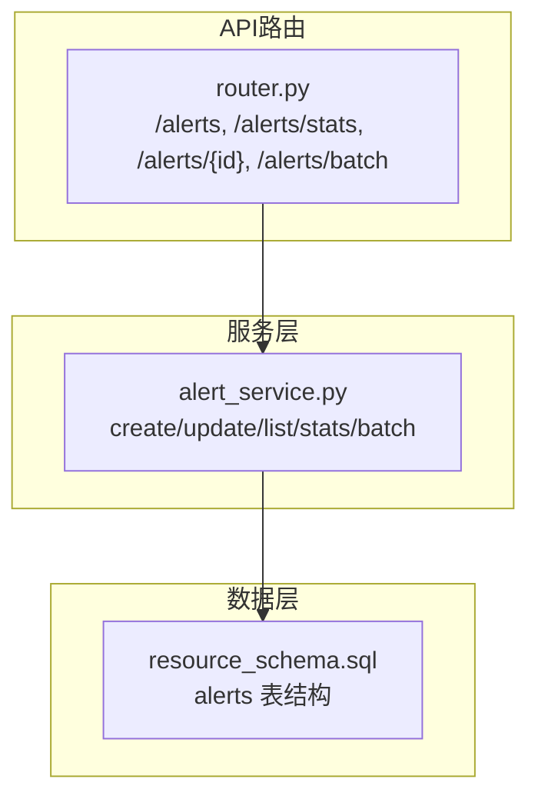
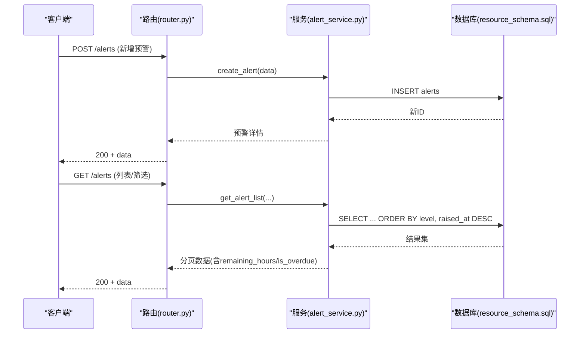
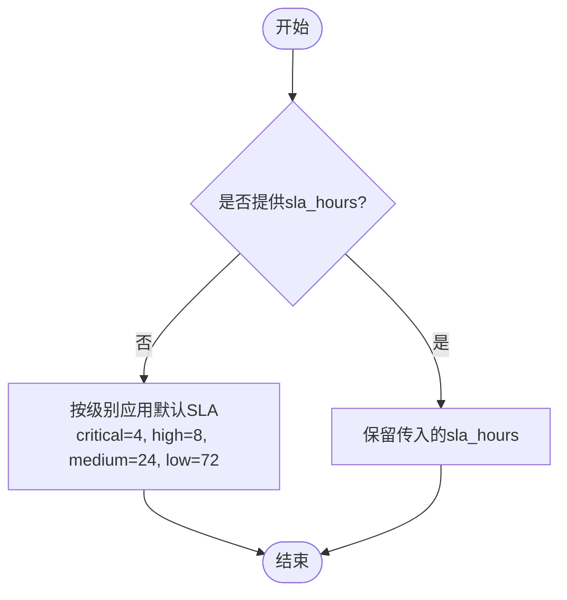
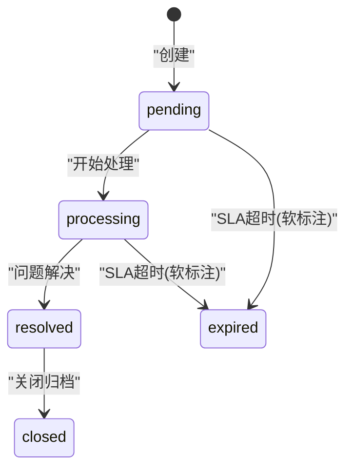
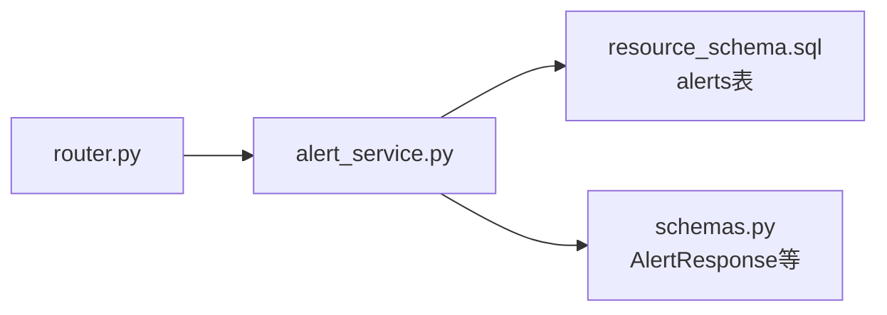

# 预警规则管理

<cite>
**本文引用的文件**
- [alert_service.py](file://backend/modules/resource/services/alert_service.py)
- [router.py](file://backend/modules/resource/router.py)
- [resource_schema.sql](file://backend/sql/resource_schema.sql)
- [schemas.py](file://backend/modules/resource/schemas.py)
</cite>

## 目录
1. [简介](#简介)
2. [项目结构](#项目结构)
3. [核心组件](#核心组件)
4. [架构总览](#架构总览)
5. [详细组件分析](#详细组件分析)
6. [依赖关系分析](#依赖关系分析)
7. [性能考量](#性能考量)
8. [故障排查指南](#故障排查指南)
9. [结论](#结论)
10. [附录](#附录)

## 简介
本文件面向“预警规则管理”功能，系统化说明预警类型、级别、来源、状态流转与SLA机制，并结合后端实现给出配置示例与最佳实践。该能力用于在试制资源数智化管理系统中对异常事件进行统一登记、分级、跟踪、升级与闭环管理。

## 项目结构
预警相关能力主要分布在以下位置：
- 数据模型与枚举定义：服务层常量（类型/级别/来源/状态）、默认SLA映射
- 数据库表结构：alerts 表字段、索引与约束
- API路由：预警的增删改查、处理、升级、批量操作、统计
- 服务层：创建、更新、查询、统计、批量更新等核心逻辑

图表来源
- [router.py:949-1075](file://backend/modules/resource/router.py#L949-L1075)
- [alert_service.py:47-399](file://backend/modules/resource/services/alert_service.py#L47-L399)
- [resource_schema.sql:111-163](file://backend/sql/resource_schema.sql#L111-L163)

章节来源
- [router.py:855-1075](file://backend/modules/resource/router.py#L855-L1075)
- [alert_service.py:12-399](file://backend/modules/resource/services/alert_service.py#L12-L399)
- [resource_schema.sql:111-163](file://backend/sql/resource_schema.sql#L111-L163)

## 核心组件
- 预警类型：task_delay、quality_defect、equipment_fault、material_shortage、personnel_gap、safety_hazard、schedule_overdue、process_violation、external_coordinate、other
- 预警级别：critical、high、medium、low
- 预警来源：system_auto、manual_report、equipment_report、operation_inspection、quality_inspection、other
- 预警状态：pending、processing、resolved、closed、expired（软超期）
- SLA：按级别自动分配响应时长（小时），支持覆盖；列表返回剩余时间与是否超期标记
- 关联对象：任务、设备、人员、物料、项目、车间、无
- 升级上报：记录升级目标与原因，写入备注时间戳

章节来源
- [alert_service.py:12-30](file://backend/modules/resource/services/alert_service.py#L12-L30)
- [resource_schema.sql:114-163](file://backend/sql/resource_schema.sql#L114-L163)

## 架构总览
预警模块采用“路由-服务-数据库”三层结构：
- 路由层暴露REST接口，负责参数校验与调用服务
- 服务层封装业务规则（SLA计算、状态时间戳补齐、过滤与统计）
- 数据层通过SQL表结构与索引支撑高效查询与筛选

图表来源
- [router.py:949-1016](file://backend/modules/resource/router.py#L949-L1016)
- [alert_service.py:47-254](file://backend/modules/resource/services/alert_service.py#L47-L254)
- [resource_schema.sql:111-163](file://backend/sql/resource_schema.sql#L111-L163)

## 详细组件分析

### 预警类型定义与适用场景
- task_delay（任务延迟）：任务未按计划推进或关键路径滞后，影响装配节奏
- quality_defect（质量缺陷）：下线检测不合格、尺寸超差、异响等质量问题
- equipment_fault（设备故障）：设备报警、液压/气压异常、温度过高、停机
- material_shortage（物料短缺）：缺件导致停线风险或产能受限
- personnel_gap（人员缺口）：关键岗位无人值班或人数不足
- safety_hazard（安全隐患）：吊装区域无人指挥、消防通道占用等安全风险
- schedule_overdue（进度超期）：装配启动延期、交付超期
- process_violation（流程违规）：未按SOP作业、工具未校准即使用
- external_coordinate（外部协调）：供应商到货协调失败、分部回复延迟
- other（其他）：临时异常需介入

章节来源
- [alert_service.py:12-16](file://backend/modules/resource/services/alert_service.py#L12-L16)
- [resource_schema.sql:117-121](file://backend/sql/resource_schema.sql#L117-L121)

### 预警级别设置与自动分配逻辑
- 级别枚举：critical、high、medium、low
- 默认SLA（小时）：critical=4、high=8、medium=24、low=72
- 自动填充：若未提供sla_hours或为None/0/空，则根据level自动填充
- 可覆盖：允许在创建/更新时显式指定sla_hours以适配特殊场景

图表来源
- [alert_service.py:25-38](file://backend/modules/resource/services/alert_service.py#L25-L38)

章节来源
- [alert_service.py:25-38](file://backend/modules/resource/services/alert_service.py#L25-L38)

### 预警来源分类与处理方式
- system_auto（系统自动）：由系统规则或定时任务触发
- manual_report（人工上报）：现场人员手动录入
- equipment_report（设备上报）：设备报警或传感器上报
- operation_inspection（巡检上报）：运营巡检发现并上报
- quality_inspection（质检上报）：质检环节发现问题上报
- other（其他）：无法归类的来源

处理方式要点：
- 创建时默认source为manual_report（路由层默认值）
- 列表支持按source筛选
- 不同来源可用于统计分析与看板展示

章节来源
- [alert_service.py:18-21](file://backend/modules/resource/services/alert_service.py#L18-L21)
- [router.py:857-890](file://backend/modules/resource/router.py#L857-L890)
- [router.py:949-978](file://backend/modules/resource/router.py#L949-L978)

### 预警状态流转与生命周期管理
- 状态枚举：pending、processing、resolved、closed、expired
- 初始状态：新建默认pending
- 处理中：进入processing时自动记录processing_started_at
- 已解决：进入resolved时自动记录resolved_at
- 已关闭：进入closed时自动记录closed_at
- 已超期：expired为软标注，基于raised_at+sla_hours与当前时间比较，不直接写库变更用户状态；列表支持overdue_only过滤

图表来源
- [alert_service.py:22-23](file://backend/modules/resource/services/alert_service.py#L22-L23)
- [alert_service.py:271-279](file://backend/modules/resource/services/alert_service.py#L271-L279)
- [alert_service.py:143-172](file://backend/modules/resource/services/alert_service.py#L143-L172)
- [resource_schema.sql:139-139](file://backend/sql/resource_schema.sql#L139-L139)

章节来源
- [alert_service.py:22-23](file://backend/modules/resource/services/alert_service.py#L22-L23)
- [alert_service.py:271-279](file://backend/modules/resource/services/alert_service.py#L271-L279)
- [alert_service.py:143-172](file://backend/modules/resource/services/alert_service.py#L143-L172)
- [resource_schema.sql:139-139](file://backend/sql/resource_schema.sql#L139-L139)

### 规则配置示例与最佳实践
- 创建预警（人工上报）
  - 必填：title、alert_type
  - 可选：level（默认medium）、source（默认manual_report）、sla_hours（按级别自动填充）
  - 关联：related_type、related_id、related_name、related_equipment、related_task、related_personnel
  - 场地与区域：assembly_site、zone_code
  - 责任信息：handler、handler_department、raised_by、raised_at
  - 处置信息：processing_scheme、corrective_action、preventive_measure、result_verification
  - 影响评估：loss_amount、impact_hours、attachment_count
  - 备注：remark

- 处理预警
  - 调用处理接口，默认将状态置为processing，并自动记录processing_started_at
  - 可同步填写处置方案、整改措施、预防措施、效果验证

- 升级上报
  - 记录escalated_to与reason，并在remark追加带时间戳的升级记录

- 批量操作
  - 支持批量修改状态（pending/processing/resolved/closed），进入相应状态时自动更新时间戳

- 列表与筛选
  - 支持按类型、级别、状态、来源、区域、场地、处理人、时间范围、关键词、仅升级、仅超期等条件筛选
  - 返回列表包含remaining_hours与is_overdue，便于前端展示SLA倒计时与超期标识

- 统计指标
  - 总数、严重级别数量、未解决数、超期数、升级数
  - 级别分布、状态分布、类型分布、近7天新增趋势、类型×状态的交叉分布

章节来源
- [router.py:857-946](file://backend/modules/resource/router.py#L857-L946)
- [router.py:949-1075](file://backend/modules/resource/router.py#L949-L1075)
- [alert_service.py:188-334](file://backend/modules/resource/services/alert_service.py#L188-L334)
- [alert_service.py:337-399](file://backend/modules/resource/services/alert_service.py#L337-L399)

## 依赖关系分析
- 路由依赖服务：所有预警API均委托至alert_service中的函数
- 服务依赖数据库：通过query_all/query_one/execute执行SQL，读取/写入alerts表
- 数据模型：schemas.py定义了AlertResponse等响应结构，便于前后端契约一致
- 索引优化：alerts表针对type、level、status、raised_at、related、zone、equipment、handler建立索引，提升筛选与排序效率

图表来源
- [router.py:949-1075](file://backend/modules/resource/router.py#L949-L1075)
- [alert_service.py:47-399](file://backend/modules/resource/services/alert_service.py#L47-L399)
- [schemas.py:180-202](file://backend/modules/resource/schemas.py#L180-L202)
- [resource_schema.sql:111-163](file://backend/sql/resource_schema.sql#L111-L163)

章节来源
- [router.py:949-1075](file://backend/modules/resource/router.py#L949-L1075)
- [alert_service.py:47-399](file://backend/modules/resource/services/alert_service.py#L47-L399)
- [schemas.py:180-202](file://backend/modules/resource/schemas.py#L180-L202)
- [resource_schema.sql:111-163](file://backend/sql/resource_schema.sql#L111-L163)

## 性能考量
- 列表查询使用ORDER BY level优先级与raised_at倒序，结合LIMIT/OFFSET分页
- 多条件WHERE拼接，避免全表扫描；利用alerts表的索引加速筛选
- overdue_only为软过滤，在服务层基于remaining_hours判断，减少数据库压力
- 统计接口使用聚合查询，按级别/状态/类型分组，近7天趋势按日期分组

[本节为通用性能建议，无需特定文件引用]

## 故障排查指南
- 常见错误
  - 无效预警类型/级别/状态：服务层会抛出ValueError，路由层转为400
  - 重复预警编号：创建时检查唯一性，冲突时报错
  - 不存在预警ID：更新/获取时校验，不存在返回404
- 定位方法
  - 查看路由层异常捕获与HTTP状态码
  - 检查服务层输入校验与数据库写入结果
  - 核对alerts表索引与数据一致性

章节来源
- [router.py:1006-1075](file://backend/modules/resource/router.py#L1006-L1075)
- [alert_service.py:188-334](file://backend/modules/resource/services/alert_service.py#L188-L334)

## 结论
预警规则管理通过标准化的类型、级别、来源与状态体系，配合SLA与升级机制，实现了从发现到闭环的全流程管理。服务层提供灵活的创建、更新、查询与统计能力，数据库设计兼顾扩展性与查询性能。建议在实际使用中：
- 明确预警类型与级别，合理设置SLA
- 充分利用来源与关联对象字段，增强可追溯性
- 借助列表筛选与统计接口，持续优化异常治理策略

[本节为总结性内容，无需特定文件引用]

## 附录
- 数据库表字段参考：alerts表包含预警编号、类型、级别、标题、描述、来源、关联对象、区域/场地、上报信息、SLA、升级信息、状态、处理信息、处置方案、影响评估、附件数量、备注等
- 路由接口清单：
  - GET /alerts：列表与筛选
  - GET /alerts/stats：统计KPI
  - GET /alerts/{id}：详情
  - POST /alerts：新增
  - PUT /alerts/{id}：更新
  - POST /alerts/{id}/handle：处理
  - POST /alerts/{id}/escalate：升级
  - POST /alerts/batch：批量状态更新

章节来源
- [resource_schema.sql:111-163](file://backend/sql/resource_schema.sql#L111-L163)
- [router.py:949-1075](file://backend/modules/resource/router.py#L949-L1075)