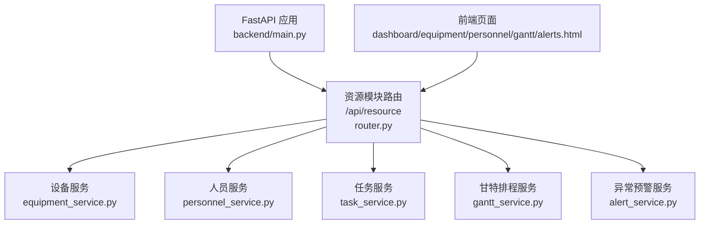
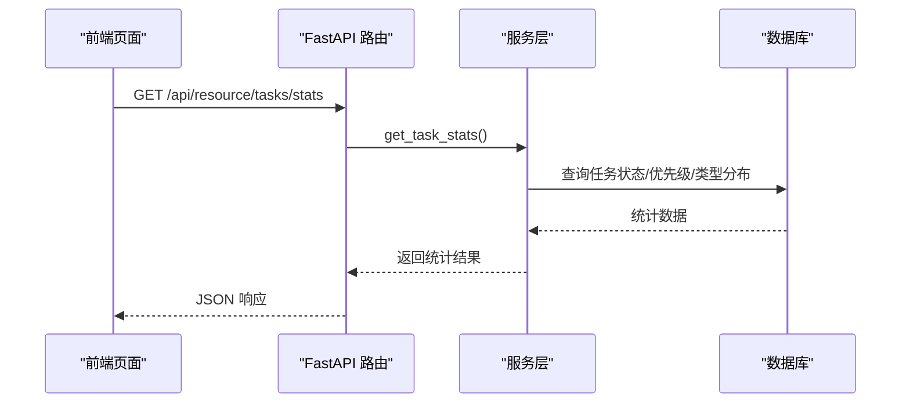
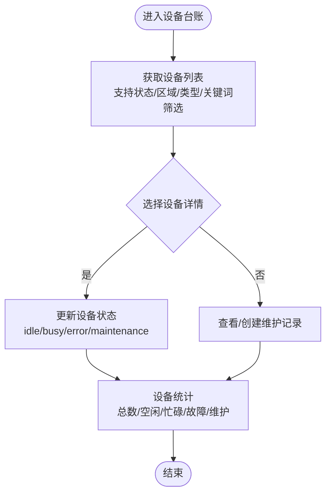
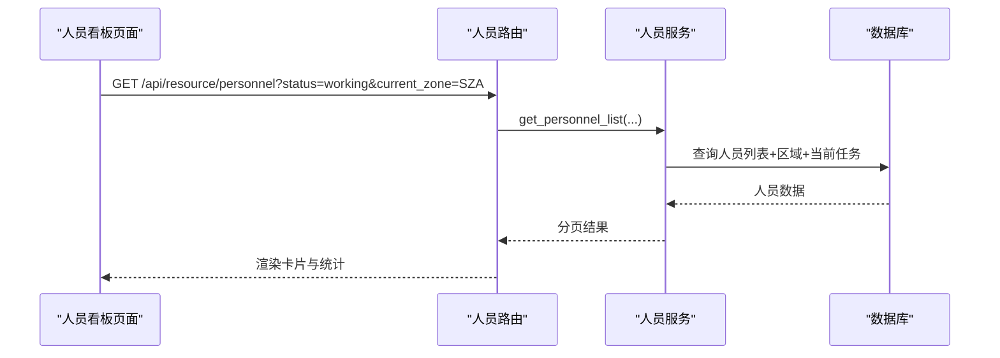
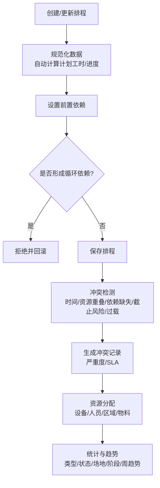
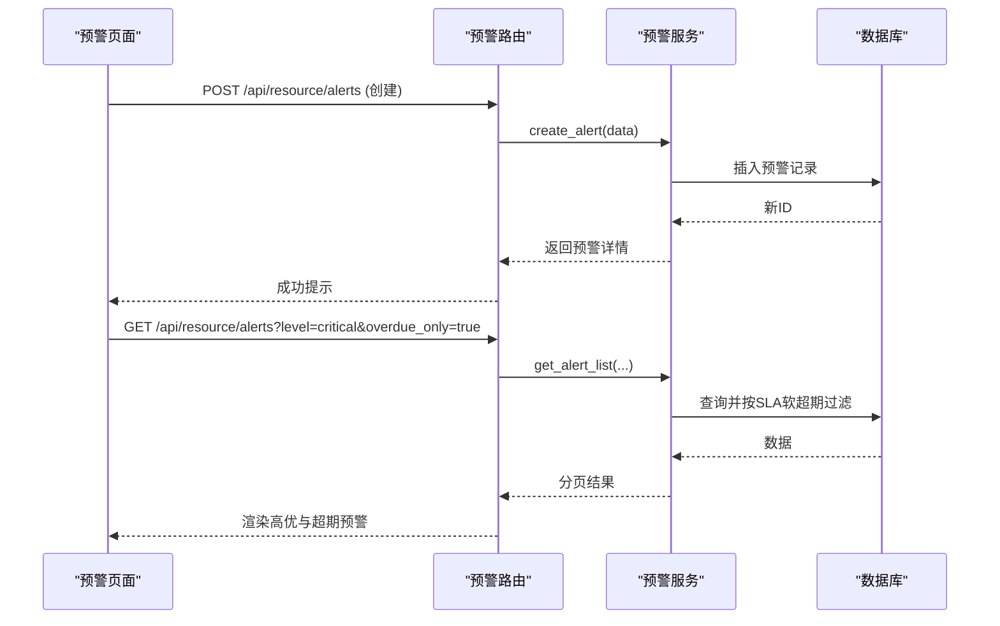
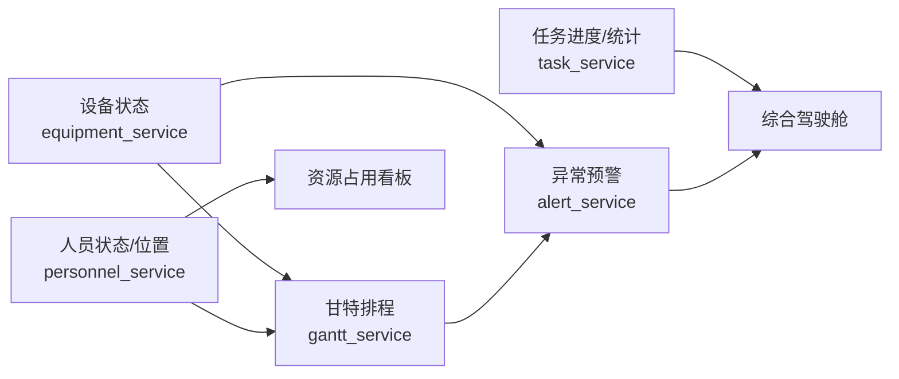

# 核心功能模块

<cite>
**本文引用的文件**
- [backend/main.py](file://backend/main.py)
- [backend/modules/resource/router.py](file://backend/modules/resource/router.py)
- [backend/modules/resource/schemas.py](file://backend/modules/resource/schemas.py)
- [backend/modules/resource/services/equipment_service.py](file://backend/modules/resource/services/equipment_service.py)
- [backend/modules/resource/services/personnel_service.py](file://backend/modules/resource/services/personnel_service.py)
- [backend/modules/resource/services/task_service.py](file://backend/modules/resource/services/task_service.py)
- [backend/modules/resource/services/gantt_service.py](file://backend/modules/resource/services/gantt_service.py)
- [backend/modules/resource/services/alert_service.py](file://backend/modules/resource/services/alert_service.py)
- [demo/dashboard.html](file://demo/dashboard.html)
- [demo/equipment.html](file://demo/equipment.html)
- [demo/personnel.html](file://demo/personnel.html)
- [demo/gantt.html](file://demo/gantt.html)
- [demo/alerts.html](file://demo/alerts.html)
</cite>

## 目录
1. [引言](#引言)
2. [项目结构](#项目结构)
3. [核心组件](#核心组件)
4. [架构总览](#架构总览)
5. [详细组件分析](#详细组件分析)
6. [依赖关系分析](#依赖关系分析)
7. [性能考虑](#性能考虑)
8. [故障排查指南](#故障排查指南)
9. [结论](#结论)
10. [附录：典型使用场景与操作流程](#附录：典型使用场景与操作流程)

## 引言
本章节面向“试制资源数智化管理系统”的9大核心模块，系统性阐述其功能定位、业务价值、关键特性（实时监控、智能预警、可视化展示、数据分析）、设计原则（模块化、可配置、可扩展），以及模块间的数据流转与协作关系。文档同时提供架构图、流程图和时序图，帮助读者快速理解整体运作机制。

## 项目结构
后端采用 FastAPI 模块化路由与服务层分离的设计：
- 入口与路由注册：主应用统一挂载各模块路由，资源模块以 /api/resource 前缀暴露接口。
- 服务层：按设备、人员、任务、甘特排程、异常预警等维度拆分服务，封装数据库访问与业务规则。
- 前端演示页面：位于 demo 目录，对应驾驶舱、设备台账、人员看板、甘特图、异常预警等界面。

图表来源
- [backend/main.py:74-83](file://backend/main.py#L74-L83)
- [backend/modules/resource/router.py:1-14](file://backend/modules/resource/router.py#L1-L14)

章节来源
- [backend/main.py:74-83](file://backend/main.py#L74-L83)
- [backend/modules/resource/router.py:1-14](file://backend/modules/resource/router.py#L1-L14)

## 核心组件
围绕9大核心模块，后端通过统一的资源模块路由提供服务能力：
- 综合驾驶舱：聚合设备、人员、任务、预警等KPI与分布数据，支撑全局监控。
- 设备台账管理：设备CRUD、状态维护、维护记录、统计。
- 园区地图可视化：区域与人员位置数据，用于地图覆盖层展示。
- 资源占用看板：基于设备/人员/任务的占用与空闲情况，辅助调度。
- 人员看板：人员列表、状态、来源分布、位置分布、效率指标。
- 甘特图排程：排程创建/更新/依赖/冲突检测/资源分配/关键路径。
- 人效分析：人员工时、效率统计与趋势。
- 异常预警中心：预警录入、SLA升级、批量处理、统计与趋势。
- 任务管理：任务CRUD、状态/优先级/类型统计、进度自动计算。

章节来源
- [backend/modules/resource/router.py:16-800](file://backend/modules/resource/router.py#L16-L800)
- [backend/modules/resource/services/equipment_service.py:11-335](file://backend/modules/resource/services/equipment_service.py#L11-L335)
- [backend/modules/resource/services/personnel_service.py:24-475](file://backend/modules/resource/services/personnel_service.py#L24-L475)
- [backend/modules/resource/services/task_service.py:48-432](file://backend/modules/resource/services/task_service.py#L48-L432)
- [backend/modules/resource/services/gantt_service.py:176-800](file://backend/modules/resource/services/gantt_service.py#L176-L800)
- [backend/modules/resource/services/alert_service.py:47-399](file://backend/modules/resource/services/alert_service.py#L47-L399)

## 架构总览
系统遵循“路由-服务-数据”的分层架构：
- 路由层：定义REST API，参数校验，调用服务层。
- 服务层：实现业务逻辑、数据校验、统计计算、冲突检测、SLA处理。
- 数据层：通过数据库查询封装进行持久化操作。

图表来源
- [backend/modules/resource/router.py:774-786](file://backend/modules/resource/router.py#L774-L786)
- [backend/modules/resource/services/task_service.py:290-332](file://backend/modules/resource/services/task_service.py#L290-L332)

章节来源
- [backend/main.py:74-83](file://backend/main.py#L74-L83)
- [backend/modules/resource/router.py:16-800](file://backend/modules/resource/router.py#L16-L800)

## 详细组件分析

### 综合驾驶舱
- 功能定位：汇聚设备、人员、任务、预警等关键指标，提供全局态势感知。
- 关键特性：实时KPI、分布图表、趋势展示；支持筛选与刷新。
- 数据来源：设备统计、人员统计、任务统计、预警统计。
- 业务价值：为管理层提供决策依据，快速发现瓶颈与风险。

章节来源
- [backend/modules/resource/services/equipment_service.py:304-335](file://backend/modules/resource/services/equipment_service.py#L304-L335)
- [backend/modules/resource/services/personnel_service.py:325-379](file://backend/modules/resource/services/personnel_service.py#L325-L379)
- [backend/modules/resource/services/task_service.py:290-332](file://backend/modules/resource/services/task_service.py#L290-L332)
- [backend/modules/resource/services/alert_service.py:337-399](file://backend/modules/resource/services/alert_service.py#L337-L399)
- [demo/dashboard.html:1-200](file://demo/dashboard.html#L1-L200)

### 设备台账管理
- 功能定位：设备全生命周期管理，包括新增、编辑、删除、状态切换与维护记录。
- 关键特性：分页筛选、搜索、状态校验、维护记录CRUD、统计汇总。
- 业务价值：保障设备可用性，支撑排程与资源分配。

图表来源
- [backend/modules/resource/services/equipment_service.py:11-103](file://backend/modules/resource/services/equipment_service.py#L11-L103)
- [backend/modules/resource/services/equipment_service.py:262-301](file://backend/modules/resource/services/equipment_service.py#L262-L301)
- [backend/modules/resource/services/equipment_service.py:338-495](file://backend/modules/resource/services/equipment_service.py#L338-L495)

章节来源
- [backend/modules/resource/router.py:58-303](file://backend/modules/resource/router.py#L58-L303)
- [backend/modules/resource/services/equipment_service.py:11-495](file://backend/modules/resource/services/equipment_service.py#L11-L495)
- [demo/equipment.html:1-200](file://demo/equipment.html#L1-L200)

### 园区地图可视化
- 功能定位：展示区域信息与人员位置分布，作为地图覆盖层。
- 关键特性：区域列表、地图数据占位接口、人员位置明细。
- 业务价值：直观呈现资源空间分布，辅助现场调度与巡检。

章节来源
- [backend/modules/resource/router.py:307-330](file://backend/modules/resource/router.py#L307-L330)
- [backend/modules/resource/services/personnel_service.py:434-475](file://backend/modules/resource/services/personnel_service.py#L434-L475)

### 资源占用看板
- 功能定位：基于设备与人员的占用/空闲状态，结合任务计划，形成资源占用视图。
- 关键特性：实时状态聚合、空闲可调配人数、区域分布。
- 业务价值：提升资源利用率，减少等待与闲置。

章节来源
- [backend/modules/resource/services/equipment_service.py:304-335](file://backend/modules/resource/services/equipment_service.py#L304-L335)
- [backend/modules/resource/services/personnel_service.py:325-379](file://backend/modules/resource/services/personnel_service.py#L325-L379)

### 人员看板
- 功能定位：人员信息、状态、来源分布、位置分布、效率指标。
- 关键特性：装配区与非装配区差异化展示、来源列显示、今日工时估算。
- 业务价值：优化人员调度，提升协同效率。

图表来源
- [backend/modules/resource/router.py:356-385](file://backend/modules/resource/router.py#L356-L385)
- [backend/modules/resource/services/personnel_service.py:24-124](file://backend/modules/resource/services/personnel_service.py#L24-L124)

章节来源
- [backend/modules/resource/router.py:333-578](file://backend/modules/resource/router.py#L333-L578)
- [backend/modules/resource/services/personnel_service.py:24-475](file://backend/modules/resource/services/personnel_service.py#L24-L475)
- [demo/personnel.html:1-200](file://demo/personnel.html#L1-L200)

### 甘特图排程
- 功能定位：试制任务的排程管理，包含依赖关系、冲突检测、资源分配、关键路径。
- 关键特性：自动进度计算、前置依赖环检测、冲突识别与严重度分级、周趋势统计。
- 业务价值：提高排程质量，降低资源冲突与延期风险。

图表来源
- [backend/modules/resource/services/gantt_service.py:100-141](file://backend/modules/resource/services/gantt_service.py#L100-L141)
- [backend/modules/resource/services/gantt_service.py:553-605](file://backend/modules/resource/services/gantt_service.py#L553-L605)
- [backend/modules/resource/services/gantt_service.py:775-800](file://backend/modules/resource/services/gantt_service.py#L775-L800)
- [backend/modules/resource/services/gantt_service.py:269-335](file://backend/modules/resource/services/gantt_service.py#L269-L335)

章节来源
- [backend/modules/resource/services/gantt_service.py:176-800](file://backend/modules/resource/services/gantt_service.py#L176-L800)
- [demo/gantt.html:1-200](file://demo/gantt.html#L1-L200)

### 人效分析
- 功能定位：人员效率统计，包括总工时、平均效率、部门/场地维度分析。
- 关键特性：日期范围筛选、部门/场地维度聚合、趋势展示。
- 业务价值：评估人员产出，指导培训与资源配置。

章节来源
- [backend/modules/resource/router.py:559-578](file://backend/modules/resource/router.py#L559-L578)
- [backend/modules/resource/services/personnel_service.py:382-431](file://backend/modules/resource/services/personnel_service.py#L382-L431)

### 异常预警中心
- 功能定位：预警录入、SLA管理、升级、批量处理、统计与趋势。
- 关键特性：多类型/级别/来源、软超期计算、近7天趋势、交叉分布。
- 业务价值：快速定位问题，闭环处理，降低影响面。

图表来源
- [backend/modules/resource/services/alert_service.py:188-254](file://backend/modules/resource/services/alert_service.py#L188-L254)
- [backend/modules/resource/services/alert_service.py:47-140](file://backend/modules/resource/services/alert_service.py#L47-L140)

章节来源
- [backend/modules/resource/services/alert_service.py:47-399](file://backend/modules/resource/services/alert_service.py#L47-L399)
- [demo/alerts.html:1-200](file://demo/alerts.html#L1-L200)

### 任务管理
- 功能定位：任务全生命周期管理，支持类型、优先级、状态、进度自动计算。
- 关键特性：多维度筛选、进度自动计算（计划/实际工时）、分布统计、月度趋势。
- 业务价值：提升任务可视性与可控性，支撑排程与交付。

章节来源
- [backend/modules/resource/router.py:581-800](file://backend/modules/resource/router.py#L581-L800)
- [backend/modules/resource/services/task_service.py:48-432](file://backend/modules/resource/services/task_service.py#L48-L432)

## 依赖关系分析
模块间存在明确的数据依赖与协作关系：
- 设备状态影响排程决策：设备忙/故障将触发排程冲突检测与预警。
- 人员位置信息用于资源分配：人员在装配区的状态与位置决定任务指派。
- 任务进度驱动人效分析与看板更新：实际工时与计划工时对比计算进度。
- 预警与排程联动：排程冲突与逾期产生预警，SLA升级推动处理。

图表来源
- [backend/modules/resource/services/equipment_service.py:304-335](file://backend/modules/resource/services/equipment_service.py#L304-L335)
- [backend/modules/resource/services/personnel_service.py:325-475](file://backend/modules/resource/services/personnel_service.py#L325-L475)
- [backend/modules/resource/services/task_service.py:290-432](file://backend/modules/resource/services/task_service.py#L290-L432)
- [backend/modules/resource/services/gantt_service.py:775-800](file://backend/modules/resource/services/gantt_service.py#L775-L800)
- [backend/modules/resource/services/alert_service.py:337-399](file://backend/modules/resource/services/alert_service.py#L337-L399)

章节来源
- [backend/modules/resource/services/equipment_service.py:304-335](file://backend/modules/resource/services/equipment_service.py#L304-L335)
- [backend/modules/resource/services/personnel_service.py:325-475](file://backend/modules/resource/services/personnel_service.py#L325-L475)
- [backend/modules/resource/services/task_service.py:290-432](file://backend/modules/resource/services/task_service.py#L290-L432)
- [backend/modules/resource/services/gantt_service.py:775-800](file://backend/modules/resource/services/gantt_service.py#L775-L800)
- [backend/modules/resource/services/alert_service.py:337-399](file://backend/modules/resource/services/alert_service.py#L337-L399)

## 性能考虑
- 分页与筛选：所有列表接口均支持分页与多维筛选，避免一次性加载大数据集。
- 统计查询优化：使用 GROUP BY 与 COALESCE 聚合统计，减少前端计算负担。
- 冲突检测与SLA计算：在服务层集中处理，避免重复计算与不一致。
- 时间字段格式化：统一在服务层转换 datetime 为字符串，降低前端解析成本。

[本节为通用性能建议，不直接分析具体文件]

## 故障排查指南
- 设备状态无效：检查状态枚举值（idle/busy/error/maintenance）与输入校验。
- 人员来源非法：校验 department 是否在允许集合内。
- 任务进度异常：确认 plan_work_hours 与 actual_work_hours 是否为数值且合理。
- 排程依赖环：更新依赖时若检测到环将被拒绝并回滚。
- 预警超期：检查 raised_at 与 sla_hours 计算，确保 SLA 正确填充。

章节来源
- [backend/modules/resource/services/equipment_service.py:274-301](file://backend/modules/resource/services/equipment_service.py#L274-L301)
- [backend/modules/resource/services/personnel_service.py:180-239](file://backend/modules/resource/services/personnel_service.py#L180-L239)
- [backend/modules/resource/services/task_service.py:177-237](file://backend/modules/resource/services/task_service.py#L177-L237)
- [backend/modules/resource/services/gantt_service.py:553-605](file://backend/modules/resource/services/gantt_service.py#L553-L605)
- [backend/modules/resource/services/alert_service.py:33-44](file://backend/modules/resource/services/alert_service.py#L33-L44)

## 结论
本系统通过模块化、分层化的架构，实现了试制资源的数字化与智能化管理。各模块职责清晰、数据流转顺畅，具备实时监控、智能预警、可视化展示与数据分析等核心能力。依托设备状态、人员位置、任务进度与预警信息的联动，系统能够有效支撑生产排程与资源优化，提升整体运营效率与交付质量。

[本节为总结性内容，不直接分析具体文件]

## 附录：典型使用场景与操作流程

### 场景一：设备故障导致排程调整
- 流程：设备状态变更为 error → 触发排程冲突检测 → 生成预警 → 重新分配资源 → 更新甘特图。
- 涉及模块：设备台账、甘特排程、异常预警、综合驾驶舱。

章节来源
- [backend/modules/resource/services/equipment_service.py:262-301](file://backend/modules/resource/services/equipment_service.py#L262-L301)
- [backend/modules/resource/services/gantt_service.py:775-800](file://backend/modules/resource/services/gantt_service.py#L775-L800)
- [backend/modules/resource/services/alert_service.py:188-254](file://backend/modules/resource/services/alert_service.py#L188-L254)

### 场景二：人员位置信息用于资源分配
- 流程：人员在装配区 working → 看板显示空闲可调配 → 任务指派 → 更新人员 current_task_id。
- 涉及模块：人员看板、任务管理、资源占用看板。

章节来源
- [backend/modules/resource/services/personnel_service.py:24-124](file://backend/modules/resource/services/personnel_service.py#L24-L124)
- [backend/modules/resource/services/task_service.py:177-237](file://backend/modules/resource/services/task_service.py#L177-L237)

### 场景三：预警SLA升级与闭环处理
- 流程：预警创建 → SLA倒计时 → 超期标记 → 升级至上级部门 → 处理完成关闭。
- 涉及模块：异常预警中心、综合驾驶舱。

章节来源
- [backend/modules/resource/services/alert_service.py:33-44](file://backend/modules/resource/services/alert_service.py#L33-L44)
- [backend/modules/resource/services/alert_service.py:305-314](file://backend/modules/resource/services/alert_service.py#L305-L314)
- [backend/modules/resource/services/alert_service.py:337-399](file://backend/modules/resource/services/alert_service.py#L337-L399)