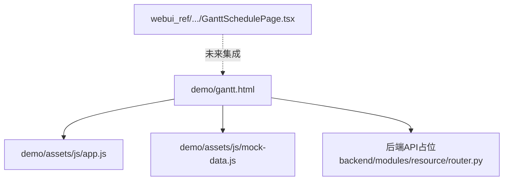
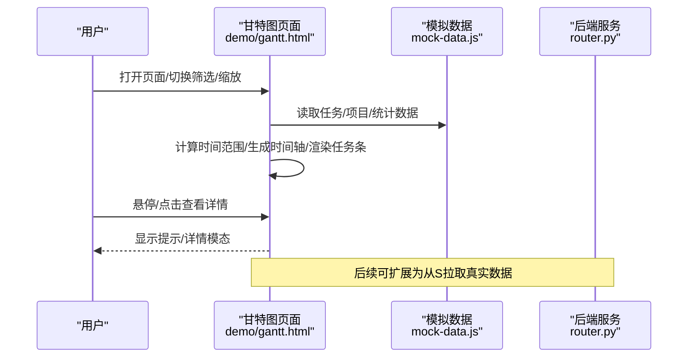
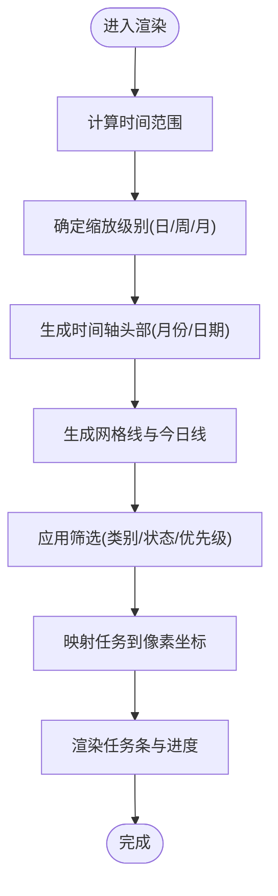
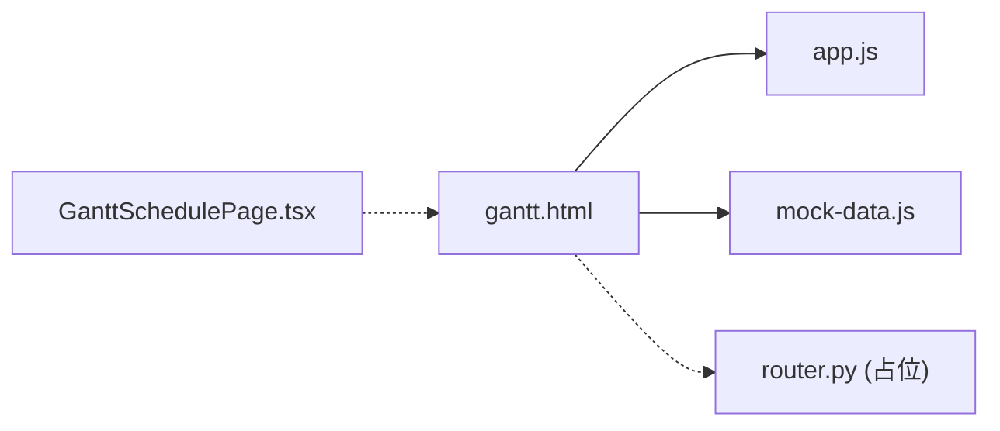

# 可视化渲染引擎

<cite>
**本文引用的文件**
- [demo/gantt.html](file://demo/gantt.html)
- [demo/assets/js/app.js](file://demo/assets/js/app.js)
- [demo/assets/js/mock-data.js](file://demo/assets/js/mock-data.js)
- [backend/modules/resource/router.py](file://backend/modules/resource/router.py)
- [webui_ref/client/src/pages/GanttSchedulePage/GanttSchedulePage.tsx](file://webui_ref/client/src/pages/GanttSchedulePage/GanttSchedulePage.tsx)
</cite>

## 目录
1. [简介](#简介)
2. [项目结构](#项目结构)
3. [核心组件](#核心组件)
4. [架构总览](#架构总览)
5. [详细组件分析](#详细组件分析)
6. [依赖关系分析](#依赖关系分析)
7. [性能与大数据优化](#性能与大数据优化)
8. [故障排查指南](#故障排查指南)
9. [结论](#结论)
10. [附录](#附录)

## 简介
本技术文档围绕“甘特图可视化渲染引擎”的实现进行系统化说明，覆盖渲染选型、层次化任务树、时间轴处理（刻度生成、缩放平移、时区）、资源视图（设备/人员/场地）展示、颜色编码体系、交互能力（悬停提示、点击详情、筛选过滤），以及面向大数据量的渲染优化策略。该引擎在仓库中以纯前端实现为主，并通过后端预留的API接口为后续数据接入提供扩展点。

## 项目结构
- 前端演示页面：位于 demo/gantt.html，包含完整的甘特图UI、样式与交互逻辑；数据通过本地模拟数据源加载。
- 通用工具脚本：demo/assets/js/app.js 提供导航、弹窗、选择器等通用能力。
- 模拟数据：demo/assets/js/mock-data.js 提供任务、项目、统计等示例数据。
- 后端接口占位：backend/modules/resource/router.py 暴露了甘特图相关API（如获取排程、冲突检测、关键路径计算等），便于后续接入真实数据。
- 前端工程占位：webui_ref/client/src/pages/GanttSchedulePage/GanttSchedulePage.tsx 为React工程中的甘特图页面占位，当前仅显示占位内容。

图表来源
- [demo/gantt.html:850-895](file://demo/gantt.html#L850-L895)
- [backend/modules/resource/router.py:834-852](file://backend/modules/resource/router.py#L834-L852)

章节来源
- [demo/gantt.html:850-895](file://demo/gantt.html#L850-L895)
- [backend/modules/resource/router.py:834-852](file://backend/modules/resource/router.py#L834-L852)

## 核心组件
- 渲染主流程：负责根据当前时间范围、缩放级别、筛选条件，生成时间轴头部、网格线、今日线，并逐行渲染任务条与进度。
- 时间轴处理：支持日/周/月三种缩放，动态计算每列宽度、月份分组、周末高亮、今日标记。
- 交互层：悬停提示、点击打开详情模态框、侧边栏与工具栏的多维筛选（类别/状态/优先级）。
- 颜色编码：基于任务类别与类型映射到统一的颜色体系，延期任务以视觉强调。
- 数据层：使用本地模拟数据，支持刷新与统计卡片更新。
- 后端对接：预留REST API用于获取甘特图数据、统计、冲突检测、关键路径计算等。

章节来源
- [demo/gantt.html:1064-1140](file://demo/gantt.html#L1064-L1140)
- [demo/gantt.html:1142-1293](file://demo/gantt.html#L1142-L1293)
- [demo/gantt.html:1295-1414](file://demo/gantt.html#L1295-L1414)
- [demo/assets/js/mock-data.js:141-183](file://demo/assets/js/mock-data.js#L141-L183)
- [backend/modules/resource/router.py:834-852](file://backend/modules/resource/router.py#L834-L852)

## 架构总览
整体采用“前端渲染 + 后端服务”的分层架构：
- 前端渲染层：基于原生DOM操作与CSS布局，构建甘特图的时间轴、任务条、网格与交互。
- 数据层：当前使用本地模拟数据，可替换为后端API返回的数据。
- 后端服务层：提供甘特图数据、统计、冲突检测、关键路径计算等接口，供前端调用。

图表来源
- [demo/gantt.html:1064-1140](file://demo/gantt.html#L1064-L1140)
- [demo/gantt.html:1142-1293](file://demo/gantt.html#L1142-L1293)
- [backend/modules/resource/router.py:834-852](file://backend/modules/resource/router.py#L834-L852)

## 详细组件分析

### 渲染引擎与时间轴
- 缩放配置：根据当前缩放级别（日/周/月）设置每日像素宽度，影响时间轴密度与任务条宽度。
- 时间范围：默认自动计算所有任务的最小开始日期与最大结束日期，并扩展至整月边界；也支持手动选择起止日期。
- 时间轴头部：按月分组生成月份标题，按天生成日期标签，周末与今日特殊样式。
- 网格与今日线：按天数生成垂直网格线，并在可视范围内绘制“今天”竖线。
- 任务条渲染：将任务起止时间映射到像素坐标，计算可见区间，生成任务条、进度条、类别标签与延期标记。

图表来源
- [demo/gantt.html:1064-1140](file://demo/gantt.html#L1064-L1140)
- [demo/gantt.html:1142-1293](file://demo/gantt.html#L1142-L1293)

章节来源
- [demo/gantt.html:1064-1140](file://demo/gantt.html#L1064-L1140)
- [demo/gantt.html:1142-1293](file://demo/gantt.html#L1142-L1293)

### 任务树形展示与父子关系
- 当前实现以扁平任务列表为主，未显式实现层级折叠/展开。
- 可通过数据结构扩展（增加parent_id、children字段）与渲染逻辑（递归构建节点、缩进、折叠按钮）实现树形展示。
- 建议：在mock数据中引入层级关系，并在渲染函数中根据层级深度计算缩进与折叠状态。

章节来源
- [demo/assets/js/mock-data.js:141-183](file://demo/assets/js/mock-data.js#L141-L183)

### 时间轴处理机制
- 时间刻度生成：按天循环生成日期标签，按月聚合生成月份标题；支持不同缩放下的显示格式。
- 缩放与平移：通过改变dayWidth实现缩放；滚动容器实现水平平移；“今天”按钮平滑滚动到当前日期位置。
- 时区处理：当前使用本地时间对象，未做显式时区转换；如需跨时区，可在日期解析与格式化阶段引入时区库或统一UTC存储。

章节来源
- [demo/gantt.html:1064-1140](file://demo/gantt.html#L1064-L1140)
- [demo/gantt.html:1591-1597](file://demo/gantt.html#L1591-L1597)

### 资源视图渲染逻辑
- 设备/人员/场地：当前甘特图页面聚焦任务维度，资源信息（设备、车间）作为任务元数据展示。
- 资源状态：在任务条上通过类别与延期标记间接体现资源占用情况；更细粒度的资源视图可在其他页面（如设备台账、园区地图）实现。
- 建议：在任务条上增加资源图标或状态徽章，或在右侧区域叠加资源视图图层。

章节来源
- [demo/gantt.html:1176-1272](file://demo/gantt.html#L1176-L1272)
- [demo/assets/js/mock-data.js:48-72](file://demo/assets/js/mock-data.js#L48-L72)

### 颜色编码系统
- 类别颜色：A类/B类/C类分别映射到红/橙/蓝三色。
- 类型颜色：A类任务/B类任务/C类任务/零星任务/试制岛任务各自有对应颜色。
- 优先级与状态：优先级与状态通过徽章样式区分（紧急/高/中/低；待执行/执行中/已完成/已延期/已取消）。
- 延期强调：延期任务在任务条上添加边框与角标提示。

章节来源
- [demo/gantt.html:973-1009](file://demo/gantt.html#L973-L1009)
- [demo/gantt.html:1041-1050](file://demo/gantt.html#L1041-L1050)

### 交互功能
- 悬停提示：鼠标移入任务条显示详细信息（类别、状态、优先级、负责人、设备、车间、起止时间、项目信息与进度）。
- 点击详情：点击任务行或任务条打开详情模态框，展示完整信息并提供编辑入口。
- 筛选过滤：侧边栏与工具栏支持按类别、状态、优先级筛选，实时更新甘特图。
- 缩放与定位：日/周/月缩放切换；“今天”按钮平滑滚动到当前日期位置。

章节来源
- [demo/gantt.html:1295-1414](file://demo/gantt.html#L1295-L1414)
- [demo/gantt.html:1421-1498](file://demo/gantt.html#L1421-L1498)
- [demo/gantt.html:1591-1597](file://demo/gantt.html#L1591-L1597)

### 大数据量渲染优化
- 当前实现：全量渲染可见范围内的任务行与网格线，未使用虚拟列表或增量更新。
- 优化建议：
  - 虚拟列表：仅渲染可视区域内的任务行，滚动时动态增减节点。
  - 增量更新：监听数据变化，仅更新受影响的任务条与网格线。
  - 内存管理：及时移除不可见节点的DOM引用，避免内存泄漏。
  - 事件委托：对大量任务条使用事件委托减少绑定开销。
  - 计算缓存：缓存时间范围、缩放配置与日期映射，减少重复计算。

章节来源
- [demo/gantt.html:1142-1293](file://demo/gantt.html#L1142-L1293)

## 依赖关系分析
- 页面依赖：gantt.html 依赖 app.js（通用工具）与 mock-data.js（数据源）。
- 后端依赖：当前未直接调用后端API，但路由已预留甘特图相关接口，便于后续集成。
- 前端工程：React工程中的甘特图页面目前为占位，未来可复用本引擎逻辑或重构为组件化实现。

图表来源
- [demo/gantt.html:969-970](file://demo/gantt.html#L969-L970)
- [backend/modules/resource/router.py:834-852](file://backend/modules/resource/router.py#L834-L852)
- [webui_ref/client/src/pages/GanttSchedulePage/GanttSchedulePage.tsx:1-16](file://webui_ref/client/src/pages/GanttSchedulePage/GanttSchedulePage.tsx#L1-L16)

章节来源
- [demo/gantt.html:969-970](file://demo/gantt.html#L969-L970)
- [backend/modules/resource/router.py:834-852](file://backend/modules/resource/router.py#L834-L852)
- [webui_ref/client/src/pages/GanttSchedulePage/GanttSchedulePage.tsx:1-16](file://webui_ref/client/src/pages/GanttSchedulePage/GanttSchedulePage.tsx#L1-L16)

## 性能与大数据优化
- 渲染瓶颈：全量DOM操作与字符串拼接在大数据量下可能产生性能问题。
- 优化方向：
  - 虚拟化：使用虚拟列表只渲染可视区域。
  - 增量更新：基于数据差异最小化重绘。
  - 计算优化：缓存日期映射与缩放配置。
  - 事件优化：使用事件委托减少监听器数量。
  - 内存优化：及时清理DOM引用与定时器。
- 监控建议：引入性能指标（FPS、内存占用、重绘次数）评估优化效果。

[本节为通用指导，不直接分析具体文件]

## 故障排查指南
- 时间轴错位：检查时间范围计算与缩放配置是否正确；确认日期解析与格式化一致。
- 任务条重叠：检查任务起止时间与可视范围映射逻辑；确保clampedStart/clampedEnd正确计算。
- 筛选无效：确认筛选条件与数据字段匹配；检查事件绑定与状态更新。
- 详情模态框异常：检查DOM元素是否存在；确认事件监听器是否被正确移除。
- 后端接口错误：检查路由定义与参数校验；查看服务端日志与异常堆栈。

章节来源
- [backend/modules/resource/router.py:1219-1422](file://backend/modules/resource/router.py#L1219-L1422)

## 结论
本渲染引擎以轻量级前端实现为核心，提供了完整的甘特图可视化能力，包括时间轴处理、任务条渲染、颜色编码与交互功能。当前版本使用本地模拟数据，后端接口已预留以便后续接入真实数据。针对大数据量场景，建议引入虚拟化与增量更新等优化策略，以提升渲染性能与用户体验。未来可将此引擎封装为可复用组件，集成到前端工程中，实现更灵活的配置与扩展。

[本节为总结性内容，不直接分析具体文件]

## 附录
- 关键函数路径参考：
  - 时间范围与缩放配置：[demo/gantt.html:1064-1088](file://demo/gantt.html#L1064-L1088)
  - 时间轴头部渲染：[demo/gantt.html:1090-1140](file://demo/gantt.html#L1090-L1140)
  - 任务条渲染：[demo/gantt.html:1176-1272](file://demo/gantt.html#L1176-L1272)
  - 悬停提示与详情模态框：[demo/gantt.html:1295-1414](file://demo/gantt.html#L1295-L1414)
  - 筛选与工具栏：[demo/gantt.html:1421-1498](file://demo/gantt.html#L1421-L1498)
  - 模拟数据生成：[demo/assets/js/mock-data.js:141-183](file://demo/assets/js/mock-data.js#L141-L183)
  - 后端API占位：[backend/modules/resource/router.py:834-852](file://backend/modules/resource/router.py#L834-L852)

[本节为索引性内容，不直接分析具体文件]