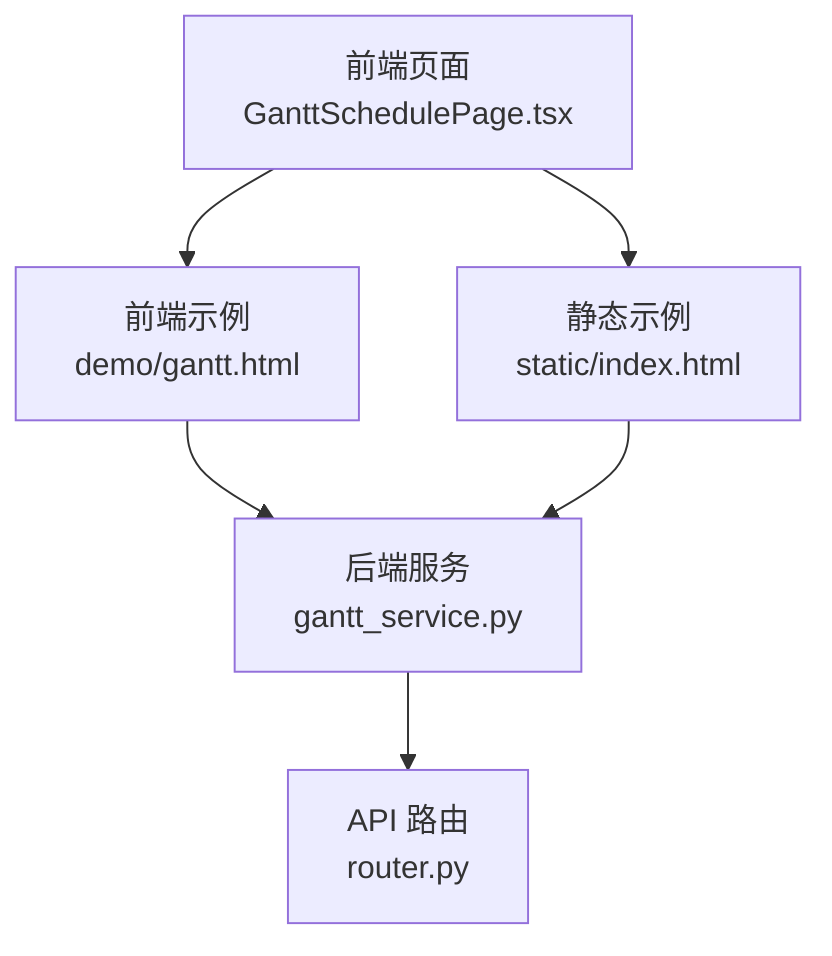
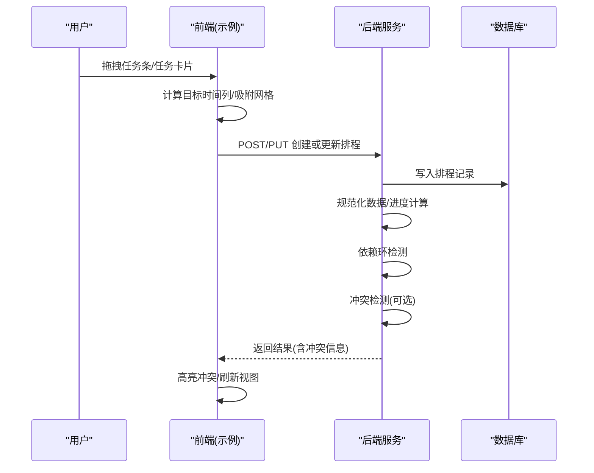
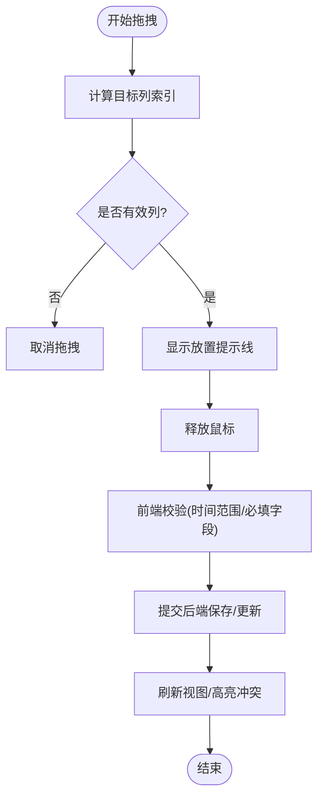
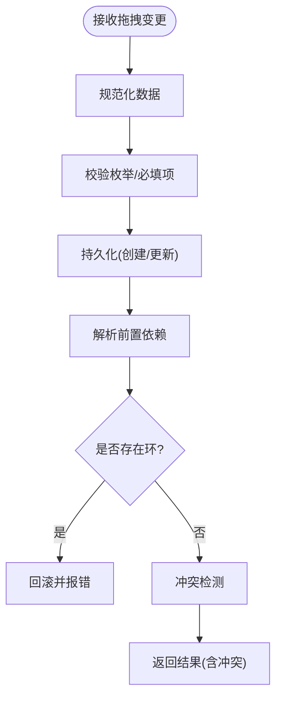

# 拖拽交互设计

<cite>
**本文引用的文件**
- [GanttSchedulePage.tsx](file://webui_ref/client/src/pages/GanttSchedulePage/GanttSchedulePage.tsx)
- [gantt_service.py](file://backend/modules/resource/services/gantt_service.py)
- [router.py](file://backend/modules/resource/router.py)
- [gantt.html](file://demo/gantt.html)
- [index.html](file://static/index.html)
</cite>

## 目录
1. [简介](#简介)
2. [项目结构](#项目结构)
3. [核心组件](#核心组件)
4. [架构总览](#架构总览)
5. [详细组件分析](#详细组件分析)
6. [依赖关系分析](#依赖关系分析)
7. [性能考虑](#性能考虑)
8. [故障排查指南](#故障排查指南)
9. [结论](#结论)
10. [附录](#附录)

## 简介
本文件面向甘特图拖拽调度交互的界面设计与前后端实现，覆盖任务移动、时间调整、资源重分配等关键操作；说明拖拽预览、位置吸附、冲突高亮等视觉反馈；梳理后端数据校验、业务规则检查与事务处理流程；补充键盘快捷键（方向键移动、批量选择、撤销/重做）建议；阐述响应式适配与无障碍访问支持；并给出虚拟滚动、懒加载、防抖等性能优化策略。文档同时结合仓库中的前端示例与后端服务代码，确保内容可落地、可追溯。

## 项目结构
- 前端页面占位：WebUI 中“甘特图排程”页面当前为占位视图，后续将承载完整拖拽交互。
- 前端示例：demo/gantt.html 提供完整的甘特图渲染、筛选、缩放、工具栏与详情弹窗等能力，可作为拖拽交互的基础参考。
- 静态页示例：static/index.html 包含基于原生 HTML/JS 的甘特图与拖拽任务库、冲突面板等实现片段，可直接用于原型验证。
- 后端服务：backend/modules/resource/services/gantt_service.py 提供排程数据的查询、更新、依赖管理、冲突检测等核心逻辑；backend/modules/resource/router.py 暴露 REST API 路由，供前端调用。

图表来源
- [GanttSchedulePage.tsx:1-16](file://webui_ref/client/src/pages/GanttSchedulePage/GanttSchedulePage.tsx#L1-L16)
- [gantt.html:850-895](file://demo/gantt.html#L850-L895)
- [index.html:10844-11062](file://static/index.html#L10844-L11062)
- [gantt_service.py:176-258](file://backend/modules/resource/services/gantt_service.py#L176-L258)
- [router.py:646-786](file://backend/modules/resource/router.py#L646-L786)

章节来源
- [GanttSchedulePage.tsx:1-16](file://webui_ref/client/src/pages/GanttSchedulePage/GanttSchedulePage.tsx#L1-L16)
- [gantt.html:850-895](file://demo/gantt.html#L850-L895)
- [index.html:10844-11062](file://static/index.html#L10844-L11062)
- [gantt_service.py:176-258](file://backend/modules/resource/services/gantt_service.py#L176-L258)
- [router.py:646-786](file://backend/modules/resource/router.py#L646-L786)

## 核心组件
- 前端页面占位：GanttSchedulePage 作为路由入口，预留甘特图排程容器，便于后续集成拖拽引擎。
- 前端示例：demo/gantt.html 实现了时间轴渲染、任务条展示、筛选与缩放、详情弹窗等；可作为拖拽交互的宿主容器。
- 静态示例：static/index.html 提供了任务库拖拽到甘特图的完整流程，包括 dragstart/dragover/drop、列对齐、提示线、冲突面板等。
- 后端服务：gantt_service.py 提供排程 CRUD、依赖环检测、冲突检测、统计等；router.py 暴露 /api/resource 下的任务、排程相关接口。

章节来源
- [GanttSchedulePage.tsx:1-16](file://webui_ref/client/src/pages/GanttSchedulePage/GanttSchedulePage.tsx#L1-L16)
- [gantt.html:1090-1293](file://demo/gantt.html#L1090-L1293)
- [index.html:11010-11062](file://static/index.html#L11010-L11062)
- [gantt_service.py:396-525](file://backend/modules/resource/services/gantt_service.py#L396-L525)
- [router.py:646-786](file://backend/modules/resource/router.py#L646-L786)

## 架构总览
以下序列图展示了从前端拖拽到后端保存与冲突检测的端到端流程。

图表来源
- [index.html:11010-11062](file://static/index.html#L11010-L11062)
- [gantt_service.py:396-525](file://backend/modules/resource/services/gantt_service.py#L396-L525)
- [gantt_service.py:553-605](file://backend/modules/resource/services/gantt_service.py#L553-L605)
- [gantt_service.py:775-800](file://backend/modules/resource/services/gantt_service.py#L775-L800)

## 详细组件分析

### 前端拖拽与可视化反馈
- 拖拽源与目标
  - 任务库卡片支持 draggable，dragstart 携带任务元数据（类型、工期、装配场地等）。
  - 甘特区域监听 dragover/dragleave/drop，计算鼠标所在列索引，显示放置提示线，落点吸附到整列。
- 视觉反馈
  - 拖拽时容器添加 drag-over 类，显示垂直提示线指示落点列。
  - 任务条悬停显示 Tooltip，包含类别、状态、优先级、负责人、设备、车间、起止日期、项目信息与进度条。
  - 延期任务在任务条右上角显示冲突标记。
- 交互细节
  - 时间轴支持日/周/月缩放，影响 dayWidth 与头部月份/日期渲染。
  - 左侧任务列表与右侧时间轴高度同步滚动。
  - “今天”按钮平滑滚动至当天位置。

图表来源
- [index.html:11010-11062](file://static/index.html#L11010-L11062)
- [gantt.html:1142-1293](file://demo/gantt.html#L1142-L1293)
- [gantt.html:1295-1344](file://demo/gantt.html#L1295-L1344)

章节来源
- [index.html:11010-11062](file://static/index.html#L11010-L11062)
- [gantt.html:1090-1293](file://demo/gantt.html#L1090-L1293)
- [gantt.html:1295-1344](file://demo/gantt.html#L1295-L1344)

### 后端数据处理与业务规则
- 数据规范化与进度计算
  - 根据计划起止时间自动计算计划工时；当未手动覆盖进度时，按实际工时/计划工时计算进度。
- 排程创建/更新
  - 校验枚举值（任务类型、优先级、状态、阶段、装配场地），生成唯一编号，持久化后返回详情。
- 依赖管理与环检测
  - 更新前置依赖时使用 DFS 检测环，若检测到环则回滚并抛出错误。
- 冲突检测
  - 扫描非取消状态的排程，计算时间重叠、资源重叠等冲突，支持按装配场地过滤，并可清理旧冲突记录。
- 资源分配
  - 支持新增、删除、批量分配资源，关联排程与资源类型校验。

图表来源
- [gantt_service.py:100-141](file://backend/modules/resource/services/gantt_service.py#L100-L141)
- [gantt_service.py:396-525](file://backend/modules/resource/services/gantt_service.py#L396-L525)
- [gantt_service.py:553-605](file://backend/modules/resource/services/gantt_service.py#L553-L605)
- [gantt_service.py:775-800](file://backend/modules/resource/services/gantt_service.py#L775-L800)

章节来源
- [gantt_service.py:100-141](file://backend/modules/resource/services/gantt_service.py#L100-L141)
- [gantt_service.py:396-525](file://backend/modules/resource/services/gantt_service.py#L396-L525)
- [gantt_service.py:553-605](file://backend/modules/resource/services/gantt_service.py#L553-L605)
- [gantt_service.py:775-800](file://backend/modules/resource/services/gantt_service.py#L775-L800)

### API 路由与集成点
- 任务与排程接口
  - 提供任务列表、详情、创建、更新、删除、统计等接口，统一以 code/message/data 包装返回。
  - 时间字段在路由层进行字符串格式化，便于前端消费。
- 健康检查
  - 模块级 ping 接口用于可用性探测。

章节来源
- [router.py:47-55](file://backend/modules/resource/router.py#L47-L55)
- [router.py:646-786](file://backend/modules/resource/router.py#L646-L786)

## 依赖关系分析
- 前端依赖
  - demo/gantt.html 依赖样式与图标库，负责渲染与交互；static/index.html 提供拖拽任务库与冲突面板的参考实现。
- 后端依赖
  - gantt_service.py 通过数据库查询/执行函数完成数据读写；router.py 将 HTTP 请求映射到服务方法。
- 耦合与内聚
  - 服务层集中了排程与冲突的业务规则，内聚度高；路由层仅做参数转换与异常封装，职责清晰。

图表来源
- [router.py:646-786](file://backend/modules/resource/router.py#L646-L786)
- [gantt_service.py:176-258](file://backend/modules/resource/services/gantt_service.py#L176-L258)

章节来源
- [router.py:646-786](file://backend/modules/resource/router.py#L646-L786)
- [gantt_service.py:176-258](file://backend/modules/resource/services/gantt_service.py#L176-L258)

## 性能考虑
- 虚拟滚动
  - 对超长任务列表采用虚拟滚动，仅渲染可视区域行，降低 DOM 节点数量与重绘开销。
- 懒加载
  - 时间轴按视口范围加载任务条；跨页/跨周数据按需拉取，避免一次性渲染全部数据。
- 防抖与节流
  - 拖拽过程中的吸附计算、冲突预览使用防抖；滚动与缩放事件使用节流，减少频繁重排。
- 渲染优化
  - 合并多次 DOM 更新；使用 DocumentFragment 批量插入；避免在高频事件中直接修改样式属性。
- 缓存
  - 对筛选条件、缩放配置、统计数据等进行本地缓存，减少重复请求。
- 网络优化
  - 批量提交拖拽变更；失败重试与幂等设计；服务端冲突检测增量执行。

[本节为通用性能建议，不直接引用具体文件]

## 故障排查指南
- 拖拽无效
  - 检查 dragover 是否阻止默认行为；确认 drop 区域尺寸与坐标计算正确。
- 冲突高亮不生效
  - 确认后端冲突检测结果已返回；前端是否正确读取 has_conflict/conflict_count 并渲染标记。
- 依赖环导致回滚
  - 查看后端日志；检查前置依赖设置是否形成闭环；必要时先解除部分依赖再重试。
- 时间格式错误
  - 路由层对 datetime 进行了格式化；如前端传入非法时间，需在前端校验并修正。
- 性能卡顿
  - 开启虚拟滚动；减少每次拖拽的冲突检测频率；对大列表进行分页/分片渲染。

章节来源
- [index.html:11010-11062](file://static/index.html#L11010-L11062)
- [gantt_service.py:553-605](file://backend/modules/resource/services/gantt_service.py#L553-L605)
- [gantt_service.py:775-800](file://backend/modules/resource/services/gantt_service.py#L775-L800)

## 结论
本项目已具备甘特图渲染与基础交互能力，并在后端提供了完善的排程与冲突检测服务。下一步应在 GanttSchedulePage 中集成拖拽引擎，复用 demo/static 的交互模式，完善键盘快捷键、响应式与无障碍特性，并通过虚拟滚动与懒加载保障大规模数据下的流畅体验。

[本节为总结性内容，不直接引用具体文件]

## 附录

### 拖拽交互规范（建议）
- 任务移动
  - 拖拽任务条时，吸附到最近的时间列；显示半透明预览条与垂直落点线。
  - 支持按住 Shift 多选拖拽，批量移动保持相对时间差。
- 时间调整
  - 拖动任务条两端可调整起止时间；最小粒度为一天；周末/节假日可配置不可用。
  - 超出项目边界时给出警告并阻止落点。
- 资源重分配
  - 拖拽任务条到不同资源行（人员/设备/区域）时，触发资源可用性校验；冲突时高亮并提示替代资源。
- 视觉反馈
  - 拖拽预览：半透明副本 + 阴影；落点吸附：高亮列背景 + 虚线边框。
  - 冲突高亮：红色边框/角标 + 悬浮提示冲突详情（资源、时间段、重叠时长）。
- 键盘快捷键
  - 方向键：选中任务后，左右移动一天；上下切换相邻任务。
  - 批量选择：Shift+方向键扩展选择；Ctrl/Cmd+A 全选。
  - 撤销/重做：Ctrl/Cmd+Z 撤销上一次拖拽；Ctrl/Cmd+Shift+Z 重做。
  - 快速编辑：Enter 打开详情；Esc 关闭弹窗并恢复焦点。
- 响应式设计
  - 小屏设备隐藏侧边筛选，改为底部抽屉；时间轴缩放默认“周”，支持手势缩放。
  - 触摸拖拽：支持 touchstart/touchmove/touchend 模拟拖拽，提供长按预览。
- 无障碍访问
  - 所有交互元素具备 aria-* 属性；屏幕阅读器朗读任务名称、状态、进度。
  - 键盘可达：Tab 顺序合理；焦点可见；弹窗聚焦陷阱。
  - 对比度与颜色：冲突高亮不仅依赖颜色，增加图标与文字提示。
- 性能优化
  - 虚拟滚动：仅渲染可视行；行高固定便于计算。
  - 懒加载：滚动到底部加载更多；时间轴按需加载任务条。
  - 防抖/节流：拖拽过程中每 100ms 计算一次吸附与冲突预览；滚动事件节流至 16ms。
  - 缓存：本地缓存筛选、缩放、统计数据；离线可用时优先读缓存。

[本节为通用设计规范，不直接引用具体文件]