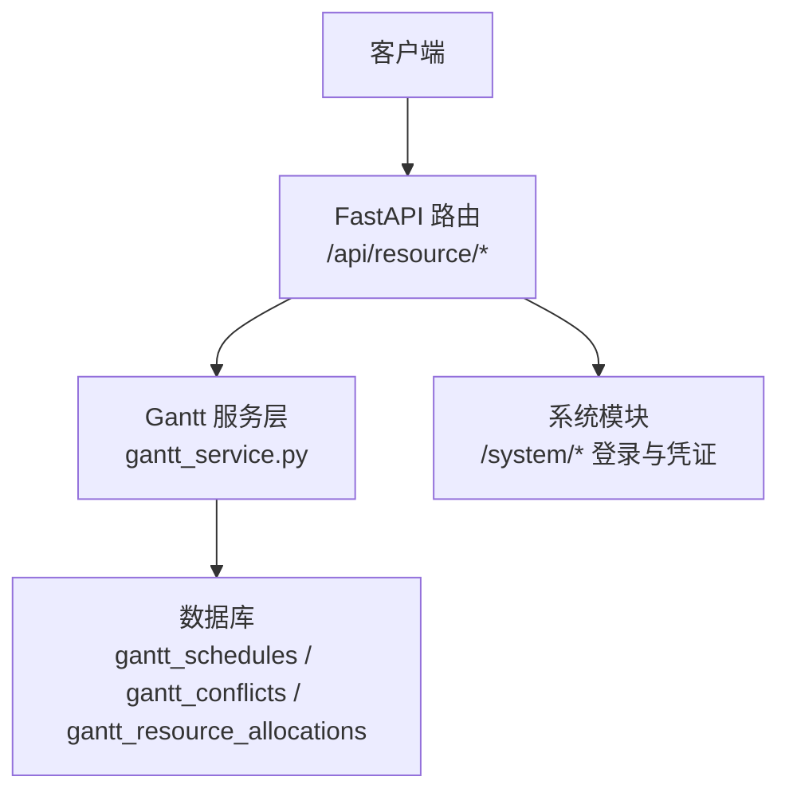
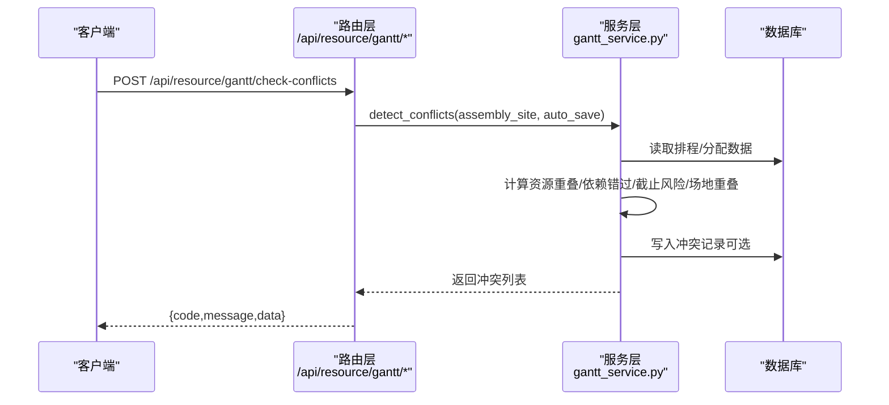
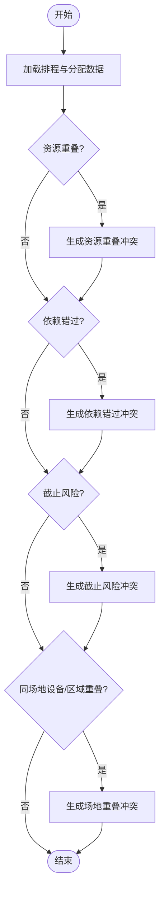
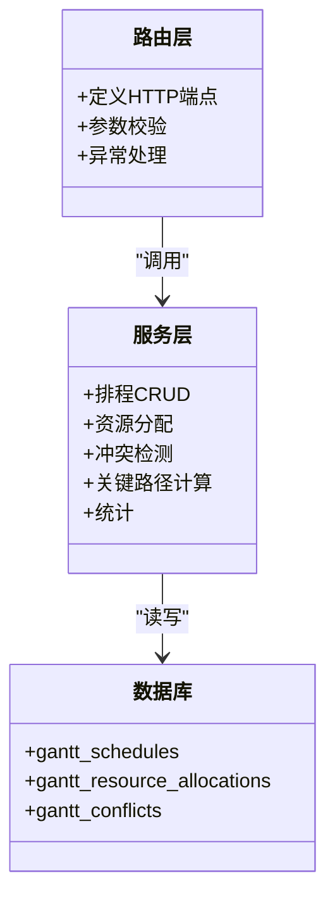

# 排程API接口

<cite>
**本文引用的文件**
- [backend/modules/resource/router.py](file://backend/modules/resource/router.py)
- [backend/modules/resource/services/gantt_service.py](file://backend/modules/resource/services/gantt_service.py)
- [backend/scheduling/router.py](file://backend/scheduling/router.py)
- [backend/system/router.py](file://backend/system/router.py)
- [backend/core/exceptions.py](file://backend/core/exceptions.py)
</cite>

## 目录
1. [简介](#简介)
2. [项目结构](#项目结构)
3. [核心组件](#核心组件)
4. [架构总览](#架构总览)
5. [详细组件分析](#详细组件分析)
6. [依赖关系分析](#依赖关系分析)
7. [性能考虑](#性能考虑)
8. [故障排查指南](#故障排查指南)
9. [结论](#结论)
10. [附录：完整API清单与调用示例](#附录完整api清单与调用示例)

## 简介
本文件为“甘特图排程”相关RESTful API的完整技术文档，覆盖以下能力：
- 排程CRUD：创建、查询、更新、删除排程；设置前置依赖；批量状态更新
- 资源分配：单条/批量分配资源到排程
- 冲突检测与处理：触发冲突检测、查询冲突列表、解决或忽略冲突
- 关键路径计算：基于前置依赖的关键路径计算并回写标记
- 统计看板：甘特KPI、分布与趋势
- 认证授权：系统登录获取凭证（JWT/Cookie）及凭证管理
- 错误处理：统一HTTP状态码与错误消息约定

说明：当前后端路由前缀为 /api/resource，所有端点均在该模块下注册。

## 项目结构
- 路由层：FastAPI Router 定义HTTP端点，负责参数校验、异常捕获与响应封装
- 服务层：gantt_service.py 实现排程、资源分配、冲突检测、关键路径等核心业务逻辑
- 数据访问：通过数据库工具函数进行SQL读写（query_all/query_one/execute/execute_last_id）
- 系统模块：提供登录与凭证管理接口，用于外部系统集成时的鉴权

图表来源
- [backend/modules/resource/router.py:1190-1419](file://backend/modules/resource/router.py#L1190-L1419)
- [backend/modules/resource/services/gantt_service.py:176-1427](file://backend/modules/resource/services/gantt_service.py#L176-L1427)
- [backend/system/router.py:54-109](file://backend/system/router.py#L54-L109)

章节来源
- [backend/modules/resource/router.py:1190-1419](file://backend/modules/resource/router.py#L1190-L1419)
- [backend/modules/resource/services/gantt_service.py:176-1427](file://backend/modules/resource/services/gantt_service.py#L176-L1427)
- [backend/system/router.py:54-109](file://backend/system/router.py#L54-L109)

## 核心组件
- 排程实体：包含任务信息、计划时间、优先级、阶段、装配场地、前置依赖、是否关键路径、冲突标记等
- 资源分配：将设备/人员/区域/吊车/物料等资源按时间段分配到排程
- 冲突记录：资源重叠、依赖错过、截止风险、同场地设备/区域重叠等
- 关键路径：基于拓扑排序计算最早/最晚开始结束时间与松弛时间，标记关键任务
- 统计：总数、状态分布、类型分布、场地分布、阶段分布、近8周趋势

章节来源
- [backend/modules/resource/services/gantt_service.py:15-31](file://backend/modules/resource/services/gantt_service.py#L15-L31)
- [backend/modules/resource/services/gantt_service.py:176-335](file://backend/modules/resource/services/gantt_service.py#L176-L335)

## 架构总览

图表来源
- [backend/modules/resource/router.py:1347-1356](file://backend/modules/resource/router.py#L1347-L1356)
- [backend/modules/resource/services/gantt_service.py:775-1076](file://backend/modules/resource/services/gantt_service.py#L775-L1076)

## 详细组件分析

### 排程CRUD与依赖管理
- 创建排程：POST /api/resource/gantt/schedules
  - 请求体字段参考 ScheduleCreateRequest
  - 自动计算计划工时与进度（可手动覆盖）
  - 自动生成排程编号
- 查询排程详情：GET /api/resource/gantt/schedules/{schedule_id_or_code}
  - 支持ID或排程编号查询
  - 返回关联的资源分配与打开状态的冲突
- 更新排程：PUT /api/resource/gantt/schedules/{schedule_id_or_code}
  - 仅更新传入字段
  - 自动规范化计划工时与进度
- 删除排程：DELETE /api/resource/gantt/schedules/{schedule_id_or_code}
  - 级联删除资源分配
  - 将与该排程相关的冲突置为 ignored
- 设置前置依赖：PUT /api/resource/gantt/schedules/{schedule_id_or_code}/dependencies
  - 支持环检测，若形成循环依赖则回滚并报错
- 批量状态更新：POST /api/resource/gantt/batch-status
  - 支持批量切换 pending/in_progress/completed/overdue/cancelled
  - 自动填充实际开始/结束时间戳与进度（非手动覆盖时）

章节来源
- [backend/modules/resource/router.py:1245-1295](file://backend/modules/resource/router.py#L1245-L1295)
- [backend/modules/resource/services/gantt_service.py:396-605](file://backend/modules/resource/services/gantt_service.py#L396-L605)
- [backend/modules/resource/services/gantt_service.py:1375-1427](file://backend/modules/resource/services/gantt_service.py#L1375-L1427)

### 资源分配
- 新增分配：POST /api/resource/gantt/allocations
  - 绑定到具体排程，支持时间段、数量、优先级、状态
- 批量分配：POST /api/resource/gantt/allocations/batch
  - 一次为同一排程创建多条分配
- 查询分配：GET /api/resource/gantt/allocations
  - 可按排程、资源类型、资源编码、状态筛选
- 删除分配：DELETE /api/resource/gantt/allocations/{allocation_id}

章节来源
- [backend/modules/resource/router.py:1297-1345](file://backend/modules/resource/router.py#L1297-L1345)
- [backend/modules/resource/services/gantt_service.py:608-724](file://backend/modules/resource/services/gantt_service.py#L608-L724)

### 冲突检测与处理
- 触发冲突检测：POST /api/resource/gantt/check-conflicts
  - 检测维度：资源重叠、依赖错过、截止风险、同场地设备/区域重叠
  - 可选择是否自动保存冲突记录到数据库
- 查询冲突列表：GET /api/resource/gantt/conflicts
  - 支持按冲突类型、严重级别、状态、装配场地、关联排程分页查询
- 解决冲突：PUT /api/resource/gantt/conflicts/{conflict_id_or_code}/resolve
  - 记录解决人与解决时间，清理排程冲突计数
- 忽略冲突：PUT /api/resource/gantt/conflicts/{conflict_id_or_code}/ignore
  - 记录忽略原因与操作人，清理排程冲突计数

图表来源
- [backend/modules/resource/services/gantt_service.py:775-1076](file://backend/modules/resource/services/gantt_service.py#L775-L1076)

章节来源
- [backend/modules/resource/router.py:1347-1397](file://backend/modules/resource/router.py#L1347-L1397)
- [backend/modules/resource/services/gantt_service.py:775-1252](file://backend/modules/resource/services/gantt_service.py#L775-L1252)

### 关键路径计算
- 计算关键路径：POST /api/resource/gantt/compute-critical
  - 基于前置依赖构建DAG，使用拓扑排序计算ES/EF/LF/LS
  - 根据松弛时间标记 is_critical 并写入 slack_hours
  - 返回关键任务数量与ID列表

章节来源
- [backend/modules/resource/router.py:1399-1408](file://backend/modules/resource/router.py#L1399-L1408)
- [backend/modules/resource/services/gantt_service.py:1255-1372](file://backend/modules/resource/services/gantt_service.py#L1255-L1372)

### 统计与看板
- 甘特数据列表：GET /api/resource/gantt/data
  - 支持分页、任务类型、状态、优先级、装配场地、关键词、日期区间、仅关键/仅冲突过滤
- 甘特统计：GET /api/resource/gantt/stats
  - 返回总数、状态分布、类型分布、场地分布、阶段分布、近8周趋势、本周起止数量等

章节来源
- [backend/modules/resource/router.py:1190-1228](file://backend/modules/resource/router.py#L1190-L1228)
- [backend/modules/resource/services/gantt_service.py:176-335](file://backend/modules/resource/services/gantt_service.py#L176-L335)

### 认证与授权
- 登录获取凭证：POST /system/login
  - 支持多来源登录，返回JWT Token或Cookie（由底层credentials实现决定）
- 飞书应用登录：POST /system/login/feishu
  - 获取 tenant_access_token
- 凭证管理：
  - 列出凭证：GET /system/credentials
  - 保存/更新凭证：POST /system/credentials
  - 手动同步凭证：POST /system/credentials/sync
  - 删除凭证：DELETE /system/credentials/{source}
- 系统参数：GET/POST /system/params

注意：当前排程路由未内置全局鉴权中间件，建议在网关或部署层统一接入JWT校验与权限控制。

章节来源
- [backend/system/router.py:54-109](file://backend/system/router.py#L54-L109)

## 依赖关系分析
- 路由层与服务层解耦：路由只负责参数解析与异常包装，业务逻辑集中在服务层
- 服务层对数据库直接操作：通过统一查询接口执行SQL，避免ORM耦合
- 冲突检测与关键路径计算均为独立算法实现，便于扩展与维护
- 排程与资源分配、冲突记录存在一对多/多对多关系，删除排程会级联清理

图表来源
- [backend/modules/resource/router.py:1190-1419](file://backend/modules/resource/router.py#L1190-L1419)
- [backend/modules/resource/services/gantt_service.py:176-1427](file://backend/modules/resource/services/gantt_service.py#L176-L1427)

章节来源
- [backend/modules/resource/router.py:1190-1419](file://backend/modules/resource/router.py#L1190-L1419)
- [backend/modules/resource/services/gantt_service.py:176-1427](file://backend/modules/resource/services/gantt_service.py#L176-L1427)

## 性能考虑
- 冲突检测复杂度与分配数量呈二次增长，建议：
  - 按装配场地或排程范围缩小检测范围
  - 合理分页与限制 page_size
- 关键路径计算涉及全量排程与依赖图遍历，建议在低峰期或按需触发
- 批量操作应控制单次提交规模，避免长事务与锁竞争
- 数据库索引建议：
  - gantt_schedules(plan_start_time, plan_end_time, assembly_site, status, task_type)
  - gantt_resource_allocations(schedule_id, resource_type, resource_code, start_time, end_time)
  - gantt_conflicts(status, severity, detected_at, assembly_site)

[本节为通用性能建议，不直接分析具体文件]

## 故障排查指南
- 常见错误
  - 400 参数无效：如任务类型、优先级、状态、阶段、装配场地不在允许值
  - 404 资源不存在：排程或冲突ID/编号不存在
  - 500 内部错误：服务层异常或数据库错误
- 排查步骤
  - 检查请求体字段是否符合模型定义
  - 确认排程是否存在且未被取消
  - 查看日志中的异常堆栈与SQL执行上下文
  - 对于依赖环检测失败，检查前置任务链是否形成闭环
- 统一异常基类
  - BusinessError：业务异常基类，携带message与code

章节来源
- [backend/core/exceptions.py:1-8](file://backend/core/exceptions.py#L1-L8)
- [backend/modules/resource/router.py:1245-1419](file://backend/modules/resource/router.py#L1245-L1419)

## 结论
本API提供了完整的甘特图排程能力，涵盖排程CRUD、资源分配、冲突检测与处理、关键路径计算与统计看板。服务层实现了高内聚的业务逻辑，路由层保持简洁与一致的错误处理。建议在部署层统一接入认证与权限控制，并结合数据库索引优化查询与冲突检测性能。

[本节为总结性内容，不直接分析具体文件]

## 附录：完整API清单与调用示例

### 基础约定
- 基础路径：/api/resource
- 成功响应格式：{ code: 200, message: "成功", data: ... }
- 失败响应格式：{ code: 4xx/5xx, message: "错误描述", data: null }
- 认证：请在网关或部署层统一校验JWT令牌与权限

### 排程
- POST /api/resource/gantt/schedules
  - 用途：创建排程
  - 请求体关键字段：task_name, task_type, phase, priority, status, assembly_site, plan_start_time, plan_end_time, predecessor_ids 等
  - 响应：返回创建的排程详情
- GET /api/resource/gantt/schedules/{schedule_id_or_code}
  - 用途：获取排程详情（含资源分配与打开冲突）
- PUT /api/resource/gantt/schedules/{schedule_id_or_code}
  - 用途：更新排程（仅更新传入字段）
- DELETE /api/resource/gantt/schedules/{schedule_id_or_code}
  - 用途：删除排程（级联清理分配与冲突）
- PUT /api/resource/gantt/schedules/{schedule_id_or_code}/dependencies
  - 用途：设置前置依赖（环检测）
- POST /api/resource/gantt/batch-status
  - 用途：批量更新排程状态

章节来源
- [backend/modules/resource/router.py:1245-1295](file://backend/modules/resource/router.py#L1245-L1295)
- [backend/modules/resource/router.py:1410-1419](file://backend/modules/resource/router.py#L1410-L1419)

### 资源分配
- POST /api/resource/gantt/allocations
  - 用途：新增资源分配
- POST /api/resource/gantt/allocations/batch
  - 用途：批量资源分配
- GET /api/resource/gantt/allocations
  - 用途：查询资源分配列表（支持筛选）
- DELETE /api/resource/gantt/allocations/{allocation_id}
  - 用途：删除资源分配

章节来源
- [backend/modules/resource/router.py:1297-1345](file://backend/modules/resource/router.py#L1297-L1345)

### 冲突检测与处理
- POST /api/resource/gantt/check-conflicts
  - 用途：触发冲突检测（资源重叠/依赖错过/截止风险/场地重叠）
  - 请求体：assembly_site, auto_save
- GET /api/resource/gantt/conflicts
  - 用途：查询冲突列表（支持分页与筛选）
- PUT /api/resource/gantt/conflicts/{conflict_id_or_code}/resolve
  - 用途：标记冲突已解决
- PUT /api/resource/gantt/conflicts/{conflict_id_or_code}/ignore
  - 用途：忽略冲突

章节来源
- [backend/modules/resource/router.py:1347-1397](file://backend/modules/resource/router.py#L1347-L1397)

### 关键路径与统计
- POST /api/resource/gantt/compute-critical
  - 用途：计算关键路径并回写标记
- GET /api/resource/gantt/data
  - 用途：获取甘特图排程数据（分页+筛选）
- GET /api/resource/gantt/stats
  - 用途：获取甘特KPI统计与趋势

章节来源
- [backend/modules/resource/router.py:1190-1228](file://backend/modules/resource/router.py#L1190-L1228)
- [backend/modules/resource/router.py:1399-1408](file://backend/modules/resource/router.py#L1399-L1408)

### 认证与系统
- POST /system/login
  - 用途：登录获取凭证（JWT/Cookie）
- POST /system/login/feishu
  - 用途：飞书应用登录
- GET/POST /system/credentials
  - 用途：凭证管理与同步
- GET/POST /system/params
  - 用途：系统参数管理

章节来源
- [backend/system/router.py:54-109](file://backend/system/router.py#L54-L109)

### 调用示例（示意）
- 创建排程
  - 方法：POST
  - URL：/api/resource/gantt/schedules
  - 请求体示例：
    - { "task_name": "试制A", "task_type": "B", "phase": "assembly", "priority": "medium", "status": "pending", "assembly_site": "SZA", "plan_start_time": "2025-01-01 09:00:00", "plan_end_time": "2025-01-01 17:00:00", "predecessor_ids": [] }
  - 响应示例：
    - { "code": 200, "message": "创建成功", "data": { "id": 123, "schedule_code": "SCH-2025-0001", ... } }
- 触发冲突检测
  - 方法：POST
  - URL：/api/resource/gantt/check-conflicts
  - 请求体示例：
    - { "assembly_site": "SZA", "auto_save": true }
  - 响应示例：
    - { "code": 200, "message": "检测完成", "data": { "count": 2, "conflicts": [...] } }
- 批量状态更新
  - 方法：POST
  - URL：/api/resource/gantt/batch-status
  - 请求体示例：
    - { "schedule_ids": [123, 124], "status": "in_progress", "by": "admin" }
  - 响应示例：
    - { "code": 200, "message": "批量状态更新完成", "data": { "updated": 2, "status": "in_progress" } }

[以上示例为基于模型定义的示意，字段以实际模型为准]