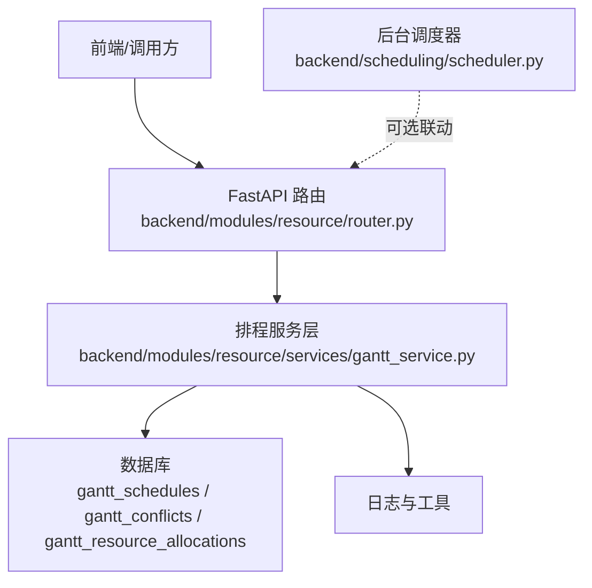
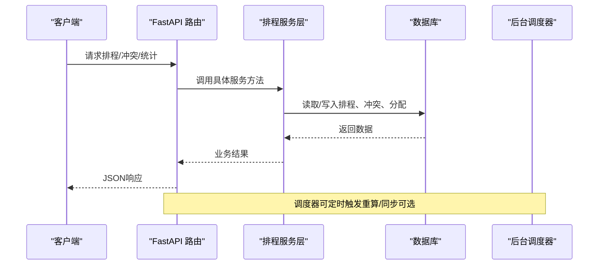
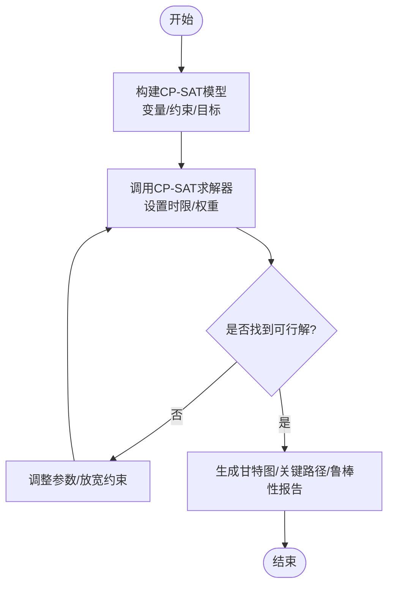
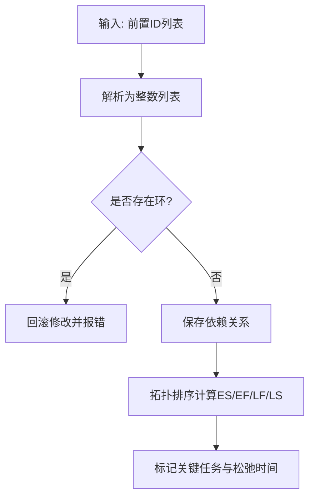
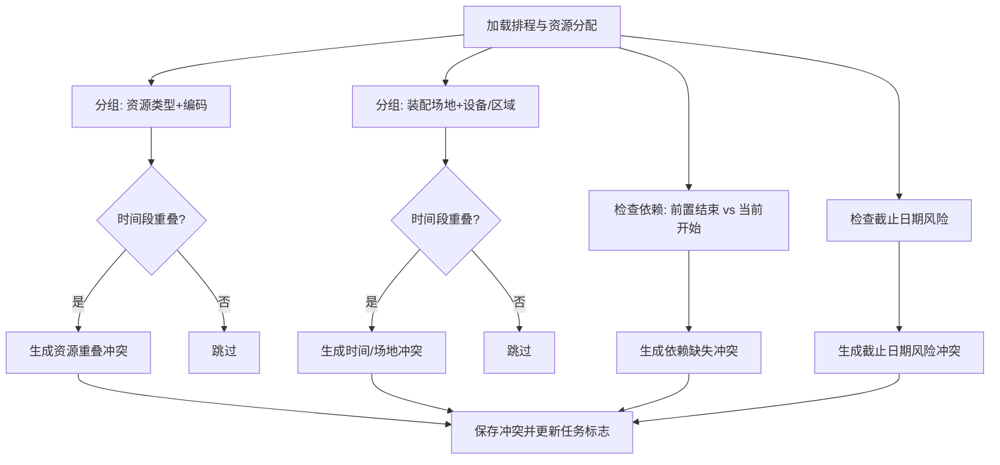
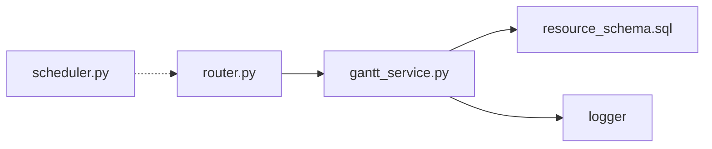

# 排程算法核心

<cite>
**本文引用的文件**
- [gantt_service.py](file://backend/modules/resource/services/gantt_service.py)
- [router.py](file://backend/modules/resource/router.py)
- [需求文档_V3_BFWS_CPSAT.md](file://需求文档_V3_BFWS_CPSAT.md)
- [resource_schema.sql](file://backend/sql/resource_schema.sql)
- [scheduler.py](file://backend/scheduling/scheduler.py)
</cite>

## 目录
1. [简介](#简介)
2. [项目结构](#项目结构)
3. [核心组件](#核心组件)
4. [架构总览](#架构总览)
5. [详细组件分析](#详细组件分析)
6. [依赖关系分析](#依赖关系分析)
7. [性能考虑](#性能考虑)
8. [故障排查指南](#故障排查指南)
9. [结论](#结论)
10. [附录](#附录)

## 简介
本技术文档围绕“甘特图排程算法核心”展开，聚焦于BFWS（Branch and Bound with Windowing Strategy）排程算法的数学模型、窗口化搜索范围控制、约束满足求解过程，以及任务依赖关系处理（前置解析、循环依赖检测、关键路径计算）、资源冲突检测与解决策略、多目标优化策略（工期最短、成本最低、资源均衡）、排程规则自定义配置方法，以及面向大规模排程的性能优化技术（并发、缓存、增量更新）。

本项目当前已实现：
- 基于数据库的甘特图排程CRUD、依赖管理、冲突检测、关键路径计算等能力；
- BFWS + CP-SAT 的完整产品设计与建模方案（需求文档），为后续精确求解提供蓝图。

## 项目结构
后端以FastAPI模块组织，资源与排程相关逻辑集中在 backend/modules/resource 下，其中 gantt_service.py 实现了排程数据访问、依赖与冲突检测、关键路径计算等核心功能；router.py 暴露REST接口；数据库表结构定义在 resource_schema.sql；调度器 scheduler.py 负责后台定时任务（与排程无直接耦合，但可作为扩展点）。

图表来源
- [router.py:1-800](file://backend/modules/resource/router.py#L1-L800)
- [gantt_service.py:176-1142](file://backend/modules/resource/services/gantt_service.py#L176-L1142)
- [resource_schema.sql:307-325](file://backend/sql/resource_schema.sql#L307-L325)

章节来源
- [router.py:1-800](file://backend/modules/resource/router.py#L1-L800)
- [gantt_service.py:176-1142](file://backend/modules/resource/services/gantt_service.py#L176-L1142)
- [resource_schema.sql:307-325](file://backend/sql/resource_schema.sql#L307-L325)

## 核心组件
- 排程服务层（gantt_service.py）
  - 排程CRUD：创建、更新、删除、分页查询、详情获取
  - 依赖管理：前置任务解析、序列化存储、循环依赖检测（DFS）
  - 冲突检测：资源重叠、时间重叠、依赖缺失、截止日期风险、同场地设备/区域重叠
  - 关键路径计算：拓扑排序、最早/最晚开始结束时间、松弛时间、标记关键任务
  - 统计与看板：按状态、类型、场地、阶段分布及周趋势
- 路由层（router.py）
  - 暴露任务、设备、人员、维护、统计等REST接口，作为上层调用入口
- 数据库模式（resource_schema.sql）
  - 定义排程、冲突、资源分配等表结构与索引，支撑高效查询与冲突检索
- 后台调度器（scheduler.py）
  - 独立线程执行定时任务，支持暂停/恢复、配置热重载、运行状态上报

章节来源
- [gantt_service.py:396-605](file://backend/modules/resource/services/gantt_service.py#L396-L605)
- [gantt_service.py:775-1076](file://backend/modules/resource/services/gantt_service.py#L775-L1076)
- [gantt_service.py:1255-1372](file://backend/modules/resource/services/gantt_service.py#L1255-L1372)
- [router.py:581-800](file://backend/modules/resource/router.py#L581-L800)
- [resource_schema.sql:307-325](file://backend/sql/resource_schema.sql#L307-L325)
- [scheduler.py:16-196](file://backend/scheduling/scheduler.py#L16-L196)

## 架构总览
系统采用分层架构：路由层接收请求并转发至服务层；服务层封装业务逻辑（排程、依赖、冲突、关键路径）；持久化通过SQL访问数据库；可选地由后台调度器触发周期性任务或联动其他模块。

图表来源
- [router.py:581-800](file://backend/modules/resource/router.py#L581-L800)
- [gantt_service.py:176-1142](file://backend/modules/resource/services/gantt_service.py#L176-L1142)
- [scheduler.py:93-153](file://backend/scheduling/scheduler.py#L93-L153)

## 详细组件分析

### BFWS（分支定界+窗口化）排程算法设计
- 数学模型
  - 决策变量：每个车型在每个工位的开始/结束时间与区间变量
  - 约束：
    - 工序顺序：start[j][m+1] >= end[j][m]
    - 工位独占：同一工位上不同车型的区间不重叠（NoOverlap）
    - 关键件到货约束：首工位开始时间不早于关键件最晚到货时间
  - 目标函数：加权多目标（如最小化完工时间 makespan 与等待惩罚）
- 窗口化搜索（Windowing Strategy）
  - 通过设置时间跨度（Horizon）限制搜索空间，结合Anytime特性在时限内返回当前最优解
  - 使用初始解注入（规则引擎输出）加速收敛
- 求解器
  - 基于Google OR-Tools CP-SAT构建模型并求解
- 鲁棒性分析
  - 多场景（乐观/基准/悲观）并行求解，评估延迟影响与建议调整

图表来源
- [需求文档_V3_BFWS_CPSAT.md:395-496](file://需求文档_V3_BFWS_CPSAT.md#L395-L496)

章节来源
- [需求文档_V3_BFWS_CPSAT.md:17-70](file://需求文档_V3_BFWS_CPSAT.md#L17-L70)
- [需求文档_V3_BFWS_CPSAT.md:395-496](file://需求文档_V3_BFWS_CPSAT.md#L395-L496)

### 任务依赖关系处理
- 前置任务解析
  - 支持逗号分隔或JSON数组格式的前置ID列表，统一解析为整数列表
  - 序列化为字符串存储，便于查询与展示
- 循环依赖检测
  - 使用深度优先搜索（DFS）在更新依赖时检测环，若检测到环则回滚修改并抛出错误
- 关键路径计算
  - 基于拓扑排序计算最早/最晚开始结束时间，得到松弛时间，标记关键任务（松弛接近0）
  - 将关键性与松弛小时数写回数据库，供前端高亮显示

图表来源
- [gantt_service.py:82-98](file://backend/modules/resource/services/gantt_service.py#L82-L98)
- [gantt_service.py:553-605](file://backend/modules/resource/services/gantt_service.py#L553-L605)
- [gantt_service.py:1255-1372](file://backend/modules/resource/services/gantt_service.py#L1255-L1372)

章节来源
- [gantt_service.py:82-98](file://backend/modules/resource/services/gantt_service.py#L82-L98)
- [gantt_service.py:553-605](file://backend/modules/resource/services/gantt_service.py#L553-L605)
- [gantt_service.py:1255-1372](file://backend/modules/resource/services/gantt_service.py#L1255-L1372)

### 资源冲突检测算法
- 检测维度
  - 资源重叠：同一资源类型与编码的时间段重叠（设备、人员、区域、吊车、物料等）
  - 时间重叠：同一装配场地的任务时间段重叠
  - 依赖缺失：前置任务结束时间晚于当前任务开始时间
  - 截止日期风险：进行中任务超过计划结束时间一定阈值
  - 同场地设备/区域重叠：在同一场地共享设备或区域的多个任务时间重叠
- 严重等级与处理建议
  - 根据重叠时长划分严重等级（critical/high/medium/low）
  - 自动生成处理建议（改期、更换资源、拆分场地等）
- 自动保存与更新
  - 支持将冲突记录写入数据库，并更新任务的冲突计数与标志位

图表来源
- [gantt_service.py:775-1076](file://backend/modules/resource/services/gantt_service.py#L775-L1076)
- [resource_schema.sql:307-325](file://backend/sql/resource_schema.sql#L307-L325)

章节来源
- [gantt_service.py:775-1076](file://backend/modules/resource/services/gantt_service.py#L775-L1076)
- [resource_schema.sql:307-325](file://backend/sql/resource_schema.sql#L307-L325)

### 排程优化的多目标策略
- 目标组合
  - 工期最短（最小化makespan）
  - 成本最低（可通过惩罚项体现，如等待时间、换线成本等）
  - 资源均衡（避免资源过度集中或空闲）
- 实现细节
  - 在CP-SAT中通过加权目标函数进行多目标权衡（例如 alpha*makespan + gamma*penalty）
  - 支持What-if参数配置（齐套权重、工时权重、风险权重）与关键件到货偏移
- 鲁棒性分析
  - 多场景求解对比（乐观/基准/悲观），输出延迟影响与建议调整

章节来源
- [需求文档_V3_BFWS_CPSAT.md:127-188](file://需求文档_V3_BFWS_CPSAT.md#L127-L188)
- [需求文档_V3_BFWS_CPSAT.md:395-496](file://需求文档_V3_BFWS_CPSAT.md#L395-L496)

### 排程规则的自定义配置
- 依赖关系设置
  - 支持在前端或API中设置前置任务ID列表，系统自动校验环依赖
- 资源限制条件
  - 可为任务指定设备、人员、区域等资源，并在冲突检测中生效
- 时间窗口约束
  - 通过计划起止时间、约束日期、关键件到货时间等实现时间窗限制
- 优先级与状态
  - 支持高/中/低优先级与多种状态（待开始、进行中、已完成、逾期、取消）

章节来源
- [gantt_service.py:396-525](file://backend/modules/resource/services/gantt_service.py#L396-L525)
- [gantt_service.py:608-724](file://backend/modules/resource/services/gantt_service.py#L608-L724)

### 大规模排程的性能优化技术
- 并发处理
  - 后台调度器使用独立线程运行，支持暂停/恢复，避免阻塞主流程
- 缓存策略
  - 建议在路由或服务层增加结果缓存（如最近一次排程结果、冲突检测结果），减少重复计算
- 增量更新
  - 仅对变更的任务/资源重新计算冲突与关键路径，降低全量扫描开销
- 数据库索引
  - 冲突表针对类型、严重等级、状态、关联任务、资源、场地、检测时间建立索引，提升查询效率

章节来源
- [scheduler.py:16-196](file://backend/scheduling/scheduler.py#L16-L196)
- [resource_schema.sql:307-325](file://backend/sql/resource_schema.sql#L307-L325)

## 依赖关系分析
- 组件耦合
  - 路由层与服务层松耦合，通过函数调用传递数据
  - 服务层与数据库强耦合，所有业务逻辑最终落库
- 外部依赖
  - FastAPI框架、Python标准库、数据库驱动
  - 未来引入OR-Tools CP-SAT用于精确求解
- 潜在循环依赖
  - 当前未发现循环导入；服务层内部函数相互调用清晰

图表来源
- [router.py:1-800](file://backend/modules/resource/router.py#L1-L800)
- [gantt_service.py:1-1427](file://backend/modules/resource/services/gantt_service.py#L1-L1427)
- [resource_schema.sql:307-325](file://backend/sql/resource_schema.sql#L307-L325)
- [scheduler.py:16-196](file://backend/scheduling/scheduler.py#L16-L196)

章节来源
- [router.py:1-800](file://backend/modules/resource/router.py#L1-L800)
- [gantt_service.py:1-1427](file://backend/modules/resource/services/gantt_service.py#L1-L1427)
- [resource_schema.sql:307-325](file://backend/sql/resource_schema.sql#L307-L325)
- [scheduler.py:16-196](file://backend/scheduling/scheduler.py#L16-L196)

## 性能考虑
- 冲突检测复杂度
  - 资源重叠检测为O(R^2)（R为分配数量），可通过分组与时间索引优化
  - 关键路径计算为O(N+E)（N为任务数，E为依赖边数）
- 数据库查询优化
  - 使用分页与条件过滤减少数据传输
  - 利用索引加速冲突与排程查询
- 内存与CPU
  - 大任务集下注意内存占用，避免一次性加载全部数据到内存
- 可扩展性
  - 将BFWS+CP-SAT作为独立服务，通过消息队列异步调用，避免阻塞HTTP请求

[本节为通用指导，无需特定文件引用]

## 故障排查指南
- 常见错误
  - 依赖环：更新依赖时检测到环，需检查前置关系并修正
  - 资源冲突：同一资源时间段重叠，需调整时间或更换资源
  - 截止日期风险：任务逾期，需加快进度或拆分任务
- 定位步骤
  - 查看冲突列表，按严重等级排序，关注critical与high
  - 检查任务的关键路径与松弛时间，识别瓶颈
  - 核对前置依赖是否正确，必要时重新计算关键路径
- 处理建议
  - 自动建议：系统提供改期、更换资源、拆分场地等建议
  - 手动干预：用户可根据业务情况调整任务时间或资源分配

章节来源
- [gantt_service.py:553-605](file://backend/modules/resource/services/gantt_service.py#L553-L605)
- [gantt_service.py:775-1076](file://backend/modules/resource/services/gantt_service.py#L775-L1076)
- [gantt_service.py:1255-1372](file://backend/modules/resource/services/gantt_service.py#L1255-L1372)

## 结论
本项目已具备完整的甘特图排程基础能力，包括依赖管理、冲突检测、关键路径计算与统计分析。BFWS+CP-SAT的设计文档为精确排程提供了清晰的实施路径，后续可按阶段推进求解器集成、前端可视化与鲁棒性分析。通过并发、缓存与增量更新等技术手段，可进一步提升大规模排程的性能与用户体验。

[本节为总结，无需特定文件引用]

## 附录
- API示例
  - 获取排程列表：GET /api/resource/tasks（支持筛选、分页、搜索）
  - 创建排程：POST /api/resource/tasks
  - 更新依赖：PUT /api/resource/tasks/{task_id}（含前置任务ID列表）
  - 冲突检测：调用服务层detect_conflicts（可由前端或后台触发）
  - 关键路径：调用服务层compute_critical_path
- 数据模型
  - 排程表：gantt_schedules（字段包含任务信息、时间、依赖、关键性等）
  - 冲突表：gantt_conflicts（字段包含冲突类型、严重等级、重叠时间、建议等）
  - 资源分配表：gantt_resource_allocations（字段包含资源类型、编码、时间、数量等）

章节来源
- [router.py:581-800](file://backend/modules/resource/router.py#L581-L800)
- [gantt_service.py:176-1142](file://backend/modules/resource/services/gantt_service.py#L176-L1142)
- [resource_schema.sql:307-325](file://backend/sql/resource_schema.sql#L307-L325)