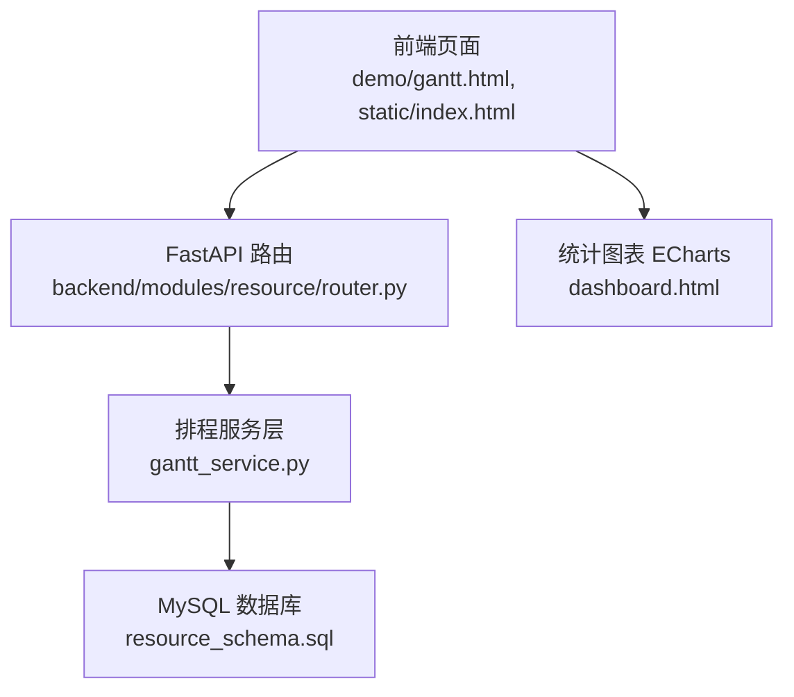
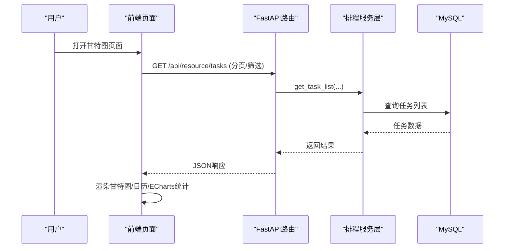
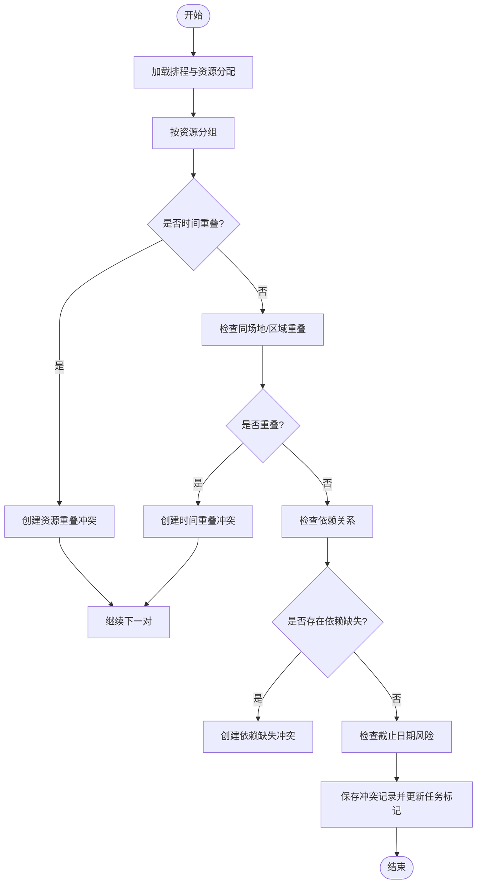
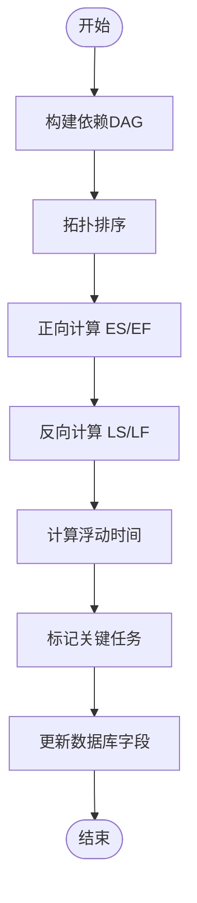
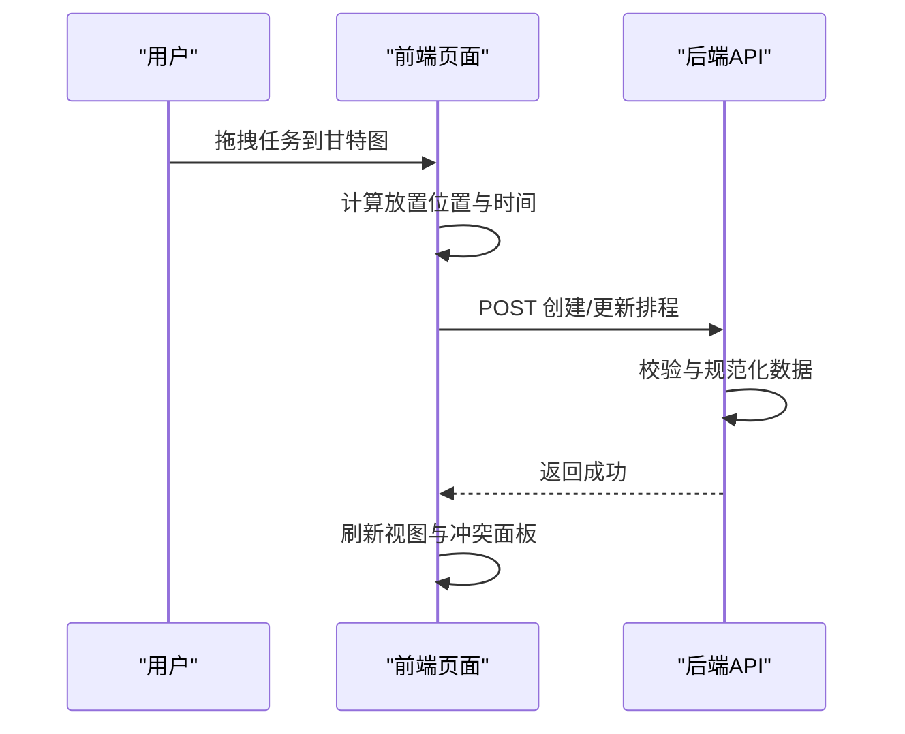
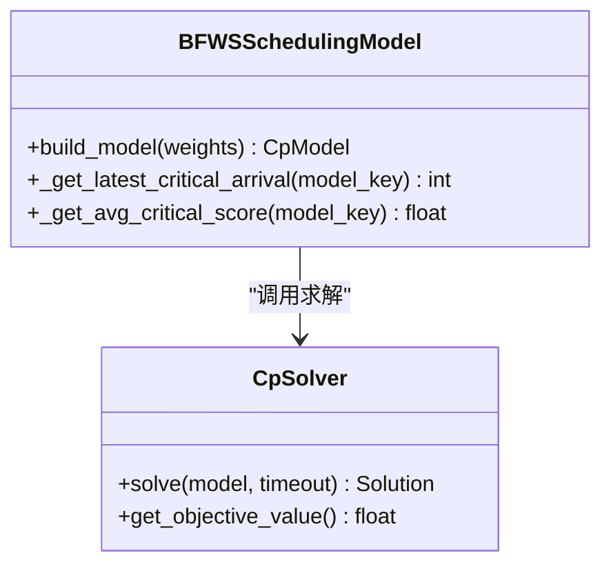
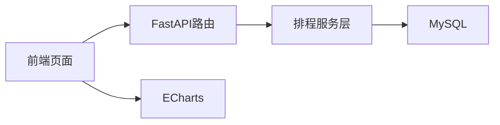

# 甘特图排程

<cite>
**本文引用的文件**
- [gantt_service.py](file://backend/modules/resource/services/gantt_service.py)
- [router.py](file://backend/modules/resource/router.py)
- [scheduler.py](file://backend/scheduling/scheduler.py)
- [resource_schema.sql](file://backend/sql/resource_schema.sql)
- [需求文档_V3_BFWS_CPSAT.md](file://需求文档_V3_BFWS_CPSAT.md)
- [gantt.html](file://demo/gantt.html)
- [index.html](file://static/index.html)
</cite>

## 目录
1. [简介](#简介)
2. [项目结构](#项目结构)
3. [核心组件](#核心组件)
4. [架构总览](#架构总览)
5. [详细组件分析](#详细组件分析)
6. [依赖关系分析](#依赖关系分析)
7. [性能与优化](#性能与优化)
8. [故障排查指南](#故障排查指南)
9. [结论](#结论)
10. [附录](#附录)

## 简介
本技术文档围绕“甘特图排程模块”展开，系统阐述以下能力：
- BFWS（Branch and Bound with Windowing Strategy）排程算法的原理、约束建模与求解思路，以及在本系统中的落地路径。
- 甘特图渲染引擎选型与实现：当前前端采用自研DOM+CSS渲染，并集成ECharts用于统计图表；后续可平滑迁移至D3.js或ECharts Gantt。
- 拖拽调度交互逻辑：任务移动、时间调整、资源重分配的用户体验设计与后端处理流程。
- 资源冲突检测算法：时间重叠、资源竞争、优先级/关键路径风险识别及建议。
- 多目标优化策略：工期最短、成本最低、资源均衡等目标的权衡与扩展点。
- 排程规则自定义配置：依赖关系、资源限制、时间窗口等业务规则的灵活设置方法。
- 大规模排程的性能优化、并发处理与缓存策略。

## 项目结构
本项目在前后端分离的架构下提供甘特图排程能力：
- 后端服务层：以FastAPI路由暴露接口，服务层封装排程CRUD、冲突检测、关键路径计算等核心逻辑。
- 数据库层：MySQL存储排程、资源分配、冲突记录等数据，并提供索引优化查询。
- 前端展示：静态页面与示例HTML提供甘特图视图、日历视图、筛选与交互；统计图表使用ECharts。
- 规划与需求：BFWS+CP-SAT方案在需求文档中给出建模与实施路线。

**图示来源**
- [gantt_service.py:176-258](file://backend/modules/resource/services/gantt_service.py#L176-L258)
- [router.py:646-776](file://backend/modules/resource/router.py#L646-L776)
- [resource_schema.sql:307-325](file://backend/sql/resource_schema.sql#L307-L325)

**章节来源**
- [gantt_service.py:176-258](file://backend/modules/resource/services/gantt_service.py#L176-L258)
- [router.py:646-776](file://backend/modules/resource/router.py#L646-L776)
- [resource_schema.sql:307-325](file://backend/sql/resource_schema.sql#L307-L325)

## 核心组件
- 排程服务层（gantt_service.py）
  - 提供排程列表、详情、创建/更新/删除、依赖管理、资源分配、冲突检测、关键路径计算、批量状态更新等能力。
  - 内置冲突检测：资源重叠、时间重叠、依赖缺失、截止日期风险、同场地设备/区域冲突。
  - 关键路径计算：基于拓扑排序与ES/EF/LF/LS的时间参数计算，标记关键任务与浮动时间。
- 路由层（router.py）
  - 暴露任务、设备、人员、维护等资源的REST接口，为前端提供数据读写能力。
- 数据库模型（resource_schema.sql）
  - 定义排程表、资源分配表、冲突表等，包含必要的字段与索引，支持高效查询与排序。
- 前端页面（demo/gantt.html, static/index.html）
  - 自研甘特图渲染：按周窗口滚动、月份分组、今日线、任务条、进度条、冲突标记。
  - 交互：筛选、缩放、拖拽任务到甘特图区域、查看详情、本地冲突检测演示。
  - 统计图表：ECharts绘制设备状态、任务类型分布、预警等级分布等。

**章节来源**
- [gantt_service.py:176-258](file://backend/modules/resource/services/gantt_service.py#L176-L258)
- [gantt_service.py:775-1076](file://backend/modules/resource/services/gantt_service.py#L775-L1076)
- [gantt_service.py:1255-1372](file://backend/modules/resource/services/gantt_service.py#L1255-L1372)
- [router.py:646-776](file://backend/modules/resource/router.py#L646-L776)
- [resource_schema.sql:307-325](file://backend/sql/resource_schema.sql#L307-L325)
- [gantt.html:1163-1603](file://demo/gantt.html#L1163-L1603)
- [index.html:10701-11346](file://static/index.html#L10701-L11346)

## 架构总览
整体架构分为三层：
- 前端展示层：负责甘特图渲染、用户交互、统计图表展示。
- 后端服务层：提供排程业务逻辑、冲突检测、关键路径计算、资源分配管理。
- 数据持久层：MySQL存储结构化数据，通过SQL索引优化查询性能。

**图示来源**
- [router.py:646-776](file://backend/modules/resource/router.py#L646-L776)
- [gantt_service.py:176-258](file://backend/modules/resource/services/gantt_service.py#L176-L258)

## 详细组件分析

### 冲突检测与解决（后端）
- 检测范围
  - 资源重叠：同一资源在同一时间段被多个任务占用。
  - 时间重叠：同一场地/区域的两个任务时间重叠。
  - 依赖缺失：前置任务结束时间晚于当前任务开始时间。
  - 截止日期风险：进行中或待开始的任务超过SLA阈值。
- 严重度判定
  - 根据重叠小时数与超时天数划分critical/high/medium/low。
- 建议生成
  - 针对每类冲突生成可操作建议，如改期、更换资源、拆分任务等。
- 持久化与同步
  - 自动保存冲突记录，并更新任务的has_conflict与conflict_count。

**图示来源**
- [gantt_service.py:775-1076](file://backend/modules/resource/services/gantt_service.py#L775-L1076)

**章节来源**
- [gantt_service.py:775-1076](file://backend/modules/resource/services/gantt_service.py#L775-L1076)
- [resource_schema.sql:307-325](file://backend/sql/resource_schema.sql#L307-L325)

### 关键路径计算（后端）
- 输入：所有非取消状态的排程及其依赖关系。
- 过程：
  - 构建DAG，计算拓扑序。
  - 正向计算最早开始/结束时间（ES/EF）。
  - 反向计算最晚开始/结束时间（LS/LF）。
  - 计算浮动时间（slack），标记关键任务。
- 输出：关键任务ID集合、更新后的is_critical与slack_hours。

**图示来源**
- [gantt_service.py:1255-1372](file://backend/modules/resource/services/gantt_service.py#L1255-L1372)

**章节来源**
- [gantt_service.py:1255-1372](file://backend/modules/resource/services/gantt_service.py#L1255-L1372)

### 前端甘特图渲染与交互
- 渲染引擎
  - 自研DOM+CSS渲染：按周窗口滚动、月份分组、今日线、任务条、进度条、冲突标记。
  - 统计图表：ECharts用于仪表盘与趋势图。
- 交互功能
  - 筛选：类别、状态、优先级、装配场地、关键任务、冲突任务。
  - 缩放：日/周/月切换。
  - 拖拽：从任务库拖入甘特图区域，设置计划时间与资源。
  - 详情：弹窗显示任务信息、依赖、冲突与建议。
- 本地冲突检测演示
  - 前端可对当前数据进行快速冲突检测，辅助用户即时反馈。

**图示来源**
- [gantt.html:1163-1603](file://demo/gantt.html#L1163-L1603)
- [index.html:10701-11346](file://static/index.html#L10701-L11346)

**章节来源**
- [gantt.html:1163-1603](file://demo/gantt.html#L1163-L1603)
- [index.html:10701-11346](file://static/index.html#L10701-L11346)

### BFWS + CP-SAT 排程算法（设计层面）
- 背景与动机
  - 当前装配顺序推荐基于启发式规则，无法保证全局最优与鲁棒性。
  - 引入BFWS物理建模与CP-SAT约束求解，提升排程质量与可解释性。
- 建模要点
  - 决策变量：每个车型在每个工位的开始/结束时间、区间变量。
  - 约束：工序顺序、工位无重叠、到货时间约束、SLA/优先级加权。
  - 目标：最小化最大完工时间（makespan）、加权等待惩罚（风险权重）。
- 求解策略
  - 初始解注入：规则引擎作为初解加速收敛。
  - 搜索策略：Anytime特性、超时控制、分支定界与窗口化搜索。
- 落地路径
  - 阶段1：核心排程引擎（模型构建、求解器封装、API）。
  - 阶段2：前端可视化（甘特图、求解模式选择、What-if配置）。
  - 阶段3：鲁棒性与联动（多场景分析、看板联动）。
  - 阶段4：优化与打磨（性能调优、错误处理、用户体验）。

**图示来源**
- [需求文档_V3_BFWS_CPSAT.md:395-496](file://需求文档_V3_BFWS_CPSAT.md#L395-L496)

**章节来源**
- [需求文档_V3_BFWS_CPSAT.md:395-496](file://需求文档_V3_BFWS_CPSAT.md#L395-L496)

## 依赖关系分析
- 前端依赖
  - DOM/CSS渲染：自实现甘特图布局与交互。
  - ECharts：统计图表与可视化。
- 后端依赖
  - FastAPI：路由与请求处理。
  - MySQL：数据存储与查询。
  - 日志：异常与运行状态记录。
- 数据依赖
  - 排程表、资源分配表、冲突表之间的关联与索引。

**图示来源**
- [router.py:646-776](file://backend/modules/resource/router.py#L646-L776)
- [gantt_service.py:176-258](file://backend/modules/resource/services/gantt_service.py#L176-L258)
- [resource_schema.sql:307-325](file://backend/sql/resource_schema.sql#L307-L325)

**章节来源**
- [router.py:646-776](file://backend/modules/resource/router.py#L646-L776)
- [gantt_service.py:176-258](file://backend/modules/resource/services/gantt_service.py#L176-L258)
- [resource_schema.sql:307-325](file://backend/sql/resource_schema.sql#L307-L325)

## 性能与优化
- 数据库优化
  - 冲突表索引：按类型、严重度、状态、资源、场地、检测时间建立索引，提升查询效率。
  - 排程表索引：按装配场地、状态、计划时间等常用筛选条件建立索引。
- 查询优化
  - 分页与筛选：减少一次性加载数据量，提高首屏渲染速度。
  - 预聚合：统计KPI时采用分组与聚合查询，避免多次往返。
- 前端优化
  - 窗口化渲染：仅渲染当前可见区域，降低DOM节点数量。
  - 事件节流：拖拽与滚动事件进行节流，避免频繁重绘。
- 后端优化
  - 冲突检测批处理：按资源分组后两两比较，减少无效计算。
  - 关键路径计算：拓扑排序线性复杂度，适合大规模任务集。
- 并发与缓存
  - 定时调度器：独立线程执行爬虫任务，避免阻塞主服务。
  - 缓存策略：对统计KPI与热门查询结果进行短期缓存，降低数据库压力。

**章节来源**
- [resource_schema.sql:307-325](file://backend/sql/resource_schema.sql#L307-L325)
- [scheduler.py:16-196](file://backend/scheduling/scheduler.py#L16-L196)
- [gantt_service.py:775-1076](file://backend/modules/resource/services/gantt_service.py#L775-L1076)
- [gantt_service.py:1255-1372](file://backend/modules/resource/services/gantt_service.py#L1255-L1372)

## 故障排查指南
- 常见问题
  - 冲突检测失败：检查资源分配时间格式与解析函数，确保时间对象有效。
  - 关键路径计算异常：确认依赖关系无环，拓扑排序能正常完成。
  - 前端渲染卡顿：减少一次性渲染任务数量，启用窗口化与节流。
- 定位步骤
  - 查看后端日志：记录异常堆栈与关键参数。
  - 检查数据库索引：确认查询走索引，避免全表扫描。
  - 前端控制台：查看网络请求与渲染耗时。
- 恢复策略
  - 清理未解决的冲突记录，重新触发检测。
  - 重置关键路径计算，重新计算并更新标记。
  - 前端降级：关闭复杂交互，仅保留基础视图。

**章节来源**
- [gantt_service.py:775-1076](file://backend/modules/resource/services/gantt_service.py#L775-L1076)
- [gantt_service.py:1255-1372](file://backend/modules/resource/services/gantt_service.py#L1255-L1372)

## 结论
本模块实现了完整的甘特图排程能力，涵盖后端冲突检测、关键路径计算、前端渲染与交互，并为BFWS+CP-SAT排程算法预留了清晰的扩展路径。通过合理的数据库索引、窗口化渲染与批处理策略，系统在中等规模下具备良好性能。未来可进一步引入ECharts Gantt或D3.js增强可视化，结合CP-SAT求解器实现更精确的多目标优化。

## 附录
- 排程规则自定义
  - 依赖关系：支持前置任务ID列表，含环检测。
  - 资源限制：设备、人员、区域、吊车、物料等资源类型与编码。
  - 时间窗口：计划起止时间、工作时长、SLA阈值。
- 多目标优化
  - 工期最短：最小化最大完工时间。
  - 成本最低：加权等待惩罚与资源利用率。
  - 资源均衡：避免资源过载与空闲。
- 大规模排程
  - 分批次求解：按装配场地或项目群拆分。
  - 增量更新：仅对受影响任务重新计算。
  - 异步任务：后台队列处理长耗时计算。

[本节为概念性内容，不直接引用具体文件]