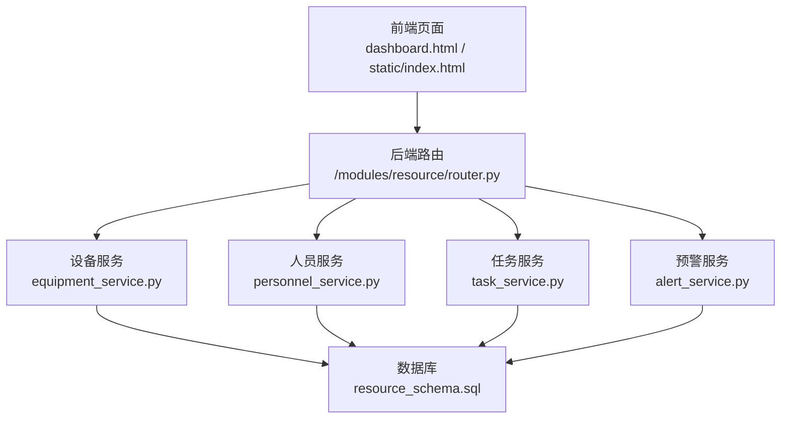
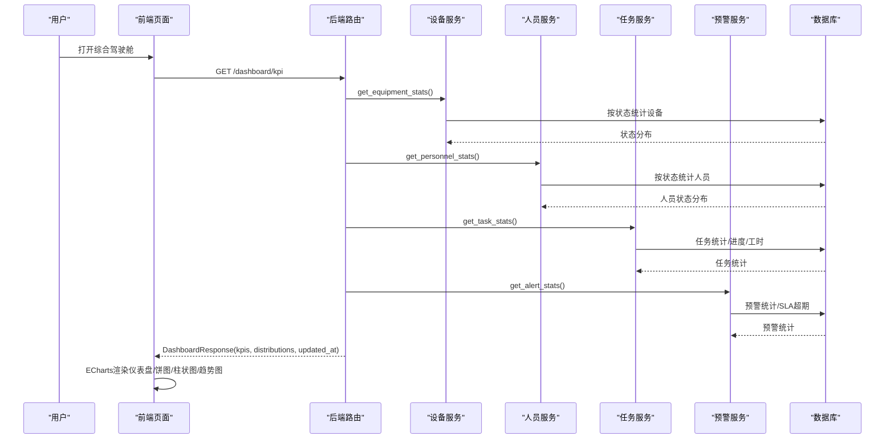
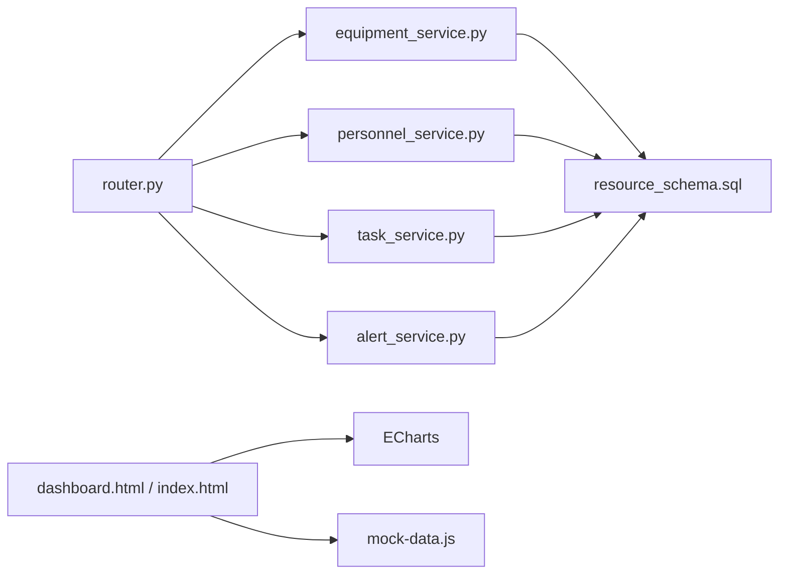

# 综合驾驶舱

<cite>
**本文引用的文件**
- [backend/modules/resource/router.py](file://backend/modules/resource/router.py)
- [backend/modules/resource/services/equipment_service.py](file://backend/modules/resource/services/equipment_service.py)
- [backend/modules/resource/services/personnel_service.py](file://backend/modules/resource/services/personnel_service.py)
- [backend/modules/resource/services/task_service.py](file://backend/modules/resource/services/task_service.py)
- [backend/modules/resource/services/alert_service.py](file://backend/modules/resource/services/alert_service.py)
- [backend/modules/resource/schemas.py](file://backend/modules/resource/schemas.py)
- [backend/sql/resource_schema.sql](file://backend/sql/resource_schema.sql)
- [demo/dashboard.html](file://demo/dashboard.html)
- [demo/assets/css/theme.css](file://demo/assets/css/theme.css)
- [demo/assets/js/app.js](file://demo/assets/js/app.js)
- [demo/assets/js/mock-data.js](file://demo/assets/js/mock-data.js)
- [static/index.html](file://static/index.html)
</cite>

## 更新摘要
**所做更改**
- 更新了用户界面布局部分，反映三列布局对齐改进、列高度一致性和任务列表及告警组件的样式优化
- 添加了关于垂直对齐和最小高度属性的说明
- 增强了可视化展示方式的描述，包括改进的UI组件样式

## 目录
1. [简介](#简介)
2. [项目结构](#项目结构)
3. [核心组件](#核心组件)
4. [架构总览](#架构总览)
5. [详细组件分析](#详细组件分析)
6. [依赖关系分析](#依赖关系分析)
7. [性能与大数据渲染](#性能与大数据渲染)
8. [故障排查指南](#故障排查指南)
9. [结论](#结论)
10. [附录：配置与自定义指标](#附录：配置与自定义指标)

## 简介
本模块为"试制资源数智化管理系统"的综合驾驶舱，提供全局KPI监控、设备状态分布、车间实时布局、异常告警中心展示等能力。文档聚焦以下目标：
- 明确各统计指标的计算逻辑与数据来源（设备利用率、人员效率、任务完成率等）
- 说明实时数据更新机制与可视化实现（仪表盘、趋势图、热力图等）
- 描述权限控制与多维度筛选（区域、时间范围、设备类型等）
- 给出配置示例与自定义指标方法
- 提出性能优化策略与大数据量下的渲染方案

## 项目结构
驾驶舱由后端服务层与前端页面组成：
- 后端：基于FastAPI的REST接口，聚合设备、人员、任务、预警等多域服务，输出驾驶舱KPI与图表数据
- 前端：演示页dashboard.html使用ECharts进行图表渲染；静态入口static/index.html包含另一套驾驶舱页面；mock数据用于离线演示

**图示来源**
- [backend/modules/resource/router.py:1422-1453](file://backend/modules/resource/router.py#L1422-L1453)
- [backend/modules/resource/services/equipment_service.py:304-335](file://backend/modules/resource/services/equipment_service.py#L304-L335)
- [backend/modules/resource/services/personnel_service.py:325-379](file://backend/modules/resource/services/personnel_service.py#L325-L379)
- [backend/modules/resource/services/task_service.py:290-332](file://backend/modules/resource/services/task_service.py#L290-L332)
- [backend/modules/resource/services/alert_service.py:337-399](file://backend/modules/resource/services/alert_service.py#L337-L399)
- [backend/sql/resource_schema.sql:13-326](file://backend/sql/resource_schema.sql#L13-L326)

**章节来源**
- [backend/modules/resource/router.py:1422-1453](file://backend/modules/resource/router.py#L1422-L1453)
- [backend/sql/resource_schema.sql:13-326](file://backend/sql/resource_schema.sql#L13-L326)

## 核心组件
- 设备服务：提供设备列表、状态统计、维护记录等能力，支撑设备利用率、状态分布等指标
- 人员服务：提供人员列表、在岗统计、来源分布等能力，支撑人员效率、在岗人数等指标
- 任务服务：提供任务列表、进度计算、月度趋势等能力，支撑任务完成率、计划/实际工时等指标
- 预警服务：提供预警CRUD、SLA超期判断、统计汇总等能力，支撑异常告警中心
- 路由与Schema：统一对外暴露驾驶舱KPI接口，定义返回结构

关键职责与交互：
- 路由层聚合多服务数据，组装DashboardResponse
- 服务层通过SQL查询聚合统计数据，必要时做格式化与转换
- 前端通过ECharts渲染图表，支持区域、状态、时间等筛选

**章节来源**
- [backend/modules/resource/schemas.py:204-223](file://backend/modules/resource/schemas.py#L204-L223)
- [backend/modules/resource/router.py:1422-1453](file://backend/modules/resource/router.py#L1422-L1453)

## 架构总览
驾驶舱的数据流从前端发起请求到后端聚合服务，再回写到前端图表。

**图示来源**
- [backend/modules/resource/router.py:1422-1453](file://backend/modules/resource/router.py#L1422-L1453)
- [backend/modules/resource/services/equipment_service.py:304-335](file://backend/modules/resource/services/equipment_service.py#L304-L335)
- [backend/modules/resource/services/personnel_service.py:325-379](file://backend/modules/resource/services/personnel_service.py#L325-L379)
- [backend/modules/resource/services/task_service.py:290-332](file://backend/modules/resource/services/task_service.py#L290-L332)
- [backend/modules/resource/services/alert_service.py:337-399](file://backend/modules/resource/services/alert_service.py#L337-L399)

## 详细组件分析

### 全局KPI监控
- 设备KPI：设备总数、占用、空闲、故障、维护中数量，来源于设备表的状态分组统计
- 人员KPI：总人数、在岗（working+idle）、离线人数，来源于人员表的状态分组统计
- 任务KPI：进行中、待开始、已完成、逾期数量，以及计划/实际工时、平均进度
- 预警KPI：未处理、处理中、已解决、已关闭、超期数量，严重级别分布

计算逻辑与数据来源：
- 设备利用率：可通过设备占用时长/可用时长或任务实际工时/计划工时推导；当前服务层提供状态分布与工时统计，可组合计算
- 人员效率：结合人员状态、今日工时、完成任务数、返工率等维度；服务层提供在岗统计与来源分布
- 任务完成率：completed/(pending+in_progress+completed+overdue) 或 progress均值；服务层提供状态分布与进度统计

可视化呈现：
- KPI卡片：数字+单位+趋势标签
- 设备状态分布：环形/饼图
- 任务类型统计：柱状图
- 预警级别分布：柱状图

**章节来源**
- [backend/modules/resource/services/equipment_service.py:304-335](file://backend/modules/resource/services/equipment_service.py#L304-L335)
- [backend/modules/resource/services/personnel_service.py:325-379](file://backend/modules/resource/services/personnel_service.py#L325-L379)
- [backend/modules/resource/services/task_service.py:290-332](file://backend/modules/resource/services/task_service.py#L290-L332)
- [backend/modules/resource/services/alert_service.py:337-399](file://backend/modules/resource/services/alert_service.py#L337-L399)
- [backend/modules/resource/schemas.py:204-223](file://backend/modules/resource/schemas.py#L204-L223)

### 设备状态分布
- 数据来源：设备表按status分组计数
- 展示方式：饼图/环形图，颜色区分运行中、空闲、故障、维护中、离线等
- 筛选能力：支持按区域、设备类型、状态筛选

实现要点：
- 后端服务层直接GROUP BY status并返回分布
- 前端ECharts配置pie系列，设置tooltip、legend、label等

**章节来源**
- [backend/modules/resource/services/equipment_service.py:304-335](file://backend/modules/resource/services/equipment_service.py#L304-L335)
- [demo/dashboard.html:510-554](file://demo/dashboard.html#L510-L554)

### 车间实时布局
- 数据来源：区域表zones与设备表equipment，关联zone_code获取区域名称与设备状态
- 展示方式：网格布局显示各区域设备相对位置，设备以颜色标识状态
- 交互能力：编辑模式拖拽调整区域顺序，保存至本地存储；支持列数配置

实现要点：
- 后端服务层提供设备列表与状态分布
- 前端根据区域过滤设备，生成zone-card与device-cell，支持拖拽排序与网格列数设置

**章节来源**
- [backend/sql/resource_schema.sql:33-45](file://backend/sql/resource_schema.sql#L33-L45)
- [backend/sql/resource_schema.sql:13-28](file://backend/sql/resource_schema.sql#L13-L28)
- [demo/dashboard.html:652-709](file://demo/dashboard.html#L652-L709)

### 异常告警中心
- 数据来源：alerts表，含级别、类型、状态、SLA、处理人、区域等字段
- 展示方式：列表+筛选（级别、状态、来源、区域、时间范围），支持批量操作与升级
- SLA机制：根据raised_at与sla_hours计算剩余时间与是否超期

实现要点：
- 服务层提供get_alert_list与get_alert_stats，支持复杂条件过滤与分页
- 前端提供tab切换与筛选控件，渲染告警条目与统计图表

**章节来源**
- [backend/modules/resource/services/alert_service.py:47-140](file://backend/modules/resource/services/alert_service.py#L47-L140)
- [backend/modules/resource/services/alert_service.py:337-399](file://backend/modules/resource/services/alert_service.py#L337-L399)
- [backend/sql/resource_schema.sql:114-163](file://backend/sql/resource_schema.sql#L114-L163)

### 实时数据更新机制
- 前端定时刷新：dashboard.html通过定时器或事件触发重新加载KPI与图表
- 后端缓存建议：对高频访问的统计接口可增加短期缓存（如Redis）以减少数据库压力
- WebSocket/轮询：如需秒级实时更新，可引入WebSocket推送或短轮询

实现参考：
- dashboard.html内置时钟与同步按钮，便于手动刷新
- 服务层接口设计为幂等GET，适合轮询

**章节来源**
- [demo/dashboard.html:178-189](file://demo/dashboard.html#L178-L189)
- [demo/dashboard.html:365-376](file://demo/dashboard.html#L365-L376)

### 可视化展示方式
- 仪表盘：KPI卡片展示关键数字与趋势
- 趋势图：任务月度趋势、预警近7天新增趋势
- 热力图：可按区域×设备类型展示占用密度（可扩展）
- 图表库：ECharts，支持饼图、柱状图、折线图、热力图等

**更新** 用户界面布局得到显著改进，包括：
- 三列布局对齐优化：使用CSS Grid实现更好的列对齐效果
- 列高度一致性：通过align-items: stretch和min-height属性确保内容垂直对齐
- 任务列表样式增强：改进了任务项的视觉层次和交互体验
- 告警组件优化：提升了告警信息的可读性和操作便捷性

实现参考：
- dashboard.html初始化多个ECharts实例，配置series、tooltip、legend等
- 静态页面static/index.html也包含驾驶舱UI与筛选控件
- theme.css提供了统一的样式变量和组件样式

**章节来源**
- [demo/dashboard.html:510-650](file://demo/dashboard.html#L510-L650)
- [static/index.html:2850-3007](file://static/index.html#L2850-L3007)
- [demo/assets/css/theme.css:637-702](file://demo/assets/css/theme.css#L637-L702)

### 权限控制与数据过滤
- 权限控制：当前代码未实现RBAC鉴权，可在路由层增加中间件校验用户角色与数据可见性
- 数据过滤：
  - 区域：zone_code筛选
  - 时间范围：raised_start/raised_end（预警）、plan_start_time/plan_end_time（任务）
  - 设备类型：equipment_type筛选
  - 状态：status筛选（设备/人员/任务/预警）
  - 关键词：keyword模糊搜索

实现参考：
- 服务层均支持多条件WHERE拼接与分页
- 前端提供筛选控件与动态重渲染

**章节来源**
- [backend/modules/resource/services/equipment_service.py:11-103](file://backend/modules/resource/services/equipment_service.py#L11-L103)
- [backend/modules/resource/services/personnel_service.py:24-124](file://backend/modules/resource/services/personnel_service.py#L24-L124)
- [backend/modules/resource/services/task_service.py:48-146](file://backend/modules/resource/services/task_service.py#L48-L146)
- [backend/modules/resource/services/alert_service.py:47-140](file://backend/modules/resource/services/alert_service.py#L47-L140)
- [static/index.html:2978-3007](file://static/index.html#L2978-L3007)

## 依赖关系分析
- 路由依赖服务层：router调用equipment_service、personnel_service、task_service、alert_service
- 服务层依赖数据库：所有服务通过SQL查询聚合数据
- 前端依赖ECharts：dashboard.html与static/index.html使用ECharts渲染图表
- Mock数据：demo/assets/js/mock-data.js提供离线演示数据

**图示来源**
- [backend/modules/resource/router.py:1422-1453](file://backend/modules/resource/router.py#L1422-L1453)
- [backend/modules/resource/services/equipment_service.py:304-335](file://backend/modules/resource/services/equipment_service.py#L304-L335)
- [backend/modules/resource/services/personnel_service.py:325-379](file://backend/modules/resource/services/personnel_service.py#L325-L379)
- [backend/modules/resource/services/task_service.py:290-332](file://backend/modules/resource/services/task_service.py#L290-L332)
- [backend/modules/resource/services/alert_service.py:337-399](file://backend/modules/resource/services/alert_service.py#L337-L399)
- [backend/sql/resource_schema.sql:13-326](file://backend/sql/resource_schema.sql#L13-L326)
- [demo/dashboard.html:510-650](file://demo/dashboard.html#L510-L650)
- [demo/assets/js/mock-data.js:1-200](file://demo/assets/js/mock-data.js#L1-L200)

**章节来源**
- [backend/modules/resource/router.py:1422-1453](file://backend/modules/resource/router.py#L1422-L1453)
- [backend/sql/resource_schema.sql:13-326](file://backend/sql/resource_schema.sql#L13-L326)

## 性能与大数据渲染
- 数据库层优化：
  - 使用索引：status、zone_code、equipment_type、priority、raised_at等字段已建索引
  - 分页查询：所有列表接口支持page/page_size，避免一次性拉取大量数据
  - 聚合查询：GROUP BY与COALESCE减少前端计算开销
- 服务层优化：
  - 合并查询：尽量在一次请求中聚合多域数据，减少往返次数
  - 缓存策略：对热点KPI接口增加短期缓存（如5-10分钟）
- 前端渲染优化：
  - 按需渲染：仅渲染可视区域内的图表与列表项
  - 虚拟滚动：长列表使用虚拟滚动提升性能
  - 图表增量更新：使用setOption增量更新而非全量重绘
  - **更新** 布局优化：通过CSS Grid和Flexbox实现更高效的布局渲染，减少重排重绘
- 大数据场景：
  - 热力图：按区域×设备类型聚合后渲染，避免逐点绘制
  - 趋势图：按月/周聚合，减少点数量
  - 导出功能：支持CSV/Excel导出，减轻前端压力

[本节为通用性能建议，不直接引用具体文件]

## 故障排查指南
- 接口报错：检查路由层异常捕获与HTTPException状态码
- 数据为空：确认数据库表结构与索引是否正确初始化
- 图表不显示：检查ECharts容器尺寸与初始化时机
- 筛选无效：验证前端参数传递与服务层WHERE条件拼接
- **更新** UI布局问题：检查CSS Grid布局属性和Flexbox对齐方式

常见定位步骤：
- 查看后端日志：logger记录关键操作与异常
- 检查SQL执行：在数据库客户端执行对应查询验证结果
- 前端调试：浏览器开发者工具查看网络请求与响应

**章节来源**
- [backend/modules/resource/router.py:1422-1453](file://backend/modules/resource/router.py#L1422-L1453)
- [backend/logger.py](file://backend/logger.py)

## 结论
综合驾驶舱通过后端多服务聚合与前端可视化，实现了全局KPI监控、设备状态分布、车间实时布局与异常告警中心的核心能力。系统具备良好的扩展性与可配置性，支持多维度筛选与自定义指标。**更新后的用户界面布局改进**进一步提升了用户体验，包括更好的三列布局对齐、列高度一致性和优化的任务列表及告警组件样式。建议在后续迭代中增强权限控制、引入缓存与WebSocket以提升实时性与性能。

[本节为总结性内容，不直接引用具体文件]

## 附录：配置与自定义指标
- 配置示例：
  - 区域筛选：在dashboard.html侧边栏选择区域，或在前端传入zone_code参数
  - 时间范围：在预警筛选中选择raised_start/raised_end
  - 设备类型：在筛选控件中选择equipment_type
- 自定义指标方法：
  - 新增KPI：在服务层添加聚合SQL，并在路由层返回DashboardResponse
  - 新图表：在前端新增ECharts实例，配置series与数据源
  - 新筛选：在服务层WHERE条件中添加新字段，前端增加控件与事件
  - **更新** 布局定制：通过修改CSS Grid模板和Flexbox属性来自定义界面布局

实施参考：
- 路由层新增接口或扩展现有接口
- 服务层新增统计函数与SQL
- 前端新增图表与筛选逻辑
- **更新** 样式定制：利用theme.css中的CSS变量和组件类进行样式调整

**章节来源**
- [backend/modules/resource/router.py:1422-1453](file://backend/modules/resource/router.py#L1422-L1453)
- [backend/modules/resource/services/equipment_service.py:304-335](file://backend/modules/resource/services/equipment_service.py#L304-L335)
- [backend/modules/resource/services/personnel_service.py:325-379](file://backend/modules/resource/services/personnel_service.py#L325-L379)
- [backend/modules/resource/services/task_service.py:290-332](file://backend/modules/resource/services/task_service.py#L290-L332)
- [backend/modules/resource/services/alert_service.py:337-399](file://backend/modules/resource/services/alert_service.py#L337-L399)
- [demo/dashboard.html:510-650](file://demo/dashboard.html#L510-L650)
- [static/index.html:2978-3007](file://static/index.html#L2978-L3007)
- [demo/assets/css/theme.css:637-702](file://demo/assets/css/theme.css#L637-L702)