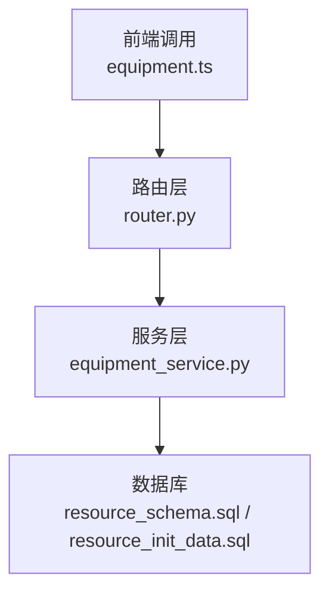
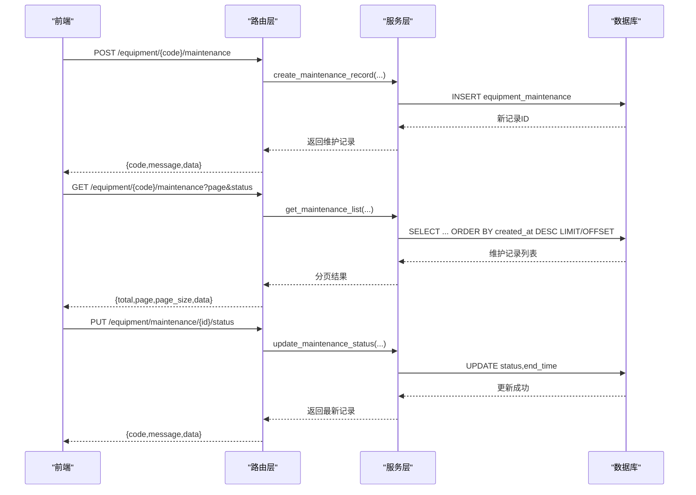
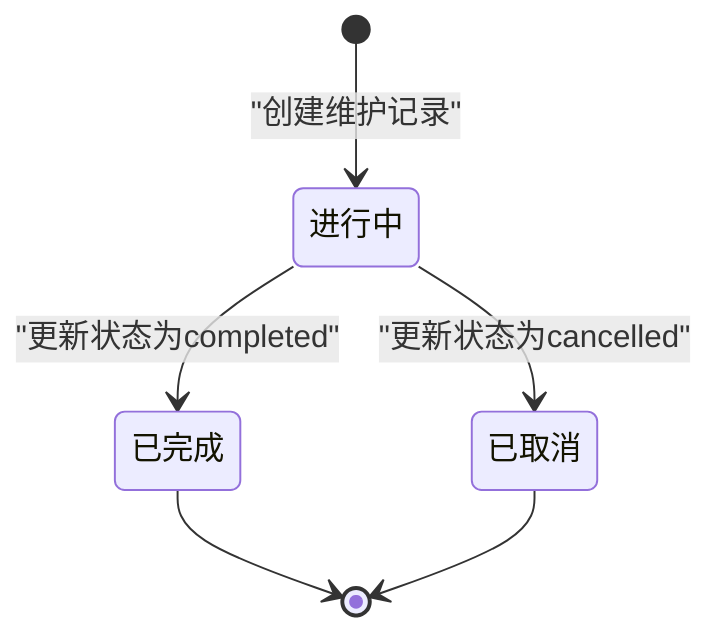
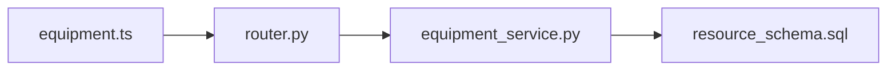

# 维护记录管理

<cite>
**本文引用的文件**
- [resource_schema.sql](file://backend/sql/resource_schema.sql)
- [resource_init_data.sql](file://backend/sql/resource_init_data.sql)
- [router.py](file://backend/modules/resource/router.py)
- [equipment_service.py](file://backend/modules/resource/services/equipment_service.py)
- [equipment.ts](file://webui_ref/client/src/api/resource/equipment.ts)
</cite>

## 目录
1. [简介](#简介)
2. [项目结构](#项目结构)
3. [核心组件](#核心组件)
4. [架构总览](#架构总览)
5. [详细组件分析](#详细组件分析)
6. [依赖关系分析](#依赖关系分析)
7. [性能考虑](#性能考虑)
8. [故障排查指南](#故障排查指南)
9. [结论](#结论)
10. [附录：API 规范与数据模型](#附录api-规范与数据模型)

## 简介
本文件围绕“设备维护记录管理”功能，系统化说明从创建维护工单到完成维护的完整生命周期、数据模型、状态流转、与设备的关联关系，以及现有 API 接口。同时给出维护计划生成、维护提醒与维护效果评估的实现建议，帮助读者在现有代码基础上扩展高级能力。

## 项目结构
维护记录相关能力主要分布在以下位置：
- 数据库表定义与初始化数据：backend/sql/resource_schema.sql、backend/sql/resource_init_data.sql
- 路由层（HTTP 接口）：backend/modules/resource/router.py
- 服务层（业务逻辑）：backend/modules/resource/services/equipment_service.py
- 前端类型与调用封装：webui_ref/client/src/api/resource/equipment.ts

图表来源
- [router.py:221-302](file://backend/modules/resource/router.py#L221-L302)
- [equipment_service.py:338-494](file://backend/modules/resource/services/equipment_service.py#L338-L494)
- [resource_schema.sql:183-199](file://backend/sql/resource_schema.sql#L183-L199)

章节来源
- [resource_schema.sql:183-199](file://backend/sql/resource_schema.sql#L183-L199)
- [resource_init_data.sql:119-126](file://backend/sql/resource_init_data.sql#L119-L126)
- [router.py:221-302](file://backend/modules/resource/router.py#L221-L302)
- [equipment_service.py:338-494](file://backend/modules/resource/services/equipment_service.py#L338-L494)
- [equipment.ts:70-105](file://webui_ref/client/src/api/resource/equipment.ts#L70-L105)

## 核心组件
- 数据模型：设备维护记录表 equipment_maintenance，包含维护类型、时间、人员、描述、状态等字段，并建立索引优化查询。
- 路由接口：提供按设备查询维护记录列表、新增维护记录、更新维护记录状态三个接口。
- 服务逻辑：负责参数校验、SQL 构建、分页、时间格式化、状态更新时的结束时间处理等。
- 前端契约：定义了维护记录的数据结构与请求/响应类型，便于前后端协作。

章节来源
- [resource_schema.sql:183-199](file://backend/sql/resource_schema.sql#L183-L199)
- [router.py:221-302](file://backend/modules/resource/router.py#L221-L302)
- [equipment_service.py:338-494](file://backend/modules/resource/services/equipment_service.py#L338-L494)
- [equipment.ts:70-105](file://webui_ref/client/src/api/resource/equipment.ts#L70-L105)

## 架构总览
维护记录的端到端流程如下：
- 前端通过 equipment.ts 中的函数发起请求
- 路由层接收请求并进行参数校验与转换
- 服务层执行具体业务逻辑（创建、查询、状态更新）
- 数据库持久化维护记录，并通过索引加速查询

图表来源
- [router.py:221-302](file://backend/modules/resource/router.py#L221-L302)
- [equipment_service.py:338-494](file://backend/modules/resource/services/equipment_service.py#L338-L494)
- [resource_schema.sql:183-199](file://backend/sql/resource_schema.sql#L183-L199)

## 详细组件分析

### 数据模型：设备维护记录表
- 主键：id（自增）
- 关联：equipment_code（设备编号，用于关联设备台账）
- 维护类型：maintenance_type（routine 例行 / repair 维修 / inspection 巡检）
- 时间：start_time（必填）、end_time（可选）
- 人员：operator（可选）
- 描述：description（可选）
- 状态：status（in_progress / completed / cancelled），默认 in_progress
- 审计：created_at（自动）
- 索引：equipment_code、maintenance_type、status，提升筛选与统计效率

章节来源
- [resource_schema.sql:183-199](file://backend/sql/resource_schema.sql#L183-L199)

### 状态管理与流转
- 初始状态：创建时默认为 in_progress
- 完成：将 status 更新为 completed；若未传入 end_time，服务层会自动使用当前时间作为结束时间
- 取消：将 status 更新为 cancelled
- 进行中：保持或恢复为 in_progress（如需要）

图表来源
- [equipment_service.py:442-494](file://backend/modules/resource/services/equipment_service.py#L442-L494)

章节来源
- [equipment_service.py:442-494](file://backend/modules/resource/services/equipment_service.py#L442-L494)

### 与设备的关联关系
- 维护记录通过 equipment_code 与设备台账关联
- 删除设备时会级联删除该设备的所有维护记录，保证数据一致性
- 可通过设备编号查询其全部维护历史，支持按状态筛选与分页

章节来源
- [equipment_service.py:240-259](file://backend/modules/resource/services/equipment_service.py#L240-L259)
- [equipment_service.py:338-393](file://backend/modules/resource/services/equipment_service.py#L338-L393)

### 维护历史记录查询
- 支持按设备编号查询维护记录列表
- 支持按状态筛选
- 支持分页（page、page_size）
- 返回 total、page、page_size、data（记录数组）

章节来源
- [router.py:221-245](file://backend/modules/resource/router.py#L221-L245)
- [equipment_service.py:338-393](file://backend/modules/resource/services/equipment_service.py#L338-L393)

### 维护记录创建
- 入参：maintenance_type、start_time、end_time（可选）、operator（可选）、description（可选）、status（可选，默认 in_progress）
- 校验：设备必须存在
- 输出：返回新建的维护记录（时间字段统一格式化为字符串）

章节来源
- [router.py:248-273](file://backend/modules/resource/router.py#L248-L273)
- [equipment_service.py:396-439](file://backend/modules/resource/services/equipment_service.py#L396-L439)

### 维护记录状态更新
- 入参：status（in_progress/completed/cancelled）、end_time（可选）
- 规则：当状态为 completed 且未提供 end_time 时，自动填充当前时间
- 输出：返回更新后的维护记录

章节来源
- [router.py:276-302](file://backend/modules/resource/router.py#L276-L302)
- [equipment_service.py:442-494](file://backend/modules/resource/services/equipment_service.py#L442-L494)

### 维护统计分析（现状与建议）
- 现状：系统提供了设备统计数据接口（按设备状态统计），但未直接暴露维护维度的统计接口
- 建议：在服务层新增维护维度统计方法，基于 equipment_maintenance 表按 maintenance_type、status、时间段聚合，计算维护次数、平均时长、完成率等指标，并在路由层暴露对应接口

章节来源
- [equipment_service.py:304-335](file://backend/modules/resource/services/equipment_service.py#L304-L335)

### 维护成本计算（建议实现）
- 可结合 operator 与 start_time/end_time 计算工时，再乘以单位工时成本得到单次维护成本
- 可按设备、维护类型、时间段汇总成本，形成成本报表
- 建议在服务层增加 cost 计算函数，并在路由层暴露统计接口

[本节为通用建议，不直接分析具体文件]

### 维护计划生成与维护提醒（建议实现）
- 计划生成：基于设备台账与历史维护记录，按周期（日/周/月/年）自动生成维护任务，写入维护记录表，初始状态为 in_progress
- 维护提醒：定时任务扫描即将到期或超期的维护计划，触发提醒（站内消息/邮件/短信）
- 效果评估：对比计划与实际完成时间、维护类型分布、重复故障率等指标，评估维护策略有效性

[本节为通用建议，不直接分析具体文件]

## 依赖关系分析
- 路由层依赖服务层提供的维护记录操作方法
- 服务层依赖数据库访问函数（query_one/query_all/execute/execute_last_id）
- 数据库表通过索引优化查询性能
- 前端通过 TypeScript 类型约束前后端数据结构一致性

图表来源
- [router.py:221-302](file://backend/modules/resource/router.py#L221-L302)
- [equipment_service.py:338-494](file://backend/modules/resource/services/equipment_service.py#L338-L494)
- [resource_schema.sql:183-199](file://backend/sql/resource_schema.sql#L183-L199)
- [equipment.ts:70-105](file://webui_ref/client/src/api/resource/equipment.ts#L70-L105)

章节来源
- [router.py:221-302](file://backend/modules/resource/router.py#L221-L302)
- [equipment_service.py:338-494](file://backend/modules/resource/services/equipment_service.py#L338-L494)
- [resource_schema.sql:183-199](file://backend/sql/resource_schema.sql#L183-L199)
- [equipment.ts:70-105](file://webui_ref/client/src/api/resource/equipment.ts#L70-L105)

## 性能考虑
- 索引利用：equipment_code、maintenance_type、status 均建有索引，利于筛选与分页
- 分页查询：使用 LIMIT/OFFSET 控制返回量，避免全表扫描
- 时间格式化：在服务层统一格式化时间字段，减少前端处理开销
- 建议：对高频查询条件（如按时间段+状态）可考虑复合索引；对统计类查询可使用物化视图或预聚合表

[本节为通用指导，不直接分析具体文件]

## 故障排查指南
- 设备不存在：创建维护记录前会校验设备是否存在，若不存在将抛出错误
- 无效状态值：更新状态时仅允许 in_progress/completed/cancelled，非法值将报错
- 时间字段格式：确保 start_time/end_time 符合预期格式，否则可能导致入库失败
- 日志定位：服务层记录关键操作日志（创建、更新），便于问题追踪

章节来源
- [equipment_service.py:396-439](file://backend/modules/resource/services/equipment_service.py#L396-L439)
- [equipment_service.py:442-494](file://backend/modules/resource/services/equipment_service.py#L442-L494)

## 结论
系统已具备完整的维护记录生命周期管理能力：支持按设备创建维护记录、查询维护历史、更新维护状态，并通过数据库索引保障查询性能。在此基础上，可扩展维护统计分析、成本计算、计划生成与提醒、效果评估等高级功能，进一步提升设备运维管理的数智化水平。

[本节为总结性内容，不直接分析具体文件]

## 附录：API 规范与数据模型

### 数据模型：设备维护记录
- 字段：
  - id：自增主键
  - equipment_code：设备编号（关联设备台账）
  - maintenance_type：维护类型（routine/repair/inspection）
  - start_time：开始时间（必填）
  - end_time：结束时间（可选）
  - operator：维护人员（可选）
  - description：维护描述（可选）
  - status：状态（in_progress/completed/cancelled），默认 in_progress
  - created_at：创建时间（自动）

章节来源
- [resource_schema.sql:183-199](file://backend/sql/resource_schema.sql#L183-L199)

### 接口规范
- 获取设备维护记录列表
  - 路径：GET /equipment/{equipment_code}/maintenance
  - 查询参数：page、page_size、status（可选）
  - 返回：{ code, message, data: { total, page, page_size, data } }

- 新增设备维护记录
  - 路径：POST /equipment/{equipment_code}/maintenance
  - 请求体：maintenance_type、start_time、end_time（可选）、operator（可选）、description（可选）、status（可选）
  - 返回：{ code, message, data: MaintenanceRecord }

- 更新维护记录状态
  - 路径：PUT /equipment/maintenance/{maintenance_id}/status
  - 请求体：status、end_time（可选）
  - 返回：{ code, message, data: MaintenanceRecord }

章节来源
- [router.py:221-302](file://backend/modules/resource/router.py#L221-L302)
- [equipment.ts:70-105](file://webui_ref/client/src/api/resource/equipment.ts#L70-L105)

### 示例数据
- 初始化数据包含多条维护记录样例，覆盖不同设备、类型与状态，可用于演示与测试

章节来源
- [resource_init_data.sql:119-126](file://backend/sql/resource_init_data.sql#L119-L126)