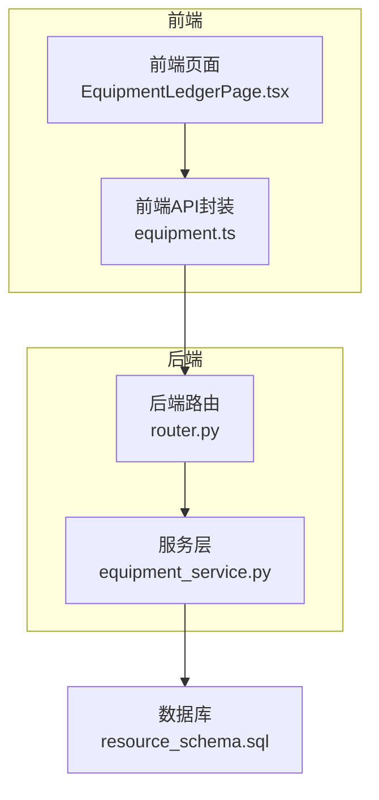
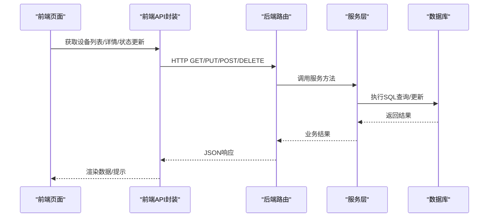
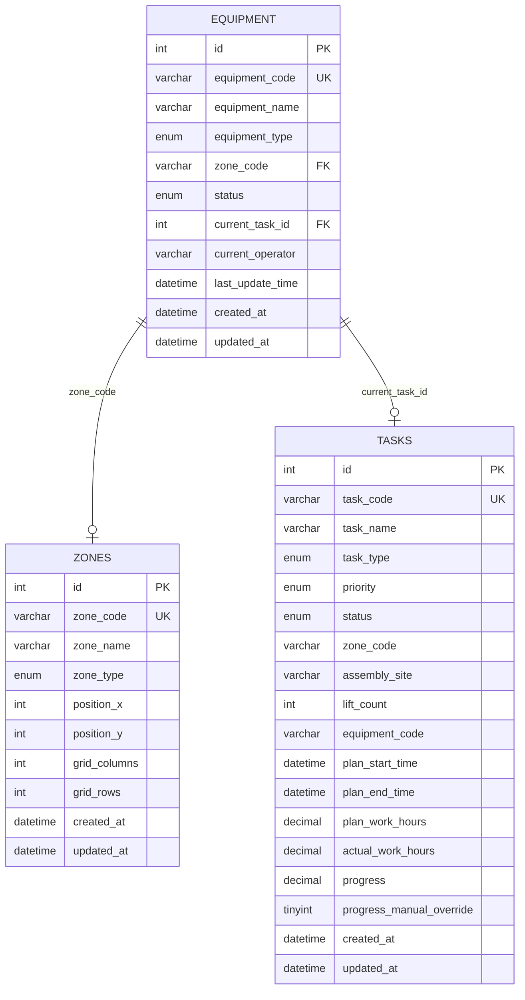
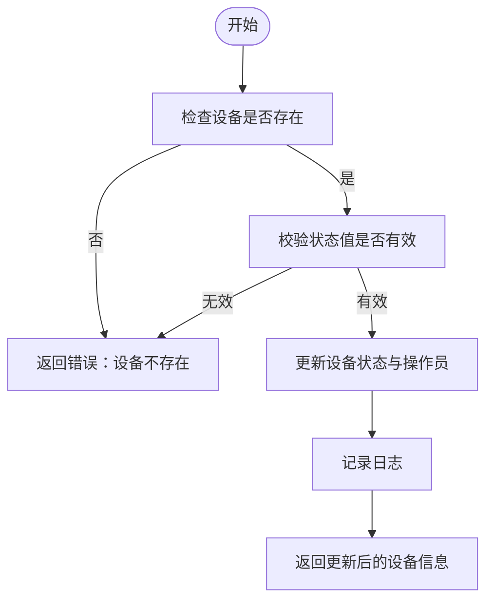
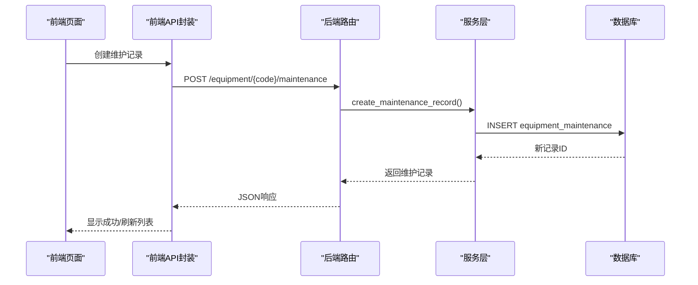
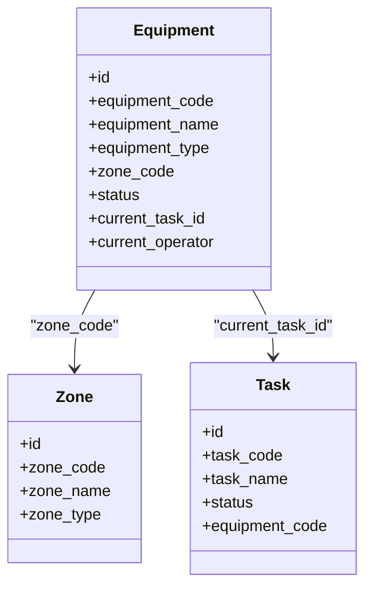
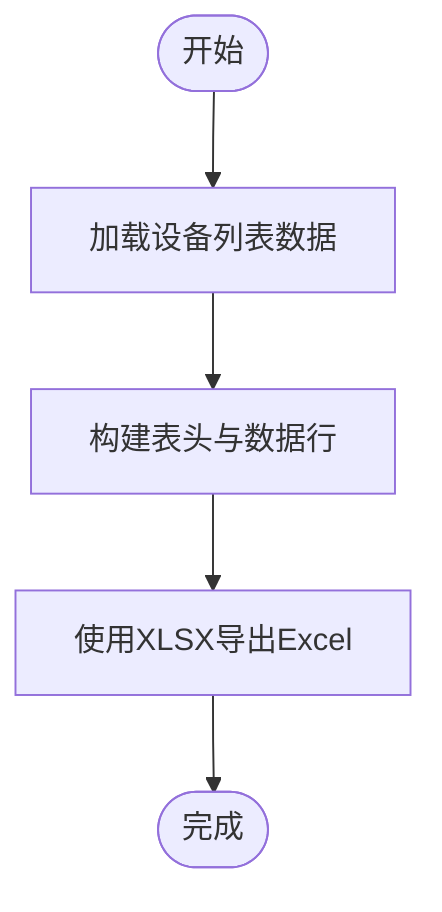
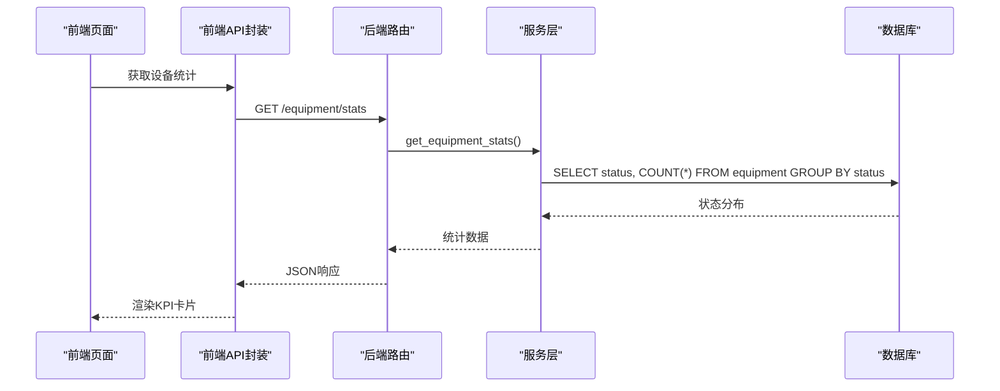
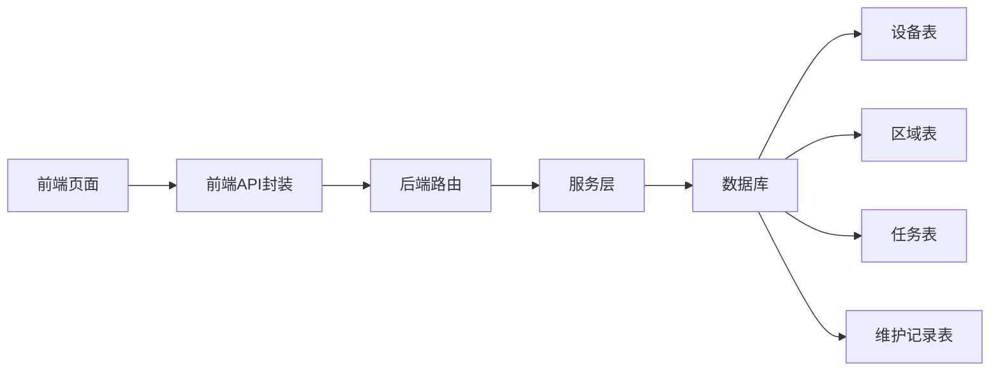

# 设备台账管理

<cite>
**本文引用的文件**
- [backend/modules/resource/services/equipment_service.py](file://backend/modules/resource/services/equipment_service.py)
- [backend/modules/resource/router.py](file://backend/modules/resource/router.py)
- [backend/modules/resource/schemas.py](file://backend/modules/resource/schemas.py)
- [backend/sql/resource_schema.sql](file://backend/sql/resource_schema.sql)
- [webui_ref/client/src/api/resource/equipment.ts](file://webui_ref/client/src/api/resource/equipment.ts)
- [webui_ref/client/src/pages/EquipmentLedgerPage/EquipmentLedgerPage.tsx](file://webui_ref/client/src/pages/EquipmentLedgerPage/EquipmentLedgerPage.tsx)
- [static/index.html](file://static/index.html)
- [需求文档_V6_试制资源数智化管理系统.md](file://需求文档_V6_试制资源数智化管理系统.md)
</cite>

## 目录
1. [简介](#简介)
2. [项目结构](#项目结构)
3. [核心组件](#核心组件)
4. [架构总览](#架构总览)
5. [详细组件分析](#详细组件分析)
6. [依赖关系分析](#依赖关系分析)
7. [性能考虑](#性能考虑)
8. [故障排查指南](#故障排查指南)
9. [结论](#结论)
10. [附录](#附录)

## 简介
本模块提供设备台账的完整生命周期管理，覆盖设备注册、信息维护、状态管理、维护记录、与区域和任务的关联，以及统计与监控能力。设备分类体系包含 lift（举升机）、island（试制岛）、station（工位），支持 idle/busy/error/maintenance 多种状态，并提供维护类型 routine/repair/inspection 的记录与跟踪。前端提供列表、筛选、分页、详情查看、状态切换与维护记录管理等功能；后端通过 FastAPI 路由与服务层实现数据访问与业务校验，数据库采用 MariaDB/MySQL 兼容引擎。

## 项目结构
围绕设备台账的核心代码分布在以下位置：
- 后端服务层：设备 CRUD、状态更新、维护记录、统计数据
- 后端路由：RESTful API 定义与参数校验
- 数据模型：Pydantic 请求/响应模型
- 数据库表结构：设备、区域、任务、维护记录等
- 前端 API 封装：TypeScript 接口与调用方法
- 前端页面：设备台账页面、导出功能、状态映射

图表来源
- [webui_ref/client/src/pages/EquipmentLedgerPage/EquipmentLedgerPage.tsx:1-200](file://webui_ref/client/src/pages/EquipmentLedgerPage/EquipmentLedgerPage.tsx#L1-L200)
- [webui_ref/client/src/api/resource/equipment.ts:1-254](file://webui_ref/client/src/api/resource/equipment.ts#L1-L254)
- [backend/modules/resource/router.py:1-300](file://backend/modules/resource/router.py#L1-L300)
- [backend/modules/resource/services/equipment_service.py:1-495](file://backend/modules/resource/services/equipment_service.py#L1-L495)
- [backend/sql/resource_schema.sql:1-326](file://backend/sql/resource_schema.sql#L1-L326)

章节来源
- [backend/modules/resource/services/equipment_service.py:1-495](file://backend/modules/resource/services/equipment_service.py#L1-L495)
- [backend/modules/resource/router.py:1-300](file://backend/modules/resource/router.py#L1-L300)
- [backend/modules/resource/schemas.py:1-224](file://backend/modules/resource/schemas.py#L1-L224)
- [backend/sql/resource_schema.sql:1-326](file://backend/sql/resource_schema.sql#L1-L326)
- [webui_ref/client/src/api/resource/equipment.ts:1-254](file://webui_ref/client/src/api/resource/equipment.ts#L1-L254)
- [webui_ref/client/src/pages/EquipmentLedgerPage/EquipmentLedgerPage.tsx:1-200](file://webui_ref/client/src/pages/EquipmentLedgerPage/EquipmentLedgerPage.tsx#L1-L200)
- [static/index.html:7368-7411](file://static/index.html#L7368-L7411)

## 核心组件
- 设备服务层：负责设备列表查询、详情获取、创建/更新/删除、状态更新、维护记录管理与统计
- 路由层：暴露 RESTful API，统一错误处理与参数校验
- 数据模型：Pydantic 模型约束请求/响应结构
- 数据库：设备、区域、任务、维护记录等表结构与索引
- 前端：设备台账页面、API 封装、枚举映射、导出功能

章节来源
- [backend/modules/resource/services/equipment_service.py:11-495](file://backend/modules/resource/services/equipment_service.py#L11-L495)
- [backend/modules/resource/router.py:17-303](file://backend/modules/resource/router.py#L17-L303)
- [backend/modules/resource/schemas.py:12-47](file://backend/modules/resource/schemas.py#L12-L47)
- [backend/sql/resource_schema.sql:13-199](file://backend/sql/resource_schema.sql#L13-L199)
- [webui_ref/client/src/api/resource/equipment.ts:8-254](file://webui_ref/client/src/api/resource/equipment.ts#L8-L254)
- [webui_ref/client/src/pages/EquipmentLedgerPage/EquipmentLedgerPage.tsx:279-300](file://webui_ref/client/src/pages/EquipmentLedgerPage/EquipmentLedgerPage.tsx#L279-L300)

## 架构总览
设备台账模块采用前后端分离架构：
- 前端通过 TypeScript API 封装调用后端 RESTful 接口
- 后端路由接收请求并委托服务层执行业务逻辑
- 服务层进行数据校验、SQL 查询与事务控制
- 数据库存储设备、区域、任务、维护记录等实体

图表来源
- [webui_ref/client/src/api/resource/equipment.ts:119-178](file://webui_ref/client/src/api/resource/equipment.ts#L119-L178)
- [backend/modules/resource/router.py:58-218](file://backend/modules/resource/router.py#L58-L218)
- [backend/modules/resource/services/equipment_service.py:11-335](file://backend/modules/resource/services/equipment_service.py#L11-L335)
- [backend/sql/resource_schema.sql:13-199](file://backend/sql/resource_schema.sql#L13-L199)

## 详细组件分析

### 设备数据模型与分类体系
- 设备分类：lift（举升机）、island（试制岛）、station（工位）
- 核心字段：设备编号、名称、类型、所属区域、状态、当前任务ID、当前操作员、时间戳
- 区域关联：设备通过 zone_code 关联区域表 zones
- 任务关联：设备通过 current_task_id 关联任务表 tasks

图表来源
- [backend/sql/resource_schema.sql:13-109](file://backend/sql/resource_schema.sql#L13-L109)

章节来源
- [backend/sql/resource_schema.sql:13-109](file://backend/sql/resource_schema.sql#L13-L109)
- [backend/modules/resource/schemas.py:12-47](file://backend/modules/resource/schemas.py#L12-L47)
- [webui_ref/client/src/api/resource/equipment.ts:8-22](file://webui_ref/client/src/api/resource/equipment.ts#L8-L22)

### 设备状态管理机制
- 支持状态：idle（空闲）、busy（占用）、error（故障）、maintenance（维护中）
- 状态更新：通过 PUT /api/resource/equipment/{equipment_code}/status 更新，可记录操作员
- 自动切换：当前未实现自动切换逻辑，需通过业务事件或定时任务触发
- 手动调整：前端提供状态切换入口，调用后端接口完成更新

图表来源
- [backend/modules/resource/services/equipment_service.py:262-301](file://backend/modules/resource/services/equipment_service.py#L262-L301)
- [backend/modules/resource/router.py:178-201](file://backend/modules/resource/router.py#L178-L201)

章节来源
- [backend/modules/resource/services/equipment_service.py:262-301](file://backend/modules/resource/services/equipment_service.py#L262-L301)
- [backend/modules/resource/router.py:178-201](file://backend/modules/resource/router.py#L178-L201)
- [webui_ref/client/src/api/resource/equipment.ts:167-170](file://webui_ref/client/src/api/resource/equipment.ts#L167-L170)

### 维护记录管理
- 维护类型：routine（例行维护）、repair（维修）、inspection（巡检）
- 维护状态：in_progress（进行中）、completed（已完成）、cancelled（已取消）
- 记录字段：设备编号、维护类型、开始/结束时间、操作员、描述、状态、创建时间
- 功能：创建维护记录、查询维护记录列表、更新维护记录状态

图表来源
- [backend/modules/resource/services/equipment_service.py:396-439](file://backend/modules/resource/services/equipment_service.py#L396-L439)
- [backend/modules/resource/router.py:248-273](file://backend/modules/resource/router.py#L248-L273)
- [webui_ref/client/src/api/resource/equipment.ts:199-205](file://webui_ref/client/src/api/resource/equipment.ts#L199-L205)

章节来源
- [backend/sql/resource_schema.sql:183-199](file://backend/sql/resource_schema.sql#L183-L199)
- [backend/modules/resource/services/equipment_service.py:338-495](file://backend/modules/resource/services/equipment_service.py#L338-L495)
- [backend/modules/resource/router.py:221-303](file://backend/modules/resource/router.py#L221-L303)
- [webui_ref/client/src/api/resource/equipment.ts:70-105](file://webui_ref/client/src/api/resource/equipment.ts#L70-L105)

### 设备与区域、任务的关联关系
- 区域关联：设备通过 zone_code 关联 zones 表，便于按区域筛选与展示
- 任务关联：设备通过 current_task_id 关联 tasks 表，反映当前占用的任务
- 可用性影响排程：设备状态为 busy/error/maintenance 时，将影响其可用性，进而影响任务分配与甘特排程

图表来源
- [backend/sql/resource_schema.sql:13-109](file://backend/sql/resource_schema.sql#L13-L109)

章节来源
- [backend/sql/resource_schema.sql:13-109](file://backend/sql/resource_schema.sql#L13-L109)
- [backend/modules/resource/services/equipment_service.py:106-137](file://backend/modules/resource/services/equipment_service.py#L106-L137)

### 设备导入导出与批量操作
- 导出：前端提供 Excel 导出功能，基于 XLSX 库生成工作簿并下载
- 导入：当前未发现后端导入接口，可通过批量创建接口实现
- 批量操作：当前未发现批量删除/更新接口，可通过循环调用单条接口实现

图表来源
- [static/index.html:7368-7382](file://static/index.html#L7368-L7382)

章节来源
- [static/index.html:7368-7411](file://static/index.html#L7368-L7411)
- [webui_ref/client/src/api/resource/equipment.ts:119-178](file://webui_ref/client/src/api/resource/equipment.ts#L119-L178)

### 状态监控与统计分析
- 设备统计：按状态统计设备数量，提供驾驶舱数据
- 前端展示：KPI卡片展示总数、空闲、占用、故障、维护中数量
- 实时更新：前端可定时刷新统计数据

图表来源
- [backend/modules/resource/services/equipment_service.py:304-335](file://backend/modules/resource/services/equipment_service.py#L304-L335)
- [backend/modules/resource/router.py:204-218](file://backend/modules/resource/router.py#L204-L218)
- [webui_ref/client/src/api/resource/equipment.ts:175-178](file://webui_ref/client/src/api/resource/equipment.ts#L175-L178)
- [webui_ref/client/src/pages/EquipmentLedgerPage/EquipmentLedgerPage.tsx:84-107](file://webui_ref/client/src/pages/EquipmentLedgerPage/EquipmentLedgerPage.tsx#L84-L107)

章节来源
- [backend/modules/resource/services/equipment_service.py:304-335](file://backend/modules/resource/services/equipment_service.py#L304-L335)
- [backend/modules/resource/router.py:204-218](file://backend/modules/resource/router.py#L204-L218)
- [webui_ref/client/src/pages/EquipmentLedgerPage/EquipmentLedgerPage.tsx:84-107](file://webui_ref/client/src/pages/EquipmentLedgerPage/EquipmentLedgerPage.tsx#L84-L107)

## 依赖关系分析
- 前端依赖：前端页面依赖 API 封装，API 封装依赖后端路由
- 后端依赖：路由依赖服务层，服务层依赖数据库
- 数据依赖：设备依赖区域与任务，维护记录依赖设备

图表来源
- [webui_ref/client/src/pages/EquipmentLedgerPage/EquipmentLedgerPage.tsx:1-200](file://webui_ref/client/src/pages/EquipmentLedgerPage/EquipmentLedgerPage.tsx#L1-L200)
- [webui_ref/client/src/api/resource/equipment.ts:1-254](file://webui_ref/client/src/api/resource/equipment.ts#L1-L254)
- [backend/modules/resource/router.py:1-300](file://backend/modules/resource/router.py#L1-L300)
- [backend/modules/resource/services/equipment_service.py:1-495](file://backend/modules/resource/services/equipment_service.py#L1-L495)
- [backend/sql/resource_schema.sql:13-199](file://backend/sql/resource_schema.sql#L13-L199)

章节来源
- [backend/modules/resource/router.py:1-300](file://backend/modules/resource/router.py#L1-L300)
- [backend/modules/resource/services/equipment_service.py:1-495](file://backend/modules/resource/services/equipment_service.py#L1-L495)
- [backend/sql/resource_schema.sql:13-199](file://backend/sql/resource_schema.sql#L13-L199)

## 性能考虑
- 索引优化：设备表对 status、zone_code、equipment_type 建立索引，提升筛选与查询效率
- 分页查询：设备列表与维护记录均支持分页，减少单次数据传输量
- 连接查询：设备详情与列表通过 LEFT JOIN 关联区域与任务，避免多次查询
- 日志记录：关键操作记录日志，便于问题追踪与性能分析

章节来源
- [backend/sql/resource_schema.sql:13-28](file://backend/sql/resource_schema.sql#L13-L28)
- [backend/modules/resource/services/equipment_service.py:55-103](file://backend/modules/resource/services/equipment_service.py#L55-L103)
- [backend/modules/resource/services/equipment_service.py:365-393](file://backend/modules/resource/services/equipment_service.py#L365-L393)

## 故障排查指南
- 设备不存在：更新或删除设备时若设备不存在，抛出 ValueError 并返回 400 错误
- 状态无效：更新设备状态时若状态值不在允许范围内，抛出 ValueError 并返回 400 错误
- 区域不存在：创建设备或更新区域时若区域编码不存在，抛出 ValueError 并返回 400 错误
- 维护记录不存在：更新维护记录状态时若记录不存在，抛出 ValueError 并返回 400 错误

章节来源
- [backend/modules/resource/services/equipment_service.py:150-160](file://backend/modules/resource/services/equipment_service.py#L150-L160)
- [backend/modules/resource/services/equipment_service.py:192-196](file://backend/modules/resource/services/equipment_service.py#L192-L196)
- [backend/modules/resource/services/equipment_service.py:241-245](file://backend/modules/resource/services/equipment_service.py#L241-L245)
- [backend/modules/resource/services/equipment_service.py:274-282](file://backend/modules/resource/services/equipment_service.py#L274-L282)
- [backend/modules/resource/services/equipment_service.py:454-463](file://backend/modules/resource/services/equipment_service.py#L454-L463)

## 结论
设备台账模块提供了完整的设备生命周期管理能力，涵盖设备注册、信息维护、状态管理、维护记录、与区域和任务的关联，以及统计与监控。通过清晰的数据模型、规范的 API 接口与友好的前端交互，实现了设备管理的数字化与可视化。未来可扩展自动状态切换、批量操作、高级筛选与报表导出等功能，进一步提升管理效率。

## 附录

### API 接口规范
- 设备列表：GET /api/resource/equipment?page=1&page_size=20&status=idle&zone_code=SZC&equipment_type=lift&keyword=
- 设备详情：GET /api/resource/equipment/{equipment_code}
- 创建设备：POST /api/resource/equipment
- 更新设备：PUT /api/resource/equipment/{equipment_code}
- 删除设备：DELETE /api/resource/equipment/{equipment_code}
- 更新状态：PUT /api/resource/equipment/{equipment_code}/status
- 设备统计：GET /api/resource/equipment/stats
- 维护记录列表：GET /api/resource/equipment/{equipment_code}/maintenance?page=1&page_size=20&status=in_progress
- 创建维护记录：POST /api/resource/equipment/{equipment_code}/maintenance
- 更新维护状态：PUT /api/resource/equipment/maintenance/{maintenance_id}/status

章节来源
- [backend/modules/resource/router.py:58-303](file://backend/modules/resource/router.py#L58-L303)
- [webui_ref/client/src/api/resource/equipment.ts:119-216](file://webui_ref/client/src/api/resource/equipment.ts#L119-L216)

### 前端交互流程
- 列表加载：前端调用 getEquipmentList，渲染表格与分页
- 详情查看：点击设备行弹出详情对话框，展示设备信息与状态
- 状态切换：选择状态后调用 updateEquipmentStatus，更新后刷新列表
- 维护记录：在设备详情页查看维护记录，支持创建与状态更新

章节来源
- [webui_ref/client/src/pages/EquipmentLedgerPage/EquipmentLedgerPage.tsx:279-300](file://webui_ref/client/src/pages/EquipmentLedgerPage/EquipmentLedgerPage.tsx#L279-L300)
- [webui_ref/client/src/api/resource/equipment.ts:119-216](file://webui_ref/client/src/api/resource/equipment.ts#L119-L216)