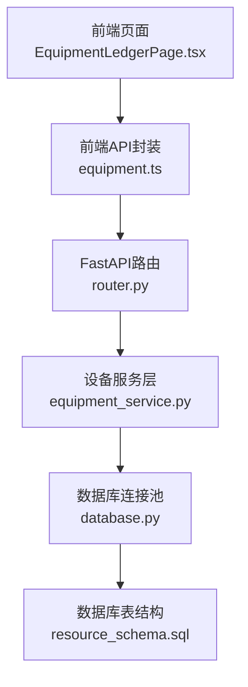
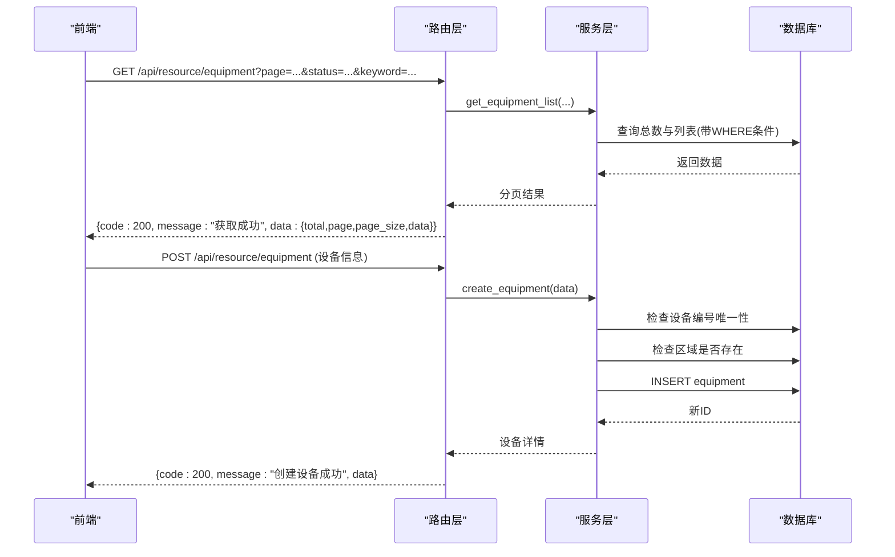
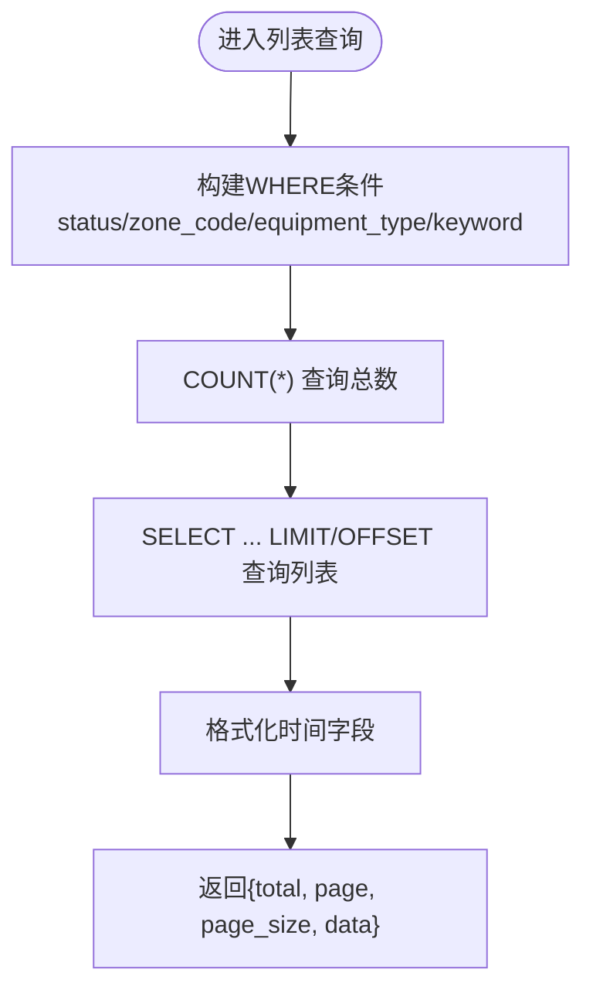
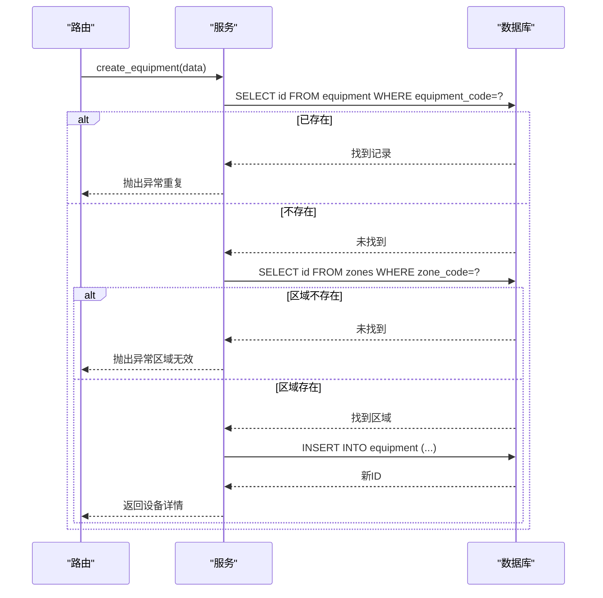
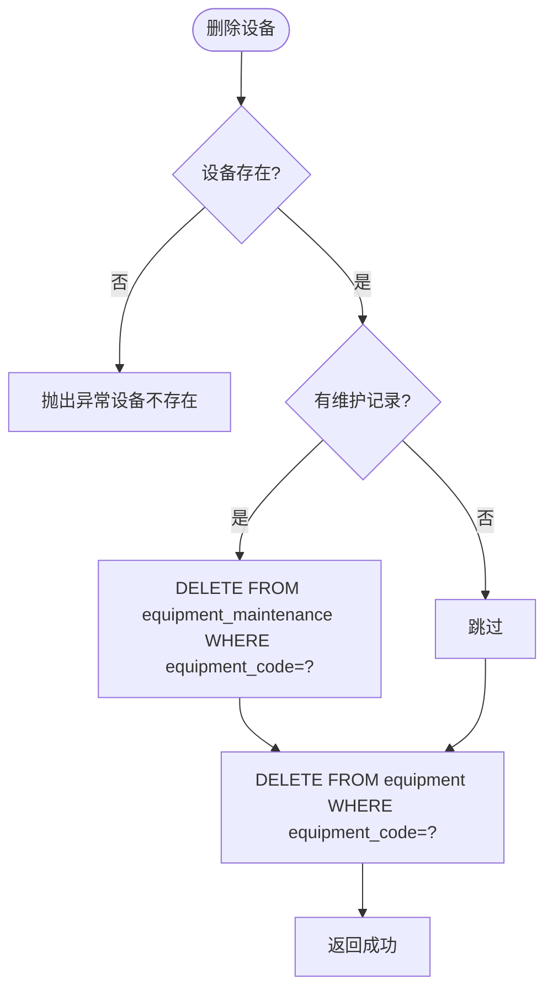

# 设备基础管理

<cite>
**本文引用的文件**
- [backend/modules/resource/services/equipment_service.py](file://backend/modules/resource/services/equipment_service.py)
- [backend/modules/resource/router.py](file://backend/modules/resource/router.py)
- [backend/modules/resource/schemas.py](file://backend/modules/resource/schemas.py)
- [backend/sql/resource_schema.sql](file://backend/sql/resource_schema.sql)
- [backend/database.py](file://backend/database.py)
- [webui_ref/client/src/api/resource/equipment.ts](file://webui_ref/client/src/api/resource/equipment.ts)
- [webui_ref/client/src/pages/EquipmentLedgerPage/EquipmentLedgerPage.tsx](file://webui_ref/client/src/pages/EquipmentLedgerPage/EquipmentLedgerPage.tsx)
</cite>

## 目录
1. [简介](#简介)
2. [项目结构](#项目结构)
3. [核心组件](#核心组件)
4. [架构总览](#架构总览)
5. [详细组件分析](#详细组件分析)
6. [依赖关系分析](#依赖关系分析)
7. [性能考虑](#性能考虑)
8. [故障排查指南](#故障排查指南)
9. [结论](#结论)
10. [附录：API 接口规范与使用示例](#附录api-接口规范与使用示例)

## 简介
本文件面向“设备基础管理”功能，覆盖设备的完整 CRUD、数据模型设计、分类体系、列表查询（筛选/分页/搜索）、以及维护记录关联。文档基于后端服务层、路由、数据库表结构与前端 API 封装进行系统化说明，帮助读者快速理解并正确使用设备管理能力。

## 项目结构
设备基础管理位于资源模块下，采用分层组织：
- 路由层：定义 HTTP 接口，参数校验与异常处理
- 服务层：实现业务逻辑（CRUD、状态更新、维护记录、统计）
- 数据层：通过数据库连接池执行 SQL
- 数据模型：Pydantic 模型约束请求/响应结构
- 数据库：MySQL/MariaDB 表结构定义
- 前端：页面与 API 封装，提供筛选、分页、搜索等交互

图表来源
- [backend/modules/resource/router.py:58-218](file://backend/modules/resource/router.py#L58-L218)
- [backend/modules/resource/services/equipment_service.py:11-335](file://backend/modules/resource/services/equipment_service.py#L11-L335)
- [backend/database.py:51-116](file://backend/database.py#L51-L116)
- [backend/sql/resource_schema.sql:13-28](file://backend/sql/resource_schema.sql#L13-L28)

章节来源
- [backend/modules/resource/router.py:58-218](file://backend/modules/resource/router.py#L58-L218)
- [backend/modules/resource/services/equipment_service.py:11-335](file://backend/modules/resource/services/equipment_service.py#L11-L335)
- [backend/database.py:51-116](file://backend/database.py#L51-L116)
- [backend/sql/resource_schema.sql:13-28](file://backend/sql/resource_schema.sql#L13-L28)

## 核心组件
- 设备服务层：提供设备列表查询、详情获取、创建、更新、删除、状态更新、统计数据与维护记录管理
- 路由层：暴露 RESTful 接口，统一返回格式与错误码
- 数据模型：Pydantic 模型约束输入输出字段类型与可选性
- 数据库层：连接池、通用查询与执行方法
- 数据表：设备表、区域表、维护记录表等

章节来源
- [backend/modules/resource/services/equipment_service.py:11-495](file://backend/modules/resource/services/equipment_service.py#L11-L495)
- [backend/modules/resource/router.py:58-303](file://backend/modules/resource/router.py#L58-L303)
- [backend/modules/resource/schemas.py:14-47](file://backend/modules/resource/schemas.py#L14-L47)
- [backend/database.py:51-116](file://backend/database.py#L51-L116)
- [backend/sql/resource_schema.sql:13-28](file://backend/sql/resource_schema.sql#L13-L28)

## 架构总览
设备管理的调用链路如下：
- 前端发起请求（列表、详情、增删改、状态更新、维护记录）
- FastAPI 路由接收请求，参数校验后调用服务层
- 服务层执行业务规则（唯一性校验、区域存在性检查、级联删除维护记录等）
- 通过数据库层执行 SQL，返回结果
- 路由统一包装为 {code, message, data} 的响应格式

图表来源
- [backend/modules/resource/router.py:58-129](file://backend/modules/resource/router.py#L58-L129)
- [backend/modules/resource/services/equipment_service.py:11-178](file://backend/modules/resource/services/equipment_service.py#L11-L178)
- [backend/database.py:51-116](file://backend/database.py#L51-L116)

## 详细组件分析

### 数据模型与约束
- 设备表字段与约束
  - equipment_code：VARCHAR(50)，NOT NULL，UNIQUE，作为设备唯一标识
  - equipment_name：VARCHAR(100)，NOT NULL
  - equipment_type：ENUM('lift','island','station')，NOT NULL，表示举升机/试制岛/工位
  - zone_code：VARCHAR(50)，NOT NULL，外键指向 zones.zone_code
  - status：ENUM('idle','busy','error','maintenance')，默认 'idle'
  - current_task_id：INT，NULL，当前占用任务ID
  - current_operator：VARCHAR(100)，NULL，当前操作员姓名
  - last_update_time：DATETIME，自动更新时间
  - created_at/updated_at：时间戳
- 区域表 zones：zone_code UNIQUE，zone_name，zone_type 等
- 维护记录表 equipment_maintenance：equipment_code，maintenance_type，start_time，end_time，operator，description，status 等

章节来源
- [backend/sql/resource_schema.sql:13-28](file://backend/sql/resource_schema.sql#L13-L28)
- [backend/sql/resource_schema.sql:33-45](file://backend/sql/resource_schema.sql#L33-L45)
- [backend/sql/resource_schema.sql:186-199](file://backend/sql/resource_schema.sql#L186-L199)
- [backend/modules/resource/schemas.py:14-47](file://backend/modules/resource/schemas.py#L14-L47)

### 设备分类体系
- lift：举升机
- island：试制岛
- station：工位
该分类在服务层与路由中均有体现，用于筛选与展示。

章节来源
- [backend/modules/resource/services/equipment_service.py:44-46](file://backend/modules/resource/services/equipment_service.py#L44-L46)
- [backend/modules/resource/router.py:64](file://backend/modules/resource/router.py#L64)
- [webui_ref/client/src/pages/EquipmentLedgerPage/EquipmentLedgerPage.tsx:68-73](file://webui_ref/client/src/pages/EquipmentLedgerPage/EquipmentLedgerPage.tsx#L68-L73)

### 列表查询（筛选、分页、搜索）
- 支持按状态、区域编码、设备类型、关键词（设备编号/名称模糊匹配）筛选
- 分页参数 page、page_size，默认 page=1，page_size=20
- 返回 total、page、page_size、data 数组

图表来源
- [backend/modules/resource/services/equipment_service.py:11-103](file://backend/modules/resource/services/equipment_service.py#L11-L103)

章节来源
- [backend/modules/resource/services/equipment_service.py:11-103](file://backend/modules/resource/services/equipment_service.py#L11-L103)
- [backend/modules/resource/router.py:58-86](file://backend/modules/resource/router.py#L58-L86)

### 创建设备（唯一性与区域校验）
- 唯一性：检查 equipment_code 是否已存在
- 区域存在性：检查 zone_code 是否在 zones 表中存在
- 插入成功后返回设备详情

图表来源
- [backend/modules/resource/services/equipment_service.py:140-178](file://backend/modules/resource/services/equipment_service.py#L140-L178)
- [backend/modules/resource/router.py:112-129](file://backend/modules/resource/router.py#L112-L129)

章节来源
- [backend/modules/resource/services/equipment_service.py:140-178](file://backend/modules/resource/services/equipment_service.py#L140-L178)
- [backend/modules/resource/router.py:112-129](file://backend/modules/resource/router.py#L112-L129)

### 更新设备（动态字段与关联校验）
- 支持动态更新：仅传入非空字段才会更新
- 若更新 zone_code，需校验新区域是否存在
- 返回更新后的设备详情

章节来源
- [backend/modules/resource/services/equipment_service.py:181-228](file://backend/modules/resource/services/equipment_service.py#L181-L228)
- [backend/modules/resource/router.py:132-154](file://backend/modules/resource/router.py#L132-L154)

### 删除设备（级联删除维护记录）
- 先检查设备是否存在
- 若存在维护记录，则先删除 equipment_maintenance 中对应记录
- 再删除设备记录

图表来源
- [backend/modules/resource/services/equipment_service.py:231-259](file://backend/modules/resource/services/equipment_service.py#L231-L259)
- [backend/modules/resource/router.py:157-175](file://backend/modules/resource/router.py#L157-L175)

章节来源
- [backend/modules/resource/services/equipment_service.py:231-259](file://backend/modules/resource/services/equipment_service.py#L231-L259)
- [backend/modules/resource/router.py:157-175](file://backend/modules/resource/router.py#L157-L175)

### 设备状态更新
- 支持将设备状态设置为 idle/busy/error/maintenance
- 可记录当前操作员
- 校验状态值合法性

章节来源
- [backend/modules/resource/services/equipment_service.py:262-301](file://backend/modules/resource/services/equipment_service.py#L262-L301)
- [backend/modules/resource/router.py:178-201](file://backend/modules/resource/router.py#L178-L201)

### 设备统计数据
- 按状态统计数量，计算总数
- 供驾驶舱或看板使用

章节来源
- [backend/modules/resource/services/equipment_service.py:304-335](file://backend/modules/resource/services/equipment_service.py#L304-L335)
- [backend/modules/resource/router.py:204-218](file://backend/modules/resource/router.py#L204-L218)

### 维护记录管理
- 列表：按设备编号分页查询，支持状态筛选
- 创建：校验设备存在，插入维护记录，返回新记录
- 状态更新：支持 in_progress/completed/cancelled，完成时自动设置结束时间

章节来源
- [backend/modules/resource/services/equipment_service.py:338-495](file://backend/modules/resource/services/equipment_service.py#L338-L495)
- [backend/modules/resource/router.py:221-303](file://backend/modules/resource/router.py#L221-L303)

## 依赖关系分析
- 路由依赖服务层函数
- 服务层依赖数据库工具函数
- 数据库层依赖配置与连接池
- 前端依赖路由暴露的 REST 接口

图表来源
- [backend/modules/resource/router.py:58-303](file://backend/modules/resource/router.py#L58-L303)
- [backend/modules/resource/services/equipment_service.py:11-495](file://backend/modules/resource/services/equipment_service.py#L11-L495)
- [backend/database.py:51-116](file://backend/database.py#L51-L116)
- [backend/sql/resource_schema.sql:13-28](file://backend/sql/resource_schema.sql#L13-L28)

章节来源
- [backend/modules/resource/router.py:58-303](file://backend/modules/resource/router.py#L58-L303)
- [backend/modules/resource/services/equipment_service.py:11-495](file://backend/modules/resource/services/equipment_service.py#L11-L495)
- [backend/database.py:51-116](file://backend/database.py#L51-L116)
- [backend/sql/resource_schema.sql:13-28](file://backend/sql/resource_schema.sql#L13-L28)

## 性能考虑
- 列表查询使用索引：status、zone_code、equipment_type 均建有索引，提升筛选效率
- 分页查询：LIMIT/OFFSET 控制每页数据量，避免全表扫描
- 时间字段格式化在服务层完成，减少前端负担
- 连接池复用数据库连接，降低连接开销

[本节为通用性能建议，不直接分析具体代码]

## 故障排查指南
- 数据库连接失败：检查 backend/.env 中的 DB_HOST/DB_PORT/DB_USER/DB_PASSWORD/DB_DATABASE 配置
- 设备编号重复：创建时抛出异常，确认 equipment_code 唯一性
- 区域不存在：创建或更新时校验 zone_code，确保 zones 表中有对应记录
- 状态非法：更新状态时仅允许 idle/busy/error/maintenance
- 维护记录状态非法：仅允许 in_progress/completed/cancelled

章节来源
- [backend/database.py:12-43](file://backend/database.py#L12-L43)
- [backend/modules/resource/services/equipment_service.py:140-178](file://backend/modules/resource/services/equipment_service.py#L140-L178)
- [backend/modules/resource/services/equipment_service.py:181-228](file://backend/modules/resource/services/equipment_service.py#L181-L228)
- [backend/modules/resource/services/equipment_service.py:262-301](file://backend/modules/resource/services/equipment_service.py#L262-L301)
- [backend/modules/resource/services/equipment_service.py:442-495](file://backend/modules/resource/services/equipment_service.py#L442-L495)

## 结论
设备基础管理提供了完整的设备生命周期管理能力，包括严格的唯一性与关联校验、灵活的筛选与分页、清晰的分类体系以及维护记录的关联管理。通过分层架构与统一的接口规范，系统具备良好的可扩展性与可维护性。

[本节为总结性内容，不直接分析具体代码]

## 附录：API 接口规范与使用示例

### 设备列表查询
- 方法：GET
- 路径：/api/resource/equipment
- 查询参数：
  - page：页码，默认 1
  - page_size：每页数量，默认 20，最大 100
  - status：状态筛选（idle/busy/error/maintenance）
  - zone_code：区域编码筛选
  - equipment_type：设备类型筛选（lift/island/station）
  - keyword：关键词搜索（设备编号/名称模糊匹配）
- 响应：{code, message, data:{total, page, page_size, data[]}}

章节来源
- [backend/modules/resource/router.py:58-86](file://backend/modules/resource/router.py#L58-L86)
- [webui_ref/client/src/api/resource/equipment.ts:107-114](file://webui_ref/client/src/api/resource/equipment.ts#L107-L114)

### 获取单个设备详情
- 方法：GET
- 路径：/api/resource/equipment/{equipment_code}
- 响应：{code, message, data:设备对象}

章节来源
- [backend/modules/resource/router.py:89-109](file://backend/modules/resource/router.py#L89-L109)

### 创建设备
- 方法：POST
- 路径：/api/resource/equipment
- 请求体：
  - equipment_code：必填
  - equipment_name：必填
  - equipment_type：必填（lift/island/station）
  - zone_code：必填
  - status：可选，默认 idle
- 响应：{code, message, data:设备对象}

章节来源
- [backend/modules/resource/router.py:112-129](file://backend/modules/resource/router.py#L112-L129)
- [backend/modules/resource/services/equipment_service.py:140-178](file://backend/modules/resource/services/equipment_service.py#L140-L178)

### 更新设备信息
- 方法：PUT
- 路径：/api/resource/equipment/{equipment_code}
- 请求体：
  - equipment_name：可选
  - equipment_type：可选
  - zone_code：可选（会校验区域存在性）
- 响应：{code, message, data:设备对象}

章节来源
- [backend/modules/resource/router.py:132-154](file://backend/modules/resource/router.py#L132-L154)
- [backend/modules/resource/services/equipment_service.py:181-228](file://backend/modules/resource/services/equipment_service.py#L181-L228)

### 删除设备
- 方法：DELETE
- 路径：/api/resource/equipment/{equipment_code}
- 行为：若存在维护记录，先级联删除维护记录，再删除设备
- 响应：{code, message, data:null}

章节来源
- [backend/modules/resource/router.py:157-175](file://backend/modules/resource/router.py#L157-L175)
- [backend/modules/resource/services/equipment_service.py:231-259](file://backend/modules/resource/services/equipment_service.py#L231-L259)

### 更新设备状态
- 方法：PUT
- 路径：/api/resource/equipment/{equipment_code}/status
- 请求体：
  - status：必填（idle/busy/error/maintenance）
  - operator：可选
- 响应：{code, message, data:设备对象}

章节来源
- [backend/modules/resource/router.py:178-201](file://backend/modules/resource/router.py#L178-L201)
- [backend/modules/resource/services/equipment_service.py:262-301](file://backend/modules/resource/services/equipment_service.py#L262-L301)

### 获取设备统计数据
- 方法：GET
- 路径：/api/resource/equipment/stats
- 响应：{code, message, data:{total, idle, busy, error, maintenance, status_distribution[]}}

章节来源
- [backend/modules/resource/router.py:204-218](file://backend/modules/resource/router.py#L204-L218)
- [backend/modules/resource/services/equipment_service.py:304-335](file://backend/modules/resource/services/equipment_service.py#L304-L335)

### 维护记录列表
- 方法：GET
- 路径：/api/resource/equipment/{equipment_code}/maintenance
- 查询参数：
  - page：页码
  - page_size：每页数量
  - status：状态筛选（in_progress/completed/cancelled）
- 响应：{code, message, data:{total, page, page_size, data[]}}

章节来源
- [backend/modules/resource/router.py:221-245](file://backend/modules/resource/router.py#L221-L245)
- [backend/modules/resource/services/equipment_service.py:338-393](file://backend/modules/resource/services/equipment_service.py#L338-L393)

### 创建维护记录
- 方法：POST
- 路径：/api/resource/equipment/{equipment_code}/maintenance
- 请求体：
  - maintenance_type：必填（routine/repair/inspection）
  - start_time：必填
  - end_time：可选
  - operator：可选
  - description：可选
  - status：可选，默认 in_progress
- 响应：{code, message, data:维护记录对象}

章节来源
- [backend/modules/resource/router.py:248-273](file://backend/modules/resource/router.py#L248-L273)
- [backend/modules/resource/services/equipment_service.py:396-439](file://backend/modules/resource/services/equipment_service.py#L396-L439)

### 更新维护记录状态
- 方法：PUT
- 路径：/api/resource/equipment/maintenance/{maintenance_id}/status
- 请求体：
  - status：必填（in_progress/completed/cancelled）
  - end_time：可选（完成时自动设置）
- 响应：{code, message, data:维护记录对象}

章节来源
- [backend/modules/resource/router.py:276-303](file://backend/modules/resource/router.py#L276-L303)
- [backend/modules/resource/services/equipment_service.py:442-495](file://backend/modules/resource/services/equipment_service.py#L442-L495)

### 导入导出与批量操作
- 当前仓库未提供设备导入导出与批量操作的专用后端接口
- 前端静态页面包含 Excel 导出工具函数，但主要用于静态演示；如需生产级导入导出与批量操作，可在现有路由基础上扩展相应接口（如批量创建、批量更新、Excel 导入解析等）

[本节为现状说明与建议，不直接分析具体代码]