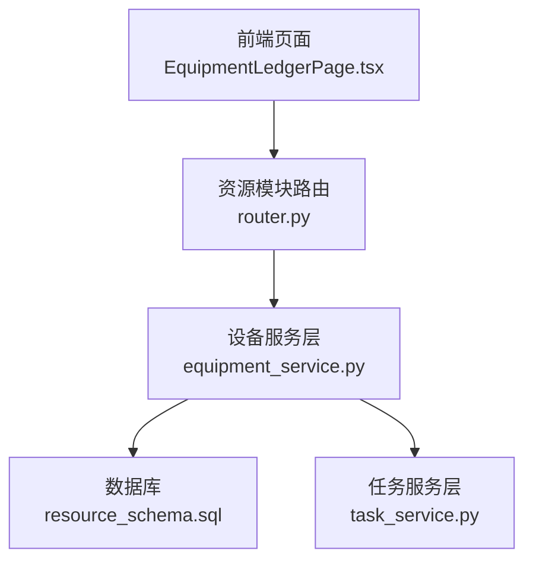
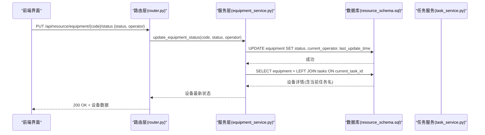
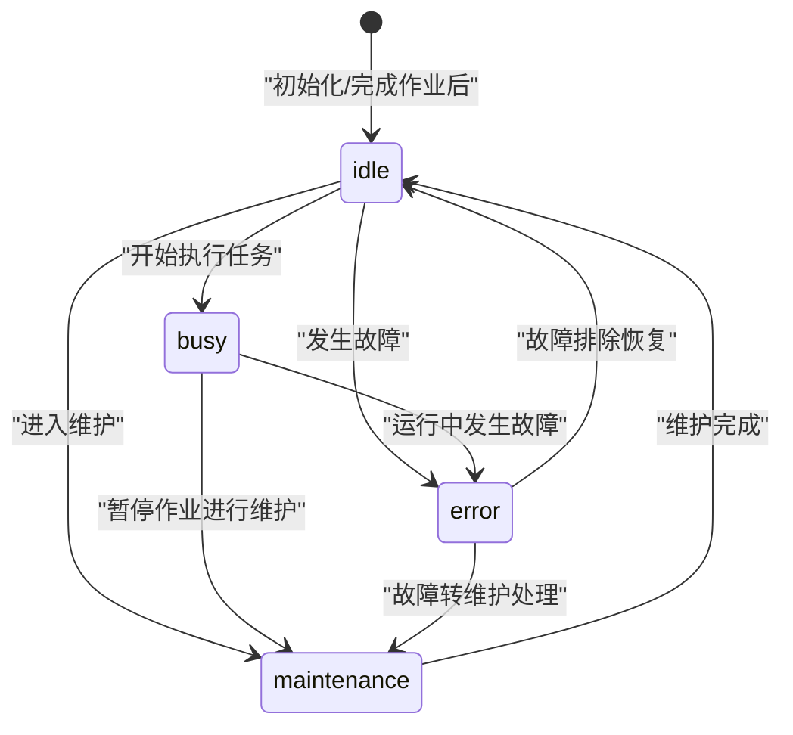
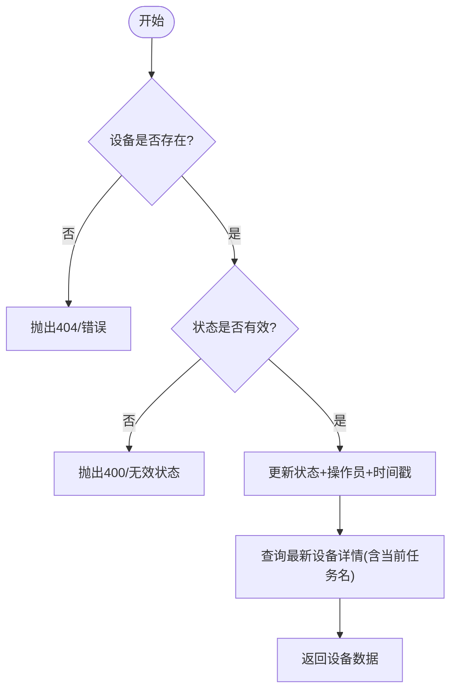
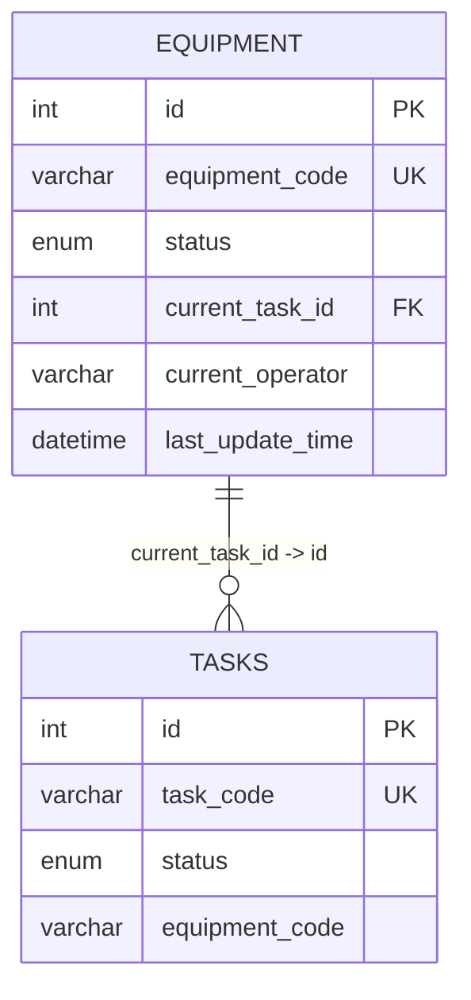
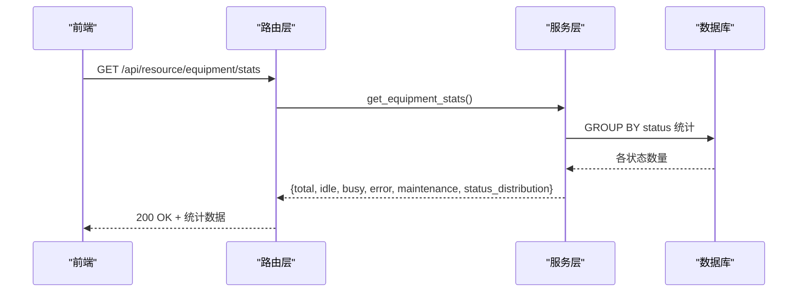
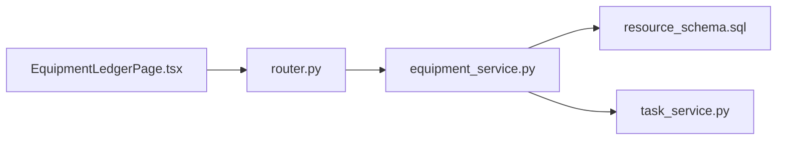

# 设备状态管理

<cite>
**本文引用的文件**
- [equipment_service.py](file://backend/modules/resource/services/equipment_service.py)
- [router.py](file://backend/modules/resource/router.py)
- [resource_schema.sql](file://backend/sql/resource_schema.sql)
- [task_service.py](file://backend/modules/resource/services/task_service.py)
- [equipment.ts](file://webui_ref/client/src/api/resource/equipment.ts)
- [EquipmentLedgerPage.tsx](file://webui_ref/client/src/pages/EquipmentLedgerPage/EquipmentLedgerPage.tsx)
</cite>

## 目录
1. [简介](#简介)
2. [项目结构](#项目结构)
3. [核心组件](#核心组件)
4. [架构总览](#架构总览)
5. [详细组件分析](#详细组件分析)
6. [依赖关系分析](#依赖关系分析)
7. [性能考虑](#性能考虑)
8. [故障排查指南](#故障排查指南)
9. [结论](#结论)
10. [附录](#附录)

## 简介
本文件围绕“设备状态管理”能力，系统化阐述设备状态机设计、状态转换规则、更新机制（含操作员跟踪与时间戳）、与任务调度的关联（current_task_id 字段及其对排程的影响）、统计与分析能力（按状态分布、实时监控、历史追踪），以及API接口规范、错误处理策略与性能优化建议。目标读者既包括后端开发者，也包括产品与运维人员。

## 项目结构
设备状态管理涉及以下关键模块：
- 服务层：设备台账与状态维护逻辑
- 路由层：对外暴露的REST API
- 数据层：设备表、任务表、维护记录表等
- 前端：设备列表、状态筛选、统计展示

图表来源
- [router.py:178-201](file://backend/modules/resource/router.py#L178-L201)
- [equipment_service.py:262-301](file://backend/modules/resource/services/equipment_service.py#L262-L301)
- [resource_schema.sql:13-28](file://backend/sql/resource_schema.sql#L13-L28)
- [task_service.py:149-174](file://backend/modules/resource/services/task_service.py#L149-L174)

章节来源
- [router.py:178-201](file://backend/modules/resource/router.py#L178-L201)
- [equipment_service.py:11-103](file://backend/modules/resource/services/equipment_service.py#L11-L103)
- [resource_schema.sql:13-28](file://backend/sql/resource_schema.sql#L13-L28)

## 核心组件
- 设备状态枚举：idle（空闲）、busy（忙碌/占用）、error（故障）、maintenance（维护中）
- 设备表关键字段：status、current_task_id、current_operator、last_update_time
- 状态更新API：PUT /api/resource/equipment/{equipment_code}/status
- 统计API：GET /api/resource/equipment/stats
- 维护记录：equipment_maintenance 表及对应CRUD

章节来源
- [resource_schema.sql:13-28](file://backend/sql/resource_schema.sql#L13-L28)
- [router.py:178-201](file://backend/modules/resource/router.py#L178-L201)
- [equipment_service.py:304-335](file://backend/modules/resource/services/equipment_service.py#L304-L335)

## 架构总览
设备状态管理的调用链路如下：
- 前端通过设备列表页发起状态筛选或状态更新请求
- 路由层校验参数并转发至服务层
- 服务层执行业务校验（存在性、合法性）并持久化到数据库
- 数据库自动更新时间戳；如需关联任务，则读取 current_task_id 对应的任务信息
- 返回统一响应体供前端渲染

图表来源
- [router.py:178-201](file://backend/modules/resource/router.py#L178-L201)
- [equipment_service.py:262-301](file://backend/modules/resource/services/equipment_service.py#L262-L301)
- [resource_schema.sql:13-28](file://backend/sql/resource_schema.sql#L13-L28)
- [task_service.py:149-174](file://backend/modules/resource/services/task_service.py#L149-L174)

## 详细组件分析

### 设备状态机设计与生命周期
- 状态集合：idle、busy、error、maintenance
- 默认初始状态：idle
- 状态变更由服务层统一入口 update_equipment_status 控制，支持可选 operator 记录当前操作员
- 时间戳：数据库层 last_update_time 在每次更新时自动刷新

说明
- 该状态图为业务推荐模型，用于指导后续扩展与一致性校验。当前实现未强制限制转换路径，但可通过服务层增加校验以约束合法转换。
- 建议在状态变更时同时记录操作人（current_operator）与时间（last_update_time），便于审计与追溯。

章节来源
- [resource_schema.sql:13-28](file://backend/sql/resource_schema.sql#L13-L28)
- [equipment_service.py:262-301](file://backend/modules/resource/services/equipment_service.py#L262-L301)

### 状态转换规则与条件限制
- 当前实现允许任意合法状态值切换（由枚举约束），未内置转换规则引擎
- 建议的规则示例（可按需实现）：
  - idle → busy：当设备被分配任务且任务开始
  - busy → idle：任务完成且无异常
  - busy → error：任务执行中出现异常
  - busy → maintenance：临时停机维护
  - error → idle：修复完成
  - error → maintenance：需要进一步检修
  - maintenance → idle：维护完成
- 可在 update_equipment_status 中增加前置检查（如 busy→idle 需确认任务结束），以保证业务一致性

章节来源
- [equipment_service.py:262-301](file://backend/modules/resource/services/equipment_service.py#L262-L301)

### 状态更新机制（手动与自动）
- 手动切换：通过 API 传入新状态与可选 operator，服务层写入数据库并返回最新设备信息
- 自动变更：可由调度器或服务事件触发（例如任务开始/结束、告警触发），调用同一更新接口保持一致性
- 操作员跟踪：current_operator 字段记录最后操作者
- 时间戳：last_update_time 由数据库自动更新；created_at/updated_at 亦可用于审计

图表来源
- [equipment_service.py:262-301](file://backend/modules/resource/services/equipment_service.py#L262-L301)
- [resource_schema.sql:13-28](file://backend/sql/resource_schema.sql#L13-L28)

章节来源
- [equipment_service.py:262-301](file://backend/modules/resource/services/equipment_service.py#L262-L301)

### 设备状态与任务调度的关联
- current_task_id：设备表中的外键指向 tasks.id，表示设备当前正在执行的任务
- 影响排程：
  - 设备处于 busy 时，通常应绑定一个 in_progress 的任务
  - 任务开始/结束时，应同步更新设备的 status 与 current_task_id
  - 任务删除或异常终止时，需清理设备的 current_task_id 并调整状态
- 查询增强：获取设备详情时会LEFT JOIN tasks，返回当前任务名称以便展示

图表来源
- [resource_schema.sql:13-28](file://backend/sql/resource_schema.sql#L13-L28)
- [resource_schema.sql:71-109](file://backend/sql/resource_schema.sql#L71-L109)

章节来源
- [resource_schema.sql:13-28](file://backend/sql/resource_schema.sql#L13-L28)
- [resource_schema.sql:71-109](file://backend/sql/resource_schema.sql#L71-L109)
- [equipment_service.py:106-137](file://backend/modules/resource/services/equipment_service.py#L106-L137)

### 设备状态统计功能
- 按状态分布统计：GET /api/resource/equipment/stats 返回 total、idle/busy/error/maintenance 计数及原始分布
- 实时状态监控：前端可轮询 stats 接口或结合设备列表接口进行过滤展示
- 历史状态追踪：基于 last_update_time 与未来可扩展的状态变更日志表（当前未提供专用日志表，可通过维护记录或外部审计方案补充）

图表来源
- [router.py:204-218](file://backend/modules/resource/router.py#L204-L218)
- [equipment_service.py:304-335](file://backend/modules/resource/services/equipment_service.py#L304-L335)

章节来源
- [router.py:204-218](file://backend/modules/resource/router.py#L204-L218)
- [equipment_service.py:304-335](file://backend/modules/resource/services/equipment_service.py#L304-L335)

### API 接口规范（设备状态相关）
- 更新设备状态
  - 方法：PUT
  - 路径：/api/resource/equipment/{equipment_code}/status
  - 请求体：{ status: string, operator?: string }
  - 成功响应：{ code: 200, message: "状态更新成功", data: 设备详情 }
  - 错误：400（无效状态/不存在）、500（服务器错误）
- 获取设备统计
  - 方法：GET
  - 路径：/api/resource/equipment/stats
  - 成功响应：{ code: 200, message: "获取成功", data: { total, idle, busy, error, maintenance, status_distribution } }
- 设备列表（支持按状态筛选）
  - 方法：GET
  - 路径：/api/resource/equipment?page=...&page_size=...&status=...&zone_code=...&equipment_type=...&keyword=...
  - 成功响应：{ code: 200, message: "获取成功", data: { total, page, page_size, data: [...] } }

章节来源
- [router.py:58-86](file://backend/modules/resource/router.py#L58-L86)
- [router.py:178-201](file://backend/modules/resource/router.py#L178-L201)
- [router.py:204-218](file://backend/modules/resource/router.py#L204-L218)

### 错误处理策略
- 参数校验：状态值必须在枚举范围内，否则返回400
- 资源不存在：设备编号不存在时返回404或400（依具体实现）
- 事务与一致性：状态更新与任务关联更新建议使用事务保证一致性（当前为单条SQL，若涉及多表需封装事务）
- 日志记录：服务层记录状态变更日志，便于问题定位

章节来源
- [equipment_service.py:262-301](file://backend/modules/resource/services/equipment_service.py#L262-L301)
- [router.py:178-201](file://backend/modules/resource/router.py#L178-L201)

### 性能优化建议
- 索引利用：设备表已针对 status、zone_code、equipment_type 建立索引，利于筛选与统计
- 分页与过滤：列表接口支持分页与多维度筛选，避免全表扫描
- 统计聚合：stats 使用 GROUP BY 聚合，数据量大时可考虑物化视图或定时汇总
- 缓存：对高频只读数据（如状态分布）可引入缓存层降低数据库压力
- 连接池与批处理：在高并发场景下确保数据库连接池配置合理，批量更新时使用批处理减少往返

[本节为通用性能建议，不直接分析具体代码文件]

## 依赖关系分析
- 路由层依赖服务层：router.py 调用 equipment_service.py 的方法
- 服务层依赖数据库：通过 SQL 访问 equipment、tasks、equipment_maintenance 等表
- 前端依赖API：EquipmentLedgerPage.tsx 调用设备列表与统计接口，并按状态映射展示

图表来源
- [router.py:178-201](file://backend/modules/resource/router.py#L178-L201)
- [equipment_service.py:262-301](file://backend/modules/resource/services/equipment_service.py#L262-L301)
- [resource_schema.sql:13-28](file://backend/sql/resource_schema.sql#L13-L28)
- [task_service.py:149-174](file://backend/modules/resource/services/task_service.py#L149-L174)
- [EquipmentLedgerPage.tsx:302-345](file://webui_ref/client/src/pages/EquipmentLedgerPage/EquipmentLedgerPage.tsx#L302-L345)

章节来源
- [router.py:178-201](file://backend/modules/resource/router.py#L178-L201)
- [equipment_service.py:262-301](file://backend/modules/resource/services/equipment_service.py#L262-L301)
- [resource_schema.sql:13-28](file://backend/sql/resource_schema.sql#L13-L28)
- [task_service.py:149-174](file://backend/modules/resource/services/task_service.py#L149-L174)
- [EquipmentLedgerPage.tsx:302-345](file://webui_ref/client/src/pages/EquipmentLedgerPage/EquipmentLedgerPage.tsx#L302-L345)

## 性能考虑
- 列表查询：使用 WHERE 条件与 LIMIT/OFFSET 分页，避免大结果集
- 统计查询：GROUP BY 聚合，必要时引入缓存或预计算
- 状态更新：尽量合并多次更新为一次事务，减少锁竞争
- 前端轮询：合理设置轮询间隔，避免频繁请求造成压力

[本节为通用性能建议，不直接分析具体代码文件]

## 故障排查指南
- 状态更新失败
  - 检查设备编号是否存在
  - 检查状态值是否在枚举范围内
  - 查看数据库连接与权限
- 统计不准确
  - 检查是否有脏数据（如 status 不在枚举内）
  - 检查是否有并发写导致的数据不一致
- 任务关联异常
  - 检查 current_task_id 是否指向有效的任务ID
  - 检查任务状态与设备状态是否一致（如 busy 应有 in_progress 任务）

章节来源
- [equipment_service.py:262-301](file://backend/modules/resource/services/equipment_service.py#L262-L301)
- [resource_schema.sql:13-28](file://backend/sql/resource_schema.sql#L13-L28)

## 结论
本项目已具备设备状态的基础管理能力：定义了四种标准状态、提供了状态更新与统计接口、并在数据库中记录了操作员与时间戳。当前实现未强制状态转换规则，建议后续在服务层增加转换校验，并结合任务调度系统实现更严格的自动化流转。同时，建议引入状态变更日志与缓存机制，以提升可追溯性与性能。

[本节为总结性内容，不直接分析具体代码文件]

## 附录

### 前端状态映射与展示
- 前端将状态映射为中文标签与颜色，便于可视化展示
- 设备列表支持按状态筛选，统计卡片展示各状态数量

章节来源
- [equipment.ts:218-253](file://webui_ref/client/src/api/resource/equipment.ts#L218-L253)
- [EquipmentLedgerPage.tsx:302-345](file://webui_ref/client/src/pages/EquipmentLedgerPage/EquipmentLedgerPage.tsx#L302-L345)