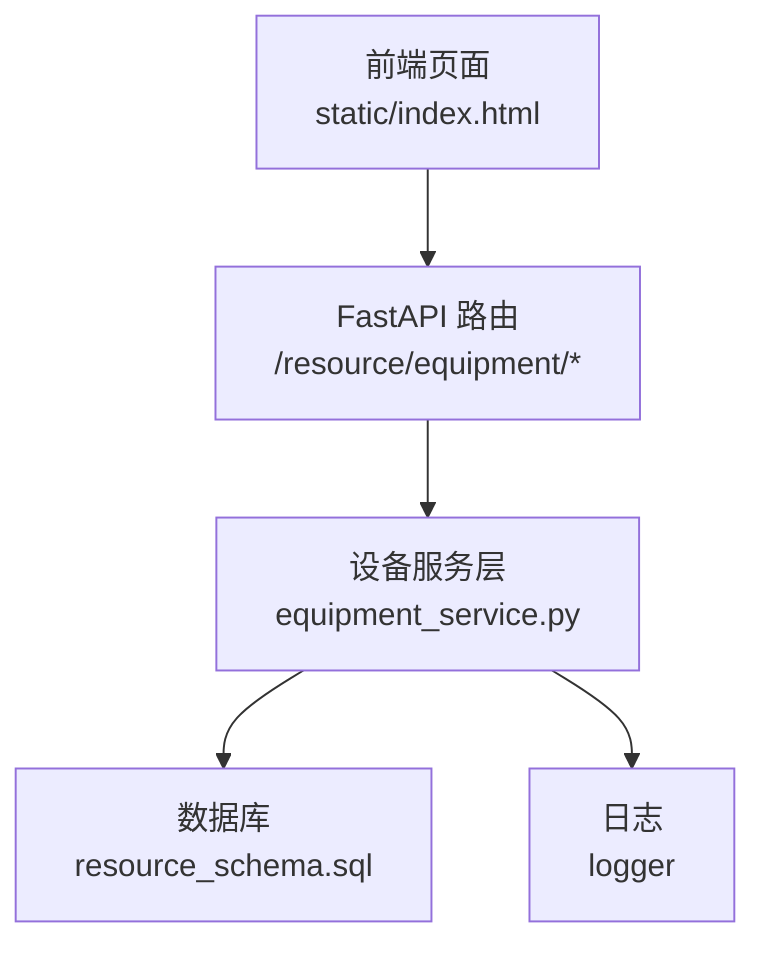
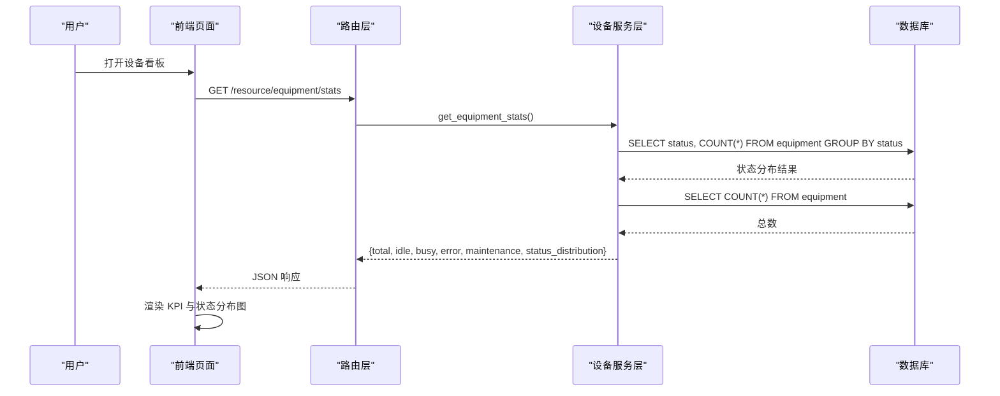
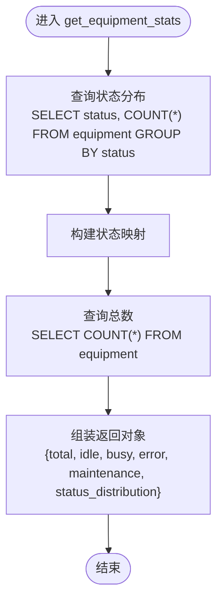
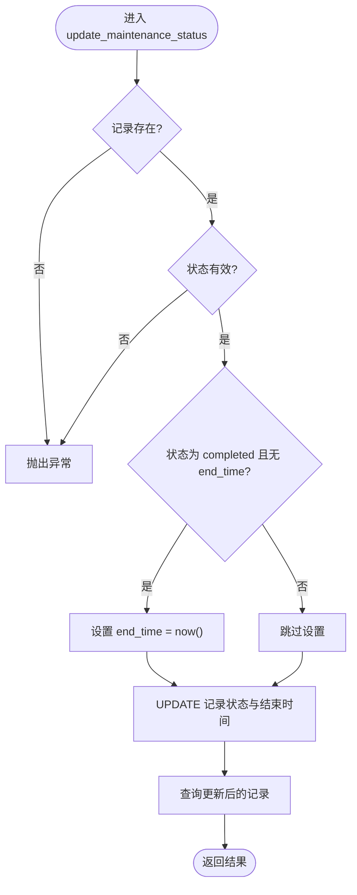
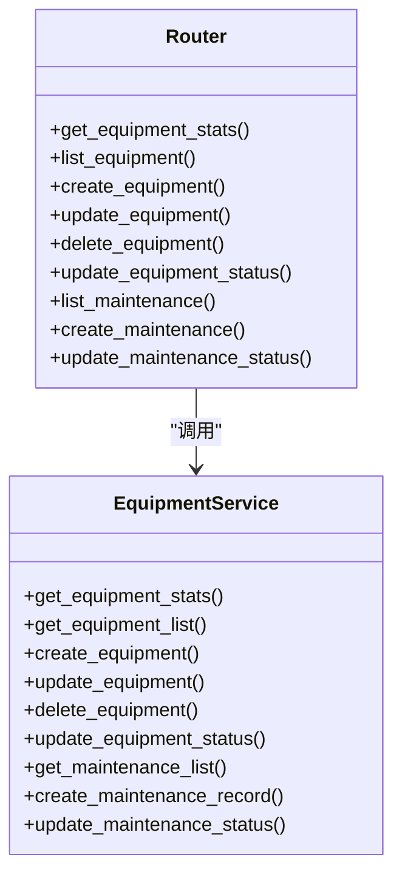
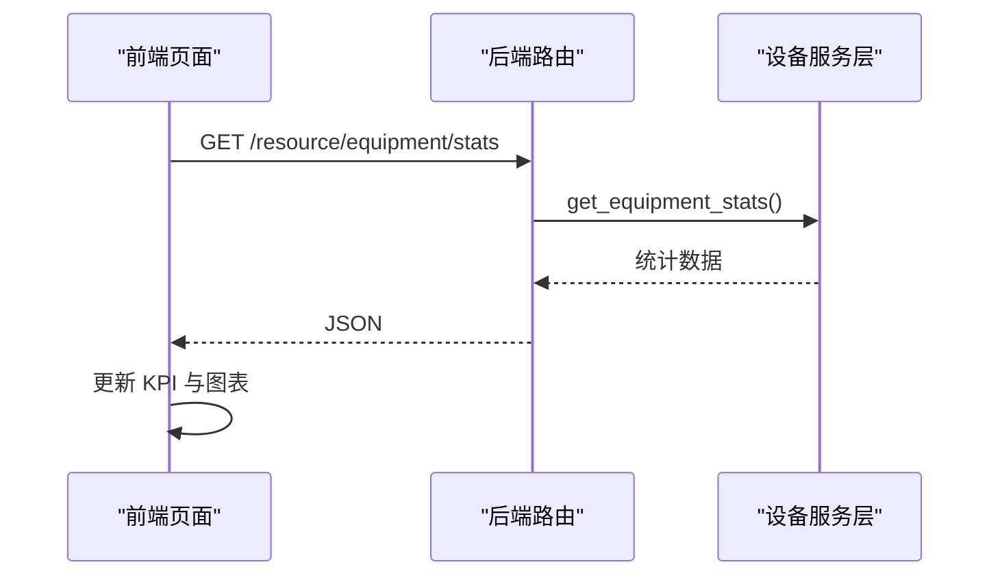

# 设备统计分析

<cite>
**本文引用的文件**
- [backend/modules/resource/services/equipment_service.py](file://backend/modules/resource/services/equipment_service.py)
- [backend/modules/resource/router.py](file://backend/modules/resource/router.py)
- [backend/sql/resource_schema.sql](file://backend/sql/resource_schema.sql)
- [backend/modules/resource/schemas.py](file://backend/modules/resource/schemas.py)
- [static/index.html](file://static/index.html)
</cite>

## 目录
1. [简介](#简介)
2. [项目结构](#项目结构)
3. [核心组件](#核心组件)
4. [架构总览](#架构总览)
5. [详细组件分析](#详细组件分析)
6. [依赖关系分析](#依赖关系分析)
7. [性能与可扩展性](#性能与可扩展性)
8. [故障排查指南](#故障排查指南)
9. [结论](#结论)
10. [附录：API 规范与使用示例](#附录api-规范与使用示例)

## 简介
本章节面向“设备统计分析”能力，覆盖设备总数、状态分布、利用率等核心指标；阐述在线率、故障率、维护时长等关键绩效指标（KPI）的计算逻辑；说明驾驶舱图表、趋势与对比的可视化方案；解释实时更新机制（定时刷新、事件触发刷新）；提供统计查询、数据导出、报表生成的 API 接口规范；并给出自定义统计维度、多维度分析与预测性维护的实现指南。

## 项目结构
围绕设备统计分析的关键代码分布在以下位置：
- 后端服务层：设备统计计算与维护记录处理
- 路由层：对外暴露统计查询接口
- 数据库层：设备台账、维护记录等表结构
- 前端展示：驾驶舱 KPI、状态分布图、列表筛选与分页

**图示来源**
- [static/index.html:7432-7455](file://static/index.html#L7432-L7455)
- [backend/modules/resource/router.py:204-218](file://backend/modules/resource/router.py#L204-L218)
- [backend/modules/resource/services/equipment_service.py:304-335](file://backend/modules/resource/services/equipment_service.py#L304-L335)
- [backend/sql/resource_schema.sql:13-28](file://backend/sql/resource_schema.sql#L13-L28)

**章节来源**
- [backend/modules/resource/services/equipment_service.py:1-495](file://backend/modules/resource/services/equipment_service.py#L1-L495)
- [backend/modules/resource/router.py:1-800](file://backend/modules/resource/router.py#L1-L800)
- [backend/sql/resource_schema.sql:1-326](file://backend/sql/resource_schema.sql#L1-L326)
- [static/index.html:2879-2958](file://static/index.html#L2879-L2958)

## 核心组件
- 设备统计服务：按状态聚合设备数量、计算总数，返回驾驶舱所需指标
- 设备维护服务：维护记录的增删改查、状态流转与时长计算
- 路由层：提供 /resource/equipment/stats 等统计接口
- 前端展示：KPI 卡片、状态分布图、列表筛选与分页

**章节来源**
- [backend/modules/resource/services/equipment_service.py:304-335](file://backend/modules/resource/services/equipment_service.py#L304-L335)
- [backend/modules/resource/services/equipment_service.py:338-495](file://backend/modules/resource/services/equipment_service.py#L338-L495)
- [backend/modules/resource/router.py:204-218](file://backend/modules/resource/router.py#L204-L218)
- [static/index.html:7432-7455](file://static/index.html#L7432-L7455)

## 架构总览
设备统计分析的数据流从前端发起请求，经路由转发到服务层，服务层通过 SQL 查询设备表和维护表，汇总后返回给前端渲染为 KPI 和图表。

**图示来源**
- [backend/modules/resource/router.py:204-218](file://backend/modules/resource/router.py#L204-L218)
- [backend/modules/resource/services/equipment_service.py:304-335](file://backend/modules/resource/services/equipment_service.py#L304-L335)
- [backend/sql/resource_schema.sql:13-28](file://backend/sql/resource_schema.sql#L13-L28)
- [static/index.html:7432-7455](file://static/index.html#L7432-L7455)

## 详细组件分析

### 设备统计服务
- 功能：按设备状态分组统计数量，计算设备总数，返回驾驶舱所需字段
- 复杂度：两次 O(1) 聚合查询（GROUP BY + COUNT），时间复杂度近似 O(N)，N 为设备数
- 扩展点：可加入区域、类型等多维聚合

**图示来源**
- [backend/modules/resource/services/equipment_service.py:304-335](file://backend/modules/resource/services/equipment_service.py#L304-L335)

**章节来源**
- [backend/modules/resource/services/equipment_service.py:304-335](file://backend/modules/resource/services/equipment_service.py#L304-L335)

### 设备维护服务
- 功能：维护记录分页查询、创建、状态更新；支持在结束时自动或手动设置结束时间
- 关键逻辑：完成时若未提供结束时间则写入当前时间；支持取消与进行中状态
- 复杂度：分页查询 O(N)；插入/更新 O(1)

**图示来源**
- [backend/modules/resource/services/equipment_service.py:442-495](file://backend/modules/resource/services/equipment_service.py#L442-L495)

**章节来源**
- [backend/modules/resource/services/equipment_service.py:338-495](file://backend/modules/resource/services/equipment_service.py#L338-L495)

### 路由层与 API
- 统计接口：GET /resource/equipment/stats
- 设备管理：CRUD、状态更新
- 维护记录：分页查询、创建、状态更新

**图示来源**
- [backend/modules/resource/router.py:58-218](file://backend/modules/resource/router.py#L58-L218)
- [backend/modules/resource/services/equipment_service.py:11-335](file://backend/modules/resource/services/equipment_service.py#L11-L335)

**章节来源**
- [backend/modules/resource/router.py:58-218](file://backend/modules/resource/router.py#L58-L218)
- [backend/modules/resource/services/equipment_service.py:11-335](file://backend/modules/resource/services/equipment_service.py#L11-L335)

### 前端展示与交互
- KPI 卡片：设备总数、空闲、占用、故障/维护
- 状态分布图：基于后端返回的状态分布数据绘制
- 列表筛选：按关键词、类型、状态、区域筛选，支持分页

**图示来源**
- [static/index.html:7432-7455](file://static/index.html#L7432-L7455)
- [backend/modules/resource/router.py:204-218](file://backend/modules/resource/router.py#L204-L218)
- [backend/modules/resource/services/equipment_service.py:304-335](file://backend/modules/resource/services/equipment_service.py#L304-L335)

**章节来源**
- [static/index.html:2879-2958](file://static/index.html#L2879-L2958)
- [static/index.html:7432-7455](file://static/index.html#L7432-L7455)

## 依赖关系分析
- 服务层依赖数据库表：equipment、equipment_maintenance
- 路由层依赖服务层函数
- 前端依赖路由层提供的统计接口

**图示来源**
- [backend/modules/resource/router.py:204-218](file://backend/modules/resource/router.py#L204-L218)
- [backend/modules/resource/services/equipment_service.py:304-335](file://backend/modules/resource/services/equipment_service.py#L304-L335)
- [backend/sql/resource_schema.sql:13-28](file://backend/sql/resource_schema.sql#L13-L28)
- [static/index.html:7432-7455](file://static/index.html#L7432-L7455)

**章节来源**
- [backend/modules/resource/router.py:204-218](file://backend/modules/resource/router.py#L204-L218)
- [backend/modules/resource/services/equipment_service.py:304-335](file://backend/modules/resource/services/equipment_service.py#L304-L335)
- [backend/sql/resource_schema.sql:13-28](file://backend/sql/resource_schema.sql#L13-L28)
- [static/index.html:7432-7455](file://static/index.html#L7432-L7455)

## 性能与可扩展性
- 查询优化：利用索引字段 status、zone_code、equipment_type 提升过滤与聚合效率
- 分页与限流：列表查询采用 LIMIT/OFFSET 分页，避免一次性加载大量数据
- 缓存建议：对高频访问的统计结果可引入短期缓存（如 Redis）以降低数据库压力
- 扩展维度：可在服务层增加按区域、类型、时间的多维聚合，满足更细粒度分析需求

[本节为通用指导，不直接分析具体文件]

## 故障排查指南
- 统计接口返回空或错误：检查设备表是否存在数据、状态枚举是否一致
- 维护记录无法完成：确认状态值合法，completed 时若无结束时间将自动写入当前时间
- 前端显示异常：检查接口返回字段是否与前端期望一致（total、idle、busy、error、maintenance）

**章节来源**
- [backend/modules/resource/services/equipment_service.py:262-301](file://backend/modules/resource/services/equipment_service.py#L262-L301)
- [backend/modules/resource/services/equipment_service.py:442-495](file://backend/modules/resource/services/equipment_service.py#L442-L495)
- [static/index.html:7432-7455](file://static/index.html#L7432-L7455)

## 结论
本项目已实现设备统计的核心能力：设备总数与状态分布统计、维护记录管理与时长计算、前端驾驶舱展示。后续可通过多维聚合、缓存策略、趋势与对比分析、预测性维护等增强分析能力，进一步提升设备运营效率与管理决策质量。

[本节为总结，不直接分析具体文件]

## 附录：API 规范与使用示例

### 统计查询
- 接口：GET /resource/equipment/stats
- 返回字段：
  - total：设备总数
  - idle/busy/error/maintenance：各状态设备数量
  - status_distribution：状态分布明细

**章节来源**
- [backend/modules/resource/router.py:204-218](file://backend/modules/resource/router.py#L204-L218)
- [backend/modules/resource/services/equipment_service.py:304-335](file://backend/modules/resource/services/equipment_service.py#L304-L335)

### 数据导出与报表生成
- 当前未提供专用导出接口；可通过列表查询接口获取数据并在前端或外部工具中导出为 CSV/Excel
- 建议扩展：新增导出接口，支持按筛选条件导出

[本节为通用建议，不直接分析具体文件]

### 自定义统计维度与多维度分析
- 可在服务层增加按区域、类型、时间的聚合查询，返回多维统计结果
- 前端可按维度切换图表与 KPI 展示

**章节来源**
- [backend/modules/resource/services/equipment_service.py:11-103](file://backend/modules/resource/services/equipment_service.py#L11-L103)

### 预测性维护实现指南
- 数据基础：维护记录的开始/结束时间、设备状态变化历史
- 分析方法：统计平均维护时长、故障间隔、趋势异常检测
- 输出：维护计划建议、风险预警

[本节为通用建议，不直接分析具体文件]

### 实时更新机制
- 前端定时刷新：页面可周期性调用统计接口以更新 KPI 与图表
- 事件触发刷新：当设备状态或维护记录变更时，主动刷新相关视图

**章节来源**
- [static/index.html:7432-7455](file://static/index.html#L7432-L7455)