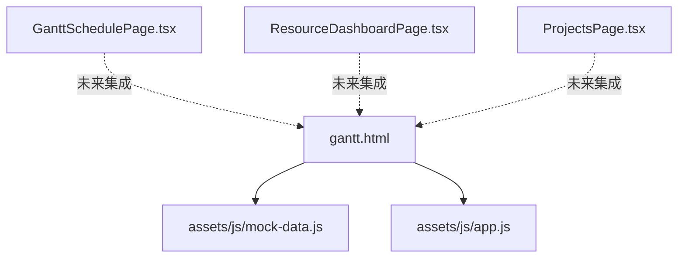
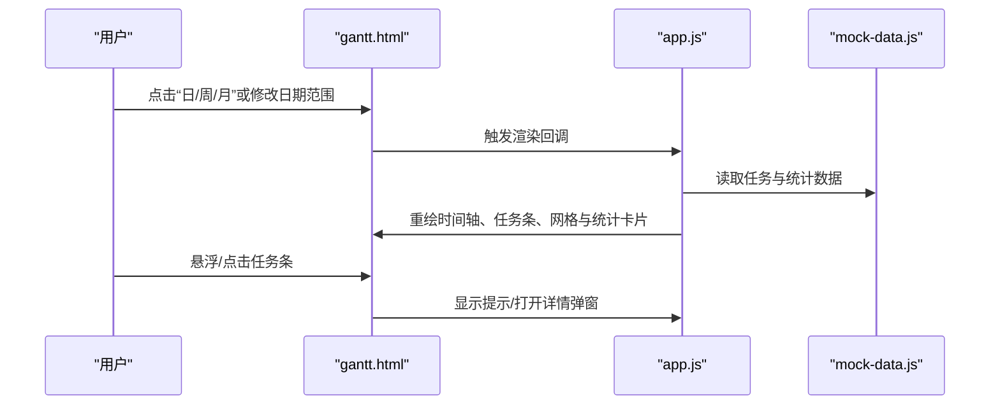
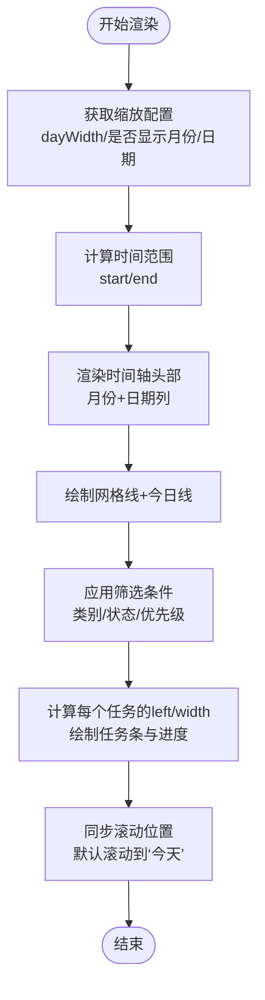
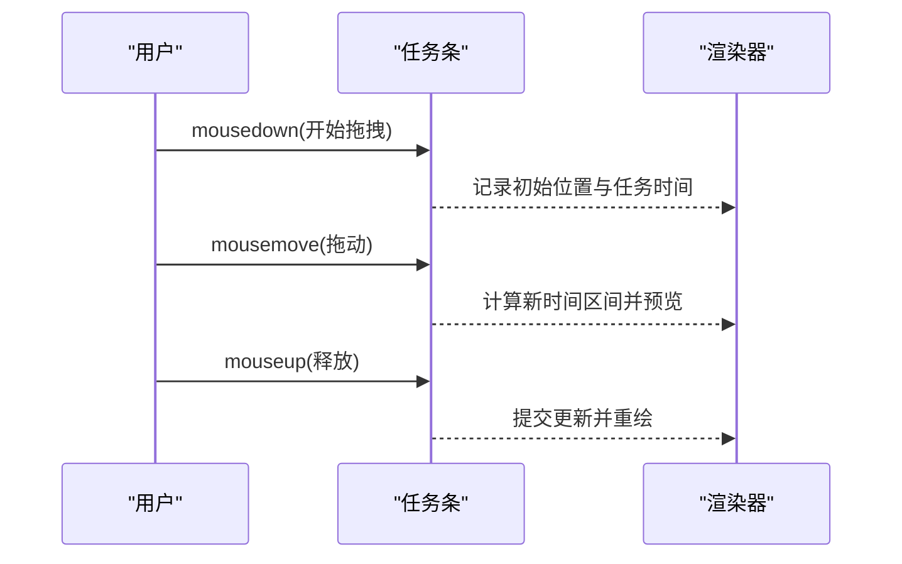
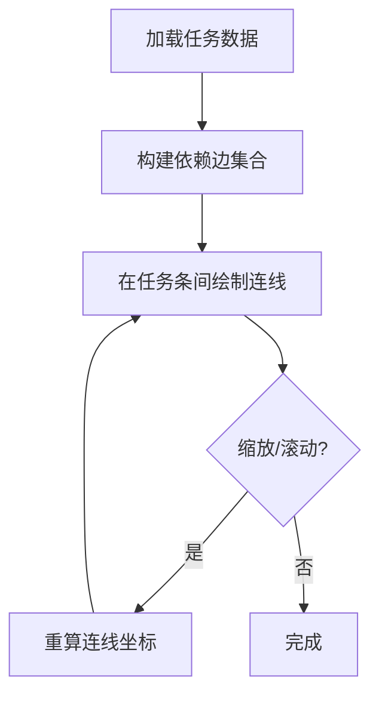
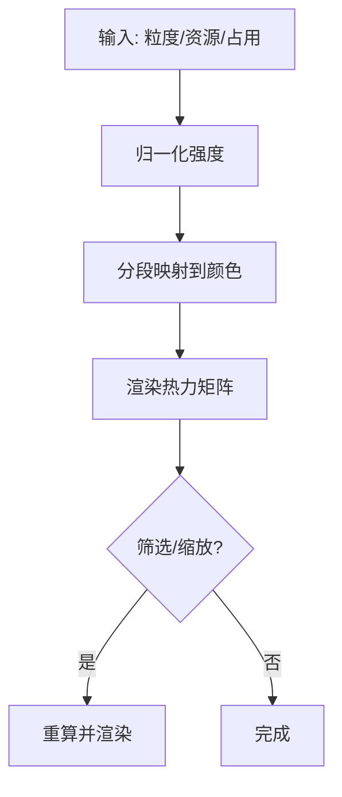
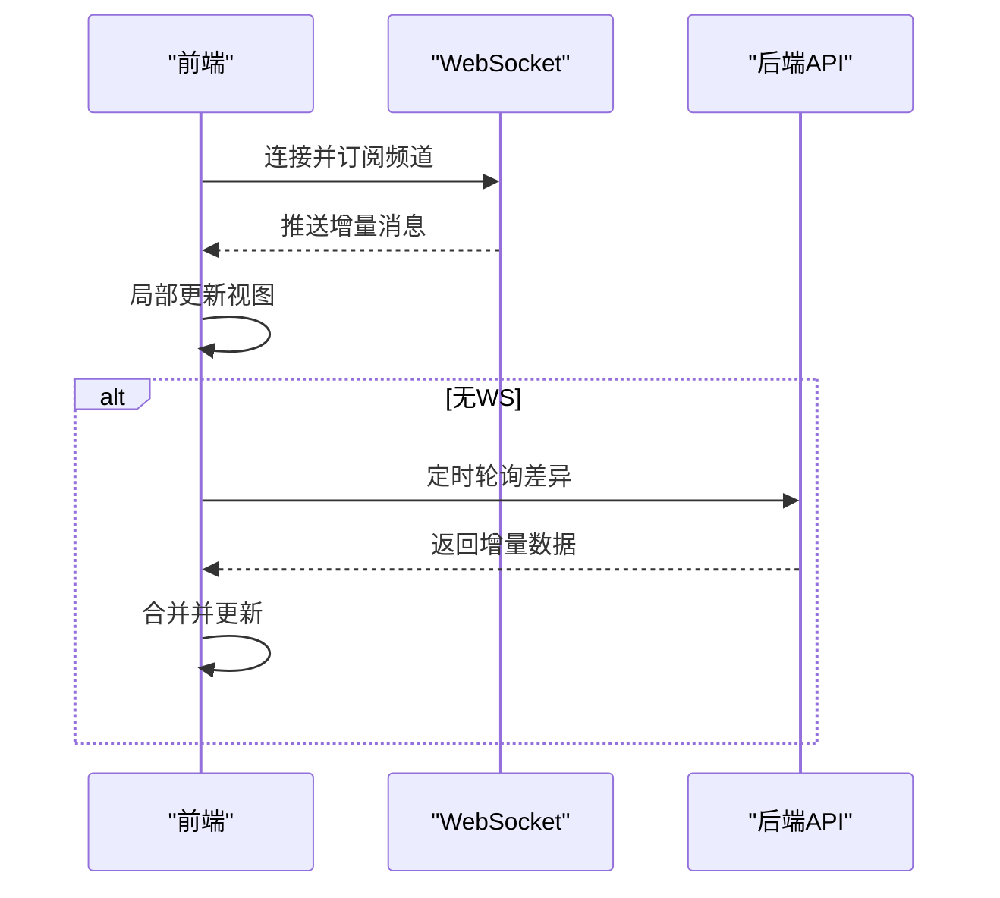
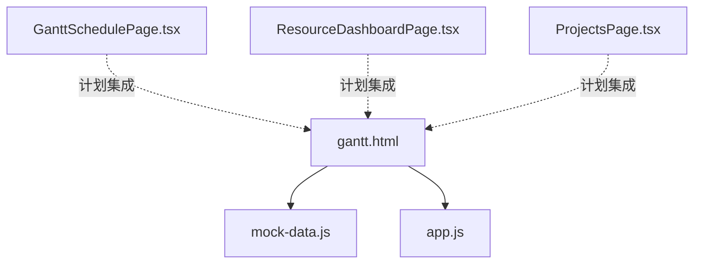

# 可视化组件

<cite>
**本文引用的文件**
- [gantt.html](file://demo/gantt.html)
- [mock-data.js](file://demo/assets/js/mock-data.js)
- [app.js](file://demo/assets/js/app.js)
- [GanttSchedulePage.tsx](file://webui_ref/client/src/pages/GanttSchedulePage/GanttSchedulePage.tsx)
- [ResourceDashboardPage.tsx](file://webui_ref/client/src/pages/ResourceDashboardPage/ResourceDashboardPage.tsx)
- [ProjectsPage.tsx](file://webui_ref/client/src/pages/ProjectsPage/ProjectsPage.tsx)
</cite>

## 目录
1. [简介](#简介)
2. [项目结构](#项目结构)
3. [核心组件](#核心组件)
4. [架构总览](#架构总览)
5. [详细组件分析](#详细组件分析)
6. [依赖关系分析](#依赖关系分析)
7. [性能考虑](#性能考虑)
8. [故障排查指南](#故障排查指南)
9. [结论](#结论)
10. [附录](#附录)

## 简介
本技术文档面向“可视化组件”的实现与使用，重点覆盖以下能力：
- 甘特图渲染引擎：时间轴缩放、任务条拖拽（交互预留）、依赖连线（扩展点）、滚动同步、今日线、筛选与统计卡片。
- 资源占用热力图：基于时间粒度与资源类型的颜色映射生成算法说明与实现建议。
- 统计图表：利用率趋势、资源分布饼图、进度对比柱状图等数据聚合与展示方案。
- 实时数据同步：WebSocket、轮询与增量更新策略。
- 自定义配置：主题、时间格式、显示粒度等个性化选项。
- 响应式适配：多屏幕尺寸下的最佳展示效果。

## 项目结构
仓库包含前端演示页面与 React 工程占位页：
- demo/gantt.html：完整的单页甘特图实现，含样式、交互与脚本引用。
- demo/assets/js/mock-data.js：模拟数据源，供甘特图与统计卡片使用。
- demo/assets/js/app.js：页面初始化与事件绑定逻辑（由 gantt.html 引用）。
- webui_ref/client/src/pages/*：React 工程中的页面占位，如甘特图排程页、综合驾驶舱页、项目页等。

图示来源
- [gantt.html:1-800](file://demo/gantt.html#L1-L800)
- [gantt.html:800-1599](file://demo/gantt.html#L800-L1599)
- [mock-data.js](file://demo/assets/js/mock-data.js)
- [app.js](file://demo/assets/js/app.js)
- [GanttSchedulePage.tsx:1-16](file://webui_ref/client/src/pages/GanttSchedulePage/GanttSchedulePage.tsx#L1-L16)
- [ResourceDashboardPage.tsx:1-16](file://webui_ref/client/src/pages/ResourceDashboardPage/ResourceDashboardPage.tsx#L1-L16)
- [ProjectsPage.tsx:1-35](file://webui_ref/client/src/pages/ProjectsPage/ProjectsPage.tsx#L1-L35)

章节来源
- [gantt.html:1-800](file://demo/gantt.html#L1-L800)
- [gantt.html:800-1599](file://demo/gantt.html#L800-L1599)
- [mock-data.js](file://demo/assets/js/mock-data.js)
- [app.js](file://demo/assets/js/app.js)
- [GanttSchedulePage.tsx:1-16](file://webui_ref/client/src/pages/GanttSchedulePage/GanttSchedulePage.tsx#L1-L16)
- [ResourceDashboardPage.tsx:1-16](file://webui_ref/client/src/pages/ResourceDashboardPage/ResourceDashboardPage.tsx#L1-L16)
- [ProjectsPage.tsx:1-35](file://webui_ref/client/src/pages/ProjectsPage/ProjectsPage.tsx#L1-L35)

## 核心组件
- 甘特图容器与工具栏：提供日/周/月缩放切换、日期范围选择、类别筛选、回到今天、新增任务入口。
- 时间轴头部：按月/日维度渲染刻度，支持周末高亮与今日标记。
- 任务行与任务条：左侧信息区与右侧时间轴区域联动；任务条显示进度、类别标签、延期标识。
- 网格与今日线：按天绘制网格线，标注当前日期竖线。
- 悬浮提示与详情弹窗：鼠标悬停显示任务关键信息；点击打开详情模态框。
- 侧边筛选器：类别、状态、优先级三类筛选，联动工具栏与主视图。
- 统计卡片：按类别汇总项目数与总装台数。

章节来源
- [gantt.html:1-800](file://demo/gantt.html#L1-L800)
- [gantt.html:800-1599](file://demo/gantt.html#L800-L1599)

## 架构总览
甘特图采用“数据驱动 + DOM 渲染”的轻量架构：
- 数据层：mock-data.js 提供任务、项目与统计数据。
- 视图层：gantt.html 定义布局与样式，app.js 负责事件绑定与渲染流程。
- 交互层：缩放、筛选、滚动同步、悬浮提示、详情弹窗等通过原生 JS 事件驱动。

图示来源
- [gantt.html:800-1599](file://demo/gantt.html#L800-L1599)
- [app.js](file://demo/assets/js/app.js)
- [mock-data.js](file://demo/assets/js/mock-data.js)

## 详细组件分析

### 甘特图渲染引擎
- 时间轴缩放
  - 通过切换按钮设置不同 dayWidth，并重新计算月份与日期列宽度，实现日/周/月三种粒度。
  - 月份头根据跨度动态合并单元格宽度，确保视觉对齐。
- 任务条定位与进度
  - 将任务起止日期映射到相对起始日期的天数索引，乘以 dayWidth 得到像素位置。
  - 进度条宽度 = 任务条宽度 × 完成百分比。
- 滚动同步与今日线
  - 左右区域垂直滚动同步，保证左侧任务信息与右侧时间轴对齐。
  - 根据当前日期在时间轴上绘制竖线，并自动滚动至“今天”附近。
- 筛选与统计
  - 侧边筛选器与工具栏下拉联动，过滤后重绘。
  - 统计卡片按类别汇总项目数量与总装台数。

图示来源
- [gantt.html:800-1599](file://demo/gantt.html#L800-L1599)

章节来源
- [gantt.html:800-1599](file://demo/gantt.html#L800-L1599)

### 任务条拖拽（交互设计）
- 目标行为：按住任务条可拖动以调整开始/结束时间；边缘拖拽调整工期；双击进入编辑。
- 实现要点：
  - 记录 mousedown 时的任务原始时间与鼠标偏移。
  - mousemove 时按 dayWidth 换算位移为天数增量，限制在可见范围内。
  - mouseup 时提交变更并刷新视图。
- 冲突检测：若新时间段与同资源任务重叠，给出冲突提示。

图示来源
- [gantt.html:800-1599](file://demo/gantt.html#L800-L1599)

### 依赖关系连线（扩展点）
- 数据结构：为任务增加 dependsOn 字段，表示前置任务 ID 列表。
- 绘制策略：
  - 在任务条之间绘制贝塞尔曲线连接起点与终点。
  - 当任务条随缩放/滚动变化时，实时更新连线坐标。
- 冲突提示：若循环依赖或资源冲突，高亮显示。

图示来源
- [gantt.html:800-1599](file://demo/gantt.html#L800-L1599)

### 资源占用热力图（算法说明）
- 输入：
  - 时间粒度：小时/天/周/月。
  - 资源类型：设备/人员/工位等。
  - 占用数据：每个资源在每个时间粒度的占用时长或强度。
- 颜色映射：
  - 归一化占用强度到 [0,1]。
  - 分段阈值映射到渐变色带（低→中→高→极高）。
- 渲染：
  - 横轴为时间，纵轴为资源类型，单元格填充对应颜色。
  - 支持按资源/时间筛选与放大查看。

[本节为概念性说明，不直接分析具体文件]

### 统计图表（数据聚合与可视化）
- 利用率趋势：按时间粒度聚合资源占用率，折线图展示趋势。
- 资源分布饼图：按资源类型统计占比，环形图展示。
- 进度对比柱状图：按任务类别或负责人对比完成度。
- 数据来源：可从 mock-data.js 或后端 API 获取，统一经数据清洗与聚合后输出给图表库。

[本节为概念性说明，不直接分析具体文件]

### 实时数据同步机制
- WebSocket：建立长连接，服务端推送任务状态、进度、告警等增量消息，客户端按需局部更新。
- 轮询：对不支持 WS 的环境，定时拉取差异数据，合并到本地缓存。
- 增量更新：仅更新变化的任务条与统计卡片，减少重绘成本。

[本节为概念性说明，不直接分析具体文件]

### 自定义图表配置
- 颜色主题：支持明暗主题与品牌色替换。
- 时间格式：支持多种日期/时间格式化。
- 显示粒度：日/周/月切换，支持自定义步长。
- 其他：任务条圆角、阴影、字体大小、间距等。

[本节为概念性说明，不直接分析具体文件]

### 响应式设计适配
- 栅格与弹性布局：统计卡片在小屏下自适应列数。
- 滚动与触摸：移动端优化滚动体验与手势操作。
- 字号与图标：根据视口缩放字号与图标尺寸。

章节来源
- [gantt.html:1-800](file://demo/gantt.html#L1-L800)

## 依赖关系分析
- gantt.html 依赖 mock-data.js 提供数据，依赖 app.js 处理交互。
- React 页面目前为占位，未来可复用 gantt.html 的渲染逻辑或抽取为组件。

图示来源
- [gantt.html:1-800](file://demo/gantt.html#L1-L800)
- [mock-data.js](file://demo/assets/js/mock-data.js)
- [app.js](file://demo/assets/js/app.js)
- [GanttSchedulePage.tsx:1-16](file://webui_ref/client/src/pages/GanttSchedulePage/GanttSchedulePage.tsx#L1-L16)
- [ResourceDashboardPage.tsx:1-16](file://webui_ref/client/src/pages/ResourceDashboardPage/ResourceDashboardPage.tsx#L1-L16)
- [ProjectsPage.tsx:1-35](file://webui_ref/client/src/pages/ProjectsPage/ProjectsPage.tsx#L1-L35)

章节来源
- [gantt.html:1-800](file://demo/gantt.html#L1-L800)
- [mock-data.js](file://demo/assets/js/mock-data.js)
- [app.js](file://demo/assets/js/app.js)
- [GanttSchedulePage.tsx:1-16](file://webui_ref/client/src/pages/GanttSchedulePage/GanttSchedulePage.tsx#L1-L16)
- [ResourceDashboardPage.tsx:1-16](file://webui_ref/client/src/pages/ResourceDashboardPage/ResourceDashboardPage.tsx#L1-L16)
- [ProjectsPage.tsx:1-35](file://webui_ref/client/src/pages/ProjectsPage/ProjectsPage.tsx#L1-L35)

## 性能考虑
- 渲染优化
  - 批量更新 DOM，避免频繁重排。
  - 虚拟滚动：当任务量较大时，仅渲染可视区域的任务行。
- 交互优化
  - 防抖/节流：缩放、滚动、筛选等操作加防抖。
  - 增量重绘：仅更新受影响的任务条与统计卡片。
- 数据优化
  - 预计算时间轴宽度与网格线，缓存结果。
  - 使用 Web Worker 进行大数据聚合（可选）。

[本节为通用指导，不直接分析具体文件]

## 故障排查指南
- 时间轴错位
  - 检查 dayWidth 与时间范围计算是否正确。
  - 确认月份边界合并逻辑无误。
- 任务条不可见
  - 校验任务起止日期是否在可见范围内。
  - 检查 left/width 计算是否越界。
- 滚动不同步
  - 确认左右区域高度一致，监听滚动事件并同步 scrollTop。
- 悬浮提示遮挡
  - 根据窗口边界限制 tooltip 的 left/top。
- 筛选无效
  - 检查筛选条件与任务字段映射是否正确。

章节来源
- [gantt.html:800-1599](file://demo/gantt.html#L800-L1599)

## 结论
本可视化组件以轻量、可扩展的方式实现了甘特图的核心能力，包括时间轴缩放、任务条展示与交互、筛选与统计、以及响应式布局。后续可通过引入依赖连线、拖拽编辑、热力图与实时同步进一步增强业务价值。建议在大规模数据场景下引入虚拟滚动与增量更新，以提升性能与用户体验。

[本节为总结性内容，不直接分析具体文件]

## 附录
- 示例页面：demo/gantt.html 可直接在浏览器打开，无需构建。
- 数据源：demo/assets/js/mock-data.js 提供任务与统计数据。
- 交互脚本：demo/assets/js/app.js 负责事件绑定与渲染流程。
- React 占位：webui_ref/client/src/pages 下页面待接入实际功能。

章节来源
- [gantt.html:1-800](file://demo/gantt.html#L1-L800)
- [gantt.html:800-1599](file://demo/gantt.html#L800-L1599)
- [mock-data.js](file://demo/assets/js/mock-data.js)
- [app.js](file://demo/assets/js/app.js)
- [GanttSchedulePage.tsx:1-16](file://webui_ref/client/src/pages/GanttSchedulePage/GanttSchedulePage.tsx#L1-L16)
- [ResourceDashboardPage.tsx:1-16](file://webui_ref/client/src/pages/ResourceDashboardPage/ResourceDashboardPage.tsx#L1-L16)
- [ProjectsPage.tsx:1-35](file://webui_ref/client/src/pages/ProjectsPage/ProjectsPage.tsx#L1-L35)