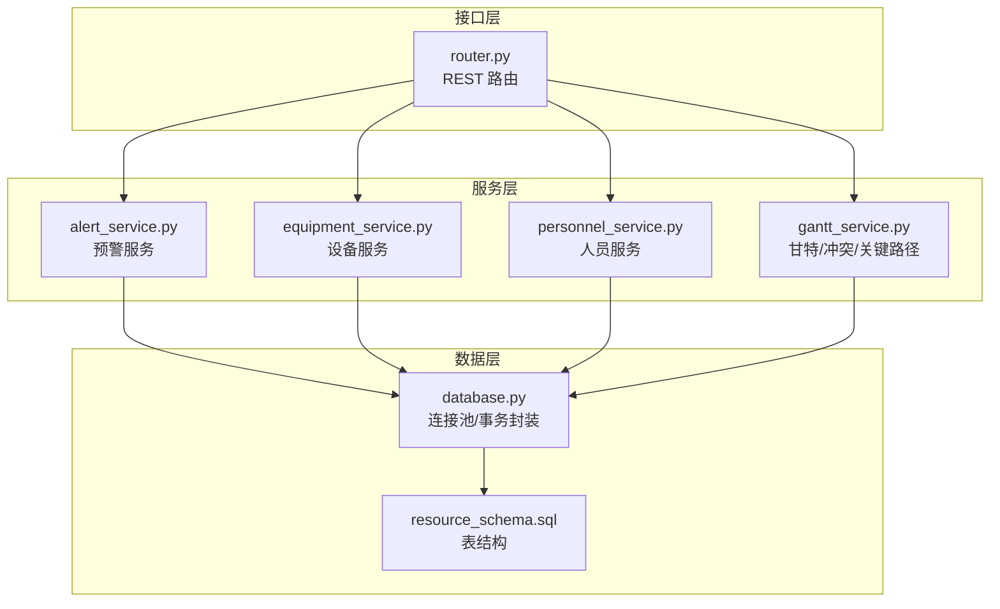
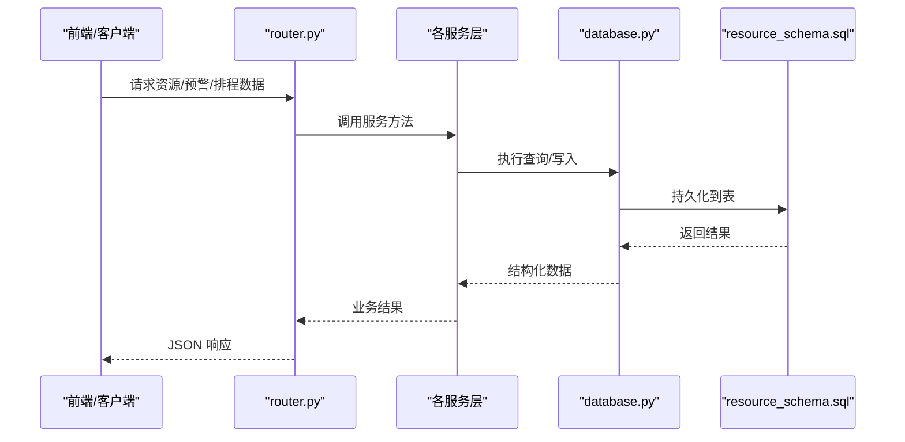
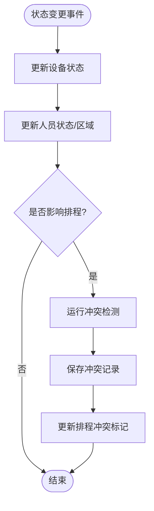
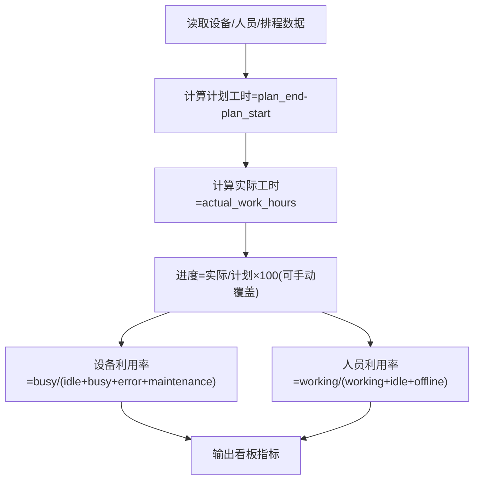
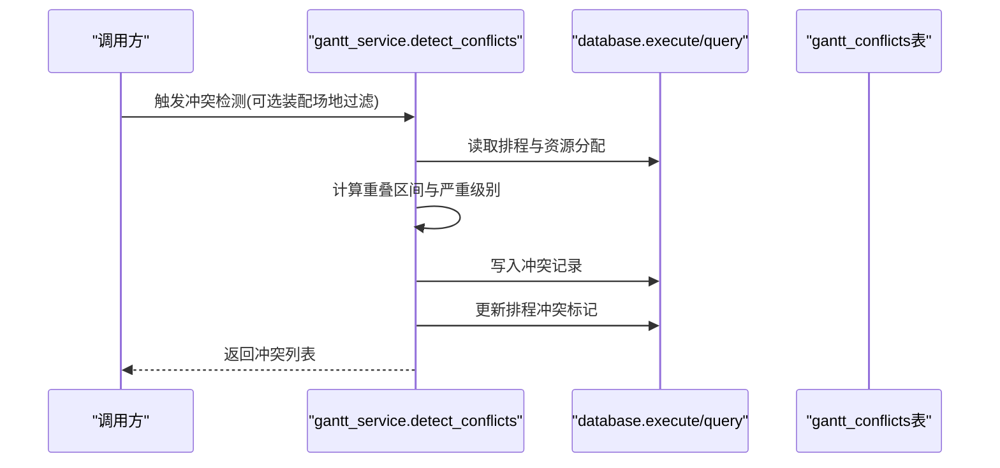
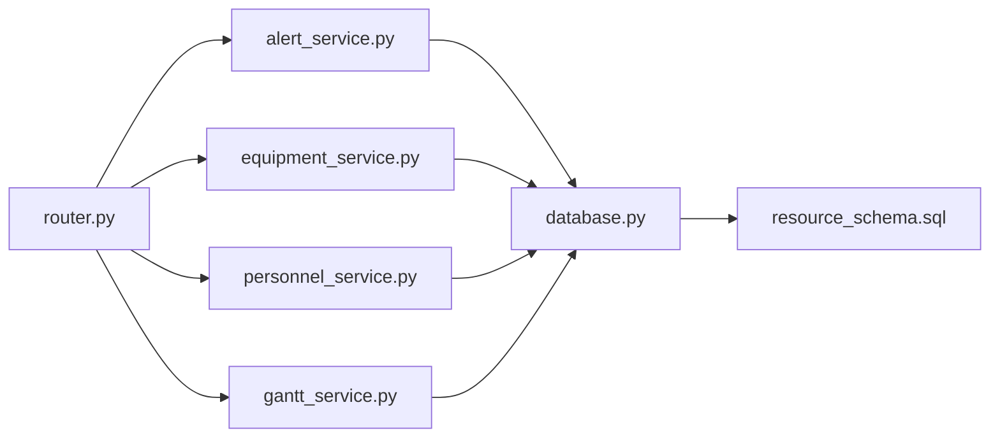

# 实时监控

<cite>
**本文引用的文件**
- [backend/modules/resource/services/alert_service.py](file://backend/modules/resource/services/alert_service.py)
- [backend/modules/resource/services/equipment_service.py](file://backend/modules/resource/services/equipment_service.py)
- [backend/modules/resource/services/personnel_service.py](file://backend/modules/resource/services/personnel_service.py)
- [backend/modules/resource/services/gantt_service.py](file://backend/modules/resource/services/gantt_service.py)
- [backend/modules/resource/router.py](file://backend/modules/resource/router.py)
- [backend/sql/resource_schema.sql](file://backend/sql/resource_schema.sql)
- [backend/database.py](file://backend/database.py)
</cite>

## 目录
1. [简介](#简介)
2. [项目结构](#项目结构)
3. [核心组件](#核心组件)
4. [架构总览](#架构总览)
5. [详细组件分析](#详细组件分析)
6. [依赖关系分析](#依赖关系分析)
7. [性能与优化建议](#性能与优化建议)
8. [故障排查指南](#故障排查指南)
9. [结论](#结论)
10. [附录](#附录)

## 简介
本技术文档聚焦“实时监控模块”，围绕以下目标展开：
- 实时数据收集机制：传感器/设备状态接入、人员状态变更监听、事件驱动更新。
- 资源占用率计算算法：基于实际使用时间与计划时间，精确计算设备、人员、场地的利用率指标。
- 冲突预警系统：阈值设定、级别判定、通知推送的完整流程。
- 数据一致性保证：并发控制、事务管理、数据校验。
- 监控指标配置：自定义指标、告警规则、报表生成。
- 性能监控与优化：查询优化、缓存策略、内存管理等实践。

## 项目结构
后端采用 FastAPI 路由 + 服务层（services）+ 数据库访问（database）的分层架构；资源监控相关能力集中在 backend/modules/resource 下，包含设备、人员、甘特排程与冲突检测、异常预警等。数据库结构由 resource_schema.sql 定义，涵盖设备、人员、任务、排程、资源分配、冲突、预警等表。

图表来源
- [backend/modules/resource/router.py:1-200](file://backend/modules/resource/router.py#L1-L200)
- [backend/modules/resource/services/alert_service.py:1-120](file://backend/modules/resource/services/alert_service.py#L1-L120)
- [backend/modules/resource/services/equipment_service.py:1-120](file://backend/modules/resource/services/equipment_service.py#L1-L120)
- [backend/modules/resource/services/personnel_service.py:1-120](file://backend/modules/resource/services/personnel_service.py#L1-L120)
- [backend/modules/resource/services/gantt_service.py:176-259](file://backend/modules/resource/services/gantt_service.py#L176-L259)
- [backend/database.py:1-116](file://backend/database.py#L1-L116)
- [backend/sql/resource_schema.sql:13-326](file://backend/sql/resource_schema.sql#L13-L326)

章节来源
- [backend/modules/resource/router.py:1-200](file://backend/modules/resource/router.py#L1-L200)
- [backend/sql/resource_schema.sql:13-326](file://backend/sql/resource_schema.sql#L13-L326)

## 核心组件
- 设备服务：设备台账、状态维护、维护记录、统计看板。
- 人员服务：人员列表、状态、来源分布、地图位置、KPI 统计。
- 甘特服务：排程 CRUD、资源分配、冲突检测、关键路径计算、批量状态更新。
- 预警服务：预警创建/查询/升级/批量处理、SLA 超时软计算、统计汇总。
- 数据库层：连接池、统一读写封装、自动提交/回滚。

章节来源
- [backend/modules/resource/services/equipment_service.py:11-103](file://backend/modules/resource/services/equipment_service.py#L11-L103)
- [backend/modules/resource/services/personnel_service.py:24-124](file://backend/modules/resource/services/personnel_service.py#L24-L124)
- [backend/modules/resource/services/gantt_service.py:396-525](file://backend/modules/resource/services/gantt_service.py#L396-L525)
- [backend/modules/resource/services/alert_service.py:188-254](file://backend/modules/resource/services/alert_service.py#L188-L254)
- [backend/database.py:51-116](file://backend/database.py#L51-L116)

## 架构总览
实时监控的数据流遵循“采集/上报 → 存储 → 计算/检测 → 展示/预警”的闭环：
- 设备/人员状态通过 API 或外部系统写入 equipment/personnel/tasks 表。
- 甘特排程与资源分配在 gantt_schedules/gantt_resource_allocations 中建模。
- 冲突检测服务扫描资源占用重叠、依赖缺失、截止日期风险等，写入 gantt_conflicts。
- 预警服务对 SLA 超期、严重级别进行软计算与统计，支持人工上报与系统自动触发。
- 前端通过 router 暴露的 REST 接口获取看板、报表与预警数据。

图表来源
- [backend/modules/resource/router.py:58-129](file://backend/modules/resource/router.py#L58-L129)
- [backend/modules/resource/services/gantt_service.py:775-1076](file://backend/modules/resource/services/gantt_service.py#L775-L1076)
- [backend/modules/resource/services/alert_service.py:337-399](file://backend/modules/resource/services/alert_service.py#L337-L399)
- [backend/database.py:51-116](file://backend/database.py#L51-L116)
- [backend/sql/resource_schema.sql:114-163](file://backend/sql/resource_schema.sql#L114-L163)

## 详细组件分析

### 实时数据收集与事件驱动更新
- 设备状态接入：通过设备状态更新接口将设备状态（空闲/占用/故障/维护）写入 equipment 表，并记录当前任务与操作员。
- 人员状态监听：人员状态（工作中/空闲/离线）与所在区域、当前任务关联，用于看板与地图展示。
- 事件驱动更新：当设备/人员状态变化时，可触发后续逻辑（如冲突检测、预警），例如在排程变更或资源分配变更后运行冲突检测，刷新 has_conflict/conflict_count。

图表来源
- [backend/modules/resource/services/equipment_service.py:262-301](file://backend/modules/resource/services/equipment_service.py#L262-L301)
- [backend/modules/resource/services/personnel_service.py:286-322](file://backend/modules/resource/services/personnel_service.py#L286-L322)
- [backend/modules/resource/services/gantt_service.py:775-1076](file://backend/modules/resource/services/gantt_service.py#L775-L1076)

章节来源
- [backend/modules/resource/services/equipment_service.py:262-301](file://backend/modules/resource/services/equipment_service.py#L262-L301)
- [backend/modules/resource/services/personnel_service.py:286-322](file://backend/modules/resource/services/personnel_service.py#L286-L322)
- [backend/modules/resource/services/gantt_service.py:775-1076](file://backend/modules/resource/services/gantt_service.py#L775-L1076)

### 资源占用率计算算法
- 设备利用率：基于设备状态分布（busy/idle/error/maintenance）与总数计算占用率；结合维护记录与任务占用情况评估有效利用率。
- 人员利用率：根据人员状态（working/idle/offline）与所在区域，计算在岗人数、空闲可调配人数、今日工时估算。
- 场地/区域利用率：基于排程与资源分配的时间段重叠，统计区域/场地在计划时段内的占用比例。
- 进度与工时：排程的计划工时与实际工时用于计算进度百分比；若未手动覆盖，进度按实际/计划自动计算。

图表来源
- [backend/modules/resource/services/gantt_service.py:100-141](file://backend/modules/resource/services/gantt_service.py#L100-L141)
- [backend/modules/resource/services/equipment_service.py:304-335](file://backend/modules/resource/services/equipment_service.py#L304-L335)
- [backend/modules/resource/services/personnel_service.py:325-379](file://backend/modules/resource/services/personnel_service.py#L325-L379)

章节来源
- [backend/modules/resource/services/gantt_service.py:100-141](file://backend/modules/resource/services/gantt_service.py#L100-L141)
- [backend/modules/resource/services/equipment_service.py:304-335](file://backend/modules/resource/services/equipment_service.py#L304-L335)
- [backend/modules/resource/services/personnel_service.py:325-379](file://backend/modules/resource/services/personnel_service.py#L325-L379)

### 冲突预警系统工作原理
- 冲突类型：资源重叠（同一资源在同一时间段被多个排程占用）、时间重叠（同场地设备/区域重叠）、依赖缺失（前置任务未完成即开始后续任务）、截止日期风险（逾期风险）。
- 阈值与级别：根据重叠小时数划分严重级别（>4h为critical，>1h为medium，>0.5h为low）；截止日期风险按逾期天数划分级别。
- 保存与更新：检测到的冲突写入 gantt_conflicts，并更新对应排程的 has_conflict 与 conflict_count。
- 解决与忽略：支持解决冲突（记录解决方式、解决人、时间）或忽略冲突，同时清理排程冲突标记。

图表来源
- [backend/modules/resource/services/gantt_service.py:775-1076](file://backend/modules/resource/services/gantt_service.py#L775-L1076)
- [backend/modules/resource/services/gantt_service.py:1159-1247](file://backend/modules/resource/services/gantt_service.py#L1159-L1247)
- [backend/sql/resource_schema.sql:288-325](file://backend/sql/resource_schema.sql#L288-L325)

章节来源
- [backend/modules/resource/services/gantt_service.py:775-1076](file://backend/modules/resource/services/gantt_service.py#L775-L1076)
- [backend/modules/resource/services/gantt_service.py:1159-1247](file://backend/modules/resource/services/gantt_service.py#L1159-L1247)
- [backend/sql/resource_schema.sql:288-325](file://backend/sql/resource_schema.sql#L288-L325)

### 数据一致性保证机制
- 并发控制：数据库连接池复用连接，写操作使用 execute/execute_last_id 并在成功时 commit，失败时 rollback，避免脏写。
- 事务管理：每个写操作封装为独立事务，确保单条语句原子性；批量更新使用 IN 子句减少往返。
- 数据校验：服务层对枚举值（状态、类型、级别）进行严格校验，防止非法数据入库；唯一键约束（如 alert_code、schedule_code、allocation_code）避免重复。
- 软计算与硬约束：SLA 超期、冲突严重级别等为软计算（不直接改库），仅展示与统计；硬约束通过数据库索引与唯一键保障。

章节来源
- [backend/database.py:73-116](file://backend/database.py#L73-L116)
- [backend/modules/resource/services/alert_service.py:188-254](file://backend/modules/resource/services/alert_service.py#L188-L254)
- [backend/modules/resource/services/gantt_service.py:1079-1142](file://backend/modules/resource/services/gantt_service.py#L1079-L1142)
- [backend/sql/resource_schema.sql:114-163](file://backend/sql/resource_schema.sql#L114-L163)

### 监控指标配置方法
- 自定义指标定义：可通过排程字段（任务类型、阶段、优先级、装配场地）与资源分配（资源类型、数量、工时）组合定义指标维度。
- 告警规则设置：基于 SLA 级别与超时阈值（critical/high/medium/low）自动计算剩余时间与是否超期；冲突严重级别作为告警依据。
- 报表生成：提供统计接口（如预警统计、设备统计、甘特统计），支持按级别、状态、类型、周趋势等多维聚合。

章节来源
- [backend/modules/resource/services/alert_service.py:337-399](file://backend/modules/resource/services/alert_service.py#L337-L399)
- [backend/modules/resource/services/equipment_service.py:304-335](file://backend/modules/resource/services/equipment_service.py#L304-L335)
- [backend/modules/resource/services/gantt_service.py:269-335](file://backend/modules/resource/services/gantt_service.py#L269-L335)

## 依赖关系分析
- 路由层依赖服务层：router.py 将 HTTP 请求转发至具体服务方法。
- 服务层依赖数据库层：所有服务通过 database.py 提供的 query_all/query_one/execute 等方法访问数据库。
- 数据库层依赖 schema：resource_schema.sql 定义了表结构与索引，支撑高效查询与统计。

图表来源
- [backend/modules/resource/router.py:1-200](file://backend/modules/resource/router.py#L1-L200)
- [backend/database.py:1-116](file://backend/database.py#L1-L116)
- [backend/sql/resource_schema.sql:13-326](file://backend/sql/resource_schema.sql#L13-L326)

章节来源
- [backend/modules/resource/router.py:1-200](file://backend/modules/resource/router.py#L1-L200)
- [backend/database.py:1-116](file://backend/database.py#L1-L116)
- [backend/sql/resource_schema.sql:13-326](file://backend/sql/resource_schema.sql#L13-L326)

## 性能与优化建议
- 查询优化：
  - 利用索引：设备/人员/排程/冲突表已建立常用字段索引（状态、区域、时间范围），建议在高频筛选条件上保持索引命中。
  - 分页与过滤：服务层普遍使用 LIMIT/OFFSET 与 WHERE 条件，避免全表扫描。
- 缓存策略：
  - 对统计类接口（如预警统计、设备统计）可引入短期缓存（如分钟级），降低频繁聚合查询压力。
  - 对看板热点数据（如设备状态分布）可使用内存缓存或 Redis 缓存。
- 内存管理：
  - 大结果集处理：冲突检测与排程列表查询注意分批处理，避免一次性加载过多数据导致内存峰值。
  - 日志与调试：合理控制日志级别，避免在生产环境产生过大日志开销。
- 事务与批处理：
  - 批量更新使用 IN 子句减少往返次数；复杂多步写操作考虑拆分事务边界，提高吞吐。

[本节为通用性能指导，无需特定文件引用]

## 故障排查指南
- 数据库连接问题：检查 .env 配置（DB_HOST/PORT/USER/PASSWORD/DATABASE），连接池初始化失败会抛出明确错误信息。
- 数据校验失败：服务层对枚举值进行校验，出现无效值时会返回错误提示，需修正输入。
- 冲突检测异常：查看冲突检测日志，确认排程时间解析与重叠计算是否正确；必要时缩小装配场地范围定位问题。
- 预警超期误判：SLA 超期为软计算，仅影响展示与统计；如需硬约束，可在业务层增加强制校验。

章节来源
- [backend/database.py:12-43](file://backend/database.py#L12-L43)
- [backend/modules/resource/services/alert_service.py:188-254](file://backend/modules/resource/services/alert_service.py#L188-L254)
- [backend/modules/resource/services/gantt_service.py:775-1076](file://backend/modules/resource/services/gantt_service.py#L775-L1076)

## 结论
实时监控模块以分层架构实现设备、人员、排程与冲突检测的统一管理，通过数据库索引与服务层校验保障数据一致性与查询性能。冲突预警系统基于阈值与级别判定，结合 SLA 软计算提供可视化与处理闭环。未来可进一步增强缓存与异步处理能力，提升高并发场景下的稳定性与响应速度。

[本节为总结性内容，无需特定文件引用]

## 附录
- 关键表说明：
  - equipment：设备台账与状态。
  - personnel：人员信息与状态。
  - tasks：任务管理与进度。
  - gantt_schedules：排程计划与依赖。
  - gantt_resource_allocations：资源分配与占用。
  - gantt_conflicts：冲突检测与处理。
  - alerts：异常预警与 SLA。

章节来源
- [backend/sql/resource_schema.sql:13-326](file://backend/sql/resource_schema.sql#L13-L326)