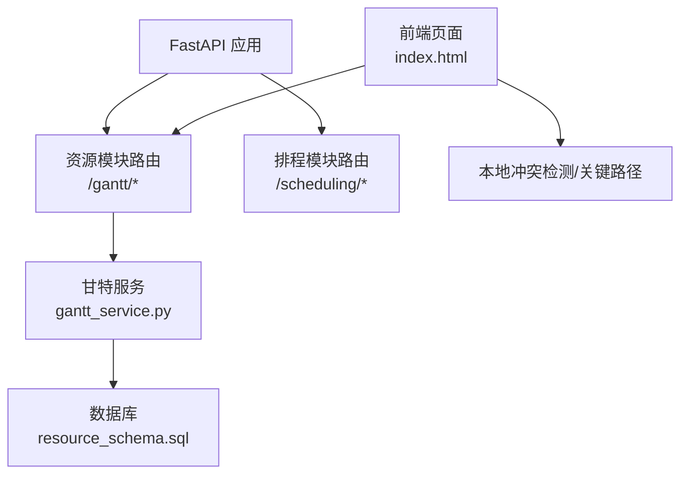
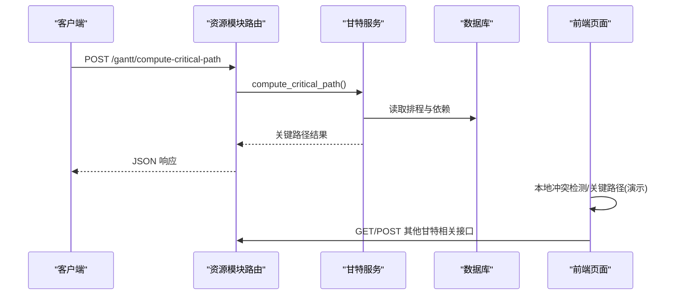
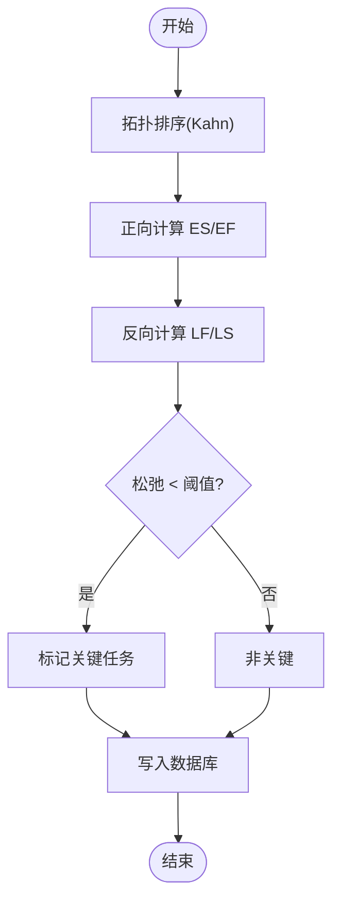
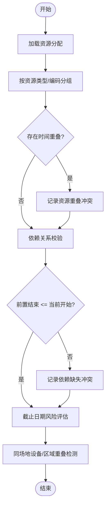
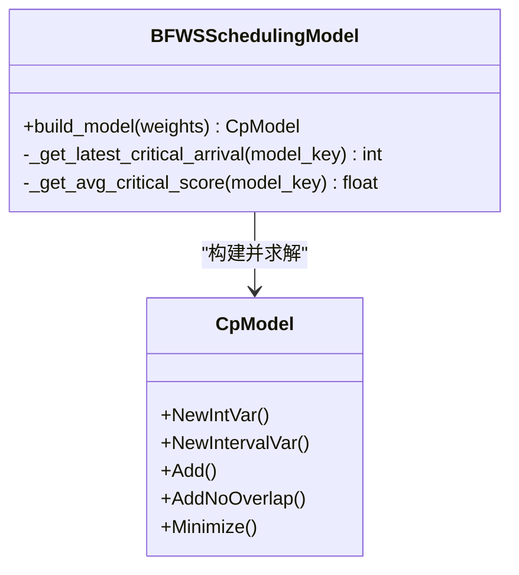
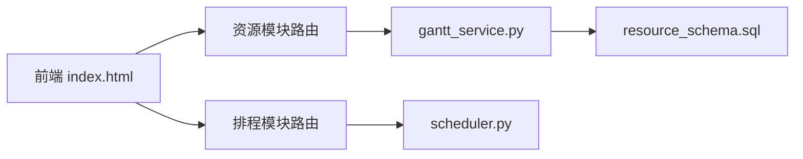

# 调度算法引擎

<cite>
**本文引用的文件**
- [scheduler.py](file://backend/scheduling/scheduler.py)
- [router.py（排程模块）](file://backend/scheduling/router.py)
- [gantt_service.py](file://backend/modules/resource/services/gantt_service.py)
- [router.py（资源模块）](file://backend/modules/resource/router.py)
- [resource_schema.sql](file://backend/sql/resource_schema.sql)
- [index.html（前端甘特与冲突检测）](file://static/index.html)
- [需求文档_V3_BFWS_CPSAT.md](file://需求文档_V3_BFWS_CPSAT.md)
</cite>

## 目录
1. [简介](#简介)
2. [项目结构](#项目结构)
3. [核心组件](#核心组件)
4. [架构总览](#架构总览)
5. [详细组件分析](#详细组件分析)
6. [依赖关系分析](#依赖关系分析)
7. [性能考量](#性能考量)
8. [故障排查指南](#故障排查指南)
9. [结论](#结论)
10. [附录](#附录)

## 简介
本技术文档围绕“调度算法引擎”展开，聚焦于 BFWS（阻塞流水车间）+ CP-SAT 的排程能力、资源冲突检测、关键路径计算、排程优化策略与配置调优。当前仓库已实现：
- 基于拓扑排序的关键路径计算（ES/EF/LF/LS），并持久化到数据库；
- 多维资源冲突检测（时间重叠、资源占用冲突、依赖关系校验、截止日期风险、同场地设备/区域冲突）；
- 前端与后端联动的冲突展示与处理；
- 面向未来的 BFWS + CP-SAT 建模设计与 API 契约（需求文档中给出）。

该引擎将“经验式推荐”升级为“数学精确排程”，支持多目标优化、鲁棒性分析与可视化反馈。

## 项目结构
- 后端服务层
  - 排程模块路由：提供健康检查等占位接口，为后续扩展预留入口。
  - 资源模块服务：实现甘特图数据管理、冲突检测、关键路径计算、状态批量更新等。
  - 数据库模式：定义冲突表结构与索引，支撑高效查询与统计。
- 前端交互
  - 本地冲突检测与关键路径计算脚本，用于快速预览与演示。
- 需求与设计
  - BFWS + CP-SAT 的设计文档，包含模型构建、API 契约、实施路线与性能预期。

图表来源
- [router.py（资源模块）:1177-1454](file://backend/modules/resource/router.py#L1177-L1454)
- [gantt_service.py:800-999](file://backend/modules/resource/services/gantt_service.py#L800-L999)
- [resource_schema.sql:307-325](file://backend/sql/resource_schema.sql#L307-L325)
- [index.html:11348-11431](file://static/index.html#L11348-L11431)

章节来源
- [router.py（排程模块）:1-14](file://backend/scheduling/router.py#L1-L14)
- [gantt_service.py:800-999](file://backend/modules/resource/services/gantt_service.py#L800-L999)
- [resource_schema.sql:307-325](file://backend/sql/resource_schema.sql#L307-L325)
- [index.html:11348-11431](file://static/index.html#L11348-L11431)

## 核心组件
- 关键路径计算（CPM）
  - 使用 Kahn 拓扑排序计算 ES/EF/LF/LS，识别关键任务（松弛接近零的任务），并写回数据库字段 is_critical、slack_hours。
- 资源冲突检测
  - 按资源类型与编码分组，检测时间区间重叠，判定严重级别；
  - 校验前置依赖是否满足（前序结束时间不得晚于当前开始时间）；
  - 检测截止日期风险（进行中或待执行任务的计划结束时间早于今天一定阈值）；
  - 同场地设备/区域重叠检测。
- 排程优化策略（设计态）
  - BFWS 约束建模：工序顺序约束、工位无重叠约束、关键件到货时间约束；
  - 多目标优化：最小化完工时间与加权等待惩罚（齐套率、风险权重可调）；
  - 鲁棒性分析：乐观/基准/悲观场景对比。
- 配置参数（设计态）
  - 求解时限、权重系数、What-if 参数（零件延迟偏移）、是否启用鲁棒性分析。

章节来源
- [gantt_service.py:1300-1372](file://backend/modules/resource/services/gantt_service.py#L1300-L1372)
- [gantt_service.py:800-999](file://backend/modules/resource/services/gantt_service.py#L800-L999)
- [需求文档_V3_BFWS_CPSAT.md:395-496](file://需求文档_V3_BFWS_CPSAT.md#L395-L496)
- [需求文档_V3_BFWS_CPSAT.md:347-393](file://需求文档_V3_BFWS_CPSAT.md#L347-L393)

## 架构总览
系统由 FastAPI 暴露 REST 接口，调用资源模块服务完成冲突检测与关键路径计算；数据库存储排程与冲突结果；前端提供可视化与本地快速验证。BFWS + CP-SAT 作为未来精确求解器集成点，通过统一 API 接入。

图表来源
- [router.py（资源模块）:1400-1408](file://backend/modules/resource/router.py#L1400-L1408)
- [gantt_service.py:1300-1372](file://backend/modules/resource/services/gantt_service.py#L1300-L1372)
- [index.html:11379-11426](file://static/index.html#L11379-L11426)

## 详细组件分析

### 关键路径计算（CPM）
- 算法要点
  - 拓扑排序：Kahn 算法生成任务执行顺序；
  - 正向遍历：计算最早开始 ES 与最早结束 EF；
  - 反向遍历：计算最迟开始 LS 与最迟结束 LF；
  - 关键任务判定：松弛 slack = LS - ES，小于阈值视为关键；
  - 持久化：更新 is_critical 与 slack_hours。
- 复杂度
  - 拓扑排序 O(V+E)，ES/EF/LF/LS 线性扫描，整体 O(V+E)。
- 错误处理
  - 异常捕获并返回空结果，避免中断流程。

图表来源
- [gantt_service.py:1300-1372](file://backend/modules/resource/services/gantt_service.py#L1300-L1372)

章节来源
- [gantt_service.py:1300-1372](file://backend/modules/resource/services/gantt_service.py#L1300-L1372)

### 资源冲突检测
- 时间重叠检测
  - 对同一资源的分配区间进行两两比较，计算重叠起止与时长；
  - 根据重叠时长设定严重级别（critical/medium/low）。
- 资源占用冲突识别
  - 按 resource_type + resource_code 分组，检测同一资源在同一时段被多个任务占用；
  - 生成建议（改期或更换资源）。
- 依赖关系验证
  - 校验前置任务结束时间不得晚于当前任务开始时间；
  - 若违反，记录 dependency_miss 冲突与建议。
- 截止日期风险
  - 对 pending/in_progress 任务，若计划结束时间早于今天超过阈值，标记 deadline_risk。
- 同场地设备/区域冲突
  - 按 assembly_site + equipment/zone 分组，检测同一场地内设备或区域的时间重叠。

图表来源
- [gantt_service.py:800-999](file://backend/modules/resource/services/gantt_service.py#L800-L999)
- [resource_schema.sql:307-325](file://backend/sql/resource_schema.sql#L307-L325)

章节来源
- [gantt_service.py:800-999](file://backend/modules/resource/services/gantt_service.py#L800-L999)
- [resource_schema.sql:307-325](file://backend/sql/resource_schema.sql#L307-L325)

### BFWS 建模与 CP-SAT 求解（设计态）
- 物理建模
  - 工序顺序约束：start(m, s+1) >= end(m, s)；
  - 工位无重叠：AddNoOverlap 保证同一工位不重叠；
  - 关键件到货约束：首工位开始时间不早于最晚关键件到达时间。
- 决策变量
  - 每个车型在每个工位的 start/end 与 interval。
- 目标函数
  - 最小化 makespan 与加权等待惩罚（齐套率、风险权重可配置）。
- 鲁棒性分析
  - 乐观/基准/悲观三场景并行求解，输出对比报告。

图表来源
- [需求文档_V3_BFWS_CPSAT.md:395-496](file://需求文档_V3_BFWS_CPSAT.md#L395-L496)

章节来源
- [需求文档_V3_BFWS_CPSAT.md:395-496](file://需求文档_V3_BFWS_CPSAT.md#L395-L496)

### 排程优化策略（设计态）
- 优先级排序
  - 基于齐套率与风险评分加权，优先安排高风险/高齐套任务以减少等待惩罚。
- 资源平衡
  - 通过 AddNoOverlap 与资源分组，避免同一资源时间重叠。
- 负载均衡
  - 在目标函数中引入加工时长与等待惩罚，平衡各工位负载。
- What-if 分析
  - 调整零件到货偏移，评估对总工期与关键路径的影响。

章节来源
- [需求文档_V3_BFWS_CPSAT.md:347-393](file://需求文档_V3_BFWS_CPSAT.md#L347-L393)
- [需求文档_V3_BFWS_CPSAT.md:395-496](file://需求文档_V3_BFWS_CPSAT.md#L395-L496)

### 配置参数说明（设计态）
- 求解模式
  - 快速模式（规则引擎）：响应快，适合预览；
  - 精确模式（CP-SAT）：全局优化，适合正式发布。
- 权重系数
  - makespan、processing_time、risk 的权重，影响目标函数。
- 求解时限
  - 硬时限（如 30 秒），超时返回当前最优解。
- 鲁棒性分析
  - 可选开关，输出乐观/基准/悲观对比。
- What-if 参数
  - 零件延迟天数覆盖，用于敏感性分析。

章节来源
- [需求文档_V3_BFWS_CPSAT.md:347-393](file://需求文档_V3_BFWS_CPSAT.md#L347-L393)

## 依赖关系分析
- 路由与服务
  - 资源模块路由调用 gantt_service 提供的关键路径计算与冲突检测；
  - 排程模块路由目前提供健康检查，为后续扩展预留。
- 数据访问
  - 冲突检测与关键路径计算均依赖数据库表结构与索引；
  - 冲突表包含类型、严重级别、状态、检测时间等字段，便于追踪与统计。
- 前端联动
  - 前端具备本地冲突检测与关键路径计算逻辑，用于快速演示与交互。

图表来源
- [router.py（资源模块）:1177-1454](file://backend/modules/resource/router.py#L1177-L1454)
- [router.py（排程模块）:1-14](file://backend/scheduling/router.py#L1-L14)
- [gantt_service.py:800-999](file://backend/modules/resource/services/gantt_service.py#L800-L999)
- [resource_schema.sql:307-325](file://backend/sql/resource_schema.sql#L307-L325)
- [index.html:11348-11431](file://static/index.html#L11348-L11431)

章节来源
- [router.py（资源模块）:1177-1454](file://backend/modules/resource/router.py#L1177-L1454)
- [router.py（排程模块）:1-14](file://backend/scheduling/router.py#L1-L14)
- [gantt_service.py:800-999](file://backend/modules/resource/services/gantt_service.py#L800-L999)
- [resource_schema.sql:307-325](file://backend/sql/resource_schema.sql#L307-L325)
- [index.html:11348-11431](file://static/index.html#L11348-L11431)

## 性能考量
- 冲突检测
  - 按资源分组后两两比较，时间复杂度 O(N^2)（N 为分配数），可通过索引与过滤减少输入规模；
  - 严重级别阈值控制，避免低价值冲突噪声。
- 关键路径计算
  - 拓扑排序与线性扫描，复杂度 O(V+E)，适合大规模任务图；
  - 批量更新数据库，减少 I/O 次数。
- 求解器（设计态）
  - 设置求解时限与初始解注入，提升收敛速度；
  - 多场景并行求解，利用 Anytime 特性返回当前最优。
- 缓存与增量更新
  - 对频繁查询的资源分配与依赖关系可考虑缓存；
  - 增量更新仅重算受影响子图，降低计算成本。

[本节为通用性能指导，不直接分析具体代码文件]

## 故障排查指南
- 关键路径计算失败
  - 检查依赖关系是否存在环；
  - 确认任务工时与时间戳格式正确；
  - 查看日志中的异常堆栈，定位数据库查询或计算环节问题。
- 冲突检测不准确
  - 核对资源分配的开始/结束时间是否有效；
  - 检查分组键（resource_type, resource_code）是否正确；
  - 验证依赖前置任务是否存在且时间戳合理。
- 截止日期风险误报
  - 确认任务状态是否为 pending/in_progress；
  - 检查计划结束时间是否准确，必要时修正实际进度。

章节来源
- [gantt_service.py:1300-1372](file://backend/modules/resource/services/gantt_service.py#L1300-L1372)
- [gantt_service.py:800-999](file://backend/modules/resource/services/gantt_service.py#L800-L999)

## 结论
本调度算法引擎在当前阶段已实现关键路径计算与多维资源冲突检测，为装配排程提供了可靠的诊断与分析基础。结合需求文档中的 BFWS + CP-SAT 设计，下一步将引入精确求解器，实现全局优化与鲁棒性分析，进一步提升排程质量与可解释性。

[本节为总结性内容，不直接分析具体代码文件]

## 附录
- API 参考（设计态）
  - POST /api/schedule/compute：提交排程请求，返回推荐顺序、甘特数据与鲁棒性报告。
- 数据模型
  - 冲突表字段包括冲突类型、严重级别、重叠时间、建议、状态、检测时间等，便于追踪与处理。
- 前端功能
  - 本地冲突检测与关键路径计算脚本，用于快速演示与交互。

章节来源
- [需求文档_V3_BFWS_CPSAT.md:347-393](file://需求文档_V3_BFWS_CPSAT.md#L347-L393)
- [resource_schema.sql:307-325](file://backend/sql/resource_schema.sql#L307-L325)
- [index.html:11348-11431](file://static/index.html#L11348-L11431)