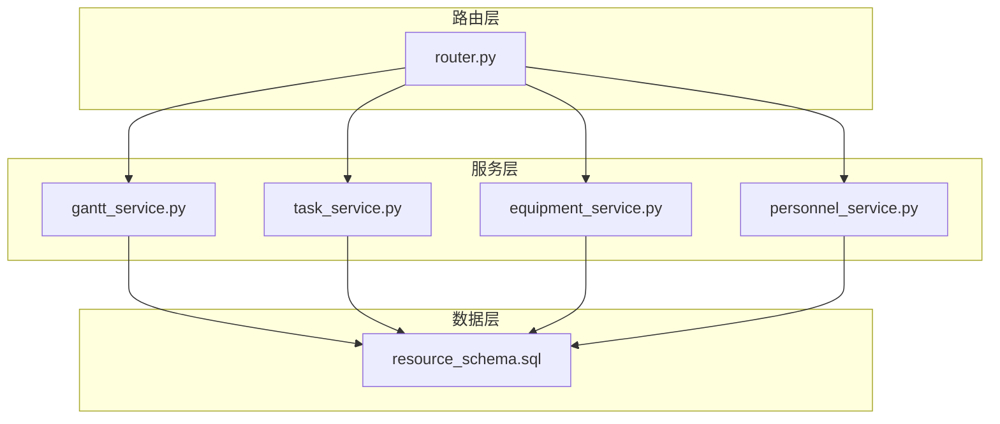
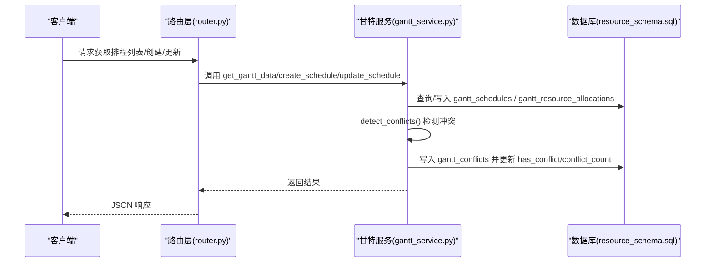
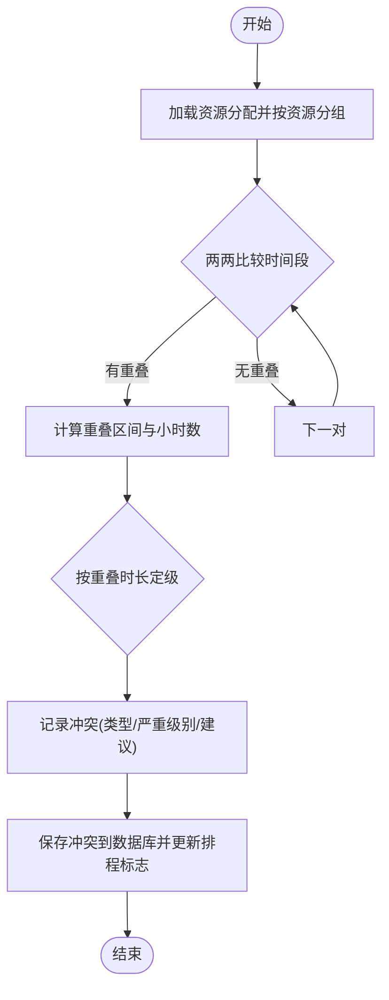
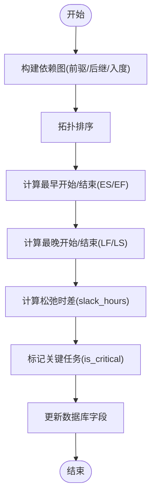
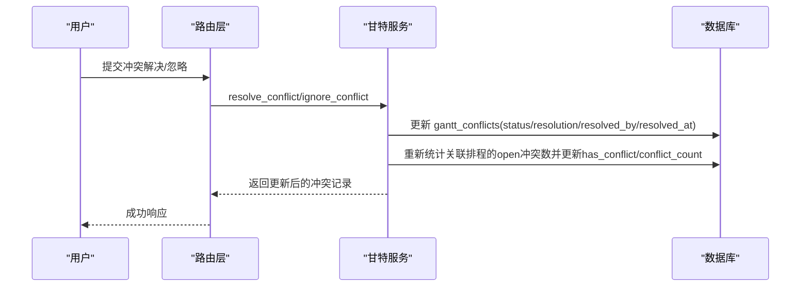
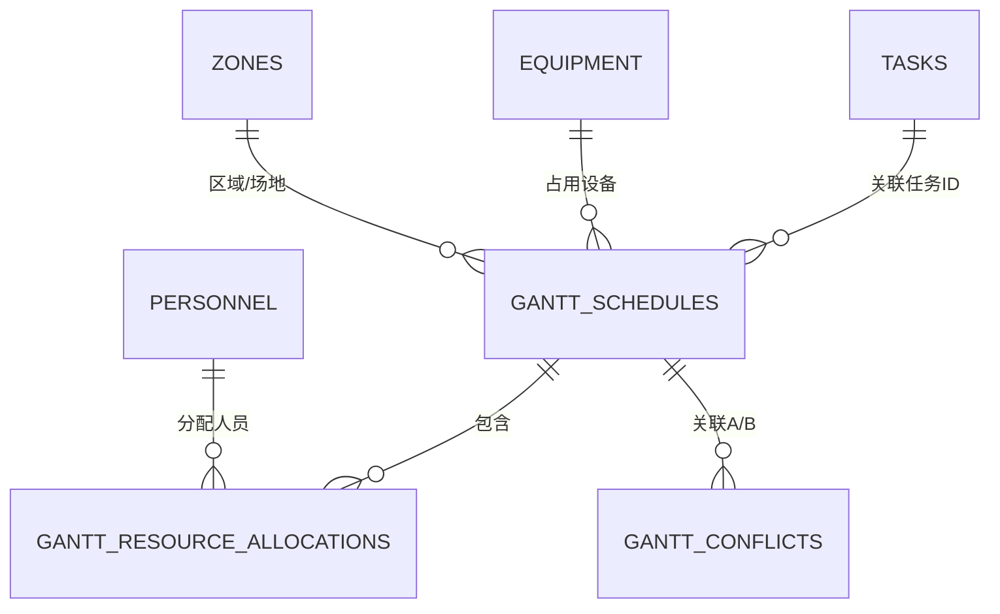

# 资源分配矩阵

<cite>
**本文引用的文件**
- [gantt_service.py](file://backend/modules/resource/services/gantt_service.py)
- [router.py](file://backend/modules/resource/router.py)
- [schemas.py](file://backend/modules/resource/schemas.py)
- [task_service.py](file://backend/modules/resource/services/task_service.py)
- [equipment_service.py](file://backend/modules/resource/services/equipment_service.py)
- [personnel_service.py](file://backend/modules/resource/services/personnel_service.py)
- [resource_schema.sql](file://backend/sql/resource_schema.sql)
</cite>

## 目录
1. [简介](#简介)
2. [项目结构](#项目结构)
3. [核心组件](#核心组件)
4. [架构总览](#架构总览)
5. [详细组件分析](#详细组件分析)
6. [依赖关系分析](#依赖关系分析)
7. [性能考虑](#性能考虑)
8. [故障排查指南](#故障排查指南)
9. [结论](#结论)
10. [附录](#附录)

## 简介
本技术文档围绕“资源分配矩阵”的生成与运维，系统阐述以下关键能力：
- 资源-时间二维映射：将任务、设备、人员、区域等资源在时间轴上进行排程与可视化。
- 容量约束检查：基于资源分配表进行重叠检测、同场地/同设备/同区域冲突识别。
- 最优分配计算：通过关键路径计算（拓扑排序+最早/最晚开始/结束）识别关键任务与松弛时差；规划中预留 BFWS + CP-SAT 扩展接口以支持全局优化求解。
- 冲突解决策略：优先级调度、时间平移、资源替换等建议与处理流程。
- 实时更新机制：增量计算（按装配场地过滤）、缓存式统计、并发安全的数据库事务化更新。
- 用户交互：手动调整、批量操作、撤销重做（状态回滚与依赖环检测）。
- 导出与分析：提供分页查询、统计聚合、趋势分析等数据能力，便于对接 Excel 导出与透视分析。
- 性能优化：分页加载、索引设计、批量更新、异步计算预留。

## 项目结构
后端采用 FastAPI 路由层 + 服务层 + 数据层的分层架构，资源管理模块位于 backend/modules/resource，包含设备、人员、任务、甘特图排程与冲突检测等服务。数据库定义集中在 backend/sql/resource_schema.sql。

**图表来源**
- [router.py:1-800](file://backend/modules/resource/router.py#L1-L800)
- [gantt_service.py:176-258](file://backend/modules/resource/services/gantt_service.py#L176-L258)
- [resource_schema.sql:202-325](file://backend/sql/resource_schema.sql#L202-L325)

**章节来源**
- [router.py:1-800](file://backend/modules/resource/router.py#L1-L800)
- [resource_schema.sql:1-326](file://backend/sql/resource_schema.sql#L1-L326)

## 核心组件
- 甘特排程服务（gantt_service.py）：负责排程 CRUD、冲突检测、关键路径计算、批量状态更新、资源分配管理。
- 任务服务（task_service.py）：任务 CRUD、进度自动计算、统计与趋势分析。
- 设备服务（equipment_service.py）：设备台账、维护记录、状态统计。
- 人员服务（personnel_service.py）：人员看板、来源分布、位置分布。
- 路由（router.py）：对外 API，统一封装请求参数与响应格式。
- 数据模型（schemas.py）：Pydantic 模型用于输入校验与输出结构。

**章节来源**
- [gantt_service.py:176-258](file://backend/modules/resource/services/gantt_service.py#L176-L258)
- [task_service.py:48-146](file://backend/modules/resource/services/task_service.py#L48-L146)
- [equipment_service.py:11-103](file://backend/modules/resource/services/equipment_service.py#L11-L103)
- [personnel_service.py:24-124](file://backend/modules/resource/services/personnel_service.py#L24-L124)
- [router.py:646-800](file://backend/modules/resource/router.py#L646-L800)
- [schemas.py:121-178](file://backend/modules/resource/schemas.py#L121-L178)

## 架构总览
资源分配矩阵的核心流程包括：
- 资源-时间二维映射：通过 gantt_resource_allocations 将资源（设备、人员、区域、吊车、物料等）与时间段绑定，形成矩阵单元。
- 容量约束检查：对同一资源在同一时间段的重叠进行检测，判定冲突类型与严重级别。
- 最优分配计算：基于前置依赖与计划工时，计算关键路径与松弛时差，标记关键任务。
- 冲突解决：根据冲突类型给出建议（时间平移、资源替换），并支持人工解决或忽略。
- 实时更新：按装配场地增量扫描冲突，保存冲突记录并更新排程的冲突计数与标志位。

**图表来源**
- [router.py:646-800](file://backend/modules/resource/router.py#L646-L800)
- [gantt_service.py:176-258](file://backend/modules/resource/services/gantt_service.py#L176-L258)
- [gantt_service.py:775-1076](file://backend/modules/resource/services/gantt_service.py#L775-L1076)
- [resource_schema.sql:202-325](file://backend/sql/resource_schema.sql#L202-L325)

## 详细组件分析

### 资源-时间二维映射与容量约束检查
- 资源分配表（gantt_resource_allocations）：每条记录表示某资源在某时间段的使用情况，含资源类型、编码、名称、起止时间、分配工时、数量、优先级、状态等。
- 冲突检测（detect_conflicts）：
  - 资源重叠：按资源类型+编码分组，两两比较时间段是否重叠，计算重叠区间与小时数，按重叠时长设定严重级别。
  - 依赖缺失：检查前置任务的结束时间是否晚于当前任务开始时间，提示调整前置或延后当前。
  - 截止日期风险：对比计划结束时间与当前日期，超期天数决定严重级别。
  - 同场地设备/区域重叠：按装配场地+资源键分组，检测多任务在同一场地/设备的时段重叠。
- 容量约束：通过资源分配的时间段与数量字段实现容量控制；冲突检测确保不超容。

**图表来源**
- [gantt_service.py:808-1076](file://backend/modules/resource/services/gantt_service.py#L808-L1076)
- [resource_schema.sql:262-325](file://backend/sql/resource_schema.sql#L262-L325)

**章节来源**
- [gantt_service.py:775-1076](file://backend/modules/resource/services/gantt_service.py#L775-L1076)
- [resource_schema.sql:262-325](file://backend/sql/resource_schema.sql#L262-L325)

### 最优分配计算（关键路径与松弛）
- 关键路径计算（compute_critical_path）：
  - 构建 DAG：解析前置依赖，建立前驱/后继关系与入度。
  - 拓扑排序：确定执行顺序。
  - 最早/最晚开始与结束：ES/EF/LF/LS 计算，得到松弛时差 slack_hours。
  - 关键任务标记：slack < 0.5 小时视为关键任务，更新 is_critical 字段。
- 进度与工时：
  - 自动进度计算：progress = min(actual_work_hours / plan_work_hours * 100, 100)，支持手动覆盖。
  - 计划工时推导：若未提供 plan_work_hours，则根据 plan_start_time 与 plan_end_time 计算。

**图表来源**
- [gantt_service.py:1255-1372](file://backend/modules/resource/services/gantt_service.py#L1255-L1372)
- [gantt_service.py:100-141](file://backend/modules/resource/services/gantt_service.py#L100-L141)
- [task_service.py:21-45](file://backend/modules/resource/services/task_service.py#L21-L45)

**章节来源**
- [gantt_service.py:1255-1372](file://backend/modules/resource/services/gantt_service.py#L1255-L1372)
- [gantt_service.py:100-141](file://backend/modules/resource/services/gantt_service.py#L100-L141)
- [task_service.py:21-45](file://backend/modules/resource/services/task_service.py#L21-L45)

### 冲突解决策略（优先级调度、时间平移、资源替换）
- 优先级调度：
  - 任务与排程均支持优先级（high/medium/low），在冲突列表中按严重级别排序展示，优先处理高严重冲突。
- 时间平移：
  - 对于资源重叠或依赖缺失，建议将任务延后至前置任务结束后或与其他任务错开时间。
- 资源替换：
  - 当某资源不可用时，建议更换为其他同类资源（如设备、区域、吊车等）。
- 解决流程：
  - resolve_conflict：标记为已解决，记录解决方式与解决人，并更新关联排程的冲突计数。
  - ignore_conflict：标记为忽略，记录原因与操作人，同样更新排程冲突计数。

**图表来源**
- [gantt_service.py:1159-1252](file://backend/modules/resource/services/gantt_service.py#L1159-L1252)
- [router.py:1177-1187](file://backend/modules/resource/router.py#L1177-L1187)

**章节来源**
- [gantt_service.py:1159-1252](file://backend/modules/resource/services/gantt_service.py#L1159-L1252)
- [router.py:1155-1187](file://backend/modules/resource/router.py#L1155-L1187)

### 实时更新机制（增量计算、缓存策略、并发访问控制）
- 增量计算：
  - detect_conflicts 支持按装配场地筛选，仅刷新该场地的开放冲突，减少全量扫描开销。
  - 自动清理：指定场地时先清空该场地的 open 冲突，再重新检测。
- 缓存策略：
  - 统计接口（get_gantt_stats、get_task_stats、get_equipment_stats、get_personnel_stats）直接聚合数据库结果，适合前端看板展示。
  - 可在上层引入 Redis 缓存热点统计，降低重复查询压力。
- 并发访问控制：
  - 使用数据库事务保证一致性（execute_last_id/execute），避免并发写导致的脏数据。
  - 批量更新（batch_update_status）逐条更新并记录日志，便于追踪。

**章节来源**
- [gantt_service.py:775-1076](file://backend/modules/resource/services/gantt_service.py#L775-L1076)
- [gantt_service.py:269-335](file://backend/modules/resource/services/gantt_service.py#L269-L335)
- [task_service.py:290-332](file://backend/modules/resource/services/task_service.py#L290-L332)
- [equipment_service.py:304-335](file://backend/modules/resource/services/equipment_service.py#L304-L335)
- [personnel_service.py:325-379](file://backend/modules/resource/services/personnel_service.py#L325-L379)
- [gantt_service.py:1375-1427](file://backend/modules/resource/services/gantt_service.py#L1375-L1427)

### 用户交互功能（手动调整、批量操作、撤销重做）
- 手动调整：
  - 支持进度手动覆盖（progress_manual_override=1），保留用户输入的进度值。
  - 支持排程字段更新（时间、优先级、状态、阶段等），自动重新计算进度与关键路径。
- 批量操作：
  - 批量更新排程状态（batch_update_status），自动填充实际开始/结束时间与进度。
  - 批量创建资源分配（batch_allocate_allocations），简化多资源分配流程。
- 撤销重做：
  - 更新依赖时进行环检测（DFS），若检测到循环依赖则回滚至原始前置列表，防止死锁。
  - 删除排程时级联删除资源分配并将相关冲突置为 ignored，保持数据一致性。

**章节来源**
- [gantt_service.py:396-525](file://backend/modules/resource/services/gantt_service.py#L396-L525)
- [gantt_service.py:553-605](file://backend/modules/resource/services/gantt_service.py#L553-L605)
- [gantt_service.py:711-724](file://backend/modules/resource/services/gantt_service.py#L711-L724)
- [gantt_service.py:1375-1427](file://backend/modules/resource/services/gantt_service.py#L1375-L1427)

### 矩阵导出与分析（Excel导出、数据透视、趋势分析）
- 数据导出：
  - 所有列表接口支持分页与筛选，可对接 Excel 导出工具（如 openpyxl）进行报表生成。
- 数据透视：
  - 任务类型与进度对比（get_type_vs_progress）、月度趋势（get_monthly_trend）、状态分布（get_status_distribution）。
  - 设备与人员看板统计（get_equipment_stats、get_personnel_stats）提供多维聚合数据。
- 趋势分析：
  - 周度趋势（weekly_trend）统计每周新增与结束任务数，辅助产能与交付节奏分析。

**章节来源**
- [task_service.py:335-432](file://backend/modules/resource/services/task_service.py#L335-L432)
- [gantt_service.py:269-335](file://backend/modules/resource/services/gantt_service.py#L269-L335)
- [equipment_service.py:304-335](file://backend/modules/resource/services/equipment_service.py#L304-L335)
- [personnel_service.py:382-475](file://backend/modules/resource/services/personnel_service.py#L382-L475)

## 依赖关系分析
- 路由层依赖服务层：router.py 调用各 service 方法，统一封装请求与响应。
- 服务层依赖数据库：所有 service 通过 database 模块执行 SQL，读取/写入 resource_schema.sql 定义的表。
- 数据表关系：
  - gantt_schedules 与 gantt_resource_allocations 一对多（一个排程对应多个资源分配）。
  - gantt_schedules 与 gantt_conflicts 多对多（冲突涉及两个排程）。
  - tasks、equipment、personnel、zones 作为基础主数据，被排程与服务引用。

**图表来源**
- [resource_schema.sql:202-325](file://backend/sql/resource_schema.sql#L202-L325)

**章节来源**
- [resource_schema.sql:202-325](file://backend/sql/resource_schema.sql#L202-L325)

## 性能考虑
- 大数据量处理：
  - 分页查询：所有列表接口支持 page/page_size，避免一次性加载过多数据。
  - 索引设计：为常用查询字段建立索引（如 schedule_id、resource_type、start_time、end_time、status、assembly_site 等）。
- 分页加载：
  - 前端按需分页，结合关键词搜索与多维度筛选，提升交互体验。
- 异步计算：
  - 关键路径计算与冲突检测可异步执行（当前为同步），建议在高频场景下引入队列（如 Celery）异步处理，避免阻塞请求。
- 缓存策略：
  - 对统计类接口增加缓存层（Redis），设置合理过期时间，降低数据库压力。
- 批量更新：
  - 使用批量更新减少数据库往返次数，提高吞吐。

[本节为通用性能指导，无需具体文件来源]

## 故障排查指南
- 冲突检测失败：
  - 检查 gantt_resource_allocations 的时间字段是否为空或无效，确保 _parse_dt 能正确解析。
  - 查看 gantt_conflicts 表的插入日志，确认 auto_save 逻辑是否生效。
- 关键路径计算异常：
  - 检查前置依赖是否存在环，update_dependencies 中的 DFS 环检测会回滚变更。
  - 确认 plan_work_hours 与时间字段是否正确，否则 ES/EF/LF/LS 计算可能失真。
- 批量状态更新问题：
  - 检查状态合法性（SCHEDULE_STATUSES），非法状态会抛出 ValueError。
  - 关注 actual_start_time/actual_end_time 的自动填充逻辑，确保状态转换符合预期。
- 数据一致性问题：
  - 删除排程时会级联删除资源分配并将相关冲突置为 ignored，确保外键与业务逻辑一致。

**章节来源**
- [gantt_service.py:775-1076](file://backend/modules/resource/services/gantt_service.py#L775-L1076)
- [gantt_service.py:1255-1372](file://backend/modules/resource/services/gantt_service.py#L1255-L1372)
- [gantt_service.py:1375-1427](file://backend/modules/resource/services/gantt_service.py#L1375-L1427)
- [gantt_service.py:528-551](file://backend/modules/resource/services/gantt_service.py#L528-L551)

## 结论
本系统实现了资源分配矩阵的核心能力：资源-时间二维映射、容量约束检查、关键路径计算与冲突检测，并提供冲突解决策略与实时更新机制。通过分页、索引与批量操作保障性能，同时为未来引入 BFWS + CP-SAT 全局优化求解预留了扩展空间。建议在生产环境中进一步引入缓存与异步计算，以提升大规模排程场景下的响应速度与稳定性。

[本节为总结性内容，无需具体文件来源]

## 附录
- 数据库表结构参考：
  - gantt_schedules：排程计划主表，包含任务信息、时间、优先级、状态、依赖、关键路径标记等。
  - gantt_resource_allocations：资源分配明细表，记录资源类型、编码、时间段、工时、数量、优先级、状态。
  - gantt_conflicts：冲突检测记录表，包含冲突类型、严重级别、重叠时间、建议、状态、解决信息等。
- API 示例：
  - 获取排程列表：GET /api/resource/tasks?page=&page_size=&task_type=&status=&priority=&assembly_site=&keyword=
  - 创建排程：POST /api/resource/tasks
  - 更新排程：PUT /api/resource/tasks/{task_id}
  - 冲突检测：POST /api/resource/conflicts/check
  - 解决冲突：POST /api/resource/conflicts/{id}/resolve
  - 忽略冲突：POST /api/resource/conflicts/{id}/ignore

**章节来源**
- [resource_schema.sql:202-325](file://backend/sql/resource_schema.sql#L202-L325)
- [router.py:646-800](file://backend/modules/resource/router.py#L646-L800)
- [router.py:1155-1187](file://backend/modules/resource/router.py#L1155-L1187)