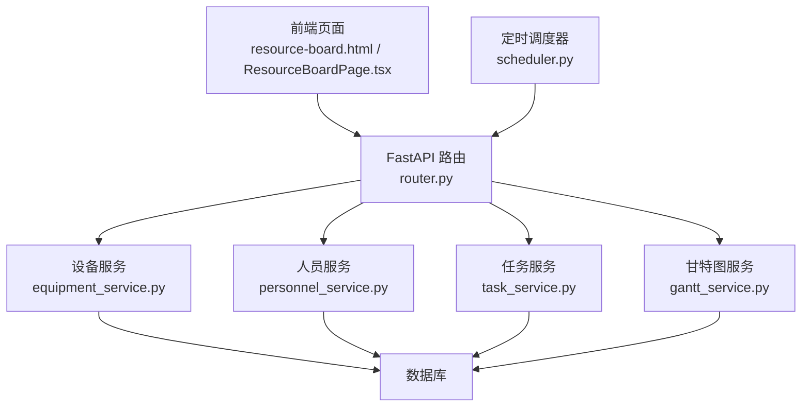
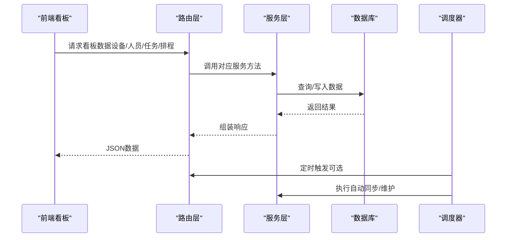
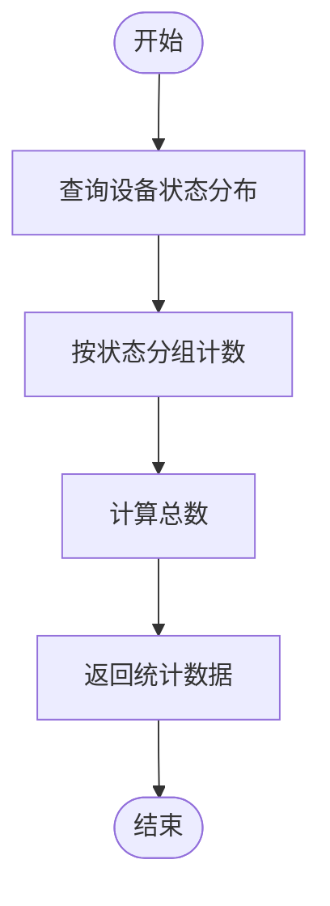
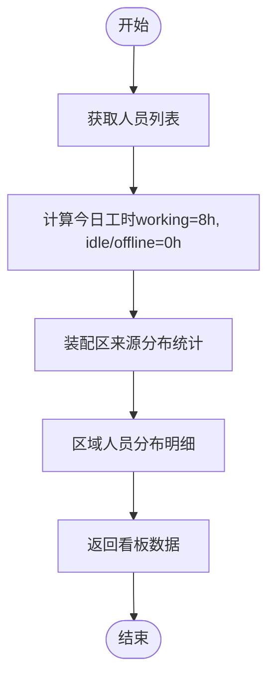
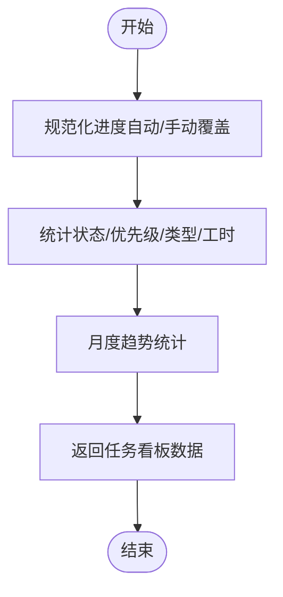
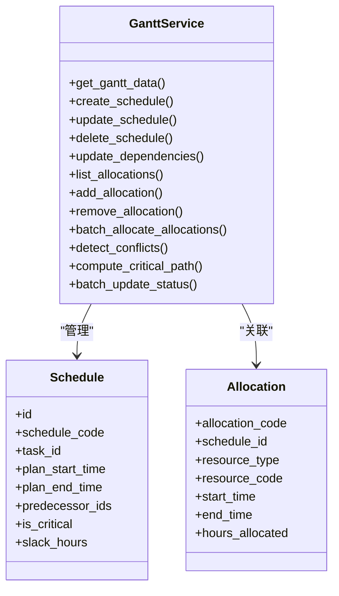
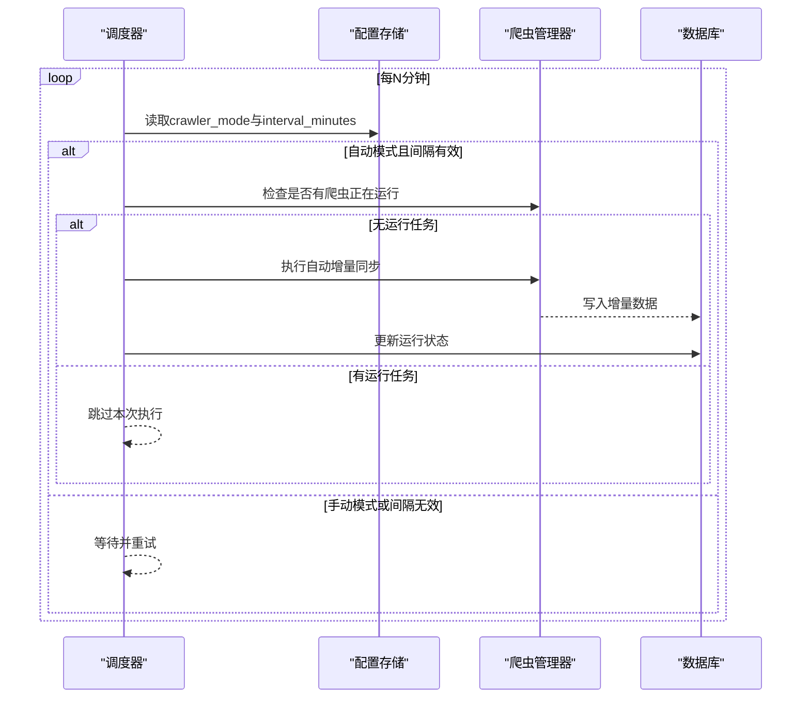
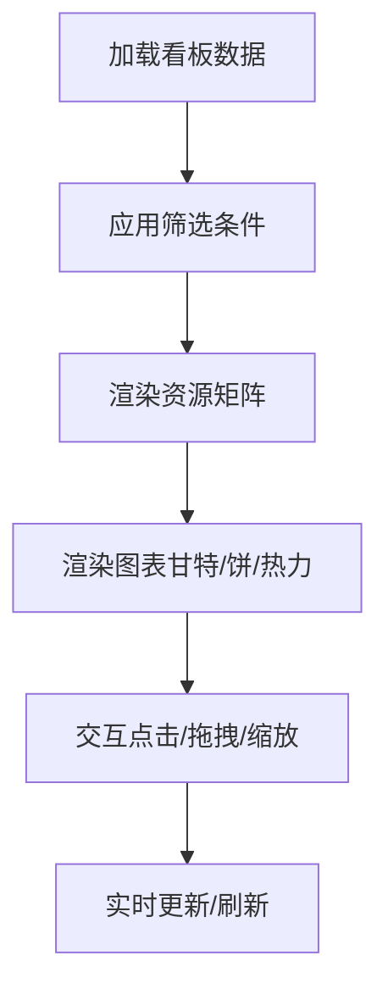
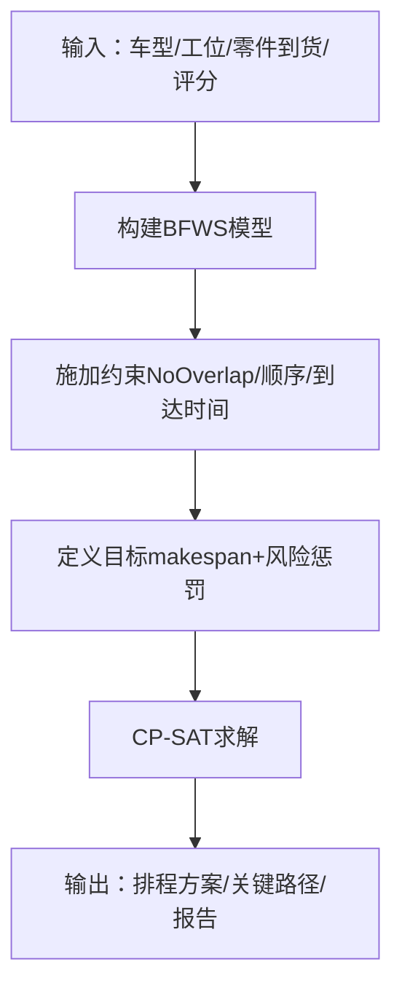
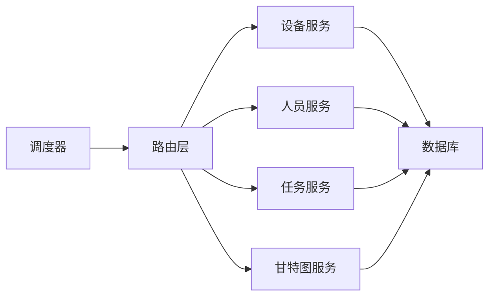

# 资源占用看板

<cite>
**本文引用的文件**
- [backend/modules/resource/router.py](file://backend/modules/resource/router.py)
- [backend/modules/resource/schemas.py](file://backend/modules/resource/schemas.py)
- [backend/modules/resource/services/equipment_service.py](file://backend/modules/resource/services/equipment_service.py)
- [backend/modules/resource/services/personnel_service.py](file://backend/modules/resource/services/personnel_service.py)
- [backend/modules/resource/services/task_service.py](file://backend/modules/resource/services/task_service.py)
- [backend/modules/resource/services/gantt_service.py](file://backend/modules/resource/services/gantt_service.py)
- [backend/scheduling/scheduler.py](file://backend/scheduling/scheduler.py)
- [backend/scheduling/router.py](file://backend/scheduling/router.py)
- [demo/resource-board.html](file://demo/resource-board.html)
- [webui_ref/client/src/pages/ResourceBoardPage/ResourceBoardPage.tsx](file://webui_ref/client/src/pages/ResourceBoardPage/ResourceBoardPage.tsx)
- [需求文档_V3_BFWS_CPSAT.md](file://需求文档_V3_BFWS_CPSAT.md)
</cite>

## 目录
1. [简介](#简介)
2. [项目结构](#项目结构)
3. [核心组件](#核心组件)
4. [架构总览](#架构总览)
5. [详细组件分析](#详细组件分析)
6. [依赖关系分析](#依赖关系分析)
7. [性能考量](#性能考量)
8. [故障排查指南](#故障排查指南)
9. [结论](#结论)
10. [附录](#附录)

## 简介
本模块为“资源占用看板”提供后端能力与前端可视化支撑，覆盖设备、人员、任务、排程（甘特图）与冲突检测等关键能力。文档聚焦以下目标：
- 资源占用率计算与统计逻辑：设备利用率、人员工时利用率、场地占用率的计算方法与数据来源。
- 排程矩阵生成机制：基于任务计划、资源约束与时间窗口的自动排程思路与实现要点。
- 实时占用监控：数据收集频率、状态同步与冲突检测算法。
- 可视化展示：甘特图、热力图、饼图等图表的应用场景与交互方式。
- 智能调度算法：BFWS建模思想与CP-SAT优化目标的规划说明（设计层面）。
- 自定义规则与预警：阈值配置、预警触发与处置流程的最佳实践。

## 项目结构
资源占用看板由后端服务层、数据库访问层、定时调度器以及前端页面组成：
- 路由层：统一暴露REST接口，承载设备、人员、任务、排程与冲突查询等操作。
- 服务层：封装业务逻辑，包括CRUD、统计指标计算、冲突检测、关键路径计算等。
- 调度器：按配置周期执行增量同步或维护任务，保障数据时效性。
- 前端：看板页面、矩阵视图、图表渲染与交互。

**图示来源**
- [backend/modules/resource/router.py:58-800](file://backend/modules/resource/router.py#L58-L800)
- [backend/modules/resource/services/equipment_service.py:11-103](file://backend/modules/resource/services/equipment_service.py#L11-L103)
- [backend/modules/resource/services/personnel_service.py:24-124](file://backend/modules/resource/services/personnel_service.py#L24-L124)
- [backend/modules/resource/services/task_service.py:48-146](file://backend/modules/resource/services/task_service.py#L48-L146)
- [backend/modules/resource/services/gantt_service.py:176-258](file://backend/modules/resource/services/gantt_service.py#L176-L258)
- [backend/scheduling/scheduler.py:93-153](file://backend/scheduling/scheduler.py#L93-L153)

**章节来源**
- [backend/modules/resource/router.py:1-800](file://backend/modules/resource/router.py#L1-L800)
- [backend/scheduling/scheduler.py:1-196](file://backend/scheduling/scheduler.py#L1-L196)
- [demo/resource-board.html:1-815](file://demo/resource-board.html#L1-L815)

## 核心组件
- 设备管理：设备台账、状态维护、维护记录、设备统计。
- 人员管理：人员信息、状态切换、来源分布、位置分布、人效统计。
- 任务管理：任务创建/更新/删除、进度自动计算、任务统计与趋势。
- 甘特图排程：排程CRUD、资源分配、冲突检测、关键路径计算、批量状态更新。
- 定时调度：按配置周期执行自动增量同步，避免与手动任务冲突。

**章节来源**
- [backend/modules/resource/services/equipment_service.py:304-335](file://backend/modules/resource/services/equipment_service.py#L304-L335)
- [backend/modules/resource/services/personnel_service.py:325-379](file://backend/modules/resource/services/personnel_service.py#L325-L379)
- [backend/modules/resource/services/task_service.py:290-332](file://backend/modules/resource/services/task_service.py#L290-L332)
- [backend/modules/resource/services/gantt_service.py:775-1076](file://backend/modules/resource/services/gantt_service.py#L775-L1076)
- [backend/scheduling/scheduler.py:93-153](file://backend/scheduling/scheduler.py#L93-L153)

## 架构总览
系统采用分层架构：
- 表现层：前端看板与图表。
- 接口层：FastAPI路由聚合各服务接口。
- 服务层：领域逻辑与算法实现（冲突检测、关键路径、统计指标）。
- 数据层：数据库访问与持久化。
- 调度层：后台定时任务驱动数据同步与状态刷新。

**图示来源**
- [backend/modules/resource/router.py:58-800](file://backend/modules/resource/router.py#L58-L800)
- [backend/modules/resource/services/gantt_service.py:775-1076](file://backend/modules/resource/services/gantt_service.py#L775-L1076)
- [backend/scheduling/scheduler.py:93-153](file://backend/scheduling/scheduler.py#L93-L153)

## 详细组件分析

### 设备利用率与统计
- 设备状态分类：idle/busy/error/maintenance。
- 统计口径：按状态分组计数，汇总总数与各状态数量，用于驾驶舱展示。
- 维护记录：支持创建、状态更新、列表分页查询；完成时自动填充结束时间。

**图示来源**
- [backend/modules/resource/services/equipment_service.py:304-335](file://backend/modules/resource/services/equipment_service.py#L304-L335)

**章节来源**
- [backend/modules/resource/services/equipment_service.py:11-103](file://backend/modules/resource/services/equipment_service.py#L11-L103)
- [backend/modules/resource/services/equipment_service.py:338-495](file://backend/modules/resource/services/equipment_service.py#L338-L495)

### 人员工时利用率与分布
- 工时估算：当前实现中，工作状态按固定工时估算（如working=8小时），空闲/离线为0；该逻辑便于快速统计，后续可接入实际打卡/工单时长。
- 来源分布：装配区与非装配区分组统计，支持饼图与柱状图展示。
- 位置分布：园区地图覆盖层使用区域人数与明细。

**图示来源**
- [backend/modules/resource/services/personnel_service.py:24-124](file://backend/modules/resource/services/personnel_service.py#L24-L124)
- [backend/modules/resource/services/personnel_service.py:382-431](file://backend/modules/resource/services/personnel_service.py#L382-L431)
- [backend/modules/resource/services/personnel_service.py:434-475](file://backend/modules/resource/services/personnel_service.py#L434-L475)

**章节来源**
- [backend/modules/resource/services/personnel_service.py:127-167](file://backend/modules/resource/services/personnel_service.py#L127-L167)
- [backend/modules/resource/services/personnel_service.py:325-379](file://backend/modules/resource/services/personnel_service.py#L325-L379)

### 任务进度与统计
- 进度计算：当未启用手动覆盖时，根据计划工时与实际工时自动计算进度百分比；支持手动覆盖模式保留用户输入。
- 统计维度：状态分布、优先级分布、类型分布、计划/实际工时合计、平均进度、月度趋势。

**图示来源**
- [backend/modules/resource/services/task_service.py:21-45](file://backend/modules/resource/services/task_service.py#L21-L45)
- [backend/modules/resource/services/task_service.py:290-332](file://backend/modules/resource/services/task_service.py#L290-L332)
- [backend/modules/resource/services/task_service.py:412-432](file://backend/modules/resource/services/task_service.py#L412-L432)

**章节来源**
- [backend/modules/resource/services/task_service.py:48-146](file://backend/modules/resource/services/task_service.py#L48-L146)
- [backend/modules/resource/services/task_service.py:177-277](file://backend/modules/resource/services/task_service.py#L177-L277)

### 排程矩阵与甘特图
- 排程CRUD：支持创建、更新、删除、依赖关系设置（含环检测）、批量状态更新。
- 资源分配：为排程项绑定设备、人员、区域等资源，支持批量分配与查询。
- 冲突检测：多维度检测资源重叠、时间重叠、前置依赖缺失、截止日期风险、同场地设备/区域重叠。
- 关键路径：基于拓扑排序与ES/EF/LF/LS计算，标记关键任务并更新松弛时间。

**图示来源**
- [backend/modules/resource/services/gantt_service.py:396-525](file://backend/modules/resource/services/gantt_service.py#L396-L525)
- [backend/modules/resource/services/gantt_service.py:608-724](file://backend/modules/resource/services/gantt_service.py#L608-L724)
- [backend/modules/resource/services/gantt_service.py:775-1076](file://backend/modules/resource/services/gantt_service.py#L775-L1076)
- [backend/modules/resource/services/gantt_service.py:1255-1372](file://backend/modules/resource/services/gantt_service.py#L1255-L1372)

**章节来源**
- [backend/modules/resource/services/gantt_service.py:176-258](file://backend/modules/resource/services/gantt_service.py#L176-L258)
- [backend/modules/resource/services/gantt_service.py:338-394](file://backend/modules/resource/services/gantt_service.py#L338-L394)
- [backend/modules/resource/services/gantt_service.py:1079-1253](file://backend/modules/resource/services/gantt_service.py#L1079-L1253)

### 实时占用监控与状态同步
- 数据收集频率：通过调度器读取配置中的间隔分钟数，周期性执行自动增量同步；若检测到爬虫运行中则跳过本次执行，避免重复。
- 状态同步：调度器支持暂停/恢复、重新配置重载；每次执行后更新运行状态。
- 冲突检测：在排程变更或定时扫描时触发，将冲突结果持久化并更新排程的冲突标记与计数。

**图示来源**
- [backend/scheduling/scheduler.py:93-153](file://backend/scheduling/scheduler.py#L93-L153)
- [backend/scheduling/scheduler.py:155-193](file://backend/scheduling/scheduler.py#L155-L193)

**章节来源**
- [backend/scheduling/scheduler.py:1-196](file://backend/scheduling/scheduler.py#L1-L196)
- [backend/modules/resource/services/gantt_service.py:775-1076](file://backend/modules/resource/services/gantt_service.py#L775-L1076)

### 可视化展示设计
- 资源矩阵：以场地/项目为行、周度为列，显示排程状态（已完成/进行中/待排/排定中），支持筛选与快速操作。
- 图表应用：
  - 甘特图：展示任务时间轴、依赖关系、关键路径与冲突。
  - 热力图：可用于场地/设备占用强度可视化（概念设计）。
  - 饼图：任务状态分布、人员来源分布。
- 交互方式：侧边栏筛选（场地类型、项目类别、排程状态）、工具栏快捷筛选、导出与刷新。

**图示来源**
- [demo/resource-board.html:323-390](file://demo/resource-board.html#L323-L390)
- [demo/resource-board.html:410-471](file://demo/resource-board.html#L410-L471)
- [demo/resource-board.html:510-655](file://demo/resource-board.html#L510-L655)

**章节来源**
- [demo/resource-board.html:1-815](file://demo/resource-board.html#L1-L815)
- [webui_ref/client/src/pages/ResourceBoardPage/ResourceBoardPage.tsx:1-16](file://webui_ref/client/src/pages/ResourceBoardPage/ResourceBoardPage.tsx#L1-L16)

### 智能调度算法（BFWS + CP-SAT）
- BFWS建模：阻塞流水车间排程，考虑工位间无缓冲、阻塞传递、关键件到货时间、差异化加工时长等约束。
- CP-SAT求解：构建决策变量（开始/结束时间、区间），施加NoOverlap与顺序约束，定义多目标函数（工期最小化+风险惩罚）。
- 输出：可行排程方案、关键路径、鲁棒性报告（敏感性分析）。

**图示来源**
- [需求文档_V3_BFWS_CPSAT.md:19-46](file://需求文档_V3_BFWS_CPSAT.md#L19-L46)
- [需求文档_V3_BFWS_CPSAT.md:50-69](file://需求文档_V3_BFWS_CPSAT.md#L50-L69)
- [需求文档_V3_BFWS_CPSAT.md:395-496](file://需求文档_V3_BFWS_CPSAT.md#L395-L496)

**章节来源**
- [backend/scheduling/router.py:1-14](file://backend/scheduling/router.py#L1-L14)
- [需求文档_V3_BFWS_CPSAT.md:1-496](file://需求文档_V3_BFWS_CPSAT.md#L1-L496)

## 依赖关系分析
- 路由与服务解耦：路由仅负责参数校验与转发，具体逻辑在服务层实现，便于扩展与维护。
- 服务内部依赖：
  - 设备/人员/任务服务依赖数据库访问层进行CRUD与统计。
  - 甘特图服务依赖排程与资源分配表，同时维护冲突表与关键路径标记。
- 调度器与外部系统：通过配置与爬虫管理器联动，确保数据源增量同步。

**图示来源**
- [backend/modules/resource/router.py:58-800](file://backend/modules/resource/router.py#L58-L800)
- [backend/scheduling/scheduler.py:93-153](file://backend/scheduling/scheduler.py#L93-L153)

**章节来源**
- [backend/modules/resource/router.py:1-800](file://backend/modules/resource/router.py#L1-L800)
- [backend/scheduling/scheduler.py:1-196](file://backend/scheduling/scheduler.py#L1-L196)

## 性能考量
- 查询优化：服务层使用分页与条件拼接，减少不必要的数据传输；对时间字段进行格式化转换，降低前端处理负担。
- 冲突检测复杂度：资源重叠检测按资源分组后进行两两比较，建议对大规模数据引入索引或分片策略。
- 调度器节流：通过间隔时间与运行状态检查避免重复执行，提升系统稳定性。
- 前端渲染：矩阵视图采用虚拟滚动与固定列，提升大数据量下的交互流畅度。

[本节为通用指导，不直接分析具体文件]

## 故障排查指南
- 设备状态异常：检查状态枚举是否合法，确认维护记录状态流转是否正确。
- 人员工时偏差：确认工时估算逻辑是否符合业务预期，必要时接入真实工时来源。
- 任务进度不一致：检查progress_manual_override标志位，确认自动计算与手动覆盖的优先级。
- 排程冲突频发：查看冲突列表与严重级别，依据建议调整时间或资源；关注关键路径任务。
- 调度器未执行：检查配置模式与间隔设置，确认爬虫运行状态与权限。

**章节来源**
- [backend/modules/resource/services/equipment_service.py:262-301](file://backend/modules/resource/services/equipment_service.py#L262-L301)
- [backend/modules/resource/services/personnel_service.py:286-322](file://backend/modules/resource/services/personnel_service.py#L286-L322)
- [backend/modules/resource/services/task_service.py:21-45](file://backend/modules/resource/services/task_service.py#L21-L45)
- [backend/modules/resource/services/gantt_service.py:1079-1253](file://backend/modules/resource/services/gantt_service.py#L1079-L1253)
- [backend/scheduling/scheduler.py:93-153](file://backend/scheduling/scheduler.py#L93-L153)

## 结论
资源占用看板模块通过清晰的分层架构与完善的服务能力，实现了设备、人员、任务与排程的全链路管理。冲突检测与关键路径计算为排程优化提供了量化依据，调度器保障了数据的时效性与一致性。结合BFWS与CP-SAT的设计，未来可实现更精确的智能排程与多目标优化。建议在生产环境中持续优化查询性能、扩展工时来源与增强可视化交互，以提升整体运营效率。

[本节为总结，不直接分析具体文件]

## 附录
- 自定义调度规则：可在服务层扩展校验逻辑（如资源容量上限、时段限制），并在冲突检测中纳入新规则。
- 阈值配置：建议在配置中心维护各类阈值（如冲突严重级别、SLA响应时间），并通过调度器定期评估与预警。
- 预警机制：基于冲突与关键路径变化触发告警，推送至预警中心，支持分级与闭环处理。

[本节为通用指导，不直接分析具体文件]